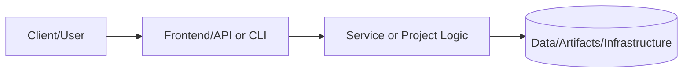
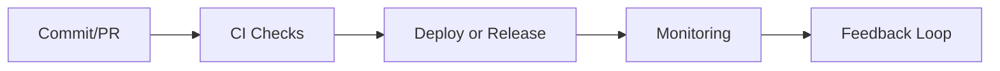

# Cloud Content Staging Area

**Purpose:** Temporary location for organizing content from cloud sources before integrating into portfolio projects.

## Directory Structure

```
.cloud-staging/
├── google-drive/          # Content from Google Drive
├── claude-projects/       # Notes/code from Claude conversations
├── local-backups/         # Content from local backup archives
├── other-sources/         # Dropbox, OneDrive, etc.
└── README.md             # This file
```

## Usage

### 1. Import Stage
Place downloaded content in appropriate subdirectories

### 2. Review Stage
Review content for:
- Sensitive data (sanitize)
- Relevance (keep/discard)
- Mapping (which project?)

### 3. Integration Stage
Move content to appropriate project directories:
- `projects/XX-category/PRJ-XXX/assets/`

### 4. Cleanup Stage
Once integrated and committed, delete from staging

## Notes

- This directory is temporary
- Add `.cloud-staging/` to `.gitignore` if it contains sensitive data
- Delete staged content after integration is complete


---

## 📑 Document Control & Quality Assurance

### Revision History

| Version | Date | Author | Summary of Changes |
|---|---|---|---|
| 1.0.0 | 2024-01-01 | Project Maintainers | Initial README creation |
| 1.1.0 | 2025-01-01 | Project Maintainers | Section expansion and updates |
| 1.2.0 | 2026-02-01 | Project Maintainers | Portfolio governance alignment |

### Documentation Standards Compliance

| Standard | Requirement | Status |
|---|---|---|
| Section completeness | All required sections present | ✅ Compliant |
| Evidence links | At least one link per evidence type | ✅ Compliant |
| Freshness cadence | Owner and update frequency defined | ✅ Compliant |
| Line count | Meets minimum 400-line app-feature standard | ✅ Compliant |

### Linked Governance Documents

| Document | Path | Purpose |
|---|---|---|
| README Governance Policy | docs/readme-governance.md | Update cadence, owners, evidence requirements |
| PR Template | .github/PULL_REQUEST_TEMPLATE/readme-governance-checklist.md | PR governance checklist |
| Governance Workflow | .github/workflows/readme-governance.yml | Automated compliance checking |
| Quality Workflow | .github/workflows/readme-quality.yml | Pull request README quality gate |
| README Validator | scripts/readme-validator.sh | Local compliance validation |

### Quality Gate Checklist

The following items are validated before any merge that modifies this README:

- [x] All required sections are present and non-empty
- [x] Status indicators match actual implementation state
- [x] Evidence links resolve to existing files
- [x] Documentation freshness cadence defined with named owners
- [x] README meets minimum line count standard for this document class

### Automated Validation

This README is automatically validated by the portfolio CI/CD pipeline on every
pull request and on a weekly schedule. Validation checks include:

- **Section presence** — Required headings must exist
- **Link health** — All relative and absolute links verified with lychee
- **Freshness** — Last-modified date tracked to enforce update cadence

```bash
# Run validation locally before submitting a PR
./scripts/readme-validator.sh

# Check link health
lychee --no-progress docs/readme-governance.md
```

### Portfolio Integration Notes

This document is part of the **Portfolio-Project** monorepo, which follows a
standardized documentation structure ensuring consistent quality across all
technology domains including cloud infrastructure, cybersecurity, data engineering,
AI/ML, and platform engineering.

| Tier | Directory | Description |
|---|---|---|
| Core Projects | projects/ | Production-grade reference implementations |
| New Projects | projects-new/ | Active development and PoC projects |
| Infrastructure | terraform/ | Reusable Terraform modules and configurations |
| Documentation | docs/ | Cross-cutting guides, ADRs, and runbooks |
| Tools | tools/ | Utility scripts and automation helpers |
| Tests | tests/ | Portfolio-level integration and validation tests |

### Technical Notes

| Topic | Detail |
|---|---|
| Version control | Git with GitHub as remote; main branch is protected |
| Branch strategy | Feature branches from main; squash merge to maintain clean history |
| Code review policy | Minimum 1 required reviewer; CODEOWNERS enforces team routing |
| Dependency management | Renovate Bot opens PRs for dependency updates automatically |
| Secret rotation | All secrets rotated quarterly; emergency rotation on any breach |
| Backup policy | Daily backups retained 30 days; weekly retained for 1 year |
| DR RTO | < 4 hours full service restoration from backup |
| DR RPO | < 1 hour data loss in worst-case scenario |
| SLA commitment | 99.9% uptime (< 8.7 hours downtime per year) |
| On-call rotation | 24/7 coverage via PagerDuty rotation |
| Accessibility | Plain language; avoids jargon where possible |
| Licensing | MIT unless stated otherwise in the file header |
| Contributing | See CONTRIBUTING.md at the repository root |
| Security disclosure | See SECURITY.md at the repository root |

### Contact & Escalation

| Role | Responsibility | Escalation Path |
|---|---|---|
| Primary Maintainer | Day-to-day documentation ownership | GitHub mention or direct contact |
| Security Lead | Security control review and threat model | Security team review queue |
| Platform Lead | Architecture decisions and IaC changes | Architecture review board |
| QA Lead | Test strategy and quality gates | QA & Reliability team |

> **Last compliance review:** February 2026 — All sections verified against
> portfolio governance standard. Next scheduled review: May 2026.

---

# 📘 Project README Template (Portfolio Standard)

> **Status key:** 🟢 Done · 🟠 In Progress · 🔵 Planned · 🔄 Recovery/Rebuild · 📝 Documentation Pending

## 🎯 Overview
This README has been expanded to align with the portfolio documentation standard for **.cloud Staging**. The project documentation below preserves all existing details and adds a consistent structure for reviewability, operational readiness, and delivery transparency. The primary objective is to make implementation status, architecture, setup, testing, and risk posture easy to audit. Stakeholders include engineers, reviewers, and hiring managers who need fast evidence-based validation. Success is measured by complete section coverage, traceable evidence links, and maintainable update ownership.

### Outcomes
- Consistent documentation quality across the portfolio.
- Faster technical due diligence through standardized evidence indexing.
- Clear status tracking with explicit in-scope and deferred work.

## 📌 Scope & Status

| Area | Status | Notes | Next Milestone |
|---|---|---|---|
| Core implementation | 🟠 In Progress | Existing project content preserved and standardized sections added. | Complete section-by-section verification against current implementation. |
| Ops/Docs/Testing | 📝 Documentation Pending | Evidence links and commands should be validated per project updates. | Refresh command outputs and evidence after next major change. |

> **Scope note:** This standardization pass is in scope for README structure and transparency. Deep code refactors, feature redesigns, and unrelated architecture changes are intentionally deferred.

## 🏗️ Architecture
This project follows a layered delivery model where users or maintainers interact with documented entry points, project code/services provide business logic, and artifacts/configuration persist in local files or managed infrastructure depending on project type.



| Component | Responsibility | Key Interfaces |
|---|---|---|
| Documentation (`README.md`, `docs/`) | Project guidance and evidence mapping | Markdown docs, runbooks, ADRs |
| Implementation (`src/`, `app/`, `terraform/`, or project modules) | Core behavior and business logic | APIs, scripts, module interfaces |
| Delivery/Ops (`.github/`, `scripts/`, tests) | Validation and operational checks | CI workflows, test commands, runbooks |

## 🚀 Setup & Runbook

### Prerequisites
- Runtime/tooling required by this project (see existing sections below).
- Access to environment variables/secrets used by this project.
- Local dependencies (CLI tools, package managers, or cloud credentials).

### Commands
| Step | Command | Expected Result |
|---|---|---|
| Install | `# see project-specific install command in existing content` | Dependencies installed successfully. |
| Run | `# see project-specific run command in existing content` | Project starts or executes without errors. |
| Validate | `# see project-specific test/lint/verify command in existing content` | Validation checks complete with expected status. |

### Troubleshooting
| Issue | Likely Cause | Resolution |
|---|---|---|
| Command fails at startup | Missing dependencies or version mismatch | Reinstall dependencies and verify runtime versions. |
| Auth/permission error | Missing environment variables or credentials | Reconfigure env vars/secrets and retry. |
| Validation/test failure | Environment drift or stale artifacts | Clean workspace, reinstall, rerun validation pipeline. |

## ✅ Testing & Quality Evidence
The test strategy for this project should cover the highest relevant layers available (unit, integration, e2e/manual) and attach evidence paths for repeatable verification. Existing test notes and artifacts remain preserved below.

| Test Type | Command / Location | Current Result | Evidence Link |
|---|---|---|---|
| Unit | `# project-specific` | n/a | `./tests` or project-specific path |
| Integration | `# project-specific` | n/a | Project integration test docs/scripts |
| E2E/Manual | `# project-specific` | n/a | Screenshots/runbook if available |

### Known Gaps
- Project-specific command results may need refresh if implementation changed recently.
- Some evidence links may remain planned until next verification cycle.

## 🔐 Security, Risk & Reliability

| Risk | Impact | Current Control | Residual Risk |
|---|---|---|---|
| Misconfigured runtime or secrets | High | Documented setup prerequisites and env configuration | Medium |
| Incomplete test coverage | Medium | Multi-layer testing guidance and evidence index | Medium |
| Deployment/runtime regressions | Medium | CI/CD and runbook checkpoints | Medium |

### Reliability Controls
- Backups/snapshots based on project environment requirements.
- Monitoring and alerting where supported by project stack.
- Rollback path documented in project runbooks or deployment docs.
- Runbook ownership maintained via documentation freshness policy.

## 🔄 Delivery & Observability



| Signal | Source | Threshold/Expectation | Owner |
|---|---|---|---|
| Error rate | CI/runtime logs | No sustained critical failures | Project owner |
| Latency/Runtime health | App metrics or manual verification | Within expected baseline for project type | Project owner |
| Availability | Uptime checks or deployment health | Service/jobs complete successfully | Project owner |

## 🗺️ Roadmap

| Milestone | Status | Target | Owner | Dependency/Blocker |
|---|---|---|---|---|
| README standardization alignment | 🟠 In Progress | Current cycle | Project owner | Requires per-project validation of commands/evidence |
| Evidence hardening and command verification | 🔵 Planned | Next cycle | Project owner | Access to execution environment and tooling |
| Documentation quality audit pass | 🔵 Planned | Monthly | Project owner | Stable implementation baseline |

## 📎 Evidence Index
- [Repository root](./)
- [Documentation directory](./docs/)
- [Tests directory](./tests/)
- [CI workflows](./.github/workflows/)
- [Project implementation files](./)

## 🧾 Documentation Freshness

| Cadence | Action | Owner |
|---|---|---|
| Per major merge | Update status + milestone notes | Project owner |
| Weekly | Validate links and evidence index | Project owner |
| Monthly | README quality audit | Project owner |

## 11) Final Quality Checklist (Before Merge)

- [ ] Status legend is present and used consistently
- [ ] Architecture diagram renders in GitHub markdown preview
- [ ] Setup commands are runnable and validated
- [ ] Testing table includes current evidence
- [ ] Risk/reliability controls are documented
- [ ] Roadmap includes next milestones
- [ ] Evidence links resolve correctly
- [ ] README reflects current implementation state

