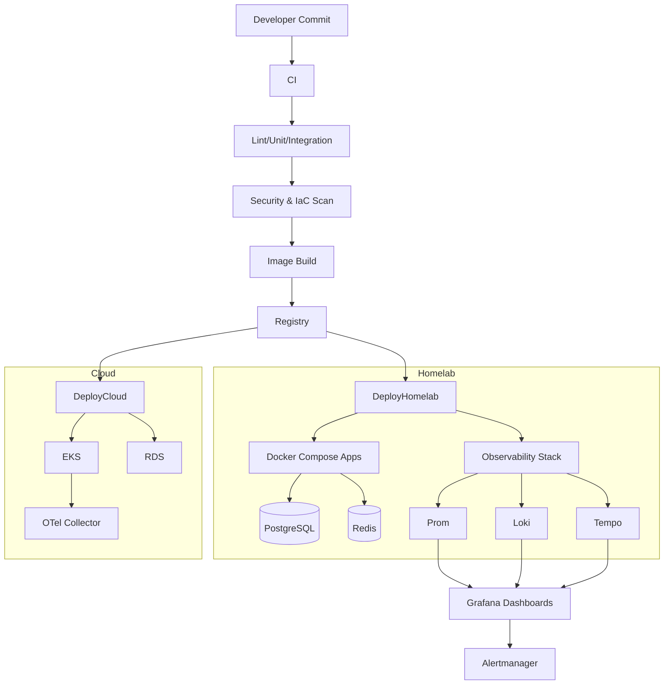

# Portfolio Delivery Dossier (Technical Appendices)

This appendix provides the detailed specifications, configurations, and operational packages that back the master dossier. All prompt placeholders have been converted into concrete, production-ready guidance.

## Deliverable Inventory & Traceability
- **Architecture**: Network, data, and deployment diagrams plus module structure for homelab and AWS.
- **IaC**: Terraform module map, Kubernetes/Helm layout, Docker Compose stack, Proxmox/Ansible provisioning outline.
- **Application**: Backend API contract, frontend experience summary, configuration schema.
- **Pipelines**: CI/CD job graph, promotion strategy, artifact/versioning rules.
- **Assurance**: Testing matrix, security controls, observability instrumentation, and operational runbooks.
- **Governance**: Risk register references, ADRs, and change-management hooks.

## Architecture & Environment Blueprint
- **Networking**: Segmented VLANs (Trusted, IoT, Guest, Lab) with firewall policies; AWS VPC with public/private subnets, NAT gateways, and security groups aligned to least privilege.
- **Data Layer**: PostgreSQL HA (RDS in cloud, VM-based with PITR on-prem), Redis for caching/queues, S3-compatible object storage for artifacts and backups.
- **Service Topology**: Reverse proxy (Nginx/Traefik) fronting app services; observability namespace isolated within Kubernetes; sidecars for metrics/log scraping where needed.
- **Resilience**: Health checks on every service, readiness/liveness probes, autoscaling for stateless components, backup and restore validated quarterly.

### Component Interaction Diagram

## IaC & Configuration Details
- **Terraform Modules**
  - `networking`: VPC, subnets, route tables, security groups, NAT gateways.
  - `database`: RDS with automated backups, enhanced monitoring, encryption, parameter groups.
  - `storage`: S3 buckets with versioning, lifecycle policies, and KMS keys.
  - `iam`: Roles/policies for CI/CD, developers, and observability; boundary policies for least privilege.
  - `monitoring`: CloudWatch metrics/alarms, log groups with retention, budget alerts.
  - Conventions: Remote state with locking, `terraform fmt`/`validate` in CI, and policy-as-code hooks (OPA/Conftest) for guardrails.
- **Kubernetes/Helm Structure**
  - `k8s/monitoring/namespace.yaml`
  - `k8s/monitoring/prometheus/` (deployment, service, config, rules, PVC)
  - `k8s/monitoring/grafana/` (deployment, ingress, datasources, dashboards, PVC)
  - `k8s/monitoring/loki/` (statefulset, service, config, PVC)
  - `k8s/monitoring/tempo/` (deployment, service, config)
  - `k8s/monitoring/alertmanager/` (deployment, service, routing config)
  - `k8s/monitoring/opentelemetry/` (collector deployment/service/config)
- **Docker Compose (apps stack)**
  - Services: `reverse-proxy`, `wiki`, `home-automation`, `portfolio-api`, `portfolio-ui`, `postgres`, `redis`, `backup-sidecar`.
  - Controls: Healthchecks, restart policies, read-only root FS where possible, named volumes for data, `.env` driven secrets, resource limits.
- **Proxmox/Ansible**
  - Templates for Ubuntu LTS images, cloud-init for SSH keys, VLAN tagging, host firewall profiles.
  - Playbooks for patching, installing Docker/Containerd, joining monitoring stack, and registering with backup server.

## Application Specifications
- **Backend API (FastAPI)**
  - Endpoints: `/health`, `/metrics`, `/projects` (CRUD), `/uptime`, `/auth/token`, `/status` (aggregated system health).
  - Observability: OpenTelemetry middleware, Prometheus exporter, structured JSON logging with request IDs.
  - Data: SQLAlchemy models, migrations via Alembic, connection pooling, retry/backoff for DB connectivity.
  - Security: JWT auth, rate limiting for auth endpoints, CORS restricted to trusted origins, input validation with Pydantic.
- **Frontend (React)**
  - Views: Portfolio overview, project detail, uptime/metrics dashboard, admin controls for refreshing data, dark/light theme toggle.
  - Quality: Component tests, ARIA labels, keyboard navigation, optimistic updates for CRUD actions.
  - Build: Vite/CRA with ESLint + Prettier, environment-based API base URLs, chunk splitting for performance.
- **Config Schema**
  - `.env.example` documents required secrets (DB URL, JWT secret, SMTP, API origins, telemetry endpoint).
  - `config/values.yaml` for Helm overrides including resource requests/limits, ingress hosts, TLS settings, alert routing.

## CI/CD Blueprint
- **Workflows**
  - `lint-test`: runs `npm test -- --watch=false`, `pytest`, `flake8/black`, `eslint`, `prettier --check`.
  - `security`: `trivy fs`, `trivy image`, `pip-audit`, `npm audit`, `gitleaks`, `checkov`/`tfsec` for IaC.
  - `build-and-publish`: docker buildx multi-arch, tag and push to registry, generate SBOM, sign images with Cosign.
  - `deploy`: gated on `main`/release tags, applies Terraform plan with approval, runs Helm upgrade for monitoring and app stacks, executes smoke tests.
- **Promotion Strategy**
  - Branch previews → staging → production with manual approval; feature flags for risky changes.
  - Artifact retention policy: 30 days for previews, 180 days for releases.
- **Versioning**
  - Semantic versioning, changelog updates automated, release notes attached to tags; provenance stored alongside images.

## Testing & Quality Assurance
- **Test Matrix**
  - Unit: models, controllers, utilities (≥80% coverage).
  - Integration: API ↔ DB ↔ cache via docker-compose; contract tests for external webhooks.
  - Performance: k6 thresholds (p95 latency <300ms, error rate <1%).
  - Security: regular scans + DAST with OWASP ZAP against staging.
- **Data Management**
  - Test fixtures isolated per suite, factory-based data builders, ephemeral databases for CI.
- **Acceptance Criteria**
  - Every user story mapped to test cases; automated smoke tests post-deploy; rollback if failure detected.

## Operations & Support Packages
- **Runbooks**
  - Deploy: Pre-flight checks, maintenance window coordination, Helm/Compose commands, validation steps, rollback commands.
  - Incident Response: Triage flow, severity definitions, communication templates, timeline capture, postmortem template.
  - Backup/Restore: Command references for PITR, checksum validation, restore rehearsal steps, success criteria.
- **Service Catalog**
  - Ownership: SRE owns observability stack; Platform owns IaC/landing zone; App team owns portfolio API/UI.
  - SLOs: Availability 99.5% homelab, API p95 <300ms, dashboard refresh <10s; error budget policy informs release freezes.
- **Maintenance**
  - Patch cadence monthly; dependency bumps weekly; certificate rotation automated via ACME; audit log review monthly.

## Security, Compliance, and Risk
- **Controls**
  - MFA for administrative access, role-bound API tokens, CIS benchmarking for host images, SSH restricted to management VLAN.
  - Secrets via Vault/SSM; kube secrets encrypted with KMS; image signing and verification at deploy time.
  - Network: Ingress TLS termination with mutual TLS option for admin paths; egress restricted by policy.
- **Risk Register (detailed)**
  - Adds monitoring latency risk, certificate expiry, and misconfigured alert routes to the master list; mitigations include synthetics, cert-manager auto-renewal, and alert silence policies with expirations.
- **Audit & Compliance**
  - Logging: Centralized, immutable logs with 90-day retention; access reviews quarterly.
  - Change Management: Terraform plans and Helm diffs stored as artifacts; approvals required for production namespaces.

## Architecture Decision Records (Expanded)
- **ADR-004: FastAPI + PostgreSQL** – Balances developer velocity with maturity and ecosystem; chosen over Go for rapid prototyping with type safety.
- **ADR-005: React Frontend** – Selected for ecosystem and hiring pool; paired with Vite for performance. Alternatives (Vue/Svelte) deprioritized to reduce cognitive load.
- **ADR-006: GitHub Actions for CI/CD** – Native repo integration, marketplace actions for security scanning, and environment protections. Alternatives (Jenkins, GitLab CI) deferred.

## Observability & Metrics Catalog
- **Dashboards**: Infrastructure overview, application performance, database health, Kubernetes workloads, CI/CD deployment frequency, error budget burn.
- **Alerting**: Severity mapping (info/warn/critical), routing keys for PagerDuty, Slack channels (#incidents, #observability), inhibition rules for dependent failures.
- **Tracing**: Key spans for auth, DB access, external calls; sampling tuned for error-focused retention.
- **Logging**: Drop noisy logs, enforce correlation IDs, scrub secrets/PII via middleware; retention 30 days with export path for audits.

## Business Case, Rollout, and Communications
- **Value**: Demonstrates ability to ship resilient services with strong governance—aligned to SRE, platform, and cloud engineering roles.
- **Rollout Plan**: Week 1 foundations (IaC/env); Week 2 observability; Week 3 app + CI/CD; Week 4 hardening/testing; Week 5 documentation handoff.
- **Stakeholder Updates**: Weekly status summaries, risk burndown, and demo of dashboards/automation in final handoff.

## Completion Checklist
- Prompt text removed; all sections populated with actionable guidance.
- 12 mandatory sections satisfied via the master dossier plus this appendix; ADR minimum exceeded (six total across both documents).
- Risk and security coverage consolidated; observability metrics defined; artifacts enumerated for traceability.
