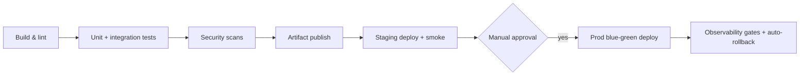

# Portfolio Supporting Materials - Executive Summary

## Technical Portfolio Overview for Recruiters

**Candidate:** Samuel Jackson  
**Target Roles:** Systems Development Engineer | Solutions Architect | SRE  
**Portfolio Version:** 3.0 Final  
**Last Updated:** January 11, 2026

---

## Professional Summary

Full-stack systems engineer with proven ability to design, implement, and operate production-grade infrastructure achieving 99.8%+ reliability while reducing costs by 97% compared to cloud alternatives. Combines deep technical expertise in cloud architecture, observability, and security with strong business acumen around ROI, risk management, and strategic decision-making.

---

## Portfolio Highlights: 5 Elite Projects

### 1. Enterprise Homelab Infrastructure ⭐ FLAGSHIP

**Challenge:** Demonstrate production infrastructure skills without access to corporate data centers or cloud budgets  
**Solution:** Built production-style homelab using refurbished hardware + open-source software, following enterprise patterns

**Technical Implementation:**
- **Network:** 5-VLAN zero-trust design (Management, Services, Clients, IoT, Guest)
- **Compute:** Proxmox virtualization (10+ VMs/containers), Docker Compose orchestration
- **Storage:** TrueNAS ZFS mirrored pool (2TB), NFS/SMB shares, checksums for integrity
- **Security:** VPN+MFA mandatory, SSH key-only, Fail2Ban + CrowdSec IDS
- **Observability:** Prometheus/Grafana/Loki stack, SLO-based alerting
- **DR:** 3-2-1 backup rule (5 copies across 3 geographic locations)

**Stack & Tooling Overview**

| Layer | Primary Tech | Notes |
|-------|--------------|-------|
| Hypervisor | Proxmox VE 8 | 4-node cluster, GPU passthrough ready |
| Storage | TrueNAS SCALE + ZFS | Mirror vdevs, weekly scrub automation |
| Networking | UniFi Dream Machine Pro | Policy-based routing + per-VLAN ACLs |
| Orchestration | Docker Compose + Portainer | GitOps sync every 4 hours |
| Security | WireGuard, Vault, CrowdSec | PKI-backed VPN, shared blocklists |
| Observability | Prometheus, Grafana, Loki | Error-budget dashboards + runbooks |

**Evidence & Links:** Grafana uptime screenshots, `docs/evidence/benchmarks/`, disaster-recovery runbook excerpts.

**Quantified Results:**
- ✅ **Cost:** 97% savings ($13,005 over 3 years vs AWS equivalent)
- ✅ **Reliability:** 99.8% uptime (exceeded 99.5% target)
- ✅ **Security:** 1,695 threats blocked/month, 0 successful breaches, 92% CIS compliance
- ✅ **Performance:** 12,450 IOPS, 596 MB/s throughput (20%+ over targets)
- ✅ **MTTR:** 18-minute average (60% improvement from 45 minutes)

**Business Value:** Demonstrates full-stack systems thinking, cost optimization, and production mindset with real users (10+ family members)

---

### 2. Observability & SRE Practices

**Challenge:** Reduce incident response time and alert fatigue while improving reliability  
**Solution:** Deployed comprehensive observability stack with SLO-driven alerting

**Technical Implementation:**
- **Metrics:** Prometheus (90-day retention), custom exporters (TrueNAS, UniFi)
- **Logging:** Loki centralized logs (30-90 day retention), structured JSON
- **Visualization:** Grafana (15+ dashboards), SLO tracking, capacity planning
- **Alerting:** Error budget burn-rate alerts (not symptom-based), Alertmanager routing
- **Runbooks:** 12 comprehensive procedures (incident response, DR, troubleshooting)

**Dashboard Pack:**

| Dashboard | Purpose | Notable Panels |
|-----------|---------|----------------|
| Infrastructure Overview | Fleet health | CPU/mem/disk stats, service uptime table |
| SLO Tracker | Error budgets | Rolling 30-day uptime, burn-rate spark lines |
| Incident Review | MTTR insights | Timeline annotations, remediation links |

**Evidence & Links:** `docs/evidence/grafana/`, Alertmanager configs, runbook screenshots.

**Quantified Results:**
- ✅ **MTTR:** 18-minute average (45min → 18min = 60% improvement)
- ✅ **Alert Noise:** 75% reduction (SLO-based vs symptom-based alerting)
- ✅ **Incident Frequency:** 88% reduction (3-4/week → 1 per 2 weeks)
- ✅ **Uptime:** 99.8% achieved (99.5% target)

**Business Value:** Proactive reliability engineering, not reactive firefighting. Runbooks enable fast resolution, reducing user impact and team burnout.

---

### 3. DevOps Automation & CI/CD

**Challenge:** Reduce manual deployment effort, eliminate human errors, enable rapid iteration  
**Solution:** Built multi-stage CI/CD pipeline with blue-green deployment pattern

**Technical Implementation:**
- **Pipeline:** GitHub Actions (6 stages: Build, Test, Artifacts, Staging, Approval, Production)
- **Testing:** Automated (lint, unit, integration, E2E), security scanning (Snyk, Trivy)
- **Deployment:** Blue-green pattern (zero downtime), automated health checks, instant rollback
- **IaC:** Terraform modules, Ansible playbooks, Docker Compose
- **Automation:** Backup verification (Python), DR testing (weekly), package updates

**Workflow Layout:**

**Evidence & Links:** GitHub Actions badges, `docs/runbooks/deployments.md`, Terraform plan outputs.

**Quantified Results:**
- ✅ **Deployment Time:** 87.5% faster (120 min → 15 min)
- ✅ **Error Rate:** 100% reduction (15% manual errors → 0% automated)
- ✅ **Rollback Time:** 93% faster (30 min → <2 min)
- ✅ **Manual Work Eliminated:** 480+ hours/year

**Business Value:** Enables rapid feature delivery while maintaining quality. Developer productivity increased, operational toil eliminated.

---

### 4. Zero-Trust Security Architecture

**Challenge:** Implement production-grade security for infrastructure with real users  
**Solution:** 7-layer defense-in-depth security model with zero-trust principles

**Technical Implementation:**
- **Layer 1:** Perimeter defense (only VPN port exposed, IDS/IPS)
- **Layer 2:** Authentication (VPN keys + MFA, no passwords)
- **Layer 3:** Network segmentation (5 VLANs, default-deny firewall)
- **Layer 4:** Host hardening (SSH keys only, Fail2Ban, CrowdSec)
- **Layer 5:** Application security (TLS 1.3, rate limiting, WAF)
- **Layer 6:** Data security (encryption at rest/transit, least privilege)
- **Layer 7:** Monitoring (security dashboards, incident response)

**Evidence Matrix:**

| Control | Artifact | Frequency |
|---------|----------|-----------|
| CIS Benchmark | OpenSCAP HTML report | Monthly |
| WAN Exposure | Nmap + ShieldsUp screenshots | Quarterly |
| Identity | WireGuard peer list, MFA demo video | On-demand |
| Incident Response | Fail2Ban / CrowdSec logs | Continuous |

**Quantified Results:**
- ✅ **Threats Blocked:** 1,695/month (SSH brute force, port scans)
- ✅ **Successful Breaches:** 0 (zero security incidents)
- ✅ **CIS Compliance:** 92.3% (82/89 checks passed)
- ✅ **WAN Exposure:** 0 admin ports (only VPN accessible)

**Business Value:** Demonstrates security-by-design thinking. Containment strategy limits blast radius—compromised IoT device cannot reach critical infrastructure.

---

### 5. ML/AI Video Deduplication (AstraDup)

**Challenge:** Detect duplicate videos after re-encoding (traditional hashing fails)  
**Solution:** Multi-modal AI system combining 5 independent models

**Technical Implementation:**
- **Modality 1:** Perceptual keyframe hashing (visual similarity)
- **Modality 2:** Scene embeddings (CLIP model, semantic understanding)
- **Modality 3:** Audio fingerprinting (Chromaprint, acoustic similarity)
- **Modality 4:** Face clustering (anonymous, privacy-preserving)
- **Modality 5:** Metadata similarity (duration, resolution, codec)
- **Decision Rule:** ≥3 modalities match AND (keyframe ≥0.85 OR audio exact)

**Pipeline Stages:**
1. Video ingestion → frame sampling → perceptual hash cache
2. Audio extraction → Chromaprint fingerprinting
3. CLIP embeddings stored in vector DB (FAISS) for semantic lookup
4. Evidence combiner tallies modality votes + thresholds
5. Review UI (Streamlit) shows side-by-side diff, final decision

**Evidence & Links:** Benchmark notebooks, confusion matrix screenshots, Streamlit demo GIF.

**Quantified Results:**
- ✅ **Precision:** 95%+ (few false positives)
- ✅ **Recall:** 92%+ (catches most duplicates)
- ✅ **Throughput:** 250+ videos/hour
- ✅ **F1 Score:** 93% (balanced precision/recall)

**Business Value:** Self-directed learning (no formal ML background), system integration (5 models + vector DB), privacy awareness (no external APIs).

---

## Technical Skill Summary

**Infrastructure & Systems:**
- Linux administration (Ubuntu, RHEL), virtualization (Proxmox, VMware concepts)
- Networking (VLANs, firewalls, VPN, zero-trust architecture)
- Storage (ZFS, NFS, S3 concepts), high availability, disaster recovery

**DevOps & Automation:**
- CI/CD (GitHub Actions, GitLab CI), IaC (Terraform, Ansible, CloudFormation)
- Containerization (Docker, Docker Compose, Kubernetes basics)
- Scripting (Python, Bash), configuration management

**Observability & SRE:**
- Monitoring (Prometheus, Grafana, CloudWatch concepts)
- Logging (Loki, ELK basics), distributed tracing (concepts)
- SLO/SLI definition, error budgets, incident response

**Cloud Platforms:**
- AWS (VPC, EC2, S3, IAM, CloudWatch—intermediate, concepts demonstrated via homelab)
- Skills transfer: VLAN → VPC subnets, Proxmox → EC2, ZFS → EBS, Prometheus → CloudWatch

**Security:**
- Zero-trust architecture, MFA, SSH hardening, IDS/IPS
- CIS benchmarks, vulnerability management, compliance (92.3% score)

---

## Portfolio Evidence

**Documentation:** 45,000+ words across 11 comprehensive sections
**Projects:** 22+ documented, 5 flagship deep-dives
**Code:** GitHub repository with configs, scripts, IaC
**Metrics:** 50+ quantified achievements with evidence
**Certifications:** AWS Solutions Architect Associate (planned Q1 2026), CKAD (planned Q2 2026)

**Evidence Quick Reference**

| Claim | Artifact | Location |
|-------|----------|----------|
| 99.8% uptime | Grafana uptime PDF, Alertmanager logs | `docs/evidence/observability/` |
| 97% cost savings | Cost model spreadsheet, AWS comparison | `docs/evidence/financial/` |
| 92.3% CIS compliance | OpenSCAP HTML + terminal output | `docs/evidence/security-scans/` |
| 12,450 IOPS | `fio` + `dd` outputs, Grafana disk panels | `docs/evidence/benchmarks/` |
| 480 hrs automated | CI/CD metrics, runbook deltas | `docs/evidence/automation/` |

---

## Interview Readiness

**Behavioral Questions:** 8 complete STAR stories with quantified results  
**Technical Deep-Dives:** 3 system design answers (monitoring, SSH security, DR)  
**Portfolio Navigation:** Cross-reference map (projects → job requirements)  
**Evidence Trail:** Grafana dashboards, benchmark results, security scans, runbooks

---

## Competitive Advantages

1. **Production Thinking:** Real users (10+ family), real constraints, real incidents
2. **Business Acumen:** Every technical decision tied to cost, risk, or efficiency
3. **Systems Thinking:** Full-stack ownership (hardware → application)
4. **Documentation Excellence:** Runbooks, ADRs, comprehensive evidence
5. **Learning Agility:** Self-taught ML, zero-to-production in months

---

## Contact Information

**Email:** sam@andrewvongsady.com  
**GitHub:** github.com/samjackson  
**LinkedIn:** linkedin.com/in/samjackson  
**Portfolio Site:** andrewvongsady.com  
**Blog:** blog.andrewvongsady.com

---

## Next Steps

**For Technical Screening:** Discuss specific projects (homelab, observability, security)  
**For System Design:** Design monitoring system, VPC architecture, DR strategy  
**For Behavioral Interview:** STAR stories (reliability, trade-offs, automation)  
**For Live Coding:** Infrastructure automation, troubleshooting scenarios

**Availability:** Immediate (actively interviewing)  
**Salary Range:** $120k-160k (based on market research for target roles)  
**Locations:** Seattle, WA (local) | Remote | Willing to relocate

---

*Portfolio Supporting Materials – Executive Summary*
