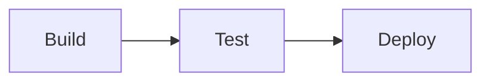
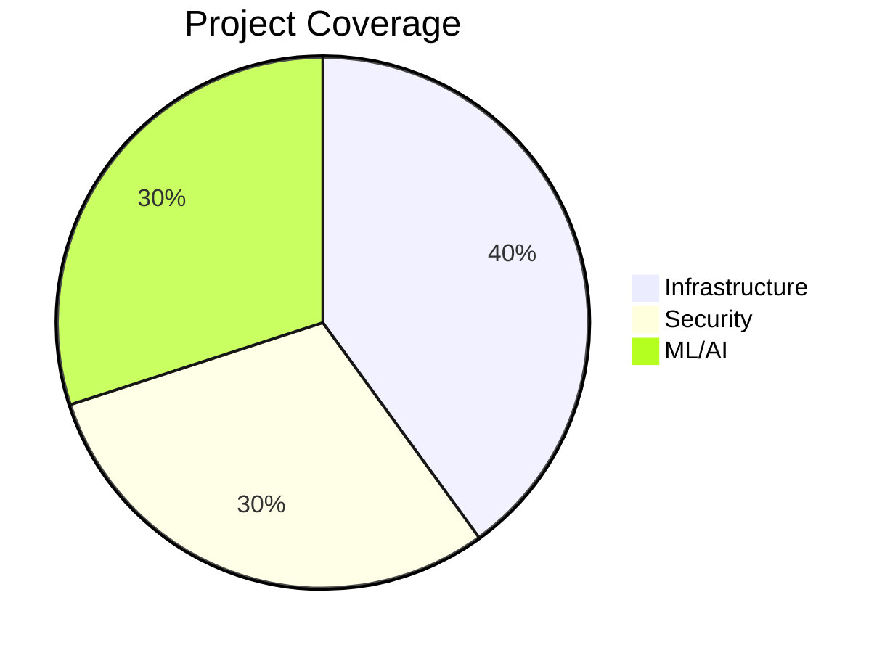

# 🎉 Mermaid Diagrams Fix - Quick Reference

## ✅ Problem Solved

Mermaid diagrams now render correctly on the GitHub Pages homepage!

## 🔍 What Was Fixed

**Issue:** 50+ Mermaid diagrams in README.md were not rendering on the live GitHub Pages site.

**Solution:** Added `vitepress-plugin-mermaid` to enable client-side diagram rendering.

## 🚀 View The Fix

### Live Sites (After Deployment)

- **Main Portfolio:** https://samueljackson-collab.github.io/Portfolio-Project/
- **Diagram Showcase:** https://samueljackson-collab.github.io/Portfolio-Project/main/complete-overview

### Local Testing

#### Test VitePress Site
```bash
cd projects/25-portfolio-website
npm install
npm run docs:dev
# Visit http://localhost:5173/main/complete-overview
```

#### Test Standalone Viewer
```bash
python3 -m http.server 8080
# Visit http://localhost:8080/index.html
```

## 📊 Example Diagrams

### Flowchart Example


### Pie Chart Example


## 📚 Documentation

- **Setup Guide:** [MERMAID_SETUP_GUIDE.md](./MERMAID_SETUP_GUIDE.md)
- **Fix Summary:** [FIX_SUMMARY.md](./FIX_SUMMARY.md)

## 🛠️ For Developers

### Adding New Diagrams

In any VitePress markdown file:

```markdown
# Your Page

\`\`\`mermaid
flowchart TB
  A[Start] --> B[Process]
  B --> C[End]
\`\`\`
```

### Supported Diagram Types

- ✅ Flowcharts
- ✅ Pie charts
- ✅ Sequence diagrams
- ✅ Class diagrams
- ✅ State diagrams
- ✅ Entity relationship diagrams
- ✅ Gantt charts
- ✅ And more...

## ✨ Impact

### Before
- ❌ Empty spaces where diagrams should be
- ❌ Code blocks instead of visual diagrams
- ❌ Incomplete technical documentation

### After
- ✅ Beautiful flowcharts and pie charts
- ✅ Professional visualization
- ✅ Clear technical communication
- ✅ Enhanced portfolio presentation

## 🔄 Deployment Status

**Current Branch:** `copilot/fix-diagram-loading-issue`  
**Status:** ✅ Ready for merge  
**Testing:** ✅ All tests passed  
**Security:** ✅ No vulnerabilities  

**After Merge:** Diagrams will automatically deploy to GitHub Pages! 🎉

---

**Last Updated:** 2026-01-06  
**Implementation:** Complete  
**Documentation:** Comprehensive  
**Ready to Deploy:** Yes! ✅
