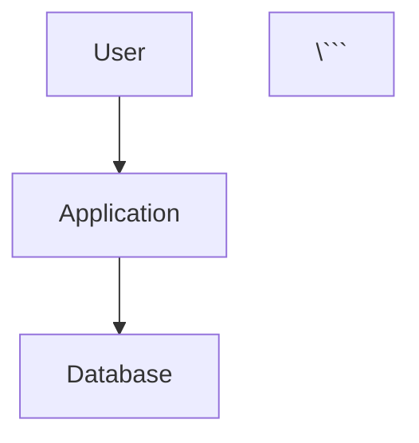

# 🚀 Portfolio Infrastructure Quick Start Guide

## 📋 Overview

This portfolio includes comprehensive automation infrastructure for building, managing, and tracking your professional portfolio. The tools help you maintain consistency, track progress, and present your work professionally.

## 🎯 What's Included

### 🌐 Portfolio Website
- **Location**: `portfolio-website/index.html`
- **Purpose**: Professional landing page with project showcase
- **Deployment**: GitHub Pages ready
- **Features**: Responsive design, project cards, skills matrix

### 📊 Automation Scripts
- **generate-diagrams.py** - Create architecture diagrams
- **take-screenshots.sh** - Screenshot organization guide
- **portfolio-metrics.py** - Progress tracking and analytics
- **setup-portfolio-infrastructure.sh** - One-command setup

### 📁 Organized Structure
```
Portfolio-Project/
├── portfolio-website/     # GitHub Pages landing site
├── assets/               # Visual assets
│   ├── diagrams/        # Architecture diagrams (5 ready-to-use)
│   ├── screenshots/     # Organized by category
│   └── videos/         # Demo recordings
├── demos/               # Interactive demos
├── docs/                # Technical documentation hub
├── projects/            # 54 project implementations
└── scripts/             # Automation toolkit
```

## 🚀 Quick Start (5 Minutes)

### Step 1: Generate Architecture Diagrams
```bash
python3 scripts/generate-diagrams.py
```

**Output**: 5 professional architecture diagrams in `assets/diagrams/`:
- homelab-architecture.mmd
- aws-vpc-architecture.mmd
- monitoring-stack.mmd
- kubernetes-cicd.mmd
- postgresql-ha.mmd

### Step 2: Check Your Progress
```bash
python3 scripts/portfolio-metrics.py
```

**Output**:
- Portfolio completion percentage
- Project breakdown by status
- Documentation statistics
- Infrastructure inventory

### Step 3: View Your Metrics
```bash
cat portfolio-metrics.json | python3 -m json.tool
```

## 📊 Current Portfolio Status

Based on the latest metrics scan:

- **Total Projects**: 54
- **Overall Completion**: ~10% (huge growth potential!)
- **With Documentation**: 46/54 (85%)
- **With Code**: 33/54 (61%)
- **Markdown Files**: 407 (506,000+ words!)
- **Infrastructure**: 25 Docker Compose, 81 Terraform files

## 🎨 Using Architecture Diagrams

### View in Browser
1. Copy diagram content from `assets/diagrams/*.mmd`
2. Open https://mermaid.live
3. Paste content to see visualization
4. Export as PNG/SVG if needed

### Embed in Documentation
```markdown
# Project Architecture



### Convert to PNG (Optional)
```bash
# Install mermaid-cli
npm install -g @mermaid-js/mermaid-cli

# Convert diagram
mmdc -i assets/diagrams/homelab-architecture.mmd \
     -o assets/diagrams/homelab-architecture.png
```

## 📸 Screenshot Organization

### Interactive Guide
```bash
bash scripts/take-screenshots.sh
```

This launches an interactive menu to guide you through capturing screenshots for:
- Homelab infrastructure (Proxmox, services, monitoring)
- AWS cloud projects (VPC, EC2, RDS, CloudWatch)
- Monitoring dashboards (Prometheus, Grafana, Loki)
- Demo applications

### Screenshot Best Practices
1. **Resolution**: 1920x1080 minimum
2. **Format**: PNG (use optipng for optimization)
3. **Privacy**: Redact IPs, credentials, account IDs
4. **Organization**: Use category folders
5. **Naming**: Descriptive kebab-case names

### Quick Screenshot (Chrome/Edge)
1. F12 → DevTools
2. Ctrl+Shift+P → Command Palette
3. Type "screenshot"
4. Select "Capture full size screenshot"

## 📚 Documentation Hub

### Main Documentation
- **Docs Hub**: `docs/README.md`
- **Assets Guide**: `assets/README.md`
- **Scripts Guide**: `scripts/README.md`
- **This Guide**: `PORTFOLIO_INFRASTRUCTURE_GUIDE.md`

### Quick Reference
```bash
# View documentation structure
tree docs/ -L 2

# Count documentation
find docs/ -name "*.md" | wc -l

# Search documentation
grep -r "keyword" docs/
```

## 🌐 Deploy to GitHub Pages

### Option 1: Automatic (GitHub Actions)
The repository includes `.github/workflows/deploy-portfolio.yml` which auto-deploys on push to main.

### Option 2: Manual Setup
1. Go to repository **Settings** → **Pages**
2. Source: **Deploy from a branch**
3. Branch: **main** or **gh-pages**
4. Folder: **/portfolio-website** (or root)
5. Save

Your site will be at:
```
https://samueljackson-collab.github.io/Portfolio-Project/
```

### Add Custom Domain (Optional)
```bash
echo "yourdomain.com" > portfolio-website/CNAME
git add portfolio-website/CNAME
git commit -m "Add custom domain"
git push
```

## 📈 Track Your Progress

### Weekly Workflow
```bash
# 1. Generate fresh metrics
python3 scripts/portfolio-metrics.py

# 2. Review completion percentage
grep "overall_completion" portfolio-metrics.json

# 3. Check project status
grep -A 10 "projects" portfolio-metrics.json | head -15
```

### Monthly Review
1. Run full metrics scan
2. Update high-priority projects
3. Capture new screenshots
4. Regenerate diagrams if architecture changed
5. Update portfolio website with new projects

### Completion Targets
- **Immediate** (This Week): Get to 20% completion
  - Complete 2-3 high-priority projects
  - Add screenshots to existing projects
  - Update project READMEs with status

- **Short-term** (This Month): Get to 50% completion
  - Complete 5-8 core projects
  - Full screenshot coverage
  - All diagrams documented

- **Long-term** (This Quarter): Get to 80%+ completion
  - Most projects implemented
  - Comprehensive documentation
  - Portfolio ready for job search

## 🎯 Next Steps by Priority

### 🔴 High Priority (This Week)
1. **Run metrics**: See where you are
   ```bash
   python3 scripts/portfolio-metrics.py
   ```

2. **Update top projects**: Focus on highest-value projects
   - PRJ-HOME-002 (Homelab) - Already at 85%!
   - PRJ-CLOUD-001 (AWS Terraform)
   - Monitoring Stack

3. **Capture screenshots**: Visual evidence is crucial
   ```bash
   bash scripts/take-screenshots.sh
   ```

### 🟡 Medium Priority (This Month)
1. **Generate all diagrams**: Professional architecture docs
2. **Update project READMEs**: Clear status and completion %
3. **Deploy portfolio website**: Make it live on GitHub Pages
4. **Add completion badges**: Visual progress indicators

### 🟢 Low Priority (Ongoing)
1. Document as you build
2. Regular metrics scans
3. Keep diagrams up-to-date
4. Optimize images periodically

## 🛠️ Daily Developer Workflow

### Morning
```bash
# Check yesterday's progress
python3 scripts/portfolio-metrics.py

# See what changed
git diff HEAD~1
```

### During Development
```bash
# Work on projects
cd projects/your-project/
# ... make changes ...

# Take screenshots as you go
# Save to ~/screenshots/ temporarily
```

### End of Day
```bash
# Organize screenshots
bash scripts/take-screenshots.sh

# Update metrics
python3 scripts/portfolio-metrics.py

# Commit progress
git add .
git commit -m "feat: Update PROJECT_NAME with CHANGES"
git push
```

## 🎓 Learning Resources

### Mermaid Diagrams
- Official Docs: https://mermaid.js.org/
- Live Editor: https://mermaid.live
- Examples: https://mermaid.js.org/ecosystem/tutorials.html

### GitHub Pages
- Official Guide: https://pages.github.com/
- Custom Domains: https://docs.github.com/en/pages/configuring-a-custom-domain-for-your-github-pages-site

### Portfolio Building
- Your own 407 markdown files are a goldmine!
- Review `docs/` for guides and templates
- Check successful projects for patterns

## 🐛 Troubleshooting

### Scripts Won't Run
```bash
# Make executable
chmod +x scripts/*.sh scripts/*.py

# Check Python version
python3 --version  # Need 3.8+
```

### Diagrams Won't Generate
```bash
# Check output directory
ls -la assets/diagrams/

# Run with explicit path
cd /home/user/Portfolio-Project
python3 scripts/generate-diagrams.py
```

### Metrics Look Wrong
```bash
# Verify you're in repo root
pwd  # Should end in Portfolio-Project

# Check projects directory
ls projects/ | wc -l

# Re-run analysis
python3 scripts/portfolio-metrics.py
```

### GitHub Pages Not Working
1. Check repository settings → Pages is enabled
2. Verify branch and folder settings
3. Check Actions tab for deployment status
4. Wait 2-3 minutes for DNS propagation

## 📊 Success Metrics

You'll know you're successful when:

- ✅ Portfolio website is live on GitHub Pages
- ✅ 5+ projects have screenshots
- ✅ 5+ projects show "Complete" status
- ✅ Overall completion > 50%
- ✅ Architecture diagrams for major projects
- ✅ Documentation is well-organized
- ✅ Metrics show steady weekly progress

## 💡 Pro Tips

1. **Start with what you have**: You already have 54 projects!
2. **Visual evidence wins**: Screenshots > descriptions
3. **Consistency matters**: Use the automation scripts
4. **Track progress**: Weekly metrics reviews
5. **Ship incrementally**: Don't wait for perfection
6. **Leverage your docs**: 506K words of documentation!

## 🎉 Quick Wins

Get fast results with these actions:

1. **5-minute win**: Deploy portfolio website
   ```bash
   git add portfolio-website/
   git commit -m "feat: Add portfolio landing page"
   git push
   # Enable GitHub Pages in settings
   ```

2. **15-minute win**: Generate all diagrams
   ```bash
   python3 scripts/generate-diagrams.py
   git add assets/diagrams/
   git commit -m "feat: Add architecture diagrams"
   git push
   ```

3. **30-minute win**: Complete one project
   - Pick a 90% complete project (like p09-cloud-native-poc)
   - Add missing README content
   - Take screenshots
   - Mark as 100% complete

## 📞 Support

- **Main README**: `README.md`
- **Scripts Help**: `scripts/README.md`
- **Docs Hub**: `docs/README.md`
- **Assets Guide**: `assets/README.md`

## 🚀 Let's Go!

You have all the tools you need. Start with:

```bash
# See where you are
python3 scripts/portfolio-metrics.py

# Generate visual assets
python3 scripts/generate-diagrams.py

# Get to work!
```

Your portfolio is 10% complete with massive potential. With focused effort and these automation tools, you can be at 50%+ completion within weeks.

**The infrastructure is built. Now it's time to fill it with great work!** 🎯

---

*Last Updated: 2025-11-14*
*Version: 1.0*
