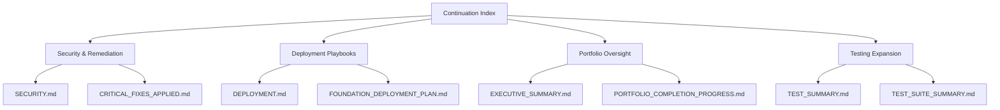

# Portfolio Master Index — Continuation

This continuation index tracks recently delivered assets that extend the original portfolio documentation set. Use it alongside `Portfolio_Master_Index_COMPLETE.md` when you need an at-a-glance snapshot of incremental updates, late-stage refinements, or additional playbooks that were submitted after the initial package.

## Update Highlights

| Focus Area | Description | Reference Artifacts |
| --- | --- | --- |
| Remediation & Hardening | Follow-up guidance for patch validation, security regression testing, and defense-in-depth tracking. | `REMEDIATION_PLAN.md`, `SECURITY.md`, `CRITICAL_FIXES_APPLIED.md` |
| Deployment & Operations | Extended deployment recipes for production parity, configuration drift detection, and runbook governance. | `DEPLOYMENT.md`, `FOUNDATION_DEPLOYMENT_PLAN.md`, `PR_RUNBOOKS_DESCRIPTION.md` |
| Portfolio Oversight | Executive-level rollups summarizing the state of workstreams, survey insights, and completion gates. | `EXECUTIVE_SUMMARY.md`, `PORTFOLIO_SURVEY.md`, `PORTFOLIO_COMPLETION_PROGRESS.md` |
| Testing Expansion | Aggregated coverage of automated suites, manual validation notes, and generated test assets. | `TEST_SUMMARY.md`, `TEST_GENERATION_COMPLETE.md`, `TEST_SUITE_SUMMARY.md` |

## Supplemental Documents Map

## Usage Notes

1. Start with the table above to identify the focus area you are working on.
2. Follow the Mermaid diagram to understand how each grouping relates to downstream deliverables.
3. Update this continuation file whenever new artifacts are added **after** the complete index has been baselined.
