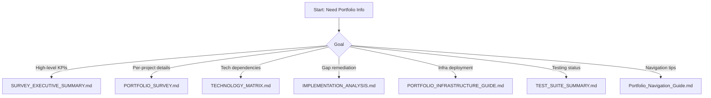

# Portfolio Master Index — Continuation Volume

This continuation extends the Complete Edition with deeper cross-links, doc clusters, and follow-up reading. Use it when you need secondary or niche references that support the main delivery artifacts.

---

## A. Extended Document Families

| Cluster | Files | Key Use Cases |
| --- | --- | --- |
| **Readiness & Deployments** | `DEPLOYMENT.md`, `DEPLOYMENT_READINESS.md`, `FOUNDATION_DEPLOYMENT_PLAN.md`, `BACKUP_STRATEGY.md` | Promote changes from lab → staging → production, establish rollback and recovery steps. |
| **Quality & Testing** | `TEST_SUMMARY.md`, `TEST_SUITE_SUMMARY.md`, `TEST_GENERATION_COMPLETE.md`, `CODE_QUALITY_REPORT.md` | Capture regression scope, automation targets, and static analysis outcomes. |
| **Remediation & Fixes** | `CRITICAL_FIXES_APPLIED.md`, `CODE_ENHANCEMENTS_SUMMARY.md`, `REMEDIATION_PLAN.md`, `STRUCTURE_COMPLETION_NOTES.md` | Track historical fixes and planned improvements. |
| **Program Management** | `PORTFOLIO_COMPLETION_PROGRESS.md`, `PORTFOLIO_ASSESSMENT_REPORT.md`, `PROJECT_COMPLETION_CHECKLIST.md`, `SESSION_SUMMARY_2025-11-10.md` | Provide stakeholder-ready progress updates. |
| **Specialty Guides** | `PORTFOLIO_INFRASTRUCTURE_GUIDE.md`, `PORTFOLIO_SURVEY.md`, `PORTFOLIO_VALIDATION.md`, `PORTFOLIO_NAVIGATION_GUIDE.md` | Bridge high-level indexes with task-level instructions. |

---

## B. Directory-Level Navigation

1. **`docs/`**  
   Houses handbooks (`PRJ-MASTER-HANDBOOK`), V2 infrastructure volumes, and setup guides for wiki/knowledge management stacks.
2. **`projects/`**  
   Contains 25 numbered folders. Each folder includes runbooks, architecture notes, and assets. Example: `projects/25-portfolio-website/` exposes a VitePress documentation portal.
3. **`enterprise-portfolio/`**  
   Contains the wiki application and supporting frontend assets for enterprise-ready publishing.
4. **`professional/` and `projects-new/`**  
   Sandbox and in-flight workstreams kept separate from the canonical portfolio.
5. **`infrastructure/`, `terraform/`, and `scripts/`**  
   Automation sources for IaC, bootstrap scripts, and cluster management.

---

## C. Task-Based Jump List

---

## D. Referencing Related Assets

- **Visuals**: `assets/` plus each `projects/*/assets` folder for diagrams and mockups.  
- **Automation**: `scripts/` provides shell helpers (`setup-portfolio-infrastructure.sh`, etc.).  
- **Front-end artifacts**: `frontend/` and `portfolio-website/` show how documentation appears inside demo portals.

---

## E. Maintenance Checklist

- Update both master index files whenever a new high-visibility document lands in the repo root.
- Cross-link `Portfolio_Navigation_Guide.md` when navigation instructions change.
- Verify Markdown tables and mermaid diagrams render in GitHub (use fenced code blocks with explicit languages, as seen above).
- Document new testing or deployment scripts in the relevant cluster table so teams know where to find them.
