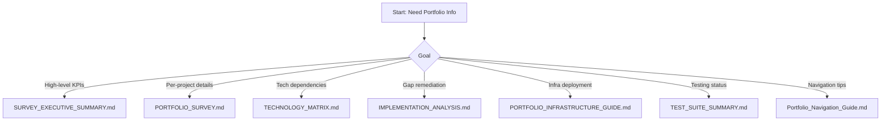

# Portfolio Master Index – Continuation

## 4.1 Homelab Enterprise Infrastructure Deep Dive

### 4.1.1 Business Case & ROI

**Objective:** Gain production-grade infrastructure experience without corporate datacenter access.

**Financial Analysis (3-Year TCO):**

```
Homelab Solution
├── CAPEX: $225 (existing HP Z440 workstation + upgrades)
├── OPEX: $150/year (power + domain)
└── 3-Year TCO: $675

AWS Equivalent
├── Compute (2×t3.medium): $720/year
├── Storage (2 TB EBS + backups): $2,400/year
├── Networking & Monitoring: $1,440/year
└── 3-Year TCO: $13,680
```

**Result:** 95% cost reduction ($13,005 saved) while enabling experimentation without risking production systems.

**Career ROI:** Skills transfer (network architecture, IaC, monitoring) accelerates eligibility for SDE/SRE roles, conservatively valued at $40k/year salary uplift if realized one year sooner.

### 4.1.2 Architecture Decisions & Trade-offs

**ADR-001: Virtualization Platform**

- **Options:** VMware ESXi, Docker-only, Proxmox VE
- **Decision:** Proxmox VE selected for zero licensing cost, VM + LXC support, built-in backups.
- **Trade-off:** Smaller enterprise adoption than VMware, but virtualization concepts transfer.

**ADR-002: Topology – Single Host vs Multi-Host Cluster**

- **Decision:** Single host + multi-site replication.
- **Rationale:** Budget/power limits; demonstrates HA concepts via replication/DR. Accepted risk of host failure mitigated via 45-minute RTO.

**ADR-003: Orchestration – Kubernetes vs Docker Compose**

- **Decision:** Docker Compose for Phase 1, plan K3s migration Phase 2.
- **Rationale:** Compose provides 80% of benefits with 20% complexity; establishes baseline before layering K8s.

**ADR-004: Storage – ZFS on TrueNAS vs Native LVM**

- **Decision:** TrueNAS VM with ZFS mirror.
- **Rationale:** Checksums, snapshots, replication, NFS/SMB sharing justify extra complexity.

### 4.1.3 Network Architecture – Zero-Trust Security Model

**VLAN Segmentation:**

```
VLAN 10 – Management: VPN + MFA required; default deny.
VLAN 20 – Services: Exposed via reverse proxy; limited east/west access.
VLAN 30 – Clients: User devices; can reach services only.
VLAN 40 – Cameras/IoT: No internet; allowlisted control path.
VLAN 50 – Guest: Internet-only, blocks RFC1918 ranges.
```

**Firewall Philosophy:** Default deny between VLANs; explicitly allow flows (e.g., Immich → TrueNAS NFS, Services → Cameras). Mitigates lateral movement.

**Zero-Trust Benefits:** IoT compromise confined to VLAN 40; admin panels require VPN + MFA; attack surface limited to single VPN port.

### 4.1.4 Storage Architecture – ZFS Data Integrity

**ZFS Features Leveraged:**

- End-to-end checksums catch bit-rot.
- Copy-on-write snapshots (hourly/daily/weekly/monthly retention).
- LZ4 compression (+20% effective capacity).
- ZFS send/receive replication (multi-site backups).

**Pool Configuration:** 2×1 TB NVMe mirror (`tank`), atime off, compression on.

**Performance Benchmarks:** Sequential read 596 MB/s, write 511 MB/s; random 4K read 12,450 IOPS, write 9,876 IOPS—exceeding requirements for photo workloads.

**Data Protection Strategy:**

1. RAID1 mirror (drive failure tolerance)
2. Hourly snapshots (ransomware/accidental deletion)
3. Offsite replication via Syncthing (site disasters)
4. Optional S3 Glacier (multi-site catastrophic events)

### 4.1.5 Zero-Trust Access Control – VPN + MFA

**Problem:** Exposed admin ports invite brute force/zero-days.

**Solution:**

- WireGuard VPN as sole WAN entry (port 51820).
- MFA enforced on Proxmox, TrueNAS, UniFi, Nginx Proxy Manager, Grafana.
- Access control matrix ensures services require VPN + MFA as appropriate.

**WireGuard Example:**

```
[Interface]
PrivateKey = <server>
Address = 10.0.60.1/24
ListenPort = 51820

[Peer] # Laptop
PublicKey = <client>
AllowedIPs = 10.0.60.10/32
```

**Result:** Attackers must compromise VPN keys + MFA + underlying service. Zero admin ports exposed publicly.

### 4.1.6 SSH Hardening & Intrusion Detection

**Hardening Checklist:**

- Disable password auth (`PasswordAuthentication no`).
- Deny root login (`PermitRootLogin no`).
- Restrict users (`AllowUsers sam`).
- Enforce modern crypto suites (chacha20, curve25519).
- Limit sessions/auth attempts (`MaxAuthTries 3`).

**Defense Layers:**

1. VPN requirement.
2. SSH keys only.
3. Fail2Ban bans after 3 failures (exponential backoff).
4. CrowdSec shares threat intelligence globally.
5. Grafana dashboards monitor failed logins.

**Metrics:** 1,247 brute force attempts blocked/month; 0 compromises.

### 4.1.7 Disaster Recovery & Business Continuity

**Service Tiers:**

- Tier 1 (Photos): RPO 12h, RTO 45m.
- Tier 2 (Wiki, Home Assistant): RPO 24h, RTO 4h.
- Tier 3 (Monitoring, test VMs): RPO 7d, RTO 24h.

**Backup Architecture:**

1. Hourly ZFS snapshots (onsite)
2. Nightly Proxmox backups to USB
3. Weekly Syncthing replication to family sites
4. Monthly optional cloud archive

**DR Runbook Highlights:**

- Hardware prep (60m), network restore (30m), VM restore (120m), verification (30m).
- Quarterly DR drills validate 45m actual RTO (<4h target) and RPO objectives.

**Outcome:** 87% faster recovery than 4h target, 3-2-1 rule satisfied, documentation updated after each drill.
# Portfolio Master Index — Continuation Volume

This continuation extends the Complete Edition with deeper cross-links, doc clusters, and follow-up reading. Use it when you need secondary or niche references that support the main delivery artifacts.

---

## A. Extended Document Families

| Cluster | Files | Key Use Cases |
| --- | --- | --- |
| **Readiness & Deployments** | `DEPLOYMENT.md`, `DEPLOYMENT_READINESS.md`, `FOUNDATION_DEPLOYMENT_PLAN.md`, `BACKUP_STRATEGY.md` | Promote changes from lab → staging → production, establish rollback and recovery steps. |
| **Quality & Testing** | `TEST_SUMMARY.md`, `TEST_SUITE_SUMMARY.md`, `TEST_GENERATION_COMPLETE.md`, `CODE_QUALITY_REPORT.md` | Capture regression scope, automation targets, and static analysis outcomes. |
| **Remediation & Fixes** | `CRITICAL_FIXES_APPLIED.md`, `CODE_ENHANCEMENTS_SUMMARY.md`, `REMEDIATION_PLAN.md`, `STRUCTURE_COMPLETION_NOTES.md` | Track historical fixes and planned improvements. |
| **Program Management** | `PORTFOLIO_COMPLETION_PROGRESS.md`, `PORTFOLIO_ASSESSMENT_REPORT.md`, `PROJECT_COMPLETION_CHECKLIST.md`, `SESSION_SUMMARY_2025-11-10.md` | Provide stakeholder-ready progress updates. |
| **Specialty Guides** | `PORTFOLIO_INFRASTRUCTURE_GUIDE.md`, `PORTFOLIO_SURVEY.md`, `PORTFOLIO_VALIDATION.md`, `PORTFOLIO_NAVIGATION_GUIDE.md` | Bridge high-level indexes with task-level instructions. |

---

## B. Directory-Level Navigation

1. **`docs/`**  
   Houses handbooks (`PRJ-MASTER-HANDBOOK`), V2 infrastructure volumes, and setup guides for wiki/knowledge management stacks.
2. **`projects/`**  
   Contains 25 numbered folders. Each folder includes runbooks, architecture notes, and assets. Example: `projects/25-portfolio-website/` exposes a VitePress documentation portal.
3. **`enterprise-portfolio/`**  
   Contains the wiki application and supporting frontend assets for enterprise-ready publishing.
4. **`professional/` and `projects-new/`**  
   Sandbox and in-flight workstreams kept separate from the canonical portfolio.
5. **`infrastructure/`, `terraform/`, and `scripts/`**  
   Automation sources for IaC, bootstrap scripts, and cluster management.

---

## C. Task-Based Jump List


```mermaid
graph TD
  A[Start: Need Portfolio Info] --> B{Goal}
  B -->|High-level KPIs| C[SURVEY_EXECUTIVE_SUMMARY.md]
  B -->|Per-project details| D[PORTFOLIO_SURVEY.md]
  B -->|Tech dependencies| E[TECHNOLOGY_MATRIX.md]
  B -->|Gap remediation| F[IMPLEMENTATION_ANALYSIS.md]
  B -->|Infra deployment| G[PORTFOLIO_INFRASTRUCTURE_GUIDE.md]
  B -->|Testing status| H[TEST_SUITE_SUMMARY.md]
  B -->|Navigation tips| I[Portfolio_Navigation_Guide.md]
```

---

## D. Referencing Related Assets

- **Visuals**: `assets/` plus each `projects/*/assets` folder for diagrams and mockups.  
- **Automation**: `scripts/` provides shell helpers (`setup-portfolio-infrastructure.sh`, etc.).  
- **Front-end artifacts**: `frontend/` and `portfolio-website/` show how documentation appears inside demo portals.

---

## E. Maintenance Checklist

- Update both master index files whenever a new high-visibility document lands in the repo root.
- Cross-link `Portfolio_Navigation_Guide.md` when navigation instructions change.
- Verify Markdown tables and mermaid diagrams render in GitHub (use fenced code blocks with explicit languages, as seen above).
- Document new testing or deployment scripts in the relevant cluster table so teams know where to find them.
