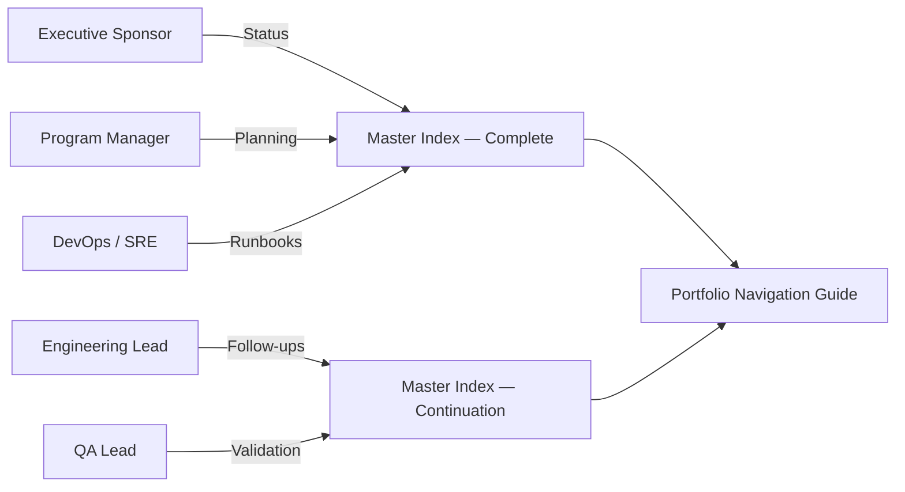

# Portfolio Navigation Guide

This guide explains how to traverse the master index files and related documentation quickly. Pick the persona that matches your role and follow the recommended journey. Every stop includes the artifact to open and the question it answers.

## Persona Matrix

| Persona | Primary Goal | Start Here | Next Steps |
| --- | --- | --- | --- |
| Executive Sponsor | Understand readiness, risk, and ROI. | `EXECUTIVE_SUMMARY.md` | `PORTFOLIO_COMPLETION_PROGRESS.md`, `SURVEY_EXECUTIVE_SUMMARY.md` |
| Program Manager | Track deliverables and blockers. | `Portfolio_Master_Index_COMPLETE.md` | `PROJECT_COMPLETION_CHECKLIST.md`, `ACTION_PLAN.md`, `STRUCTURE_COMPLETION_NOTES.md` |
| Engineering Lead | Align on architecture, code quality, and remediation priorities. | `Portfolio_Master_Index_CONTINUATION.md` | `CODE_QUALITY_REPORT.md`, `IMPLEMENTATION_ANALYSIS.md`, `CRITICAL_FIXES_APPLIED.md` |
| DevOps / SRE | Deploy consistently across environments. | `FOUNDATION_DEPLOYMENT_PLAN.md` | `DEPLOYMENT.md`, `CONFIGURATION_GUIDE.md`, `SCREENSHOT_GUIDE.md` |
| QA Lead | Validate scope and coverage. | `TEST_SUMMARY.md` | `TEST_GENERATION_COMPLETE.md`, `TEST_SUITE_SUMMARY.md`, `PORTFOLIO_SURVEY.md` |

## Navigation Steps

1. **Identify your persona** and open the recommended starting document from the table above.
2. **Consult the relevant master index**:
   - Use `Portfolio_Master_Index_COMPLETE.md` for the authoritative catalog of every deliverable.
   - Use `Portfolio_Master_Index_CONTINUATION.md` for incremental updates shipped after the core set.
3. **Follow cross-links** inside each document to continue your workflow. Most artifacts reference upstream context or downstream tasks to maintain continuity.
4. **Record feedback** directly in the working documents (tracked under version control) so that updates flow into future releases.

## Quick Reference Diagram

## FAQ

Where should I document newly delivered assets?

Add the file reference to `Portfolio_Master_Index_CONTINUATION.md`, then schedule its inclusion in the next `Portfolio_Master_Index_COMPLETE.md` refresh.

How do I confirm the Markdown renders correctly?

Use a Markdown previewer (VS Code, GitHub, or `markdownlint`) and ensure tables, Mermaid diagrams, and collapsible details display without formatting errors.

