# Hi, I'm Sam Jackson

**[System Development Engineer](https://github.com/samueljackson-collab)** · **[DevOps & QA Enthusiast](https://www.linkedin.com/in/sams-jackson)** · **Freelance Full-Stack Web Developer**

[](https://github.com/samueljackson-collab/Portfolio-Project/actions/workflows/ci.yml)

***Building reliable systems, documenting clearly, and sharing what I learn. I turn ambiguous requirements into runbooks, dashboards, and repeatable processes.***

**Status key:** 🟢 Done · 🟠 In Progress · 🔵 Planned · 🔄 Recovery/Rebuild · 📝 Documentation Pending

> **Portfolio Note:** This repository is actively being built. Projects marked 🟢 are technically complete but documentation/evidence is being prepared (📝). Projects marked 🔵 are planned roadmap items, and 🔄 indicates recovery/rebuild efforts are underway.

> **Note:** Some project directories referenced below contain planning documentation and structure but are awaiting evidence/asset uploads. Check individual project READMEs for current status.

> 📚 **New:** [Missing Documents Analysis](./MISSING_DOCUMENTS_ANALYSIS.md) | [Quick Start Guide](./QUICK_START_GUIDE.md) | [Completion Checklist](./PROJECT_COMPLETION_CHECKLIST.md)

---

## 📈 GitHub Status Snapshot (Local Repository)

**Repository Pulse (local Git snapshot)**
- **Active branch:** `work`
- **Last update:** 2026-01-05
- **Commits:** 777 total revisions
- **Tracked files:** 3,062 assets
- **Projects:** 25 portfolio showcases
- **READMEs:** 46 published guides

**Documentation & Infra Inventory**
- **Markdown files:** 407 references · **Total words:** 506,150
- **Docker compose files:** 25 · **Terraform files:** 81 · **Config packs:** 54

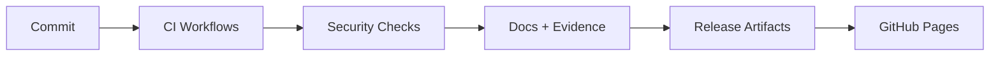

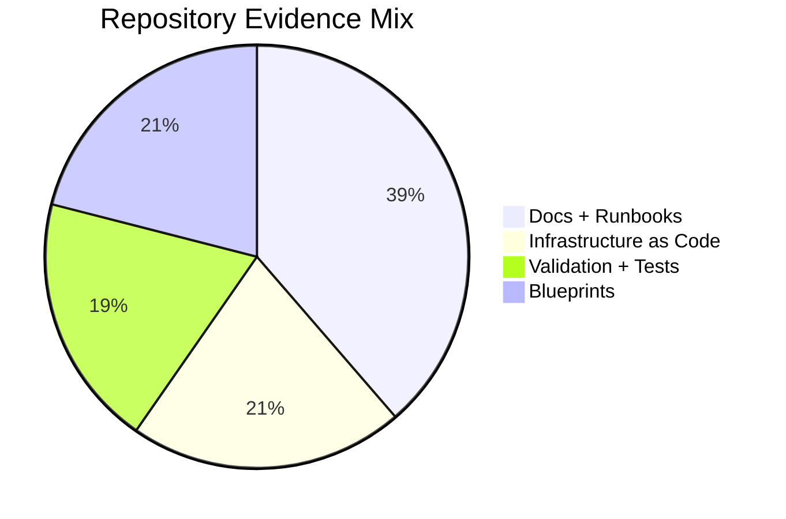

## 🧭 Reviewer Fast Reference

- **Reviewer Checklist:** For a detailed validation checklist covering top metrics, interview workflow, and file map, please see [**PORTFOLIO_VALIDATION.md**](./PORTFOLIO_VALIDATION.md). This file serves as the single source of truth for validation runs.

---

## 🎯 Summary

System-minded engineer specializing in building, securing, and operating infrastructure and data-heavy web systems. Hands-on with homelab → production-like setups (wired rack, UniFi network, VPN, backup/restore drills), and pragmatic DevOps/QA practices.

<details><summary><strong>Alternate summaries for tailoring</strong></summary>

**DevOps-forward** DevOps-leaning systems engineer who builds and operates reliable services end-to-end: homelab→production patterns (networking, virtualization, reverse proxy + TLS, backups), monitoring (golden signals), and CI/CD automation.

**QA-forward** Quality-driven systems engineer turning ambiguous requirements into testable runbooks, acceptance criteria, and regression checklists. Builds monitoring dashboards for golden signals and SLOs.
</details>

---

## 📘 Guides

- [Wiki.js Setup Guide](./docs/wiki-js-setup-guide.md) — Complete walkthrough to deploy, harden, and populate a Wiki.js instance for portfolio documentation.
- [Terraform Infrastructure Stack](./terraform/README.md) — Modular VPC, application, and monitoring IaC with CI/CD and examples.
- [Terraform Architecture Diagrams](./docs/diagrams/terraform-network.md) — High-level, VPC, and component relationship views.

## 💻 UI Components

- [EnterpriseWiki](./src/components/EnterpriseWiki.tsx) — React component that renders interactive learning paths for SDE, DevOps, QA, and architecture roles.

## 📦 Portfolio Blueprints

- 🟢 [Project 1: AWS Infrastructure Automation](./projects/1-aws-infrastructure-automation) — Multi-tool infrastructure-as-code implementation covering Terraform, AWS CDK, and Pulumi with reusable deploy scripts.
- 🟢 [Project 2: Database Migration Platform](./projects/2-database-migration) — Change data capture pipelines and automation for zero-downtime migrations.
- 🟢 [Project 3: Kubernetes CI/CD Pipeline](./projects/3-kubernetes-cicd) — GitOps, progressive delivery, and environment promotion policies.
- 🟢 [Project 4: DevSecOps Pipeline](./projects/4-devsecops) — Security scanning, SBOM publishing, and policy-as-code enforcement.
- 🟢 [Project 5: Real-time Data Streaming](./projects/5-real-time-data-streaming) — Kafka, Flink, and schema registry patterns for resilient stream processing.
- 🟢 [Project 6: Machine Learning Pipeline](./projects/6-mlops-platform) — End-to-end MLOps workflows with experiment tracking and automated promotion.
- 🟢 [Project 7: Serverless Data Processing](./projects/7-serverless-data-processing) — Event-driven analytics built on AWS Lambda, Step Functions, and DynamoDB.
- 🟢 [Project 8: Advanced AI Chatbot](./projects/8-advanced-ai-chatbot) — Retrieval-augmented assistant with vector search, tool execution, and streaming responses.
- 🟢 [Project 9: Multi-Region Disaster Recovery](./projects/9-multi-region-disaster-recovery) — Automated failover, replication validation, and DR runbooks.
- 🟢 [Project 10: Blockchain Smart Contract Platform](./projects/10-blockchain-smart-contract-platform) — Hardhat-based DeFi stack with staking contracts and security tooling.
- 🟢 [Project 11: IoT Data Ingestion & Analytics](./projects/11-iot-data-analytics) — Edge telemetry simulation, ingestion, and real-time dashboards.
- 🟢 [Project 12: Quantum Computing Integration](./projects/12-quantum-computing) — Hybrid quantum/classical optimization workflows using Qiskit.
- 🟢 [Project 13: Advanced Cybersecurity Platform](./projects/13-advanced-cybersecurity) — SOAR engine with enrichment adapters and automated response playbooks.
- 🟢 [Project 14: Edge AI Inference Platform](./projects/14-edge-ai-inference) — ONNX Runtime service optimized for Jetson-class devices.
- 🟢 [Project 15: Real-time Collaborative Platform](./projects/15-real-time-collaboration) — Operational transform collaboration server with CRDT reconciliation.
- 🟢 [Project 16: Advanced Data Lake & Analytics](./projects/16-advanced-data-lake) — Medallion architecture transformations and Delta Lake patterns.
- 🟢 [Project 17: Multi-Cloud Service Mesh](./projects/17-multi-cloud-service-mesh) — Istio multi-cluster configuration with mTLS and network overlays.
- 🟢 [Project 18: GPU-Accelerated Computing](./projects/18-gpu-accelerated-computing) — CuPy-powered Monte Carlo simulations and GPU workload orchestration.
- 🟢 [Project 19: Advanced Kubernetes Operators](./projects/19-advanced-kubernetes-operators) — Kopf-based operator managing portfolio stack lifecycles.
- 🟢 [Project 20: Blockchain Oracle Service](./projects/20-blockchain-oracle-service) — Chainlink adapter and consumer contracts for on-chain metrics.
- 🟢 [Project 21: Quantum-Safe Cryptography](./projects/21-quantum-safe-cryptography) — Hybrid Kyber + ECDH key exchange prototype.
- 🟢 [Project 22: Autonomous DevOps Platform](./projects/22-autonomous-devops-platform) — Event-driven remediation workflows and runbooks-as-code.
- 🟢 [Project 23: Advanced Monitoring & Observability](./projects/23-advanced-monitoring) — Grafana dashboards, alerting rules, and distributed tracing config.
- 🟢 [Project 24: Portfolio Report Generator](./projects/24-report-generator) — Automated report templating with Jinja2.
- 🟢 [Project 25: Portfolio Website & Documentation Hub](./projects/25-portfolio-website) — VitePress-powered portal aggregating all documentation and guides.

---

## 🧩 Project Visuals (Charts + Diagrams)

> Tip: Diagrams are collapsed by default for faster GitHub rendering. Expand a project to view detailed flowcharts and coverage pies.

<details>
<summary><strong>Project 1: AWS Infrastructure Automation</strong></summary>

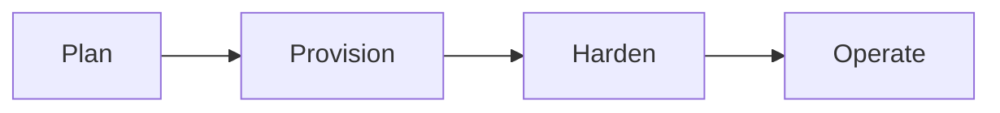
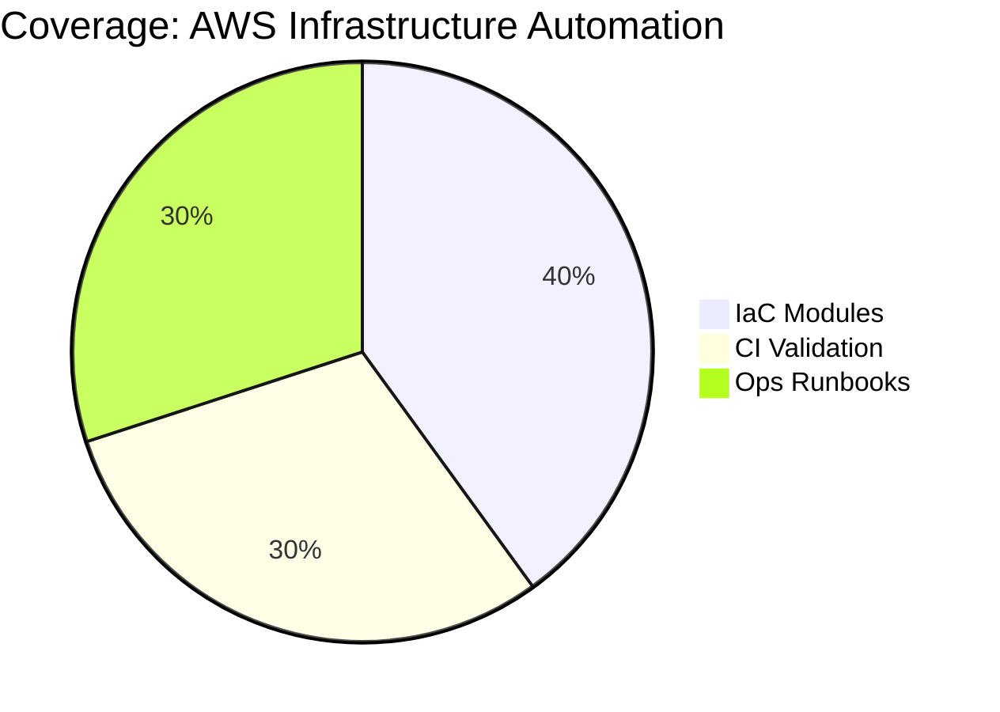
</details>

<details>
<summary><strong>Project 2: Database Migration Platform</strong></summary>

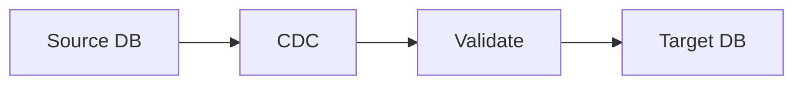
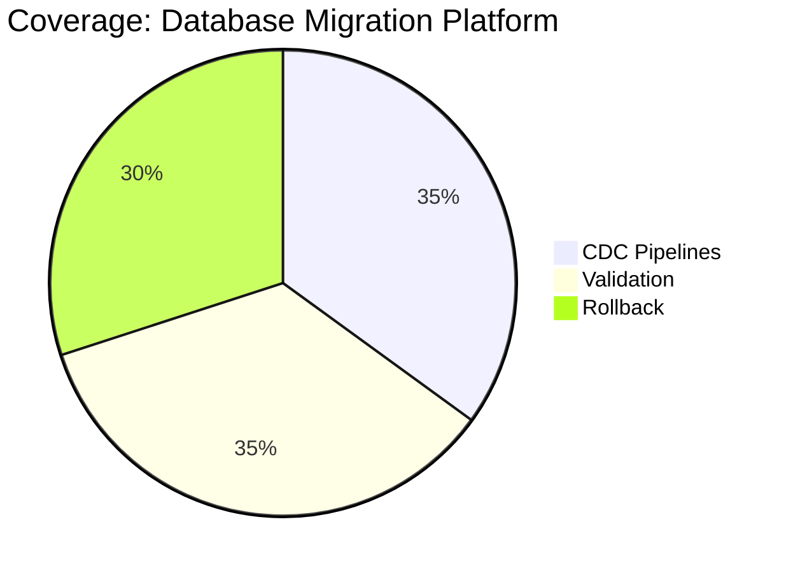
</details>

<details>
<summary><strong>Project 3: Kubernetes CI/CD Pipeline</strong></summary>

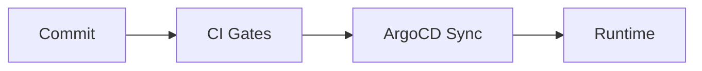
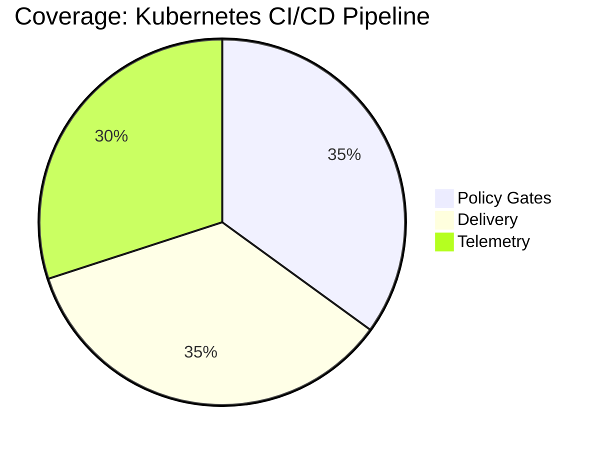
</details>

<details>
<summary><strong>Project 4: DevSecOps Pipeline</strong></summary>

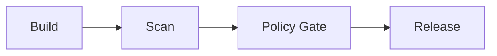
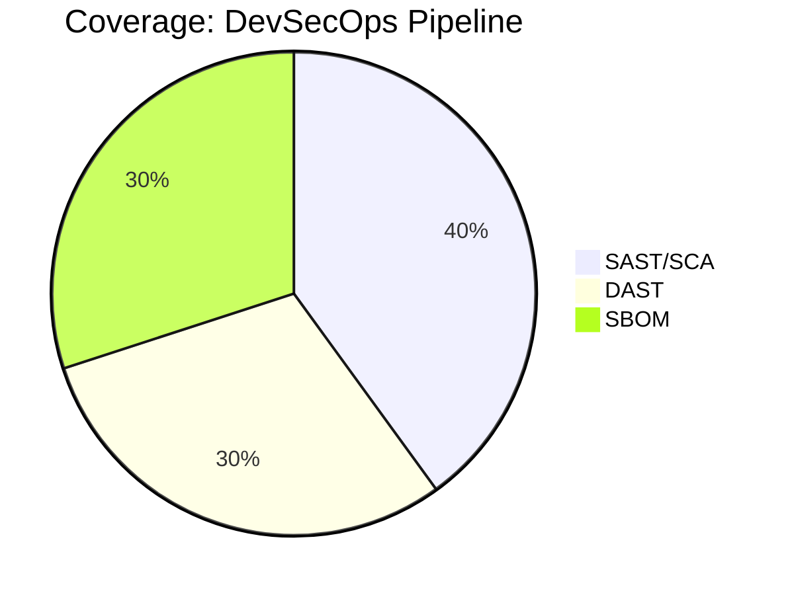
</details>

<details>
<summary><strong>Project 5: Real-time Data Streaming</strong></summary>

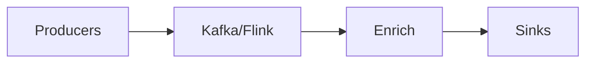
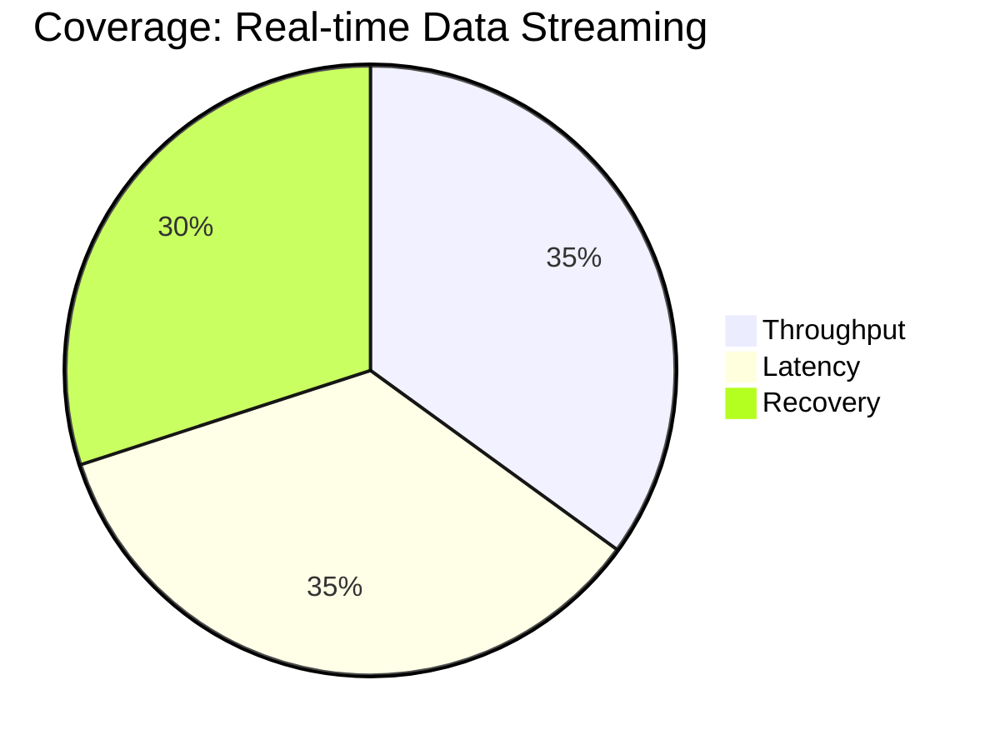
</details>

<details>
<summary><strong>Project 6: Machine Learning Pipeline</strong></summary>

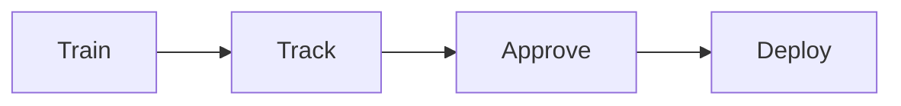

</details>

<details>
<summary><strong>Project 7: Serverless Data Processing</strong></summary>

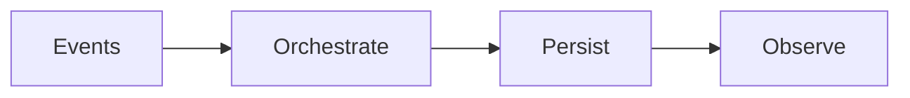
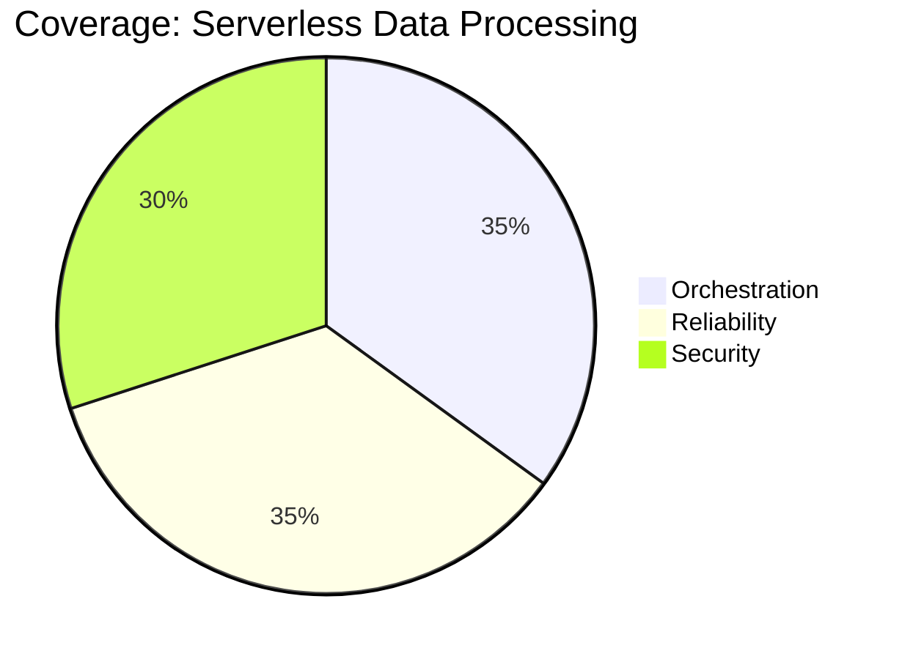
</details>

<details>
<summary><strong>Project 8: Advanced AI Chatbot</strong></summary>

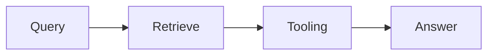
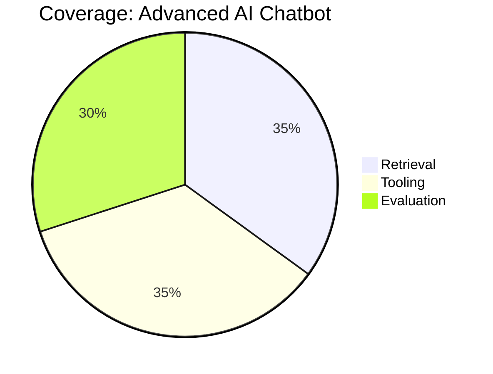
</details>

<details>
<summary><strong>Project 9: Multi-Region Disaster Recovery</strong></summary>

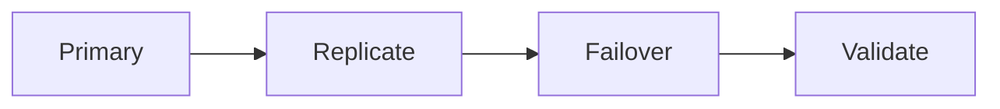
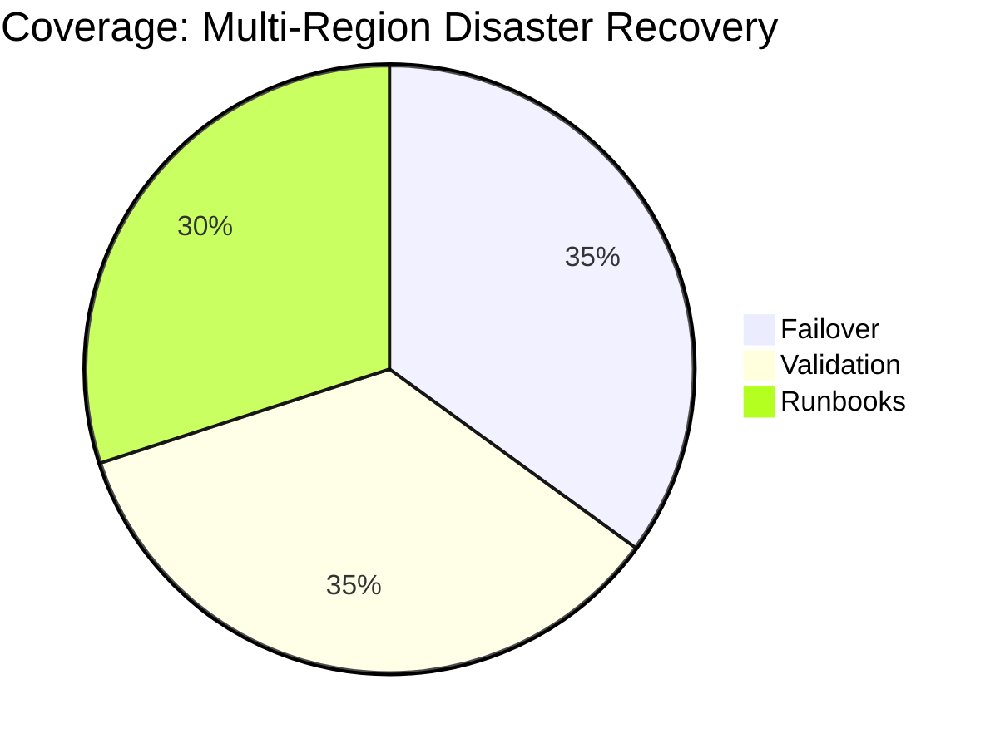
</details>

<details>
<summary><strong>Project 10: Blockchain Smart Contract Platform</strong></summary>

```mermaid
%%{init: {'flowchart': {'curve': 'linear'}}}%%
flowchart LR
  N1[Develop] --> N2[Test] --> N3[Audit] --> N4[Deploy]
```
```mermaid
pie title Coverage: Blockchain Smart Contract Platform
  "Tests" : 35
  "Audit" : 35
  "Release" : 30
```
</details>

<details>
<summary><strong>Project 11: IoT Data Ingestion & Analytics</strong></summary>

```mermaid
%%{init: {'flowchart': {'curve': 'linear'}}}%%
flowchart LR
  N1[Devices] --> N2[Ingest] --> N3[Analyze] --> N4[Dashboards]
```
```mermaid
pie title Coverage: IoT Data Ingestion & Analytics
  "Ingest" : 35
  "Storage" : 35
  "Visualization" : 30
```
</details>

<details>
<summary><strong>Project 12: Quantum Computing Integration</strong></summary>

```mermaid
%%{init: {'flowchart': {'curve': 'linear'}}}%%
flowchart LR
  N1[Classical] --> N2[QPU] --> N3[Analyze] --> N4[Iterate]
```
```mermaid
pie title Coverage: Quantum Computing Integration
  "Experiments" : 35
  "Simulation" : 35
  "Docs" : 30
```
</details>

<details>
<summary><strong>Project 13: Advanced Cybersecurity Platform</strong></summary>

```mermaid
%%{init: {'flowchart': {'curve': 'linear'}}}%%
flowchart LR
  N1[Detect] --> N2[Enrich] --> N3[Automate] --> N4[Respond]
```
```mermaid
pie title Coverage: Advanced Cybersecurity Platform
  "SOAR" : 35
  "Playbooks" : 35
  "Automation" : 30
```
</details>

<details>
<summary><strong>Project 14: Edge AI Inference Platform</strong></summary>

```mermaid
%%{init: {'flowchart': {'curve': 'linear'}}}%%
flowchart LR
  N1[Sensors] --> N2[Inference] --> N3[Optimize] --> N4[Actions]
```
```mermaid
pie title Coverage: Edge AI Inference Platform
  "Latency" : 35
  "Accuracy" : 35
  "Ops" : 30
```
</details>

<details>
<summary><strong>Project 15: Real-time Collaborative Platform</strong></summary>

```mermaid
%%{init: {'flowchart': {'curve': 'linear'}}}%%
flowchart LR
  N1[Clients] --> N2[Sync] --> N3[Resolve] --> N4[Persist]
```
```mermaid
pie title Coverage: Real-time Collaborative Platform
  "Sync" : 35
  "Conflict Resolution" : 35
  "Latency" : 30
```
</details>

<details>
<summary><strong>Project 16: Advanced Data Lake & Analytics</strong></summary>

```mermaid
%%{init: {'flowchart': {'curve': 'linear'}}}%%
flowchart LR
  N1[Bronze] --> N2[Silver] --> N3[Gold] --> N4[Serve]
```
```mermaid
pie title Coverage: Advanced Data Lake & Analytics
  "Ingest" : 35
  "Quality" : 35
  "Curate" : 30
```
</details>

<details>
<summary><strong>Project 17: Multi-Cloud Service Mesh</strong></summary>

```mermaid
%%{init: {'flowchart': {'curve': 'linear'}}}%%
flowchart LR
  N1[Cluster A] --> N2[mTLS Mesh] --> N3[Policy] --> N4[Cluster B]
```
```mermaid
pie title Coverage: Multi-Cloud Service Mesh
  "Routing" : 35
  "Security" : 35
  "Observability" : 30
```
</details>

<details>
<summary><strong>Project 18: GPU-Accelerated Computing</strong></summary>

```mermaid
%%{init: {'flowchart': {'curve': 'linear'}}}%%
flowchart LR
  N1[Data] --> N2[GPU Compute] --> N3[Tune] --> N4[Results]
```
```mermaid
pie title Coverage: GPU-Accelerated Computing
  "Performance" : 35
  "Testing" : 35
  "Docs" : 30
```
</details>

<details>
<summary><strong>Project 19: Advanced Kubernetes Operators</strong></summary>

```mermaid
%%{init: {'flowchart': {'curve': 'linear'}}}%%
flowchart LR
  N1[CRDs] --> N2[Reconcile] --> N3[Automate] --> N4[State]
```
```mermaid
pie title Coverage: Advanced Kubernetes Operators
  "Lifecycle" : 35
  "Automation" : 35
  "Testing" : 30
```
</details>

<details>
<summary><strong>Project 20: Blockchain Oracle Service</strong></summary>

```mermaid
%%{init: {'flowchart': {'curve': 'linear'}}}%%
flowchart LR
  N1[Data Feeds] --> N2[Verify] --> N3[Publish] --> N4[On-chain]
```
```mermaid
pie title Coverage: Blockchain Oracle Service
  "Feeds" : 35
  "Verification" : 35
  "SLAs" : 30
```
</details>

<details>
<summary><strong>Project 21: Quantum-Safe Cryptography</strong></summary>

```mermaid
%%{init: {'flowchart': {'curve': 'linear'}}}%%
flowchart LR
  N1[ECDH] --> N2[Kyber] --> N3[Combine] --> N4[Validate]
```
```mermaid
pie title Coverage: Quantum-Safe Cryptography
  "Keygen" : 35
  "Exchange" : 35
  "Validation" : 30
```
</details>

<details>
<summary><strong>Project 22: Autonomous DevOps Platform</strong></summary>

```mermaid
%%{init: {'flowchart': {'curve': 'linear'}}}%%
flowchart LR
  N1[Detect] --> N2[Decide] --> N3[Runbook] --> N4[Verify]
```
```mermaid
pie title Coverage: Autonomous DevOps Platform
  "Signals" : 35
  "Runbooks" : 35
  "Verification" : 30
```
</details>

<details>
<summary><strong>Project 23: Advanced Monitoring & Observability</strong></summary>

```mermaid
%%{init: {'flowchart': {'curve': 'linear'}}}%%
flowchart LR
  N1[Collect] --> N2[Store] --> N3[Alert] --> N4[Improve]
```
```mermaid
pie title Coverage: Advanced Monitoring & Observability
  "Metrics" : 35
  "Logs" : 35
  "Traces" : 30
```
</details>

<details>
<summary><strong>Project 24: Portfolio Report Generator</strong></summary>

```mermaid
%%{init: {'flowchart': {'curve': 'linear'}}}%%
flowchart LR
  N1[Inputs] --> N2[Render] --> N3[Review] --> N4[Publish]
```
```mermaid
pie title Coverage: Portfolio Report Generator
  "Templates" : 35
  "Evidence" : 35
  "Export" : 30
```
</details>

<details>
<summary><strong>Project 25: Portfolio Website & Documentation Hub</strong></summary>

```mermaid
%%{init: {'flowchart': {'curve': 'linear'}}}%%
flowchart LR
  N1[Docs] --> N2[Build] --> N3[QA] --> N4[Publish]
```
```mermaid
pie title Coverage: Portfolio Website & Documentation Hub
  "Docs" : 35
  "Build" : 35
  "QA" : 30
```
</details>

---
## 📊 Portfolio Status Board

🟢 Done · 🟠 In Progress · 🔵 Planned

Latest updates: [PORTFOLIO_STATUS_UPDATED.md](./PORTFOLIO_STATUS_UPDATED.md)

**🟢 Done**
- **Project 1: AWS Infrastructure Automation**
  - What it is: Terraform/CDK/Pulumi baseline for AWS with reusable deploy scripts.
  - What’s done: CI for fmt/validate/tfsec/plan/apply; 250+ lines of pytest coverage validating variables, outputs, and security controls.
  - Evidence: [Blueprint](./projects/1-aws-infrastructure-automation) · [Progress](./PORTFOLIO_COMPLETION_PROGRESS.md#project-1-aws-infrastructure-automation)
- **Project 2: Database Migration Platform**
  - What it is: Debezium + AWS DMS–driven zero-downtime migration orchestrator.
  - What’s done: 680-line orchestrator, Dockerized runtime, 300+ lines of unit tests, CI for lint/test/build/publish, Debezium connector config.
  - Evidence: [Blueprint](./projects/2-database-migration) · [Progress](./PORTFOLIO_COMPLETION_PROGRESS.md#project-2-database-migration-platform)
- **Project 3: Kubernetes CI/CD Pipeline**
  - What it is: GitOps-ready CI/CD for Kubernetes with progressive delivery.
  - What’s done: GitHub Actions with YAML/K8s validation, image builds, Trivy scans, ArgoCD sync, blue-green deploys, automated rollbacks.
  - Evidence: [Blueprint](./projects/3-kubernetes-cicd) · [Assets](./projects/3-kubernetes-cicd/assets) · [Progress](./PORTFOLIO_COMPLETION_PROGRESS.md#project-3-kubernetes-cicd-pipeline)
- **Project 4: DevSecOps Pipeline**
  - What it is: Security-first pipeline covering SAST, SCA, secrets, SBOM, and DAST.
  - What’s done: Semgrep, Bandit, CodeQL, Gitleaks/TruffleHog, Syft SBOM, Trivy/Dockle, OWASP ZAP, and compliance policy validation.
  - Evidence: [Blueprint](./projects/4-devsecops) · [Progress](./PORTFOLIO_COMPLETION_PROGRESS.md#project-4-devsecops-pipeline)
- **Project 23: Advanced Monitoring & Observability**
  - What it is: Monitoring stack for metrics, logs, and tracing across services.
  - What’s done: Automated Prometheus/Grafana/Loki/Otel deployment, dashboard linting, alert rule checks, health verification.
  - Evidence: [Blueprint](./projects/23-advanced-monitoring) · [Progress](./PORTFOLIO_COMPLETION_PROGRESS.md#project-23-advanced-monitoring--observability)

**🟠 In Progress**
- **Project 6: Machine Learning Pipeline**
  - Focus: Phase 2 expansion—experiment tracking, model promotion gates, Docker images for training/serving.
  - Next: Integrate experiment registry and CI hooks for promotion approvals.
  - Links: [Blueprint](./projects/6-mlops-platform) · [Roadmap](./ACTION_PLAN.md)
- **Project 7: Serverless Data Processing**
  - Focus: Lambda/Step Functions pipelines with IaC and CDC ingestion.
  - Next: Add unit tests and failure-handling paths; wire to validation harness.
  - Links: [Blueprint](./projects/7-serverless-data-processing) · [Roadmap](./ACTION_PLAN.md)
- **Project 8: Advanced AI Chatbot**
  - Focus: RAG pipeline and tool-execution flow with evaluation harness.
  - Next: Containerize services, add retrieval evals, and wire telemetry.
  - Links: [Blueprint](./projects/8-advanced-ai-chatbot) · [Roadmap](./ACTION_PLAN.md)
- **Project 10: Blockchain Smart Contract Platform**
  - Focus: Hardhat-based contracts with audits and deployment automation.
  - Next: Expand CI coverage, add audit scripts, and release pipelines.
  - Links: [Blueprint](./projects/10-blockchain-smart-contract-platform) · [Roadmap](./ACTION_PLAN.md)
- **Project 15: Real-time Collaborative Platform**
  - Focus: CRDT/OT engine for collaborative editing.
  - Next: Conflict resolution tests, latency simulations, and deploy automation.
  - Links: [Blueprint](./projects/15-real-time-collaboration) · [Roadmap](./ACTION_PLAN.md)
- **Project 25: Portfolio Website & Documentation Hub**
  - Focus: VitePress site hosting portfolio docs and reports.
  - Next: Improve navigation/badges, automate report publishing, and add status cards.
  - Links: [Blueprint](./projects/25-portfolio-website) · [Site](./portfolio-website)

**🔵 Planned**
- **Project 5: Real-time Data Streaming**
  - Plan: Kafka/Flink data plane with schema registry, CDC ingestion, and stream quality checks.
  - Links: [Blueprint](./projects/5-real-time-data-streaming)
- **Project 9: Multi-Region Disaster Recovery**
  - Plan: DR drills, replication validation, automated failover tests, and runbooks.
  - Links: [Blueprint](./projects/9-multi-region-disaster-recovery)
- **Project 11: IoT Data Ingestion & Analytics**
  - Plan: Edge telemetry simulators feeding stream processing and dashboards.
  - Links: [Blueprint](./projects/11-iot-data-analytics)
- **Project 12: Quantum Computing Integration**
  - Plan: Qiskit hybrid workflows for optimization experiments.
  - Links: [Blueprint](./projects/12-quantum-computing)
- **Project 13: Advanced Cybersecurity Platform**
  - Plan: SOAR pipeline with enrichment adapters, detections, and response playbooks.
  - Links: [Blueprint](./projects/13-advanced-cybersecurity)
- **Project 14: Edge AI Inference Platform**
  - Plan: ONNX Runtime service for Jetson-class deployments with perf tuning and telemetry.
  - Links: [Blueprint](./projects/14-edge-ai-inference)
- **Project 16: Advanced Data Lake & Analytics**
  - Plan: Medallion architecture, Delta Lake transformations, and data quality checks.
  - Links: [Blueprint](./projects/16-advanced-data-lake)
- **Project 17: Multi-Cloud Service Mesh**
  - Plan: Istio multi-cluster blueprint with mTLS, policy controls, and failover scenarios.
  - Links: [Blueprint](./projects/17-multi-cloud-service-mesh)
- **Project 18: GPU-Accelerated Computing**
  - Plan: CuPy-powered Monte Carlo workloads and orchestration patterns.
  - Links: [Blueprint](./projects/18-gpu-accelerated-computing)
- **Project 19: Advanced Kubernetes Operators**
  - Plan: Kopf-based operator managing portfolio lifecycle automation.
  - Links: [Blueprint](./projects/19-advanced-kubernetes-operators)
- **Project 20: Blockchain Oracle Service**
  - Plan: Chainlink adapters plus consumer contracts with monitoring hooks.
  - Links: [Blueprint](./projects/20-blockchain-oracle-service)
- **Project 21: Quantum-Safe Cryptography**
  - Plan: Hybrid Kyber + ECDH key exchange prototype with interoperability tests.
  - Links: [Blueprint](./projects/21-quantum-safe-cryptography)
- **Project 22: Autonomous DevOps Platform**
  - Plan: Event-driven remediation flows, runbooks-as-code, and policy-driven automation.
  - Links: [Blueprint](./projects/22-autonomous-devops-platform)
- **Project 24: Portfolio Report Generator**
  - Plan: Jinja2-driven document factory with CLI/CI hooks for batch publishing and evidence packaging.
  - Links: [Blueprint](./projects/24-report-generator)

---
## 🛠️ Core Skills

- **Systems & Infra:** Linux/Windows, networking, VLANs, VPN, UniFi, NAS, Active Directory
- **Virtualization/Services:** Proxmox/TrueNAS, reverse proxy + TLS, RBAC/MFA, backup/restore drills
- **Automation & Scripting:** PowerShell, Bash, SQL (catalog ops, reporting), Git
- **Web & Data:** WordPress, e-commerce/booking systems, schema design, large-catalog data ops
- **Observability & Reliability:** Prometheus, Grafana, Loki, Alertmanager, golden signals, SLOs, PBS
- **Cloud & Tools:** AWS/Azure (baseline), GitHub, Docs/Sheets, Visio/diagramming
- **Quality & Process:** runbooks, acceptance criteria, regression checklists, change control

---

## 🟢 Completed Projects (📝 Documentation in Progress)

### Homelab & Secure Network Build

**Status:** 🟢 Complete · 📝 Docs pending
**Description** Designed and wired a home network from scratch: rack-mounted gear, VLAN segmentation, and secure Wi-Fi for isolated IoT, guest, and trusted networks.
**Links**: [Project README](./projects/06-homelab/PRJ-HOME-001/) · [Evidence/Diagrams](./projects/06-homelab/PRJ-HOME-001/assets) · [Screenshots/Logs](./projects/06-homelab/PRJ-HOME-001/assets/screenshots)
**Evidence:** Assets uploaded: Yes — [Evidence index](./projects/06-homelab/PRJ-HOME-001/assets/README.md)

### Virtualization & Core Services

**Status:** 🟢 Complete · 📝 Docs pending
**Description** Proxmox/TrueNAS host running Wiki.js, Home Assistant, and Immich behind a reverse proxy with TLS.
**Links**: [Project README](./projects/06-homelab/PRJ-HOME-002/) · [Evidence Assets](./projects/06-homelab/PRJ-HOME-002/assets) · [Screenshots/Logs](./projects/06-homelab/PRJ-HOME-002/assets/screenshots)
**Evidence:** Assets uploaded: Yes — [Evidence index](./projects/06-homelab/PRJ-HOME-002/assets/README.md)

### Observability & Backups Stack

**Status:** 🟢 Complete · 📝 Docs pending
**Description** Monitoring/alerting stack using Prometheus, Grafana, Loki, and Alertmanager, integrated with Proxmox Backup Server.
**Links**: [Project README](./projects/01-sde-devops/PRJ-SDE-002/) · [Dashboards](./projects/01-sde-devops/PRJ-SDE-002/assets) · [Screenshots/Logs](./projects/01-sde-devops/PRJ-SDE-002/assets/screenshots)
**Evidence:** Assets uploaded: Yes — [Evidence index](./projects/01-sde-devops/PRJ-SDE-002/assets/README.md)

---

## 🔄 Past Projects Requiring Recovery

Older commercial efforts live in cold storage while I recreate code, processes, and documentation that were lost when a retired workstation took the original knowledge base with it. Fresh assets will be published as they’re rebuilt.

### Commercial E-commerce & Booking Systems (Rebuild in Progress)

**Status:** 🔄 Recovery in progress
**Description** Previously built and managed: resort booking site; high-SKU flooring store; tours site with complex variations. Code and process docs are being rebuilt for publication.
**Links**: [Project README & Recovery Plan](./projects/08-web-data/PRJ-WEB-001/) · [Recovery Timeline](./projects/08-web-data/PRJ-WEB-001/RECOVERY_TIMELINE.md) · [Artifacts (backup catalog, ERD, runbooks)](./projects/08-web-data/PRJ-WEB-001/assets)

> **Recovery plan & timeline:** Catalog and restore SQL workflows and automation scripts (Week 1), re-document content management processes and deployment steps (Week 2), publish refreshed artifacts (Week 3+).

---

## 🟠 In-Progress Projects (Milestones)

- **Database Infrastructure Module (Terraform RDS)** · [Project README](./projects/01-sde-devops/PRJ-SDE-001/) · ✅ Module complete, expanding to full-stack
- **Resume Set (SDE/Cloud/QA/Net/Cyber)** · [Project README](./professional/resume/) · 📝 Structure created, content in progress

### 🔵 Planned Infrastructure Projects

- **GitOps Platform with IaC (Terraform + ArgoCD)** · *Roadmap defined*
- **AWS Landing Zone (Organizations + SSO)** · *Research phase*
- **Active Directory Design & Automation (DSC/Ansible)** · *Planning phase*

---

## 🔵 Planned Projects (Roadmaps)

### Cybersecurity Projects

- **SIEM Pipeline**: Sysmon → Ingest → Detections → Dashboards · *Blue team defense*
- **Adversary Emulation**: Validate detections via safe ATT&CK TTP emulation · *Purple team testing*
- **Incident Response Playbook**: Clear IR guidance for ransomware · *Operations readiness*

### QA & Testing Projects

- **Web App Login Test Plan**: Functional, security, and performance test design · *Test strategy*
- **Selenium + PyTest CI**: Automate UI sanity runs in GitHub Actions · *Test automation*

### Infrastructure Expansion

- **Multi-OS Lab**: Kali, SlackoPuppy, Ubuntu lab for comparative analysis · *Homelab expansion*

### Automation & Tooling

- **Document Packaging Pipeline**: One-click generation of Docs/PDFs/XLSX from prompts · *Documentation automation*

### Process Documentation

- **IT Playbook (E2E Lifecycle)**: Unifying playbook from intake to operations · *Operational excellence*
- **Engineer's Handbook (Standards/QA Gates)**: Practical standards and quality bars · *Quality framework*

---

## 💼 Experience

**Desktop Support Technician — 3DM (Redmond, WA) · Feb 2025–Present**  
**Freelance IT & Web Manager — Self-employed · 2015–2022**  
**Web Designer, Content & SEO — IPM Corp. (Cambodia) · 2013–2014**

---

## 🎓 Education & Certifications

**B.S., Information Systems** — Colorado State University (2016–2024)  

---

## 🤳 Connect
[GitHub](https://github.com/samueljackson-collab) · [LinkedIn](https://www.linkedin.com/in/sams-jackson) 
[](https://github.com/samueljackson-collab)
