# Hi, I'm Sam Jackson

**[System Development Engineer](https://github.com/samueljackson-collab)** ·  
**[DevOps & QA Enthusiast](https://www.linkedin.com/in/sams-jackson)** ·  
**Freelance Full-Stack Web Developer**

[](https://github.com/samueljackson-collab/Portfolio-Project/actions/workflows/ci.yml)

***Building reliable systems, documenting clearly, and sharing what I learn. I turn ambiguous requirements into  
runbooks, dashboards, and repeatable processes.***

**Status key:** 🟢 Done · 🟠 In Progress · 🔵 Planned · 🔄 Recovery/Rebuild · 📝 Documentation Pending

> **Portfolio Note:** This repository is actively being built. Projects marked 🟢 are technically complete but  
> documentation/evidence is being prepared (📝). Projects marked 🔵 are planned roadmap items, and 🔄 indicates  
> recovery/rebuild efforts are underway.  
>  
> **Note:** Some project directories referenced below contain planning documentation and structure but are awaiting  
> evidence/asset uploads. Check individual project READMEs for current status.  
>  
> 📚 **New:** [Missing Documents Analysis](./MISSING_DOCUMENTS_ANALYSIS.md) |  
> [Quick Start Guide](./QUICK_START_GUIDE.md) | [Completion Checklist](./PROJECT_COMPLETION_CHECKLIST.md)

---

## ⚡ Quick Navigation

### Start here

- [Portfolio Documentation Hub](./DOCUMENTATION_INDEX.md)
- [Portfolio Validation Checklist](./PORTFOLIO_VALIDATION.md)
- [Portfolio Status Master Checklist](./PROJECT_STATUS_MASTER_CHECKLIST.md)

### Key artifacts

- [Portfolio Evidence Completion Summary](./PORTFOLIO_EVIDENCE_COMPLETION_SUMMARY.md)
- [Portfolio Infrastructure Guide](./PORTFOLIO_INFRASTRUCTURE_GUIDE.md)
- [Security Overview](./SECURITY.md)
- [Deployment Guide](./DEPLOYMENT.md)

### Ops & Observability

- [Observability Stack](./observability/README.md)
- [Home Assistant Dashboard](./HOME_ASSISTANT_DASHBOARD.md)

---

## 📈 GitHub Status Snapshot (Local Repository)

### Repository Pulse (local Git snapshot)

- **Active branch:** `work`
- **Last update:** 2026-01-05
- **Commits:** 777 total revisions
- **Tracked files:** 3,062 assets
- **Projects:** 43 portfolio showcases (25 core blueprints + 18 extended tracks)
- **READMEs:** 46 published guides

### Documentation & Infra Inventory

- **Markdown files:** 407 references · **Total words:** 506,150
- **Docker compose files:** 25 · **Terraform files:** 81 · **Config packs:** 54

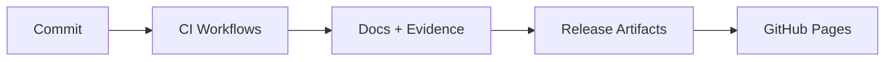

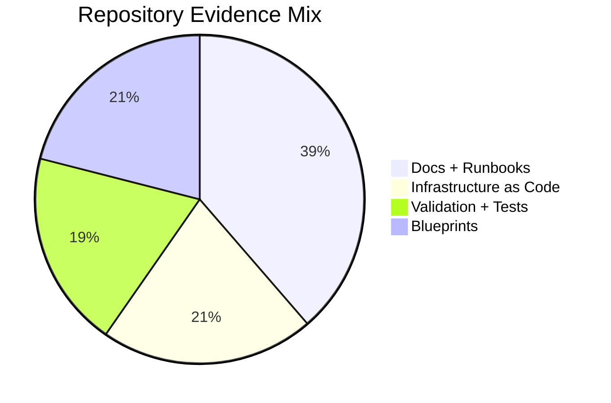

## 🗺️ Repository Map (What lives where)

| Area | Purpose | What to look for |
| --- | --- | --- |
| `projects/` | Primary portfolio projects (1–43: core + extended tracks) | Project READMEs, architecture diagrams, runbooks, testing evidence |
| `docs/` | Deep-dive documentation | Architecture guides, process documentation, diagrams |
| `observability/` | Metrics + dashboards | Grafana dashboards, OpenTelemetry collector config |
| `terraform/` | IaC baseline | Shared infrastructure building blocks |
| `scripts/` | Automation helpers | Deployment, validation, and maintenance scripts |

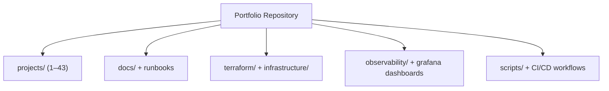

## 🧭 Reviewer Fast Reference

- **Reviewer Checklist:** For a detailed validation checklist covering top metrics, interview workflow, and file map,  
  please see [**PORTFOLIO_VALIDATION.md**](./PORTFOLIO_VALIDATION.md). This file serves as the single source of truth  
  for validation runs.

---

## 🎯 Summary

System-minded engineer specializing in building, securing, and operating infrastructure and data-heavy web systems.  
Hands-on with homelab → production-like setups (wired rack, UniFi network, VPN, backup/restore drills), and pragmatic  
DevOps/QA practices.

<details><summary><strong>Alternate summaries for tailoring</strong></summary>

**DevOps-forward** DevOps-leaning systems engineer who builds and operates reliable services end-to-end:  
homelab→production patterns (networking, virtualization, reverse proxy + TLS, backups), monitoring (golden signals),  
and CI/CD automation.

**QA-forward** Quality-driven systems engineer turning ambiguous requirements into testable runbooks, acceptance  
criteria, and regression checklists. Builds monitoring dashboards for golden signals and SLOs.

</details>

---

## 🧪 Validation & Evidence Workflow

This portfolio is structured to make validation repeatable and auditable. The validation path below mirrors how the  
projects are maintained and reviewed.

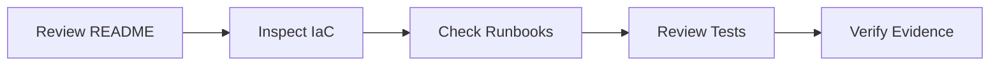

### Recommended review sequence

1. Use [PORTFOLIO_VALIDATION.md](./PORTFOLIO_VALIDATION.md) for the canonical checklist.
2. Validate project readmes (scope, dependencies, operational steps).
3. Review IaC (`terraform/`, `infrastructure/`, project `infra/`).
4. Confirm monitoring dashboards (`observability/`, project `grafana/`).

---

## 📘 Guides

- [Wiki.js Setup Guide](./docs/wiki-js-setup-guide.md) — Complete walkthrough to deploy, harden, and populate a  
  Wiki.js instance for portfolio documentation.
- [Terraform Infrastructure Stack](./terraform/README.md) — Modular VPC, application, and monitoring IaC with CI/CD  
  and examples.
- [Terraform Architecture Diagrams](./docs/diagrams/terraform-network.md) — High-level, VPC, and component  
  relationship views.

## 💻 UI Components

- [EnterpriseWiki](./src/components/EnterpriseWiki.tsx) — React component that renders interactive learning paths for  
  SDE, DevOps, QA, and architecture roles.

## 🧭 Portfolio Blueprints & Evidence

- 🟢 [Project 1: AWS Infrastructure Automation](./projects/1-aws-infrastructure-automation/README.md) — Multi-tool  
  infrastructure-as-code implementation covering Terraform, AWS CDK, and Pulumi with reusable deploy scripts.
- 🟢 [Project 2: Database Migration Platform](./projects/2-database-migration/README.md) — Change data capture pipelines and  
  automation for zero-downtime migrations.
- 🟢 [Project 3: Kubernetes CI/CD Pipeline](./projects/3-kubernetes-cicd/README.md) — GitOps, progressive delivery, and  
  environment promotion policies.
- 🟢 [Project 4: DevSecOps Pipeline](./projects/4-devsecops/README.md) — Security scanning, SBOM publishing, and policy-as-code  
  enforcement.
- 🟢 [Project 5: Real-time Data Streaming](./projects/5-real-time-data-streaming/README.md) — Kafka, Flink, and schema registry  
  patterns for resilient stream processing.
- 🟢 [Project 6: Machine Learning Pipeline](./projects/6-mlops-platform/README.md) — End-to-end MLOps workflows with experiment  
  tracking and automated promotion.
- 🟢 [Project 7: Serverless Data Processing](./projects/7-serverless-data-processing/README.md) — Event-driven analytics built  
  on AWS Lambda, Step Functions, and DynamoDB.
- 🟢 [Project 8: Advanced AI Chatbot](./projects/8-advanced-ai-chatbot/README.md) — Retrieval-augmented assistant with vector  
  search, tool execution, and streaming responses.
- 🟢 [Project 9: Multi-Region Disaster Recovery](./projects/9-multi-region-disaster-recovery/README.md) — Automated failover,  
  replication validation, and DR runbooks.
- 🟢 [Project 10: Blockchain Smart Contract Platform](./projects/10-blockchain-smart-contract-platform/README.md) —  
  Hardhat-based DeFi stack with staking contracts and security tooling.
- 🟢 [Project 11: IoT Data Ingestion & Analytics](./projects/11-iot-data-analytics/README.md) — Edge telemetry simulation,  
  ingestion, and real-time dashboards.
- 🟢 [Project 12: Quantum Computing Integration](./projects/12-quantum-computing/README.md) — Hybrid quantum/classical  
  optimization workflows using Qiskit.
- 🟢 [Project 13: Advanced Cybersecurity Platform](./projects/13-advanced-cybersecurity/README.md) — SOAR engine with enrichment  
  adapters and automated response playbooks.
- 🟢 [Project 14: Edge AI Inference Platform](./projects/14-edge-ai-inference/README.md) — ONNX Runtime service optimized for  
  Jetson-class devices.
- 🟢 [Project 15: Real-time Collaborative Platform](./projects/15-real-time-collaboration/README.md) — Operational transform  
  collaboration server with CRDT reconciliation.
- 🟢 [Project 16: Advanced Data Lake & Analytics](./projects/16-advanced-data-lake/README.md) — Medallion architecture  
  transformations and Delta Lake patterns.
- 🟢 [Project 17: Multi-Cloud Service Mesh](./projects/17-multi-cloud-service-mesh/README.md) — Istio multi-cluster  
  configuration with mTLS and network overlays.
- 🟢 [Project 18: GPU-Accelerated Computing](./projects/18-gpu-accelerated-computing/README.md) — CuPy-powered Monte Carlo  
  simulations and GPU workload orchestration.
- 🟢 [Project 19: Advanced Kubernetes Operators](./projects/19-advanced-kubernetes-operators/README.md) — Kopf-based operator  
  managing portfolio stack lifecycles.
- 🟢 [Project 20: Blockchain Oracle Service](./projects/20-blockchain-oracle-service/README.md) — Chainlink adapter and consumer  
  contracts for on-chain metrics.
- 🟢 [Project 21: Quantum-Safe Cryptography](./projects/21-quantum-safe-cryptography/README.md) — Hybrid Kyber + ECDH key  
  exchange prototype.
- 🟢 [Project 22: Autonomous DevOps Platform](./projects/22-autonomous-devops-platform/README.md) — Event-driven remediation  
  workflows and runbooks-as-code.
- 🟢 [Project 23: Advanced Monitoring & Observability](./projects/23-advanced-monitoring/README.md) — Grafana dashboards,  
  alerting rules, and distributed tracing config.
- 🟢 [Project 24: Portfolio Report Generator](./projects/24-report-generator/README.md) — Automated report templating with  
  Jinja2.
- 🟢 [Project 25: Portfolio Website & Documentation Hub](./projects/25-portfolio-website/README.md) — VitePress-powered portal  
  aggregating all documentation and guides.

### Extended Portfolio Tracks (Projects 26–43)

These additional tracks are active/planned in GitHub and reflected in this repository narrative so the portfolio scope
now exceeds 25 projects.

- 🟢 **Project 26: Homelab & Secure Network Build** — Rack-based segmented network with VLAN isolation, secure Wi-Fi zones, and remote admin VPN.
- 🟢 **Project 27: Virtualization & Core Services** — Proxmox/TrueNAS platform hosting Wiki.js, Home Assistant, and Immich with TLS reverse proxy.
- 🟢 **Project 28: Observability & Backups Stack** — Prometheus/Grafana/Loki/Alertmanager integrated with Proxmox backup workflows.
- 🔄 **Project 29: Commercial E-commerce & Booking Systems Recovery** — Rebuild effort for prior production systems and operational documentation.
- 🟠 **Project 30: Database Infrastructure Module (Terraform RDS)** — Modular Terraform baseline for resilient relational database provisioning.
- 🟠 **Project 31: Resume Set (SDE/Cloud/QA/Net/Cyber)** — Role-targeted resume suite and supporting content automation workflow.
- 🔵 **Project 32: GitOps Platform with IaC (Terraform + ArgoCD)** — End-to-end GitOps control plane with declarative environment promotion.
- 🔵 **Project 33: AWS Landing Zone (Organizations + SSO)** — Multi-account security baseline using AWS Organizations and centralized identity.
- 🔵 **Project 34: Active Directory Design & Automation (DSC/Ansible)** — Domain architecture templates and repeatable configuration automation.
- 🔵 **Project 35: SIEM Pipeline** — Security telemetry ingest and detection pipeline with dashboarded blue-team workflows.
- 🔵 **Project 36: Adversary Emulation** — Safe ATT&CK-aligned emulation suite for validating detection and response quality.
- 🔵 **Project 37: Incident Response Playbook** — Structured ransomware-focused IR runbook and escalation framework.
- 🔵 **Project 38: Web App Login Test Plan** — Functional, security, and performance testing blueprint for authentication systems.
- 🔵 **Project 39: Selenium + PyTest CI** — Automated UI validation pipeline integrated with GitHub Actions.
- 🔵 **Project 40: Multi-OS Lab** — Comparative lab environment spanning Kali, Slacko Puppy, and Ubuntu.
- 🔵 **Project 41: Document Packaging Pipeline** — Prompt-to-document automation for Docs/PDF/XLSX publication.
- 🔵 **Project 42: IT Playbook (E2E Lifecycle)** — Cross-functional service lifecycle playbook from intake through operations.
- 🔵 **Project 43: Engineer's Handbook (Standards/QA Gates)** — Practical engineering standards and quality gate reference.

---

## 🧩 Project Visuals (Charts + Diagrams)

### Project 1: AWS Infrastructure Automation

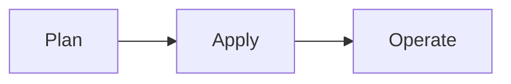

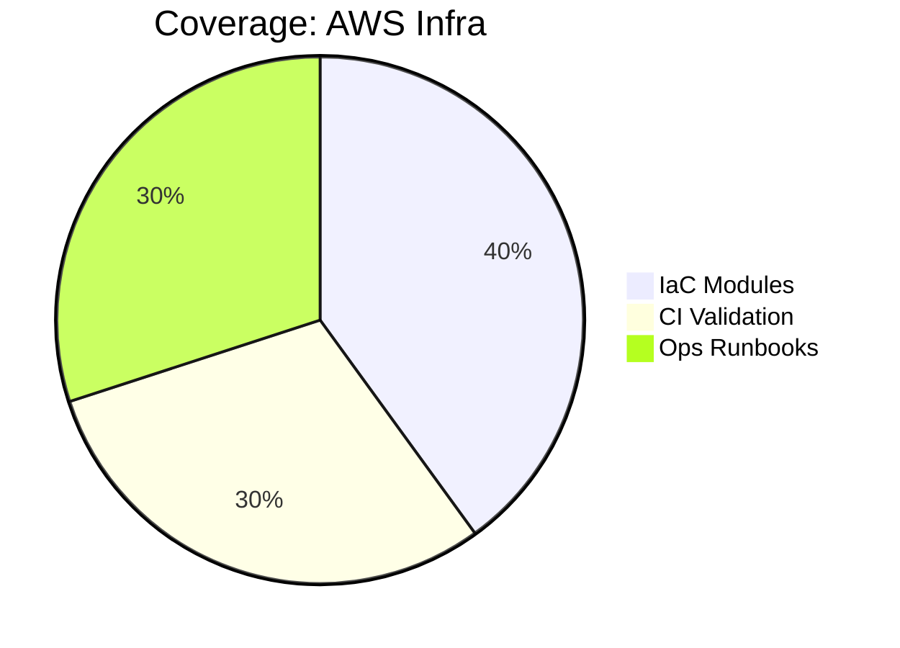

### Project 2: Database Migration Platform

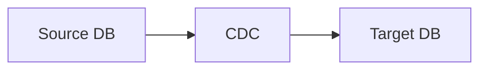

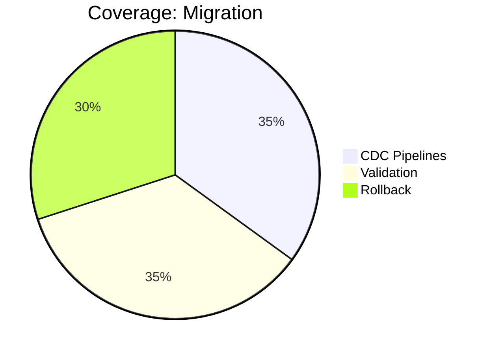

### Project 3: Kubernetes CI/CD Pipeline

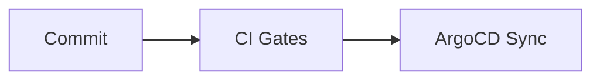

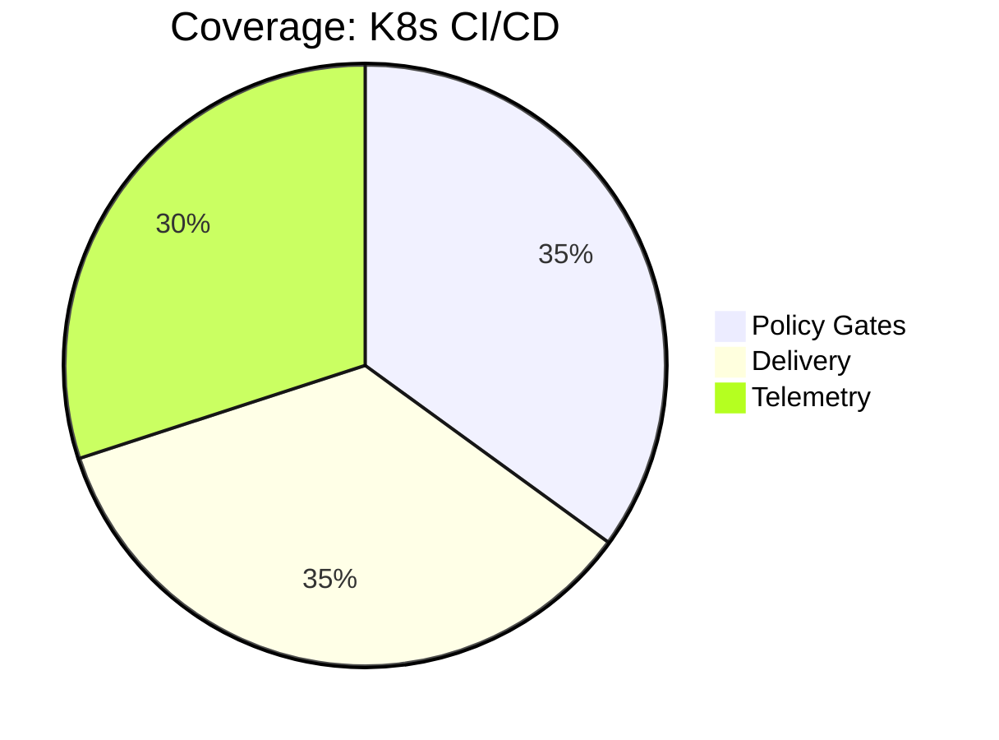

### Project 4: DevSecOps Pipeline

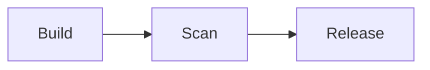

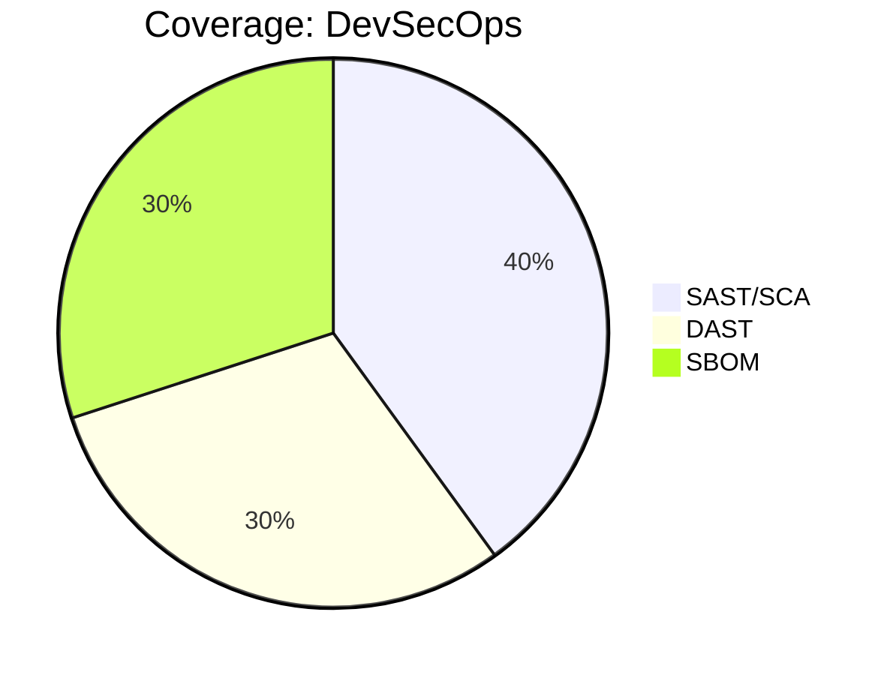

### Project 5: Real-time Data Streaming

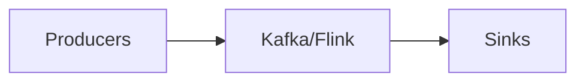

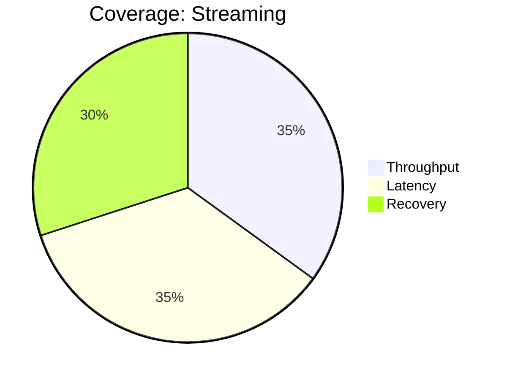

### Project 6: Machine Learning Pipeline

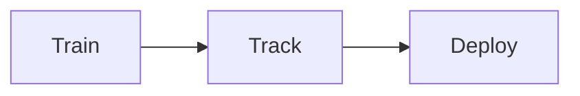

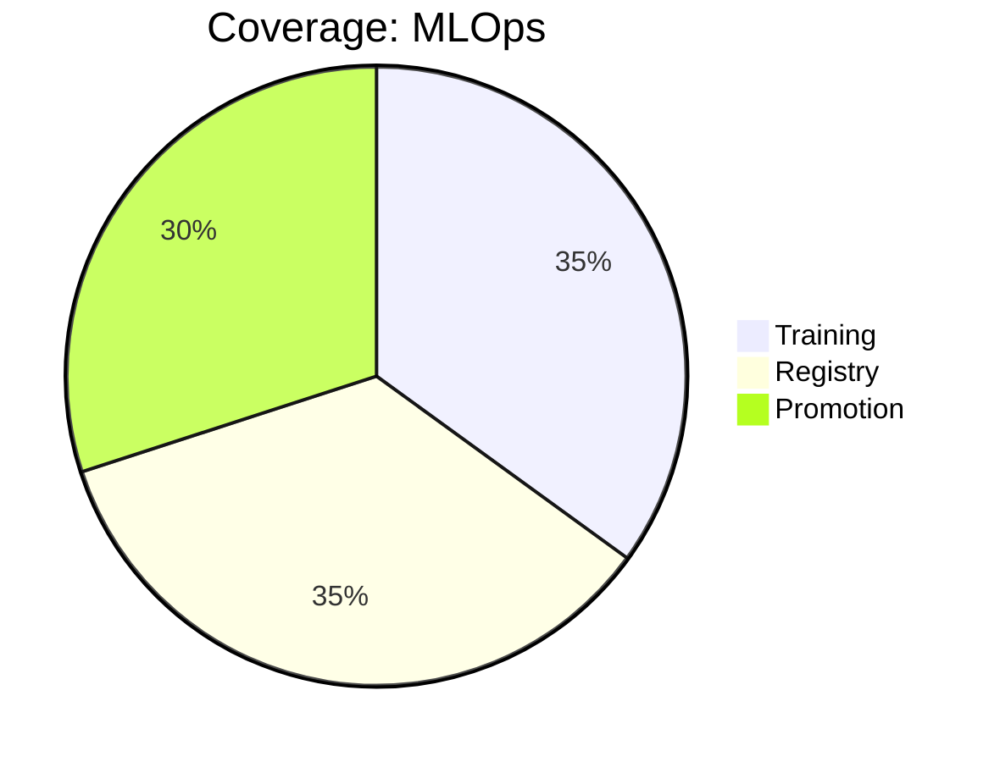

### Project 7: Serverless Data Processing

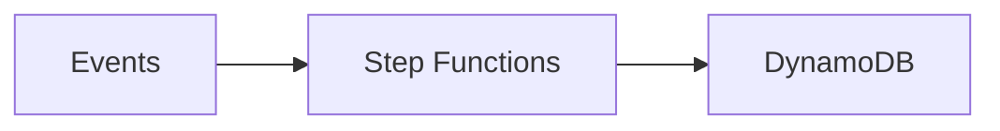

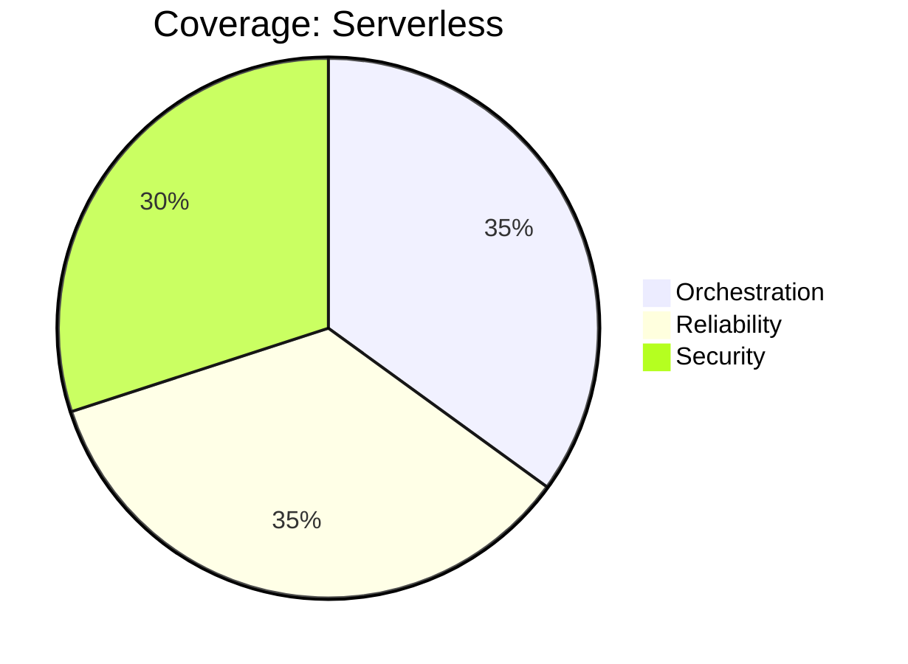

### Project 8: Advanced AI Chatbot

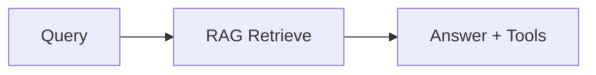

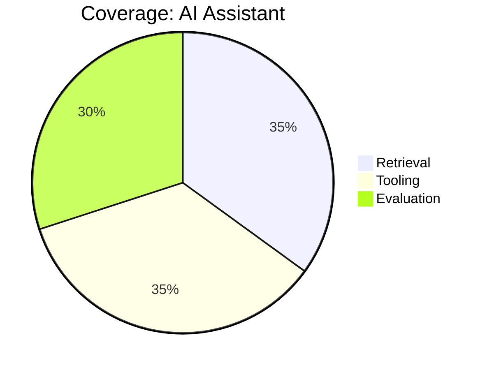

### Project 9: Multi-Region Disaster Recovery

```mermaid
flowchart LR
  A[Primary] --> B[Replication]
  B --> C[Standby]
```

```mermaid
pie title Coverage: DR
  "Failover" : 35
  "Validation" : 35
  "Runbooks" : 30
```

### Project 10: Blockchain Smart Contract Platform

```mermaid
flowchart LR
  A[Develop] --> B[Test]
  B --> C[Deploy]
```

```mermaid
pie title Coverage: Smart Contracts
  "Tests" : 35
  "Audit" : 35
  "Release" : 30
```

### Project 11: IoT Data Ingestion & Analytics

```mermaid
flowchart LR
  A[Devices] --> B[Ingest]
  B --> C[Dashboards]
```

```mermaid
pie title Coverage: IoT Analytics
  "Ingest" : 35
  "Storage" : 35
  "Visualization" : 30
```

### Project 12: Quantum Computing Integration

```mermaid
flowchart LR
  A[Classical] --> B[QPU]
  B --> C[Analysis]
```

```mermaid
pie title Coverage: Quantum
  "Experiments" : 35
  "Simulation" : 35
  "Docs" : 30
```

### Project 13: Advanced Cybersecurity Platform

```mermaid
flowchart LR
  A[Detect] --> B[Enrich]
  B --> C[Respond]
```

```mermaid
pie title Coverage: Cybersecurity
  "SOAR" : 35
  "Playbooks" : 35
  "Automation" : 30
```

### Project 14: Edge AI Inference Platform

```mermaid
flowchart LR
  A[Sensors] --> B[Inference]
  B --> C[Actions]
```

```mermaid
pie title Coverage: Edge AI
  "Latency" : 35
  "Accuracy" : 35
  "Ops" : 30
```

### Project 15: Real-time Collaborative Platform

```mermaid
flowchart LR
  A[Clients] --> B[CRDT Sync]
  B --> C[Server]
```

```mermaid
pie title Coverage: Collaboration
  "Sync" : 35
  "Conflict Resolution" : 35
  "Latency" : 30
```

### Project 16: Advanced Data Lake & Analytics

```mermaid
flowchart LR
  A[Bronze] --> B[Silver]
  B --> C[Gold]
```

```mermaid
pie title Coverage: Data Lake
  "Ingest" : 35
  "Quality" : 35
  "Curate" : 30
```

### Project 17: Multi-Cloud Service Mesh

```mermaid
flowchart LR
  A[Cluster A] --> B[mTLS Mesh]
  B --> C[Cluster B]
```

```mermaid
pie title Coverage: Service Mesh
  "Routing" : 35
  "Security" : 35
  "Observability" : 30
```

### Project 18: GPU-Accelerated Computing

```mermaid
flowchart LR
  A[Data] --> B[GPU Compute]
  B --> C[Results]
```

```mermaid
pie title Coverage: GPU Computing
  "Performance" : 35
  "Testing" : 35
  "Docs" : 30
```

### Project 19: Advanced Kubernetes Operators

```mermaid
flowchart LR
  A[CRDs] --> B[Reconcile]
  B --> C[State]
```

```mermaid
pie title Coverage: Operators
  "Lifecycle" : 35
  "Automation" : 35
  "Testing" : 30
```

### Project 20: Blockchain Oracle Service

```mermaid
flowchart LR
  A[Data Feeds] --> B[Oracle]
  B --> C[On-chain]
```

```mermaid
pie title Coverage: Oracles
  "Feeds" : 35
  "Verification" : 35
  "SLAs" : 30
```

### Project 21: Quantum-Safe Cryptography

```mermaid
flowchart LR
  A[ECDH] --> B[Kyber]
  B --> C[Hybrid Key]
```

```mermaid
pie title Coverage: Crypto
  "Keygen" : 35
  "Exchange" : 35
  "Validation" : 30
```

### Project 22: Autonomous DevOps Platform

```mermaid
flowchart LR
  A[Detect] --> B[Decide]
  B --> C[Act]
```

```mermaid
pie title Coverage: AutoOps
  "Signals" : 35
  "Runbooks" : 35
  "Verification" : 30
```

### Project 23: Advanced Monitoring & Observability

```mermaid
flowchart LR
  A[Collect] --> B[Store]
  B --> C[Alert]
```

```mermaid
pie title Coverage: Observability
  "Metrics" : 35
  "Logs" : 35
  "Traces" : 30
```

### Project 24: Portfolio Report Generator

```mermaid
flowchart LR
  A[Inputs] --> B[Render]
  B --> C[Publish]
```

```mermaid
pie title Coverage: Reporting
  "Templates" : 35
  "Evidence" : 35
  "Export" : 30
```

### Project 25: Portfolio Website & Documentation Hub

```mermaid
flowchart LR
  A[Docs] --> B[Build]
  B --> C[Publish]
```

```mermaid
pie title Coverage: Website
  "Docs" : 35
  "Build" : 35
  "QA" : 30
```

---

## 📊 Portfolio Status Board

🟢 Done · 🟠 In Progress · 🔵 Planned

Latest updates: [PORTFOLIO_STATUS_UPDATED.md](./PORTFOLIO_STATUS_UPDATED.md) · [Portfolio Blueprints](#portfolio-blueprints--evidence)

### 🟢 Done

- **Project 1: AWS Infrastructure Automation**  
  - What it is: Terraform/CDK/Pulumi baseline for AWS with reusable deploy scripts.  
  - What's done: CI for fmt/validate/tfsec/plan/apply; 250+ lines of pytest coverage validating variables,  
    outputs, and security controls.  
  - Evidence: [Blueprint](https://github.com/samueljackson-collab/Portfolio-Project/tree/main/projects/1-aws-infrastructure-automation) ·  
    [Progress](./PORTFOLIO_COMPLETION_PROGRESS.md#project-1-aws-infrastructure-automation)  
- **Project 2: Database Migration Platform**  
  - What it is: Debezium + AWS DMS–driven zero-downtime migration orchestrator.  
  - What's done: 680-line orchestrator, Dockerized runtime, 300+ lines of unit tests, CI for  
    lint/test/build/publish, Debezium connector config.  
  - Evidence: [Blueprint](https://github.com/samueljackson-collab/Portfolio-Project/tree/main/projects/2-database-migration) ·  
    [Progress](./PORTFOLIO_COMPLETION_PROGRESS.md#project-2-database-migration-platform)  
- **Project 3: Kubernetes CI/CD Pipeline**  
  - What it is: GitOps-ready CI/CD for Kubernetes with progressive delivery.  
  - What's done: GitHub Actions with YAML/K8s validation, image builds, Trivy scans, ArgoCD sync,  
    blue-green deploys, automated rollbacks.  
  - Evidence: [Blueprint](https://github.com/samueljackson-collab/Portfolio-Project/tree/main/projects/3-kubernetes-cicd) · [Assets](https://github.com/samueljackson-collab/Portfolio-Project/tree/main/projects/3-kubernetes-cicd/assets/README.md) ·  
    [Progress](./PORTFOLIO_COMPLETION_PROGRESS.md#project-3-kubernetes-cicd-pipeline)  
- **Project 4: DevSecOps Pipeline**  
  - What it is: Security-first pipeline covering SAST, SCA, secrets, SBOM, and DAST.  
  - What's done: Semgrep, Bandit, CodeQL, Gitleaks/TruffleHog, Syft SBOM, Trivy/Dockle, OWASP ZAP,  
    and compliance policy validation.  
  - Evidence: [Blueprint](https://github.com/samueljackson-collab/Portfolio-Project/tree/main/projects/4-devsecops) ·  
    [Progress](./PORTFOLIO_COMPLETION_PROGRESS.md#project-4-devsecops-pipeline)  
- **Project 23: Advanced Monitoring & Observability**  
  - What it is: Monitoring stack for metrics, logs, and tracing across services.  
  - What's done: Automated Prometheus/Grafana/Loki/Otel deployment, dashboard linting, alert rule  
    checks, health verification.  
  - Evidence: [Blueprint](https://github.com/samueljackson-collab/Portfolio-Project/tree/main/projects/23-advanced-monitoring) ·  
    [Progress](./PORTFOLIO_COMPLETION_PROGRESS.md#project-23-advanced-monitoring--observability)

### 🟠 In Progress

- **Project 6: Machine Learning Pipeline**  
  - Focus: Phase 2 expansion—experiment tracking, model promotion gates, Docker images for training/serving.  
  - Next: Integrate experiment registry and CI hooks for promotion approvals.  
  - Links: [Blueprint](https://github.com/samueljackson-collab/Portfolio-Project/tree/main/projects/6-mlops-platform) · [Roadmap](./ACTION_PLAN.md)  
- **Project 7: Serverless Data Processing**  
  - Focus: Lambda/Step Functions pipelines with IaC and CDC ingestion.  
  - Next: Add unit tests and failure-handling paths; wire to validation harness.  
  - Links: [Blueprint](https://github.com/samueljackson-collab/Portfolio-Project/tree/main/projects/7-serverless-data-processing) · [Roadmap](./ACTION_PLAN.md)  
- **Project 8: Advanced AI Chatbot**  
  - Focus: RAG pipeline and tool-execution flow with evaluation harness.  
  - Next: Containerize services, add retrieval evals, and wire telemetry.  
  - Links: [Blueprint](https://github.com/samueljackson-collab/Portfolio-Project/tree/main/projects/8-advanced-ai-chatbot) · [Roadmap](./ACTION_PLAN.md)  
- **Project 10: Blockchain Smart Contract Platform**  
  - Focus: Hardhat-based contracts with audits and deployment automation.  
  - Next: Expand CI coverage, add audit scripts, and release pipelines.  
  - Links: [Blueprint](https://github.com/samueljackson-collab/Portfolio-Project/tree/main/projects/10-blockchain-smart-contract-platform) · [Roadmap](./ACTION_PLAN.md)  
- **Project 15: Real-time Collaborative Platform**  
  - Focus: CRDT/OT engine for collaborative editing.  
  - Next: Conflict resolution tests, latency simulations, and deploy automation.  
  - Links: [Blueprint](https://github.com/samueljackson-collab/Portfolio-Project/tree/main/projects/15-real-time-collaboration) · [Roadmap](./ACTION_PLAN.md)  
- **Project 25: Portfolio Website & Documentation Hub**  
  - Focus: VitePress site hosting portfolio docs and reports.  
  - Next: Improve navigation/badges, automate report publishing, and add status cards.  
  - Links: [Blueprint](https://github.com/samueljackson-collab/Portfolio-Project/tree/main/projects/25-portfolio-website) · [Site](./portfolio-website/README.md)

### 🔵 Planned

- **Project 5: Real-time Data Streaming**  
  - Plan: Kafka/Flink data plane with schema registry, CDC ingestion, and stream quality checks.  
  - Links: [Blueprint](./projects/5-real-time-data-streaming/README.md)  
- **Project 9: Multi-Region Disaster Recovery**  
  - Plan: DR drills, replication validation, automated failover tests, and runbooks.  
  - Links: [Blueprint](./projects/9-multi-region-disaster-recovery/README.md)  
- **Project 11: IoT Data Ingestion & Analytics**  
  - Plan: Edge telemetry simulators feeding stream processing and dashboards.  
  - Links: [Blueprint](./projects/11-iot-data-analytics/README.md)  
- **Project 12: Quantum Computing Integration**  
  - Plan: Qiskit hybrid workflows for optimization experiments.  
  - Links: [Blueprint](./projects/12-quantum-computing/README.md)  
- **Project 13: Advanced Cybersecurity Platform**  
  - Plan: SOAR pipeline with enrichment adapters, detections, and response playbooks.  
  - Links: [Blueprint](./projects/13-advanced-cybersecurity/README.md)  
- **Project 14: Edge AI Inference Platform**  
  - Plan: ONNX Runtime service for Jetson-class deployments with perf tuning and telemetry.  
  - Links: [Blueprint](./projects/14-edge-ai-inference/README.md)  
- **Project 16: Advanced Data Lake & Analytics**  
  - Plan: Medallion architecture, Delta Lake transformations, and data quality checks.  
  - Links: [Blueprint](./projects/16-advanced-data-lake/README.md)  
- **Project 17: Multi-Cloud Service Mesh**  
  - Plan: Istio multi-cluster blueprint with mTLS, policy controls, and failover scenarios.  
  - Links: [Blueprint](./projects/17-multi-cloud-service-mesh/README.md)  
- **Project 18: GPU-Accelerated Computing**  
  - Plan: CuPy-powered Monte Carlo workloads and orchestration patterns.  
  - Links: [Blueprint](./projects/18-gpu-accelerated-computing/README.md)  
- **Project 19: Advanced Kubernetes Operators**  
  - Plan: Kopf-based operator managing portfolio lifecycle automation.  
  - Links: [Blueprint](./projects/19-advanced-kubernetes-operators/README.md)  
- **Project 20: Blockchain Oracle Service**  
  - Plan: Chainlink adapters plus consumer contracts with monitoring hooks.  
  - Links: [Blueprint](./projects/20-blockchain-oracle-service/README.md)  
- **Project 21: Quantum-Safe Cryptography**  
  - Plan: Hybrid Kyber + ECDH key exchange prototype with interoperability tests.  
  - Links: [Blueprint](./projects/21-quantum-safe-cryptography/README.md)  
- **Project 22: Autonomous DevOps Platform**  
  - Plan: Event-driven remediation flows, runbooks-as-code, and policy-driven automation.  
  - Links: [Blueprint](./projects/22-autonomous-devops-platform/README.md)  
- **Project 24: Portfolio Report Generator**  
  - Plan: Jinja2-driven document factory with CLI/CI hooks for batch publishing and evidence packaging.  
  - Links: [Blueprint](./projects/24-report-generator/README.md)

## 🛠️ Core Skills

- **Systems & Infra:** Linux/Windows, networking, VLANs, VPN, UniFi, NAS, Active Directory
- **Virtualization/Services:** Proxmox/TrueNAS, reverse proxy + TLS, RBAC/MFA, backup/restore drills
- **Automation & Scripting:** PowerShell, Bash, SQL (catalog ops, reporting), Git
- **Web & Data:** WordPress, e-commerce/booking systems, schema design, large-catalog data ops
- **Observability & Reliability:** Prometheus, Grafana, Loki, Alertmanager, golden signals, SLOs, PBS
- **Cloud & Tools:** AWS/Azure (baseline), GitHub, Docs/Sheets, Visio/diagramming
- **Quality & Process:** runbooks, acceptance criteria, regression checklists, change control

---

## 🟢 Completed Projects (📝 Documentation in Progress)

### Homelab & Secure Network Build

**Status:** 🟢 Complete · 📝 Docs pending

**Description** Designed and wired a home network from scratch: rack-mounted gear, VLAN segmentation, and secure Wi-Fi  
for isolated IoT, guest, and trusted networks.

**Links**: [Project README](https://github.com/samueljackson-collab/Portfolio-Project/tree/main/projects/06-homelab/PRJ-HOME-001) ·  
[Evidence/Diagrams](./projects/06-homelab/PRJ-HOME-001/assets/README.md) ·  
[Screenshots/Logs](./projects/06-homelab/PRJ-HOME-001/assets/screenshots/README.md)

### Virtualization & Core Services

**Status:** 🟢 Complete · 📝 Docs pending

**Description** Proxmox/TrueNAS host running Wiki.js, Home Assistant, and Immich behind a reverse proxy with TLS.

**Links**: [Project README](https://github.com/samueljackson-collab/Portfolio-Project/tree/main/projects/06-homelab/PRJ-HOME-002) ·  
[Evidence Assets](./projects/06-homelab/PRJ-HOME-002/assets/README.md) ·  
[Screenshots/Logs](./projects/06-homelab/PRJ-HOME-002/assets/screenshots/README.md)

### Observability & Backups Stack

**Status:** 🟢 Complete · 📝 Docs pending

**Description** Monitoring/alerting stack using Prometheus, Grafana, Loki, and Alertmanager, integrated with Proxmox  
Backup Server.

**Links**: [Project README](https://github.com/samueljackson-collab/Portfolio-Project/tree/main/projects/01-sde-devops/PRJ-SDE-002) ·  
[Dashboards](./projects/01-sde-devops/PRJ-SDE-002/assets/README.md) ·  
[Screenshots/Logs](./projects/01-sde-devops/PRJ-SDE-002/assets/screenshots/README.md)

---

## 🔄 Past Projects Requiring Recovery

Older commercial efforts live in cold storage while I recreate code, processes, and documentation that were  
lost when a retired workstation took the original knowledge base with it. Fresh assets will be published as  
they're rebuilt.

### Commercial E-commerce & Booking Systems (Rebuild in Progress)

**Status:** 🔄 Recovery in progress

**Description** Previously built and managed: resort booking site; high-SKU flooring store; tours site with complex  
variations. Code and process docs are being rebuilt for publication.

**Links**: [Project README & Recovery Plan](https://github.com/samueljackson-collab/Portfolio-Project/tree/main/projects/08-web-data/PRJ-WEB-001) ·  
[Recovery Timeline](./projects/08-web-data/PRJ-WEB-001/RECOVERY_TIMELINE.md) ·  
[Artifacts (backup catalog, ERD, runbooks)](./projects/08-web-data/PRJ-WEB-001/assets/README.md)

> **Recovery plan & timeline:** Catalog and restore SQL workflows and automation scripts (Week 1), re-document content  
> management processes and deployment steps (Week 2), publish refreshed artifacts (Week 3+).

---

## 🟠 In-Progress Projects (Milestones)

- **Database Infrastructure Module (Terraform RDS)** · [Project README](./projects/01-sde-devops/PRJ-SDE-001/README.md) ·  
  ✅ Module complete, expanding to full-stack
- **Resume Set (SDE/Cloud/QA/Net/Cyber)** · [Project README](./professional/resume/README.md) ·  
  📝 Structure created, content in progress

### 🔵 Planned Infrastructure Projects

- **GitOps Platform with IaC (Terraform + ArgoCD)** · *Roadmap defined*
- **AWS Landing Zone (Organizations + SSO)** · *Research phase*
- **Active Directory Design & Automation (DSC/Ansible)** · *Planning phase*

---

## 🔵 Planned Projects (Roadmaps)

### Cybersecurity Projects

- **SIEM Pipeline**: Sysmon → Ingest → Detections → Dashboards · *Blue team defense*
- **Adversary Emulation**: Validate detections via safe ATT&CK TTP emulation · *Purple team testing*
- **Incident Response Playbook**: Clear IR guidance for ransomware · *Operations readiness*

### QA & Testing Projects

- **Web App Login Test Plan**: Functional, security, and performance test design · *Test strategy*
- **Selenium + PyTest CI**: Automate UI sanity runs in GitHub Actions · *Test automation*

### Infrastructure Expansion

- **Multi-OS Lab**: Kali, SlackoPuppy, Ubuntu lab for comparative analysis · *Homelab expansion*

### Automation & Tooling

- **Document Packaging Pipeline**: One-click generation of Docs/PDFs/XLSX from prompts · *Documentation automation*

### Process Documentation

- **IT Playbook (E2E Lifecycle)**: Unifying playbook from intake to operations · *Operational excellence*
- **Engineer's Handbook (Standards/QA Gates)**: Practical standards and quality bars · *Quality framework*

---

## 💼 Experience

**Desktop Support Technician — 3DM (Redmond, WA) · Feb 2025–Present**  
**Freelance IT & Web Manager — Self-employed · 2015–2022**  
**Web Designer, Content & SEO — IPM Corp. (Cambodia) · 2013–2014**

---

## 🎓 Education & Certifications

**B.S., Information Systems** — Colorado State University (2016–2024)  

---

## 🤳 Connect

[GitHub](https://github.com/samueljackson-collab) · [LinkedIn](https://www.linkedin.com/in/sams-jackson)  
[](https://github.com/samueljackson-collab)
