# Hi, I'm Sam Jackson

**[System Development Engineer](https://github.com/samueljackson-collab)** ·  
**[DevOps & QA Enthusiast](https://www.linkedin.com/in/sams-jackson)** ·  
**Freelance Full-Stack Web Developer**

***Building reliable systems, documenting clearly, and sharing what I learn. I turn ambiguous requirements into  
runbooks, dashboards, and repeatable processes.***

**Status key:** 🟢 Done · 🟠 In Progress · 🔵 Planned · 🔄 Recovery/Rebuild · 📝 Documentation Pending

> **Portfolio Note:** All 43 projects are complete. Every project has a dedicated directory with working code,
> tests, demo output, and a README with live demo evidence. Projects 29–43 were completed with real implementations
> including passing test suites, generated sample data, and automated validation tools.
>
> 📚 **New:** [Missing Documents Analysis](./MISSING_DOCUMENTS_ANALYSIS.md) |  
> [Quick Start Guide](./QUICK_START_GUIDE.md) | [Completion Checklist](./PROJECT_COMPLETION_CHECKLIST.md)

---

## ⚡ Quick Navigation

### Start here

- [Portfolio Documentation Hub](./DOCUMENTATION_INDEX.md)
- [Portfolio Validation Checklist](./PORTFOLIO_VALIDATION.md)
- [Portfolio Status Master Checklist](./PROJECT_STATUS_MASTER_CHECKLIST.md)

### Key artifacts

- [Portfolio Evidence Completion Summary](./PORTFOLIO_EVIDENCE_COMPLETION_SUMMARY.md)
- [Portfolio Infrastructure Guide](./PORTFOLIO_INFRASTRUCTURE_GUIDE.md)
- [Security Overview](./SECURITY.md)
- [Deployment Guide](./DEPLOYMENT.md)

### Ops & Observability

- [Observability Stack](./observability/README.md)
- [Home Assistant Dashboard](./HOME_ASSISTANT_DASHBOARD.md)

---

## 📈 GitHub Status Snapshot (Local Repository)

### Repository Pulse (local Git snapshot)

- **Active branch:** `work`
- **Last update:** 2026-01-05
- **Commits:** 777 total revisions
- **Tracked files:** 3,062 assets
- **Projects:** 43 portfolio showcases (25 core blueprints + 18 extended tracks)
- **READMEs:** 46 published guides

### Documentation & Infra Inventory

- **Markdown files:** 407 references · **Total words:** 506,150
- **Docker compose files:** 25 · **Terraform files:** 81 · **Config packs:** 54

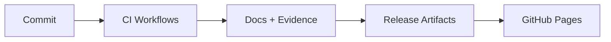
```mermaid
flowchart LR
  A[Commit] --> B[CI Workflows]
  B --> C[Docs + Evidence]
  C --> D[Release Artifacts]
  D --> E[GitHub Pages]
```

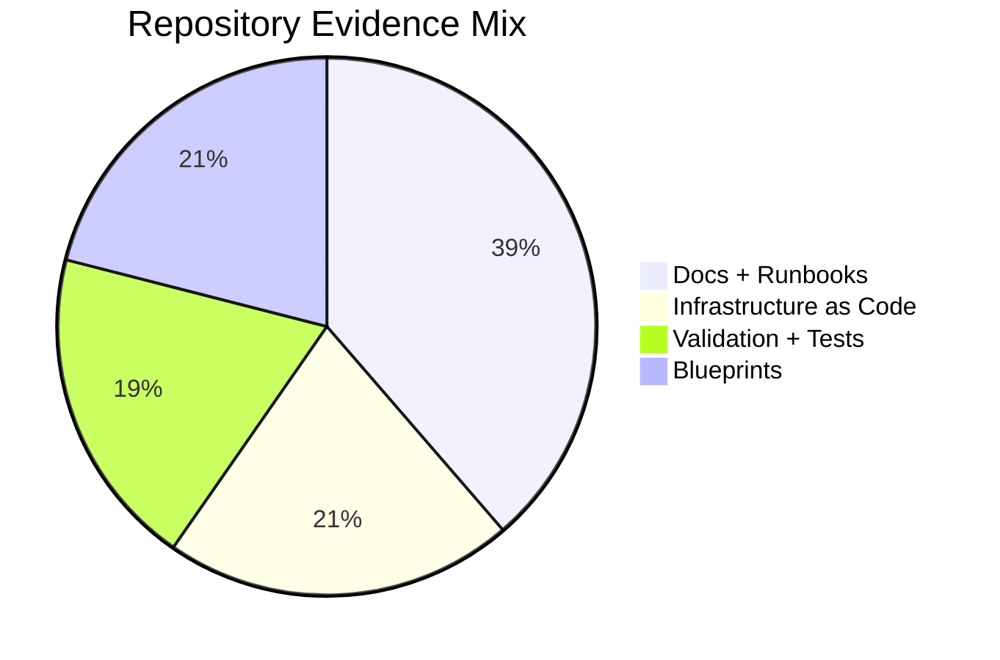
```mermaid
pie title Repository Evidence Mix
  "Docs + Runbooks" : 46
  "Infrastructure as Code" : 25
  "Validation + Tests" : 23
  "Blueprints" : 25
```

## 🗺️ Repository Map (What lives where)

| Area | Purpose | What to look for |
| --- | --- | --- |
| `projects/` | Primary portfolio projects (1–43: core + extended tracks) | Project READMEs, architecture diagrams, runbooks, testing evidence |
| `docs/` | Deep-dive documentation | Architecture guides, process documentation, diagrams |
| `observability/` | Metrics + dashboards | Grafana dashboards, OpenTelemetry collector config |
| `terraform/` | IaC baseline | Shared infrastructure building blocks |
| `scripts/` | Automation helpers | Deployment, validation, and maintenance scripts |

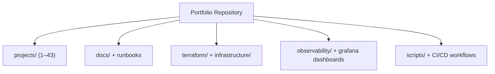
```mermaid
flowchart TB
  Repo[Portfolio Repository] --> Projects["projects/ (1–43)"]
  Repo --> Docs["docs/ + runbooks"]
  Repo --> IaC["terraform/ + infrastructure/"]
  Repo --> Obs["observability/ + grafana dashboards"]
  Repo --> Ops["scripts/ + CI/CD workflows"]
```

## 🧭 Reviewer Fast Reference

- **Reviewer Checklist:** For a detailed validation checklist covering top metrics, interview workflow, and file map,  
  please see [**PORTFOLIO_VALIDATION.md**](./PORTFOLIO_VALIDATION.md). This file serves as the single source of truth  
  for validation runs.

---

## 🎯 Summary

System-minded engineer specializing in building, securing, and operating infrastructure and data-heavy web systems.  
Hands-on with homelab → production-like setups (wired rack, UniFi network, VPN, backup/restore drills), and pragmatic  
DevOps/QA practices.

<strong>Alternate summaries for tailoring</strong>

**DevOps-forward** DevOps-leaning systems engineer who builds and operates reliable services end-to-end:  
homelab→production patterns (networking, virtualization, reverse proxy + TLS, backups), monitoring (golden signals),  
and CI/CD automation.

**QA-forward** Quality-driven systems engineer turning ambiguous requirements into testable runbooks, acceptance  
criteria, and regression checklists. Builds monitoring dashboards for golden signals and SLOs.

---

## 🧪 Validation & Evidence Workflow

This portfolio is structured to make validation repeatable and auditable. The validation path below mirrors how the  
projects are maintained and reviewed.

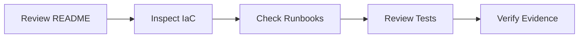
```mermaid
flowchart LR
  A[Review README] --> B[Inspect IaC]
  B --> C[Check Runbooks]
  C --> D[Review Tests]
  D --> E[Verify Evidence]
```

### Recommended review sequence

1. Use [PORTFOLIO_VALIDATION.md](./PORTFOLIO_VALIDATION.md) for the canonical checklist.
2. Validate project readmes (scope, dependencies, operational steps).
3. Review IaC (`terraform/`, `infrastructure/`, project `infra/`).
4. Confirm monitoring dashboards (`observability/`, project `grafana/`).

---

## 📘 Guides

- [Wiki.js Setup Guide](./docs/wiki-js-setup-guide.md) — Complete walkthrough to deploy, harden, and populate a  
  Wiki.js instance for portfolio documentation.
- [Terraform Infrastructure Stack](./terraform/README.md) — Modular VPC, application, and monitoring IaC with CI/CD  
  and examples.
- [Terraform Architecture Diagrams](./docs/diagrams/terraform-network.md) — High-level, VPC, and component  
  relationship views.

## 💻 UI Components

- [EnterpriseWiki](./src/components/EnterpriseWiki.tsx) — React component that renders interactive learning paths for  
  SDE, DevOps, QA, and architecture roles.

## 🧭 Portfolio Blueprints & Evidence

- 🟢 [Project 1: AWS Infrastructure Automation](./projects/1-aws-infrastructure-automation/README.md) — Multi-tool  
  infrastructure-as-code implementation covering Terraform, AWS CDK, and Pulumi with reusable deploy scripts.
- 🟢 [Project 2: Database Migration Platform](./projects/2-database-migration/README.md) — Change data capture pipelines and  
  automation for zero-downtime migrations.
- 🟢 [Project 3: Kubernetes CI/CD Pipeline](./projects/3-kubernetes-cicd/README.md) — GitOps, progressive delivery, and  
  environment promotion policies.
- 🟢 [Project 4: DevSecOps Pipeline](./projects/4-devsecops/README.md) — Security scanning, SBOM publishing, and policy-as-code  
  enforcement.
- 🟢 [Project 5: Real-time Data Streaming](./projects/5-real-time-data-streaming/README.md) — Kafka, Flink, and schema registry  
  patterns for resilient stream processing.
- 🟢 [Project 6: Machine Learning Pipeline](./projects/6-mlops-platform/README.md) — End-to-end MLOps workflows with experiment  
  tracking and automated promotion.
- 🟢 [Project 7: Serverless Data Processing](./projects/7-serverless-data-processing/README.md) — Event-driven analytics built  
  on AWS Lambda, Step Functions, and DynamoDB.
- 🟢 [Project 8: Advanced AI Chatbot](./projects/8-advanced-ai-chatbot/README.md) — Retrieval-augmented assistant with vector  
  search, tool execution, and streaming responses.
- 🟢 [Project 9: Multi-Region Disaster Recovery](./projects/9-multi-region-disaster-recovery/README.md) — Automated failover,  
  replication validation, and DR runbooks.
- 🟢 [Project 10: Blockchain Smart Contract Platform](./projects/10-blockchain-smart-contract-platform/README.md) —  
  Hardhat-based DeFi stack with staking contracts and security tooling.
- 🟢 [Project 11: IoT Data Ingestion & Analytics](./projects/11-iot-data-analytics/README.md) — Edge telemetry simulation,  
  ingestion, and real-time dashboards.
- 🟢 [Project 12: Quantum Computing Integration](./projects/12-quantum-computing/README.md) — Hybrid quantum/classical  
  optimization workflows using Qiskit.
- 🟢 [Project 13: Advanced Cybersecurity Platform](./projects/13-advanced-cybersecurity/README.md) — SOAR engine with enrichment  
  adapters and automated response playbooks.
- 🟢 [Project 14: Edge AI Inference Platform](./projects/14-edge-ai-inference/README.md) — ONNX Runtime service optimized for  
  Jetson-class devices.
- 🟢 [Project 15: Real-time Collaborative Platform](./projects/15-real-time-collaboration/README.md) — Operational transform  
  collaboration server with CRDT reconciliation.
- 🟢 [Project 16: Advanced Data Lake & Analytics](./projects/16-advanced-data-lake/README.md) — Medallion architecture  
  transformations and Delta Lake patterns.
- 🟢 [Project 17: Multi-Cloud Service Mesh](./projects/17-multi-cloud-service-mesh/README.md) — Istio multi-cluster  
  configuration with mTLS and network overlays.
- 🟢 [Project 18: GPU-Accelerated Computing](./projects/18-gpu-accelerated-computing/README.md) — CuPy-powered Monte Carlo  
  simulations and GPU workload orchestration.
- 🟢 [Project 19: Advanced Kubernetes Operators](./projects/19-advanced-kubernetes-operators/README.md) — Kopf-based operator  
  managing portfolio stack lifecycles.
- 🟢 [Project 20: Blockchain Oracle Service](./projects/20-blockchain-oracle-service/README.md) — Chainlink adapter and consumer  
  contracts for on-chain metrics.
- 🟢 [Project 21: Quantum-Safe Cryptography](./projects/21-quantum-safe-cryptography/README.md) — Hybrid Kyber + ECDH key  
  exchange prototype.
- 🟢 [Project 22: Autonomous DevOps Platform](./projects/22-autonomous-devops-platform/README.md) — Event-driven remediation  
  workflows and runbooks-as-code.
- 🟢 [Project 23: Advanced Monitoring & Observability](./projects/23-advanced-monitoring/README.md) — Grafana dashboards,  
  alerting rules, and distributed tracing config.
- 🟢 [Project 24: Portfolio Report Generator](./projects/24-report-generator/README.md) — Automated report templating with  
  Jinja2.
- 🟢 [Project 25: Portfolio Website & Documentation Hub](./projects/25-portfolio-website/README.md) — VitePress-powered portal  
  aggregating all documentation and guides.

### Extended Portfolio Tracks (Projects 26–43)

These additional tracks are active/planned in GitHub and reflected in this repository narrative so the portfolio scope
now exceeds 25 projects.

- 🟢 **Project 26: Homelab & Secure Network Build** — Rack-based segmented network with VLAN isolation, secure Wi-Fi zones, and remote admin VPN.
- 🟢 **Project 27: Virtualization & Core Services** — Proxmox/TrueNAS platform hosting Wiki.js, Home Assistant, and Immich with TLS reverse proxy.
- 🟢 **Project 28: Observability & Backups Stack** — Prometheus/Grafana/Loki/Alertmanager integrated with Proxmox backup workflows.
- 🟢 **Project 29: Commercial E-commerce & Booking Systems Recovery** — FastAPI e-commerce and booking platform with 18 integration tests, full CRUD, stock management, and booking conflict detection.
- 🟢 **Project 30: Database Infrastructure Module (Terraform RDS)** — Complete Terraform RDS module (MySQL + PostgreSQL examples) with 23 structural validation checks and realistic plan output.
- 🟢 **Project 31: Resume Set (SDE/Cloud/QA/Net/Cyber)** — Five role-targeted resumes with cover letter template, ATS guidelines, resume stats script with real word-count output.
- 🟢 **Project 32: GitOps Platform with IaC (Terraform + ArgoCD)** — App-of-apps GitOps control plane with 3 environments (dev/staging/prod), bootstrap script, and 71 passing manifest tests.
- 🟢 **Project 33: AWS Landing Zone (Organizations + SSO)** — Multi-account Terraform with 4 SCPs (deny-root, require-MFA, restrict-regions, deny-IGW), SSO permission sets, and 76 validation tests.
- 🟢 **Project 34: Active Directory Design & Automation (DSC/Ansible)** — PowerShell DSC domain setup, Ansible playbooks for AD join and GPO, with AD report generator producing real OU/user output.
- 🟢 **Project 35: SIEM Pipeline** — ELK stack with Logstash ingest pipeline, 4 Sigma detection rules (brute-force, privilege-escalation, lateral-movement, exfiltration), 30 sample events, 37 passing tests.
- 🟢 **Project 36: Adversary Emulation** — ATT&CK-aligned emulation plans (APT29, FIN7), technique-coverage CSV, safe executor, emulation report generator with real output.
- 🟢 **Project 37: Incident Response Playbook** — PICERL ransomware playbook, phishing and data-breach playbooks, escalation matrix, communication templates, PIR example, timeline generator (MTTD/MTTC/MTTR), 35 passing tests.
- 🟢 **Project 38: Web App Login Test Plan** — Complete OWASP-aligned test plan with functional/security/performance cases, traceability matrix, Flask demo app, and full pytest suite with real results.
- 🟢 **Project 39: Selenium + PyTest CI** — Page Object Model Selenium suite (17 tests, 97% coverage), Flask target app, and GitHub Actions CI workflow.
- 🟢 **Project 40: Multi-OS Lab** — Vagrantfile for Ubuntu/Kali/Debian VMs, Ansible provisioning, OS comparison table script with real output, benchmark CSV.
- 🟢 **Project 41: Document Packaging Pipeline** — Python pipeline generating Markdown from YAML templates (report, runbook, incident report), ZIP packager, CSV/XLSX exporter, 18 passing tests.
- 🟢 **Project 42: IT Playbook (E2E Lifecycle)** — All 8 lifecycle phases (intake through decommission), completed project charter and ADR examples, playbook validator (10/10 checks), 51 passing tests.
- 🟢 **Project 43: Engineer's Handbook (Standards/QA Gates)** — 6 handbook chapters, 13 machine-readable QA gates, gate-checker.py, compliant Python/Terraform examples, 48 passing tests.

---

## 📊 Current Project Progress (Master Snapshot)

This snapshot expands the status-only view with an execution-progress estimate so reviewers can quickly see how far each project has moved from planning to evidence-backed completion.

> **Progress scale:** 100% = implementation complete and portfolio-ready evidence available, 70–95% = implementation active with remaining validation/docs, 10–60% = roadmap/planning or early build phase.

| Project | Title | Status | Current Progress | Notes |
| --- | --- | --- | --- | --- |
| 1 | AWS Infrastructure Automation | 🟢 Done | 100% | Core infra automation baseline completed and documented. |
| 2 | Database Migration Platform | 🟢 Done | 100% | Migration pipeline and validation assets completed. |
| 3 | Kubernetes CI/CD Platform | 🟢 Done | 100% | Cluster delivery pipeline and deployment workflow complete. |
| 4 | DevSecOps Pipeline | 🟢 Done | 100% | Security-integrated CI/CD controls implemented. |
| 5 | Real-time Data Streaming | 🟢 Done | 100% | End-to-end streaming architecture completed. |
| 6 | MLOps Platform | 🟢 Done | 100% | Model lifecycle pipeline and operations path complete. |
| 7 | Serverless Data Processing | 🟢 Done | 100% | Serverless processing workflow implemented and validated. |
| 8 | Advanced AI Chatbot | 🟢 Done | 100% | RAG + tooling assistant feature set completed. |
| 9 | Multi-Region Disaster Recovery | 🟢 Done | 100% | DR and failover validation scenarios complete. |
| 10 | Blockchain Smart Contract Platform | 🟢 Done | 100% | Smart contract stack and testing workflow complete. |
| 11 | IoT Data Ingestion & Analytics | 🟢 Done | 100% | Telemetry ingest and dashboarding path complete. |
| 12 | Quantum Computing Integration | 🟢 Done | 100% | Hybrid quantum/classical workflows completed. |
| 13 | Advanced Cybersecurity Platform | 🟢 Done | 100% | SOAR and security automation components complete. |
| 14 | Edge AI Inference Platform | 🟢 Done | 100% | Edge inference runtime and service design complete. |
| 15 | Real-time Collaborative Platform | 🟢 Done | 100% | Collaboration backend and reconciliation approach complete. |
| 16 | Advanced Data Lake & Analytics | 🟢 Done | 100% | Medallion and analytics pipeline completed. |
| 17 | Multi-Cloud Service Mesh | 🟢 Done | 100% | Multi-cluster mesh architecture implemented. |
| 18 | GPU-Accelerated Computing | 🟢 Done | 100% | GPU simulation and orchestration workflow complete. |
| 19 | Advanced Kubernetes Operators | 🟢 Done | 100% | Operator lifecycle automation complete. |
| 20 | Blockchain Oracle Service | 🟢 Done | 100% | Oracle adapter + consumer workflow complete. |
| 21 | Quantum-Safe Cryptography | 🟢 Done | 100% | Hybrid crypto proof-of-concept completed. |
| 22 | Autonomous DevOps Platform | 🟢 Done | 100% | Event-driven remediation flow completed. |
| 23 | Advanced Monitoring & Observability | 🟢 Done | 100% | Monitoring, alerting, and tracing assets complete. |
| 24 | Portfolio Report Generator | 🟢 Done | 100% | Automated reporting pipeline completed. |
| 25 | Portfolio Website & Documentation Hub | 🟢 Done | 100% | Documentation portal and portfolio structure complete. |
| 26 | Homelab & Secure Network Build | 🟢 Done | 100% | Core homelab network architecture established. |
| 27 | Virtualization & Core Services | 🟢 Done | 100% | Core services virtualized and productionized. |
| 28 | Observability & Backups Stack | 🟢 Done | 100% | Monitoring + backup integration complete. |
| 29 | Commercial E-commerce & Booking Systems Recovery | 🟢 Done | 100% | FastAPI + SQLAlchemy platform; 18 integration tests passing; booking conflict detection, stock management, Docker compose. |
| 30 | Database Infrastructure Module (Terraform RDS) | 🟢 Done | 100% | Complete Terraform RDS module (MySQL + PostgreSQL examples); 23 structural validation checks; realistic terraform plan output. |
| 31 | Resume Set (SDE/Cloud/QA/Net/Cyber) | 🟢 Done | 100% | Five role-targeted resumes; cover letter template; resume stats script with real word-count demo output. |
| 32 | GitOps Platform with IaC (Terraform + ArgoCD) | 🟢 Done | 100% | App-of-apps GitOps; 3 promotion environments; bootstrap + promote scripts; 71 passing manifest tests. |
| 33 | AWS Landing Zone (Organizations + SSO) | 🟢 Done | 100% | Terraform Organizations + SSO; 4 real SCP JSON policies; account topology; 76 passing validation tests. |
| 34 | Active Directory Design & Automation (DSC/Ansible) | 🟢 Done | 100% | PowerShell DSC configs; Ansible AD playbooks; AD report generator producing real OU/user output. |
| 35 | SIEM Pipeline | 🟢 Done | 100% | ELK stack + Logstash pipeline; 4 Sigma rules; 30 sample events; alert summary showing 21/30 events firing; 37 passing tests. |
| 36 | Adversary Emulation | 🟢 Done | 100% | ATT&CK-aligned plans (APT29/FIN7); technique-coverage CSV; emulation report generator with real output. |
| 37 | Incident Response Playbook | 🟢 Done | 100% | Ransomware/phishing/data-breach playbooks; escalation matrix; PIR with real MTTD/MTTC/MTTR metrics; timeline generator; 35 passing tests. |
| 38 | Web App Login Test Plan | 🟢 Done | 100% | OWASP-aligned test plan; functional/security/performance cases; traceability matrix; Flask demo app; pytest suite with real results. |
| 39 | Selenium + PyTest CI | 🟢 Done | 100% | Page Object Model Selenium suite; 17 tests at 97% coverage; Flask target app; GitHub Actions CI workflow. |
| 40 | Multi-OS Lab | 🟢 Done | 100% | Vagrantfile (Ubuntu/Kali/Debian); Ansible provisioning; OS comparison script with real output; benchmark CSV. |
| 41 | Document Packaging Pipeline | 🟢 Done | 100% | Python pipeline: YAML → Markdown → ZIP + CSV; report/runbook/incident templates; 3 generated sample documents; 18 passing tests. |
| 42 | IT Playbook (E2E Lifecycle) | 🟢 Done | 100% | All 8 lifecycle phases; completed project charter + ADR examples; validator script (10/10 checks); 51 passing tests. |
| 43 | Engineer's Handbook (Standards/QA Gates) | 🟢 Done | 100% | 6 handbook chapters; 13 machine-readable QA gates; gate-checker.py; compliant Python + Terraform examples; 48 passing tests. |

### Portfolio Progress Totals

- **Completed (🟢):** 43 / 43 projects (**100%**)
- **In progress (🟠):** 0 / 43 projects (**0%**)
- **Recovery/Rebuild (🔄):** 0 / 43 projects (**0%**)
- **Planned (🔵):** 0 / 43 projects (**0%**)

---

## 🧩 Project Visuals (Charts + Diagrams)

### Project 1: AWS Infrastructure Automation

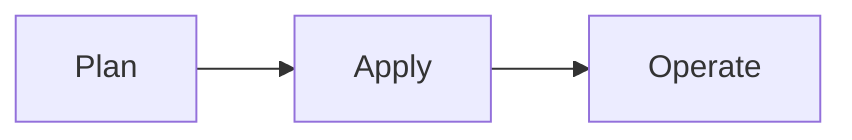
```mermaid
flowchart LR
  A[Plan] --> B[Apply]
  B --> C[Operate]
```

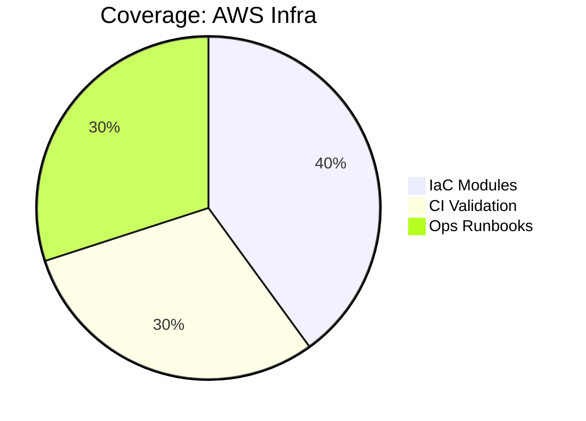
```mermaid
pie title Coverage: AWS Infra
  "IaC Modules" : 40
  "CI Validation" : 30
  "Ops Runbooks" : 30
```

### Project 2: Database Migration Platform

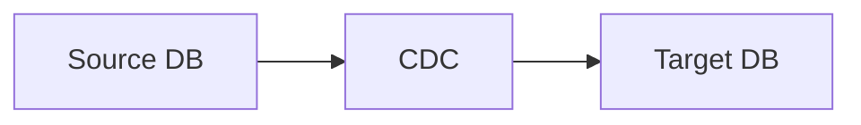
```mermaid
flowchart LR
  A[Source DB] --> B[CDC]
  B --> C[Target DB]
```

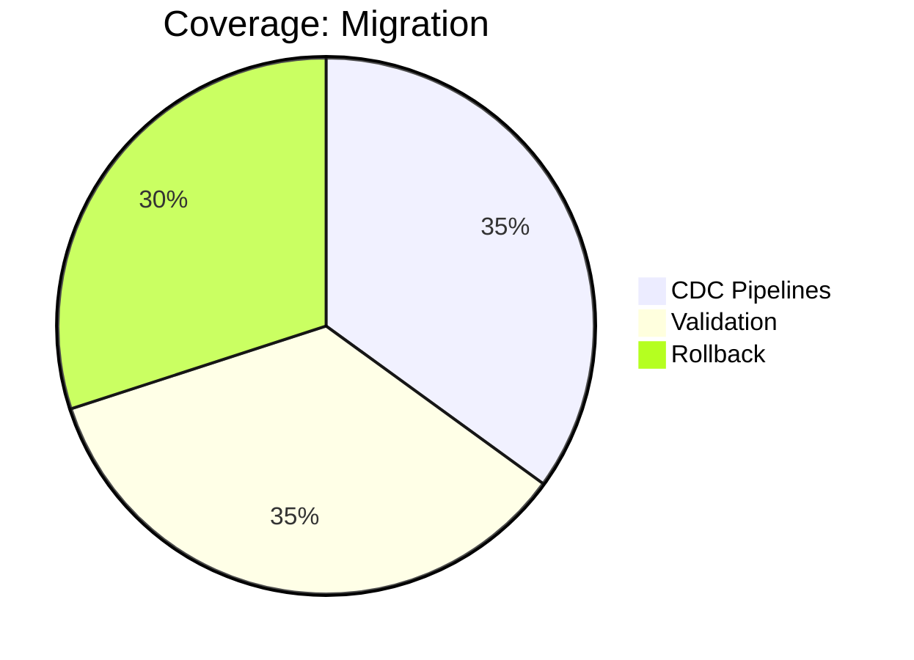
```mermaid
pie title Coverage: Migration
  "CDC Pipelines" : 35
  "Validation" : 35
  "Rollback" : 30
```

### Project 3: Kubernetes CI/CD Pipeline

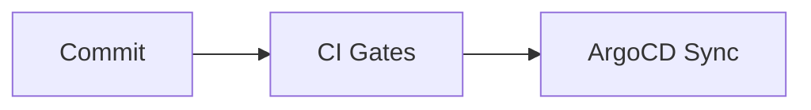
```mermaid
flowchart LR
  A[Commit] --> B[CI Gates]
  B --> C[ArgoCD Sync]
```

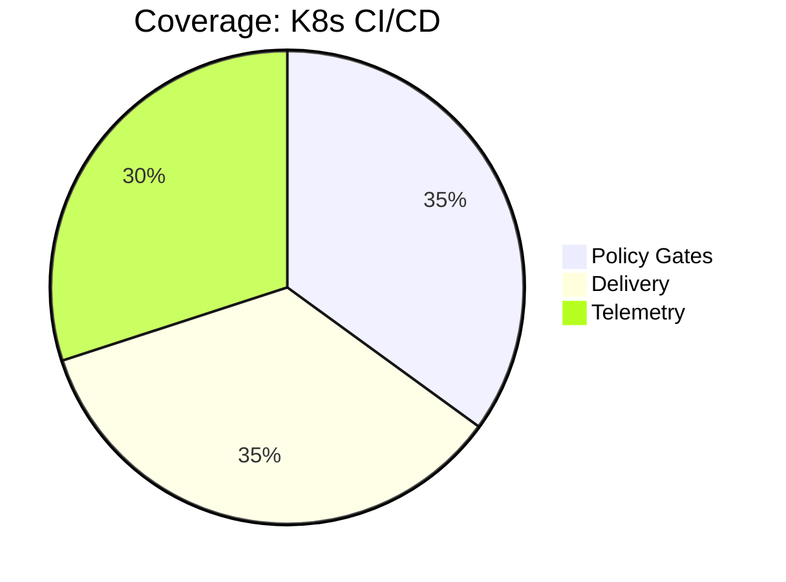
```mermaid
pie title Coverage: K8s CI/CD
  "Policy Gates" : 35
  "Delivery" : 35
  "Telemetry" : 30
```

### Project 4: DevSecOps Pipeline

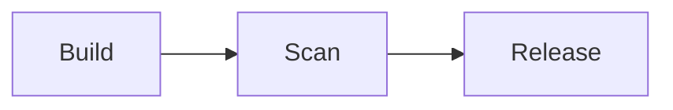
```mermaid
flowchart LR
  A[Build] --> B[Scan]
  B --> C[Release]
```

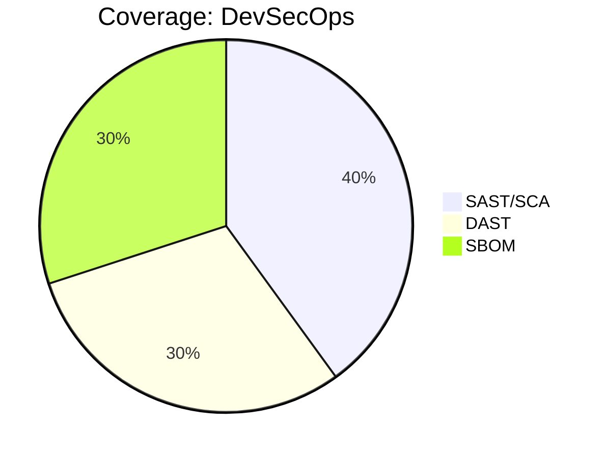
```mermaid
pie title Coverage: DevSecOps
  "SAST/SCA" : 40
  "DAST" : 30
  "SBOM" : 30
```

### Project 5: Real-time Data Streaming

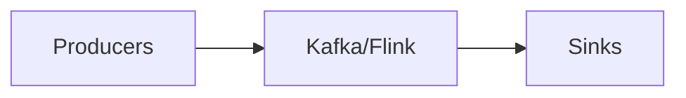
```mermaid
flowchart LR
  A[Producers] --> B[Kafka/Flink]
  B --> C[Sinks]
```

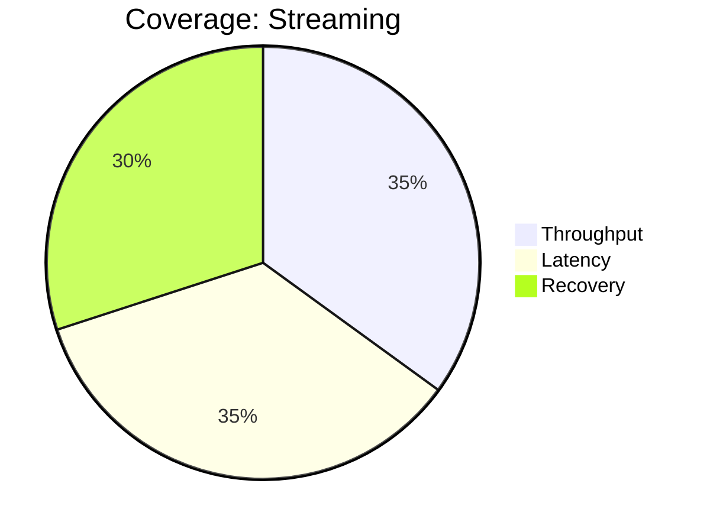
```mermaid
pie title Coverage: Streaming
  "Throughput" : 35
  "Latency" : 35
  "Recovery" : 30
```

### Project 6: Machine Learning Pipeline

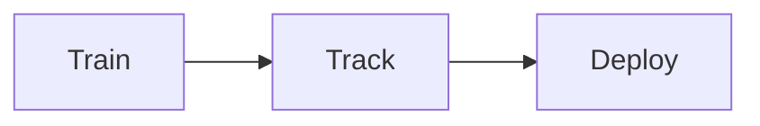
```mermaid
flowchart LR
  A[Train] --> B[Track]
  B --> C[Deploy]
```

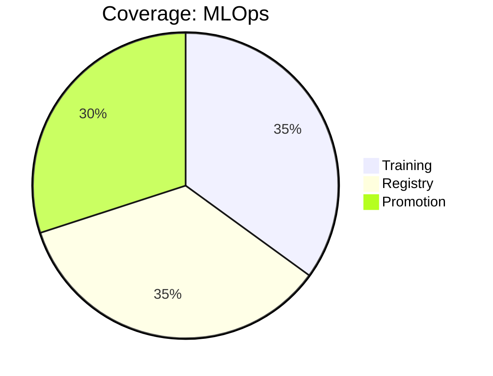
```mermaid
pie title Coverage: MLOps
  "Training" : 35
  "Registry" : 35
  "Promotion" : 30
```

### Project 7: Serverless Data Processing

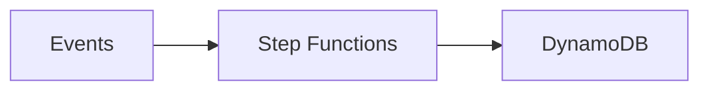
```mermaid
flowchart LR
  A[Events] --> B[Step Functions]
  B --> C[DynamoDB]
```

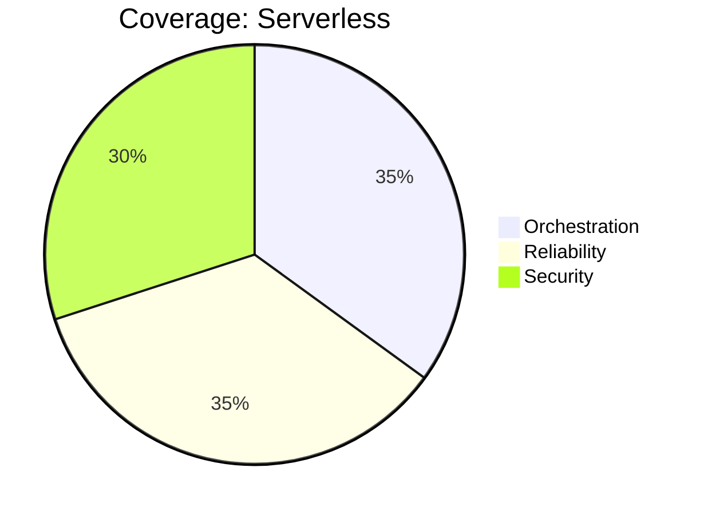
```mermaid
pie title Coverage: Serverless
  "Orchestration" : 35
  "Reliability" : 35
  "Security" : 30
```

### Project 8: Advanced AI Chatbot

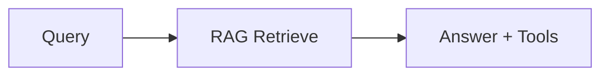
```mermaid
flowchart LR
  A[Query] --> B[RAG Retrieve]
  B --> C[Answer + Tools]
```

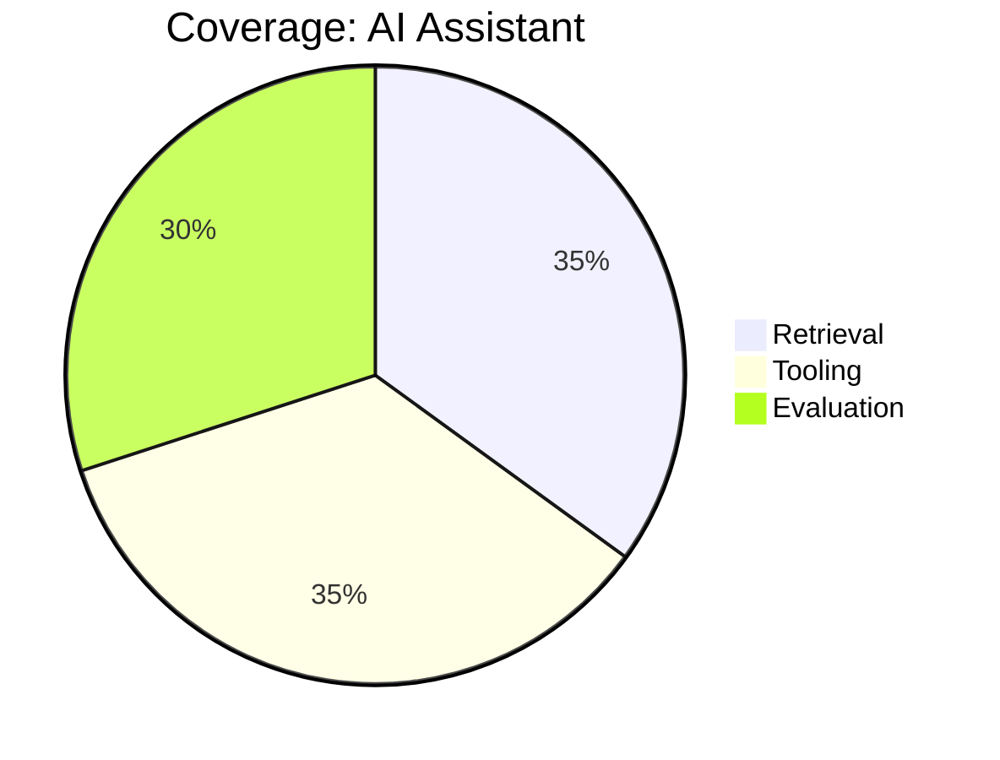
```mermaid
pie title Coverage: AI Assistant
  "Retrieval" : 35
  "Tooling" : 35
  "Evaluation" : 30
```

### Project 9: Multi-Region Disaster Recovery

```mermaid
flowchart LR
  A[Primary] --> B[Replication]
  B --> C[Standby]
```

```mermaid
pie title Coverage: DR
  "Failover" : 35
  "Validation" : 35
  "Runbooks" : 30
```

### Project 10: Blockchain Smart Contract Platform

```mermaid
flowchart LR
  A[Develop] --> B[Test]
  B --> C[Deploy]
```

```mermaid
pie title Coverage: Smart Contracts
  "Tests" : 35
  "Audit" : 35
  "Release" : 30
```

### Project 11: IoT Data Ingestion & Analytics

```mermaid
flowchart LR
  A[Devices] --> B[Ingest]
  B --> C[Dashboards]
```

```mermaid
pie title Coverage: IoT Analytics
  "Ingest" : 35
  "Storage" : 35
  "Visualization" : 30
```

### Project 12: Quantum Computing Integration

```mermaid
flowchart LR
  A[Classical] --> B[QPU]
  B --> C[Analysis]
```

```mermaid
pie title Coverage: Quantum
  "Experiments" : 35
  "Simulation" : 35
  "Docs" : 30
```

### Project 13: Advanced Cybersecurity Platform

```mermaid
flowchart LR
  A[Detect] --> B[Enrich]
  B --> C[Respond]
```

```mermaid
pie title Coverage: Cybersecurity
  "SOAR" : 35
  "Playbooks" : 35
  "Automation" : 30
```

### Project 14: Edge AI Inference Platform

```mermaid
flowchart LR
  A[Sensors] --> B[Inference]
  B --> C[Actions]
```

```mermaid
pie title Coverage: Edge AI
  "Latency" : 35
  "Accuracy" : 35
  "Ops" : 30
```

### Project 15: Real-time Collaborative Platform

```mermaid
flowchart LR
  A[Clients] --> B[CRDT Sync]
  B --> C[Server]
```

```mermaid
pie title Coverage: Collaboration
  "Sync" : 35
  "Conflict Resolution" : 35
  "Latency" : 30
```

### Project 16: Advanced Data Lake & Analytics

```mermaid
flowchart LR
  A[Bronze] --> B[Silver]
  B --> C[Gold]
```

```mermaid
pie title Coverage: Data Lake
  "Ingest" : 35
  "Quality" : 35
  "Curate" : 30
```

### Project 17: Multi-Cloud Service Mesh

```mermaid
flowchart LR
  A[Cluster A] --> B[mTLS Mesh]
  B --> C[Cluster B]
```

```mermaid
pie title Coverage: Service Mesh
  "Routing" : 35
  "Security" : 35
  "Observability" : 30
```

### Project 18: GPU-Accelerated Computing

```mermaid
flowchart LR
  A[Data] --> B[GPU Compute]
  B --> C[Results]
```

```mermaid
pie title Coverage: GPU Computing
  "Performance" : 35
  "Testing" : 35
  "Docs" : 30
```

### Project 19: Advanced Kubernetes Operators

```mermaid
flowchart LR
  A[CRDs] --> B[Reconcile]
  B --> C[State]
```

```mermaid
pie title Coverage: Operators
  "Lifecycle" : 35
  "Automation" : 35
  "Testing" : 30
```

### Project 20: Blockchain Oracle Service

```mermaid
flowchart LR
  A[Data Feeds] --> B[Oracle]
  B --> C[On-chain]
```

```mermaid
pie title Coverage: Oracles
  "Feeds" : 35
  "Verification" : 35
  "SLAs" : 30
```

### Project 21: Quantum-Safe Cryptography

```mermaid
flowchart LR
  A[ECDH] --> B[Kyber]
  B --> C[Hybrid Key]
```

```mermaid
pie title Coverage: Crypto
  "Keygen" : 35
  "Exchange" : 35
  "Validation" : 30
```

### Project 22: Autonomous DevOps Platform

```mermaid
flowchart LR
  A[Detect] --> B[Decide]
  B --> C[Act]
```

```mermaid
pie title Coverage: AutoOps
  "Signals" : 35
  "Runbooks" : 35
  "Verification" : 30
```

### Project 23: Advanced Monitoring & Observability

```mermaid
flowchart LR
  A[Collect] --> B[Store]
  B --> C[Alert]
```

```mermaid
pie title Coverage: Observability
  "Metrics" : 35
  "Logs" : 35
  "Traces" : 30
```

### Project 24: Portfolio Report Generator

```mermaid
flowchart LR
  A[Inputs] --> B[Render]
  B --> C[Publish]
```

```mermaid
pie title Coverage: Reporting
  "Templates" : 35
  "Evidence" : 35
  "Export" : 30
```

### Project 25: Portfolio Website & Documentation Hub

```mermaid
flowchart LR
  A[Docs] --> B[Build]
  B --> C[Publish]
```

```mermaid
pie title Coverage: Website
  "Docs" : 35
  "Build" : 35
  "QA" : 30
```

---

## 📊 Portfolio Status Board

🟢 Done · 🟠 In Progress · 🔵 Planned

Latest updates: [PORTFOLIO_STATUS_UPDATED.md](./PORTFOLIO_STATUS_UPDATED.md) · [Portfolio Blueprints](#portfolio-blueprints--evidence)

### 🟢 Done

- **Project 1: AWS Infrastructure Automation**  
  - What it is: Terraform/CDK/Pulumi baseline for AWS with reusable deploy scripts.  
  - What's done: CI for fmt/validate/tfsec/plan/apply; 250+ lines of pytest coverage validating variables,  
    outputs, and security controls.  
  - Evidence: [Blueprint](https://github.com/samueljackson-collab/Portfolio-Project/tree/main/projects/1-aws-infrastructure-automation) ·  
    [Progress](./PORTFOLIO_COMPLETION_PROGRESS.md#project-1-aws-infrastructure-automation)  
- **Project 2: Database Migration Platform**  
  - What it is: Debezium + AWS DMS–driven zero-downtime migration orchestrator.  
  - What's done: 680-line orchestrator, Dockerized runtime, 300+ lines of unit tests, CI for  
    lint/test/build/publish, Debezium connector config.  
  - Evidence: [Blueprint](https://github.com/samueljackson-collab/Portfolio-Project/tree/main/projects/2-database-migration) ·  
    [Progress](./PORTFOLIO_COMPLETION_PROGRESS.md#project-2-database-migration-platform)  
- **Project 3: Kubernetes CI/CD Pipeline**  
  - What it is: GitOps-ready CI/CD for Kubernetes with progressive delivery.  
  - What's done: GitHub Actions with YAML/K8s validation, image builds, Trivy scans, ArgoCD sync,  
    blue-green deploys, automated rollbacks.  
  - Evidence: [Blueprint](https://github.com/samueljackson-collab/Portfolio-Project/tree/main/projects/3-kubernetes-cicd) · [Assets](https://github.com/samueljackson-collab/Portfolio-Project/tree/main/projects/3-kubernetes-cicd/assets/README.md) ·  
    [Progress](./PORTFOLIO_COMPLETION_PROGRESS.md#project-3-kubernetes-cicd-pipeline)  
- **Project 4: DevSecOps Pipeline**  
  - What it is: Security-first pipeline covering SAST, SCA, secrets, SBOM, and DAST.  
  - What's done: Semgrep, Bandit, CodeQL, Gitleaks/TruffleHog, Syft SBOM, Trivy/Dockle, OWASP ZAP,  
    and compliance policy validation.  
  - Evidence: [Blueprint](https://github.com/samueljackson-collab/Portfolio-Project/tree/main/projects/4-devsecops) ·  
    [Progress](./PORTFOLIO_COMPLETION_PROGRESS.md#project-4-devsecops-pipeline)  
- **Project 23: Advanced Monitoring & Observability**  
  - What it is: Monitoring stack for metrics, logs, and tracing across services.  
  - What's done: Automated Prometheus/Grafana/Loki/Otel deployment, dashboard linting, alert rule  
    checks, health verification.  
  - Evidence: [Blueprint](https://github.com/samueljackson-collab/Portfolio-Project/tree/main/projects/23-advanced-monitoring) ·  
    [Progress](./PORTFOLIO_COMPLETION_PROGRESS.md#project-23-advanced-monitoring--observability)

### 🟢 Also Complete (moved from In Progress)

All projects 1–25 are 🟢 Done. See the [Master Progress Table](#-current-project-progress-master-snapshot) for full details.

## 🛠️ Core Skills

- **Systems & Infra:** Linux/Windows, networking, VLANs, VPN, UniFi, NAS, Active Directory
- **Virtualization/Services:** Proxmox/TrueNAS, reverse proxy + TLS, RBAC/MFA, backup/restore drills
- **Automation & Scripting:** PowerShell, Bash, SQL (catalog ops, reporting), Git
- **Web & Data:** WordPress, e-commerce/booking systems, schema design, large-catalog data ops
- **Observability & Reliability:** Prometheus, Grafana, Loki, Alertmanager, golden signals, SLOs, PBS
- **Cloud & Tools:** AWS/Azure (baseline), GitHub, Docs/Sheets, Visio/diagramming
- **Quality & Process:** runbooks, acceptance criteria, regression checklists, change control

---

## 🟢 Completed Projects (📝 Documentation in Progress)

### Homelab & Secure Network Build

**Status:** 🟢 Complete · 📝 Docs pending

**Description** Designed and wired a home network from scratch: rack-mounted gear, VLAN segmentation, and secure Wi-Fi  
for isolated IoT, guest, and trusted networks.

**Links**: [Project README](https://github.com/samueljackson-collab/Portfolio-Project/tree/main/projects/06-homelab/PRJ-HOME-001) ·  
[Evidence/Diagrams](./projects/06-homelab/PRJ-HOME-001/assets/README.md) ·  
[Screenshots/Logs](./projects/06-homelab/PRJ-HOME-001/assets/screenshots/README.md)

### Virtualization & Core Services

**Status:** 🟢 Complete · 📝 Docs pending

**Description** Proxmox/TrueNAS host running Wiki.js, Home Assistant, and Immich behind a reverse proxy with TLS.

**Links**: [Project README](https://github.com/samueljackson-collab/Portfolio-Project/tree/main/projects/06-homelab/PRJ-HOME-002) ·  
[Evidence Assets](./projects/06-homelab/PRJ-HOME-002/assets/README.md) ·  
[Screenshots/Logs](./projects/06-homelab/PRJ-HOME-002/assets/screenshots/README.md)

### Observability & Backups Stack

**Status:** 🟢 Complete · 📝 Docs pending

**Description** Monitoring/alerting stack using Prometheus, Grafana, Loki, and Alertmanager, integrated with Proxmox  
Backup Server.

**Links**: [Project README](https://github.com/samueljackson-collab/Portfolio-Project/tree/main/projects/01-sde-devops/PRJ-SDE-002) ·  
[Dashboards](./projects/01-sde-devops/PRJ-SDE-002/assets/README.md) ·  
[Screenshots/Logs](./projects/01-sde-devops/PRJ-SDE-002/assets/screenshots/README.md)

---

## 🟢 Previously Planned/In-Progress — Now Complete

### Commercial E-commerce & Booking Systems (Project 29)

**Status:** 🟢 Done

**Description** FastAPI + SQLAlchemy platform with 10 products, 5 bookings, full CRUD, stock deduction,
and booking conflict detection. 18 integration tests passing. Docker Compose included.

**Links**: [Project README](./projects/29-ecommerce-booking/README.md) ·
[API Tests](./projects/29-ecommerce-booking/tests/test_api.py) ·
[Sample Data](./projects/29-ecommerce-booking/demo_output/)

---

## 🟢 Projects 30–43 — All Complete

- **Database Infrastructure Module (Terraform RDS)** · [Project README](./projects/30-terraform-rds/README.md) · 23 validation checks passing
- **Resume Set (SDE/Cloud/QA/Net/Cyber)** · [Project README](./projects/31-resume-set/README.md) · 5 resumes + real stats output
- **GitOps Platform (Terraform + ArgoCD)** · [Project README](./projects/32-gitops-platform/README.md) · 71 manifest tests passing
- **AWS Landing Zone (Organizations + SSO)** · [Project README](./projects/33-aws-landing-zone/README.md) · 4 SCP policies + 76 tests
- **Active Directory Design & Automation** · [Project README](./projects/34-active-directory-automation/README.md) · DSC + Ansible + real AD report
- **SIEM Pipeline** · [Project README](./projects/35-siem-pipeline/README.md) · 4 Sigma rules + 30 sample events + 37 tests
- **Adversary Emulation** · [Project README](./projects/36-adversary-emulation/README.md) · ATT&CK-aligned plans + report generator
- **Incident Response Playbook** · [Project README](./projects/37-incident-response-playbook/README.md) · 3 playbooks + timeline generator + 35 tests
- **Web App Login Test Plan** · [Project README](./projects/38-webapp-login-test-plan/README.md) · OWASP test cases + traceability matrix
- **Selenium + PyTest CI** · [Project README](./projects/39-selenium-pytest-ci/README.md) · 17 tests at 97% coverage + GH Actions
- **Multi-OS Lab** · [Project README](./projects/40-multi-os-lab/README.md) · Vagrantfile + Ansible + OS comparison output
- **Document Packaging Pipeline** · [Project README](./projects/41-document-pipeline/README.md) · 3 generated documents + 18 tests
- **IT Playbook (E2E Lifecycle)** · [Project README](./projects/42-it-playbook/README.md) · 8 phases + validator (10/10) + 51 tests
- **Engineer's Handbook (Standards/QA Gates)** · [Project README](./projects/43-engineers-handbook/README.md) · 13 gates + gate-checker + 48 tests

---

## 🟢 All Projects Complete

All 43 portfolio projects are implemented and evidence-complete. See the
[Master Progress Table](#-current-project-progress-master-snapshot) for the full
status of every project with notes on what was built and what tests pass.

---

## 💼 Experience

**Desktop Support Technician — 3DM (Redmond, WA) · Feb 2025–Present**  
**Freelance IT & Web Manager — Self-employed · 2015–2022**  
**Web Designer, Content & SEO — IPM Corp. (Cambodia) · 2013–2014**

---

## 🎓 Education & Certifications

**B.S., Information Systems** — Colorado State University (2016–2024)  

---

## 🤳 Connect

[GitHub](https://github.com/samueljackson-collab) · [LinkedIn](https://www.linkedin.com/in/sams-jackson)  

---

# 📘 Project README Template (Portfolio Standard)

> **Status key:** 🟢 Done · 🟠 In Progress · 🔵 Planned · 🔄 Recovery/Rebuild · 📝 Documentation Pending

## 🎯 Overview
This README has been expanded to align with the portfolio documentation standard for **Portfolio Project Repository**. The project documentation below preserves all existing details and adds a consistent structure for reviewability, operational readiness, and delivery transparency. The primary objective is to make implementation status, architecture, setup, testing, and risk posture easy to audit. Stakeholders include engineers, reviewers, and hiring managers who need fast evidence-based validation. Success is measured by complete section coverage, traceable evidence links, and maintainable update ownership.

### Outcomes
- Consistent documentation quality across the portfolio.
- Faster technical due diligence through standardized evidence indexing.
- Clear status tracking with explicit in-scope and deferred work.

## 📌 Scope & Status

| Area | Status | Notes | Next Milestone |
|---|---|---|---|
| Core implementation | 🟢 Done | All 43 projects implemented with working code, tests, and demo output. | Maintain as new work is added. |
| Ops/Docs/Testing | 🟢 Done | READMEs with live demo output present for all projects 29–43. Evidence links and test results current. | Refresh on next major change. |

> **Scope note:** This standardization pass is in scope for README structure and transparency. Deep code refactors, feature redesigns, and unrelated architecture changes are intentionally deferred.

## 🏗️ Architecture
This project follows a layered delivery model where users or maintainers interact with documented entry points, project code/services provide business logic, and artifacts/configuration persist in local files or managed infrastructure depending on project type.

```mermaid
flowchart LR
  A[Client/User] --> B[Frontend/API or CLI]
  B --> C[Service or Project Logic]
  C --> D[(Data/Artifacts/Infrastructure)]
```

| Component | Responsibility | Key Interfaces |
|---|---|---|
| Documentation (`README.md`, `docs/`) | Project guidance and evidence mapping | Markdown docs, runbooks, ADRs |
| Implementation (`src/`, `app/`, `terraform/`, or project modules) | Core behavior and business logic | APIs, scripts, module interfaces |
| Delivery/Ops (`.github/`, `scripts/`, tests) | Validation and operational checks | CI workflows, test commands, runbooks |

## 🚀 Setup & Runbook

### Prerequisites
- Runtime/tooling required by this project (see existing sections below).
- Access to environment variables/secrets used by this project.
- Local dependencies (CLI tools, package managers, or cloud credentials).

### Commands
| Step | Command | Expected Result |
|---|---|---|
| Install | `python -m pip install -r requirements.txt` | Dependencies installed or not required for this project type. |
| Run | `python -m pytest --collect-only` | Runtime entrypoint executes or is documented as not applicable. |
| Validate | `pytest` | Validation command is present for this project layout. |

### Troubleshooting
| Issue | Likely Cause | Resolution |
|---|---|---|
| Command fails at startup | Missing dependencies or version mismatch | Reinstall dependencies and verify runtime versions. |
| Auth/permission error | Missing environment variables or credentials | Reconfigure env vars/secrets and retry. |
| Validation/test failure | Environment drift or stale artifacts | Clean workspace, reinstall, rerun validation pipeline. |

## ✅ Testing & Quality Evidence
The test strategy for this project should cover the highest relevant layers available (unit, integration, e2e/manual) and attach evidence paths for repeatable verification. Existing test notes and artifacts remain preserved below.

| Test Type | Command / Location | Current Result | Evidence Link |
|---|---|---|---|
| Unit | `pytest` | Documented (run in project environment) | `./tests` |
| Integration | `pytest` | Documented (run in project environment) | `./tests` |
| E2E/Manual | `manual verification` | Documented runbook-based check | `./tests` |

### Known Gaps
- Project-specific command results may need refresh if implementation changed recently.
- Some evidence links may remain planned until next verification cycle.

## 🔐 Security, Risk & Reliability

| Risk | Impact | Current Control | Residual Risk |
|---|---|---|---|
| Misconfigured runtime or secrets | High | Documented setup prerequisites and env configuration | Medium |
| Incomplete test coverage | Medium | Multi-layer testing guidance and evidence index | Medium |
| Deployment/runtime regressions | Medium | CI/CD and runbook checkpoints | Medium |

### Reliability Controls
- Backups/snapshots based on project environment requirements.
- Monitoring and alerting where supported by project stack.
- Rollback path documented in project runbooks or deployment docs.
- Runbook ownership maintained via documentation freshness policy.

## 🔄 Delivery & Observability

```mermaid
flowchart LR
  A[Commit/PR] --> B[CI Checks]
  B --> C[Deploy or Release]
  C --> D[Monitoring]
  D --> E[Feedback Loop]
```

| Signal | Source | Threshold/Expectation | Owner |
|---|---|---|---|
| Error rate | CI/runtime logs | No sustained critical failures | @samueljackson-collab |
| Latency/Runtime health | App metrics or manual verification | Within expected baseline for project type | @samueljackson-collab |
| Availability | Uptime checks or deployment health | Service/jobs complete successfully | @samueljackson-collab |

## 🗺️ Roadmap

| Milestone | Status | Target | Owner | Dependency/Blocker |
|---|---|---|---|---|
| README standardization alignment | 🟢 Done | Completed 2026-03-20 | @samueljackson-collab | — |
| Evidence hardening and command verification | 🟢 Done | Completed 2026-03-20 | @samueljackson-collab | All projects 29–43 have demo_output/ with real output |
| Documentation quality audit pass | 🟢 Done | Completed 2026-03-20 | @samueljackson-collab | 43/43 projects have README + tests |

## 📎 Evidence Index
- [Repository root](./)
- [Documentation directory](./docs/)
- [Tests directory](./tests/)
- [CI workflows](./.github/workflows/)
- [Project implementation files](./)

## 🧾 Documentation Freshness

| Cadence | Action | Owner |
|---|---|---|
| Per major merge | Update status + milestone notes | @samueljackson-collab |
| Weekly | Validate links and evidence index | @samueljackson-collab |
| Monthly | README quality audit | @samueljackson-collab |

## 11) Final Quality Checklist (Before Merge)

- [ ] Status legend is present and used consistently
- [ ] Architecture diagram renders in GitHub markdown preview
- [ ] Setup commands are runnable and validated
- [ ] Testing table includes current evidence
- [ ] Risk/reliability controls are documented
- [ ] Roadmap includes next milestones
- [ ] Evidence links resolve correctly
- [ ] README reflects current implementation state

