# Hi, I'm Sam Jackson

**[System Development Engineer](https://github.com/samueljackson-collab)** ·  
**[DevOps & QA Enthusiast](https://www.linkedin.com/in/sams-jackson)** ·  
**Freelance Full-Stack Web Developer**

[](https://github.com/samueljackson-collab/Portfolio-Project/actions/workflows/ci.yml)

***Building reliable systems, documenting clearly, and sharing what I learn. I turn ambiguous requirements into  
runbooks, dashboards, and repeatable processes.***

**Status key:** 🟢 Done · 🟠 In Progress · 🔵 Planned · 🔄 Recovery/Rebuild · 📝 Documentation Pending

> **Portfolio Note:** This repository is actively being built. Projects marked 🟢 are technically complete but  
> documentation/evidence is being prepared (📝). Projects marked 🔵 are planned roadmap items, and 🔄 indicates  
> recovery/rebuild efforts are underway.  
>  
> **Note:** Some project directories referenced below contain planning documentation and structure but are awaiting  
> evidence/asset uploads. Check individual project READMEs for current status.  
>  
> 📚 **New:** [Missing Documents Analysis](./MISSING_DOCUMENTS_ANALYSIS.md) |  
> [Quick Start Guide](./QUICK_START_GUIDE.md) | [Completion Checklist](./PROJECT_COMPLETION_CHECKLIST.md)

---

## ⚡ Quick Navigation

### Start here

- [Portfolio Documentation Hub](./DOCUMENTATION_INDEX.md)
- [Portfolio Validation Checklist](./PORTFOLIO_VALIDATION.md)
- [Portfolio Status Master Checklist](./PROJECT_STATUS_MASTER_CHECKLIST.md)

### Key artifacts

- [Portfolio Evidence Completion Summary](./PORTFOLIO_EVIDENCE_COMPLETION_SUMMARY.md)
- [Portfolio Infrastructure Guide](./PORTFOLIO_INFRASTRUCTURE_GUIDE.md)
- [Security Overview](./SECURITY.md)
- [Deployment Guide](./DEPLOYMENT.md)

### Ops & Observability

- [Observability Stack](./observability/README.md)
- [Home Assistant Dashboard](./HOME_ASSISTANT_DASHBOARD.md)

---

## 📈 GitHub Status Snapshot (Local Repository)

### Repository Pulse (local Git snapshot)

- **Active branch:** `work`
- **Last update:** 2026-01-05
- **Commits:** 777 total revisions
- **Tracked files:** 3,062 assets
- **Projects:** 43 portfolio showcases (25 core blueprints + 18 extended tracks)
- **READMEs:** 46 published guides

### Documentation & Infra Inventory

- **Markdown files:** 407 references · **Total words:** 506,150
- **Docker compose files:** 25 · **Terraform files:** 81 · **Config packs:** 54


## 🗺️ Repository Map (What lives where)

| Area | Purpose | What to look for |
| --- | --- | --- |
| `projects/` | Primary portfolio projects (1–43: core + extended tracks) | Project READMEs, architecture diagrams, runbooks, testing evidence |
| `docs/` | Deep-dive documentation | Architecture guides, process documentation, diagrams |
| `observability/` | Metrics + dashboards | Grafana dashboards, OpenTelemetry collector config |
| `terraform/` | IaC baseline | Shared infrastructure building blocks |
| `scripts/` | Automation helpers | Deployment, validation, and maintenance scripts |

```mermaid
flowchart TB
  Repo[Portfolio Repository] --> Projects["projects/ (1–43)"]
  Repo --> Docs["docs/ + runbooks"]
  Repo --> IaC["terraform/ + infrastructure/"]
  Repo --> Obs["observability/ + grafana dashboards"]
  Repo --> Ops["scripts/ + CI/CD workflows"]
```



## 🧭 Reviewer Fast Reference

- **Reviewer Checklist:** For a detailed validation checklist covering top metrics, interview workflow, and file map,  
  please see [**PORTFOLIO_VALIDATION.md**](./PORTFOLIO_VALIDATION.md). This file serves as the single source of truth  
  for validation runs.

---

## 🎯 Summary

System-minded engineer specializing in building, securing, and operating infrastructure and data-heavy web systems.  
Hands-on with homelab → production-like setups (wired rack, UniFi network, VPN, backup/restore drills), and pragmatic  
DevOps/QA practices.

<details><summary><strong>Alternate summaries for tailoring</strong></summary>

**DevOps-forward** DevOps-leaning systems engineer who builds and operates reliable services end-to-end:  
homelab→production patterns (networking, virtualization, reverse proxy + TLS, backups), monitoring (golden signals),  
and CI/CD automation.

**QA-forward** Quality-driven systems engineer turning ambiguous requirements into testable runbooks, acceptance  
criteria, and regression checklists. Builds monitoring dashboards for golden signals and SLOs.

</details>

---

## 🧪 Validation & Evidence Workflow

This portfolio is structured to make validation repeatable and auditable. The validation path below mirrors how the  
projects are maintained and reviewed.


### Recommended review sequence

1. Use [PORTFOLIO_VALIDATION.md](./PORTFOLIO_VALIDATION.md) for the canonical checklist.
2. Validate project readmes (scope, dependencies, operational steps).
3. Review IaC (`terraform/`, `infrastructure/`, project `infra/`).
4. Confirm monitoring dashboards (`observability/`, project `grafana/`).

---

## 📘 Guides

- [Wiki.js Setup Guide](./docs/wiki-js-setup-guide.md) — Complete walkthrough to deploy, harden, and populate a  
  Wiki.js instance for portfolio documentation.
- [Terraform Infrastructure Stack](./terraform/README.md) — Modular VPC, application, and monitoring IaC with CI/CD  
  and examples.
- [Terraform Architecture Diagrams](./docs/diagrams/terraform-network.md) — High-level, VPC, and component  
  relationship views.

## 💻 UI Components

- [EnterpriseWiki](./src/components/EnterpriseWiki.tsx) — React component that renders interactive learning paths for  
  SDE, DevOps, QA, and architecture roles.

## 🧭 Portfolio Blueprints & Evidence

- 🟢 [Project 1: AWS Infrastructure Automation](./projects/1-aws-infrastructure-automation/README.md) — Multi-tool  
  infrastructure-as-code implementation covering Terraform, AWS CDK, and Pulumi with reusable deploy scripts.
- 🟢 [Project 2: Database Migration Platform](./projects/2-database-migration/README.md) — Change data capture pipelines and  
  automation for zero-downtime migrations.
- 🟢 [Project 3: Kubernetes CI/CD Pipeline](./projects/3-kubernetes-cicd/README.md) — GitOps, progressive delivery, and  
  environment promotion policies.
- 🟢 [Project 4: DevSecOps Pipeline](./projects/4-devsecops/README.md) — Security scanning, SBOM publishing, and policy-as-code  
  enforcement.
- 🟢 [Project 5: Real-time Data Streaming](./projects/5-real-time-data-streaming/README.md) — Kafka, Flink, and schema registry  
  patterns for resilient stream processing.
- 🟢 [Project 6: Machine Learning Pipeline](./projects/6-mlops-platform/README.md) — End-to-end MLOps workflows with experiment  
  tracking and automated promotion.
- 🟢 [Project 7: Serverless Data Processing](./projects/7-serverless-data-processing/README.md) — Event-driven analytics built  
  on AWS Lambda, Step Functions, and DynamoDB.
- 🟢 [Project 8: Advanced AI Chatbot](./projects/8-advanced-ai-chatbot/README.md) — Retrieval-augmented assistant with vector  
  search, tool execution, and streaming responses.
- 🟢 [Project 9: Multi-Region Disaster Recovery](./projects/9-multi-region-disaster-recovery/README.md) — Automated failover,  
  replication validation, and DR runbooks.
- 🟢 [Project 10: Blockchain Smart Contract Platform](./projects/10-blockchain-smart-contract-platform/README.md) —  
  Hardhat-based DeFi stack with staking contracts and security tooling.
- 🟢 [Project 11: IoT Data Ingestion & Analytics](./projects/11-iot-data-analytics/README.md) — Edge telemetry simulation,  
  ingestion, and real-time dashboards.
- 🟢 [Project 12: Quantum Computing Integration](./projects/12-quantum-computing/README.md) — Hybrid quantum/classical  
  optimization workflows using Qiskit.
- 🟢 [Project 13: Advanced Cybersecurity Platform](./projects/13-advanced-cybersecurity/README.md) — SOAR engine with enrichment  
  adapters and automated response playbooks.
- 🟢 [Project 14: Edge AI Inference Platform](./projects/14-edge-ai-inference/README.md) — ONNX Runtime service optimized for  
  Jetson-class devices.
- 🟢 [Project 15: Real-time Collaborative Platform](./projects/15-real-time-collaboration/README.md) — Operational transform  
  collaboration server with CRDT reconciliation.
- 🟢 [Project 16: Advanced Data Lake & Analytics](./projects/16-advanced-data-lake/README.md) — Medallion architecture  
  transformations and Delta Lake patterns.
- 🟢 [Project 17: Multi-Cloud Service Mesh](./projects/17-multi-cloud-service-mesh/README.md) — Istio multi-cluster  
  configuration with mTLS and network overlays.
- 🟢 [Project 18: GPU-Accelerated Computing](./projects/18-gpu-accelerated-computing/README.md) — CuPy-powered Monte Carlo  
  simulations and GPU workload orchestration.
- 🟢 [Project 19: Advanced Kubernetes Operators](./projects/19-advanced-kubernetes-operators/README.md) — Kopf-based operator  
  managing portfolio stack lifecycles.
- 🟢 [Project 20: Blockchain Oracle Service](./projects/20-blockchain-oracle-service/README.md) — Chainlink adapter and consumer  
  contracts for on-chain metrics.
- 🟢 [Project 21: Quantum-Safe Cryptography](./projects/21-quantum-safe-cryptography/README.md) — Hybrid Kyber + ECDH key  
  exchange prototype.
- 🟢 [Project 22: Autonomous DevOps Platform](./projects/22-autonomous-devops-platform/README.md) — Event-driven remediation  
  workflows and runbooks-as-code.
- 🟢 [Project 23: Advanced Monitoring & Observability](./projects/23-advanced-monitoring/README.md) — Grafana dashboards,  
  alerting rules, and distributed tracing config.
- 🟢 [Project 24: Portfolio Report Generator](./projects/24-report-generator/README.md) — Automated report templating with  
  Jinja2.
- 🟢 [Project 25: Portfolio Website & Documentation Hub](./projects/25-portfolio-website/README.md) — VitePress-powered portal  
  aggregating all documentation and guides.

### Extended Portfolio Tracks (Projects 26–43)

These additional tracks are active/planned in GitHub and reflected in this repository narrative so the portfolio scope
now exceeds 25 projects.

- 🟢 **Project 26: Homelab & Secure Network Build** — Rack-based segmented network with VLAN isolation, secure Wi-Fi zones, and remote admin VPN.
- 🟢 **Project 27: Virtualization & Core Services** — Proxmox/TrueNAS platform hosting Wiki.js, Home Assistant, and Immich with TLS reverse proxy.
- 🟢 **Project 28: Observability & Backups Stack** — Prometheus/Grafana/Loki/Alertmanager integrated with Proxmox backup workflows.
- 🔄 **Project 29: Commercial E-commerce & Booking Systems Recovery** — Rebuild effort for prior production systems and operational documentation.
- 🟠 **Project 30: Database Infrastructure Module (Terraform RDS)** — Modular Terraform baseline for resilient relational database provisioning.
- 🟠 **Project 31: Resume Set (SDE/Cloud/QA/Net/Cyber)** — Role-targeted resume suite and supporting content automation workflow.
- 🔵 **Project 32: GitOps Platform with IaC (Terraform + ArgoCD)** — End-to-end GitOps control plane with declarative environment promotion.
- 🔵 **Project 33: AWS Landing Zone (Organizations + SSO)** — Multi-account security baseline using AWS Organizations and centralized identity.
- 🔵 **Project 34: Active Directory Design & Automation (DSC/Ansible)** — Domain architecture templates and repeatable configuration automation.
- 🔵 **Project 35: SIEM Pipeline** — Security telemetry ingest and detection pipeline with dashboarded blue-team workflows.
- 🔵 **Project 36: Adversary Emulation** — Safe ATT&CK-aligned emulation suite for validating detection and response quality.
- 🔵 **Project 37: Incident Response Playbook** — Structured ransomware-focused IR runbook and escalation framework.
- 🔵 **Project 38: Web App Login Test Plan** — Functional, security, and performance testing blueprint for authentication systems.
- 🔵 **Project 39: Selenium + PyTest CI** — Automated UI validation pipeline integrated with GitHub Actions.
- 🔵 **Project 40: Multi-OS Lab** — Comparative lab environment spanning Kali, Slacko Puppy, and Ubuntu.
- 🔵 **Project 41: Document Packaging Pipeline** — Prompt-to-document automation for Docs/PDF/XLSX publication.
- 🔵 **Project 42: IT Playbook (E2E Lifecycle)** — Cross-functional service lifecycle playbook from intake through operations.
- 🔵 **Project 43: Engineer's Handbook (Standards/QA Gates)** — Practical engineering standards and quality gate reference.

---

## 🧩 Project Visuals (Charts + Diagrams)

### Project 1: AWS Infrastructure Automation


### Project 2: Database Migration Platform


### Project 3: Kubernetes CI/CD Pipeline


### Project 4: DevSecOps Pipeline


### Project 5: Real-time Data Streaming


### Project 6: Machine Learning Pipeline


### Project 7: Serverless Data Processing


### Project 8: Advanced AI Chatbot


### Project 9: Multi-Region Disaster Recovery

```mermaid
flowchart LR
  A[Primary] --> B[Replication]
  B --> C[Standby]
```

```mermaid
pie title Coverage: DR
  "Failover" : 35
  "Validation" : 35
  "Runbooks" : 30
```

### Project 10: Blockchain Smart Contract Platform

```mermaid
flowchart LR
  A[Develop] --> B[Test]
  B --> C[Deploy]
```

```mermaid
pie title Coverage: Smart Contracts
  "Tests" : 35
  "Audit" : 35
  "Release" : 30
```

### Project 11: IoT Data Ingestion & Analytics

```mermaid
flowchart LR
  A[Devices] --> B[Ingest]
  B --> C[Dashboards]
```

```mermaid
pie title Coverage: IoT Analytics
  "Ingest" : 35
  "Storage" : 35
  "Visualization" : 30
```

### Project 12: Quantum Computing Integration

```mermaid
flowchart LR
  A[Classical] --> B[QPU]
  B --> C[Analysis]
```

```mermaid
pie title Coverage: Quantum
  "Experiments" : 35
  "Simulation" : 35
  "Docs" : 30
```

### Project 13: Advanced Cybersecurity Platform

```mermaid
flowchart LR
  A[Detect] --> B[Enrich]
  B --> C[Respond]
```

```mermaid
pie title Coverage: Cybersecurity
  "SOAR" : 35
  "Playbooks" : 35
  "Automation" : 30
```

### Project 14: Edge AI Inference Platform

```mermaid
flowchart LR
  A[Sensors] --> B[Inference]
  B --> C[Actions]
```

```mermaid
pie title Coverage: Edge AI
  "Latency" : 35
  "Accuracy" : 35
  "Ops" : 30
```

### Project 15: Real-time Collaborative Platform

```mermaid
flowchart LR
  A[Clients] --> B[CRDT Sync]
  B --> C[Server]
```

```mermaid
pie title Coverage: Collaboration
  "Sync" : 35
  "Conflict Resolution" : 35
  "Latency" : 30
```

### Project 16: Advanced Data Lake & Analytics

```mermaid
flowchart LR
  A[Bronze] --> B[Silver]
  B --> C[Gold]
```

```mermaid
pie title Coverage: Data Lake
  "Ingest" : 35
  "Quality" : 35
  "Curate" : 30
```

### Project 17: Multi-Cloud Service Mesh

```mermaid
flowchart LR
  A[Cluster A] --> B[mTLS Mesh]
  B --> C[Cluster B]
```

```mermaid
pie title Coverage: Service Mesh
  "Routing" : 35
  "Security" : 35
  "Observability" : 30
```

### Project 18: GPU-Accelerated Computing

```mermaid
flowchart LR
  A[Data] --> B[GPU Compute]
  B --> C[Results]
```

```mermaid
pie title Coverage: GPU Computing
  "Performance" : 35
  "Testing" : 35
  "Docs" : 30
```

### Project 19: Advanced Kubernetes Operators

```mermaid
flowchart LR
  A[CRDs] --> B[Reconcile]
  B --> C[State]
```

```mermaid
pie title Coverage: Operators
  "Lifecycle" : 35
  "Automation" : 35
  "Testing" : 30
```

### Project 20: Blockchain Oracle Service

```mermaid
flowchart LR
  A[Data Feeds] --> B[Oracle]
  B --> C[On-chain]
```

```mermaid
pie title Coverage: Oracles
  "Feeds" : 35
  "Verification" : 35
  "SLAs" : 30
```

### Project 21: Quantum-Safe Cryptography

```mermaid
flowchart LR
  A[ECDH] --> B[Kyber]
  B --> C[Hybrid Key]
```

```mermaid
pie title Coverage: Crypto
  "Keygen" : 35
  "Exchange" : 35
  "Validation" : 30
```

### Project 22: Autonomous DevOps Platform

```mermaid
flowchart LR
  A[Detect] --> B[Decide]
  B --> C[Act]
```

```mermaid
pie title Coverage: AutoOps
  "Signals" : 35
  "Runbooks" : 35
  "Verification" : 30
```

### Project 23: Advanced Monitoring & Observability

```mermaid
flowchart LR
  A[Collect] --> B[Store]
  B --> C[Alert]
```

```mermaid
pie title Coverage: Observability
  "Metrics" : 35
  "Logs" : 35
  "Traces" : 30
```

### Project 24: Portfolio Report Generator

```mermaid
flowchart LR
  A[Inputs] --> B[Render]
  B --> C[Publish]
```

```mermaid
pie title Coverage: Reporting
  "Templates" : 35
  "Evidence" : 35
  "Export" : 30
```

### Project 25: Portfolio Website & Documentation Hub

```mermaid
flowchart LR
  A[Docs] --> B[Build]
  B --> C[Publish]
```

```mermaid
pie title Coverage: Website
  "Docs" : 35
  "Build" : 35
  "QA" : 30
```

---

## 📊 Portfolio Status Board

🟢 Done · 🟠 In Progress · 🔵 Planned

Latest updates: [PORTFOLIO_STATUS_UPDATED.md](./PORTFOLIO_STATUS_UPDATED.md) · [Portfolio Blueprints](#portfolio-blueprints--evidence)

### 🟢 Done

- **Project 1: AWS Infrastructure Automation**  
  - What it is: Terraform/CDK/Pulumi baseline for AWS with reusable deploy scripts.  
  - What's done: CI for fmt/validate/tfsec/plan/apply; 250+ lines of pytest coverage validating variables,  
    outputs, and security controls.  
  - Evidence: [Blueprint](https://github.com/samueljackson-collab/Portfolio-Project/tree/main/projects/1-aws-infrastructure-automation) ·  
    [Progress](./PORTFOLIO_COMPLETION_PROGRESS.md#project-1-aws-infrastructure-automation)  
- **Project 2: Database Migration Platform**  
  - What it is: Debezium + AWS DMS–driven zero-downtime migration orchestrator.  
  - What's done: 680-line orchestrator, Dockerized runtime, 300+ lines of unit tests, CI for  
    lint/test/build/publish, Debezium connector config.  
  - Evidence: [Blueprint](https://github.com/samueljackson-collab/Portfolio-Project/tree/main/projects/2-database-migration) ·  
    [Progress](./PORTFOLIO_COMPLETION_PROGRESS.md#project-2-database-migration-platform)  
- **Project 3: Kubernetes CI/CD Pipeline**  
  - What it is: GitOps-ready CI/CD for Kubernetes with progressive delivery.  
  - What's done: GitHub Actions with YAML/K8s validation, image builds, Trivy scans, ArgoCD sync,  
    blue-green deploys, automated rollbacks.  
  - Evidence: [Blueprint](https://github.com/samueljackson-collab/Portfolio-Project/tree/main/projects/3-kubernetes-cicd) · [Assets](https://github.com/samueljackson-collab/Portfolio-Project/tree/main/projects/3-kubernetes-cicd/assets/README.md) ·  
    [Progress](./PORTFOLIO_COMPLETION_PROGRESS.md#project-3-kubernetes-cicd-pipeline)  
- **Project 4: DevSecOps Pipeline**  
  - What it is: Security-first pipeline covering SAST, SCA, secrets, SBOM, and DAST.  
  - What's done: Semgrep, Bandit, CodeQL, Gitleaks/TruffleHog, Syft SBOM, Trivy/Dockle, OWASP ZAP,  
    and compliance policy validation.  
  - Evidence: [Blueprint](https://github.com/samueljackson-collab/Portfolio-Project/tree/main/projects/4-devsecops) ·  
    [Progress](./PORTFOLIO_COMPLETION_PROGRESS.md#project-4-devsecops-pipeline)  
- **Project 23: Advanced Monitoring & Observability**  
  - What it is: Monitoring stack for metrics, logs, and tracing across services.  
  - What's done: Automated Prometheus/Grafana/Loki/Otel deployment, dashboard linting, alert rule  
    checks, health verification.  
  - Evidence: [Blueprint](https://github.com/samueljackson-collab/Portfolio-Project/tree/main/projects/23-advanced-monitoring) ·  
    [Progress](./PORTFOLIO_COMPLETION_PROGRESS.md#project-23-advanced-monitoring--observability)

### 🟠 In Progress

- **Project 6: Machine Learning Pipeline**  
  - Focus: Phase 2 expansion—experiment tracking, model promotion gates, Docker images for training/serving.  
  - Next: Integrate experiment registry and CI hooks for promotion approvals.  
  - Links: [Blueprint](https://github.com/samueljackson-collab/Portfolio-Project/tree/main/projects/6-mlops-platform) · [Roadmap](./ACTION_PLAN.md)  
- **Project 7: Serverless Data Processing**  
  - Focus: Lambda/Step Functions pipelines with IaC and CDC ingestion.  
  - Next: Add unit tests and failure-handling paths; wire to validation harness.  
  - Links: [Blueprint](https://github.com/samueljackson-collab/Portfolio-Project/tree/main/projects/7-serverless-data-processing) · [Roadmap](./ACTION_PLAN.md)  
- **Project 8: Advanced AI Chatbot**  
  - Focus: RAG pipeline and tool-execution flow with evaluation harness.  
  - Next: Containerize services, add retrieval evals, and wire telemetry.  
  - Links: [Blueprint](https://github.com/samueljackson-collab/Portfolio-Project/tree/main/projects/8-advanced-ai-chatbot) · [Roadmap](./ACTION_PLAN.md)  
- **Project 10: Blockchain Smart Contract Platform**  
  - Focus: Hardhat-based contracts with audits and deployment automation.  
  - Next: Expand CI coverage, add audit scripts, and release pipelines.  
  - Links: [Blueprint](https://github.com/samueljackson-collab/Portfolio-Project/tree/main/projects/10-blockchain-smart-contract-platform) · [Roadmap](./ACTION_PLAN.md)  
- **Project 15: Real-time Collaborative Platform**  
  - Focus: CRDT/OT engine for collaborative editing.  
  - Next: Conflict resolution tests, latency simulations, and deploy automation.  
  - Links: [Blueprint](https://github.com/samueljackson-collab/Portfolio-Project/tree/main/projects/15-real-time-collaboration) · [Roadmap](./ACTION_PLAN.md)  
- **Project 25: Portfolio Website & Documentation Hub**  
  - Focus: VitePress site hosting portfolio docs and reports.  
  - Next: Improve navigation/badges, automate report publishing, and add status cards.  
  - Links: [Blueprint](https://github.com/samueljackson-collab/Portfolio-Project/tree/main/projects/25-portfolio-website) · [Site](./portfolio-website/README.md)

### 🔵 Planned

- **Project 5: Real-time Data Streaming**  
  - Plan: Kafka/Flink data plane with schema registry, CDC ingestion, and stream quality checks.  
  - Links: [Blueprint](./projects/5-real-time-data-streaming/README.md)  
- **Project 9: Multi-Region Disaster Recovery**  
  - Plan: DR drills, replication validation, automated failover tests, and runbooks.  
  - Links: [Blueprint](./projects/9-multi-region-disaster-recovery/README.md)  
- **Project 11: IoT Data Ingestion & Analytics**  
  - Plan: Edge telemetry simulators feeding stream processing and dashboards.  
  - Links: [Blueprint](./projects/11-iot-data-analytics/README.md)  
- **Project 12: Quantum Computing Integration**  
  - Plan: Qiskit hybrid workflows for optimization experiments.  
  - Links: [Blueprint](./projects/12-quantum-computing/README.md)  
- **Project 13: Advanced Cybersecurity Platform**  
  - Plan: SOAR pipeline with enrichment adapters, detections, and response playbooks.  
  - Links: [Blueprint](./projects/13-advanced-cybersecurity/README.md)  
- **Project 14: Edge AI Inference Platform**  
  - Plan: ONNX Runtime service for Jetson-class deployments with perf tuning and telemetry.  
  - Links: [Blueprint](./projects/14-edge-ai-inference/README.md)  
- **Project 16: Advanced Data Lake & Analytics**  
  - Plan: Medallion architecture, Delta Lake transformations, and data quality checks.  
  - Links: [Blueprint](./projects/16-advanced-data-lake/README.md)  
- **Project 17: Multi-Cloud Service Mesh**  
  - Plan: Istio multi-cluster blueprint with mTLS, policy controls, and failover scenarios.  
  - Links: [Blueprint](./projects/17-multi-cloud-service-mesh/README.md)  
- **Project 18: GPU-Accelerated Computing**  
  - Plan: CuPy-powered Monte Carlo workloads and orchestration patterns.  
  - Links: [Blueprint](./projects/18-gpu-accelerated-computing/README.md)  
- **Project 19: Advanced Kubernetes Operators**  
  - Plan: Kopf-based operator managing portfolio lifecycle automation.  
  - Links: [Blueprint](./projects/19-advanced-kubernetes-operators/README.md)  
- **Project 20: Blockchain Oracle Service**  
  - Plan: Chainlink adapters plus consumer contracts with monitoring hooks.  
  - Links: [Blueprint](./projects/20-blockchain-oracle-service/README.md)  
- **Project 21: Quantum-Safe Cryptography**  
  - Plan: Hybrid Kyber + ECDH key exchange prototype with interoperability tests.  
  - Links: [Blueprint](./projects/21-quantum-safe-cryptography/README.md)  
- **Project 22: Autonomous DevOps Platform**  
  - Plan: Event-driven remediation flows, runbooks-as-code, and policy-driven automation.  
  - Links: [Blueprint](./projects/22-autonomous-devops-platform/README.md)  
- **Project 24: Portfolio Report Generator**  
  - Plan: Jinja2-driven document factory with CLI/CI hooks for batch publishing and evidence packaging.  
  - Links: [Blueprint](./projects/24-report-generator/README.md)

## 🛠️ Core Skills

- **Systems & Infra:** Linux/Windows, networking, VLANs, VPN, UniFi, NAS, Active Directory
- **Virtualization/Services:** Proxmox/TrueNAS, reverse proxy + TLS, RBAC/MFA, backup/restore drills
- **Automation & Scripting:** PowerShell, Bash, SQL (catalog ops, reporting), Git
- **Web & Data:** WordPress, e-commerce/booking systems, schema design, large-catalog data ops
- **Observability & Reliability:** Prometheus, Grafana, Loki, Alertmanager, golden signals, SLOs, PBS
- **Cloud & Tools:** AWS/Azure (baseline), GitHub, Docs/Sheets, Visio/diagramming
- **Quality & Process:** runbooks, acceptance criteria, regression checklists, change control

---

## 🟢 Completed Projects (📝 Documentation in Progress)

### Homelab & Secure Network Build

**Status:** 🟢 Complete · 📝 Docs pending

**Description** Designed and wired a home network from scratch: rack-mounted gear, VLAN segmentation, and secure Wi-Fi  
for isolated IoT, guest, and trusted networks.

**Links**: [Project README](https://github.com/samueljackson-collab/Portfolio-Project/tree/main/projects/06-homelab/PRJ-HOME-001) ·  
[Evidence/Diagrams](./projects/06-homelab/PRJ-HOME-001/assets/README.md) ·  
[Screenshots/Logs](./projects/06-homelab/PRJ-HOME-001/assets/screenshots/README.md)

### Virtualization & Core Services

**Status:** 🟢 Complete · 📝 Docs pending

**Description** Proxmox/TrueNAS host running Wiki.js, Home Assistant, and Immich behind a reverse proxy with TLS.

**Links**: [Project README](https://github.com/samueljackson-collab/Portfolio-Project/tree/main/projects/06-homelab/PRJ-HOME-002) ·  
[Evidence Assets](./projects/06-homelab/PRJ-HOME-002/assets/README.md) ·  
[Screenshots/Logs](./projects/06-homelab/PRJ-HOME-002/assets/screenshots/README.md)

### Observability & Backups Stack

**Status:** 🟢 Complete · 📝 Docs pending

**Description** Monitoring/alerting stack using Prometheus, Grafana, Loki, and Alertmanager, integrated with Proxmox  
Backup Server.

**Links**: [Project README](https://github.com/samueljackson-collab/Portfolio-Project/tree/main/projects/01-sde-devops/PRJ-SDE-002) ·  
[Dashboards](./projects/01-sde-devops/PRJ-SDE-002/assets/README.md) ·  
[Screenshots/Logs](./projects/01-sde-devops/PRJ-SDE-002/assets/screenshots/README.md)

---

## 🔄 Past Projects Requiring Recovery

Older commercial efforts live in cold storage while I recreate code, processes, and documentation that were  
lost when a retired workstation took the original knowledge base with it. Fresh assets will be published as  
they're rebuilt.

### Commercial E-commerce & Booking Systems (Rebuild in Progress)

**Status:** 🔄 Recovery in progress

**Description** Previously built and managed: resort booking site; high-SKU flooring store; tours site with complex  
variations. Code and process docs are being rebuilt for publication.

**Links**: [Project README & Recovery Plan](https://github.com/samueljackson-collab/Portfolio-Project/tree/main/projects/08-web-data/PRJ-WEB-001) ·  
[Recovery Timeline](./projects/08-web-data/PRJ-WEB-001/RECOVERY_TIMELINE.md) ·  
[Artifacts (backup catalog, ERD, runbooks)](./projects/08-web-data/PRJ-WEB-001/assets/README.md)

> **Recovery plan & timeline:** Catalog and restore SQL workflows and automation scripts (Week 1), re-document content  
> management processes and deployment steps (Week 2), publish refreshed artifacts (Week 3+).

---

## 🟠 In-Progress Projects (Milestones)

- **Database Infrastructure Module (Terraform RDS)** · [Project README](./projects/01-sde-devops/PRJ-SDE-001/README.md) ·  
  ✅ Module complete, expanding to full-stack
- **Resume Set (SDE/Cloud/QA/Net/Cyber)** · [Project README](./professional/resume/README.md) ·  
  📝 Structure created, content in progress

### 🔵 Planned Infrastructure Projects

- **GitOps Platform with IaC (Terraform + ArgoCD)** · *Roadmap defined*
- **AWS Landing Zone (Organizations + SSO)** · *Research phase*
- **Active Directory Design & Automation (DSC/Ansible)** · *Planning phase*

---

## 🔵 Planned Projects (Roadmaps)

### Cybersecurity Projects

- **SIEM Pipeline**: Sysmon → Ingest → Detections → Dashboards · *Blue team defense*
- **Adversary Emulation**: Validate detections via safe ATT&CK TTP emulation · *Purple team testing*
- **Incident Response Playbook**: Clear IR guidance for ransomware · *Operations readiness*

### QA & Testing Projects

- **Web App Login Test Plan**: Functional, security, and performance test design · *Test strategy*
- **Selenium + PyTest CI**: Automate UI sanity runs in GitHub Actions · *Test automation*

### Infrastructure Expansion

- **Multi-OS Lab**: Kali, SlackoPuppy, Ubuntu lab for comparative analysis · *Homelab expansion*

### Automation & Tooling

- **Document Packaging Pipeline**: One-click generation of Docs/PDFs/XLSX from prompts · *Documentation automation*

### Process Documentation

- **IT Playbook (E2E Lifecycle)**: Unifying playbook from intake to operations · *Operational excellence*
- **Engineer's Handbook (Standards/QA Gates)**: Practical standards and quality bars · *Quality framework*

---

## 💼 Experience

**Desktop Support Technician — 3DM (Redmond, WA) · Feb 2025–Present**  
**Freelance IT & Web Manager — Self-employed · 2015–2022**  
**Web Designer, Content & SEO — IPM Corp. (Cambodia) · 2013–2014**

---

## 🎓 Education & Certifications

**B.S., Information Systems** — Colorado State University (2016–2024)  

---

## 🤳 Connect

[GitHub](https://github.com/samueljackson-collab) · [LinkedIn](https://www.linkedin.com/in/sams-jackson)  
[](https://github.com/samueljackson-collab)

---

# 📘 Project README Template (Portfolio Standard)

> **Status key:** 🟢 Done · 🟠 In Progress · 🔵 Planned · 🔄 Recovery/Rebuild · 📝 Documentation Pending

## 🎯 Overview
This README has been expanded to align with the portfolio documentation standard for **Portfolio Project Repository**. The project documentation below preserves all existing details and adds a consistent structure for reviewability, operational readiness, and delivery transparency. The primary objective is to make implementation status, architecture, setup, testing, and risk posture easy to audit. Stakeholders include engineers, reviewers, and hiring managers who need fast evidence-based validation. Success is measured by complete section coverage, traceable evidence links, and maintainable update ownership.

### Outcomes
- Consistent documentation quality across the portfolio.
- Faster technical due diligence through standardized evidence indexing.
- Clear status tracking with explicit in-scope and deferred work.

## 📌 Scope & Status

| Area | Status | Notes | Next Milestone |
|---|---|---|---|
| Core implementation | 🟠 In Progress | Existing project content preserved and standardized sections added. | Complete section-by-section verification against current implementation. |
| Ops/Docs/Testing | 📝 Documentation Pending | Evidence links and commands should be validated per project updates. | Refresh command outputs and evidence after next major change. |

> **Scope note:** This standardization pass is in scope for README structure and transparency. Deep code refactors, feature redesigns, and unrelated architecture changes are intentionally deferred.

## 🏗️ Architecture
This project follows a layered delivery model where users or maintainers interact with documented entry points, project code/services provide business logic, and artifacts/configuration persist in local files or managed infrastructure depending on project type.

```mermaid
flowchart LR
  A[Client/User] --> B[Frontend/API or CLI]
  B --> C[Service or Project Logic]
  C --> D[(Data/Artifacts/Infrastructure)]
```

| Component | Responsibility | Key Interfaces |
|---|---|---|
| Documentation (`README.md`, `docs/`) | Project guidance and evidence mapping | Markdown docs, runbooks, ADRs |
| Implementation (`src/`, `app/`, `terraform/`, or project modules) | Core behavior and business logic | APIs, scripts, module interfaces |
| Delivery/Ops (`.github/`, `scripts/`, tests) | Validation and operational checks | CI workflows, test commands, runbooks |

## 🚀 Setup & Runbook

### Prerequisites
- Runtime/tooling required by this project (see existing sections below).
- Access to environment variables/secrets used by this project.
- Local dependencies (CLI tools, package managers, or cloud credentials).

### Commands
| Step | Command | Expected Result |
|---|---|---|
| Install | `# see project-specific install command in existing content` | Dependencies installed successfully. |
| Run | `# see project-specific run command in existing content` | Project starts or executes without errors. |
| Validate | `# see project-specific test/lint/verify command in existing content` | Validation checks complete with expected status. |

### Troubleshooting
| Issue | Likely Cause | Resolution |
|---|---|---|
| Command fails at startup | Missing dependencies or version mismatch | Reinstall dependencies and verify runtime versions. |
| Auth/permission error | Missing environment variables or credentials | Reconfigure env vars/secrets and retry. |
| Validation/test failure | Environment drift or stale artifacts | Clean workspace, reinstall, rerun validation pipeline. |

## ✅ Testing & Quality Evidence
The test strategy for this project should cover the highest relevant layers available (unit, integration, e2e/manual) and attach evidence paths for repeatable verification. Existing test notes and artifacts remain preserved below.

| Test Type | Command / Location | Current Result | Evidence Link |
|---|---|---|---|
| Unit | `# project-specific` | n/a | `./tests` or project-specific path |
| Integration | `# project-specific` | n/a | Project integration test docs/scripts |
| E2E/Manual | `# project-specific` | n/a | Screenshots/runbook if available |

### Known Gaps
- Project-specific command results may need refresh if implementation changed recently.
- Some evidence links may remain planned until next verification cycle.

## 🔐 Security, Risk & Reliability

| Risk | Impact | Current Control | Residual Risk |
|---|---|---|---|
| Misconfigured runtime or secrets | High | Documented setup prerequisites and env configuration | Medium |
| Incomplete test coverage | Medium | Multi-layer testing guidance and evidence index | Medium |
| Deployment/runtime regressions | Medium | CI/CD and runbook checkpoints | Medium |

### Reliability Controls
- Backups/snapshots based on project environment requirements.
- Monitoring and alerting where supported by project stack.
- Rollback path documented in project runbooks or deployment docs.
- Runbook ownership maintained via documentation freshness policy.

## 🔄 Delivery & Observability

```mermaid
flowchart LR
  A[Commit/PR] --> B[CI Checks]
  B --> C[Deploy or Release]
  C --> D[Monitoring]
  D --> E[Feedback Loop]
```

| Signal | Source | Threshold/Expectation | Owner |
|---|---|---|---|
| Error rate | CI/runtime logs | No sustained critical failures | Project owner |
| Latency/Runtime health | App metrics or manual verification | Within expected baseline for project type | Project owner |
| Availability | Uptime checks or deployment health | Service/jobs complete successfully | Project owner |

## 🗺️ Roadmap

| Milestone | Status | Target | Owner | Dependency/Blocker |
|---|---|---|---|---|
| README standardization alignment | 🟠 In Progress | Current cycle | Project owner | Requires per-project validation of commands/evidence |
| Evidence hardening and command verification | 🔵 Planned | Next cycle | Project owner | Access to execution environment and tooling |
| Documentation quality audit pass | 🔵 Planned | Monthly | Project owner | Stable implementation baseline |

## 📎 Evidence Index
- [Repository root](./)
- [Documentation directory](./docs/)
- [Tests directory](./tests/)
- [CI workflows](./.github/workflows/)
- [Project implementation files](./)

## 🧾 Documentation Freshness

| Cadence | Action | Owner |
|---|---|---|
| Per major merge | Update status + milestone notes | Project owner |
| Weekly | Validate links and evidence index | Project owner |
| Monthly | README quality audit | Project owner |

## 11) Final Quality Checklist (Before Merge)

- [ ] Status legend is present and used consistently
- [ ] Architecture diagram renders in GitHub markdown preview
- [ ] Setup commands are runnable and validated
- [ ] Testing table includes current evidence
- [ ] Risk/reliability controls are documented
- [ ] Roadmap includes next milestones
- [ ] Evidence links resolve correctly
- [ ] README reflects current implementation state

## 📚 Expanded Onboarding Guide (Additive Improvement)

This section intentionally expands guidance for new contributors and operators without removing any existing project content.

### Getting Started Tips
- Start by reading this README top-to-bottom once before executing commands.
- Validate runtime versions early to avoid non-obvious install failures.
- Prefer reproducible commands and copy exact examples where possible.
- Keep local notes for environment-specific deviations.
- Re-run validation commands after each meaningful change.

### Review & Contribution Tips
- Keep pull requests focused and incremental.
- Attach evidence (logs, screenshots, test output) for non-trivial changes.
- Update runbooks and README sections in the same PR as code changes.
- Document assumptions explicitly, especially around infrastructure dependencies.
- Prefer explicit rollback notes over implicit recovery expectations.

### Operational Tips
- Verify credentials and environment variables before deployment steps.
- Track baseline behavior before introducing optimizations.
- Capture incident learnings and feed them into runbooks.
- Keep dependency upgrades isolated and validated with tests.
- Reconfirm monitoring/alert routing after any integration changes.

### Documentation Quality Tips
- Ensure links are relative when possible for portability.
- Keep command examples executable and current.
- Mark planned items clearly instead of omitting sections.
- Add troubleshooting entries whenever a recurring issue appears.
- Refresh roadmap and status tables at consistent intervals.

