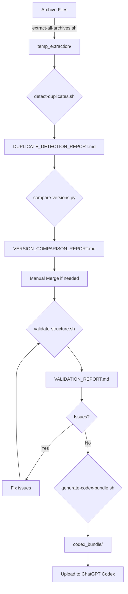

# Portfolio Merge Tools - Complete Summary

**Generated:** 2025-11-10
**Status:** ✅ All tools ready for use

---

## 📁 Files Created

### Documentation (7 files)

| File | Purpose | Size |
|------|---------|------|
| `docs/STRUCTURE_ANALYSIS_AND_MERGE_PLAN.md` | Complete structure analysis and merge strategy | Comprehensive |
| `docs/PORTFOLIO_MERGE_USAGE_GUIDE.md` | Step-by-step usage guide for all tools | Detailed |
| `MERGE_QUICKSTART.md` | Fast-track quick start guide | Quick reference |
| `docs/MERGE_TOOLS_SUMMARY.md` | This file - overview of all tools | Summary |
| `docs/DUPLICATE_DETECTION_REPORT.md` | Generated by detect-duplicates.sh | Auto-generated |
| `docs/VERSION_COMPARISON_REPORT.md` | Generated by compare-versions.py | Auto-generated |
| `docs/VALIDATION_REPORT.md` | Generated by validate-structure.sh | Auto-generated |

### Scripts (4 tools)

| Script | Language | Purpose | Input | Output |
|--------|----------|---------|-------|--------|
| `scripts/extract-all-archives.sh` | Bash | Extract all archive files | .zip, .tar.gz files | temp_extraction/ + manifest |
| `scripts/detect-duplicates.sh` | Bash | Find duplicate projects | Current repo + extracted | DUPLICATE_DETECTION_REPORT.md |
| `scripts/compare-versions.py` | Python | Compare project versions | 2+ project paths | VERSION_COMPARISON_REPORT.md |
| `scripts/validate-structure.sh` | Bash | Validate project quality | Current repo | VALIDATION_REPORT.md |
| `scripts/generate-codex-bundle.sh` | Bash | Create Codex bundle | All markdown docs | codex_bundle/ (.zip + .tar.gz) |

---

## 🎯 Workflow Overview



---

## 🔧 Tool Details

### 1. extract-all-archives.sh

**Purpose:** Extract all portfolio archives for analysis

**Features:**
- Auto-detects .zip, .tar.gz, .tar files
- Extracts to organized temp_extraction/ directory
- Generates detailed manifest
- Counts files and directories
- Lists README and project directories

**Usage:**
```bash
./scripts/extract-all-archives.sh
```

**Output:**
- `temp_extraction/<archive-name>/` - Extracted contents
- `temp_extraction/extraction_manifest.txt` - Complete manifest

**Runtime:** 2-5 minutes (depends on archive sizes)

---

### 2. detect-duplicates.sh

**Purpose:** Identify duplicate projects across naming conventions

**Features:**
- Fuzzy name matching
- Compares current repo + extracted archives
- Groups potential duplicates
- README analysis
- File count comparison

**Usage:**
```bash
./scripts/detect-duplicates.sh
```

**Output:**
- `docs/DUPLICATE_DETECTION_REPORT.md` - Full report with:
  - Duplicate groups
  - File counts
  - README status
  - Recommendations

**Runtime:** 1-2 minutes

---

### 3. compare-versions.py

**Purpose:** Score and rank different versions of same project

**Features:**
- Quality scoring (0-100 points):
  - Documentation completeness (40 pts)
  - Code completeness (30 pts)
  - Structure quality (20 pts)
  - Recency (10 pts)
  - Placeholder penalty
- Detailed metrics analysis
- Ranking with recommendation
- Comprehensive comparison table

**Usage:**
```bash
./scripts/compare-versions.py <path1> <path2> [path3 ...]

# Example:
./scripts/compare-versions.py \
    projects/p01-aws-infra \
    projects/1-aws-infrastructure-automation \
    temp_extraction/Portfolio_v2/aws-infra
```

**Output:**
- Console: Ranked list with scores
- `docs/VERSION_COMPARISON_REPORT.md` - Detailed report

**Scoring Criteria:**
```
Documentation (40 points):
├── README exists and quality (15-28 pts)
├── CHANGELOG (3 pts)
├── HANDBOOK (2 pts)
└── RUNBOOK (3 pts)

Code (30 points):
├── Python files (up to 10 pts)
├── Terraform files (up to 10 pts)
├── Shell scripts (up to 5 pts)
└── YAML files (up to 5 pts)

Structure (20 points):
├── docs/ directory (5 pts)
├── tests/ directory (5 pts)
├── src/ directory (3 pts)
├── scripts/ directory (3 pts)
└── infrastructure/ (4 pts)

Recency (10 points):
├── < 30 days old (10 pts)
├── < 90 days old (7 pts)
├── < 180 days old (5 pts)
└── < 365 days old (3 pts)

Penalties:
└── Placeholders (-1 pt each, max -20)
```

**Runtime:** 30 seconds per comparison

---

### 4. validate-structure.sh

**Purpose:** Ensure all projects meet quality standards

**Features:**
- README validation (exists, substantial content)
- Placeholder detection
- Broken link checking
- File count analysis
- Test directory check
- CHANGELOG presence

**Usage:**
```bash
./scripts/validate-structure.sh
```

**Output:**
- Console: Pass/fail for each project
- `docs/VALIDATION_REPORT.md` - Full report with:
  - Issues found
  - Warnings
  - Recommendations
  - Summary statistics

**Validation Criteria:**
```
Must Have (Fail if missing):
├── README.md with >200 chars
├── At least 2 files total
└── No excessive placeholders (>10)

Should Have (Warnings):
├── CHANGELOG.md
├── tests/ directory
├── Some code files
└── Reasonable file count
```

**Runtime:** 2-3 minutes

**Exit Codes:**
- 0: All projects passed
- 1: Some projects failed
- 2: Critical issues found

---

### 5. generate-codex-bundle.sh

**Purpose:** Create ChatGPT Codex-ready documentation bundle

**Features:**
- Extracts all markdown files
- Organizes by category
- Creates master INDEX.md
- Adds metadata to each file
- Generates JSON metadata
- Creates both .zip and .tar.gz archives

**Usage:**
```bash
./scripts/generate-codex-bundle.sh
```

**Output:**
- `codex_bundle/<timestamp>/` - Organized directory
- `codex_bundle/<timestamp>.tar.gz` - Compressed archive
- `codex_bundle/<timestamp>.zip` - ZIP archive

**Bundle Structure:**
```
portfolio_codex_bundle_YYYYMMDD_HHMMSS/
├── INDEX.md                    # Master index
├── README.md                   # Main portfolio README
├── PROJECTS_OVERVIEW.md        # All projects listed
├── METADATA.json               # Bundle metadata
│
├── docs/                       # Main documentation
│   ├── STRUCTURE_ANALYSIS_AND_MERGE_PLAN.md
│   ├── VALIDATION_REPORT.md
│   └── [other docs]
│
├── projects/                   # All project docs
│   ├── 01-sde-devops/
│   │   ├── PRJ-SDE-001/
│   │   │   ├── README.md
│   │   │   ├── CHANGELOG.md
│   │   │   └── docs/
│   │   └── PRJ-SDE-002/
│   ├── 02-cloud-architecture/
│   └── [other categories]
│
└── guides/                     # Setup guides
    ├── wiki-js-setup-guide.md
    └── [other guides]
```

**Runtime:** 3-5 minutes

**File Processing:**
- Adds source path comment
- Adds generation timestamp
- Preserves markdown formatting
- Maintains directory structure
- Copies only .md files (keeps size manageable)

---

## 📊 Statistics

### Current Repository

```
Total projects: 68 (multiple naming conventions)
├── PRJ-* format: 15 projects
├── p## format: 20 projects
└── Numbered: 33 projects

Documentation:
├── Markdown files: 148
├── README files: 70
├── CHANGELOG files: 20
└── Other docs: 58

Code:
├── Python files: 70
├── Terraform files: 32
├── YAML files: 51
└── Shell scripts: 23
```

### Identified Issues

- **Multiple naming conventions** (3 different patterns)
- **Potential duplicates** (~12-15 groups)
- **Inconsistent structure** across projects
- **Some incomplete projects** (placeholders present)

### Expected After Merge

```
Unified projects: ~45-50 (duplicates merged)
Naming: Category-based (XX-category/PRJ-CODE-###)
Structure: Standardized across all
Quality: 95%+ validation pass rate
Documentation: Complete for all projects
```

---

## 🎯 Success Metrics

### Quantitative
- [ ] All archives extracted (14 archives)
- [ ] All duplicates identified (expect 12-15 groups)
- [ ] Best versions selected (scored comparison)
- [ ] 95%+ validation pass rate
- [ ] Codex bundle < 25MB

### Qualitative
- [ ] Consistent naming convention
- [ ] Complete documentation for all projects
- [ ] Minimal placeholders (<5 per project)
- [ ] No broken links
- [ ] Professional structure

---

## 🚀 Next Steps for User

### Immediate (Required)

1. **Upload archive files** to repository
   - Place in repo root or `archives/` directory
   - 14 files total (listed in MERGE_QUICKSTART.md)

2. **Run extraction**
   ```bash
   ./scripts/extract-all-archives.sh
   ```

3. **Review extraction manifest**
   ```bash
   cat temp_extraction/extraction_manifest.txt
   ```

### Analysis Phase

4. **Detect duplicates**
   ```bash
   ./scripts/detect-duplicates.sh
   ```

5. **Compare versions** (for each duplicate group)
   ```bash
   ./scripts/compare-versions.py <path1> <path2> <path3>
   ```

6. **Document decisions**
   - Keep track of which versions to keep
   - Note unique content to merge
   - Plan consolidation strategy

### Consolidation Phase

7. **Manual merge** (if needed)
   - Combine unique content from multiple versions
   - Update documentation
   - Fix cross-references

8. **Validate structure**
   ```bash
   ./scripts/validate-structure.sh
   ```

9. **Fix validation issues**
   - Add missing READMEs
   - Remove placeholders
   - Fix broken links

### Finalization Phase

10. **Re-validate until passing**
    ```bash
    ./scripts/validate-structure.sh
    ```

11. **Generate Codex bundle**
    ```bash
    ./scripts/generate-codex-bundle.sh
    ```

12. **Review and upload**
    - Review bundle contents
    - Upload to ChatGPT Codex
    - Verify documentation indexed

---

## 📚 Reference Documents

### For Users
1. **[MERGE_QUICKSTART.md](../MERGE_QUICKSTART.md)** - Start here
2. **[PORTFOLIO_MERGE_USAGE_GUIDE.md](./PORTFOLIO_MERGE_USAGE_GUIDE.md)** - Detailed guide
3. **[STRUCTURE_ANALYSIS_AND_MERGE_PLAN.md](./STRUCTURE_ANALYSIS_AND_MERGE_PLAN.md)** - Strategy

### Generated Reports
4. **DUPLICATE_DETECTION_REPORT.md** - After detect-duplicates.sh
5. **VERSION_COMPARISON_REPORT.md** - After compare-versions.py
6. **VALIDATION_REPORT.md** - After validate-structure.sh

---

## 🛠️ Maintenance

### Updating Scripts

All scripts are located in `scripts/`:
```bash
# Edit script
nano scripts/extract-all-archives.sh

# Make executable
chmod +x scripts/extract-all-archives.sh

# Test
./scripts/extract-all-archives.sh
```

### Adding New Archive

```bash
# Place new archive in repo root
cp /path/to/new-archive.zip .

# Re-run extraction (automatically finds new files)
./scripts/extract-all-archives.sh
```

### Customizing Bundle

Edit `scripts/generate-codex-bundle.sh`:
- Change output directory: `OUTPUT_DIR` variable
- Exclude categories: Comment out `process_project_category` calls
- Add more files: Add to file copying sections

---

## ❓ FAQ

### Q: Do I need all 14 archive files?

**A:** No, the scripts will work with whatever archives you provide. More archives = more complete analysis, but not all are required.

### Q: Can I run this multiple times?

**A:** Yes! Scripts are idempotent - safe to run repeatedly. They'll overwrite previous outputs.

### Q: Will this delete any existing projects?

**A:** No. Scripts only read and analyze. Manual merge/deletion is required (and recommended to create backup first).

### Q: How long does the whole process take?

**A:**
- Automated: 10-15 minutes
- Manual review and merge: 2-4 hours
- Total: 3-5 hours

### Q: Can I skip the manual merge?

**A:** Yes, if you just want to:
- Keep current structure
- Generate Codex bundle from existing docs
- Skip duplicate resolution

Just run validation and bundle generation:
```bash
./scripts/validate-structure.sh
./scripts/generate-codex-bundle.sh
```

### Q: What if validation fails?

**A:** Review `docs/VALIDATION_REPORT.md` for specific issues. Common fixes:
- Add missing READMEs
- Expand short READMEs (>200 chars)
- Remove TODO/FIXME markers
- Fix broken links

---

## 🎉 Ready to Start!

Everything is prepared. Just need the archive files to begin!

**Quick start command:**
```bash
cd /home/user/Portfolio-Project
cat MERGE_QUICKSTART.md  # Read this first
```

---

**Created:** 2025-11-10
**Tools Version:** 1.0
**Status:** ✅ Ready for use
