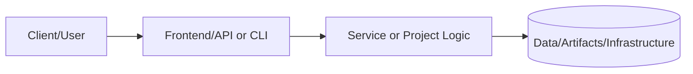
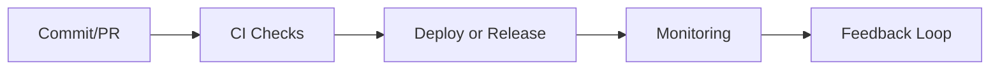

# Enterprise Engineer's Handbook

**Status:** 🟢 Active | **Version:** 1.0.0 | **Last Updated:** November 2025

## Overview

This handbook defines the engineering standards, quality gates, and best practices used across all projects in this portfolio. It serves as the authoritative reference for code quality, security, testing, documentation, and deployment standards.

---

## Table of Contents

1. [Code Quality Standards](#code-quality-standards)
2. [Security Requirements](#security-requirements)
3. [Testing Standards](#testing-standards)
4. [Documentation Requirements](#documentation-requirements)
5. [Infrastructure as Code Standards](#infrastructure-as-code-standards)
6. [CI/CD Quality Gates](#cicd-quality-gates)
7. [Monitoring and Observability](#monitoring-and-observability)
8. [Incident Response](#incident-response)
9. [Change Management](#change-management)
10. [Compliance and Audit](#compliance-and-audit)

---

## Code Quality Standards

### General Principles

- **DRY (Don't Repeat Yourself)**: Eliminate code duplication through functions, modules, and abstractions
- **SOLID Principles**: Follow object-oriented design principles for maintainability
- **Clean Code**: Self-documenting code with meaningful names and clear logic
- **Code Reviews**: All changes require peer review before merge

### Language-Specific Standards

#### Python
- **Style Guide**: PEP 8 compliance
- **Type Hints**: Required for all function signatures in production code
- **Linting**: `flake8` with max line length 100, `pylint` score ≥ 8.0
- **Formatting**: `black` auto-formatter
- **Imports**: Organized with `isort`

**Example**:
```python
def calculate_cost(
    usage_hours: int,
    rate_per_hour: float,
    discount: float = 0.0
) -> float:
    """
    Calculate total cost with optional discount.

    Args:
        usage_hours: Number of hours of resource usage
        rate_per_hour: Cost per hour in USD
        discount: Discount percentage (0.0 to 1.0)

    Returns:
        Total cost after discount
    """
    base_cost = usage_hours * rate_per_hour
    return base_cost * (1 - discount)
```

#### JavaScript/TypeScript
- **Style Guide**: Airbnb JavaScript Style Guide
- **Linting**: ESLint with recommended rules
- **Formatting**: Prettier with single quotes, 2-space indent
- **Type Safety**: TypeScript strict mode for all production code

#### Bash
- **ShellCheck**: All scripts must pass `shellcheck` with no warnings
- **Error Handling**: Use `set -euo pipefail` at script start
- **Documentation**: Header comments explaining purpose, usage, and variables

### Code Review Checklist

Before approving any PR, verify:

- [ ] Code follows language-specific style guide
- [ ] All functions have docstrings/comments
- [ ] No hardcoded credentials or secrets
- [ ] Error handling implemented for failure cases
- [ ] Logging added for debugging and audit
- [ ] Unit tests cover new functionality (≥80% coverage)
- [ ] No console.log/print statements in production code
- [ ] Variable names are descriptive and clear
- [ ] Complex logic has explanatory comments
- [ ] No TODO/FIXME comments without associated issue tickets

---

## Security Requirements

### Authentication & Authorization

- **Principle of Least Privilege**: Grant minimum permissions required
- **IAM Policies**: Use managed policies and policy conditions
- **MFA**: Required for all production access
- **Secrets Management**: Use AWS Secrets Manager, HashiCorp Vault, or similar

### Secure Coding

- **Input Validation**: Validate and sanitize all user inputs
- **SQL Injection**: Use parameterized queries, never string concatenation
- **XSS Prevention**: Escape output, use Content Security Policy headers
- **CSRF Protection**: Implement CSRF tokens for state-changing operations
- **Dependency Scanning**: Automated scanning with Snyk, Dependabot, or similar

### OWASP Top 10 Compliance

All web applications must address:
1. Broken Access Control
2. Cryptographic Failures
3. Injection
4. Insecure Design
5. Security Misconfiguration
6. Vulnerable and Outdated Components
7. Identification and Authentication Failures
8. Software and Data Integrity Failures
9. Security Logging and Monitoring Failures
10. Server-Side Request Forgery (SSRF)

### Encryption Standards

- **In Transit**: TLS 1.2 or higher for all network communication
- **At Rest**: AES-256 encryption for databases, S3 buckets, EBS volumes
- **Key Management**: Use AWS KMS or equivalent with automatic key rotation

### Security Scanning

- **SAST (Static)**: Run on every commit (e.g., Bandit for Python, ESLint security plugin)
- **DAST (Dynamic)**: Weekly scans of deployed applications (e.g., OWASP ZAP)
- **Container Scanning**: Scan Docker images with Trivy or Clair
- **IaC Scanning**: Scan Terraform with Checkov, tfsec, or Terrascan

---

## Testing Standards

### Test Coverage Requirements

- **Unit Tests**: ≥80% code coverage for business logic
- **Integration Tests**: Critical paths and API endpoints
- **End-to-End Tests**: Key user flows for web applications
- **Performance Tests**: Load testing for services expecting >100 req/sec

### Testing Pyramid

```
         /\
        /E2E\        10%  - End-to-End UI/API tests
       /------\
      /Integr.\     30%  - Integration tests
     /----------\
    /  Unit Tests\ 60%  - Unit tests
   /--------------\
```

### Test Organization

```
tests/
├── unit/               # Fast, isolated tests
│   ├── test_services.py
│   └── test_utils.py
├── integration/        # Tests with database/external services
│   ├── test_api.py
│   └── test_database.py
├── e2e/               # Full user flow tests
│   └── test_checkout_flow.py
└── performance/       # Load and stress tests
    └── load_test.js
```

### Test Quality Standards

- **Fast Execution**: Unit tests <5s total, integration tests <30s
- **Deterministic**: No flaky tests; same result every run
- **Isolated**: Tests don't depend on each other or execution order
- **Descriptive Names**: `test_should_return_error_when_user_not_found()`
- **Arrange-Act-Assert**: Clear test structure

**Example**:
```python
def test_should_calculate_discount_correctly():
    # Arrange
    usage_hours = 100
    rate = 10.0
    discount = 0.2

    # Act
    result = calculate_cost(usage_hours, rate, discount)

    # Assert
    assert result == 800.0  # 100 * 10 * 0.8
```

---

## Documentation Requirements

### Project Documentation

Every project must include:

1. **README.md**
   - Project overview and purpose
   - Architecture diagram (Mermaid or image)
   - Setup instructions
   - Usage examples
   - Troubleshooting guide
   - Contributing guidelines

2. **ARCHITECTURE.md**
   - System design and components
   - Data flow diagrams
   - Technology stack rationale
   - Scalability considerations
   - Security architecture

3. **RUNBOOK.md**
   - Operational procedures
   - Deployment steps
   - Monitoring dashboards
   - Common issues and solutions
   - Escalation procedures

4. **ADR (Architecture Decision Records)**
   - Located in `docs/ADR/`
   - Format: `NNNN-title.md`
   - Captures "why" behind technical decisions

### Code Documentation

- **Functions**: Docstrings with Args, Returns, Raises sections
- **Classes**: Class-level docstring explaining purpose
- **Modules**: File-level docstring summarizing contents
- **Complex Logic**: Inline comments explaining non-obvious code

### API Documentation

- **OpenAPI/Swagger**: For REST APIs
- **GraphQL Schema**: With descriptions on all types and fields
- **Examples**: Request/response samples for all endpoints
- **Error Codes**: Documented error responses with troubleshooting

---

## Infrastructure as Code Standards

### Terraform Standards

- **State Management**: Remote state in S3 with DynamoDB locking
- **Module Structure**: Reusable modules in `/infrastructure/terraform/modules/`
- **Naming Convention**: `<env>-<service>-<resource>` (e.g., `prod-api-alb`)
- **Tagging**: Mandatory tags: `Environment`, `Project`, `Owner`, `CostCenter`
- **Variable Validation**: Input validation rules on all variables
- **Outputs**: Export all resource IDs/ARNs for cross-stack reference

**Example Module**:
```hcl
module "vpc" {
  source = "../../modules/vpc"

  environment    = "production"
  vpc_cidr       = "10.0.0.0/16"
  azs            = ["us-east-1a", "us-east-1b", "us-east-1c"]
  private_subnets = ["10.0.1.0/24", "10.0.2.0/24", "10.0.3.0/24"]
  public_subnets  = ["10.0.101.0/24", "10.0.102.0/24", "10.0.103.0/24"]

  tags = local.common_tags
}
```

### Security for IaC

- **No Hardcoded Secrets**: Use AWS Secrets Manager or Parameter Store
- **Encryption**: Enable encryption for all data stores
- **Network Segmentation**: Public/private subnet isolation
- **Security Groups**: Principle of least privilege for ingress/egress
- **Compliance**: Pass `tfsec` and `checkov` scans with no critical issues

---

## CI/CD Quality Gates

### Pre-Merge Gates

All PRs must pass:

1. **Linting**: Code style compliance
2. **Unit Tests**: ≥80% coverage, all tests passing
3. **Security Scan**: No critical or high vulnerabilities
4. **Code Review**: Approved by ≥1 team member
5. **Integration Tests**: All passing (if applicable)

### Deployment Gates

#### Non-Production (Dev/Staging)
- Automated deployment on merge to `develop` branch
- Smoke tests after deployment
- Rollback on failure

#### Production
- **Manual Approval**: Required for production deployment
- **Change Ticket**: Associated with deployment
- **Deployment Window**: During approved maintenance window
- **Rollback Plan**: Documented and tested
- **Health Checks**: Automated post-deployment validation

### Pipeline Example

```yaml
stages:
  - lint
  - test
  - security-scan
  - build
  - deploy-dev
  - deploy-staging
  - [manual-gate]
  - deploy-prod
  - smoke-test
```

---

## Monitoring and Observability

### Three Pillars

1. **Metrics**: Quantitative measurements (Prometheus/CloudWatch)
2. **Logs**: Event records (Loki/CloudWatch Logs/ELK)
3. **Traces**: Request flow tracking (Jaeger/X-Ray)

### Required Metrics

All services must expose:

- **Availability**: Uptime percentage (target: 99.9%)
- **Latency**: P50, P95, P99 response times
- **Error Rate**: 5xx errors per minute
- **Throughput**: Requests per second
- **Saturation**: CPU, memory, disk, network usage

### Logging Standards

- **Structured Logging**: JSON format with standard fields
- **Log Levels**: DEBUG, INFO, WARNING, ERROR, CRITICAL
- **Correlation IDs**: Trace requests across services
- **Retention**: 30 days hot, 90 days warm, 1 year cold storage

**Example**:
```python
import logging
import json

logger = logging.getLogger(__name__)

logger.info(json.dumps({
    "timestamp": "2025-11-10T12:00:00Z",
    "level": "INFO",
    "service": "user-api",
    "correlation_id": "abc-123",
    "message": "User login successful",
    "user_id": "user-456",
    "duration_ms": 45
}))
```

### Alerting Standards

- **Alert on SLOs**: Define SLIs (Service Level Indicators) and alert on SLO breaches
- **Actionable**: Every alert must have a runbook link
- **No Alert Fatigue**: Average <5 alerts per day; tune thresholds
- **Escalation**: PagerDuty/OpsGenie integration for critical alerts

---

## Incident Response

### Severity Levels

| Severity | Description | Response Time | Example |
|----------|-------------|---------------|---------|
| SEV1 | Critical outage | 15 minutes | Production down |
| SEV2 | Major degradation | 1 hour | Elevated error rate |
| SEV3 | Minor issue | 4 hours | Non-critical feature broken |
| SEV4 | Cosmetic | Next business day | UI alignment issue |

### Incident Lifecycle

1. **Detection**: Automated alerts or user report
2. **Triage**: Assess severity, assign responder
3. **Investigation**: Gather logs, metrics, traces
4. **Mitigation**: Apply fix or rollback
5. **Resolution**: Verify issue resolved
6. **Post-Mortem**: Blameless review within 48 hours

### Post-Mortem Template

- **Incident Summary**: What happened?
- **Timeline**: Chronological event log
- **Root Cause**: Why did it happen?
- **Impact**: Users affected, downtime duration
- **Resolution**: How was it fixed?
- **Action Items**: Preventative measures (with owners and due dates)

---

## Change Management

### Change Types

1. **Standard**: Pre-approved, low-risk (e.g., security patches)
2. **Normal**: Requires CAB approval (e.g., feature deployment)
3. **Emergency**: Urgent fix for critical issue (post-incident approval)

### Change Request Template

- **Description**: What is changing?
- **Justification**: Why is this change needed?
- **Impact Assessment**: What could go wrong?
- **Rollback Plan**: How to undo the change?
- **Testing**: How was this validated?
- **Schedule**: When will this be deployed?

### Deployment Best Practices

- **Blue/Green Deployments**: Zero-downtime deployments
- **Canary Releases**: Gradual rollout (5% → 25% → 100%)
- **Feature Flags**: Decouple deployment from release
- **Database Migrations**: Backward-compatible, runnable multiple times

---

## Compliance and Audit

### Required Evidence

All projects must maintain:

- **Change Log**: Git commit history with meaningful messages
- **Access Logs**: CloudTrail for AWS actions
- **Security Scans**: Weekly vulnerability reports
- **Backup Verification**: Monthly DR drill results
- **Code Reviews**: GitHub PR approval records

### Audit Trails

- **Who**: User/service that performed action
- **What**: Action performed (create, read, update, delete)
- **When**: Timestamp (UTC)
- **Where**: IP address or service endpoint
- **Why**: Associated ticket or justification

### Compliance Frameworks

Projects align with:

- **CIS AWS Foundations Benchmark**: Automated compliance checks
- **OWASP ASVS**: Application Security Verification Standard
- **NIST Cybersecurity Framework**: Identify, Protect, Detect, Respond, Recover

---

## Quality Metrics Dashboard

Track portfolio-wide metrics:

- **Code Coverage**: Average across all projects (target: ≥80%)
- **Security Vulnerabilities**: By severity (target: 0 critical)
- **Deployment Frequency**: Releases per week
- **Mean Time to Recovery (MTTR)**: Average incident resolution time
- **Change Failure Rate**: % of deployments causing incidents (target: <15%)
- **Test Pass Rate**: % of builds with all tests passing (target: ≥95%)

---

## References and Training

### Internal Resources

- [Configuration Guide](../../CONFIGURATION_GUIDE.md)
- [IT Playbook (Lifecycle)](../PRJ-MASTER-PLAYBOOK/README.md)
- [Comprehensive Implementation Guide](../COMPREHENSIVE_PORTFOLIO_IMPLEMENTATION_GUIDE.md)

### External References

- [AWS Well-Architected Framework](https://aws.amazon.com/architecture/well-architected/)
- [Google SRE Book](https://sre.google/books/)
- [The Phoenix Project](https://www.amazon.com/Phoenix-Project-DevOps-Helping-Business/dp/0988262592)
- [OWASP Top 10](https://owasp.org/www-project-top-ten/)

---

## Handbook Maintenance

- **Owner**: Platform Engineering Team
- **Review Cycle**: Quarterly
- **Update Process**: Submit PR with changes, require 2 approvals
- **Version History**: See Git commit log

**Last Updated**: 2025-11-10
**Version**: 1.0.0
**Contributors**: Portfolio Engineering Team

---

For questions or suggestions, please open an issue or contact the Platform Engineering team.

---

# 📘 Project README Template (Portfolio Standard)

> **Status key:** 🟢 Done · 🟠 In Progress · 🔵 Planned · 🔄 Recovery/Rebuild · 📝 Documentation Pending

## 🎯 Overview
This README has been expanded to align with the portfolio documentation standard for **PRJ MASTER HANDBOOK**. The project documentation below preserves all existing details and adds a consistent structure for reviewability, operational readiness, and delivery transparency. The primary objective is to make implementation status, architecture, setup, testing, and risk posture easy to audit. Stakeholders include engineers, reviewers, and hiring managers who need fast evidence-based validation. Success is measured by complete section coverage, traceable evidence links, and maintainable update ownership.

### Outcomes
- Consistent documentation quality across the portfolio.
- Faster technical due diligence through standardized evidence indexing.
- Clear status tracking with explicit in-scope and deferred work.

## 📌 Scope & Status

| Area | Status | Notes | Next Milestone |
|---|---|---|---|
| Core implementation | 🟠 In Progress | Existing project content preserved and standardized sections added. | Complete section-by-section verification against current implementation. |
| Ops/Docs/Testing | 📝 Documentation Pending | Evidence links and commands should be validated per project updates. | Refresh command outputs and evidence after next major change. |

> **Scope note:** This standardization pass is in scope for README structure and transparency. Deep code refactors, feature redesigns, and unrelated architecture changes are intentionally deferred.

## 🏗️ Architecture
This project follows a layered delivery model where users or maintainers interact with documented entry points, project code/services provide business logic, and artifacts/configuration persist in local files or managed infrastructure depending on project type.



| Component | Responsibility | Key Interfaces |
|---|---|---|
| Documentation (`README.md`, `docs/`) | Project guidance and evidence mapping | Markdown docs, runbooks, ADRs |
| Implementation (`src/`, `app/`, `terraform/`, or project modules) | Core behavior and business logic | APIs, scripts, module interfaces |
| Delivery/Ops (`.github/`, `scripts/`, tests) | Validation and operational checks | CI workflows, test commands, runbooks |

## 🚀 Setup & Runbook

### Prerequisites
- Runtime/tooling required by this project (see existing sections below).
- Access to environment variables/secrets used by this project.
- Local dependencies (CLI tools, package managers, or cloud credentials).

### Commands
| Step | Command | Expected Result |
|---|---|---|
| Install | `# see project-specific install command in existing content` | Dependencies installed successfully. |
| Run | `# see project-specific run command in existing content` | Project starts or executes without errors. |
| Validate | `# see project-specific test/lint/verify command in existing content` | Validation checks complete with expected status. |

### Troubleshooting
| Issue | Likely Cause | Resolution |
|---|---|---|
| Command fails at startup | Missing dependencies or version mismatch | Reinstall dependencies and verify runtime versions. |
| Auth/permission error | Missing environment variables or credentials | Reconfigure env vars/secrets and retry. |
| Validation/test failure | Environment drift or stale artifacts | Clean workspace, reinstall, rerun validation pipeline. |

## ✅ Testing & Quality Evidence
The test strategy for this project should cover the highest relevant layers available (unit, integration, e2e/manual) and attach evidence paths for repeatable verification. Existing test notes and artifacts remain preserved below.

| Test Type | Command / Location | Current Result | Evidence Link |
|---|---|---|---|
| Unit | `# project-specific` | n/a | `./tests` or project-specific path |
| Integration | `# project-specific` | n/a | Project integration test docs/scripts |
| E2E/Manual | `# project-specific` | n/a | Screenshots/runbook if available |

### Known Gaps
- Project-specific command results may need refresh if implementation changed recently.
- Some evidence links may remain planned until next verification cycle.

## 🔐 Security, Risk & Reliability

| Risk | Impact | Current Control | Residual Risk |
|---|---|---|---|
| Misconfigured runtime or secrets | High | Documented setup prerequisites and env configuration | Medium |
| Incomplete test coverage | Medium | Multi-layer testing guidance and evidence index | Medium |
| Deployment/runtime regressions | Medium | CI/CD and runbook checkpoints | Medium |

### Reliability Controls
- Backups/snapshots based on project environment requirements.
- Monitoring and alerting where supported by project stack.
- Rollback path documented in project runbooks or deployment docs.
- Runbook ownership maintained via documentation freshness policy.

## 🔄 Delivery & Observability



| Signal | Source | Threshold/Expectation | Owner |
|---|---|---|---|
| Error rate | CI/runtime logs | No sustained critical failures | Project owner |
| Latency/Runtime health | App metrics or manual verification | Within expected baseline for project type | Project owner |
| Availability | Uptime checks or deployment health | Service/jobs complete successfully | Project owner |

## 🗺️ Roadmap

| Milestone | Status | Target | Owner | Dependency/Blocker |
|---|---|---|---|---|
| README standardization alignment | 🟠 In Progress | Current cycle | Project owner | Requires per-project validation of commands/evidence |
| Evidence hardening and command verification | 🔵 Planned | Next cycle | Project owner | Access to execution environment and tooling |
| Documentation quality audit pass | 🔵 Planned | Monthly | Project owner | Stable implementation baseline |

## 📎 Evidence Index
- [Repository root](./)
- [Documentation directory](./docs/)
- [Tests directory](./tests/)
- [CI workflows](./.github/workflows/)
- [Project implementation files](./)

## 🧾 Documentation Freshness

| Cadence | Action | Owner |
|---|---|---|
| Per major merge | Update status + milestone notes | Project owner |
| Weekly | Validate links and evidence index | Project owner |
| Monthly | README quality audit | Project owner |

## 11) Final Quality Checklist (Before Merge)

- [ ] Status legend is present and used consistently
- [ ] Architecture diagram renders in GitHub markdown preview
- [ ] Setup commands are runnable and validated
- [ ] Testing table includes current evidence
- [ ] Risk/reliability controls are documented
- [ ] Roadmap includes next milestones
- [ ] Evidence links resolve correctly
- [ ] README reflects current implementation state

## 📚 Expanded Onboarding Guide (Additive Improvement)

This section intentionally expands guidance for new contributors and operators without removing any existing project content.

### Getting Started Tips
- Start by reading this README top-to-bottom once before executing commands.
- Validate runtime versions early to avoid non-obvious install failures.
- Prefer reproducible commands and copy exact examples where possible.
- Keep local notes for environment-specific deviations.
- Re-run validation commands after each meaningful change.

### Review & Contribution Tips
- Keep pull requests focused and incremental.
- Attach evidence (logs, screenshots, test output) for non-trivial changes.
- Update runbooks and README sections in the same PR as code changes.
- Document assumptions explicitly, especially around infrastructure dependencies.
- Prefer explicit rollback notes over implicit recovery expectations.

### Operational Tips
- Verify credentials and environment variables before deployment steps.
- Track baseline behavior before introducing optimizations.
- Capture incident learnings and feed them into runbooks.
- Keep dependency upgrades isolated and validated with tests.
- Reconfirm monitoring/alert routing after any integration changes.

### Documentation Quality Tips
- Ensure links are relative when possible for portability.
- Keep command examples executable and current.
- Mark planned items clearly instead of omitting sections.
- Add troubleshooting entries whenever a recurring issue appears.
- Refresh roadmap and status tables at consistent intervals.

