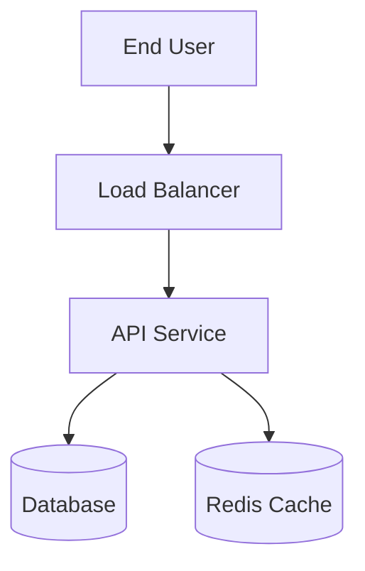
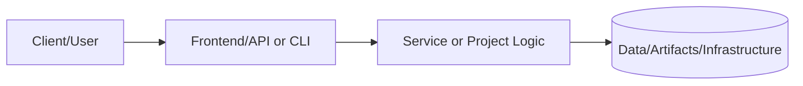
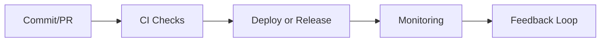

# Enterprise IT Playbook: End-to-End Lifecycle

**Status:** 🟢 Active | **Version:** 1.0.0 | **Last Updated:** November 2025

## Overview

This playbook provides a unified, end-to-end guide for managing the complete lifecycle of IT projects and services—from initial request intake through ongoing operations, maintenance, and eventual retirement. It integrates with the [Engineer's Handbook](../PRJ-MASTER-HANDBOOK/README.md) for technical standards.

---

## Table of Contents

1. [Project Intake & Planning](#1-project-intake--planning)
2. [Design & Architecture](#2-design--architecture)
3. [Development & Implementation](#3-development--implementation)
4. [Testing & Quality Assurance](#4-testing--quality-assurance)
5. [Deployment & Release](#5-deployment--release)
6. [Operations & Monitoring](#6-operations--monitoring)
7. [Maintenance & Support](#7-maintenance--support)
8. [Decommissioning](#8-decommissioning)

---

## 1. Project Intake & Planning

### Objective
Capture, evaluate, and prioritize new project requests.

### Process

#### 1.1 Request Submission
**Stakeholder** submits request via:
- GitHub Issue (tag: `request/new-project`)
- Project intake form
- Email to IT leadership

**Required Information**:
- Business justification and expected ROI
- Success criteria and KPIs
- Timeline requirements
- Budget estimate
- Stakeholder contacts

#### 1.2 Initial Assessment
**IT Leadership** evaluates:
- Alignment with business goals
- Technical feasibility
- Resource availability
- Risk assessment
- Priority level (P0-Critical, P1-High, P2-Medium, P3-Low)

**Outcome**: Approve, Defer, or Reject

#### 1.3 Project Charter
For approved projects, create charter including:
- **Executive Summary**: Problem statement and solution overview
- **Scope**: In-scope and out-of-scope items
- **Objectives**: SMART goals (Specific, Measurable, Achievable, Relevant, Time-bound)
- **Stakeholders**: RACI matrix (Responsible, Accountable, Consulted, Informed)
- **Timeline**: High-level milestones
- **Budget**: Estimated costs (development, infrastructure, operations)
- **Risks**: Identified risks and mitigation strategies

**Template**: [Project Charter Template](./templates/project-charter.md)

#### 1.4 Resource Planning
- Assign project manager/tech lead
- Allocate engineering resources
- Reserve infrastructure capacity
- Schedule kickoff meeting

**Deliverables**:
- ✅ Approved project charter
- ✅ Project team assigned
- ✅ Initial timeline and milestones
- ✅ Kickoff meeting scheduled

---

## 2. Design & Architecture

### Objective
Create comprehensive design documentation before implementation begins.

### Process

#### 2.1 Requirements Gathering
**Conduct stakeholder interviews** to capture:
- Functional requirements (what the system should do)
- Non-functional requirements (performance, security, scalability)
- User stories and use cases
- Data requirements
- Integration points

**Tools**: User story mapping, requirements workshops

#### 2.2 Architecture Design
**Create architecture artifacts**:

1. **System Context Diagram** (C4 Level 1)
   - System boundaries
   - External dependencies
   - User types

2. **Container Diagram** (C4 Level 2)
   - High-level technology choices
   - Services and components
   - Data stores

3. **Component Diagram** (C4 Level 3)
   - Internal structure of containers
   - Key abstractions
   - Interactions

4. **Deployment Diagram**
   - Infrastructure topology
   - Network architecture
   - Security zones

**Use Mermaid diagrams** in markdown for version control:



#### 2.3 Architecture Decision Records (ADRs)
Document all significant decisions in `/docs/ADR/`:

**Format** (`NNNN-title.md`):
```markdown
# ADR-0001: Use PostgreSQL for Primary Database

**Status**: Accepted
**Date**: 2025-11-10
**Deciders**: Tech Lead, DBA, Security Team

## Context
Need to select a database for user data storage with ACID guarantees.

## Decision
We will use PostgreSQL 15 with RDS managed service.

## Consequences
**Positive**:
- ACID compliance
- Rich feature set (JSON, full-text search)
- AWS RDS handles backups and patching

**Negative**:
- Higher cost than DynamoDB for certain workloads
- Requires vertical scaling for high throughput

## Alternatives Considered
- DynamoDB: Rejected due to complex query requirements
- MySQL: Rejected due to team expertise in PostgreSQL
```

#### 2.4 Security Design Review
**Security team reviews**:
- Authentication and authorization approach
- Data encryption (at rest and in transit)
- Network security (VPC, security groups, NACLs)
- Secrets management
- Compliance requirements (SOC2, GDPR, HIPAA)

**Deliverables**:
- ✅ System architecture diagrams
- ✅ ADRs for key decisions
- ✅ Security design approval
- ✅ Data flow diagrams
- ✅ API specifications (OpenAPI/GraphQL schema)

---

## 3. Development & Implementation

### Objective
Build the system according to design specifications.

### Process

#### 3.1 Development Environment Setup
**Developer checklist**:
- [ ] Clone repository
- [ ] Install dependencies (`npm install`, `pip install -r requirements.txt`)
- [ ] Copy `.env.example` to `.env` and configure
- [ ] Run database migrations
- [ ] Verify tests pass (`pytest`, `npm test`)
- [ ] Start local development server

**Reference**: [Configuration Guide](../../CONFIGURATION_GUIDE.md)

#### 3.2 Branching Strategy
Follow **GitFlow**:
- `main`: Production-ready code
- `develop`: Integration branch for features
- `feature/*`: New features
- `bugfix/*`: Bug fixes
- `hotfix/*`: Emergency production fixes

**Branch naming**: `feature/PRJ-123-user-authentication`

#### 3.3 Development Workflow

**For each feature**:
1. **Create branch** from `develop`
2. **Implement** following [Engineer's Handbook](../PRJ-MASTER-HANDBOOK/README.md) standards
3. **Write tests** (TDD preferred)
4. **Run linters** and formatters
5. **Commit** with meaningful messages (Conventional Commits)
6. **Push** and create Pull Request

**Commit Message Format**:
```
feat(auth): add OAuth2 login flow

- Implement Google OAuth2 integration
- Add user session management
- Update login UI component

Closes #123
```

#### 3.4 Code Review Process
**Reviewers verify**:
- Code quality (follows style guide)
- Test coverage (≥80%)
- Security (no vulnerabilities)
- Documentation (docstrings, README updates)
- Performance (no N+1 queries, efficient algorithms)

**Timeline**: Reviews completed within 1 business day

#### 3.5 Continuous Integration
**Automated checks on every PR**:
```yaml
jobs:
  lint:
    - Runs: flake8, eslint, shellcheck
  test:
    - Runs: pytest, jest
    - Uploads: coverage report
  security:
    - Runs: bandit, npm audit
  build:
    - Builds: Docker image
    - Pushes: to ECR (if branch is develop/main)
```

**Deliverables**:
- ✅ Feature implementation complete
- ✅ All tests passing
- ✅ Code review approved
- ✅ Documentation updated
- ✅ Merged to `develop` branch

---

## 4. Testing & Quality Assurance

### Objective
Validate that the system meets requirements and quality standards.

### Process

#### 4.1 Test Levels

| Test Level | Scope | When | Owner |
|------------|-------|------|-------|
| Unit | Individual functions/classes | During development | Developer |
| Integration | Service-to-service interactions | After feature merge | Developer |
| System | End-to-end user flows | Before staging deploy | QA Team |
| UAT | Business acceptance criteria | Staging environment | Product Owner |
| Performance | Load, stress, endurance testing | Before production | DevOps |
| Security | Penetration testing, vulnerability scan | Before production | Security Team |

#### 4.2 Test Execution

**Automated Tests**:
- Run on every commit (unit, integration)
- Run nightly (E2E, smoke tests)
- Run weekly (full regression suite)

**Manual Tests**:
- Exploratory testing for new features
- Usability testing with sample users
- Cross-browser/cross-device testing

#### 4.3 Defect Management

**Bug Report Template**:
```
**Title**: [Component] Brief description

**Environment**: Production / Staging / Dev
**Severity**: Critical / High / Medium / Low
**Steps to Reproduce**:
1. Login as admin
2. Navigate to /users
3. Click "Export"

**Expected**: CSV file downloads
**Actual**: 500 error in browser console

**Logs**: [Paste relevant logs]
**Screenshots**: [Attach if applicable]
```

**Severity Definitions**:
- **Critical**: System unusable, data loss, security breach
- **High**: Major feature broken, workaround exists
- **Medium**: Minor feature broken, cosmetic issue with impact
- **Low**: Cosmetic issue, no functional impact

**Bug Workflow**: Open → Assigned → In Progress → Code Review → Testing → Closed

#### 4.4 Acceptance Criteria
**For UAT sign-off, verify**:
- [ ] All acceptance criteria met (from user stories)
- [ ] No critical or high-severity bugs
- [ ] Performance benchmarks achieved
- [ ] Security scan shows no vulnerabilities
- [ ] Documentation complete (user guides, runbooks)

**Deliverables**:
- ✅ Test execution report
- ✅ Defect tracking log
- ✅ UAT sign-off from product owner
- ✅ Performance test results
- ✅ Security scan report

---

## 5. Deployment & Release

### Objective
Deploy the system to production safely and with minimal risk.

### Process

#### 5.1 Pre-Deployment Checklist

**Infrastructure**:
- [ ] Terraform plan reviewed and approved
- [ ] Database migrations tested
- [ ] Secrets configured in AWS Secrets Manager
- [ ] Monitoring alerts configured
- [ ] Runbook updated with new procedures

**Application**:
- [ ] All tests passing in staging
- [ ] Performance benchmarks met
- [ ] Feature flags configured (if using)
- [ ] Rollback plan documented
- [ ] Stakeholders notified of deployment

#### 5.2 Deployment Strategy

**Choose based on risk tolerance**:

| Strategy | Risk | Downtime | Rollback Time |
|----------|------|----------|---------------|
| **Blue/Green** | Low | None | < 5 min |
| **Canary** | Medium | None | 5-15 min |
| **Rolling** | Medium | None | 15-30 min |
| **Recreate** | High | Yes (5-10 min) | 10-30 min |

**Preferred**: Blue/Green for production

**Blue/Green Process**:
1. Deploy new version to "green" environment
2. Run smoke tests on green
3. Route 10% of traffic to green (canary)
4. Monitor error rates and latency for 30 minutes
5. If healthy, route 100% traffic to green
6. Keep blue environment for 24 hours as rollback option
7. Decommission blue environment

#### 5.3 Deployment Execution

**Automated via CI/CD**:
```yaml
deploy-production:
  needs: [test, security-scan]
  when: manual  # Requires approval
  steps:
    - name: Deploy to Production
      run: |
        terraform apply -auto-approve
        docker push $IMAGE:$TAG
        kubectl set image deployment/app app=$IMAGE:$TAG
        kubectl rollout status deployment/app
    - name: Smoke Tests
      run: ./scripts/smoke-tests.sh
    - name: Notify Slack
      run: |
        curl -X POST $SLACK_WEBHOOK \
          -d "Deployed version $TAG to production"
```

**Manual Steps** (if any):
- Document in deployment runbook
- Assign to specific team member
- Verify completion before proceeding

#### 5.4 Post-Deployment Validation

**Immediately after deployment**:
- [ ] Health checks passing (all services responding)
- [ ] Error rate within baseline (< 1%)
- [ ] Latency within SLA (P95 < 500ms)
- [ ] Database connections stable
- [ ] No critical alerts firing

**Monitor for 24 hours**:
- Track key metrics in Grafana dashboard
- On-call engineer available for issues
- Daily sync to review metrics

#### 5.5 Rollback Procedure

**If deployment fails**:
1. **Decision**: Tech lead decides to rollback within 15 minutes
2. **Execute**: Run rollback automation
   ```bash
   ./scripts/rollback.sh $PREVIOUS_VERSION
   ```
3. **Verify**: Confirm rollback successful (health checks passing)
4. **Communicate**: Notify stakeholders via Slack/email
5. **Post-Mortem**: Schedule blameless review within 48 hours

**Deliverables**:
- ✅ Deployment completed successfully
- ✅ Smoke tests passing
- ✅ Monitoring confirms system health
- ✅ Stakeholders notified
- ✅ Release notes published

---

## 6. Operations & Monitoring

### Objective
Ensure system reliability, performance, and availability in production.

### Process

#### 6.1 Monitoring Setup

**Three Pillars** (Metrics, Logs, Traces):

**Metrics** (Prometheus + Grafana):
- **Golden Signals**: Latency, Traffic, Errors, Saturation
- **Business Metrics**: User registrations, transactions, revenue
- **Infrastructure**: CPU, memory, disk, network

**Dashboards**:
- `/grafana/api-overview`: API request rates, error rates, latency
- `/grafana/infrastructure`: EC2, RDS, S3 metrics
- `/grafana/business`: KPIs and user activity

**Logs** (Loki or CloudWatch):
- Centralized log aggregation
- Structured logging (JSON format)
- Retention: 30 days hot, 90 days archive

**Traces** (Jaeger or X-Ray):
- Distributed tracing for microservices
- Request correlation across services
- Performance bottleneck identification

#### 6.2 Alerting

**Alert Configuration**:
```yaml
groups:
  - name: api_alerts
    rules:
      - alert: HighErrorRate
        expr: rate(http_requests_total{status=~"5.."}[5m]) > 0.05
        for: 5m
        labels:
          severity: critical
        annotations:
          summary: "High error rate detected"
          description: "Error rate is {{ $value }}% (threshold: 5%)"
          runbook_url: "https://wiki/runbooks/high-error-rate"
```

**On-Call Rotation**:
- Primary and secondary on-call engineers
- Managed in PagerDuty
- Escalation policy: Page primary → Wait 15 min → Page secondary → Wait 15 min → Page manager

#### 6.3 Runbooks

**Create runbooks for**:
- Common failure scenarios
- Deployment procedures
- Disaster recovery
- Scaling operations

**Runbook Template**:
```markdown
# Runbook: High API Error Rate

## Symptoms
- Error rate alert firing in PagerDuty
- Users reporting 500 errors
- Error rate > 5% for 5 minutes

## Impact
- Users cannot complete transactions
- Revenue loss: ~$X per minute

## Investigation
1. Check Grafana dashboard: /grafana/api-overview
2. Review recent deployments: `kubectl rollout history`
3. Check application logs: `kubectl logs -l app=api --tail=100`
4. Verify database health: `aws rds describe-db-instances`

## Resolution
**If recent deployment**:
- Rollback: `./scripts/rollback.sh`

**If database connection issues**:
- Verify connection pool: `psql -c "SELECT count(*) FROM pg_stat_activity"`
- Increase pool size if needed

**If external API failure**:
- Enable circuit breaker
- Serve cached responses

## Escalation
If unresolved after 30 minutes:
- Page database team
- Notify product manager
- Post in #incident-response Slack channel
```

#### 6.4 Capacity Planning

**Monthly review**:
- Resource utilization trends
- Traffic growth projections
- Database size growth
- Cost optimization opportunities

**Scaling Strategy**:
- **Horizontal**: Add more EC2 instances (auto-scaling group)
- **Vertical**: Increase instance size (requires downtime)
- **Database**: Read replicas, connection pooling, caching

**Deliverables**:
- ✅ Monitoring dashboards configured
- ✅ Alerts defined and tested
- ✅ Runbooks created
- ✅ On-call rotation established
- ✅ Capacity plan documented

---

## 7. Maintenance & Support

### Objective
Keep the system secure, up-to-date, and responsive to user needs.

### Process

#### 7.1 Patch Management

**OS & Runtime Patches**:
- **Frequency**: Monthly (second Tuesday of month)
- **Testing**: Apply to dev → staging → production
- **Rollback**: Snapshot instances before patching

**Dependency Updates**:
- **Security patches**: Apply within 7 days of release
- **Minor versions**: Monthly update cycle
- **Major versions**: Quarterly evaluation, upgrade planning

**Tools**: Dependabot, Renovate Bot

#### 7.2 Backup & Recovery

**Backup Strategy**:
- **Databases**: Daily automated snapshots (RDS)
- **Configuration**: Version controlled in Git
- **Logs**: Archived to S3 Glacier

**Retention Policy**:
- Daily backups: 7 days
- Weekly backups: 4 weeks
- Monthly backups: 12 months
- Yearly backups: 7 years (compliance)

**DR Drills**:
- **Frequency**: Monthly automated drill
- **Scope**: Restore from backup to test environment
- **Metrics**: RTO (Recovery Time Objective), RPO (Recovery Point Objective)

**Reference**: [DR Drill Script](../../projects/p14-disaster-recovery/scripts/dr_drill.py)

#### 7.3 Support Tiers

| Tier | SLA | Scope |
|------|-----|-------|
| **P1-Critical** | 1 hour response | Production down, data loss |
| **P2-High** | 4 hours response | Major feature broken |
| **P3-Medium** | 1 business day | Minor issue, workaround exists |
| **P4-Low** | Best effort | Feature request, cosmetic issue |

**Support Channels**:
- **P1/P2**: PagerDuty alert → On-call engineer
- **P3/P4**: GitHub Issues, email to support@

#### 7.4 Knowledge Management

**Documentation**:
- Wiki: Confluence or Wiki.js
- Runbooks: Markdown in `/docs/runbooks/`
- API Docs: Auto-generated from code (Swagger, Sphinx)

**Knowledge Base**:
- Common issues and solutions
- How-to guides
- Architecture diagrams
- Onboarding materials

**Review Cycle**: Quarterly documentation review and update

**Deliverables**:
- ✅ Patch management schedule
- ✅ Backup verification tests
- ✅ Support SLAs defined
- ✅ Knowledge base maintained

---

## 8. Decommissioning

### Objective
Retire systems safely with proper data handling and compliance.

### Process

#### 8.1 Decommission Decision
**Triggers**:
- System replaced by newer version
- Business unit discontinued
- Cost exceeds value
- Security risk cannot be mitigated

**Approval**: Requires sign-off from product owner, IT leadership, compliance

#### 8.2 Data Retention Plan

**Before decommission**:
1. **Identify data**: User data, business data, logs, backups
2. **Classify**: Public, Internal, Confidential, Restricted
3. **Retention requirements**: Legal, compliance, business needs
4. **Archival**: Export to cold storage (S3 Glacier, tape)

**Data Deletion**:
- **PII (Personally Identifiable Information)**: Securely erase per GDPR/CCPA
- **Backups**: Retain per compliance requirements, then delete
- **Logs**: Anonymize and archive, or delete after retention period

#### 8.3 Decommissioning Steps

1. **Communication** (30 days before):
   - Notify users of shutdown date
   - Provide migration path to replacement system
   - Offer data export option

2. **Access Restriction** (7 days before):
   - Set system to read-only
   - Disable new user registrations
   - Archive data for retention

3. **Shutdown** (D-Day):
   - Stop application services
   - Database backup and export
   - Disable DNS entries

4. **Infrastructure Cleanup** (D+7):
   - Terminate EC2 instances
   - Delete load balancers, security groups
   - Remove IAM roles and policies
   - Delete S3 buckets (after verifying archives)

5. **Final Archival** (D+30):
   - Create final archive snapshot
   - Move to cold storage
   - Document archive location and access procedure

#### 8.4 Documentation Update

- [ ] Update architecture diagrams (remove decommissioned system)
- [ ] Archive project documentation to `/docs/archived/`
- [ ] Update service inventory
- [ ] Close related GitHub repositories (archive mode)
- [ ] Remove monitoring dashboards and alerts

**Deliverables**:
- ✅ Data archived per compliance requirements
- ✅ Infrastructure fully removed
- ✅ Costs reduced (verify in billing dashboard)
- ✅ Documentation updated
- ✅ Stakeholders notified of completion

---

## Appendix

### A. Templates

- [Project Charter Template](./templates/project-charter.md)
- [Architecture Decision Record Template](./templates/adr-template.md)
- [Runbook Template](./templates/runbook-template.md)
- [Post-Mortem Template](./templates/post-mortem-template.md)
- [Change Request Template](./templates/change-request-template.md)

### B. Tools & Systems

| Function | Tool | Access |
|----------|------|--------|
| Project Management | Jira / Linear | https://jira.company.com |
| Version Control | GitHub | https://github.com/organization |
| CI/CD | GitHub Actions | Integrated with GitHub |
| Infrastructure | Terraform | Code in `/terraform` |
| Monitoring | Grafana | https://grafana.company.com |
| Logging | Loki / CloudWatch | Grafana data source |
| Alerting | Alertmanager + PagerDuty | Configured in `/monitoring` |
| Documentation | Wiki.js | https://wiki.company.com |

### C. Contacts

| Role | Contact | Escalation |
|------|---------|------------|
| Engineering Lead | tech-lead@company.com | CTO |
| DevOps Lead | devops@company.com | VP Engineering |
| Security Team | security@company.com | CISO |
| On-Call (Primary) | PagerDuty rotation | Secondary On-Call |
| Product Manager | pm@company.com | VP Product |

---

## Playbook Maintenance

- **Owner**: IT Operations Team
- **Review Cycle**: Quarterly
- **Update Process**: Submit PR to this document, require approval from IT leadership
- **Feedback**: Open GitHub issue with tag `playbook/feedback`

**Last Updated**: 2025-11-10
**Version**: 1.0.0
**Contributors**: Portfolio Engineering Team

---

For questions or to suggest improvements to this playbook, please open an issue or contact the IT Operations team.

## Related Documentation

- [Engineer's Handbook](../PRJ-MASTER-HANDBOOK/README.md) - Technical standards and quality gates
- [Configuration Guide](../../CONFIGURATION_GUIDE.md) - Setup and configuration instructions
- [Comprehensive Implementation Guide](../COMPREHENSIVE_PORTFOLIO_IMPLEMENTATION_GUIDE.md) - Detailed project guides

---

**This playbook is a living document**. As our processes evolve, so should this guide. Your feedback and contributions are essential to keeping it relevant and useful.

---

# 📘 Project README Template (Portfolio Standard)

> **Status key:** 🟢 Done · 🟠 In Progress · 🔵 Planned · 🔄 Recovery/Rebuild · 📝 Documentation Pending

## 🎯 Overview
This README has been expanded to align with the portfolio documentation standard for **PRJ MASTER PLAYBOOK**. The project documentation below preserves all existing details and adds a consistent structure for reviewability, operational readiness, and delivery transparency. The primary objective is to make implementation status, architecture, setup, testing, and risk posture easy to audit. Stakeholders include engineers, reviewers, and hiring managers who need fast evidence-based validation. Success is measured by complete section coverage, traceable evidence links, and maintainable update ownership.

### Outcomes
- Consistent documentation quality across the portfolio.
- Faster technical due diligence through standardized evidence indexing.
- Clear status tracking with explicit in-scope and deferred work.

## 📌 Scope & Status

| Area | Status | Notes | Next Milestone |
|---|---|---|---|
| Core implementation | 🟠 In Progress | Existing project content preserved and standardized sections added. | Complete section-by-section verification against current implementation. |
| Ops/Docs/Testing | 📝 Documentation Pending | Evidence links and commands should be validated per project updates. | Refresh command outputs and evidence after next major change. |

> **Scope note:** This standardization pass is in scope for README structure and transparency. Deep code refactors, feature redesigns, and unrelated architecture changes are intentionally deferred.

## 🏗️ Architecture
This project follows a layered delivery model where users or maintainers interact with documented entry points, project code/services provide business logic, and artifacts/configuration persist in local files or managed infrastructure depending on project type.



| Component | Responsibility | Key Interfaces |
|---|---|---|
| Documentation (`README.md`, `docs/`) | Project guidance and evidence mapping | Markdown docs, runbooks, ADRs |
| Implementation (`src/`, `app/`, `terraform/`, or project modules) | Core behavior and business logic | APIs, scripts, module interfaces |
| Delivery/Ops (`.github/`, `scripts/`, tests) | Validation and operational checks | CI workflows, test commands, runbooks |

## 🚀 Setup & Runbook

### Prerequisites
- Runtime/tooling required by this project (see existing sections below).
- Access to environment variables/secrets used by this project.
- Local dependencies (CLI tools, package managers, or cloud credentials).

### Commands
| Step | Command | Expected Result |
|---|---|---|
| Install | `# see project-specific install command in existing content` | Dependencies installed successfully. |
| Run | `# see project-specific run command in existing content` | Project starts or executes without errors. |
| Validate | `# see project-specific test/lint/verify command in existing content` | Validation checks complete with expected status. |

### Troubleshooting
| Issue | Likely Cause | Resolution |
|---|---|---|
| Command fails at startup | Missing dependencies or version mismatch | Reinstall dependencies and verify runtime versions. |
| Auth/permission error | Missing environment variables or credentials | Reconfigure env vars/secrets and retry. |
| Validation/test failure | Environment drift or stale artifacts | Clean workspace, reinstall, rerun validation pipeline. |

## ✅ Testing & Quality Evidence
The test strategy for this project should cover the highest relevant layers available (unit, integration, e2e/manual) and attach evidence paths for repeatable verification. Existing test notes and artifacts remain preserved below.

| Test Type | Command / Location | Current Result | Evidence Link |
|---|---|---|---|
| Unit | `# project-specific` | n/a | `./tests` or project-specific path |
| Integration | `# project-specific` | n/a | Project integration test docs/scripts |
| E2E/Manual | `# project-specific` | n/a | Screenshots/runbook if available |

### Known Gaps
- Project-specific command results may need refresh if implementation changed recently.
- Some evidence links may remain planned until next verification cycle.

## 🔐 Security, Risk & Reliability

| Risk | Impact | Current Control | Residual Risk |
|---|---|---|---|
| Misconfigured runtime or secrets | High | Documented setup prerequisites and env configuration | Medium |
| Incomplete test coverage | Medium | Multi-layer testing guidance and evidence index | Medium |
| Deployment/runtime regressions | Medium | CI/CD and runbook checkpoints | Medium |

### Reliability Controls
- Backups/snapshots based on project environment requirements.
- Monitoring and alerting where supported by project stack.
- Rollback path documented in project runbooks or deployment docs.
- Runbook ownership maintained via documentation freshness policy.

## 🔄 Delivery & Observability



| Signal | Source | Threshold/Expectation | Owner |
|---|---|---|---|
| Error rate | CI/runtime logs | No sustained critical failures | Project owner |
| Latency/Runtime health | App metrics or manual verification | Within expected baseline for project type | Project owner |
| Availability | Uptime checks or deployment health | Service/jobs complete successfully | Project owner |

## 🗺️ Roadmap

| Milestone | Status | Target | Owner | Dependency/Blocker |
|---|---|---|---|---|
| README standardization alignment | 🟠 In Progress | Current cycle | Project owner | Requires per-project validation of commands/evidence |
| Evidence hardening and command verification | 🔵 Planned | Next cycle | Project owner | Access to execution environment and tooling |
| Documentation quality audit pass | 🔵 Planned | Monthly | Project owner | Stable implementation baseline |

## 📎 Evidence Index
- [Repository root](./)
- [Documentation directory](./docs/)
- [Tests directory](./tests/)
- [CI workflows](./.github/workflows/)
- [Project implementation files](./)

## 🧾 Documentation Freshness

| Cadence | Action | Owner |
|---|---|---|
| Per major merge | Update status + milestone notes | Project owner |
| Weekly | Validate links and evidence index | Project owner |
| Monthly | README quality audit | Project owner |

## 11) Final Quality Checklist (Before Merge)

- [ ] Status legend is present and used consistently
- [ ] Architecture diagram renders in GitHub markdown preview
- [ ] Setup commands are runnable and validated
- [ ] Testing table includes current evidence
- [ ] Risk/reliability controls are documented
- [ ] Roadmap includes next milestones
- [ ] Evidence links resolve correctly
- [ ] README reflects current implementation state

