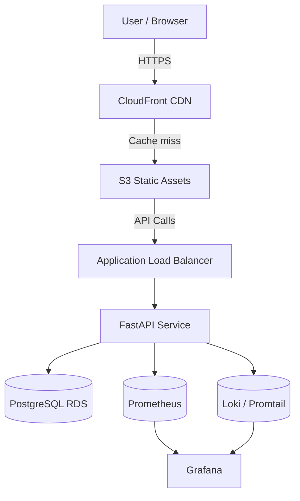
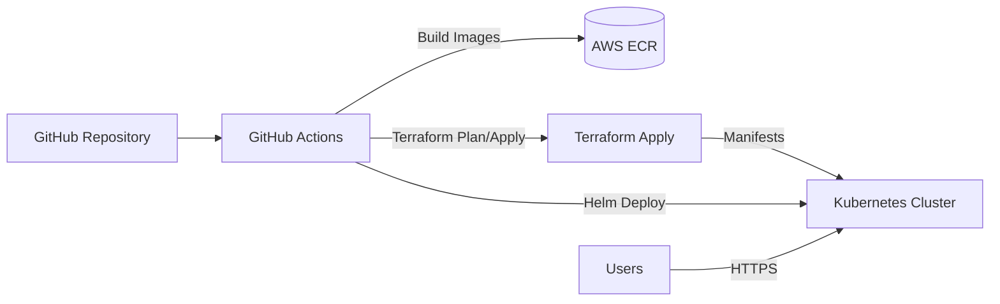
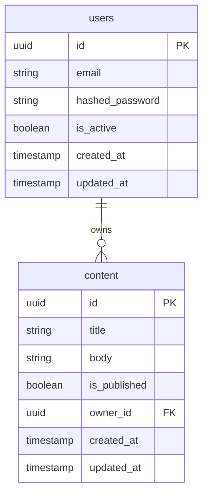
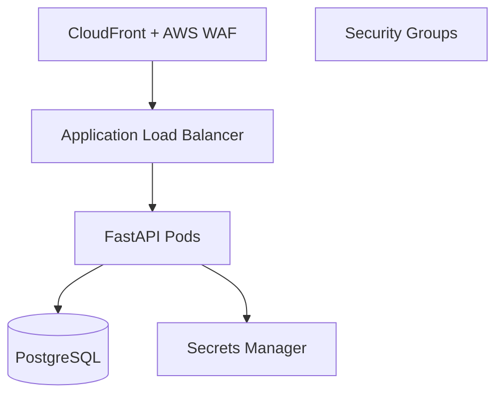

# Architecture Overview

## 1. Introduction

This document captures the end-to-end architecture of the portfolio monorepo. It is structured to guide reviewers through system goals, service responsibilities, integration patterns, security posture, and operational instrumentation.

## 2. System Goals

- Deliver a demonstrable production-grade stack spanning backend, frontend, infrastructure, testing, and monitoring.
- Highlight engineering soft skills through ADRs, cost analysis, and runbooks.
- Enable repeatable deployments across development, staging, and production environments.
- Provide observability that surfaces user-impacting events within minutes.

## 3. High-Level Diagram

## 4. Services

### 4.1 Backend (FastAPI)
- **Framework**: FastAPI running on Uvicorn, packaged via Docker multi-stage build.
- **Persistence**: PostgreSQL using SQLAlchemy 2.0 async ORM.
- **Authentication**: JWT access tokens (30 min expiry) and refresh tokens (7 days) stored in Redis-compatible cache (emulated in memory for local dev).
- **Features**: User registration, login, logout, and CRUD for content entries.
- **Observability**: Instrumented with Prometheus client metrics and structured logging via loguru.

### 4.2 Frontend (React + Vite + Tailwind)
- SPA served statically via S3/CloudFront.
- React Router v6 manages public and private routes.
- Axios API client includes interceptors for token injection and refresh workflow.
- Tailwind CSS powers design system with dark/light mode toggles.

### 4.3 Infrastructure (Terraform)
- Multi-environment stacks (dev/staging/prod) share reusable modules for network, compute, and storage.
- Remote state stored in S3 with DynamoDB table for locking.
- Security groups enforce least privilege (ingress 443 to ALB, backend SG only accepts ALB traffic, DB only accepts backend SG).

### 4.4 Monitoring
- Custom FastAPI exporter exposes request counters, histogram for latency, and gauge for active sessions.
- Prometheus scrapes backend and exporter endpoints every 15 seconds.
- Grafana dashboard provides service-level indicators (request rate, error rate, p95 latency) and infrastructure metrics from node exporter.

### 4.5 E2E Testing
- Postman collection exercises API flows (auth, CRUD, error cases) using environment variables per stage.
- k6 scripts cover smoke, load, stress, and spike scenarios with thresholds for latency and error rate.
- OWASP ZAP script performs spidering and active scans, generating HTML and JSON artifacts stored under `artifacts/`.

## 5. Deployment Architecture

### 5.1 CI/CD Flow
1. Developer pushes to feature branch.
2. `ci.yml` executes lint, unit tests, integration tests, and build steps.
3. On merge to main, Docker images are pushed to ECR; ArgoCD (managed separately) syncs manifests.
4. Release pipeline orchestrates staged deployments (staging -> manual approval -> production).

## 6. Data Model

### 6.1 Entity Relationship Diagram

### 6.2 Storage Strategy
- **PostgreSQL** handles transactional data with daily snapshots and PITR.
- **S3** stores static frontend assets and generated artifacts (reports, screenshots).
- **CloudWatch Logs** aggregates backend logs for long-term retention.

## 7. Security Architecture

Controls:
- TLS termination at CloudFront with automatic certificate rotation.
- WAF rules block common OWASP Top 10 vectors.
- Backend pods fetch secrets from AWS Secrets Manager (in local dev, `.env` files).
- Database encrypted at rest (KMS) and in transit (TLS).
- Audit logging via CloudTrail and Config ensures IAM compliance.

## 8. Observability

- **Metrics**: Request rate, error rate, latency, DB connection pool usage.
- **Logs**: Structured JSON logs consumed by Promtail -> Loki -> Grafana.
- **Tracing**: Future work item (planned with OpenTelemetry Collector).
- **Alerting**: Prometheus Alertmanager integrates with Slack and PagerDuty for on-call notifications.

## 9. Cost Awareness

- Compute: Spot instances for non-production clusters, autoscaling to zero overnight for staging.
- Storage: Lifecycle policies move S3 assets to Intelligent-Tiering.
- Monitoring: Retention trimmed to 15 days for high-resolution metrics, 90 days for downsampled data.

## 10. ADR Index

Key design decisions are captured in ADRs across services:
- `docs/adr/0001-backend-service-boundaries.md`
- `docs/adr/0002-infrastructure-network-segmentation.md`
- `docs/adr/0003-observability-stack-selection.md`

## 11. Future Enhancements

- Introduce event-driven architecture for audit trails using Amazon EventBridge.
- Implement GraphQL gateway for content queries.
- Expand security coverage with automated secret rotation and mTLS.

