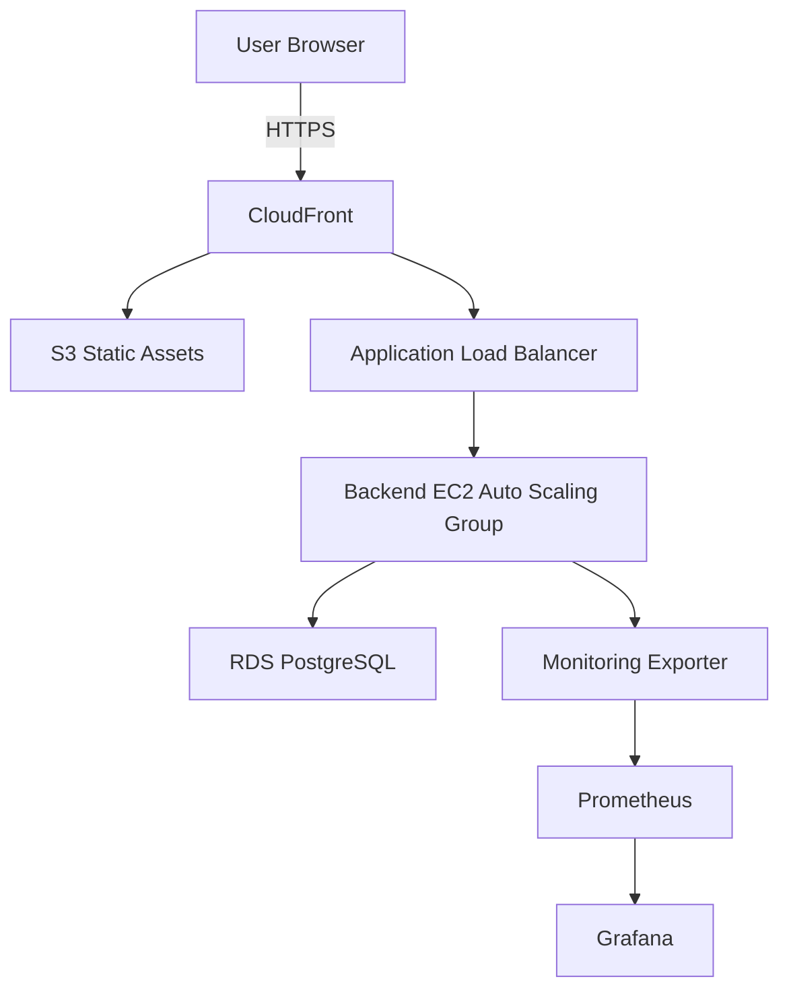
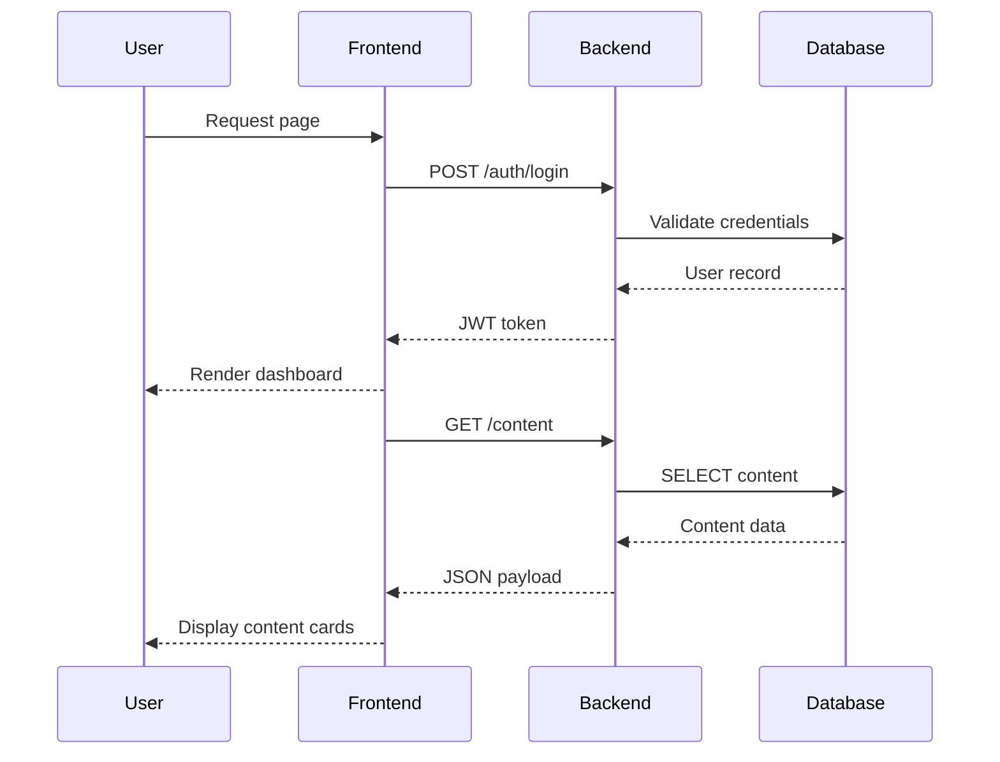

# Architecture Overview

## Monorepo Pattern
The repository embraces a monorepo architecture so that backend, frontend, infrastructure, monitoring, and test assets evolve together. Shared tooling (pre-commit, manifest generator, packaging scripts) keeps standards consistent. Each service is intentionally decoupled but tested end-to-end via Docker Compose and GitHub Actions.

## Backend Service
- **Framework:** FastAPI with async SQLAlchemy (2.0 style) and Alembic migrations.
- **Authentication:** JWT access tokens (30-minute lifetime) with refresh token support; bcrypt password hashing.
- **Database:** PostgreSQL in production, SQLite for tests. Connection handling uses `async_sessionmaker` with dependency injection via FastAPI.
- **Modules:**
  - `app/main.py` builds the FastAPI app, configures CORS, and includes routers.
  - `app/config.py` loads environment variables using Pydantic settings.
  - `app/models.py` defines ORM models for `User` and `Content` tables.
  - `app/schemas.py` contains request/response schemas.
  - `app/auth.py` encapsulates JWT and password utilities.
  - `app/routers/` exposes `/auth`, `/content`, and `/health` endpoints.
- **Testing:** Pytest suite with async fixtures for the database and HTTP client. Coverage focuses on authentication and content lifecycle scenarios.

## Frontend Service
- **Framework:** React (TypeScript) with Vite.
- **Styling:** Tailwind CSS for utility-first styling. Global styles defined in `src/styles/index.css`.
- **State Management:** React Context for authentication tokens. `ProtectedRoute` enforces login requirements.
- **API Communication:** Axios instance with interceptors for bearer tokens and refresh handling.
- **Routing:** React Router v6 for `Home`, `Login`, and `Dashboard` pages.

## Infrastructure as Code
- **Tooling:** Terraform 1.5+ with modules for network, compute, and storage.
- **State:** Remote S3 backend with DynamoDB locking configured per environment.
- **Modules:**
  - `network`: VPC, subnets (public/app/data), gateways, and security groups.
  - `compute`: Launch templates, Auto Scaling Groups, and Application Load Balancer.
  - `storage`: RDS PostgreSQL, S3 buckets, and CloudFront distribution.
- **Environments:** `dev`, `staging`, and `prod` directories provide separate `terraform.tfvars` values.

## Monitoring
- **Metrics Exporter:** FastAPI app exposing `/metrics` with Prometheus client instrumentation (request counter, duration histogram, active user gauge).
- **Prometheus:** Scrapes backend and exporter endpoints every 15 seconds using configuration stored in `monitoring/prometheus/prometheus.yml`.
- **Grafana:** Dashboard JSON for golden signals (request rate, latency, error rate, active users, resource utilization).
- **Logs:** Promtail configuration for Docker log scraping with label pipelines ready for Loki integration.

## CI/CD
- **GitHub Actions Pipelines:**
  - `ci.yml` – lint (ruff, eslint, tflint), run backend tests against PostgreSQL service, build Docker images.
  - `security.yml` – scheduled scans (Bandit, pip-audit, npm audit, Trivy, tfsec, Checkov).
  - `release.yml` – tag-triggered workflow performing tests, staging deploy, manual approval, and production deploy.
- **Quality Gates:** Pull requests must pass linting, tests, and security scans prior to merge.

## Data Flow

## Security Controls
- HTTPS enforced at CloudFront with ACM certificates.
- WAF rules (rate limiting, SQLi/XSS) attached to CloudFront and ALB.
- Private subnets for application and database tiers; security groups restrict access.
- IAM roles for EC2 instances with least privilege to S3 and CloudWatch.
- Backend enforces JWT validation and password hashing with bcrypt.
- Database encryption at rest and in transit.

## Scalability
- Auto Scaling Groups adjust backend capacity between one and three instances.
- RDS configured for Multi-AZ in staging and production `terraform.tfvars`.
- CloudFront caches static assets globally to reduce latency.
- Terraform modules allow extension to additional regions by reusing network and compute stacks.

## Future Enhancements
- Integrate service mesh (AWS App Mesh) for mTLS and advanced routing.
- Extend observability with distributed tracing (OpenTelemetry) and log aggregation via Loki.
- Add GitOps pipeline using Argo CD referencing Terraform outputs.
