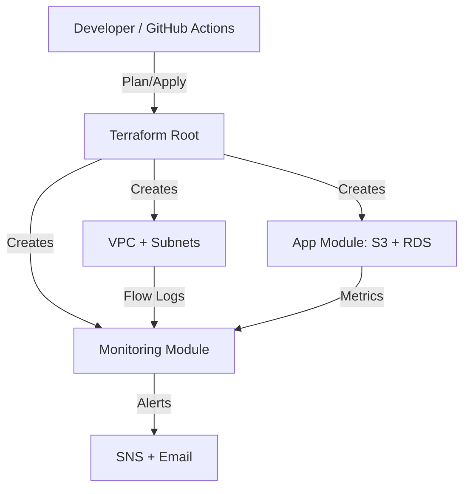
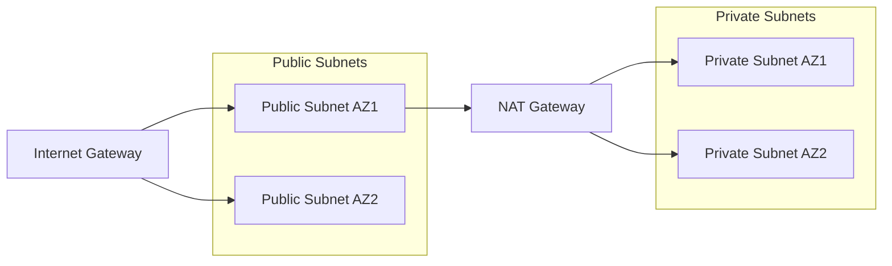
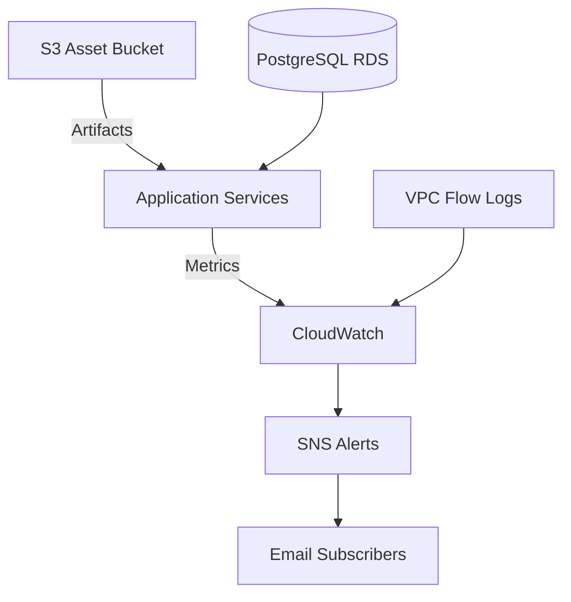

# Portfolio Terraform Architecture

## High-level architecture

```mermaid
graph TD
  Dev[Developer / GitHub Actions] -->|Plan/Apply| TF[Terraform Root]
  TF -->|Creates| VPC[VPC + Subnets]
  TF -->|Creates| APP[App Module: S3 + RDS]
  TF -->|Creates| MON[Monitoring Module]
  VPC -->|Flow Logs| MON
  APP -->|Metrics| MON
  MON -->|Alerts| SNS[SNS + Email]
```

## VPC layout

```mermaid
graph LR
  IGW[Internet Gateway]
  subgraph Public Subnets
    P1[Public Subnet AZ1]
    P2[Public Subnet AZ2]
  end
  subgraph Private Subnets
    S1[Private Subnet AZ1]
    S2[Private Subnet AZ2]
  end
  IGW --> P1
  IGW --> P2
  P1 --> NAT[NAT Gateway]
  NAT --> S1
  NAT --> S2
```

## Component relationships

```mermaid
graph TD
  S3[S3 Asset Bucket] -->|Artifacts| AppServices[Application Services]
  RDS[(PostgreSQL RDS)] --> AppServices
  AppServices -->|Metrics| CloudWatch[CloudWatch]
  VPCFlow[VPC Flow Logs] --> CloudWatch
  CloudWatch --> SNS[SNS Alerts]
  SNS --> Email[Email Subscribers]
```
