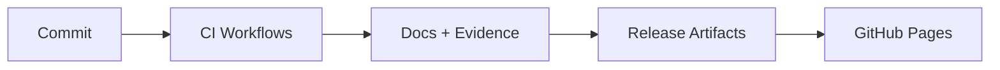
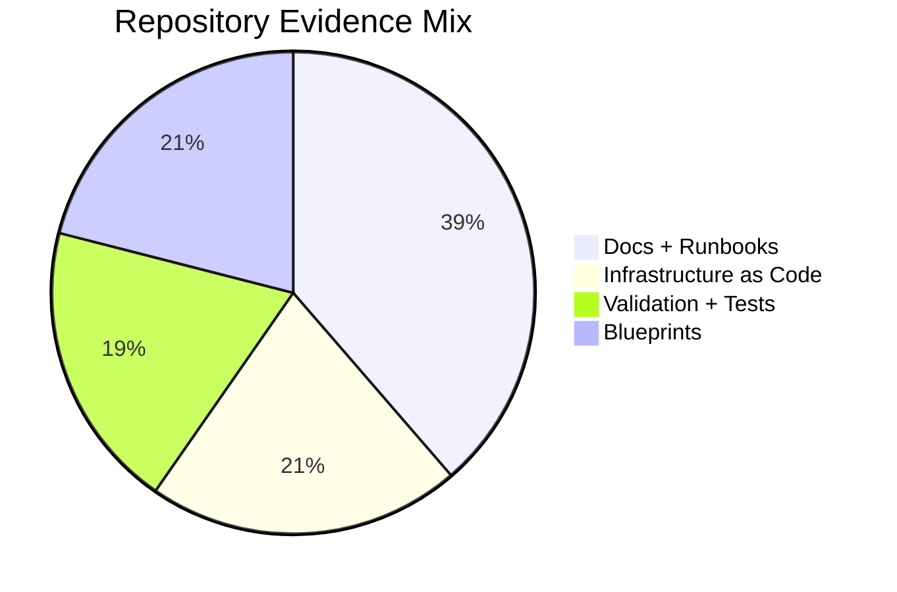

# Archived README Snapshot: GitHub Status Snapshot

This document preserves the full historical snapshot block that previously lived in the root README.

## 📈 GitHub Status Snapshot (Local Repository)

### Repository Pulse (local Git snapshot)

- **Active branch:** `work`
- **Last update:** 2026-01-05
- **Commits:** 777 total revisions
- **Tracked files:** 3,062 assets
- **Projects:** 43 portfolio showcases (25 core blueprints + 18 extended tracks)
- **READMEs:** 46 published guides

### Documentation & Infra Inventory

- **Markdown files:** 407 references · **Total words:** 506,150
- **Docker compose files:** 25 · **Terraform files:** 81 · **Config packs:** 54

