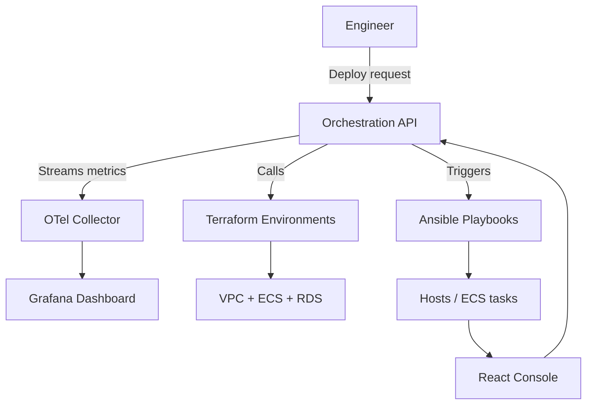

# Platform Orchestration Diagram

```mermaid
graph TD
  user[Engineer] -->|Deploy request| api[Orchestration API]
  api -->|Calls| terraform[Terraform Environments]
  api -->|Triggers| ansible[Ansible Playbooks]
  api -->|Streams metrics| otel[OTel Collector]
  otel --> grafana[Grafana Dashboard]
  terraform --> aws[VPC + ECS + RDS]
  ansible --> hosts[Hosts / ECS tasks]
  hosts --> frontend[React Console]
  frontend --> api
```
