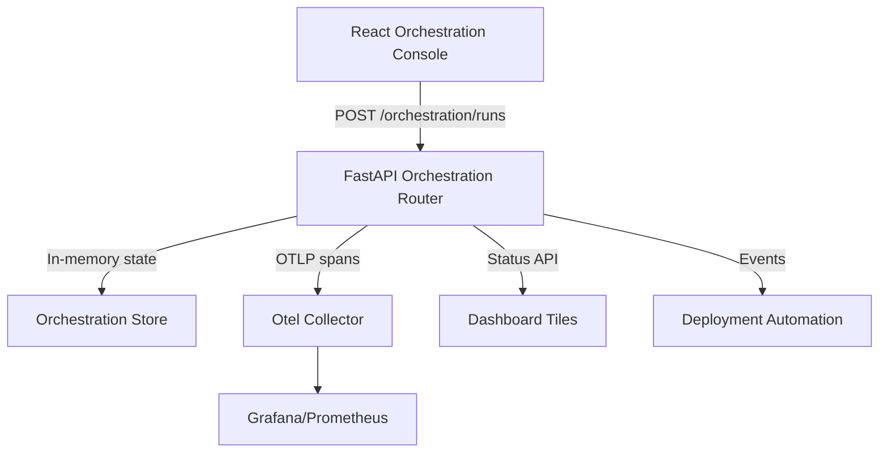

# Orchestration Flow Diagram

```mermaid
graph TD
  A[React Orchestration Console] -->|POST /orchestration/runs| B[FastAPI Orchestration Router]
  B -->|In-memory state| C[Orchestration Store]
  B -->|OTLP spans| D[Otel Collector]
  D --> E[Grafana/Prometheus]
  B -->|Status API| F[Dashboard Tiles]
  B -->|Events| G[Deployment Automation]
```
