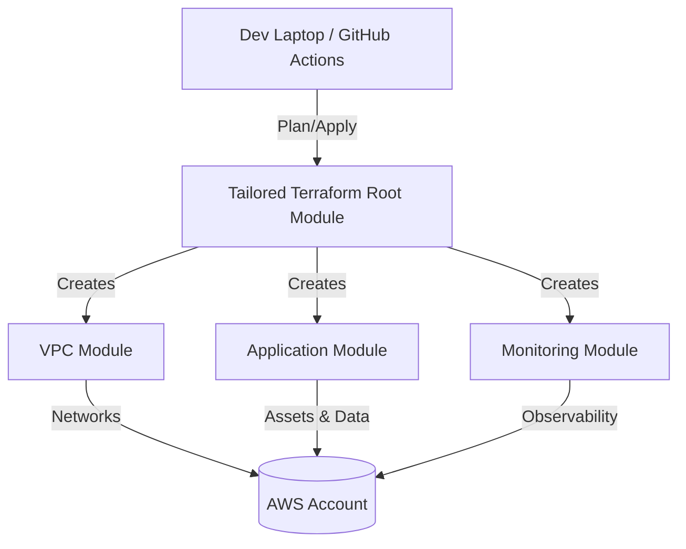
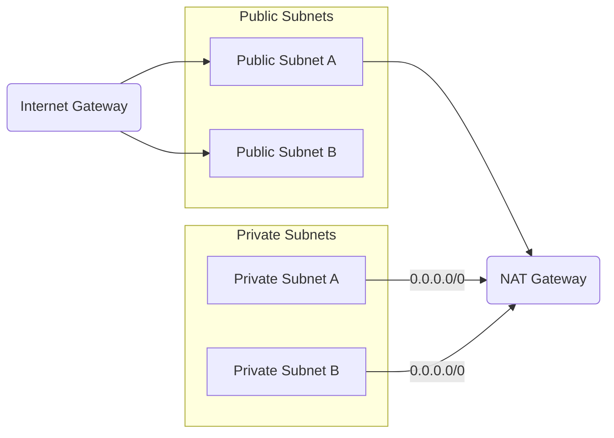
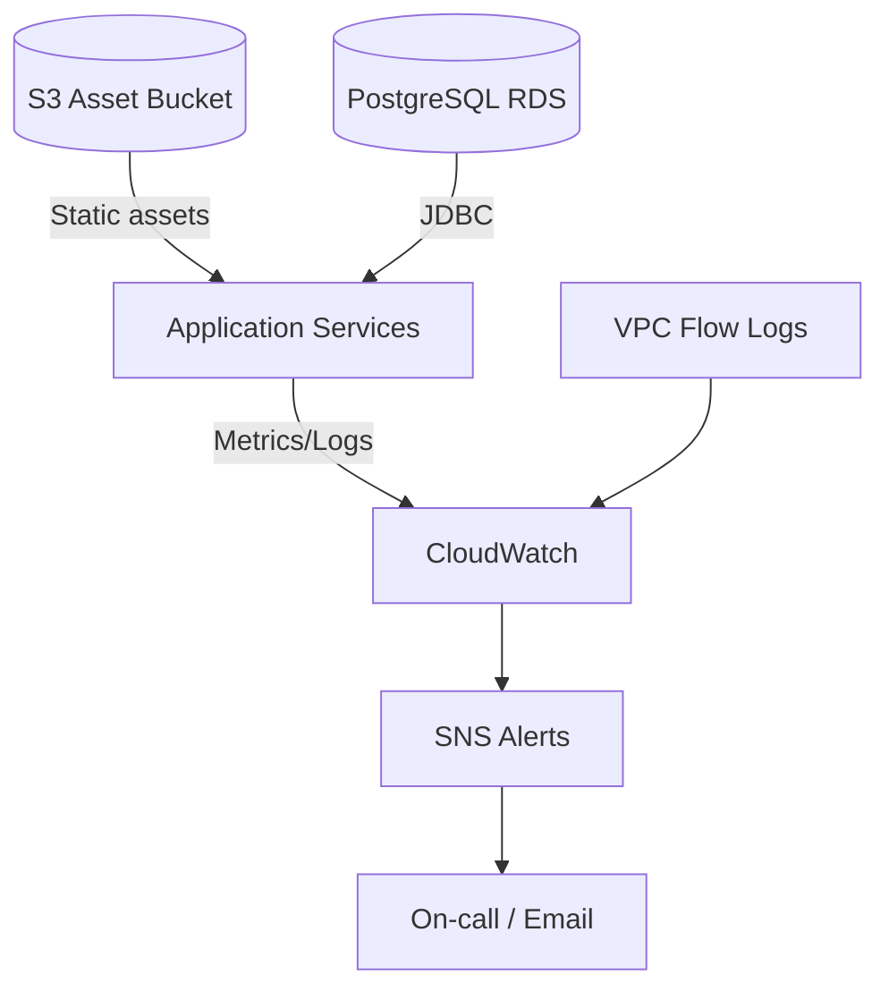

# Terraform Architecture Diagrams

## Portfolio Infrastructure (High Level)

```mermaid
graph TD
  Dev[Dev Laptop / GitHub Actions] -->|Plan/Apply| TF[Tailored Terraform Root Module]
  TF -->|Creates| VPC[VPC Module]
  TF -->|Creates| APP[Application Module]
  TF -->|Creates| MON[Monitoring Module]
  VPC -->|Networks| AWS[(AWS Account)]
  APP -->|Assets & Data| AWS
  MON -->|Observability| AWS
```

## VPC Topology

```mermaid
graph LR
  IGW(Internet Gateway)
  NAT(NAT Gateway)
  subgraph Public Subnets
    P1[Public Subnet A]
    P2[Public Subnet B]
  end
  subgraph Private Subnets
    PR1[Private Subnet A]
    PR2[Private Subnet B]
  end
  IGW --> P1
  IGW --> P2
  P1 --> NAT
  PR1 -->|0.0.0.0/0| NAT
  PR2 -->|0.0.0.0/0| NAT
```

## Component Relationships

```mermaid
graph TD
  S3[(S3 Asset Bucket)] -->|Static assets| AppSvc[Application Services]
  RDS[(PostgreSQL RDS)] -->|JDBC| AppSvc
  AppSvc -->|Metrics/Logs| CW[CloudWatch]
  VPCFlow[VPC Flow Logs] --> CW
  CW --> SNS[SNS Alerts]
  SNS --> Ops[On-call / Email]
```
