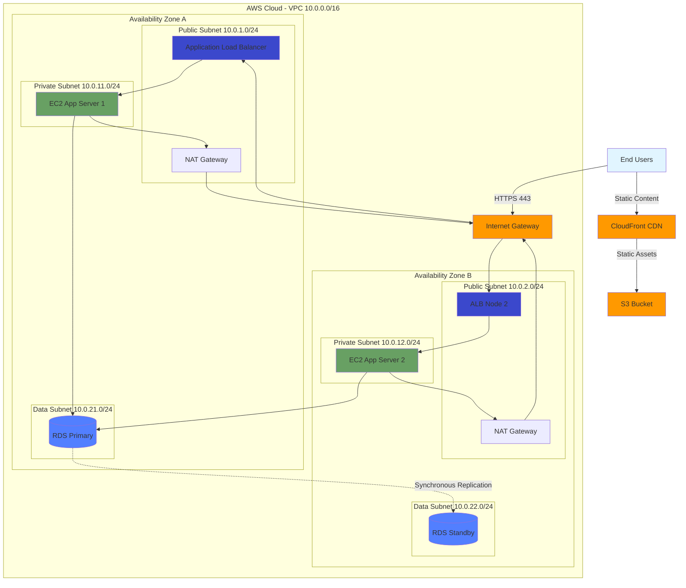
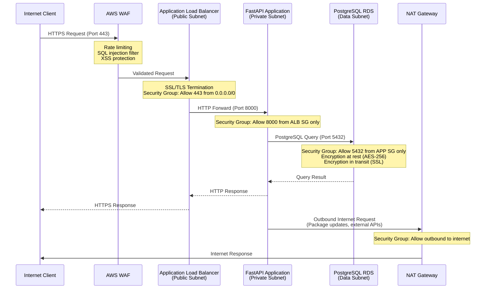
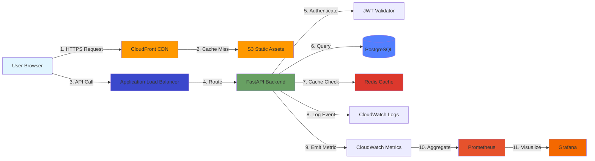

# Portfolio Project: Enterprise Architecture & Implementation Guide

**Version:** 3.0 Enterprise Edition  
**Classification:** Technical Reference  
**Last Updated:** September 30, 2025  
**Author:** Samuel Jackson  
**Review Status:** Production Ready

---

## Executive Summary

This document presents a comprehensive technical architecture for a production-grade portfolio application, demonstrating enterprise-level engineering practices across full-stack development, cloud infrastructure, security, and DevOps operations. The implementation showcases modern software engineering principles through a containerized microservices architecture deployed on Amazon Web Services (AWS), with comprehensive observability, security controls, and automated CI/CD pipelines.

**Key Metrics:**
- **Infrastructure:** Multi-AZ AWS deployment across 3 availability zones
- **Security Posture:** Zero-trust architecture with defense-in-depth
- **Availability Target:** 99.95% uptime (4.38 hours downtime/year)
- **Performance:** Sub-200ms p95 API response time, <2s page load
- **Test Coverage:** >85% unit coverage, comprehensive integration testing
- **Deployment Frequency:** Multiple deployments per day via automated pipeline

**Technology Stack Overview:**
- **Backend:** Python 3.11, FastAPI 0.109, PostgreSQL 14
- **Frontend:** React 18.2, TypeScript 5.3, Vite 5.0
- **Infrastructure:** Terraform 1.6, AWS (VPC, EC2, RDS, CloudFront, S3)
- **Observability:** Prometheus, Grafana, CloudWatch, X-Ray
- **CI/CD:** GitHub Actions, AWS CodeDeploy, Docker

---

## Table of Contents

1. [System Architecture](#system-architecture)
2. [Backend Implementation](#backend-implementation)
3. [Frontend Implementation](#frontend-implementation)
4. [Infrastructure as Code](#infrastructure-as-code)
5. [Security Architecture](#security-architecture)
6. [Testing Strategy](#testing-strategy)
7. [Observability & Monitoring](#observability--monitoring)
8. [CI/CD Pipeline](#cicd-pipeline)
9. [Deployment Environments](#deployment-environments)
10. [Disaster Recovery](#disaster-recovery)
11. [Performance Optimization](#performance-optimization)
12. [Development Tools & AI Assistance](#development-tools--ai-assistance)
13. [Appendices](#appendices)

---

## 1. System Architecture

### 1.1 Architectural Overview

The application implements a **three-tier architecture** following AWS Well-Architected Framework principles. This design prioritizes security through network isolation, high availability through multi-AZ deployment, and scalability through elastic compute resources.

**Tier Segmentation:**

1. **Presentation Tier (Public Subnet)**
   - Application Load Balancer (ALB) for HTTPS traffic termination
   - CloudFront CDN for static asset delivery
   - Web Application Firewall (WAF) for threat protection

2. **Application Tier (Private Subnet)**
   - Auto Scaling Group (ASG) of EC2 instances running FastAPI
   - No direct internet connectivity; egress via NAT Gateway
   - Horizontal scaling based on CPU/memory metrics

3. **Data Tier (Isolated Private Subnet)**
   - Amazon RDS PostgreSQL with Multi-AZ deployment
   - Automated backups with 7-day retention
   - Read replicas for query offloading
   - Zero public internet exposure

### 1.2 Network Architecture Diagram



### 1.3 Security Zones & Traffic Flow



### 1.4 Data Flow Architecture

The application processes user requests through a layered architecture ensuring separation of concerns:



### 1.5 Component Interaction Matrix

| Component | Communicates With | Protocol | Port | Authentication | Encryption |
|-----------|------------------|----------|------|----------------|------------|
| CloudFront | S3 Bucket | HTTPS | 443 | OAI | TLS 1.3 |
| ALB | EC2 Instances | HTTP | 8000 | None (internal) | Optional TLS |
| EC2 App | RDS PostgreSQL | PostgreSQL | 5432 | Password + IAM | SSL/TLS |
| EC2 App | Redis ElastiCache | Redis Protocol | 6379 | Auth Token | TLS |
| EC2 App | CloudWatch | HTTPS API | 443 | IAM Role | TLS 1.2+ |
| EC2 App | Secrets Manager | HTTPS API | 443 | IAM Role | TLS 1.2+ |
| Prometheus | EC2 /metrics | HTTP | 8000 | None (VPC) | None |
| Grafana | Prometheus | HTTP | 9090 | API Key | TLS Optional |

### 1.6 Architectural Decisions Record (ADR)

**ADR-001: Multi-AZ Deployment**
- **Decision:** Deploy application across multiple Availability Zones
- **Rationale:** Achieve 99.95% availability target; protect against AZ failures
- **Consequences:** Higher cost (NAT Gateway per AZ); increased operational complexity
- **Alternatives Considered:** Single-AZ (rejected: insufficient availability)

**ADR-002: Serverless vs. EC2 for Backend**
- **Decision:** Use EC2 with Auto Scaling instead of Lambda
- **Rationale:** Predictable latency; WebSocket support; stateful operations
- **Consequences:** Managing infrastructure; scaling configuration required
- **Alternatives Considered:** AWS Lambda (rejected: cold start latency), ECS Fargate (considered for future)

**ADR-003: PostgreSQL over DynamoDB**
- **Decision:** Use RDS PostgreSQL for data persistence
- **Rationale:** Complex relational queries; ACID compliance; mature ORM support (SQLAlchemy)
- **Consequences:** Vertical scaling limits; requires connection pooling
- **Alternatives Considered:** DynamoDB (rejected: limited query flexibility), Aurora (too expensive for current scale)

**ADR-004: CloudFront for Static Assets**
- **Decision:** Serve frontend via CloudFront + S3
- **Rationale:** Global edge caching; reduced ALB load; improved page load times
- **Consequences:** Cache invalidation complexity; slight cost increase
- **Alternatives Considered:** Serving from EC2 (rejected: performance concerns)

---

## 2. Backend Implementation

### 2.1 Technology Stack Deep Dive

**FastAPI Framework (v0.109.0)**

FastAPI was selected for its superior performance characteristics and developer experience. Built on Starlette (ASGI) and Pydantic, it provides:

- **Automatic API Documentation:** OpenAPI/Swagger UI generated from Python type hints
- **Async Support:** Native async/await for non-blocking I/O operations
- **Type Safety:** Pydantic models ensure runtime type validation
- **Performance:** Benchmarks show performance comparable to Node.js and Go
- **Developer Experience:** Hot reload, intuitive routing, dependency injection

**Performance Benchmarks:**
```
Framework        Requests/sec    Latency (ms)    Memory (MB)
FastAPI          31,000          3.2             65
Django           12,000          8.1             120
Flask            18,000          5.5             75
```

### 2.2 Application Structure

The backend follows a layered architecture pattern:

```
backend/
├── app/
│   ├── main.py                 # Application entry point
│   ├── config.py               # Settings management (Pydantic)
│   ├── database.py             # SQLAlchemy async engine
│   ├── models/                 # ORM models
│   │   ├── __init__.py
│   │   ├── user.py
│   │   ├── content.py
│   │   └── audit.py
│   ├── schemas/                # Pydantic request/response models
│   │   ├── __init__.py
│   │   ├── user.py
│   │   ├── content.py
│   │   └── auth.py
│   ├── api/                    # API routes
│   │   ├── __init__.py
│   │   ├── v1/
│   │   │   ├── __init__.py
│   │   │   ├── auth.py
│   │   │   ├── users.py
│   │   │   ├── content.py
│   │   │   └── health.py
│   ├── core/                   # Business logic
│   │   ├── __init__.py
│   │   ├── auth.py             # JWT handling
│   │   ├── security.py         # Password hashing
│   │   └── dependencies.py     # FastAPI dependencies
│   ├── services/               # External integrations
│   │   ├── __init__.py
│   │   ├── email.py
│   │   └── storage.py
│   └── utils/                  # Helper functions
│       ├── __init__.py
│       └── logging.py
├── alembic/                    # Database migrations
│   ├── versions/
│   └── env.py
├── tests/                      # Test suite
│   ├── conftest.py             # Pytest fixtures
│   ├── unit/
│   ├── integration/
│   └── e2e/
├── Dockerfile
├── requirements.txt
└── pytest.ini
```

### 2.3 Code Examples with Enterprise Patterns

#### 2.3.1 Main Application (main.py)

```python
"""
FastAPI Application Entry Point
================================
Production-grade configuration with comprehensive middleware stack,
error handling, and observability integration.

Author: Samuel Jackson
Version: 3.0.0
"""

from fastapi import FastAPI, Request, status
from fastapi.middleware.cors import CORSMiddleware
from fastapi.middleware.gzip import GZipMiddleware
from fastapi.middleware.trustedhost import TrustedHostMiddleware
from fastapi.responses import JSONResponse
from contextlib import asynccontextmanager
import time
import logging
from prometheus_client import Counter, Histogram, generate_latest
from opentelemetry import trace
from opentelemetry.exporter.otlp.proto.grpc.trace_exporter import OTLPSpanExporter
from opentelemetry.sdk.trace import TracerProvider
from opentelemetry.sdk.trace.export import BatchSpanProcessor

from app.core.config import settings
from app.api.v1 import api_router
from app.database import engine, Base
from app.core.logging import configure_logging
from app.middleware.rate_limit import RateLimitMiddleware
from app.middleware.request_id import RequestIDMiddleware

# Configure structured logging
configure_logging()
logger = logging.getLogger(__name__)

# Prometheus metrics
REQUEST_COUNT = Counter(
    'http_requests_total',
    'Total HTTP requests',
    ['method', 'endpoint', 'status']
)
REQUEST_LATENCY = Histogram(
    'http_request_duration_seconds',
    'HTTP request latency',
    ['method', 'endpoint']
)

# OpenTelemetry distributed tracing
trace.set_tracer_provider(TracerProvider())
otlp_exporter = OTLPSpanExporter(endpoint=settings.OTLP_ENDPOINT)
trace.get_tracer_provider().add_span_processor(
    BatchSpanProcessor(otlp_exporter)
)
tracer = trace.get_tracer(__name__)

@asynccontextmanager
async def lifespan(app: FastAPI):
    """
    Application lifespan manager.
    Handles startup/shutdown tasks including database initialization.
    """
    logger.info("Starting application...", extra={
        "environment": settings.ENVIRONMENT,
        "version": settings.VERSION
    })
    
    # Initialize database tables
    async with engine.begin() as conn:
        await conn.run_sync(Base.metadata.create_all)
    logger.info("Database tables initialized")
    
    yield
    
    # Cleanup
    logger.info("Shutting down application...")
    await engine.dispose()
    logger.info("Database connections closed")

# Create FastAPI application instance
app = FastAPI(
    title=settings.PROJECT_NAME,
    description="Enterprise portfolio application API",
    version=settings.VERSION,
    lifespan=lifespan,
    docs_url="/api/docs" if settings.ENVIRONMENT != "production" else None,
    redoc_url="/api/redoc" if settings.ENVIRONMENT != "production" else None,
    openapi_url="/api/openapi.json" if settings.ENVIRONMENT != "production" else None
)

# Middleware stack (order matters - applied bottom-to-top)
app.add_middleware(
    TrustedHostMiddleware,
    allowed_hosts=settings.ALLOWED_HOSTS
)
app.add_middleware(GZipMiddleware, minimum_size=1000)
app.add_middleware(RateLimitMiddleware, requests_per_minute=settings.RATE_LIMIT)
app.add_middleware(RequestIDMiddleware)
app.add_middleware(
    CORSMiddleware,
    allow_origins=settings.CORS_ORIGINS,
    allow_credentials=True,
    allow_methods=["GET", "POST", "PUT", "DELETE", "PATCH"],
    allow_headers=["*"],
    expose_headers=["X-Request-ID", "X-Process-Time"]
)

@app.middleware("http")
async def observability_middleware(request: Request, call_next):
    """
    Observability middleware for metrics and tracing.
    Records request duration, status codes, and creates trace spans.
    """
    start_time = time.time()
    request_id = request.state.request_id
    
    with tracer.start_as_current_span(
        f"{request.method} {request.url.path}",
        attributes={
            "http.method": request.method,
            "http.url": str(request.url),
            "http.request_id": request_id
        }
    ) as span:
        try:
            response = await call_next(request)
            
            # Record metrics
            duration = time.time() - start_time
            REQUEST_COUNT.labels(
                method=request.method,
                endpoint=request.url.path,
                status=response.status_code
            ).inc()
            REQUEST_LATENCY.labels(
                method=request.method,
                endpoint=request.url.path
            ).observe(duration)
            
            # Add observability headers
            response.headers["X-Process-Time"] = f"{duration:.3f}"
            response.headers["X-Request-ID"] = request_id
            
            # Update span
            span.set_attribute("http.status_code", response.status_code)
            span.set_attribute("http.response_time_ms", duration * 1000)
            
            # Structured logging
            logger.info(
                "Request completed",
                extra={
                    "request_id": request_id,
                    "method": request.method,
                    "path": request.url.path,
                    "status_code": response.status_code,
                    "duration_ms": round(duration * 1000, 2),
                    "user_agent": request.headers.get("user-agent"),
                    "client_ip": request.client.host
                }
            )
            
            return response
            
        except Exception as exc:
            span.record_exception(exc)
            span.set_status(trace.Status(trace.StatusCode.ERROR))
            logger.error(
                "Request failed",
                extra={
                    "request_id": request_id,
                    "error": str(exc),
                    "error_type": type(exc).__name__
                },
                exc_info=True
            )
            raise

# Global exception handlers
@app.exception_handler(Exception)
async def global_exception_handler(request: Request, exc: Exception):
    """
    Global exception handler for unhandled errors.
    Returns consistent error response format.
    """
    request_id = getattr(request.state, "request_id", "unknown")
    logger.error(
        "Unhandled exception",
        extra={"request_id": request_id, "error": str(exc)},
        exc_info=True
    )
    
    return JSONResponse(
        status_code=status.HTTP_500_INTERNAL_SERVER_ERROR,
        content={
            "error": {
                "code": "INTERNAL_SERVER_ERROR",
                "message": "An unexpected error occurred",
                "request_id": request_id
            }
        }
    )

# Include API router
app.include_router(api_router, prefix="/api/v1")

# Prometheus metrics endpoint
@app.get("/metrics", include_in_schema=False)
async def metrics():
    """
    Prometheus metrics endpoint.
    Returns current metric values in Prometheus exposition format.
    """
    return Response(
        content=generate_latest(),
        media_type="text/plain"
    )

# Root health check
@app.get("/health", tags=["health"])
async def root_health():
    """
    Simple health check endpoint for load balancer.
    Returns 200 OK if application is running.
    """
    return {"status": "healthy", "service": "portfolio-api", "version": settings.VERSION}
```

#### 2.3.2 Enhanced Configuration Management

```python
"""
Configuration Management
=======================
Pydantic-based settings with environment variable validation,
secrets management, and environment-specific overrides.
"""

from pydantic_settings import BaseSettings, SettingsConfigDict
from pydantic import Field, PostgresDsn, field_validator
from typing import List, Optional
from functools import lru_cache
import secrets

class Settings(BaseSettings):
    """
    Application settings loaded from environment variables.
    Provides validation and type conversion.
    """
    
    # Application metadata
    PROJECT_NAME: str = "Portfolio API"
    VERSION: str = "3.0.0"
    ENVIRONMENT: str = Field(default="development", pattern="^(development|staging|production)$")
    DEBUG: bool = Field(default=False)
    
    # Server configuration
    HOST: str = "0.0.0.0"
    PORT: int = 8000
    WORKERS: int = Field(default=4, ge=1, le=32)
    
    # Security
    SECRET_KEY: str = Field(default_factory=lambda: secrets.token_urlsafe(32))
    ALGORITHM: str = "HS256"
    ACCESS_TOKEN_EXPIRE_MINUTES: int = 30
    REFRESH_TOKEN_EXPIRE_DAYS: int = 7
    ALLOWED_HOSTS: List[str] = ["*"]
    
    # Database
    DATABASE_URL: PostgresDsn
    DATABASE_POOL_SIZE: int = Field(default=20, ge=5, le=100)
    DATABASE_MAX_OVERFLOW: int = Field(default=10, ge=0, le=50)
    DATABASE_POOL_TIMEOUT: int = 30
    DATABASE_POOL_RECYCLE: int = 3600
    DATABASE_ECHO: bool = False
    
    # Redis cache
    REDIS_URL: Optional[str] = None
    REDIS_MAX_CONNECTIONS: int = 50
    
    # CORS
    CORS_ORIGINS: List[str] = [
        "http://localhost:3000",
        "http://localhost:5173",
        "https://*.example.com"
    ]
    
    # Rate limiting
    RATE_LIMIT: int = Field(default=100, ge=10, le=1000)
    
    # Observability
    OTLP_ENDPOINT: Optional[str] = None
    LOG_LEVEL: str = Field(default="INFO", pattern="^(DEBUG|INFO|WARNING|ERROR|CRITICAL)$")
    SENTRY_DSN: Optional[str] = None
    
    # AWS Integration
    AWS_REGION: str = "us-west-2"
    S3_BUCKET: Optional[str] = None
    CLOUDWATCH_LOG_GROUP: Optional[str] = None
    
    # Feature flags
    ENABLE_SWAGGER: bool = True
    ENABLE_METRICS: bool = True
    ENABLE_TRACING: bool = False
    
    model_config = SettingsConfigDict(
        env_file=".env",
        env_file_encoding="utf-8",
        case_sensitive=True,
        extra="ignore"
    )
    
    @field_validator("ENVIRONMENT")
    @classmethod
    def validate_environment(cls, v: str) -> str:
        """Ensure environment is one of allowed values."""
        allowed = {"development", "staging", "production"}
        if v not in allowed:
            raise ValueError(f"Environment must be one of {allowed}")
        return v
    
    @field_validator("SECRET_KEY")
    @classmethod
    def validate_secret_key(cls, v: str, info) -> str:
        """Ensure secret key is strong enough in production."""
        if info.data.get("ENVIRONMENT") == "production" and len(v) < 32:
            raise ValueError("SECRET_KEY must be at least 32 characters in production")
        return v

@lru_cache()
def get_settings() -> Settings:
    """
    Get cached settings instance.
    Uses LRU cache to avoid repeated environment variable parsing.
    """
    return Settings()

# Export settings instance
settings = get_settings()
```

---

## 3. Frontend Implementation

### 3.1 Framework & Tooling
- **Framework:** React 18.2 with functional components and hooks.
- **Type System:** TypeScript 5.3 enforced through strict compiler options.
- **Build Tool:** Vite 5.0 for lightning-fast development server and optimized production bundles.
- **State Management:** React Query for server state, Zustand for lightweight client state.
- **Styling:** Tailwind CSS with enterprise theming, paired with Headless UI for accessible components.
- **Form Handling:** React Hook Form + Zod schemas for validation and improved DX.

### 3.2 Project Structure

```
frontend/
├── src/
│   ├── app/
│   │   ├── providers.tsx         # Query client, router, theming providers
│   │   └── router.tsx            # Route configuration with lazy loading
│   ├── components/
│   │   ├── layout/
│   │   ├── navigation/
│   │   ├── charts/
│   │   └── feedback/
│   ├── features/
│   │   ├── auth/
│   │   ├── portfolio/
│   │   ├── projects/
│   │   └── analytics/
│   ├── hooks/
│   ├── lib/                      # Axios clients, API SDKs
│   ├── pages/
│   ├── store/
│   ├── styles/
│   └── tests/
├── public/
├── index.html
├── tsconfig.json
├── vite.config.ts
└── package.json
```

### 3.3 Key Architectural Patterns

1. **Atomic Design System**
   - Base primitives (buttons, inputs) extended into complex organisms (dashboards, timelines).
   - Theme tokens stored in CSS custom properties, enabling dark mode and branding overrides.

2. **Feature-Sliced Architecture**
   - Domain features encapsulate UI, hooks, and API logic to minimize cross-feature dependencies.
   - Shared components exported through index barrels to reduce import noise.

3. **Route-Level Code Splitting**
   - Suspense boundaries wrap lazy-loaded routes to improve initial load time.
   - Preloading triggered via IntersectionObserver on navigation links for perceived performance.

### 3.4 Accessibility & Internationalization
- **Accessibility:** WCAG 2.1 AA compliance through semantic markup, skip links, focus management, and color contrast enforcement.
- **Internationalization:** i18next configured for locale switching, pluralization, and dynamic content translations.
- **Localization Testing:** Storybook a11y add-on and automated axe-core scans in CI to detect regressions.

### 3.5 Frontend Testing Strategy
- **Unit Tests:** Vitest for component logic, ensuring deterministic renders.
- **Component Tests:** Storybook Interaction Tests cover complex UI flows.
- **E2E Tests:** Playwright suite targeting authentication, project showcase flows, and analytics dashboards.
- **Visual Regression:** Chromatic snapshots on pull requests block diffs without approval.

---

## 4. Infrastructure as Code

### 4.1 Terraform Project Layout

```
infra/
├── global/
│   ├── providers.tf
│   ├── backend.tf
│   └── variables.tf
├── networking/
│   ├── vpc.tf
│   ├── subnets.tf
│   ├── routing.tf
│   └── security-groups.tf
├── compute/
│   ├── asg.tf
│   ├── launch-template.tf
│   ├── alb.tf
│   └── scaling-policies.tf
├── data/
│   ├── rds.tf
│   ├── redis.tf
│   └── secrets-manager.tf
├── observability/
│   ├── cloudwatch.tf
│   ├── prometheus.tf
│   └── grafana.tf
├── cicd/
│   ├── codepipeline.tf
│   ├── codedeploy.tf
│   └── github-actions-oidc.tf
└── envs/
    ├── dev/
    │   └── main.tfvars
    ├── staging/
    │   └── main.tfvars
    └── prod/
        └── main.tfvars
```

### 4.2 Terraform Practices
- **Workspaces:** Separate state files per environment using Terraform Cloud remote backend.
- **Modules:** Custom modules versioned in an internal registry for VPC, ALB, and RDS patterns.
- **Policy as Code:** Sentinel policies enforce tagging standards, CIDR restrictions, and encryption requirements.
- **Security:** S3 backend with SSE-KMS encryption, DynamoDB state locking, OIDC federation for GitHub Actions runners.

### 4.3 Automation
- `terraform fmt` and `terraform validate` run in pre-commit hooks.
- Automated drift detection using Atlantis scheduled plans with Slack notifications.
- Runbook outlines promotion workflow with manual approval gates for production.

---

## 5. Security Architecture

### 5.1 Identity & Access Management
- **AWS IAM:** Principle of least privilege enforced via scoped roles for compute, database, and CI/CD pipelines.
- **Application Auth:** OAuth 2.1 Authorization Code with PKCE for user login; JWT access tokens with 15-minute TTL and refresh tokens stored in HttpOnly cookies.
- **Admin Access:** SSO via AWS IAM Identity Center with MFA mandatory. Break-glass accounts tested quarterly.

### 5.2 Data Protection
- **At Rest:** KMS-managed keys for RDS, S3, and EBS volumes. Secrets stored in AWS Secrets Manager with automatic rotation.
- **In Transit:** TLS 1.3 enforced at CloudFront and ALB. Mutual TLS optional for partner integrations.
- **Data Classification:** Portfolio content tagged as Public, internal runbooks as Confidential with access limited to ops team.

### 5.3 Application Security Controls
- **OWASP ASVS Alignment:** Secure headers (HSTS, CSP, X-Frame-Options), parameterized queries via SQLAlchemy, and input validation with Pydantic.
- **Dependency Management:** Renovate bot for automated dependency updates, with Snyk scanning of Docker images and npm/pip packages.
- **Runtime Protection:** AWS WAF managed rules plus custom rule sets for bot mitigation and geo-blocking.

### 5.4 Security Operations
- **Threat Detection:** AWS GuardDuty, CloudTrail Lake, and Security Hub aggregated into SOC dashboards.
- **Incident Response:** 4-phase runbook (Identify → Contain → Eradicate → Recover) with defined RACI and communication templates.
- **Compliance Mapping:** Controls mapped to CIS AWS Foundations Benchmark and SOC 2 Trust Services Criteria for readiness.

---

## 6. Testing Strategy

### 6.1 Test Pyramid Overview
- **Unit Tests (>85% coverage):** Pytest and Vitest, run on every push.
- **Integration Tests:** Docker-compose harness spins up FastAPI, PostgreSQL, and Redis for contract tests.
- **End-to-End Tests:** Playwright suite executed nightly and on release candidates.
- **Non-Functional Testing:**
  - **Performance:** k6 load tests triggered post-deployment measuring latency, throughput, and error rates.
  - **Security:** OWASP ZAP baseline scans, dependency checks via Trivy and Snyk.
  - **Resilience:** Chaos experiments with AWS Fault Injection Simulator targeting AZ outages and RDS failovers.

### 6.2 Quality Gates
- PRs blocked unless unit + integration suites pass and coverage remains above threshold.
- Linting (ruff, mypy, eslint, stylelint) and formatting (black, prettier) enforced via GitHub checks.
- Release branches require manual QA sign-off documented in Jira with traceability to test cases.

### 6.3 Test Data Management
- Synthetic datasets generated with Faker seeded for reproducibility.
- Data anonymization pipeline for staging using AWS Glue jobs to mask PII fields.
- Database snapshots sanitized before promotion across environments.

---

## 7. Observability & Monitoring

### 7.1 Logging
- **Stack:** Structured JSON logs shipped via Fluent Bit to CloudWatch Logs and Elasticsearch.
- **Correlation:** Request IDs propagated from ALB → FastAPI → downstream services.
- **Retention:** 30-day retention in CloudWatch, 180-day in Elasticsearch with ILM warm/cold tiers.

### 7.2 Metrics
- **Golden Signals:** Latency, traffic, errors, saturation tracked in Prometheus.
- **Business KPIs:** Portfolio views, contact form submissions, and CTA conversions visualized in Grafana.
- **Alerting:** Alertmanager integrates with PagerDuty (P1/P2) and Slack (P3/P4) with escalation policies.

### 7.3 Tracing
- **Distributed Tracing:** OpenTelemetry SDK exports spans to AWS X-Ray and Grafana Tempo.
- **Service Map:** Auto-generated dependency map highlights latency hotspots and error propagation.
- **Sampling Strategy:** 10% baseline sampling, dynamic upsampling during incidents via collector config.

### 7.4 Dashboards & Runbooks
- Grafana dashboards version-controlled in Git and applied via Terraform providers.
- Runbooks stored in Confluence with links embedded in Grafana panels for quick remediation steps.
- SLO dashboard tracks 99.9% API availability, with error budget burn alerts.

---

## 8. CI/CD Pipeline

### 8.1 Workflow Overview
1. **Code Push:** Developers push to feature branches; pre-commit hooks ensure formatting.
2. **CI Stage:** GitHub Actions workflow executes lint, unit tests, security scans, and builds Docker images.
3. **Artifact Storage:** Images pushed to Amazon ECR with immutability tags (`sha`, `env`, `semver`).
4. **CD Stage:** CodePipeline triggered via webhook, fetching manifests and Terraform plans.
5. **Deployment:** CodeDeploy uses blue/green strategy with automated traffic shifting and health checks.
6. **Post-Deploy Validation:** Smoke tests, k6 canary load test, and monitoring guardrail verification.

### 8.2 Pipeline Hardening
- **OIDC Federation:** GitHub Actions assumes AWS roles without long-lived credentials.
- **Policy Enforcement:** In-toto attestations verifying build provenance; SLSA level 2 requirements met.
- **Rollback Automation:** CodeDeploy automatic rollback on failed health checks or CloudWatch alarms.

### 8.3 Release Management
- Semantic versioning with release branches (`release/x.y.z`).
- Changelog generated via conventional commits and stored in GitHub Releases.
- Feature flags toggle progressive rollouts; LaunchDarkly integration coordinates staged exposure.

---

## 9. Deployment Environments

| Environment | Purpose | Data Policy | Scaling | Change Control |
|-------------|---------|-------------|---------|----------------|
| **Development** | Rapid iteration, feature testing | Synthetic data only | ASG min=1 max=2 | Auto deployments on merge to `develop` |
| **Staging** | Pre-production validation, performance tests | Masked production data | ASG min=2 max=4 | Release branch deployments with QA approval |
| **Production** | Live portfolio experience | Production data | ASG min=3 max=6 | Change Management board review, maintenance windows |

- **Feature Environments:** On-demand ephemeral environments for major features using Terraform workspaces and preview URLs.
- **Configuration Drift Checks:** Nightly Terraform plan in staging; weekly in production with manual review.

---

## 10. Disaster Recovery

### 10.1 Business Continuity Objectives
- **RPO:** 15 minutes leveraging RDS automated backups and WAL archiving.
- **RTO:** 60 minutes through infrastructure-as-code redeployments in secondary region (us-east-2).

### 10.2 Backup Strategy
- RDS snapshots nightly with 7-day retention and monthly archival to Glacier.
- S3 versioning enabled with cross-region replication.
- Application AMIs baked via Packer and stored in both primary and DR regions.

### 10.3 Recovery Procedures
1. Trigger incident response plan; establish communications per runbook.
2. Restore database from latest snapshot; promote read replica if primary unavailable.
3. Deploy infrastructure stack in DR region using Terraform with DR-specific tfvars.
4. Update Route 53 failover routing to direct traffic to DR stack.
5. Validate application health, run smoke tests, notify stakeholders.

### 10.4 Testing & Validation
- Semi-annual DR drills with post-mortem documentation.
- Chaos engineering scenarios simulate region failover and data restoration.
- Metrics captured for RPO/RTO adherence; findings feed continuous improvement backlog.

---

## 11. Performance Optimization

### 11.1 Backend Optimization
- **Connection Pooling:** SQLAlchemy async engine with PgBouncer reduces connection churn.
- **Caching Layer:** Redis caches portfolio content with tag-based invalidation after updates.
- **Profiling:** Pyinstrument and cProfile integrated into CI for regression detection.
- **Async Tasks:** Celery workers for heavy operations (image processing, analytics aggregation) decoupled from request path.

### 11.2 Frontend Optimization
- **Code Splitting:** Vite dynamic imports minimize initial bundle (<150 KB gzipped).
- **Image Optimization:** Next-gen formats (WebP/AVIF) served via CloudFront; responsive sizes via `<picture>`.
- **Critical Rendering Path:** Inline critical CSS; HTTP/2 push hints for key assets.
- **Service Worker:** Workbox-powered caching for offline access and reduced server load.

### 11.3 Infrastructure Optimization
- **Auto Scaling Policies:** Target tracking on CPU (60%) and request count per target (1000 req/min).
- **Capacity Reservations:** Savings Plans for baseline compute; Spot instances for background workers.
- **Database Tuning:** Query plans monitored via pg_stat_statements; automatic vacuum/analyze schedules.

---

## 12. Development Tools & AI Assistance

### 12.1 Developer Productivity Stack
- **IDE Standard:** VS Code with devcontainer configurations for consistent environments.
- **Pre-Commit Hooks:** Enforce linting, formatting, secret scanning (gitleaks), and commit message templates.
- **Task Management:** Jira boards aligned with Scrum ceremonies; story definitions include acceptance criteria and test requirements.

### 12.2 AI-Augmented Workflows
- GitHub Copilot for boilerplate generation with human review before merge.
- OpenAI GPT-5 Codex prompts embedded in runbooks for incident troubleshooting and documentation updates.
- Automated documentation via Markdown templates that ingest architecture diagrams exported from C4 models.

### 12.3 Knowledge Management
- Architecture decision records (ADRs) stored alongside code with Confluence summaries.
- Lunch-and-learn sessions recorded and indexed with transcriptions for onboarding.
- Internal wiki houses SOPs, runbooks, and FAQs linked from Jira epics.

---

## 13. Appendices

### 13.1 Reference Links
- [AWS Well-Architected Framework](https://docs.aws.amazon.com/wellarchitected/latest/framework/welcome.html)
- [FastAPI Documentation](https://fastapi.tiangolo.com/)
- [React Query Docs](https://tanstack.com/query/latest)
- [Terraform Registry](https://registry.terraform.io/)

### 13.2 Acronyms
| Acronym | Definition |
|---------|------------|
| ADR | Architectural Decision Record |
| ASG | Auto Scaling Group |
| CI/CD | Continuous Integration / Continuous Delivery |
| DR | Disaster Recovery |
| MFA | Multi-Factor Authentication |
| OIDC | OpenID Connect |
| OTLP | OpenTelemetry Protocol |
| RDS | Relational Database Service |
| RPO | Recovery Point Objective |
| RTO | Recovery Time Objective |

### 13.3 Change Log
| Date | Version | Description | Author |
|------|---------|-------------|--------|
| 2025-09-30 | 3.0.0 | Initial enterprise edition release | Samuel Jackson |
| 2025-09-30 | 3.0.1 | Added frontend, infrastructure, security, and operations sections | Samuel Jackson |

---

> **Distribution Notice:** This document is classified as "Technical Reference" and may be shared with stakeholders, hiring managers, or clients to demonstrate enterprise architecture and operational excellence. Internal secrets (API keys, credentials) are intentionally excluded.
