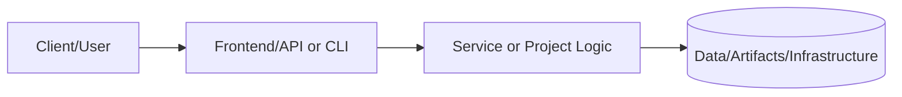
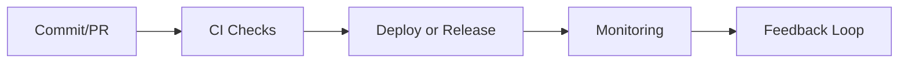

# Enterprise Portfolio Wiki Reference

This page is the external reference for the interactive `EnterpriseWiki` component. Each section includes anchors so that the "View Detailed Guide" and related calls to action in the UI land directly on the matching content. Feel free to skim by role and jump to the week you need.

## System Development Engineer (SDE)

### Week 1: Infrastructure Foundations

**Topics**
- Terraform AWS setup and providers
- VPC design with subnets, route tables, and gateways
- Multi-AZ architecture patterns
- Security groups vs. network ACLs

**Deliverables**
- Complete VPC baseline (subnets, routing, IGW/NAT)
- Hardened bastion host pattern
- Network diagram covering ingress/egress flows
- Security documentation summarizing controls

**Resources**
- AWS VPC design guide (subnetting, routing)
- Terraform AWS provider documentation

### Week 2: Compute & Load Balancing

**Topics**
- EC2 Auto Scaling Groups
- Application Load Balancer configuration
- Launch templates and AMI strategy
- Health checks and scaling policies

**Deliverables**
- Auto Scaling Group sized for the target workload
- ALB with HTTPS termination
- Verified health check endpoints
- Documented scaling rules

**Resources**
- AWS Auto Scaling and ALB documentation
- AMI lifecycle and Packer image guidance

### Week 3: Database & Storage

**Topics**
- RDS PostgreSQL multi-AZ setup
- ElastiCache Redis clusters
- S3 buckets, policies, and lifecycle rules
- Backup and retention strategy

**Deliverables**
- Production-grade database configuration
- Cache cluster tuned for workload needs
- S3 policies for least-privilege access
- Recovery runbooks

**Resources**
- AWS RDS operations handbook
- Redis architecture and failover primer

### Week 4: Container Orchestration

**Topics**
- EKS cluster provisioning
- Managed and self-managed node groups
- Pod security and RBAC controls
- Kubernetes network policies

**Deliverables**
- Production-ready EKS cluster
- RBAC roles for platform and app teams
- Network policies for service isolation
- Security scanning integrated into the pipeline

**Resources**
- EKS best practices guide (security and scaling)
- Kubernetes network policy examples

### Week 5: Monitoring & Observability

**Topics**
- Prometheus federation and scraping
- Grafana dashboards for SLOs
- Alertmanager routing strategies
- Centralized logging pipeline

**Deliverables**
- Monitoring stack with golden signals
- Custom dashboards per service
- Alert rules with on-call runbooks
- Log retention and access controls

**Resources**
- Prometheus alerting and recording rules
- Grafana dashboard design patterns

### Week 6: Event-Driven Architecture

**Topics**
- SQS queues and dead-letter configuration
- SNS topics and subscription fan-out
- EventBridge routing and filtering
- Lambda processors and observability

**Deliverables**
- Message queue topology with DLQs
- Event processing lambdas with metrics
- Dead-letter handling and alerting
- Monitoring integrated into pipelines

**Resources**
- AWS messaging and event-driven reference architectures
- Lambda logging and tracing guides

### Week 7: Disaster Recovery

**Topics**
- Automated backup strategies
- Cross-region replication options
- Failover orchestration
- DR testing and evidence collection

**Deliverables**
- Documented DR plan and RPO/RTO targets
- Automated backups with validation
- Failover runbooks and drills
- Test results with remediation steps

**Resources**
- AWS Backup and cross-region patterns
- Runbook templates for failover testing

### Week 8: Security Hardening

**Topics**
- IAM policies and role scoping
- Secrets management and rotation
- Security scanning in CI/CD
- Compliance checks and audit prep

**Deliverables**
- Security baseline for cloud resources
- Secrets rotation playbooks
- Automated audit reports
- Compliance documentation

**Resources**
- AWS IAM best practices
- Secrets management reference (e.g., AWS Secrets Manager or HashiCorp Vault)

## DevOps Engineer

### Week 1: CI/CD Foundations

**Topics**
- GitHub Actions workflow design
- CI linting, unit testing, and reporting
- Deployment packaging
- Feedback loops and notifications

**Deliverables**
- Baseline CI pipeline with gating
- Automated reporting for builds
- Deployment artifact strategy
- Notification hooks for failures

**Resources**
- GitHub Actions workflow syntax and examples
- Patterns for caching and matrix builds

### Week 2: GitOps & Configuration

**Topics**
- ArgoCD or Flux setup
- Application manifests and Helm charts
- Policy controls for promotions
- Drift detection and alerts

**Deliverables**
- GitOps repo structure
- Promotion policies across environments
- Automated sync and health checks
- Drift detection alarms

**Resources**
- ArgoCD GitOps patterns
- Helm chart testing guides

### Week 3: Container Pipeline

**Topics**
- Container image builds and tagging
- Registry hardening and signing
- SBOM generation and storage
- Vulnerability scanning gates

**Deliverables**
- Hardened container build pipeline
- Signed images pushed to registry
- SBOM published per build
- CVE gate policies enforced

**Resources**
- OCI image signing (cosign) references
- Supply-chain security checklists

### Week 4: Deployment Strategies

**Topics**
- Blue/green and canary releases
- Progressive delivery checks
- Rollback triggers
- Traffic shaping and observability hooks

**Deliverables**
- Deployment strategy templates
- Automated rollback conditions
- Observability dashboards for rollouts
- Runbooks for traffic management

**Resources**
- Argo Rollouts or Flagger documentation
- Canary testing playbooks

### Week 5: Security & Compliance

**Topics**
- SAST/DAST/secret scanning in CI
- Policy-as-code enforcement
- SBOM attestation and publishing
- Audit trails for deployments

**Deliverables**
- Security scanning coverage report
- Policy-as-code checks wired to CI
- SBOM pipeline with signatures
- Deployment audit log and retention

**Resources**
- OWASP CI/CD security guidance
- Policy frameworks (OPA/Conftest) quickstart

### Week 6: Performance & Cost

**Topics**
- Pipeline performance tuning
- Caching and artifact reuse
- Build concurrency and scaling
- Cost tracking and budgets

**Deliverables**
- Tuned pipelines with benchmark results
- Artifact/cache reuse strategy
- Concurrency limits and autoscaling rules
- Cost dashboard with alerts

**Resources**
- GitHub Actions caching patterns
- FinOps quickstart for build pipelines

## QA Engineer III

### Week 1: Test Strategy & Setup

**Topics**
- End-to-end test strategy and scope
- Test data management
- Base framework selection
- CI integration plan

**Deliverables**
- Test strategy document
- Seed data and fixtures
- Framework boilerplate
- CI hooks for smoke tests

**Resources**
- Test pyramid guidance
- Fixture and factory pattern references

### Week 2: API Testing

**Topics**
- REST and GraphQL coverage
- Contract and schema validation
- Negative and edge-case testing
- Mocking upstream/downstream calls

**Deliverables**
- API test suite with coverage report
- Contract tests in CI
- Mock/stub catalog
- Failure analysis checklist

**Resources**
- Postman/Newman or REST Assured examples
- GraphQL testing recipes

### Week 3: E2E & UI Testing

**Topics**
- Cross-browser coverage
- Visual regression testing
- Accessibility checks
- Test flake reduction

**Deliverables**
- E2E suite running in CI
- Visual regression baselines
- Accessibility report
- Flake triage runbook

**Resources**
- Cypress/Playwright starter suites
- A11y tooling (axe-core) documentation

### Week 4: Performance Testing

**Topics**
- Load and stress test design
- Baseline vs. spike testing
- Bottleneck analysis
- CI thresholds and alerting

**Deliverables**
- Load test scripts and datasets
- Performance baseline report
- Regression thresholds in CI
- Tuning recommendations

**Resources**
- k6 or JMeter examples
- Performance budget playbooks

### Week 5: Security Testing

**Topics**
- OWASP Top 10 coverage
- AuthN/AuthZ test cases
- Secrets scanning and dependency checks
- Dynamic testing in CI

**Deliverables**
- Security test catalog mapped to risks
- Automated scans with gating
- Vulnerability triage workflow
- Ticket templates for findings

**Resources**
- OWASP testing guide
- DAST tooling quickstart (e.g., ZAP)

### Week 6: CI/CD Quality Gates

**Topics**
- Gating strategy across environments
- Test parallelization and sharding
- Reporting and dashboards
- Flake management automation

**Deliverables**
- Quality gate matrix
- Parallelized test execution plan
- CI dashboards for quality signals
- Automated flake quarantine

**Resources**
- Test reporting dashboards (Allure, etc.)
- Strategies for parallel and deterministic tests

## Solutions Architect

### Week 1: Architecture Foundations

**Topics**
- Architecture principles and trade-off analysis
- Documentation standards and ADRs
- Threat modeling for designs
- Baseline patterns for reliability and security

**Deliverables**
- Architecture principles tailored to the org
- ADR templates and first decisions
- Initial threat model diagrams
- Pattern catalog starter

**Resources**
- Architecture Decision Record (ADR) templates
- Threat modeling guides (STRIDE, LINDDUN)

### Week 2: Microservices Design

**Topics**
- Service boundaries and domain modeling
- API gateway patterns
- Service discovery and contracts
- Observability for microservices

**Deliverables**
- Service decomposition document
- API gateway blueprint
- Contract testing approach
- Observability plan per service

**Resources**
- Domain-driven design summaries
- API gateway and service mesh comparisons

### Week 3: Data Architecture

**Topics**
- Data modeling and storage choices
- Caching, sharding, and replication
- Data pipelines and governance
- Backup, retention, and privacy

**Deliverables**
- Logical/physical data models
- Caching and replication plan
- Data pipeline blueprint
- Governance and retention policies

**Resources**
- Polyglot persistence references
- Data governance checklists

### Week 4: Security Architecture

**Topics**
- Zero-trust access patterns
- Identity and federation
- Encryption in transit/at rest
- Security logging and forensics

**Deliverables**
- Security architecture blueprint
- Identity and access reference flows
- Key management plan
- Security logging standards

**Resources**
- NIST zero-trust architecture guidance
- Cloud KMS and TLS reference designs

### Week 5: Resilience & Reliability

**Topics**
- Circuit breakers and retries
- Chaos and failure injection
- SLOs/SLIs and error budgets
- Degradation and fallback strategies

**Deliverables**
- Resilience patterns documented per service
- Chaos experiment backlog
- SLO/SLI definitions with dashboards
- Fallback plan for critical flows

**Resources**
- Resilience pattern catalogs
- Chaos engineering playbooks

### Week 6: Performance & Scalability

**Topics**
- Caching tiers and CDNs
- Horizontal scaling patterns
- Queuing and backpressure
- Capacity planning and load modeling

**Deliverables**
- Performance baselines and targets
- CDN and caching plan
- Queuing/backpressure design notes
- Capacity model with assumptions

**Resources**
- CDN and caching strategy guides
- Capacity planning worksheets

### Week 7: Cloud Architecture

**Topics**
- Multi-account landing zones
- Networking overlays and connectivity
- Hybrid connectivity (VPN/Direct Connect)
- Observability and governance at scale

**Deliverables**
- Landing zone reference
- Network topology diagrams
- Hybrid connectivity plan
- Governance/monitoring standards

**Resources**
- Cloud landing zone blueprints
- Hybrid networking best practices

### Week 8: Cost Optimization

**Topics**
- FinOps foundations
- Rightsizing and autoscaling
- Purchase options (savings plans/reserved instances)
- Observability tied to cost drivers

**Deliverables**
- Cost optimization backlog
- Rightsizing recommendations
- Savings plan/RI evaluation
- Cost dashboards mapped to services

**Resources**
- FinOps framework overview
- Cost monitoring and tagging standards

---

# 📘 Project README Template (Portfolio Standard)

> **Status key:** 🟢 Done · 🟠 In Progress · 🔵 Planned · 🔄 Recovery/Rebuild · 📝 Documentation Pending

## 🎯 Overview
This README has been expanded to align with the portfolio documentation standard for **Enterprise Wiki**. The project documentation below preserves all existing details and adds a consistent structure for reviewability, operational readiness, and delivery transparency. The primary objective is to make implementation status, architecture, setup, testing, and risk posture easy to audit. Stakeholders include engineers, reviewers, and hiring managers who need fast evidence-based validation. Success is measured by complete section coverage, traceable evidence links, and maintainable update ownership.

### Outcomes
- Consistent documentation quality across the portfolio.
- Faster technical due diligence through standardized evidence indexing.
- Clear status tracking with explicit in-scope and deferred work.

## 📌 Scope & Status

| Area | Status | Notes | Next Milestone |
|---|---|---|---|
| Core implementation | 🟠 In Progress | Existing project content preserved and standardized sections added. | Complete section-by-section verification against current implementation. |
| Ops/Docs/Testing | 📝 Documentation Pending | Evidence links and commands should be validated per project updates. | Refresh command outputs and evidence after next major change. |

> **Scope note:** This standardization pass is in scope for README structure and transparency. Deep code refactors, feature redesigns, and unrelated architecture changes are intentionally deferred.

## 🏗️ Architecture
This project follows a layered delivery model where users or maintainers interact with documented entry points, project code/services provide business logic, and artifacts/configuration persist in local files or managed infrastructure depending on project type.

| Component | Responsibility | Key Interfaces |
|---|---|---|
| Documentation (`README.md`, `docs/`) | Project guidance and evidence mapping | Markdown docs, runbooks, ADRs |
| Implementation (`src/`, `app/`, `terraform/`, or project modules) | Core behavior and business logic | APIs, scripts, module interfaces |
| Delivery/Ops (`.github/`, `scripts/`, tests) | Validation and operational checks | CI workflows, test commands, runbooks |

## 🚀 Setup & Runbook

### Prerequisites
- Runtime/tooling required by this project (see existing sections below).
- Access to environment variables/secrets used by this project.
- Local dependencies (CLI tools, package managers, or cloud credentials).

### Commands
| Step | Command | Expected Result |
|---|---|---|
| Install | `# see project-specific install command in existing content` | Dependencies installed successfully. |
| Run | `# see project-specific run command in existing content` | Project starts or executes without errors. |
| Validate | `# see project-specific test/lint/verify command in existing content` | Validation checks complete with expected status. |

### Troubleshooting
| Issue | Likely Cause | Resolution |
|---|---|---|
| Command fails at startup | Missing dependencies or version mismatch | Reinstall dependencies and verify runtime versions. |
| Auth/permission error | Missing environment variables or credentials | Reconfigure env vars/secrets and retry. |
| Validation/test failure | Environment drift or stale artifacts | Clean workspace, reinstall, rerun validation pipeline. |

## ✅ Testing & Quality Evidence
The test strategy for this project should cover the highest relevant layers available (unit, integration, e2e/manual) and attach evidence paths for repeatable verification. Existing test notes and artifacts remain preserved below.

| Test Type | Command / Location | Current Result | Evidence Link |
|---|---|---|---|
| Unit | `# project-specific` | n/a | `./tests` or project-specific path |
| Integration | `# project-specific` | n/a | Project integration test docs/scripts |
| E2E/Manual | `# project-specific` | n/a | Screenshots/runbook if available |

### Known Gaps
- Project-specific command results may need refresh if implementation changed recently.
- Some evidence links may remain planned until next verification cycle.

## 🔐 Security, Risk & Reliability

| Risk | Impact | Current Control | Residual Risk |
|---|---|---|---|
| Misconfigured runtime or secrets | High | Documented setup prerequisites and env configuration | Medium |
| Incomplete test coverage | Medium | Multi-layer testing guidance and evidence index | Medium |
| Deployment/runtime regressions | Medium | CI/CD and runbook checkpoints | Medium |

### Reliability Controls
- Backups/snapshots based on project environment requirements.
- Monitoring and alerting where supported by project stack.
- Rollback path documented in project runbooks or deployment docs.
- Runbook ownership maintained via documentation freshness policy.

## 🔄 Delivery & Observability

| Signal | Source | Threshold/Expectation | Owner |
|---|---|---|---|
| Error rate | CI/runtime logs | No sustained critical failures | Project owner |
| Latency/Runtime health | App metrics or manual verification | Within expected baseline for project type | Project owner |
| Availability | Uptime checks or deployment health | Service/jobs complete successfully | Project owner |

## 🗺️ Roadmap

| Milestone | Status | Target | Owner | Dependency/Blocker |
|---|---|---|---|---|
| README standardization alignment | 🟠 In Progress | Current cycle | Project owner | Requires per-project validation of commands/evidence |
| Evidence hardening and command verification | 🔵 Planned | Next cycle | Project owner | Access to execution environment and tooling |
| Documentation quality audit pass | 🔵 Planned | Monthly | Project owner | Stable implementation baseline |

## 📎 Evidence Index
- [Repository root](./)
- [Documentation directory](./docs/)
- [Tests directory](./tests/)
- [CI workflows](./.github/workflows/)
- [Project implementation files](./)

## 🧾 Documentation Freshness

| Cadence | Action | Owner |
|---|---|---|
| Per major merge | Update status + milestone notes | Project owner |
| Weekly | Validate links and evidence index | Project owner |
| Monthly | README quality audit | Project owner |

## 11) Final Quality Checklist (Before Merge)

- [ ] Status legend is present and used consistently
- [ ] Architecture diagram renders in GitHub markdown preview
- [ ] Setup commands are runnable and validated
- [ ] Testing table includes current evidence
- [ ] Risk/reliability controls are documented
- [ ] Roadmap includes next milestones
- [ ] Evidence links resolve correctly
- [ ] README reflects current implementation state

