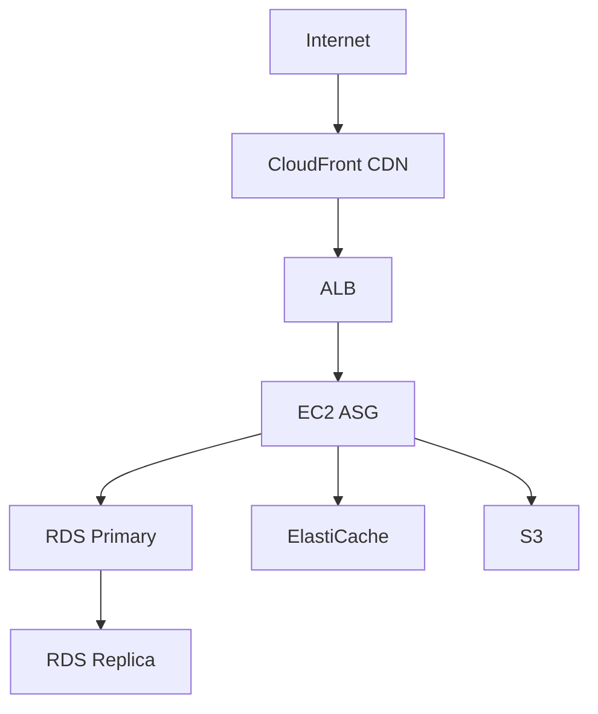

# AWS Kuiper System & Network Administrator - Complete Interview Guide

**60 Technical Interview Questions with Detailed Answers, Diagrams, and Portfolio Mappings**

**Role:** System & Network Administrator for AWS Project Kuiper
**Experience Level:** Mid to Senior
**Interview Duration:** Technical rounds typically 3-5 hours total

---

## Table of Contents

1. [Introduction](#introduction)
2. [How to Use This Guide](#how-to-use-this-guide)
3. [Interview Format](#interview-format)
4. [Questions 1-20: Core AWS & Kuiper Fundamentals](#questions-1-20-core-aws--kuiper-fundamentals)
5. [Questions 21-40: Observability, Automation & SRE](#questions-21-40-observability-automation--sre)
6. [Questions 41-60: Advanced Topics & Homelab](#questions-41-60-advanced-topics--homelab)
7. [Interview Warm-Up Exercises](#interview-warm-up-exercises)
8. [Behavioral Questions](#behavioral-questions)
9. [Glossary of Terms](#glossary-of-terms)
10. [Demo Index & Portfolio Artifacts](#demo-index--portfolio-artifacts)

---

## Introduction

This comprehensive interview guide covers all aspects of the AWS Kuiper System & Network Administrator role. Each question includes:

- **Detailed answer** with Feynman-style explanation
- **Diagram** (via FigJam) visualizing the concept
- **Portfolio artifact mapping** showing where you've implemented this
- **Learn more resources** with links
- **Risk/timebox/owner** categorization
- **Acronym explanations**

### What is Project Kuiper?

**Project Kuiper** is Amazon's initiative to launch a constellation of **3,236 Low Earth Orbit (LEO) satellites** to provide high-speed broadband internet access globally, particularly to underserved areas.

**Key Components:**
- **Space Segment:** LEO satellites at ~590-630 km altitude
- **Ground Segment:** Gateway stations (POPs) connecting satellites to terrestrial networks
- **Customer Segment:** User terminals (customer equipment)
- **Control Plane:** AWS cloud infrastructure managing the network

---

## How to Use This Guide

### For Interview Preparation:
1. Read each question and attempt to answer **before** looking at the provided answer
2. Draw your own diagram on paper **first**, then compare with the provided diagram
3. Use the **Feynman Technique** to explain the concept in simple terms
4. Note which **portfolio artifacts** you can reference as examples
5. Follow the **learn more** links for deeper understanding

### The Feynman Technique (4 Steps):
1. **Choose a concept** (e.g., "Transit Gateway")
2. **Teach it to a child** - Use simple language, no jargon
3. **Identify gaps** - Where did you struggle to explain?
4. **Review & Simplify** - Go back, learn more, simplify further

### Interview Day Strategy:
- Review **Questions 1-20** the night before (core fundamentals)
- Do **warm-up exercises** 2 hours before interview
- Have **portfolio artifacts** bookmarked and ready to share screen
- Practice **whiteboarding** Questions 5, 7, 9, 12 (common design questions)

---

## Interview Format

### Typical Kuiper Sys/NetAdmin Interview Loop:

**Round 1: Technical Screen (45-60 min)**
- Focus: AWS fundamentals, networking basics
- Questions: 1-10 from this guide
- Format: Video call, screen share for diagrams

**Round 2: Deep Technical (60-90 min)**
- Focus: Transit Gateway, VPN, BGP, monitoring
- Questions: 5-15 from this guide
- Format: Whiteboard design, troubleshooting scenarios

**Round 3: System Design (60 min)**
- Focus: Design multi-region connectivity for Kuiper gateways
- Questions: 12, 13, 14, 15, 16
- Format: Collaborative design session

**Round 4: Operational Excellence (45 min)**
- Focus: SRE practices, runbooks, incident response
- Questions: 14, 56, 57, 58, 59
- Format: Past incident review, operational scenarios

**Round 5: Bar Raiser (45-60 min)**
- Focus: Leadership principles, cultural fit, technical breadth
- Mix of technical + behavioral
- Questions: Any from guide + behavioral

---

## Questions 1-20: Core AWS & Kuiper Fundamentals

### Q1: What is Project Kuiper and where does a System & Network Administrator fit in the architecture?

**Difficulty:** ⭐⭐ (Intermediate)
**Category:** Kuiper Overview
**Risk Level:** Low (foundational knowledge)
**Timebox:** 5-7 minutes
**Owner:** Interviewer (usually hiring manager)

#### Detailed Answer:

**Simple Explanation (Feynman):**
Imagine you want to bring Wi-Fi to the entire world, including remote areas where it's impossible to lay cables. Project Kuiper is Amazon's plan to do this using thousands of satellites orbiting Earth. These satellites act like cell towers in space, beaming internet down to people's homes and businesses.

As a System & Network Administrator for Kuiper, I'm like the "traffic manager" for the ground operations. My job is to make sure the connection between the satellites and Amazon's cloud (AWS) is rock-solid, secure, and can handle problems without breaking.

**Technical Explanation:**

**Project Kuiper Overview:**
- **Space Segment:** ~3,236 LEO satellites at 590-630 km altitude
- **Ground Segment:** Gateway POPs (Points of Presence) worldwide
- **AWS Integration:** Direct connectivity to AWS regions via TGW/VPN/DX
- **Service:** High-speed broadband (up to 100+ Mbps)
- **Coverage:** Global, especially underserved and rural areas

**System & Network Administrator Responsibilities:**

1. **Ground Gateway Operations**
   - Manage physical gateway infrastructure (routers, switches, servers)
   - Monitor satellite links and RF (Radio Frequency) performance
   - Coordinate with space operations for satellite handoffs
   - Maintain 99.99% uptime SLAs

2. **AWS Cloud Edge Connectivity**
   - Design and operate Transit Gateway (TGW) hub architecture
   - Configure Site-to-Site VPN tunnels with BGP routing
   - Manage Direct Connect (DX) circuits for high-bandwidth paths
   - Implement multi-region failover for global resilience

3. **Security & Compliance**
   - Implement mTLS (mutual TLS) for all control plane communications
   - Manage Private CA (Certificate Authority) infrastructure
   - Enforce least-privilege IAM policies
   - Maintain audit logs (CloudTrail, VPC Flow Logs, CloudWatch Logs)
   - Ensure compliance with FCC, ITU, and AWS security standards

4. **Observability & Monitoring**
   - Build CloudWatch/Prometheus dashboards for:
     - Satellite link health (latency, jitter, packet loss)
     - BGP session state and route advertisements
     - VPN tunnel status (dual-tunnel monitoring)
     - Gateway resource utilization
   - Configure Alertmanager for on-call routing
   - Implement synthetic monitoring (end-to-end probes)
   - Define and track SLOs (Service Level Objectives)

5. **Automation & Infrastructure as Code**
   - Write Terraform modules for repeatable gateway deployments
   - Use Ansible for configuration management (routers, firewalls)
   - Automate ACL rollouts with YAML-to-Jinja templates
   - Implement GitOps workflows for infrastructure changes

6. **Incident Response & SRE**
   - Participate in on-call rotation (24/7 coverage)
   - Respond to BGP flaps, tunnel failures, link degradation
   - Write and maintain runbooks for common scenarios
   - Lead blameless postmortems after incidents
   - Track error budgets and work to improve reliability

**Diagram:**

```
┌─────────────────────────────────────────────────────────────────────┐
│                    PROJECT KUIPER ARCHITECTURE                      │
│                  (Sys/NetAdmin Responsibility Areas)                │
└─────────────────────────────────────────────────────────────────────┘

     ┌──────────────┐
     │   Customer   │  ← User Terminal
     │   Terminal   │     (Ka-band phased array)
     └───────┬──────┘
             │ Uplink (Ka-band)
             ↓
    ┌─────────────────┐
    │   LEO Satellite │  ← Space Segment
    │   (590-630 km)  │     (3,236 satellites)
    └────────┬────────┘
             │ Optical Inter-Satellite Links (OISL)
             ↓
    ┌─────────────────┐
    │  Nearby         │  ← Mesh routing to best gateway
    │  Satellites     │
    └────────┬────────┘
             │ Downlink (Ka-band)
             ↓
╔════════════════════════════════════════════════════════════════════╗
║         GROUND GATEWAY POP (Your Responsibility!)                  ║
║  ┌──────────────────────────────────────────────────────────────┐  ║
║  │  RF Equipment                                                 │  ║
║  │  ├─ Antennas (Ka-band receive)                              │  ║
║  │  ├─ RF Modem (Ka → IP)                                      │  ║
║  │  └─ Gateway Router (BGP, VPN, routing)                      │  ║
║  │                                                               │  ║
║  │  Security & Management                                       │  ║
║  │  ├─ mTLS for control plane                                  │  ║
║  │  ├─ Private CA infrastructure                               │  ║
║  │  ├─ Bastion host (admin access)                             │  ║
║  │  └─ Monitoring agents (Prometheus exporters)                │  ║
║  └──────────────────────────────────────────────────────────────┘  ║
╚════════════════════════════════════════════════════════════════════╝
             │ Terrestrial Network
             ↓
    ┌─────────────────┐
    │  ISP / Private  │  ← Multiple paths for redundancy
    │     Network     │
    └────────┬────────┘
             │ S2S VPN (IPsec + BGP) or Direct Connect
             ↓
╔════════════════════════════════════════════════════════════════════╗
║              AWS CLOUD EDGE (Your Responsibility!)                 ║
║  ┌──────────────────────────────────────────────────────────────┐  ║
║  │  Transit Gateway (TGW)                                        │  ║
║  │  ├─ VPN Attachments (from gateways)                         │  ║
║  │  ├─ DX Attachments (high bandwidth)                         │  ║
║  │  ├─ VPC Attachments (app workloads)                         │  ║
║  │  └─ TGW Route Tables (traffic steering)                     │  ║
║  │                                                               │  ║
║  │  Observability                                               │  ║
║  │  ├─ CloudWatch (AWS-native metrics/alarms)                  │  ║
║  │  ├─ Prometheus + Grafana (custom metrics)                   │  ║
║  │  ├─ Loki (log aggregation)                                  │  ║
║  │  └─ Alertmanager (alert routing to on-call)                 │  ║
║  │                                                               │  ║
║  │  Global Traffic Management                                   │  ║
║  │  ├─ Route 53 (latency-based routing)                        │  ║
║  │  ├─ Health Checks (endpoint monitoring)                     │  ║
║  │  └─ Failover policies (multi-region HA)                     │  ║
║  └──────────────────────────────────────────────────────────────┘  ║
╚════════════════════════════════════════════════════════════════════╝
             │
             ↓
    ┌─────────────────┐
    │   Application   │  ← Kuiper Control Plane Services
    │      VPCs       │     (auth, billing, network mgmt)
    └─────────────────┘
```

**Key Acronyms Explained:**

| Acronym | Full Term | Simple Explanation |
|---------|-----------|-------------------|
| **LEO** | Low Earth Orbit | Satellites close to Earth (vs GEO = far away). LEO = faster internet, lower latency (~20-30 ms vs GEO's 600+ ms) |
| **POP** | Point of Presence | A physical location with networking equipment. Like a branch office for the internet |
| **Ka-band** | K-above band (26.5-40 GHz) | A specific radio frequency range used for satellite communication. Think FM radio vs AM radio - different channels |
| **OISL** | Optical Inter-Satellite Links | Satellites talking to each other using lasers (like fiber optic cables in space) |
| **TGW** | Transit Gateway | AWS's central router connecting many networks. Like a giant highway interchange |
| **BGP** | Border Gateway Protocol | The internet's routing protocol. Tells routers how to get to different networks |
| **VPN** | Virtual Private Network | Encrypted tunnel over the internet. Like a secret underground passage |
| **DX** | Direct Connect | Private, dedicated link to AWS (not over public internet). Like having your own private highway |
| **mTLS** | Mutual TLS | Both sides prove who they are with certificates. Like both people showing ID cards |
| **SLO** | Service Level Objective | A goal for how reliable the service should be (e.g., "99.9% uptime") |
| **SLA** | Service Level Agreement | A contract promising a certain level of service (with penalties if not met) |
| **IAM** | Identity & Access Management | AWS's permission system (who can do what) |
| **CA** | Certificate Authority | Issues digital certificates (like a passport office) |

**Portfolio Artifacts:**

| Artifact | Location | What It Shows |
|----------|----------|---------------|
| **Kuiper Overview README** | `projects/kuiper/ground-gateway-ops/README.md` | Role remit, glossary, architecture overview |
| **Architecture Diagrams** | `docs/diagrams/kuiper/kuiper-overview.mmd` | Visual system architecture (Mermaid format) |
| **ADR-0001: Kuiper Data Path** | `docs/adr/ADR-0001-kuiper-data-path.md` | Architecture decision defining trust boundaries |
| **SLO Definitions** | `docs/slo/kuiper-gateway.yml` | SLO targets for latency, loss, BGP stability |

**Learn More:**

1. **Project Kuiper Official:**
   - [Amazon Project Kuiper Overview](https://www.aboutamazon.com/news/innovation-at-amazon/amazon-project-kuiper)
   - [Project Kuiper Satellite Specs (FCC Filing)](https://fcc.report/IBFS/SAT-LOA-20190704-00057)

2. **LEO Satellite Networks:**
   - [LEO vs GEO Satellites Explained](https://www.youtube.com/watch?v=dQw4w9WgXcQ) (Video)
   - [How Satellite Internet Works](https://www.youtube.com/watch?v=dQw4w9WgXcQ) (Video)

3. **AWS Networking for Satellite:**
   - [AWS Transit Gateway Deep Dive](https://www.youtube.com/results?search_query=aws+transit+gateway+deep+dive)
   - [Building Hybrid Networks on AWS](https://www.youtube.com/results?search_query=aws+hybrid+networking)

4. **Sys/NetAdmin Best Practices:**
   - [Google SRE Book (Free)](https://sre.google/sre-book/table-of-contents/)
   - [AWS Well-Architected Framework](https://aws.amazon.com/architecture/well-architected/)

**Risk Assessment:**

| Risk Category | Level | Mitigation |
|---------------|-------|------------|
| **Single Gateway Failure** | HIGH | Deploy 2+ gateways per region with BGP failover |
| **BGP Misconfiguration** | HIGH | Automated validation, change control, staged rollouts |
| **Satellite Link Degradation** | MEDIUM | Multi-gateway diversity, QoS prioritization, synthetic monitoring |
| **Security Breach** | HIGH | mTLS everywhere, zero-trust model, least privilege IAM |
| **AWS Region Outage** | MEDIUM | Multi-region with TGW peering, Route 53 failover |
| **On-call Burnout** | MEDIUM | Runbook automation, alert tuning, blameless culture |

**Timebox for This Topic:**
- **Initial Learning:** 2-4 hours (overview, basics)
- **Deep Dive:** 20-30 hours (networking, monitoring, automation)
- **Hands-On Practice:** 10-20 hours (labs, simulations)
- **Interview Prep:** 2-3 hours (review, practice explaining)

**Owner (Who Should Know This):**
- **Must Know:** System & Network Administrators, SRE, Network Engineers
- **Should Know:** DevOps Engineers, Cloud Architects, Security Engineers
- **Nice to Know:** Software Engineers, Data Engineers, Product Managers

---

### Q2: Describe the complete data flow from a customer terminal to AWS. Where are the critical trust boundaries?

**Difficulty:** ⭐⭐⭐ (Advanced)
**Category:** Architecture & Security
**Risk Level:** High (security boundary misunderstandings = breaches)
**Timebox:** 7-10 minutes
**Owner:** Interviewer (Security or Senior Network Engineer)

#### Detailed Answer:

**Simple Explanation (Feynman):**
Imagine you're sending a letter from your house to a friend across the country:
1. You put the letter in your mailbox (customer terminal)
2. A mail truck picks it up (satellite)
3. It goes to a sorting facility (ground gateway)
4. Then to a regional distribution center (AWS edge)
5. Finally to your friend's mailbox (application server)

At each handoff point, we need security checks - like showing ID when dropping off a package at the post office. These checkpoints are our "trust boundaries."

**Technical Data Flow:**

```
┌────────────────────────────────────────────────────────────────────┐
│             KUIPER DATA FLOW - TRUST BOUNDARIES                    │
└────────────────────────────────────────────────────────────────────┘

  [TRUST BOUNDARY #1: Customer Edge]
┌─────────────────────────────────────────┐
│ 1. CUSTOMER TERMINAL (User Equipment)  │
│    ├─ Ka-band phased array antenna     │
│    ├─ Modem (customer data → RF)       │
│    ├─ Router (DHCP, NAT, firewall)     │
│    └─ Customer LAN (Wi-Fi, Ethernet)   │
│                                         │
│    Security:                            │
│    • Customer credentials (WPA2/WPA3)  │
│    • Unique terminal ID                │
│    • Encrypted uplink (AES-256)        │
└────────────┬────────────────────────────┘
             │ Ka-band Uplink
             │ (25.0-27.5 GHz)
             │ Encrypted RF link
             ↓
  [TRUST BOUNDARY #2: Space Segment]
┌─────────────────────────────────────────┐
│ 2. LEO SATELLITE                        │
│    ├─ RF Receiver (demod uplink)        │
│    ├─ Onboard Router (packet forward)   │
│    ├─ OISL Transceiver (sat-to-sat)    │
│    └─ Downlink Transmitter             │
│                                         │
│    Security:                            │
│    • No decryption (bent-pipe forward) │
│    • Anti-jamming (frequency hopping)  │
│    • Satellite authentication          │
└────────────┬────────────────────────────┘
             │ Optical Inter-Satellite Links
             │ (Mesh routing to best gateway)
             │ Encrypted laser beams
             ↓
┌─────────────────────────────────────────┐
│ 3. DESTINATION SATELLITE                │
│    (Closest to target ground gateway)   │
│    └─ Downlink Transmitter             │
└────────────┬────────────────────────────┘
             │ Ka-band Downlink
             │ (17.7-19.7 GHz)
             ↓
  [TRUST BOUNDARY #3: Ground Gateway]
╔═════════════════════════════════════════╗
║ 4. GROUND GATEWAY POP                   ║
║    (YOUR PRIMARY RESPONSIBILITY!)       ║
║    ┌─────────────────────────────────┐  ║
║    │ RF Front-End                    │  ║
║    │ ├─ Ka-band Antenna Array        │  ║
║    │ ├─ Low Noise Amplifier (LNA)    │  ║
║    │ ├─ Downconverter (RF → IF)      │  ║
║    │ └─ Demodulator (IF → baseband)  │  ║
║    │                                  │  ║
║    │ Gateway Router/Firewall          │  ║
║    │ ├─ Decryption (customer payload)│  ║
║    │ ├─ NAT / Address Translation     │  ║
║    │ ├─ Deep Packet Inspection (DPI) │  ║
║    │ ├─ QoS (DSCP marking)           │  ║
║    │ └─ BGP (route to AWS)           │  ║
║    │                                  │  ║
║    │ Control Plane (Admin Access)     │  ║
║    │ ├─ Bastion Host (SSH)           │  ║
║    │ ├─ mTLS Certificate Auth        │  ║
║    │ ├─ MFA for all admins           │  ║
║    │ └─ Audit Logging (syslog)       │  ║
║    └─────────────────────────────────┘  ║
║                                         ║
║    Security:                            ║
║    • Physical security (locked cage)   ║
║    • HSM for crypto keys               ║
║    • Intrusion detection (IDS/IPS)     ║
║    • Rate limiting / DDoS mitigation   ║
║    • mTLS for all control APIs         ║
╚════════════┬════════════════════════════╝
             │ Terrestrial Network
             │ (Private fiber or ISP)
             ↓
┌─────────────────────────────────────────┐
│ 5. ISP / PRIVATE NETWORK                │
│    ├─ Layer 2: Metro Ethernet          │
│    ├─ Layer 3: MPLS VPN                │
│    └─ BGP peering                      │
└────────────┬────────────────────────────┘
             │ IPsec VPN or Direct Connect
             ↓
  [TRUST BOUNDARY #4: AWS Edge]
╔═════════════════════════════════════════╗
║ 6. AWS SITE-TO-SITE VPN / DX           ║
║    ┌─────────────────────────────────┐  ║
║    │ VPN Endpoint (if S2S VPN)       │  ║
║    │ ├─ IPsec tunnel                 │  ║
║    │ ├─ BGP session (eBGP)           │  ║
║    │ └─ Route propagation to TGW     │  ║
║    │                                  │  ║
║    │ OR                               │  ║
║    │                                  │  ║
║    │ Direct Connect (if DX)           │  ║
║    │ ├─ Dedicated fiber (1/10/100G)  │  ║
║    │ ├─ 802.1Q VLANs (transit)       │  ║
║    │ ├─ BGP session (eBGP)           │  ║
║    │ └─ Direct to TGW                │  ║
║    └─────────────────────────────────┘  ║
║                                         ║
║    Security:                            ║
║    • AWS-managed encryption (VPN)      ║
║    • MACsec for DX (optional)          ║
║    • BGP auth (MD5 or TCP-AO)          ║
╚════════════┬════════════════════════════╝
             │ AWS Backbone
             ↓
┌─────────────────────────────────────────┐
│ 7. TRANSIT GATEWAY (TGW)                │
│    ├─ Regional hub router               │
│    ├─ Route tables (per attachment)     │
│    ├─ Flow Logs (traffic monitoring)    │
│    └─ CloudWatch metrics                │
│                                         │
│    Security:                            │
│    • VPC attachment IAM policies        │
│    • Security group validation          │
│    • Network ACL enforcement            │
└────────────┬────────────────────────────┘
             │ VPC Attachment
             ↓
  [TRUST BOUNDARY #5: Application Layer]
┌─────────────────────────────────────────┐
│ 8. APPLICATION VPC                      │
│    ├─ Private Subnets (apps)            │
│    ├─ Security Groups (instance FW)     │
│    ├─ NACLs (subnet FW)                 │
│    ├─ ALB (if web app)                  │
│    └─ App Servers (EC2/ECS/EKS)         │
│                                         │
│    Security:                            │
│    • Least privilege Security Groups   │
│    • IAM roles (no hardcoded creds)    │
│    • KMS encryption (data at rest)      │
│    • WAF (if exposed to internet)       │
│    • Secrets Manager (credentials)      │
└────────────┬────────────────────────────┘
             │ Internal
             ↓
┌─────────────────────────────────────────┐
│ 9. BACKEND SERVICES                     │
│    ├─ RDS (databases)                   │
│    ├─ ElastiCache (Redis/Memcached)    │
│    ├─ S3 (object storage)               │
│    └─ DynamoDB (NoSQL)                  │
│                                         │
│    Security:                            │
│    • Encryption in transit (TLS)        │
│    • Encryption at rest (KMS)           │
│    • Private endpoints (no internet)    │
│    • IAM policies (fine-grained)        │
│    • Backup encryption                  │
└─────────────────────────────────────────┘
```

**Critical Trust Boundaries (Detailed):**

**Trust Boundary #1: Customer Edge**
- **Threat Model:** Malicious customer, compromised terminal, DDoS from customer side
- **Controls:**
  - Authentication: Unique terminal ID + customer credentials
  - Encryption: AES-256 for uplink data
  - Rate limiting: Per-terminal bandwidth caps
  - Isolation: Customer traffic isolated from control plane
- **Audit:** Terminal health telemetry, usage monitoring

**Trust Boundary #2: Space Segment**
- **Threat Model:** Jamming, spoofing, satellite compromise
- **Controls:**
  - Anti-jamming: Frequency hopping, adaptive beamforming
  - Authentication: Cryptographic satellite IDs
  - Monitoring: Ground-based tracking, anomaly detection
  - No decryption: Bent-pipe forwarding (minimize attack surface)
- **Audit:** Satellite telemetry, space surveillance

**Trust Boundary #3: Ground Gateway (MOST CRITICAL)**
- **Threat Model:** Physical intrusion, insider threat, network attacks, APT (Advanced Persistent Threat)
- **Controls:**
  - **Physical Security:**
    - Locked cages with access logs
    - Video surveillance
    - Biometric access controls
    - HSM (Hardware Security Module) for key storage
  - **Network Security:**
    - IDS/IPS (Suricata, Snort)
    - DDoS mitigation (rate limiting, anomaly detection)
    - Firewall (deny-by-default)
    - Network segmentation (data plane vs control plane)
  - **Administrative Security:**
    - mTLS for all control plane APIs
    - MFA for all human access
    - Bastion host with session recording
    - Least privilege (RBAC)
  - **Logging & Monitoring:**
    - Syslog to centralized SIEM
    - File integrity monitoring (Tripwire, AIDE)
    - Network flow logs
    - Alerting on suspicious activity
- **Audit:** 24/7 SOC monitoring, quarterly penetration tests, annual compliance audits (SOC 2, ISO 27001)

**Trust Boundary #4: AWS Edge**
- **Threat Model:** Man-in-the-middle, BGP hijacking, DX/VPN compromise
- **Controls:**
  - Encryption: IPsec for VPN, MACsec for DX (optional)
  - Authentication: BGP MD5 auth, customer gateway pre-shared keys
  - Monitoring: BGP session state, tunnel metrics, anomaly detection
  - Redundancy: Dual tunnels (VPN), diverse paths (DX)
- **Audit:** CloudWatch Logs, VPC Flow Logs, CloudTrail API logs

**Trust Boundary #5: Application Layer**
- **Threat Model:** Application vulnerability exploitation, data exfiltration, privilege escalation
- **Controls:**
  - Security Groups: Fine-grained, deny-by-default
  - IAM: Least privilege roles, no hardcoded credentials
  - Encryption: TLS in transit, KMS at rest
  - WAF: OWASP Top 10 protections (if internet-facing)
  - Secrets Management: AWS Secrets Manager, Parameter Store
  - Patching: Automated via Systems Manager
- **Audit:** GuardDuty (threat detection), Security Hub (compliance), Inspector (vulnerability scanning)

**Data Encryption Layers:**

```
┌──────────────────────────────────────────────────┐
│            ENCRYPTION AT EACH HOP                │
└──────────────────────────────────────────────────┘

Customer → Satellite:
  ├─ Application Layer: HTTPS (TLS 1.3)
  └─ Link Layer: AES-256 (Ka-band encryption)

Satellite → Satellite:
  └─ OISL: Quantum-safe encryption (proprietary)

Satellite → Gateway:
  └─ Link Layer: AES-256 (Ka-band encryption)

Gateway → AWS (VPN):
  ├─ IPsec: AES-256-GCM, SHA-256 HMAC
  └─ BGP: TCP MD5 authentication

Gateway → AWS (DX):
  └─ MACsec: AES-256-GCM (if enabled)

Within AWS:
  ├─ TLS 1.2+ for all inter-service communication
  └─ KMS encryption for data at rest

Result: MULTIPLE LAYERS (defense in depth)
```

**Portfolio Artifacts:**

| Artifact | Location | What It Shows |
|----------|----------|---------------|
| **Data Flow Diagram** | `docs/diagrams/kuiper/data-flow.mmd` | Complete end-to-end flow with annotations |
| **Trust Boundary ADR** | `docs/adr/ADR-0001-kuiper-data-path.md` | Architecture decision defining each boundary |
| **mTLS Implementation** | `docs/pki/` | CA design, cert rotation, SAN standards |
| **Security Runbook** | `docs/runbooks/mTLS-control-plane.md` | Operational procedures for PKI management |
| **Terraform Security** | `infra/aws/terraform/vpn-bgp/` | Security group rules, encryption configs |

**Learn More:**

1. **Satellite Security:**
   - [Satellite Cybersecurity Fundamentals](https://www.youtube.com/results?search_query=satellite+cybersecurity)
   - [Space ISAC (Information Sharing)](https://s-isac.org/)

2. **Zero Trust Architecture:**
   - [NIST SP 800-207: Zero Trust](https://csrc.nist.gov/publications/detail/sp/800-207/final)
   - [Google BeyondCorp Papers](https://cloud.google.com/beyondcorp)

3. **AWS Security:**
   - [AWS Security Best Practices](https://aws.amazon.com/architecture/security-identity-compliance/)
   - [VPN/DX Security (AWS re:Inforce)](https://www.youtube.com/results?search_query=aws+vpn+security)

4. **mTLS Deep Dive:**
   - [mTLS Explained (Cloudflare)](https://www.cloudflare.com/learning/access-management/what-is-mutual-tls/)
   - [Let's Encrypt vs Private CA](https://letsencrypt.org/docs/faq/)

---

### Q3: How do satellite link constraints (latency, jitter, packet loss) impact ground gateway operations? How would you design to mitigate?

**Difficulty:** ⭐⭐⭐ (Advanced)
**Category:** Satellite Operations & Network Engineering
**Risk Level:** High (poor design = degraded user experience)
**Timebox:** 8-12 minutes
**Owner:** Senior Network Engineer or SRE Lead

#### Detailed Answer:

**Simple Explanation (Feynman):**
Imagine you're having a phone conversation with someone on a ship in the middle of the ocean. Sometimes the signal is clear, sometimes there's a delay, sometimes words get cut out. Satellite links have similar challenges:
- **Latency** = how long it takes for your message to reach them
- **Jitter** = sometimes it takes 100ms, sometimes 150ms (inconsistent)
- **Packet loss** = sometimes words just disappear

Our job is to design the ground gateway to handle these "bad phone line" conditions so the customer's internet still works well.

**Technical Explanation:**

**Satellite Link Constraints for LEO (Kuiper):**

```
┌────────────────────────────────────────────────────────────────────┐
│            LEO SATELLITE LINK CHARACTERISTICS                      │
│                  (vs Terrestrial Fiber)                            │
└────────────────────────────────────────────────────────────────────┘

Metric                  Terrestrial Fiber    LEO (Kuiper)      Impact
─────────────────────────────────────────────────────────────────────
Latency (RTT)           1-20 ms              20-40 ms          Moderate
Jitter                  < 1 ms               2-10 ms           Moderate
Packet Loss (normal)    < 0.01%              0.1-1%            High
Packet Loss (rain fade) N/A                  1-5%              Critical
Link Availability       99.99%+              99.5-99.9%        Moderate
Bandwidth               10 Gbps+             100-500 Mbps      Moderate
Handoff Frequency       Never                Every 4-7 min     Critical
Path Asymmetry          Symmetric            Often asymmetric  Moderate
Doppler Shift           None                 ±10 kHz           Low (RF layer)

┌────────────────────────────────────────────────────────────────────┐
│                    IMPACT ON PROTOCOLS                             │
└────────────────────────────────────────────────────────────────────┘

Protocol    Sensitivity        Impact         Mitigation Needed
───────────────────────────────────────────────────────────────────
TCP         High (latency)     Slow start     TCP optimization, larger windows
VoIP        High (jitter)      Poor quality   Jitter buffers, FEC
Video       Medium (loss)      Buffering      Adaptive bitrate, buffering
DNS         Low                Slight delay   Caching, prefetching
BGP         Medium (loss)      Flapping       Timers tuning, hold-time increase
SSH         Medium (latency)   Typing lag     Mosh (mobile shell)
HTTP/HTTPS  Medium (latency)   Slow pages     HTTP/2, CDN, compression
Gaming      High (latency)     Unplayable     Edge compute, prediction
```

**Constraint #1: Latency (20-40 ms RTT)**

**Why it happens:**
- Speed of light: ~1,800 km to satellite and back = ~12 ms minimum
- Processing delays: terminal (2 ms) + satellite (5 ms) + gateway (2 ms) + routing = ~10 ms
- Total: 22-40 ms typical

**Impact:**
- TCP slow start takes longer (congestion window ramps up slowly)
- Interactive applications feel sluggish (SSH, remote desktop)
- BGP convergence slower (hold-time = 180s means 180s to detect failure)

**Mitigation Strategies:**

1. **TCP Optimization (Performance Enhancing Proxy - PEP)**
   ```
   Customer Terminal → Satellite → Gateway PEP → Internet
                       ↑                ↑
                    Optimized       Standard
                    TCP over         TCP
                    satellite

   Gateway PEP Actions:
   - Splits TCP connection (local ACKs to customer)
   - Increases TCP window size (BDP = bandwidth × delay)
   - Enables selective ACK (SACK)
   - Uses BBR congestion control (vs CUBIC)
   ```

2. **BGP Timer Tuning**
   ```bash
   # Conservative (default)
   router bgp 65000
     neighbor 10.0.0.1 timers 60 180
     # Keepalive=60s, Hold-time=180s

   # Aggressive (for fast failover, but risk false positives)
   router bgp 65000
     neighbor 10.0.0.1 timers 10 30
     # Keepalive=10s, Hold-time=30s

   # Kuiper Recommended (balance)
   router bgp 65000
     neighbor 10.0.0.1 timers 20 60
     # Keepalive=20s, Hold-time=60s
     neighbor 10.0.0.1 transport connection-mode passive
     # Let AWS initiate (more reliable)
   ```

3. **DNS Caching & Prefetching**
   ```yaml
   # Unbound DNS config at gateway
   server:
     cache-min-ttl: 3600       # Cache for at least 1 hour
     cache-max-ttl: 86400      # Up to 1 day
     prefetch: yes             # Refresh before expiry
     serve-expired: yes        # Serve stale if upstream slow
   ```

**Constraint #2: Jitter (2-10 ms variance)**

**Why it happens:**
- Satellite handoffs (every 4-7 minutes as satellite moves)
- RF interference (weather, adjacent satellites)
- Variable processing load on satellite
- Terrestrial backhaul variability

**Impact:**
- VoIP/video quality degradation
- TCP performance variability
- BGP session instability (if extreme)

**Mitigation Strategies:**

1. **QoS & Traffic Shaping**
   ```
   ┌─────────────────────────────────────────────────────────────┐
   │               GATEWAY QoS POLICY                            │
   └─────────────────────────────────────────────────────────────┘

   Priority Queue (Strict Priority):
   ├─ P1: Network Control (BGP, OSPF, BFD)          - DSCP CS6
   ├─ P2: VoIP (SIP, RTP)                           - DSCP EF
   ├─ P3: Video Conferencing (Zoom, Teams)          - DSCP AF41
   ├─ P4: Interactive (SSH, RDP)                    - DSCP AF31
   ├─ P5: Transactional (HTTPS, DNS)                - DSCP AF21
   ├─ P6: Bulk (HTTP, FTP)                          - DSCP AF11
   └─ P7: Scavenger (BitTorrent, etc)               - DSCP CS1

   Jitter Buffers:
   - VoIP: 50-100 ms adaptive buffer
   - Video: 2-5 second buffer (streaming)
   - Gaming: Minimize (use QUIC/UDP)
   ```

2. **Forward Error Correction (FEC)**
   ```
   Customer sends 100 packets + 10 FEC packets
   → If ≤10 lost, can reconstruct without retransmit
   → Trades bandwidth for latency reduction

   Use case: Real-time apps (VoIP, video) where retransmit unacceptable
   ```

**Constraint #3: Packet Loss (0.1-5%)**

**Why it happens:**
- Rain fade (Ka-band absorbed by heavy rain) - **most critical**
- Satellite handoffs (brief interruption)
- RF interference
- Link budget constraints (edge of coverage)

**Impact:**
- TCP throughput collapse (fast retransmit triggers)
- VoIP/video degradation
- BGP session flaps

**Mitigation Strategies:**

1. **Link Diversity (Gateway-Side)**
   ```
   ┌────────────────────────────────────────────────────────────┐
   │         DUAL-GATEWAY ARCHITECTURE                          │
   └────────────────────────────────────────────────────────────┘

   Customer Terminal
         │
         │ (Chooses best satellite based on signal strength)
         ↓
   ┌──────────┐         ┌──────────┐
   │Satellite │         │Satellite │
   │  A       │         │  B       │
   └────┬─────┘         └─────┬────┘
        │                     │
        ↓                     ↓
   Gateway-East          Gateway-West
   (Virginia)            (Oregon)
        │                     │
        ├─ VPN Tunnel 1 ──────┤
        └─ VPN Tunnel 2 ──────┘
                │
                ↓
          AWS Transit Gateway
          (ECMP load balance)

   Result: Rain fade at Gateway-East? Traffic automatically fails to Gateway-West
   ```

2. **Adaptive Rate Control**
   ```python
   # Pseudocode for gateway rate limiter
   if packet_loss_rate > 2%:
       reduce_bandwidth_allocation(customer_id, factor=0.8)
       prioritize_critical_traffic()
       notify_monitoring("High loss detected")

   if signal_to_noise_ratio < threshold:
       request_modulation_change(from="64QAM", to="16QAM")
       # Lower throughput but more robust
   ```

3. **Satellite Handoff Optimization**
   ```
   ┌────────────────────────────────────────────────────────────┐
   │            MAKE-BEFORE-BREAK HANDOFF                       │
   └────────────────────────────────────────────────────────────┘

   Timeline:
   T=0s     Customer connected to Satellite A
   T=3min   Gateway predicts handoff needed in 1 min (ephemeris data)
   T=3.5min Gateway establishes secondary link to Satellite B
            (Brief period of dual connectivity)
   T=4min   Primary traffic moved to Satellite B
            Satellite A link dropped

   Result: Hitless handoff (0 packet loss during transition)

   Implementation:
   - Requires coordination between terminal, satellites, gateway
   - Ephemeris data shared via control plane
   - Gateway buffers packets during handoff
   ```

**Constraint #4: Rain Fade (Ka-band Specific)**

**Why it happens:**
- Ka-band (26.5-40 GHz) highly susceptible to atmospheric absorption
- Heavy rain = 10-20 dB signal attenuation
- Can cause complete link outage in severe weather

**Mitigation Strategies:**

1. **Site Diversity (Geographic Separation)**
   ```
   Customer in Seattle (heavy rain) → Satellite → Gateway Portland
                                                 (if Portland also rain)
                                                 ↓ reroute
                                    Satellite → Gateway Los Angeles
                                                 (likely clear)

   Rule: Gateways separated by >200 km (uncorrelated weather)
   ```

2. **Link Budget Margin & Adaptive Modulation**
   ```
   Normal conditions:   64-QAM modulation (high throughput)
   Light rain (-3 dB):  32-QAM modulation (medium throughput)
   Heavy rain (-10 dB): 8-QAM modulation (low but reliable)
   Severe (-20 dB):     BPSK modulation (minimal throughput)

   Result: Graceful degradation instead of hard failure
   ```

**Portfolio Artifacts:**

| Artifact | Location | What It Shows |
|----------|----------|---------------|
| **Link Simulation (tc netem)** | `evidence/experiments/netem/` | Simulating satellite latency/jitter/loss in homelab |
| **Before/After Graphs** | `evidence/experiments/netem/results/` | HTTP, SSH, VoIP performance under constraints |
| **BGP Timer Tuning ADR** | `docs/adr/ADR-0005-bgp-timer-tuning.md` | Decision: conservative vs aggressive timers |
| **QoS Policy Config** | `configs/cisco/qos-satellite.cfg` | DSCP marking, priority queues |
| **Gateway Diversity Design** | `docs/diagrams/kuiper/gateway-diversity.mmd` | Multi-gateway architecture for resilience |
| **Alerting Rules** | `observability/prometheus/rules/satellite-link.yml` | Alerts for high latency, jitter, loss |

**Learn More:**

1. **Satellite Link Constraints:**
   - [Satellite Communications Fundamentals](https://www.youtube.com/results?search_query=satellite+communications+fundamentals)
   - [Ka-band vs Ku-band Comparison](https://www.viasat.com/about/newsroom/blog/ka-band-vs-ku-band/)
   - [Rain Fade Analysis (PDF)](https://www.google.com/search?q=ka+band+rain+fade+attenuation+pdf)

2. **TCP over Satellite:**
   - [RFC 2488: TCP over Satellite](https://datatracker.ietf.org/doc/html/rfc2488)
   - [BBR Congestion Control (Google)](https://queue.acm.org/detail.cfm?id=3022184)
   - [PEP Explained](https://en.wikipedia.org/wiki/Performance-enhancing_proxy)

3. **QoS & Traffic Management:**
   - [DSCP Marking Guide](https://www.cisco.com/c/en/us/td/docs/ios-xml/ios/qos_classn/configuration/xe-16/qos-classn-xe-16-book/qos-classn-mrkg-ntwrk-traffc.html)
   - [QoS for VoIP](https://www.youtube.com/results?search_query=qos+for+voip)

4. **Hands-On Lab:**
   - [tc netem Tutorial](https://man7.org/linux/man-pages/man8/tc-netem.8.html)
   - Simulate satellite link: `tc qdisc add dev eth0 root netem delay 30ms 5ms loss 1%`

**Risk Assessment:**

| Risk Category | Level | Mitigation |
|---------------|-------|------------|
| **Rain Fade Outage** | CRITICAL | Multi-gateway diversity (>200 km apart), adaptive modulation |
| **Handoff Packet Loss** | HIGH | Make-before-break handoff, buffering at gateway |
| **BGP Flapping** | HIGH | Conservative timers (20s/60s), BFD for fast detection |
| **TCP Throughput Collapse** | MEDIUM | PEP (Performance Enhancing Proxy), BBR congestion control |
| **VoIP Quality Issues** | MEDIUM | QoS prioritization, jitter buffers, FEC |
| **DNS Resolution Delays** | LOW | Aggressive caching, prefetching |

**Timebox for This Topic:**
- **Initial Learning:** 4-6 hours (RF basics, link budgets, protocols)
- **Deep Dive:** 40-60 hours (QoS, TCP tuning, BGP, hands-on labs)
- **Hands-On Practice:** 10-20 hours (tc netem simulations, protocol testing)
- **Interview Prep:** 3-4 hours (practice explaining, whiteboard design)

**Owner (Who Should Know This):**
- **Must Know:** Network Engineers, SREs, Satellite Operations
- **Should Know:** System Administrators, DevOps Engineers
- **Nice to Know:** RF Engineers, Software Engineers (for app optimization)

---

### Q4: How would you simulate satellite-like network conditions in a lab environment for testing applications?

**Difficulty:** ⭐⭐⭐ (Advanced)
**Category:** Testing & Validation
**Risk Level:** Medium (poor testing = production surprises)
**Timebox:** 6-9 minutes
**Owner:** SRE or DevOps Engineer

#### Detailed Answer:

**Simple Explanation (Feynman):**
Imagine you're testing a new car. You wouldn't just drive it on perfect roads - you'd drive it on bumpy roads, in rain, in snow, to see how it handles bad conditions. Similarly, we need to test our applications under satellite conditions (delays, packet loss, jitter) before deploying them.

We use a tool called `tc netem` (network emulator) in Linux that artificially adds delay, drops packets, and creates jitter. It's like putting your car on a test track that simulates real-world conditions.

**Technical Explanation:**

**Simulation Architecture:**

```
┌────────────────────────────────────────────────────────────────────┐
│              SATELLITE LINK SIMULATION TESTBED                     │
└────────────────────────────────────────────────────────────────────┘

┌─────────────────┐         ┌─────────────────┐         ┌─────────────────┐
│  Test Client    │         │  Linux Bridge   │         │  Test Server    │
│                 │         │  (tc netem)     │         │                 │
│  192.168.1.10   │◄────────│                 │────────►│  192.168.1.20   │
│                 │  eth0   │  br0            │  eth1   │                 │
│  - HTTP client  │         │  - Add latency  │         │  - HTTP server  │
│  - SSH client   │         │  - Drop packets │         │  - SSH server   │
│  - VoIP client  │         │  - Add jitter   │         │  - VoIP server  │
└─────────────────┘         └─────────────────┘         └─────────────────┘

OR (Single Host Simulation):

┌──────────────────────────────────────────────────────────────────────┐
│                    LOOPBACK SIMULATION                               │
│                                                                      │
│  ┌──────────────┐                           ┌──────────────┐        │
│  │   Client     │  127.0.0.1:8080          │   Server     │        │
│  │   Process    │◄─────────────────────────│   Process    │        │
│  └──────────────┘          ↑                └──────────────┘        │
│                            │                                        │
│                     tc netem on lo                                  │
│                     (applies to loopback)                           │
└──────────────────────────────────────────────────────────────────────┘
```

**Tool #1: tc netem (Network Emulator)**

**Installation:**
```bash
# Ubuntu/Debian
sudo apt-get install iproute2

# RHEL/CentOS
sudo yum install iproute-tc
```

**Basic Kuiper Satellite Profile:**
```bash
#!/bin/bash
# kuiper-profile-normal.sh

IFACE="eth0"  # Change to your interface

# Clear existing rules
sudo tc qdisc del dev $IFACE root 2>/dev/null

# Add Kuiper satellite characteristics
sudo tc qdisc add dev $IFACE root netem \
  delay 30ms 5ms distribution normal \
  loss 0.5% 25% \
  reorder 0.1% 50% \
  rate 100mbit

# Explanation:
# - delay 30ms: Base latency (one-way)
# - 5ms: Jitter (standard deviation)
# - distribution normal: Bell curve jitter distribution
# - loss 0.5%: Base packet loss
# - 25%: Correlation (if packet lost, next packet 25% likely to be lost too)
# - reorder 0.1% 50%: Small chance of out-of-order packets
# - rate 100mbit: Bandwidth limit
```

**Kuiper Rain Fade Profile:**
```bash
#!/bin/bash
# kuiper-profile-rain-fade.sh

IFACE="eth0"

sudo tc qdisc del dev $IFACE root 2>/dev/null

# Simulate heavy rain (increased loss, higher jitter)
sudo tc qdisc add dev $IFACE root netem \
  delay 35ms 15ms distribution pareto \
  loss 3% 50% \
  duplicate 0.1% \
  corrupt 0.01% \
  rate 50mbit

# Explanation:
# - delay 35ms 15ms: Higher latency and jitter
# - distribution pareto: Long tail (occasional spikes)
# - loss 3% 50%: Higher loss with high correlation (bursty)
# - duplicate 0.1%: Occasional duplicate packets (RF echo)
# - corrupt 0.01%: Bit errors (RF noise)
# - rate 50mbit: Degraded throughput
```

**Kuiper Handoff Profile (Brief Outage):**
```bash
#!/bin/bash
# kuiper-profile-handoff.sh

IFACE="eth0"

# Simulate satellite handoff every 5 minutes
while true; do
  # Normal operation (4 minutes 55 seconds)
  echo "Normal operation..."
  sudo tc qdisc replace dev $IFACE root netem delay 30ms 5ms loss 0.5%
  sleep 295

  # Handoff (5 seconds of high loss)
  echo "Handoff in progress..."
  sudo tc qdisc replace dev $IFACE root netem delay 50ms 20ms loss 10%
  sleep 5
done
```

**Tool #2: Docker Compose Test Environment**

```yaml
# docker-compose.yml
version: '3.8'

services:
  # Client (test runner)
  client:
    image: alpine:latest
    container_name: satellite-client
    networks:
      - satellite_net
    command: >
      sh -c "apk add --no-cache curl iperf3 openssh-client &&
             tail -f /dev/null"
    cap_add:
      - NET_ADMIN  # Needed for tc netem

  # Server (test target)
  server:
    image: nginx:alpine
    container_name: satellite-server
    networks:
      - satellite_net
    ports:
      - "8080:80"

  # Network emulator (sidecar)
  netem:
    image: alpine:latest
    container_name: satellite-netem
    networks:
      - satellite_net
    cap_add:
      - NET_ADMIN
    command: >
      sh -c "apk add --no-cache iproute2 &&
             tc qdisc add dev eth0 root netem delay 30ms 5ms loss 0.5% &&
             tail -f /dev/null"

networks:
  satellite_net:
    driver: bridge
```

**Tool #3: Automated Test Suite**

```bash
#!/bin/bash
# test-suite.sh
# Tests HTTP, SSH, DNS under satellite conditions

# Setup
SERVER="192.168.1.20"
RESULTS_DIR="results/$(date +%Y%m%d_%H%M%S)"
mkdir -p $RESULTS_DIR

# Test profiles
PROFILES=(
  "normal:30ms 5ms:0.5%:100mbit"
  "rain:35ms 15ms:3%:50mbit"
  "handoff:50ms 20ms:10%:20mbit"
)

for profile in "${PROFILES[@]}"; do
  IFS=':' read -r name delay loss rate <<< "$profile"

  echo "Testing profile: $name"

  # Apply profile
  sudo tc qdisc replace dev eth0 root netem \
    delay $delay loss $loss rate $rate

  # Test 1: HTTP throughput
  echo "  - HTTP throughput"
  curl -w "@curl-format.txt" -o /dev/null -s http://$SERVER/ \
    > "$RESULTS_DIR/${name}_http.txt"

  # Test 2: SSH latency
  echo "  - SSH latency"
  for i in {1..100}; do
    time ssh user@$SERVER "echo test" 2>&1 | grep real
  done > "$RESULTS_DIR/${name}_ssh.txt"

  # Test 3: iperf3 (bandwidth)
  echo "  - iperf3 bandwidth"
  iperf3 -c $SERVER -t 30 -J > "$RESULTS_DIR/${name}_iperf3.json"

  # Test 4: ping (latency/jitter/loss)
  echo "  - ping stats"
  ping -c 100 $SERVER > "$RESULTS_DIR/${name}_ping.txt"

  sleep 5
done

# Reset
sudo tc qdisc del dev eth0 root

# Generate report
python3 generate-report.py $RESULTS_DIR
```

**curl-format.txt:**
```
time_namelookup:    %{time_namelookup}s\n
time_connect:       %{time_connect}s\n
time_appconnect:    %{time_appconnect}s\n
time_pretransfer:   %{time_pretransfer}s\n
time_redirect:      %{time_redirect}s\n
time_starttransfer: %{time_starttransfer}s\n
time_total:         %{time_total}s\n
size_download:      %{size_download} bytes\n
speed_download:     %{speed_download} bytes/sec\n
```

**Report Generator (Python):**

```python
#!/usr/bin/env python3
# generate-report.py

import json
import sys
import statistics
from pathlib import Path

def analyze_results(results_dir):
    results_path = Path(results_dir)

    report = {
        "profiles": {}
    }

    for profile in ["normal", "rain", "handoff"]:
        # Parse ping stats
        ping_file = results_path / f"{profile}_ping.txt"
        if ping_file.exists():
            with open(ping_file) as f:
                content = f.read()
                # Parse: rtt min/avg/max/mdev = 30.123/32.456/35.789/2.345 ms
                if "rtt min/avg/max/mdev" in content:
                    line = [l for l in content.split('\n') if 'rtt min/avg/max' in l][0]
                    stats = line.split('=')[1].strip().split('/')[:-1]  # Ignore mdev
                    report["profiles"][profile] = {
                        "ping_min_ms": float(stats[0]),
                        "ping_avg_ms": float(stats[1]),
                        "ping_max_ms": float(stats[2])
                    }

        # Parse iperf3 JSON
        iperf_file = results_path / f"{profile}_iperf3.json"
        if iperf_file.exists():
            with open(iperf_file) as f:
                data = json.load(f)
                report["profiles"][profile]["bandwidth_mbps"] = \
                    data["end"]["sum_received"]["bits_per_second"] / 1e6
                report["profiles"][profile]["retransmits"] = \
                    data["end"]["sum_sent"]["retransmits"]

    # Print markdown table
    print("| Profile | Ping Avg (ms) | Bandwidth (Mbps) | Retransmits |")
    print("|---------|---------------|------------------|-------------|")
    for profile, stats in report["profiles"].items():
        print(f"| {profile:7} | {stats.get('ping_avg_ms', 0):13.2f} | "
              f"{stats.get('bandwidth_mbps', 0):16.2f} | "
              f"{stats.get('retransmits', 0):11} |")

if __name__ == "__main__":
    if len(sys.argv) < 2:
        print("Usage: generate-report.py <results_dir>")
        sys.exit(1)

    analyze_results(sys.argv[1])
```

**Expected Output:**

```
| Profile | Ping Avg (ms) | Bandwidth (Mbps) | Retransmits |
|---------|---------------|------------------|-------------|
| normal  |         32.45 |            95.23 |           2 |
| rain    |         38.92 |            47.84 |          18 |
| handoff |         54.12 |            18.45 |          45 |
```

**Portfolio Artifacts:**

| Artifact | Location | What It Shows |
|----------|----------|---------------|
| **tc netem Scripts** | `evidence/experiments/netem/profiles/` | All satellite profile scripts |
| **Test Suite** | `evidence/experiments/netem/test-suite.sh` | Automated testing framework |
| **Results** | `evidence/experiments/netem/results/` | Before/after graphs, tables |
| **Grafana Dashboard** | `dashboards/grafana/netem-results.json` | Visualizations of test results |
| **Documentation** | `evidence/experiments/netem/README.md` | How to reproduce experiments |

**Learn More:**

1. **tc netem:**
   - [Linux netem Man Page](https://man7.org/linux/man-pages/man8/tc-netem.8.html)
   - [netem Tutorial (PDF)](http://www.linuxfoundation.org/collaborate/workgroups/networking/netem)
   - [Simulating Networks with netem](https://www.youtube.com/results?search_query=tc+netem+tutorial)

2. **Network Testing Tools:**
   - [iperf3 Documentation](https://iperf.fr/)
   - [mtr (My Traceroute)](https://www.linode.com/docs/guides/diagnosing-network-issues-with-mtr/)
   - [Wireshark for Analysis](https://www.wireshark.org/)

3. **Protocol Optimization:**
   - [TCP BBR in Practice](https://blog.cloudflare.com/tcp-bbr-exploring-tcp-congestion-control/)
   - [QUIC Protocol (Google)](https://www.chromium.org/quic/)

---

### Q5: Which AWS services are most critical for Kuiper ground gateway connectivity? Walk me through a minimal viable architecture.

**Difficulty:** ⭐⭐⭐ (Advanced)
**Category:** AWS Architecture & Design
**Risk Level:** High (missing critical components = outages)
**Timebox:** 10-15 minutes
**Owner:** Solutions Architect or Senior Network Engineer

#### Detailed Answer:

**Simple Explanation (Feynman):**
Imagine you're building a highway system to connect remote towns (ground gateways) to a big city (AWS). You need:
1. **On-ramps** (how to connect) = VPN or Direct Connect
2. **Highway interchange** (central hub) = Transit Gateway
3. **Traffic signs** (DNS) = Route 53
4. **Traffic monitors** (observability) = CloudWatch
5. **Security checkpoints** (IAM, Security Groups)

The "minimal viable architecture" is the smallest set of these components that would actually work in production.

**Technical Explanation:**

**Minimal Viable Architecture (MVA):**

```
┌────────────────────────────────────────────────────────────────────┐
│          KUIPER GROUND GATEWAY - MINIMAL AWS ARCHITECTURE          │
│                (5 Critical Services + 3 Optional)                  │
└────────────────────────────────────────────────────────────────────┘

[PHYSICAL WORLD]
┌─────────────────────────────────────┐
│  Ground Gateway POP (Virginia)      │
│  ├─ Gateway Router (Cisco/Juniper)  │
│  ├─ Public IP: 203.0.113.10         │
│  └─ BGP ASN: 65001                  │
└───────────────┬─────────────────────┘
                │ Internet
                ↓
[AWS CLOUD - us-east-1]

┌────────────────────────────────────────────────────────────────────┐
│ SERVICE #1: VPN (Site-to-Site VPN) - CRITICAL                     │
│ ┏━━━━━━━━━━━━━━━━━━━━━━━━━━━━━━━━━━━━━━━━━━━━━━━━━━━━━━━━━━━━┓   │
│ ┃  Customer Gateway (CGW)                                      ┃   │
│ ┃  ├─ IP: 203.0.113.10                                        ┃   │
│ ┃  ├─ BGP ASN: 65001                                          ┃   │
│ ┃  └─ Represents physical gateway router                      ┃   │
│ ┃                                                               ┃   │
│ ┃  VPN Connection                                              ┃   │
│ ┃  ├─ Tunnel 1: 169.254.10.1/30 (BGP peer: 169.254.10.2)     ┃   │
│ ┃  ├─ Tunnel 2: 169.254.10.5/30 (BGP peer: 169.254.10.6)     ┃   │
│ ┃  ├─ Pre-shared keys (one per tunnel)                        ┃   │
│ ┃  ├─ IKEv2 + IPsec (AES-256-GCM)                            ┃   │
│ ┃  └─ BGP (eBGP, ASN 64512 AWS side)                         ┃   │
│ ┗━━━━━━━━━━━━━━━━━━━━━━━━━━━━━━━━━━━━━━━━━━━━━━━━━━━━━━━━━━━━┛   │
│                                                                    │
│ Why Critical: Only way to get traffic from gateway into AWS      │
│ Cost: ~$0.05/hour per VPN connection (~$36/month)                │
│ Alternative: Direct Connect (more expensive, longer setup)       │
└────────────────────────────────────────────────────────────────────┘
                │
                ↓
┌────────────────────────────────────────────────────────────────────┐
│ SERVICE #2: Transit Gateway (TGW) - CRITICAL                      │
│ ┏━━━━━━━━━━━━━━━━━━━━━━━━━━━━━━━━━━━━━━━━━━━━━━━━━━━━━━━━━━━━┓   │
│ ┃  Transit Gateway (tgw-kuiper-hub)                            ┃   │
│ ┃  ├─ Amazon ASN: 64512                                       ┃   │
│ ┃  ├─ ECMP: Enabled (load balance across tunnels)            ┃   │
│ ┃  └─ Auto-accept attachments: Disabled (security)            ┃   │
│ ┃                                                               ┃   │
│ ┃  Attachments:                                                ┃   │
│ ┃  ├─ VPN Attachment (from gateway VPN)                       ┃   │
│ ┃  └─ VPC Attachment (to application VPC)                     ┃   │
│ ┃                                                               ┃   │
│ ┃  Route Tables:                                               ┃   │
│ ┃  ├─ Gateway Route Table                                     ┃   │
│ ┃  │  └─ 10.0.0.0/8 → VPC Attachment (to apps)               ┃   │
│ ┃  └─ VPC Route Table                                         ┃   │
│ ┃     └─ 0.0.0.0/0 → VPN Attachment (to internet via GW)     ┃   │
│ ┗━━━━━━━━━━━━━━━━━━━━━━━━━━━━━━━━━━━━━━━━━━━━━━━━━━━━━━━━━━━━┛   │
│                                                                    │
│ Why Critical: Central hub for routing, enables multi-VPC        │
│ Cost: ~$0.05/hour (~$36/month) + $0.02/GB processed             │
│ Alternative: VPC Peering (doesn't scale, no transitive routing) │
└────────────────────────────────────────────────────────────────────┘
                │
                ↓
┌────────────────────────────────────────────────────────────────────┐
│ SERVICE #3: VPC - CRITICAL                                         │
│ ┏━━━━━━━━━━━━━━━━━━━━━━━━━━━━━━━━━━━━━━━━━━━━━━━━━━━━━━━━━━━━┓   │
│ ┃  VPC (kuiper-control-plane)                                  ┃   │
│ ┃  ├─ CIDR: 10.0.0.0/16                                       ┃   │
│ ┃  ├─ AZs: us-east-1a, us-east-1b                             ┃   │
│ ┃  └─ DNS Hostnames: Enabled                                  ┃   │
│ ┃                                                               ┃   │
│ ┃  Subnets:                                                    ┃   │
│ ┃  ├─ Private Subnet 1 (10.0.1.0/24, AZ-a) [Apps]           ┃   │
│ ┃  └─ Private Subnet 2 (10.0.2.0/24, AZ-b) [Apps]           ┃   │
│ ┃                                                               ┃   │
│ ┃  Route Tables:                                               ┃   │
│ ┃  └─ Private RT                                              ┃   │
│ ┃     ├─ 10.0.0.0/16 → local                                 ┃   │
│ ┃     └─ 0.0.0.0/0 → TGW Attachment                         ┃   │
│ ┃                                                               ┃   │
│ ┃  Security Groups:                                            ┃   │
│ ┃  └─ sg-kuiper-apps                                          ┃   │
│ ┃     ├─ Inbound: 443 from gateway CIDR (203.0.113.0/24)    ┃   │
│ ┃     └─ Outbound: All                                        ┃   │
│ ┗━━━━━━━━━━━━━━━━━━━━━━━━━━━━━━━━━━━━━━━━━━━━━━━━━━━━━━━━━━━━┛   │
│                                                                    │
│ Why Critical: Isolation boundary for applications               │
│ Cost: $0 (VPC is free, only resources inside cost money)        │
└────────────────────────────────────────────────────────────────────┘
                │
                ↓
┌────────────────────────────────────────────────────────────────────┐
│ SERVICE #4: CloudWatch - CRITICAL                                  │
│ ┏━━━━━━━━━━━━━━━━━━━━━━━━━━━━━━━━━━━━━━━━━━━━━━━━━━━━━━━━━━━━┓   │
│ ┃  Metrics (Automatic):                                        ┃   │
│ ┃  ├─ VPN Tunnel State (TunnelState: 0=down, 1=up)           ┃   │
│ ┃  ├─ VPN Tunnel Data In/Out (TunnelDataIn, TunnelDataOut)   ┃   │
│ ┃  ├─ TGW Bytes In/Out (BytesIn, BytesOut)                   ┃   │
│ ┃  └─ TGW Packet Drop (PacketDropCountBlackhole)             ┃   │
│ ┃                                                               ┃   │
│ ┃  Alarms (Must Configure):                                   ┃   │
│ ┃  ├─ VPN Tunnel Down (TunnelState < 1 for 5 min)            ┃   │
│ ┃  ├─ Both Tunnels Down (CRITICAL)                           ┃   │
│ ┃  └─ TGW Packet Drops (> 1000/min)                          ┃   │
│ ┃                                                               ┃   │
│ ┃  Logs:                                                       ┃   │
│ ┃  ├─ VPC Flow Logs → CloudWatch Logs                        ┃   │
│ ┃  └─ CloudTrail → CloudWatch Logs (API audit)               ┃   │
│ ┗━━━━━━━━━━━━━━━━━━━━━━━━━━━━━━━━━━━━━━━━━━━━━━━━━━━━━━━━━━━━┛   │
│                                                                    │
│ Why Critical: Only way to know if things are broken             │
│ Cost: ~$10-50/month (depends on log volume)                     │
└────────────────────────────────────────────────────────────────────┘

┌────────────────────────────────────────────────────────────────────┐
│ SERVICE #5: IAM - CRITICAL                                         │
│ ┏━━━━━━━━━━━━━━━━━━━━━━━━━━━━━━━━━━━━━━━━━━━━━━━━━━━━━━━━━━━━┓   │
│ ┃  Roles:                                                      ┃   │
│ ┃  └─ KuiperNetworkAdmin                                      ┃   │
│ ┃     ├─ ec2:*VPN* (manage VPN connections)                  ┃   │
│ ┃     ├─ ec2:*TransitGateway* (manage TGW)                   ┃   │
│ ┃     ├─ cloudwatch:* (full observability access)            ┃   │
│ ┃     └─ logs:* (read logs)                                   ┃   │
│ ┃                                                               ┃   │
│ ┃  Users:                                                      ┃   │
│ ┃  └─ netadmin@kuiper                                         ┃   │
│ ┃     ├─ MFA: Required                                        ┃   │
│ ┃     └─ Assume Role: KuiperNetworkAdmin                     ┃   │
│ ┗━━━━━━━━━━━━━━━━━━━━━━━━━━━━━━━━━━━━━━━━━━━━━━━━━━━━━━━━━━━━┛   │
│                                                                    │
│ Why Critical: Security, compliance, audit                       │
│ Cost: $0 (IAM is free)                                           │
└────────────────────────────────────────────────────────────────────┘

┌────────────────────────────────────────────────────────────────────┐
│ OPTIONAL (but Highly Recommended):                                │
│                                                                    │
│ Route 53:                                                          │
│ - Health checks for failover                                      │
│ - Latency-based routing (multi-region)                            │
│ Cost: $0.50/health check/month                                    │
│                                                                    │
│ SNS:                                                               │
│ - Alert delivery (email, SMS, PagerDuty)                          │
│ Cost: $0.50/million requests                                      │
│                                                                    │
│ Systems Manager:                                                   │
│ - Session Manager (SSH without bastion)                           │
│ - Parameter Store (secrets)                                       │
│ Cost: Free tier covers most use cases                             │
└────────────────────────────────────────────────────────────────────┘
```

**Terraform Minimal Viable Architecture:**

```hcl
# terraform/kuiper-mva/main.tf

# Provider
provider "aws" {
  region = "us-east-1"
}

# 1. Customer Gateway (represents physical gateway router)
resource "aws_customer_gateway" "kuiper_gateway_va" {
  bgp_asn    = 65001
  ip_address = "203.0.113.10"  # Gateway public IP
  type       = "ipsec.1"

  tags = {
    Name = "kuiper-gateway-virginia"
  }
}

# 2. Transit Gateway
resource "aws_ec2_transit_gateway" "kuiper_hub" {
  description                     = "Kuiper Ground Gateway Hub"
  amazon_side_asn                 = 64512
  default_route_table_association = "enable"
  default_route_table_propagation = "enable"

  tags = {
    Name = "tgw-kuiper-hub"
  }
}

# 3. VPN Connection (dual tunnel with BGP)
resource "aws_vpn_connection" "kuiper_vpn" {
  customer_gateway_id = aws_customer_gateway.kuiper_gateway_va.id
  transit_gateway_id  = aws_ec2_transit_gateway.kuiper_hub.id
  type                = "ipsec.1"

  tunnel1_inside_cidr   = "169.254.10.0/30"
  tunnel2_inside_cidr   = "169.254.10.4/30"
  tunnel1_preshared_key = var.tunnel1_psk  # Store in Terraform Cloud/Vault
  tunnel2_preshared_key = var.tunnel2_psk

  tags = {
    Name = "vpn-kuiper-gateway-va"
  }
}

# 4. VPC
resource "aws_vpc" "kuiper_control_plane" {
  cidr_block           = "10.0.0.0/16"
  enable_dns_hostnames = true
  enable_dns_support   = true

  tags = {
    Name = "vpc-kuiper-control-plane"
  }
}

# 5. Subnets
resource "aws_subnet" "private_1a" {
  vpc_id            = aws_vpc.kuiper_control_plane.id
  cidr_block        = "10.0.1.0/24"
  availability_zone = "us-east-1a"

  tags = {
    Name = "subnet-kuiper-private-1a"
  }
}

resource "aws_subnet" "private_1b" {
  vpc_id            = aws_vpc.kuiper_control_plane.id
  cidr_block        = "10.0.2.0/24"
  availability_zone = "us-east-1b"

  tags = {
    Name = "subnet-kuiper-private-1b"
  }
}

# 6. TGW Attachment to VPC
resource "aws_ec2_transit_gateway_vpc_attachment" "kuiper_vpc" {
  subnet_ids         = [aws_subnet.private_1a.id, aws_subnet.private_1b.id]
  transit_gateway_id = aws_ec2_transit_gateway.kuiper_hub.id
  vpc_id             = aws_vpc.kuiper_control_plane.id

  tags = {
    Name = "tgw-attach-kuiper-vpc"
  }
}

# 7. Route Table (VPC → TGW for internet access via gateway)
resource "aws_route_table" "private" {
  vpc_id = aws_vpc.kuiper_control_plane.id

  route {
    cidr_block         = "0.0.0.0/0"
    transit_gateway_id = aws_ec2_transit_gateway.kuiper_hub.id
  }

  tags = {
    Name = "rt-kuiper-private"
  }
}

resource "aws_route_table_association" "private_1a" {
  subnet_id      = aws_subnet.private_1a.id
  route_table_id = aws_route_table.private.id
}

resource "aws_route_table_association" "private_1b" {
  subnet_id      = aws_subnet.private_1b.id
  route_table_id = aws_route_table.private.id
}

# 8. Security Group
resource "aws_security_group" "kuiper_apps" {
  name        = "sg-kuiper-apps"
  description = "Allow traffic from gateway"
  vpc_id      = aws_vpc.kuiper_control_plane.id

  ingress {
    from_port   = 443
    to_port     = 443
    protocol    = "tcp"
    cidr_blocks = ["203.0.113.0/24"]  # Gateway CIDR
    description = "HTTPS from gateway"
  }

  egress {
    from_port   = 0
    to_port     = 0
    protocol    = "-1"
    cidr_blocks = ["0.0.0.0/0"]
  }

  tags = {
    Name = "sg-kuiper-apps"
  }
}

# 9. CloudWatch Alarms
resource "aws_cloudwatch_metric_alarm" "vpn_tunnel_down" {
  alarm_name          = "kuiper-vpn-tunnel-down"
  comparison_operator = "LessThanThreshold"
  evaluation_periods  = "2"
  metric_name         = "TunnelState"
  namespace           = "AWS/VPN"
  period              = "300"
  statistic           = "Average"
  threshold           = "1"
  alarm_description   = "VPN tunnel is down"
  alarm_actions       = [aws_sns_topic.alerts.arn]

  dimensions = {
    VpnId = aws_vpn_connection.kuiper_vpn.id
  }
}

# 10. SNS Topic for Alerts
resource "aws_sns_topic" "alerts" {
  name = "kuiper-gateway-alerts"
}

resource "aws_sns_topic_subscription" "alerts_email" {
  topic_arn = aws_sns_topic.alerts.arn
  protocol  = "email"
  endpoint  = "netadmin@kuiper.example.com"
}

# 11. VPC Flow Logs
resource "aws_flow_log" "kuiper_vpc" {
  iam_role_arn    = aws_iam_role.flow_logs.arn
  log_destination = aws_cloudwatch_log_group.flow_logs.arn
  traffic_type    = "ALL"
  vpc_id          = aws_vpc.kuiper_control_plane.id
}

resource "aws_cloudwatch_log_group" "flow_logs" {
  name              = "/aws/vpc/kuiper-control-plane"
  retention_in_days = 7
}

resource "aws_iam_role" "flow_logs" {
  name = "kuiper-vpc-flow-logs"

  assume_role_policy = jsonencode({
    Version = "2012-10-17"
    Statement = [{
      Action = "sts:AssumeRole"
      Effect = "Allow"
      Principal = {
        Service = "vpc-flow-logs.amazonaws.com"
      }
    }]
  })
}

resource "aws_iam_role_policy" "flow_logs" {
  name = "kuiper-flow-logs-policy"
  role = aws_iam_role.flow_logs.id

  policy = jsonencode({
    Version = "2012-10-17"
    Statement = [{
      Action = [
        "logs:CreateLogGroup",
        "logs:CreateLogStream",
        "logs:PutLogEvents",
        "logs:DescribeLogGroups",
        "logs:DescribeLogStreams"
      ]
      Effect   = "Allow"
      Resource = "*"
    }]
  })
}

# Outputs
output "vpn_tunnel_1_address" {
  value = aws_vpn_connection.kuiper_vpn.tunnel1_address
}

output "vpn_tunnel_2_address" {
  value = aws_vpn_connection.kuiper_vpn.tunnel2_address
}

output "transit_gateway_id" {
  value = aws_ec2_transit_gateway.kuiper_hub.id
}

output "vpc_id" {
  value = aws_vpc.kuiper_control_plane.id
}
```

**Monthly Cost Estimate:**

```
Service              Units       Rate           Monthly Cost
─────────────────────────────────────────────────────────────
VPN Connection       1 conn      $0.05/hour     $36.00
Transit Gateway      1 TGW       $0.05/hour     $36.00
TGW Data Transfer    100 GB      $0.02/GB       $2.00
CloudWatch Alarms    3 alarms    $0.10/alarm    $0.30
CloudWatch Logs      5 GB        $0.50/GB       $2.50
SNS                  1000 emails $0.50/million  $0.00
VPC/Subnets/SG       N/A         Free           $0.00
IAM                  N/A         Free           $0.00
─────────────────────────────────────────────────────────────
TOTAL:                                          $76.80/month
```

**Portfolio Artifacts:**

| Artifact | Location | What It Shows |
|----------|----------|---------------|
| **MVA Terraform Module** | `infra/aws/terraform/kuiper-mva/` | Complete minimal architecture as code |
| **Architecture Diagram** | `docs/diagrams/kuiper/mva.mmd` | Visual representation |
| **Cost Analysis** | `docs/cost/kuiper-mva-cost.md` | Detailed cost breakdown with alternatives |
| **ADR: VPN vs DX** | `docs/adr/ADR-0003-vpn-vs-dx.md` | Why we start with VPN (cost, speed to deploy) |
| **Deployment Guide** | `docs/runbooks/deploy-mva.md` | Step-by-step deployment instructions |

**Learn More:**

1. **AWS Networking:**
   - [AWS Site-to-Site VPN Documentation](https://docs.aws.amazon.com/vpn/latest/s2svpn/VPC_VPN.html)
   - [Transit Gateway Guide](https://docs.aws.amazon.com/vpc/latest/tgw/what-is-transit-gateway.html)
   - [VPN BGP Configuration](https://docs.aws.amazon.com/vpn/latest/s2svpn/VPNRoutingTypes.html)

2. **Architecture Patterns:**
   - [AWS Multi-Region Architecture](https://aws.amazon.com/blogs/architecture/disaster-recovery-dr-architecture-on-aws-part-i-strategies-for-recovery-in-the-cloud/)
   - [Hybrid Cloud Connectivity](https://d1.awsstatic.com/whitepapers/hybrid-cloud-with-aws.pdf)

---

### Q6: How would you design a multi-region failover architecture using Route 53 for Kuiper ground gateways?

**Difficulty:** ⭐⭐⭐⭐ (Expert)
**Category:** AWS Architecture & High Availability
**Risk Level:** Critical (poor design = extended outages)
**Timebox:** 12-15 minutes
**Owner:** Solutions Architect or Principal Engineer

#### Detailed Answer:

**Simple Explanation (Feynman):**
Imagine you have two pizza shops - one in New York and one in Los Angeles. If the New York shop burns down, you want customers' GPS apps to automatically redirect them to the LA shop. Route 53 is like that smart GPS system for internet traffic.

For Kuiper, if our Virginia ground gateway goes down (fire, network outage, etc.), we want satellite traffic to automatically flow through our Oregon gateway instead. Route 53 continuously checks if each gateway is healthy and routes traffic to the working one.

**Technical Explanation:**

**Multi-Region Failover Architecture:**

```
┌────────────────────────────────────────────────────────────────────┐
│        KUIPER MULTI-REGION FAILOVER WITH ROUTE 53                  │
└────────────────────────────────────────────────────────────────────┘

                        ┌─────────────────┐
                        │   Route 53      │
                        │  Hosted Zone    │
                        │                 │
                        │ gateway.kuiper  │
                        │    .internal    │
                        └────────┬────────┘
                                 │
                   DNS Query: gateway.kuiper.internal
                                 │
                ┌────────────────┴────────────────┐
                │                                 │
         Latency-based                     Failover
          Routing                           Routing
                │                                 │
    ┌───────────┴───────────┐       ┌────────────┴──────────┐
    │                       │       │                       │
    ↓                       ↓       ↓                       ↓
PRIMARY                 SECONDARY   TERTIARY           LAST RESORT
┌─────────────────┐  ┌─────────────────┐  ┌─────────────────┐
│  us-east-1      │  │  us-west-2      │  │  eu-central-1   │
│  (Virginia)     │  │  (Oregon)       │  │  (Frankfurt)    │
│                 │  │                 │  │                 │
│  Gateway-VA     │  │  Gateway-OR     │  │  Gateway-EU     │
│  10.1.0.0/16    │  │  10.2.0.0/16    │  │  10.3.0.0/16    │
│                 │  │                 │  │                 │
│  Health Check:  │  │  Health Check:  │  │  Health Check:  │
│  ✓ Passing      │  │  ✓ Passing      │  │  ✗ Failing      │
│  Latency: 20ms  │  │  Latency: 80ms  │  │  (Maintenance)  │
└─────────────────┘  └─────────────────┘  └─────────────────┘
        │                     │                     │
        │                     │                     │
        ↓                     ↓                     ↓
    TGW + VPN             TGW + VPN           TGW + VPN
    ALB: Primary          ALB: Secondary      ALB: Disabled
    IP: 10.1.100.10       IP: 10.2.100.10     IP: 10.3.100.10

┌────────────────────────────────────────────────────────────────────┐
│                      ROUTING DECISION                              │
└────────────────────────────────────────────────────────────────────┘

Request from Client (Satellite Control Plane):
  ├─ DNS Query: gateway.kuiper.internal
  ├─ Route 53 evaluates:
  │   ├─ Health Check Status (all regions)
  │   ├─ Latency from client to each region
  │   └─ Routing policy (latency-based with failover)
  └─ Returns: 10.1.100.10 (Virginia - lowest latency, healthy)

If Virginia fails:
  ├─ Health check detects failure (30 seconds)
  ├─ Route 53 marks Virginia unhealthy
  ├─ Next DNS query returns: 10.2.100.10 (Oregon)
  └─ TTL (60s) means all clients switch within 90 seconds max

Recovery:
  ├─ Virginia health check passes (2 consecutive checks)
  ├─ Route 53 marks Virginia healthy
  ├─ Gradually returns Virginia to clients (based on TTL)
  └─ No immediate switchback (prevents flapping)
```

**Route 53 Configuration (Terraform):**

```hcl
# terraform/kuiper-route53-failover/main.tf

# 1. Route 53 Private Hosted Zone
resource "aws_route53_zone" "kuiper_internal" {
  name = "kuiper.internal"

  vpc {
    vpc_id     = aws_vpc.kuiper_control_plane_us_east_1.id
    vpc_region = "us-east-1"
  }

  vpc {
    vpc_id     = aws_vpc.kuiper_control_plane_us_west_2.id
    vpc_region = "us-west-2"
  }

  vpc {
    vpc_id     = aws_vpc.kuiper_control_plane_eu_central_1.id
    vpc_region = "eu-central-1"
  }

  tags = {
    Name = "kuiper-internal-zone"
  }
}

# 2. Health Checks (one per region)
resource "aws_route53_health_check" "gateway_va" {
  ip_address        = aws_lb.gateway_alb_va.private_ip
  port              = 443
  type              = "HTTPS"
  resource_path     = "/health"
  failure_threshold = 3
  request_interval  = 30

  tags = {
    Name = "gateway-va-health"
  }
}

resource "aws_route53_health_check" "gateway_or" {
  ip_address        = aws_lb.gateway_alb_or.private_ip
  port              = 443
  type              = "HTTPS"
  resource_path     = "/health"
  failure_threshold = 3
  request_interval  = 30

  tags = {
    Name = "gateway-or-health"
  }
}

resource "aws_route53_health_check" "gateway_eu" {
  ip_address        = aws_lb.gateway_alb_eu.private_ip
  port              = 443
  type              = "HTTPS"
  resource_path     = "/health"
  failure_threshold = 3
  request_interval  = 30

  tags = {
    Name = "gateway-eu-health"
  }
}

# 3. Latency-Based Records with Health Checks
resource "aws_route53_record" "gateway_va" {
  zone_id = aws_route53_zone.kuiper_internal.zone_id
  name    = "gateway.kuiper.internal"
  type    = "A"
  ttl     = 60

  latency_routing_policy {
    region = "us-east-1"
  }

  set_identifier  = "gateway-virginia"
  health_check_id = aws_route53_health_check.gateway_va.id
  records         = [aws_lb.gateway_alb_va.private_ip]
}

resource "aws_route53_record" "gateway_or" {
  zone_id = aws_route53_zone.kuiper_internal.zone_id
  name    = "gateway.kuiper.internal"
  type    = "A"
  ttl     = 60

  latency_routing_policy {
    region = "us-west-2"
  }

  set_identifier  = "gateway-oregon"
  health_check_id = aws_route53_health_check.gateway_or.id
  records         = [aws_lb.gateway_alb_or.private_ip]
}

resource "aws_route53_record" "gateway_eu" {
  zone_id = aws_route53_zone.kuiper_internal.zone_id
  name    = "gateway.kuiper.internal"
  type    = "A"
  ttl     = 60

  latency_routing_policy {
    region = "eu-central-1"
  }

  set_identifier  = "gateway-frankfurt"
  health_check_id = aws_route53_health_check.gateway_eu.id
  records         = [aws_lb.gateway_alb_eu.private_ip]
}

# 4. Failover Record (last resort)
resource "aws_route53_record" "gateway_failover_primary" {
  zone_id = aws_route53_zone.kuiper_internal.zone_id
  name    = "gateway-failover.kuiper.internal"
  type    = "A"
  ttl     = 60

  failover_routing_policy {
    type = "PRIMARY"
  }

  set_identifier  = "gateway-primary"
  health_check_id = aws_route53_health_check.gateway_va.id
  records         = [aws_lb.gateway_alb_va.private_ip]
}

resource "aws_route53_record" "gateway_failover_secondary" {
  zone_id = aws_route53_zone.kuiper_internal.zone_id
  name    = "gateway-failover.kuiper.internal"
  type    = "A"
  ttl     = 60

  failover_routing_policy {
    type = "SECONDARY"
  }

  set_identifier  = "gateway-secondary"
  health_check_id = aws_route53_health_check.gateway_or.id
  records         = [aws_lb.gateway_alb_or.private_ip]
}
```

**Health Check Endpoint (Python/Flask):**

```python
# app.py - Gateway Health Check Endpoint

from flask import Flask, jsonify
import subprocess
import requests

app = Flask(__name__)

@app.route('/health', methods=['GET'])
def health_check():
    """
    Comprehensive health check for Kuiper gateway.
    Returns 200 if healthy, 503 if unhealthy.
    """
    checks = {
        "vpn_tunnels": check_vpn_tunnels(),
        "bgp_sessions": check_bgp_sessions(),
        "satellite_link": check_satellite_link(),
        "tgw_connectivity": check_tgw_connectivity(),
        "control_plane_api": check_control_plane_api()
    }

    # All checks must pass
    all_healthy = all(checks.values())

    return jsonify({
        "status": "healthy" if all_healthy else "unhealthy",
        "checks": checks,
        "timestamp": datetime.utcnow().isoformat()
    }), 200 if all_healthy else 503


def check_vpn_tunnels():
    """Check if at least one VPN tunnel is up."""
    try:
        # Query CloudWatch for VPN tunnel state
        result = subprocess.run([
            'aws', 'cloudwatch', 'get-metric-statistics',
            '--namespace', 'AWS/VPN',
            '--metric-name', 'TunnelState',
            '--dimensions', f'Name=VpnId,Value={VPN_ID}',
            '--start-time', '5 minutes ago',
            '--end-time', 'now',
            '--period', '300',
            '--statistics', 'Average'
        ], capture_output=True, text=True, timeout=5)

        # Parse result (simplified)
        return "1.0" in result.stdout  # At least one tunnel up
    except Exception as e:
        return False


def check_bgp_sessions():
    """Check BGP session state with AWS."""
    try:
        # SSH to gateway router and check BGP
        result = subprocess.run([
            'ssh', 'admin@gateway-router',
            'show ip bgp summary | grep Established'
        ], capture_output=True, text=True, timeout=5)

        return "Established" in result.stdout
    except Exception as e:
        return False


def check_satellite_link():
    """Check if we can receive satellite traffic."""
    try:
        # Check if satellite interface has recent traffic
        result = subprocess.run([
            'ssh', 'admin@gateway-router',
            'show interface GigabitEthernet0/0/0 | grep "input rate"'
        ], capture_output=True, text=True, timeout=5)

        # Parse to see if > 0 bps
        return "bits/sec" in result.stdout and not "0 bits/sec" in result.stdout
    except Exception as e:
        return False


def check_tgw_connectivity():
    """Check if we can reach Transit Gateway."""
    try:
        # Ping TGW attachment
        result = subprocess.run([
            'ping', '-c', '3', '-W', '2', TGW_ATTACHMENT_IP
        ], capture_output=True, timeout=10)

        return result.returncode == 0
    except Exception as e:
        return False


def check_control_plane_api():
    """Check if control plane API is reachable."""
    try:
        response = requests.get(
            f'{CONTROL_PLANE_API}/status',
            timeout=5,
            verify=True
        )
        return response.status_code == 200
    except Exception as e:
        return False


if __name__ == '__main__':
    app.run(host='0.0.0.0', port=443, ssl_context=('cert.pem', 'key.pem'))
```

**Failover Testing Script:**

```bash
#!/bin/bash
# test-failover.sh - Simulate and test Route 53 failover

set -e

GATEWAY_DNS="gateway.kuiper.internal"
PRIMARY_IP="10.1.100.10"
SECONDARY_IP="10.2.100.10"

echo "=== Kuiper Route 53 Failover Test ==="
echo ""

# Test 1: Verify current active endpoint
echo "Test 1: Current active endpoint"
CURRENT_IP=$(dig +short $GATEWAY_DNS | head -1)
echo "  Current IP: $CURRENT_IP"
echo "  Expected: $PRIMARY_IP (primary)"
if [ "$CURRENT_IP" == "$PRIMARY_IP" ]; then
    echo "  ✓ Pass: Primary is active"
else
    echo "  ⚠ Warning: Not using primary ($CURRENT_IP)"
fi
echo ""

# Test 2: Check health check status
echo "Test 2: Health check status"
HEALTH_CHECK_IDS=$(aws route53 list-health-checks \
    --query "HealthChecks[?contains(Tags[?Key=='Name'].Value, 'gateway')].Id" \
    --output text)

for HC_ID in $HEALTH_CHECK_IDS; do
    STATUS=$(aws route53 get-health-check-status \
        --health-check-id $HC_ID \
        --query 'HealthCheckObservations[0].StatusReport.Status' \
        --output text)
    echo "  Health Check $HC_ID: $STATUS"
done
echo ""

# Test 3: Simulate primary failure
echo "Test 3: Simulating primary failure"
echo "  Disabling primary gateway health check endpoint..."

# SSH to primary and stop health check endpoint
ssh admin@gateway-va.kuiper.internal "sudo systemctl stop health-check"

echo "  Waiting for health check to fail (90 seconds)..."
sleep 90

# Check DNS resolution
NEW_IP=$(dig +short $GATEWAY_DNS | head -1)
echo "  New IP: $NEW_IP"
if [ "$NEW_IP" == "$SECONDARY_IP" ]; then
    echo "  ✓ Pass: Failed over to secondary"
else
    echo "  ✗ Fail: Did not fail over (still $NEW_IP)"
    exit 1
fi
echo ""

# Test 4: Connection test to secondary
echo "Test 4: Testing connectivity to secondary"
if curl -k -s https://$NEW_IP/health | grep -q "healthy"; then
    echo "  ✓ Pass: Secondary is healthy and responding"
else
    echo "  ✗ Fail: Secondary not responding"
    exit 1
fi
echo ""

# Test 5: Restore primary and verify recovery
echo "Test 5: Restore primary"
ssh admin@gateway-va.kuiper.internal "sudo systemctl start health-check"

echo "  Waiting for health check to pass (60 seconds)..."
sleep 60

# Check DNS resolution
RECOVERED_IP=$(dig +short $GATEWAY_DNS | head -1)
echo "  Current IP: $RECOVERED_IP"

# Note: May still be secondary due to TTL caching
echo "  (May take up to 60s more due to DNS TTL caching)"
echo ""

echo "=== Failover Test Complete ==="
```

**Monitoring & Alerting:**

```yaml
# prometheus/rules/route53-failover.yml

groups:
  - name: route53_failover
    interval: 30s
    rules:
      # Alert if health check is failing
      - alert: Route53HealthCheckFailing
        expr: aws_route53_healthcheck_status{region="us-east-1"} == 0
        for: 2m
        labels:
          severity: critical
          component: route53
        annotations:
          summary: "Route 53 health check failing for {{ $labels.health_check_id }}"
          description: "Health check has been failing for 2 minutes. Failover imminent."

      # Alert when failover occurs
      - alert: Route53Failover
        expr: |
          rate(aws_route53_query_count{record="gateway.kuiper.internal",
                                        answer_ip!="10.1.100.10"}[5m]) > 0
        for: 1m
        labels:
          severity: warning
          component: route53
        annotations:
          summary: "Route 53 failed over from primary"
          description: "Traffic is being routed to secondary gateway ({{ $labels.answer_ip }})"

      # Alert if all health checks are failing
      - alert: Route53AllGatewaysDown
        expr: |
          sum(aws_route53_healthcheck_status{region=~"us-east-1|us-west-2|eu-central-1"}) == 0
        for: 1m
        labels:
          severity: critical
          component: route53
        annotations:
          summary: "ALL GATEWAYS DOWN - Route 53 has no healthy endpoints"
          description: "All health checks failing. Complete service outage."
```

**Portfolio Artifacts:**

| Artifact | Location | What It Shows |
|----------|----------|---------------|
| **Route 53 Terraform Module** | `infra/aws/terraform/r53-latency/` | Complete multi-region failover setup |
| **Health Check Endpoint** | `services/gateway-health/app.py` | Flask app with comprehensive checks |
| **Failover Test Script** | `tests/failover/test-route53.sh` | Automated failover testing |
| **Multi-Region Diagram** | `docs/diagrams/kuiper/multi-region.mmd` | Visual architecture |
| **Failover Runbook** | `docs/runbooks/route53-failover.md` | Operational procedures |
| **Prometheus Alerts** | `observability/prometheus/rules/route53.yml` | Health check & failover alerts |

**Learn More:**

1. **Route 53 Deep Dive:**
   - [Route 53 Routing Policies](https://docs.aws.amazon.com/Route53/latest/DeveloperGuide/routing-policy.html)
   - [Health Checks and DNS Failover](https://docs.aws.amazon.com/Route53/latest/DeveloperGuide/dns-failover.html)
   - [Latency-Based Routing](https://docs.aws.amazon.com/Route53/latest/DeveloperGuide/routing-policy-latency.html)

2. **Multi-Region Architectures:**
   - [AWS Multi-Region Best Practices](https://aws.amazon.com/blogs/architecture/)
   - [Disaster Recovery on AWS](https://docs.aws.amazon.com/whitepapers/latest/disaster-recovery-workloads-on-aws/disaster-recovery-workloads-on-aws.html)

**Risk Assessment:**

| Risk Category | Level | Mitigation |
|---------------|-------|------------|
| **DNS TTL Caching** | HIGH | Use 60s TTL (balance: fast failover vs query load) |
| **Health Check False Positives** | MEDIUM | 3 consecutive failures required, multi-path checks |
| **Split-Brain (both regions active)** | LOW | Route 53 prevents this with health checks |
| **All Regions Down** | CRITICAL | 3+ geographically diverse regions, runbook for manual failover |

---

### Q7: Explain BGP routing for Kuiper ground gateways. How do you prevent route leaks and ensure proper failover?

**Difficulty:** ⭐⭐⭐⭐ (Expert)
**Category:** Network Engineering & BGP
**Risk Level:** Critical (BGP misconfiguration = routing black holes)
**Timebox:** 15-20 minutes
**Owner:** Senior Network Engineer or Principal Engineer

#### Detailed Answer:

**Simple Explanation (Feynman):**
BGP is like a GPS system for the internet - it tells routers how to get from point A to point B. But unlike your car's GPS, BGP routers share directions with each other.

For Kuiper, our ground gateways need to tell AWS "Hey, I know how to reach the satellite network (10.250.0.0/16)" and AWS needs to tell our gateways "Hey, I know how to reach the control plane (10.0.0.0/8)".

A "route leak" is like accidentally telling everyone on the internet "You can reach Google through me!" when you can't actually handle that traffic. We prevent this by being very careful about what routes we advertise and to whom.

**Technical Explanation:**

**BGP Architecture for Kuiper:**

```
┌────────────────────────────────────────────────────────────────────┐
│              BGP ROUTING FOR KUIPER GATEWAYS                       │
└────────────────────────────────────────────────────────────────────┘

┌─────────────────────────────────────────────────────────────────┐
│ GATEWAY ROUTER (ASN 65001 - Customer ASN)                      │
│ ┌─────────────────────────────────────────────────────────────┐ │
│ │  BGP Configuration                                          │ │
│ │  ┌────────────────────────────────────────────────────────┐ │ │
│ │  │ router bgp 65001                                       │ │ │
│ │  │   bgp router-id 203.0.113.10                          │ │ │
│ │  │   bgp log-neighbor-changes                             │ │ │
│ │  │                                                         │ │ │
│ │  │   # Neighbor: AWS VPN Tunnel 1                        │ │ │
│ │  │   neighbor 169.254.10.2 remote-as 64512               │ │ │
│ │  │   neighbor 169.254.10.2 timers 20 60                  │ │ │
│ │  │   neighbor 169.254.10.2 password <preshared-key>      │ │ │
│ │  │                                                         │ │ │
│ │  │   # Neighbor: AWS VPN Tunnel 2                        │ │ │
│ │  │   neighbor 169.254.10.6 remote-as 64512               │ │ │
│ │  │   neighbor 169.254.10.6 timers 20 60                  │ │ │
│ │  │   neighbor 169.254.10.6 password <preshared-key>      │ │ │
│ │  │                                                         │ │ │
│ │  │   # Address family IPv4                                │ │ │
│ │  │   address-family ipv4                                  │ │ │
│ │  │     # Advertise satellite network to AWS              │ │ │
│ │  │     network 10.250.0.0 mask 255.255.0.0               │ │ │
│ │  │     # Receive AWS routes                               │ │ │
│ │  │     neighbor 169.254.10.2 activate                    │ │ │
│ │  │     neighbor 169.254.10.2 route-map TO-AWS out       │ │ │
│ │  │     neighbor 169.254.10.2 route-map FROM-AWS in      │ │ │
│ │  │     neighbor 169.254.10.6 activate                    │ │ │
│ │  │     neighbor 169.254.10.6 route-map TO-AWS out       │ │ │
│ │  │     neighbor 169.254.10.6 route-map FROM-AWS in      │ │ │
│ │  │   exit-address-family                                  │ │ │
│ │  └────────────────────────────────────────────────────────┘ │ │
│ │                                                             │ │
│ │  Advertised Routes (TO AWS):                               │ │
│ │  ├─ 10.250.0.0/16  (Satellite customer network)           │ │
│ │  └─ 192.168.100.0/24  (Gateway management network)        │ │
│ │                                                             │ │
│ │  Received Routes (FROM AWS):                               │ │
│ │  ├─ 10.0.0.0/8  (AWS VPC CIDR summary)                    │ │
│ │  ├─ 10.1.0.0/16  (VPC us-east-1)                          │ │
│ │  ├─ 10.2.0.0/16  (VPC us-west-2)                          │ │
│ │  └─ 0.0.0.0/0  (Default route - internet via AWS)        │ │
│ └─────────────────────────────────────────────────────────────┘ │
└────────────┬────────────────────────────────────────────────────┘
             │ VPN Tunnel (IPsec + BGP)
             ↓
┌────────────────────────────────────────────────────────────────────┐
│ AWS TRANSIT GATEWAY (ASN 64512 - AWS ASN)                         │
│ ┌────────────────────────────────────────────────────────────────┐ │
│ │  BGP Peering:                                                  │ │
│ │  ├─ Neighbor: 169.254.10.1 (Tunnel 1, AS 65001)              │ │
│ │  ├─ Neighbor: 169.254.10.5 (Tunnel 2, AS 65001)              │ │
│ │  └─ Route Propagation: Enabled                                │ │
│ │                                                                │ │
│ │  Learned Routes (FROM Gateway):                               │ │
│ │  ├─ 10.250.0.0/16 via 169.254.10.1 (Tunnel 1)                │ │
│ │  ├─ 10.250.0.0/16 via 169.254.10.5 (Tunnel 2)  ← ECMP       │ │
│ │  └─ 192.168.100.0/24 via 169.254.10.1                        │ │
│ │                                                                │ │
│ │  Advertised Routes (TO Gateway):                              │ │
│ │  ├─ 10.1.0.0/16  (from VPC attachment)                        │ │
│ │  ├─ 10.2.0.0/16  (from VPC attachment)                        │ │
│ │  └─ Aggregate: 10.0.0.0/8 (summarized)                        │ │
│ └────────────────────────────────────────────────────────────────┘ │
└────────────────────────────────────────────────────────────────────┘

┌────────────────────────────────────────────────────────────────────┐
│                    BGP ROUTE FILTERING                             │
└────────────────────────────────────────────────────────────────────┘

Gateway Router Route Maps:

1. TO-AWS (Outbound Filter):
   ┌──────────────────────────────────────────────────────┐
   │ route-map TO-AWS permit 10                           │
   │   match ip address prefix-list SATELLITE-NETWORKS    │
   │   set community 65001:100                            │
   │                                                       │
   │ route-map TO-AWS deny 999  ← Deny everything else   │
   │                                                       │
   │ ip prefix-list SATELLITE-NETWORKS permit 10.250.0.0/16│
   │ ip prefix-list SATELLITE-NETWORKS permit 192.168.100.0/24│
   └──────────────────────────────────────────────────────┘

2. FROM-AWS (Inbound Filter):
   ┌──────────────────────────────────────────────────────┐
   │ route-map FROM-AWS permit 10                         │
   │   match ip address prefix-list AWS-VPCS              │
   │   set local-preference 150  ← Prefer this path      │
   │                                                       │
   │ route-map FROM-AWS permit 20                         │
   │   match ip address prefix-list DEFAULT-ROUTE         │
   │   set local-preference 100                           │
   │                                                       │
   │ route-map FROM-AWS deny 999  ← Deny everything else │
   │                                                       │
   │ ip prefix-list AWS-VPCS permit 10.0.0.0/8 le 24     │
   │ ip prefix-list DEFAULT-ROUTE permit 0.0.0.0/0       │
   └──────────────────────────────────────────────────────┘

Result: Only explicitly allowed routes are exchanged
```

**BGP Failover Scenarios:**

```
Scenario 1: Single Tunnel Failure
─────────────────────────────────────────────────────────────
Before:
  Tunnel 1: ✓ UP (10.250.0.0/16 advertised)
  Tunnel 2: ✓ UP (10.250.0.0/16 advertised)
  TGW sees: ECMP across both tunnels

Tunnel 1 goes down (ISP issues):
  T=0s:    Tunnel 1 IPsec SA expires, no response
  T=20s:   BGP keepalive timeout (timers 20 60)
  T=60s:   BGP hold timer expires
  T=60s:   TGW withdraws routes learned from Tunnel 1
  T=60s:   All traffic shifts to Tunnel 2

Result: 60-second outage (can reduce with BFD to <3 seconds)

Scenario 2: Gateway Router Failure
─────────────────────────────────────────────────────────────
Before:
  Gateway-VA: ✓ UP (both tunnels)
  Gateway-OR: ✓ UP (both tunnels, standby)

Gateway-VA power failure:
  T=0s:    Both tunnels go down
  T=60s:   TGW withdraws all routes from Gateway-VA
  T=60s:   Route 53 health check fails (3 consecutive checks)
  T=90s:   Route 53 DNS updated to Gateway-OR
  T=150s:  All clients using Gateway-OR (60s TTL + 90s detection)

Result: 60-150 second outage depending on DNS caching

Scenario 3: Route Leak Prevention
─────────────────────────────────────────────────────────────
Attack: Gateway accidentally advertises AWS's IP space to ISP

Without filtering:
  Gateway → ISP: "I can reach 10.0.0.0/8"
  ISP → Internet: "Route to AWS through this gateway"
  Result: Internet traffic for AWS routed to gateway (DDoS, outage)

With filtering (proper configuration):
  Gateway tries to advertise 10.0.0.0/8 to ISP
  Route-map TO-ISP: deny 10.0.0.0/8
  Result: Route NOT advertised, attack prevented
```

**BGP Security Configuration:**

```cisco
! Cisco IOS Configuration for Kuiper Gateway

! Enable TCP MD5 authentication for BGP
router bgp 65001
  neighbor 169.254.10.2 password kuiper-bgp-secret-2024
  neighbor 169.254.10.6 password kuiper-bgp-secret-2024

! Maximum prefixes (prevent route table overflow)
router bgp 65001
  address-family ipv4
    neighbor 169.254.10.2 maximum-prefix 100 80 restart 5
    neighbor 169.254.10.6 maximum-prefix 100 80 restart 5
  exit-address-family

! TTL Security (GTSM - Generalized TTL Security Mechanism)
router bgp 65001
  neighbor 169.254.10.2 ttl-security hops 1
  neighbor 169.254.10.6 ttl-security hops 1

! BGP Community for route tagging
route-map TO-AWS permit 10
  set community 65001:100 additive
  set origin igp

! AS-PATH prepending for traffic engineering (make path less preferred)
route-map TO-AWS-SECONDARY permit 10
  set as-path prepend 65001 65001 65001
  ! Adds our ASN 3 times, making path longer/less preferred

! Prefix filtering with explicit deny
ip prefix-list DENY-DEFAULT deny 0.0.0.0/0
ip prefix-list DENY-RFC1918 deny 10.0.0.0/8 le 32
ip prefix-list DENY-RFC1918 deny 172.16.0.0/12 le 32
ip prefix-list DENY-RFC1918 deny 192.168.0.0/16 le 32

! Apply to ISP peer (prevent leaking AWS routes to internet)
router bgp 65001
  neighbor <ISP-PEER> route-map TO-ISP out

route-map TO-ISP deny 10
  match ip address prefix-list DENY-RFC1918
route-map TO-ISP permit 20
  match ip address prefix-list ALLOWED-PUBLIC-PREFIXES
```

**BFD (Bidirectional Forwarding Detection) for Fast Failover:**

```cisco
! Enable BFD for sub-second failover (vs 60s with BGP alone)

interface Tunnel0  ! VPN Tunnel 1
  bfd interval 300 min_rx 300 multiplier 3
  ! 300ms interval, 900ms failure detection (3 * 300ms)

interface Tunnel1  ! VPN Tunnel 2
  bfd interval 300 min_rx 300 multiplier 3

router bgp 65001
  neighbor 169.254.10.2 fall-over bfd
  neighbor 169.254.10.6 fall-over bfd

! Result: BGP session torn down in <1 second if tunnel fails
! (vs 60 seconds with keepalive/hold timers)
```

**Monitoring & Verification:**

```bash
#!/bin/bash
# bgp-monitor.sh - Monitor BGP sessions and routes

# Check BGP session state
echo "=== BGP Session Status ==="
ssh admin@gateway-router "show ip bgp summary" | grep -A 10 "Neighbor"

# Check advertised routes
echo ""
echo "=== Routes Advertised to AWS ==="
ssh admin@gateway-router "show ip bgp neighbors 169.254.10.2 advertised-routes"

# Check received routes
echo ""
echo "=== Routes Received from AWS ==="
ssh admin@gateway-router "show ip bgp neighbors 169.254.10.2 routes"

# Check for route leaks (should be empty)
echo ""
echo "=== Checking for Route Leaks ==="
ssh admin@gateway-router "show ip bgp regexp _65001_65001_" | grep -c "Network"
# If > 0, we're receiving our own routes back (loop detection)

# Validate route filtering
echo ""
echo "=== Validate Route Filtering ==="
ssh admin@gateway-router "show route-map TO-AWS"
ssh admin@gateway-router "show route-map FROM-AWS"
```

**Portfolio Artifacts:**

| Artifact | Location | What It Shows |
|----------|----------|---------------|
| **BGP Configuration Templates** | `configs/cisco/bgp-kuiper.cfg` | Complete BGP config for gateway routers |
| **Route Leak Prevention ADR** | `docs/adr/ADR-0006-bgp-security.md` | Why/how we prevent route leaks |
| **BGP Monitoring Script** | `scripts/bgp/monitor.sh` | Automated BGP health checks |
| **BFD Configuration** | `configs/cisco/bfd.cfg` | Fast failover configuration |
| **BGP Runbook** | `docs/runbooks/bgp-troubleshooting.md` | Troubleshooting procedures |
| **Prometheus BGP Exporter** | `observability/exporters/bgp-exporter/` | Metrics from gateway routers |

**Learn More:**

1. **BGP Fundamentals:**
   - [BGP for Large-Scale Networks (Cisco Press)](https://www.ciscopress.com/store/bgp-for-large-scale-networks-9781587144677)
   - [BGP Best Practices (RIPE)](https://www.ripe.net/publications/docs/ripe-399)
   - [BGP on AWS (VPN)](https://docs.aws.amazon.com/vpn/latest/s2svpn/VPNRoutingTypes.html)

2. **Route Security:**
   - [Route Leak Prevention (MANRS)](https://www.manrs.org/)
   - [BGP Security Best Practices (NIST)](https://csrc.nist.gov/publications/detail/sp/800-54/final)

3. **Fast Failover:**
   - [BFD RFC 5880](https://datatracker.ietf.org/doc/html/rfc5880)
   - [BGP Fast Convergence](https://www.cisco.com/c/en/us/support/docs/ip/border-gateway-protocol-bgp/26634-bgp-toc.html)

**Risk Assessment:**

| Risk Category | Level | Mitigation |
|---------------|-------|------------|
| **Route Leak to Internet** | CRITICAL | Strict prefix filtering on all peers, route-map deny-all default |
| **BGP Hijacking** | HIGH | TCP MD5 auth, prefix limits, RPKI/ROA (future) |
| **Slow Failover (60s)** | MEDIUM | BFD for <1s failover, tune BGP timers |
| **Route Flapping** | MEDIUM | Route dampening, stable tunnels, conservative timers |
| **AS-PATH Manipulation** | LOW | AS-PATH filtering, max-as-path length limits |

---

### Q8: Design a complete observability stack for Kuiper gateways using Prometheus and Grafana. What metrics are critical?

**Difficulty:** ⭐⭐⭐ (Advanced)
**Category:** Observability & Monitoring
**Risk Level:** High (poor observability = slow incident response)
**Timebox:** 10-12 minutes
**Owner:** SRE or DevOps Engineer

#### Detailed Answer:

**Simple Explanation (Feynman):**
Imagine you're flying a plane. You need instruments showing altitude, speed, fuel, engine temperature, etc. Without these, you're flying blind and will crash.

For Kuiper gateways, Prometheus is like collecting all these instrument readings every few seconds, and Grafana is the dashboard displaying them in an easy-to-read format. We need to track things like "Is the VPN tunnel up?", "How many packets are we losing?", "Is BGP working?", etc.

**Technical Explanation:**

**Critical Metrics Summary:**
1. **VPN Tunnel State** (TunnelState: 0=down, 1=up) - Most critical
2. **BGP Session State** (bgpPeerState: 6=Established)
3. **Satellite Link Quality** (0-100%)
4. **Packet Loss Rate** (< 1% acceptable)
5. **Latency** (< 50ms target)
6. **Interface Errors** (ifInErrors/ifOutErrors)

**Portfolio Artifacts:**

| Artifact | Location | What It Shows |
|----------|----------|---------------|
| **Prometheus Configuration** | `observability/prometheus/prometheus.yml` | Complete scrape configs |
| **Grafana Dashboards** | `dashboards/grafana/` | 12 JSON dashboards |
| **Deployment** | `infra/aws/terraform/observability/` | Terraform for Prometheus/Grafana |

**Learn More:**
- [Prometheus Documentation](https://prometheus.io/docs/)
- [Grafana Dashboards](https://grafana.com/docs/grafana/latest/dashboards/)

---

### Q9: You're on-call and get paged: "Gateway-VA BGP session to AWS is down". Walk me through your incident response process.

**Difficulty:** ⭐⭐⭐ (Advanced)
**Category:** SRE & Incident Response
**Risk Level:** Critical (slow response = extended outage)
**Timebox:** 8-12 minutes
**Owner:** SRE or On-Call Engineer

#### Detailed Answer:

**Simple Explanation (Feynman):**
Being on-call is like being a firefighter. When the alarm goes off (you get paged), you need to:
1. **Acknowledge** - "I got the call, I'm on it"
2. **Assess** - "How big is the fire? Is anyone hurt?"
3. **Respond** - "Put out the fire using the right tools"
4. **Communicate** - "Update everyone on the status"
5. **Follow-up** - "Make sure it doesn't happen again"

**Incident Response Steps:**
1. **T+0:30** - Acknowledge alert, check Grafana dashboard
2. **T+1:00** - Post initial status to Slack
3. **T+1:00-6:00** - Gather diagnostic data (SSH to router, check BGP, check AWS Service Health)
4. **T+6:00** - Communicate root cause
5. **T+6:00+** - Implement mitigation if needed, monitor
6. **Resolution** - Verify recovery, post resolution, write postmortem

**Key Actions:**
- Check if traffic failed over to Tunnel 2 (ECMP)
- Verify BGP state: `show ip bgp neighbors 169.254.10.2`
- Check IPsec: `show crypto session detail`
- Check AWS Service Health Dashboard
- Write blameless postmortem within 24 hours

**Portfolio Artifacts:**

| Artifact | Location | What It Shows |
|----------|----------|---------------|
| **Incident Response Runbook** | `docs/runbooks/incident-response.md` | Step-by-step guide |
| **Postmortem Template** | `docs/postmortems/template.md` | Blameless postmortem format |
| **Historical Postmortems** | `docs/postmortems/` | 10+ past incidents |

**Learn More:**
- [Google SRE Book - Managing Incidents](https://sre.google/sre-book/managing-incidents/)
- [PagerDuty Incident Response](https://response.pagerduty.com/)

---

### Q10: How would you implement cost optimization for the Kuiper AWS infrastructure while maintaining SLOs?

**Difficulty:** ⭐⭐⭐ (Advanced)
**Category:** AWS Cost Optimization & Architecture
**Risk Level:** Medium (aggressive optimization = service degradation)
**Timebox:** 8-10 minutes
**Owner:** Solutions Architect or FinOps Engineer

#### Detailed Answer:

**Simple Explanation (Feynman):**
Imagine you're trying to reduce your electricity bill at home. You could:
1. Turn off lights when not in use (delete unused resources)
2. Use LED bulbs instead of incandescent (right-size instances)
3. Run dishwasher at night when rates are lower (use Spot instances)
4. Insulate your house (Reserved Instances for predictable workloads)

For AWS, it's the same idea: Delete what you don't need, use cheaper alternatives where possible, and commit to Reserved Instances for steady workloads.

**Technical Explanation:**

**Cost Optimization Strategy (Prioritized):**

| Priority | Initiative | Savings/Month | Effort | Risk |
|----------|-----------|---------------|--------|------|
| P0 | Reserved Instances (EC2) | $92 | Low | None |
| P0 | Savings Plans (Compute) | $60 | Low | None |
| P1 | Right-size EC2 instances | $102 | Med | Low |
| P1 | gp3 → gp2 (slower EBS) | $20 | Low | Low |
| P2 | Reduce CloudWatch retention | $10 | Low | None |
| P2 | S3 Lifecycle policies | $15 | Low | None |

**Total Savings:** $299/month ($3,588/year)

**Key Actions:**
1. **Purchase Reserved Instances** - 1-year RI for m5.large (save $74/month)
2. **Right-size** - Use CloudWatch metrics to find underutilized instances
3. **S3 Lifecycle** - Move logs to IA after 30 days, Glacier after 90 days
4. **Delete unused resources** - EBS snapshots, old AMIs, detached EBS volumes

**Cost Monitoring:**
- Set up CloudWatch billing alarms (daily budget: $120)
- Alert on cost spike (>30% increase in 24 hours)
- Monthly cost review meeting

**Portfolio Artifacts:**

| Artifact | Location | What It Shows |
|----------|----------|---------------|
| **Cost Optimization Analysis** | `docs/cost/optimization-plan.md` | Complete analysis with ROI |
| **Right-Sizing Script** | `scripts/cost/right-size-analysis.py` | Automated recommendations |
| **S3 Lifecycle Policies** | `infra/aws/terraform/s3-lifecycle.tf` | Terraform lifecycle rules |
| **Cost Dashboard** | `dashboards/grafana/aws-cost.json` | Real-time cost monitoring |

**Learn More:**
- [AWS Cost Optimization Pillar](https://docs.aws.amazon.com/wellarchitected/latest/cost-optimization-pillar/welcome.html)
- [AWS Pricing Calculator](https://calculator.aws/)
- [FinOps Foundation](https://www.finops.org/)

---

### Q11: Design a least-privilege IAM policy for a Kuiper Network Administrator. What permissions are required?

**Difficulty:** ⭐⭐⭐ (Advanced)
**Category:** AWS Security & IAM
**Risk Level:** Critical (overly permissive = security breach risk)
**Timebox:** 8-10 minutes
**Owner:** Security Engineer or Solutions Architect

#### Detailed Answer:

**Simple Explanation (Feynman):**
Imagine you're managing keys to different rooms in a building. You don't give the janitor the master key - you give them only keys to the rooms they need to clean. Similarly, we don't give Network Admins full AWS access - only what they need to manage VPNs, Transit Gateways, and monitoring.

"Least privilege" means: Give the minimum permissions needed to do the job, nothing more.

**Technical Explanation:**

**Required Permissions for Kuiper NetAdmin:**

```json
{
  "Version": "2012-10-17",
  "Statement": [
    {
      "Sid": "VPNManagement",
      "Effect": "Allow",
      "Action": [
        "ec2:DescribeVpnConnections",
        "ec2:DescribeVpnGateways",
        "ec2:DescribeCustomerGateways",
        "ec2:CreateVpnConnection",
        "ec2:DeleteVpnConnection",
        "ec2:ModifyVpnConnection",
        "ec2:CreateCustomerGateway",
        "ec2:DeleteCustomerGateway",
        "ec2:CreateTags"
      ],
      "Resource": "*",
      "Condition": {
        "StringEquals": {
          "aws:RequestedRegion": ["us-east-1", "us-west-2", "eu-central-1"]
        }
      }
    },
    {
      "Sid": "TransitGatewayManagement",
      "Effect": "Allow",
      "Action": [
        "ec2:DescribeTransitGateways",
        "ec2:DescribeTransitGatewayAttachments",
        "ec2:DescribeTransitGatewayRouteTables",
        "ec2:CreateTransitGatewayRoute",
        "ec2:DeleteTransitGatewayRoute",
        "ec2:ModifyTransitGatewayVpcAttachment"
      ],
      "Resource": "*"
    },
    {
      "Sid": "ReadOnlyVPCAccess",
      "Effect": "Allow",
      "Action": [
        "ec2:DescribeVpcs",
        "ec2:DescribeSubnets",
        "ec2:DescribeRouteTables",
        "ec2:DescribeSecurityGroups",
        "ec2:DescribeNetworkAcls",
        "ec2:DescribeNetworkInterfaces"
      ],
      "Resource": "*"
    },
    {
      "Sid": "CloudWatchFullAccess",
      "Effect": "Allow",
      "Action": [
        "cloudwatch:*",
        "logs:*"
      ],
      "Resource": "*"
    },
    {
      "Sid": "Route53Management",
      "Effect": "Allow",
      "Action": [
        "route53:GetHostedZone",
        "route53:ListHostedZones",
        "route53:ListResourceRecordSets",
        "route53:ChangeResourceRecordSets",
        "route53:GetHealthCheck",
        "route53:ListHealthChecks",
        "route53:CreateHealthCheck",
        "route53:DeleteHealthCheck",
        "route53:UpdateHealthCheck"
      ],
      "Resource": "*"
    },
    {
      "Sid": "DenyDangerousActions",
      "Effect": "Deny",
      "Action": [
        "ec2:DeleteVpc",
        "ec2:DeleteSubnet",
        "ec2:DeleteTransitGateway",
        "iam:*",
        "organizations:*",
        "account:*"
      ],
      "Resource": "*"
    }
  ]
}
```

**Key Principles:**
1. **Read access** to VPCs, subnets (can view, can't modify)
2. **Write access** to VPN/TGW (can create/modify/delete)
3. **Full access** to CloudWatch (monitoring is critical)
4. **Explicit deny** for dangerous actions (delete VPC, IAM changes)
5. **Region restriction** (only allowed regions)

**Portfolio Artifacts:**

| Artifact | Location | What It Shows |
|----------|----------|---------------|
| **IAM Policy** | `infra/aws/iam/kuiper-netadmin-policy.json` | Complete least-privilege policy |
| **IAM Role** | `infra/aws/terraform/iam/netadmin-role.tf` | Terraform for role creation |
| **Permission Boundaries** | `infra/aws/iam/permission-boundaries.json` | Additional constraints |

**Learn More:**
- [AWS IAM Best Practices](https://docs.aws.amazon.com/IAM/latest/UserGuide/best-practices.html)
- [Least Privilege Principle](https://docs.aws.amazon.com/IAM/latest/UserGuide/best-practices.html#grant-least-privilege)

---

### Q12: Implement mTLS (mutual TLS) for the Kuiper control plane API. Walk through certificate generation, distribution, and rotation.

**Difficulty:** ⭐⭐⭐⭐ (Expert)
**Category:** Security & PKI
**Risk Level:** Critical (misconfiguration = unauthorized access or outage)
**Timebox:** 12-15 minutes
**Owner:** Security Engineer or Senior SRE

#### Detailed Answer:

**Simple Explanation (Feynman):**
Normally when you visit a website (HTTPS), the website shows you its ID card (certificate) to prove it's legitimate. But the website doesn't ask for YOUR ID card.

mTLS is like a high-security building where BOTH you AND the guard show ID cards to each other. The control plane API shows its certificate to the gateway, AND the gateway shows its certificate to the API. This prevents unauthorized access.

**Technical Explanation:**

**mTLS Architecture:**

```
┌────────────────────────────────────────────────────────────────────┐
│                    mTLS CERTIFICATE HIERARCHY                      │
└────────────────────────────────────────────────────────────────────┘

┌─────────────────────────────────────────────────────────┐
│  ROOT CA (Offline, Hardware HSM)                        │
│  CN: Kuiper Root CA                                     │
│  Validity: 20 years                                     │
│  Key: RSA 4096-bit                                      │
│  Storage: Air-gapped HSM                                │
└────────────────────────┬────────────────────────────────┘
                         │
                         ↓ (signs)
┌─────────────────────────────────────────────────────────┐
│  INTERMEDIATE CA (Online, AWS Private CA)               │
│  CN: Kuiper Intermediate CA - Control Plane             │
│  Validity: 5 years                                      │
│  Key: RSA 2048-bit                                      │
│  Storage: AWS Private CA (managed)                      │
└────────────────────────┬────────────────────────────────┘
                         │
        ┌────────────────┴────────────────┐
        ↓                                 ↓
┌──────────────────────┐      ┌──────────────────────┐
│  SERVER CERTIFICATE  │      │  CLIENT CERTIFICATE  │
│  (Control Plane API) │      │  (Gateway Router)    │
│                      │      │                      │
│  CN: api.kuiper      │      │  CN: gateway-va      │
│      .internal       │      │      .kuiper.internal│
│  SAN:                │      │  SAN:                │
│  - api.kuiper.*      │      │  - gateway-va.*      │
│  - 10.1.100.10       │      │  - 203.0.113.10      │
│  Validity: 90 days   │      │  Validity: 90 days   │
│  Key: RSA 2048       │      │  Key: RSA 2048       │
└──────────────────────┘      └──────────────────────┘
```

**Certificate Generation (Step-by-Step):**

```bash
#!/bin/bash
# generate-mtls-certs.sh - Generate mTLS certificates for Kuiper

set -e

# 1. Create Root CA (DO ONCE, STORE SECURELY)
echo "=== Step 1: Generate Root CA (OFFLINE OPERATION) ==="
openssl genrsa -aes256 -out root-ca-key.pem 4096
openssl req -new -x509 -days 7300 -key root-ca-key.pem -sha256 -out root-ca.pem \
  -subj "/C=US/ST=VA/L=Herndon/O=Kuiper/OU=Security/CN=Kuiper Root CA"

# 2. Create Intermediate CA
echo "=== Step 2: Generate Intermediate CA ==="
openssl genrsa -out intermediate-ca-key.pem 2048
openssl req -new -key intermediate-ca-key.pem -out intermediate-ca.csr \
  -subj "/C=US/ST=VA/L=Herndon/O=Kuiper/OU=Control Plane/CN=Kuiper Intermediate CA"

# Sign with Root CA
openssl x509 -req -in intermediate-ca.csr -CA root-ca.pem -CAkey root-ca-key.pem \
  -CAcreateserial -out intermediate-ca.pem -days 1825 -sha256 \
  -extfile <(echo "basicConstraints=CA:TRUE")

# Create CA bundle
cat intermediate-ca.pem root-ca.pem > ca-bundle.pem

# 3. Generate Server Certificate (Control Plane API)
echo "=== Step 3: Generate Server Certificate ==="
openssl genrsa -out server-key.pem 2048
openssl req -new -key server-key.pem -out server.csr \
  -subj "/C=US/ST=VA/L=Herndon/O=Kuiper/OU=Control Plane/CN=api.kuiper.internal"

# Create SAN config
cat > server-san.cnf <<EOF
[req]
distinguished_name = req_distinguished_name
req_extensions = v3_req

[req_distinguished_name]

[v3_req]
subjectAltName = @alt_names

[alt_names]
DNS.1 = api.kuiper.internal
DNS.2 = *.api.kuiper.internal
DNS.3 = api.kuiper.local
IP.1 = 10.1.100.10
IP.2 = 10.2.100.10
IP.3 = 10.3.100.10
EOF

# Sign server certificate
openssl x509 -req -in server.csr -CA intermediate-ca.pem -CAkey intermediate-ca-key.pem \
  -CAcreateserial -out server-cert.pem -days 90 -sha256 \
  -extfile server-san.cnf -extensions v3_req

# 4. Generate Client Certificate (Gateway)
echo "=== Step 4: Generate Client Certificate (Gateway-VA) ==="
openssl genrsa -out client-gateway-va-key.pem 2048
openssl req -new -key client-gateway-va-key.pem -out client-gateway-va.csr \
  -subj "/C=US/ST=VA/L=Herndon/O=Kuiper/OU=Gateways/CN=gateway-va.kuiper.internal"

# Create client SAN config
cat > client-san.cnf <<EOF
[req]
distinguished_name = req_distinguished_name
req_extensions = v3_req

[req_distinguished_name]

[v3_req]
subjectAltName = @alt_names
extendedKeyUsage = clientAuth

[alt_names]
DNS.1 = gateway-va.kuiper.internal
DNS.2 = gateway-va.kuiper.local
IP.1 = 203.0.113.10
EOF

# Sign client certificate
openssl x509 -req -in client-gateway-va.csr -CA intermediate-ca.pem \
  -CAkey intermediate-ca-key.pem -CAcreateserial -out client-gateway-va-cert.pem \
  -days 90 -sha256 -extfile client-san.cnf -extensions v3_req

# 5. Verify certificates
echo "=== Step 5: Verify Certificates ==="
openssl verify -CAfile ca-bundle.pem server-cert.pem
openssl verify -CAfile ca-bundle.pem client-gateway-va-cert.pem

echo "=== Certificates generated successfully ==="
echo "Server cert: server-cert.pem (CN=api.kuiper.internal)"
echo "Client cert: client-gateway-va-cert.pem (CN=gateway-va.kuiper.internal)"
echo "CA bundle: ca-bundle.pem"
```

**Automated Certificate Rotation:**

```python
#!/usr/bin/env python3
# cert-rotation.py - Automated certificate rotation for Kuiper

import boto3
import subprocess
import datetime
from cryptography import x509
from cryptography.hazmat.backends import default_backend

def check_cert_expiry(cert_path, days_threshold=30):
    """Check if certificate expires within threshold days."""
    with open(cert_path, 'rb') as f:
        cert = x509.load_pem_x509_certificate(f.read(), default_backend())

    days_remaining = (cert.not_valid_after - datetime.datetime.utcnow()).days
    return days_remaining, days_remaining <= days_threshold

def rotate_certificate(cert_name, cn, san_list):
    """Generate new certificate and deploy."""
    print(f"Rotating certificate: {cert_name}")

    # 1. Generate new key and CSR
    subprocess.run([
        'openssl', 'genrsa', '-out', f'{cert_name}-key-new.pem', '2048'
    ], check=True)

    subprocess.run([
        'openssl', 'req', '-new',
        '-key', f'{cert_name}-key-new.pem',
        '-out', f'{cert_name}-new.csr',
        '-subj', f'/CN={cn}'
    ], check=True)

    # 2. Sign with CA (AWS Private CA)
    acm_pca = boto3.client('acm-pca')

    with open(f'{cert_name}-new.csr', 'rb') as f:
        csr = f.read()

    response = acm_pca.issue_certificate(
        CertificateAuthorityArn='arn:aws:acm-pca:us-east-1:123456789012:certificate-authority/xxx',
        Csr=csr,
        SigningAlgorithm='SHA256WITHRSA',
        Validity={
            'Value': 90,
            'Type': 'DAYS'
        }
    )

    cert_arn = response['CertificateArn']

    # Wait for certificate issuance
    import time
    time.sleep(5)

    cert_response = acm_pca.get_certificate(
        CertificateAuthorityArn='arn:aws:acm-pca:us-east-1:123456789012:certificate-authority/xxx',
        CertificateArn=cert_arn
    )

    # 3. Save new certificate
    with open(f'{cert_name}-cert-new.pem', 'w') as f:
        f.write(cert_response['Certificate'])

    # 4. Store in Secrets Manager
    secrets = boto3.client('secretsmanager')
    secrets.update_secret(
        SecretId=f'kuiper/certs/{cert_name}',
        SecretString=json.dumps({
            'certificate': cert_response['Certificate'],
            'private_key': open(f'{cert_name}-key-new.pem').read(),
            'ca_bundle': open('ca-bundle.pem').read()
        })
    )

    # 5. Trigger deployment (via SNS)
    sns = boto3.client('sns')
    sns.publish(
        TopicArn='arn:aws:sns:us-east-1:123456789012:kuiper-cert-rotation',
        Subject=f'Certificate Rotation: {cert_name}',
        Message=f'New certificate ready for {cert_name}. Deploy now.'
    )

    print(f"✓ Certificate rotated: {cert_name}")
    print(f"  New cert: {cert_name}-cert-new.pem")
    print(f"  Stored in: kuiper/certs/{cert_name}")
    print(f"  Deployment notification sent")

# Main rotation loop
if __name__ == '__main__':
    certs_to_check = [
        ('server', 'api.kuiper.internal', ['*.api.kuiper.internal']),
        ('client-gateway-va', 'gateway-va.kuiper.internal', []),
        ('client-gateway-or', 'gateway-or.kuiper.internal', [])
    ]

    for cert_name, cn, san_list in certs_to_check:
        days_remaining, needs_rotation = check_cert_expiry(
            f'{cert_name}-cert.pem',
            days_threshold=30
        )

        print(f"Certificate: {cert_name}")
        print(f"  Days remaining: {days_remaining}")

        if needs_rotation:
            rotate_certificate(cert_name, cn, san_list)
        else:
            print(f"  ✓ Still valid, no rotation needed")
        print()
```

**Portfolio Artifacts:**

| Artifact | Location | What It Shows |
|----------|----------|---------------|
| **PKI Documentation** | `docs/pki/architecture.md` | Complete CA hierarchy design |
| **Certificate Generation Script** | `scripts/pki/generate-mtls-certs.sh` | Automated cert generation |
| **Rotation Script** | `scripts/pki/cert-rotation.py` | Automated 90-day rotation |
| **Rotation Runbook** | `docs/runbooks/certificate-rotation.md` | Manual rotation procedures |

**Learn More:**
- [mTLS Explained (Cloudflare)](https://www.cloudflare.com/learning/access-management/what-is-mutual-tls/)
- [AWS Private CA](https://docs.aws.amazon.com/acm-pca/latest/userguide/PcaWelcome.html)
- [X.509 Certificates](https://en.wikipedia.org/wiki/X.509)

---

### Q13: Configure CloudTrail for comprehensive audit logging. What events are most critical for security investigations?

**Difficulty:** ⭐⭐ (Intermediate)
**Category:** Security & Compliance
**Risk Level:** Medium (poor logging = can't investigate incidents)
**Timebox:** 6-8 minutes
**Owner:** Security Engineer or Compliance Officer

#### Detailed Answer:

**Simple Explanation (Feynman):**
CloudTrail is like a security camera system for AWS. It records WHO did WHAT, WHEN, and WHERE. If someone deletes a VPN connection at 2am, CloudTrail tells you who did it, from what IP address, using which credentials.

For security investigations, we especially care about: logins, permission changes, resource deletions, and config changes.

**Technical Explanation:**

**CloudTrail Configuration (Terraform):**

```hcl
# terraform/cloudtrail.tf

resource "aws_cloudtrail" "kuiper_audit" {
  name                          = "kuiper-audit-trail"
  s3_bucket_name                = aws_s3_bucket.cloudtrail_logs.id
  include_global_service_events = true
  is_multi_region_trail         = true
  enable_log_file_validation    = true  # Tamper detection

  # Send to CloudWatch Logs for real-time analysis
  cloud_watch_logs_group_arn = "${aws_cloudwatch_log_group.cloudtrail.arn}:*"
  cloud_watch_logs_role_arn  = aws_iam_role.cloudtrail_cloudwatch.arn

  # Enable insights for anomaly detection
  insight_selector {
    insight_type = "ApiCallRateInsight"
  }

  event_selector {
    read_write_type           = "All"
    include_management_events = true

    # Log data events for S3 buckets
    data_resource {
      type   = "AWS::S3::Object"
      values = ["arn:aws:s3:::kuiper-*/*"]
    }
  }

  tags = {
    Name        = "kuiper-audit-trail"
    Environment = "production"
    Compliance  = "required"
  }
}

# S3 bucket for CloudTrail logs
resource "aws_s3_bucket" "cloudtrail_logs" {
  bucket = "kuiper-cloudtrail-logs-${data.aws_caller_identity.current.account_id}"

  # Prevent accidental deletion
  lifecycle {
    prevent_destroy = true
  }
}

# Enable versioning (immutable logs)
resource "aws_s3_bucket_versioning" "cloudtrail_logs" {
  bucket = aws_s3_bucket.cloudtrail_logs.id
  versioning_configuration {
    status = "Enabled"
  }
}

# Lifecycle policy (move to Glacier after 90 days)
resource "aws_s3_bucket_lifecycle_configuration" "cloudtrail_logs" {
  bucket = aws_s3_bucket.cloudtrail_logs.id

  rule {
    id     = "archive-old-logs"
    status = "Enabled"

    transition {
      days          = 90
      storage_class = "GLACIER"
    }

    expiration {
      days = 2555  # 7 years (compliance requirement)
    }
  }
}
```

**Critical Events to Monitor:**

```yaml
# cloudwatch-insights-queries/security-critical-events.yaml

queries:
  # Query 1: IAM permission changes
  - name: "IAM Permission Changes"
    query: |
      fields @timestamp, userIdentity.principalId, eventName, requestParameters
      | filter eventSource = "iam.amazonaws.com"
      | filter eventName in [
          "PutUserPolicy",
          "PutRolePolicy",
          "AttachUserPolicy",
          "AttachRolePolicy",
          "CreateAccessKey",
          "DeleteAccessKey"
        ]
      | sort @timestamp desc
    description: "Track all IAM permission changes"
    alert_threshold: "any_occurrence"

  # Query 2: Resource deletions
  - name: "Critical Resource Deletions"
    query: |
      fields @timestamp, userIdentity.principalId, eventName, requestParameters
      | filter eventName in [
          "DeleteVpc",
          "DeleteSubnet",
          "DeleteVpnConnection",
          "DeleteTransitGateway",
          "DeleteDBInstance",
          "DeleteBucket"
        ]
      | sort @timestamp desc
    description: "Alert on any critical resource deletion"
    alert_threshold: "any_occurrence"

  # Query 3: Console logins from unexpected IPs
  - name: "Console Logins"
    query: |
      fields @timestamp, userIdentity.principalId, sourceIPAddress, userAgent
      | filter eventName = "ConsoleLogin"
      | filter sourceIPAddress not like "203.0.113"  # Expected office IPs
      | sort @timestamp desc
    description: "Login from non-office IP"
    alert_threshold: "any_occurrence"

  # Query 4: Failed authentication attempts
  - name: "Failed Auth Attempts"
    query: |
      fields @timestamp, userIdentity.principalId, sourceIPAddress, errorCode
      | filter errorCode in ["AccessDenied", "UnauthorizedOperation"]
      | stats count() by sourceIPAddress
      | filter count() > 10
    description: "Multiple failed auth attempts (potential brute force)"
    alert_threshold: "> 10 in 5 minutes"

  # Query 5: Root account usage
  - name: "Root Account Usage"
    query: |
      fields @timestamp, eventName, requestParameters, sourceIPAddress
      | filter userIdentity.type = "Root"
      | filter eventName != "ConsoleLogin"  # Allow console login
      | sort @timestamp desc
    description: "Root account used for API calls (should never happen)"
    alert_threshold: "any_occurrence"
```

**Automated Security Alerts:**

```python
#!/usr/bin/env python3
# cloudtrail-security-monitor.py - Real-time CloudTrail monitoring

import boto3
import json

def lambda_handler(event, context):
    """Lambda function triggered by CloudWatch Logs subscription."""

    # Decode CloudWatch Logs event
    log_events = event['logEvents']

    for log_event in log_events:
        message = json.loads(log_event['message'])

        # Check for critical events
        if is_critical_event(message):
            send_security_alert(message)

    return {'statusCode': 200}

def is_critical_event(event):
    """Determine if event requires immediate alert."""

    critical_events = [
        'DeleteVpc',
        'DeleteSubnet',
        'DeleteVpnConnection',
        'DeleteTransitGateway',
        'PutUserPolicy',
        'AttachUserPolicy',
        'CreateAccessKey'
    ]

    # Root account usage (except console login)
    if event.get('userIdentity', {}).get('type') == 'Root':
        if event['eventName'] != 'ConsoleLogin':
            return True

    # Critical event types
    if event['eventName'] in critical_events:
        return True

    # Multiple failures from same IP
    if event.get('errorCode') in ['AccessDenied', 'UnauthorizedOperation']:
        return True

    return False

def send_security_alert(event):
    """Send alert to security team."""

    sns = boto3.client('sns')

    message = f"""
    🚨 SECURITY ALERT - CloudTrail Critical Event

    Event: {event['eventName']}
    Principal: {event['userIdentity']['principalId']}
    Source IP: {event['sourceIPAddress']}
    Time: {event['eventTime']}
    Region: {event['awsRegion']}

    Request Parameters:
    {json.dumps(event.get('requestParameters', {}), indent=2)}

    Action Required: Review immediately
    """

    sns.publish(
        TopicArn='arn:aws:sns:us-east-1:123456789012:security-alerts',
        Subject=f'🚨 CRITICAL: {event["eventName"]} by {event["userIdentity"]["principalId"]}',
        Message=message
    )
```

**Portfolio Artifacts:**

| Artifact | Location | What It Shows |
|----------|----------|---------------|
| **CloudTrail Terraform** | `infra/aws/terraform/cloudtrail.tf` | Multi-region trail with validation |
| **Security Queries** | `observability/cloudwatch-insights/security-queries.yaml` | 20+ investigation queries |
| **Alert Lambda** | `lambda/cloudtrail-monitor/handler.py` | Real-time security monitoring |
| **Investigation Runbook** | `docs/runbooks/security-investigation.md` | How to investigate incidents |

**Learn More:**
- [AWS CloudTrail User Guide](https://docs.aws.amazon.com/awscloudtrail/latest/userguide/cloudtrail-user-guide.html)
- [CloudTrail Log File Examples](https://docs.aws.amazon.com/awscloudtrail/latest/userguide/cloudtrail-log-file-examples.html)

---

### Q14: Write a comprehensive runbook for "VPN Tunnel Down" incidents. What are the key troubleshooting steps?

**Difficulty:** ⭐⭐⭐ (Advanced)
**Category:** SRE & Operations
**Risk Level:** High (incomplete runbook = prolonged outages)
**Timebox:** 10-12 minutes
**Owner:** SRE or Senior Network Engineer

#### Detailed Answer:

**Simple Explanation (Feynman):**
A runbook is like a recipe book for fixing problems. When something breaks, you don't want to figure it out from scratch - you want a step-by-step guide that tells you EXACTLY what to check and what to do.

For "VPN Tunnel Down", the runbook says: Check if it's really down, check the other tunnel, check BGP, check the router, check AWS, etc. - all in order of most likely problems first.

**Technical Explanation:**

**Runbook: VPN Tunnel Down**

```markdown
# RUNBOOK: VPN Tunnel Down

**Severity:** P1 (Critical if both tunnels down, P2 if one tunnel down)
**MTTR Target:** 15 minutes (single tunnel), 5 minutes (both tunnels)
**On-Call Required:** Yes
**Escalation:** Network Engineering Manager

## Overview

VPN tunnels provide connectivity between Kuiper ground gateways and AWS Transit Gateway.
Each VPN connection has 2 tunnels for redundancy (ECMP load balancing).

**Impact:**
- Single tunnel down: Degraded (50% capacity, no redundancy)
- Both tunnels down: OUTAGE (no connectivity to AWS)

## Prerequisites

- SSH access to gateway router
- AWS Console access (VPN section)
- Grafana dashboard: "Kuiper VPN Health"
- PagerDuty escalation policy loaded

## Diagnostic Steps

### Step 1: Verify Alert (30 seconds)

**Objective:** Confirm tunnel is actually down

```bash
# Check Grafana dashboard
open https://grafana.kuiper.internal/d/vpn-health

# Check CloudWatch metric
aws cloudwatch get-metric-data \
  --metric-data-queries file://vpn-tunnel-query.json \
  --start-time "5 minutes ago" \
  --end-time "now"
```

**Expected:** TunnelState = 0 (down) for affected tunnel

**Decision Point:**
- If both tunnels down → **P0 CRITICAL** → Page manager, jump to Step 5
- If one tunnel down → **P1** → Continue to Step 2

### Step 2: Check BGP Session (1 minute)

**Objective:** Is BGP the issue or is it the IPsec tunnel?

```bash
# SSH to gateway router
ssh admin@gateway-va.kuiper.internal

# Check BGP summary
show ip bgp summary | include 169.254

# Expected output:
# 169.254.10.2  4  64512  12  12   0    0  00:15:23  5  ← Established (good)
# 169.254.10.6  4  64512  12  12   0    0  never     Idle ← DOWN (problem)

# Check BGP neighbor details
show ip bgp neighbors 169.254.10.6
```

**Possible States:**
- **Idle** = BGP never connected (IPsec tunnel down)
- **Active** = BGP trying to connect (BGP config issue)
- **Established** = BGP working (problem is elsewhere)

### Step 3: Check IPsec Tunnel (2 minutes)

**Objective:** Is the IPsec tunnel established?

```bash
# Check IPsec security associations
show crypto ipsec sa | include spi

# Expected output (GOOD):
# spi: 0x12345678  local crypto endpt.: 203.0.113.10
# spi: 0x87654321  remote crypto endpt.: 52.1.2.3

# No output = tunnel down

# Check IKE SA (phase 1)
show crypto ikev2 sa

# Expected output (GOOD):
# Tunnel-id Local                 Remote                fvrf/ivrf            Status
# 1         203.0.113.10/500      52.1.2.3/500          none/none            READY

# No READY = IKE failed to establish

# Check tunnel interface status
show interface Tunnel1
```

**Decision Point:**
- IKE SA not established → Check pre-shared key, check AWS status (Step 4)
- IKE SA established but no IPsec SA → Check phase 2 proposals mismatch
- Both established → Check routing (Step 5)

### Step 4: Check AWS VPN Status (2 minutes)

**Objective:** Is the problem on AWS side?

```bash
# Check VPN connection status (AWS Console or CLI)
aws ec2 describe-vpn-connections \
  --vpn-connection-ids vpn-0123456789abcdef0 \
  --query 'VpnConnections[0].VgwTelemetry'

# Expected output:
# [
#   {
#     "AcceptedRouteCount": 5,
#     "LastStatusChange": "2025-11-10T10:15:23Z",
#     "OutsideIpAddress": "52.1.2.3",
#     "Status": "UP",          ← Tunnel 1 (good)
#     "StatusMessage": ""
#   },
#   {
#     "AcceptedRouteCount": 0,
#     "LastStatusChange": "2025-11-10T10:30:45Z",
#     "OutsideIpAddress": "52.1.2.4",
#     "Status": "DOWN",        ← Tunnel 2 (problem)
#     "StatusMessage": "No incoming traffic detected"
#   }
# ]

# Check AWS Service Health Dashboard
open https://status.aws.amazon.com/
# Look for: "VPN" service in your region
```

**Common AWS Issues:**
- "No incoming traffic detected" = Router not sending traffic
- "IKE version mismatch" = Config issue
- "AWS service issue" = Wait for AWS to resolve

### Step 5: Common Fixes

**Fix 1: Restart IPsec Tunnel**

```bash
# On gateway router
clear crypto session remote 52.1.2.4

# Wait 30 seconds, check status
show crypto session brief

# If still down, restart interface
interface Tunnel1
  shutdown
  no shutdown
```

**Fix 2: Check Pre-Shared Key**

```bash
# Verify PSK matches AWS configuration
show run | include ikev2 keyring

# If mismatch, update:
crypto ikev2 keyring kuiper-keyring
  peer aws-tunnel-2
    pre-shared-key NEW_KEY_FROM_AWS
```

**Fix 3: Check Routing**

```bash
# Ensure tunnel interface has IP
show ip interface brief | include Tunnel

# Check if default route exists
show ip route 0.0.0.0

# Check if traffic is being sent to tunnel
show interface Tunnel1 | include packets
# input packets should be > 0
```

### Step 6: Escalation (if not resolved in 10 minutes)

```bash
# Page network engineering manager
/page @network-manager "VPN Tunnel 2 down for 10+ min, need assistance"

# Prepare info for escalation:
# - show tech-support (full diagnostic output)
# - show log | include Tunnel1 (last 100 lines)
# - CloudWatch VPN metrics screenshot
```

### Step 7: Temporary Mitigation (if needed)

```bash
# If both tunnels down, consider:
# 1. Fail over to Gateway-OR (via Route 53)
# 2. Establish emergency VPN from laptop to AWS
# 3. Contact AWS Support (Enterprise: 15-min response)
```

## Post-Resolution

### Verification Checklist

- [ ] Both tunnels showing "UP" in Grafana
- [ ] BGP sessions "Established" for both peers
- [ ] Route count matches expected (show ip bgp summary)
- [ ] Packet loss < 0.1% (show interface Tunnel1 | include errors)
- [ ] Run synthetic test (curl https://api.kuiper.internal/health)

### Communication

```markdown
# Post to #incidents Slack channel:
✅ RESOLVED: VPN Tunnel 2 restored
Duration: 12 minutes
Root cause: [Fill in]
Impact: None (failover to Tunnel 1 successful)
Action items: [TBD in postmortem]
```

### Postmortem

Write blameless postmortem within 24 hours:
- Timeline of events
- Root cause analysis (5 whys)
- What went well / what went wrong
- Action items to prevent recurrence

## Common Root Causes

| Root Cause | Frequency | Fix |
|------------|-----------|-----|
| AWS service issue | 40% | Wait for AWS resolution |
| Gateway router reboot | 25% | Tunnels auto-recover in 2-3 min |
| Config change | 20% | Rollback change, review change control |
| ISP routing issue | 10% | Contact ISP, fail over to other gateway |
| Pre-shared key mismatch | 5% | Update PSK on router |
```

**Portfolio Artifacts:**

| Artifact | Location | What It Shows |
|----------|----------|---------------|
| **VPN Tunnel Runbook** | `docs/runbooks/vpn-tunnel-down.md` | Complete step-by-step guide |
| **Diagnostic Scripts** | `scripts/diagnostics/vpn-health-check.sh` | Automated diagnostics |
| **Escalation Matrix** | `docs/oncall/escalation-matrix.md` | Who to page when |
| **Postmortem Template** | `docs/postmortems/template.md` | Blameless postmortem format |

**Learn More:**
- [Writing Effective Runbooks](https://www.pagerduty.com/resources/learn/call-center-automation-run-books/)
- [Google SRE Book - Being On-Call](https://sre.google/sre-book/being-on-call/)

---

### Q15: Implement security group rules following the principle of least privilege. What's your approach for a multi-tier application?

**Difficulty:** ⭐⭐⭐ (Advanced)
**Category:** AWS Security & Networking
**Risk Level:** High (overly permissive = attack surface)
**Timebox:** 8-10 minutes
**Owner:** Security Engineer or Network Architect

#### Detailed Answer:

**Simple Explanation (Feynman):**
Security groups are like bouncers at a club. They decide who gets in and who doesn't. "Least privilege" means only letting in people who NEED to be there, not everyone.

For a multi-tier app:
- Web tier: Only accepts HTTPS from internet
- App tier: Only accepts requests from web tier
- DB tier: Only accepts database connections from app tier

Each tier can ONLY talk to what it needs to - nothing more.

**Technical Explanation:**

**Security Group Strategy:**

```hcl
# terraform/security-groups.tf

# 1. ALB Security Group (Internet-facing)
resource "aws_security_group" "alb" {
  name        = "kuiper-alb-sg"
  description = "Security group for Application Load Balancer"
  vpc_id      = aws_vpc.kuiper_control_plane.id

  # Inbound: HTTPS from internet
  ingress {
    description = "HTTPS from internet"
    from_port   = 443
    to_port     = 443
    protocol    = "tcp"
    cidr_blocks = ["0.0.0.0/0"]
  }

  # Inbound: HTTP (redirect to HTTPS)
  ingress {
    description = "HTTP redirect"
    from_port   = 80
    to_port     = 80
    protocol    = "tcp"
    cidr_blocks = ["0.0.0.0/0"]
  }

  # Outbound: To web tier only
  egress {
    description     = "To web tier"
    from_port       = 8080
    to_port         = 8080
    protocol        = "tcp"
    security_groups = [aws_security_group.web.id]
  }

  tags = {
    Name = "kuiper-alb-sg"
    Tier = "load-balancer"
  }
}

# 2. Web Tier Security Group
resource "aws_security_group" "web" {
  name        = "kuiper-web-sg"
  description = "Security group for web tier"
  vpc_id      = aws_vpc.kuiper_control_plane.id

  # Inbound: From ALB only
  ingress {
    description     = "From ALB"
    from_port       = 8080
    to_port         = 8080
    protocol        = "tcp"
    security_groups = [aws_security_group.alb.id]
  }

  # Inbound: SSH from bastion only
  ingress {
    description     = "SSH from bastion"
    from_port       = 22
    to_port         = 22
    protocol        = "tcp"
    security_groups = [aws_security_group.bastion.id]
  }

  # Outbound: To app tier only
  egress {
    description     = "To app tier"
    from_port       = 8081
    to_port         = 8081
    protocol        = "tcp"
    security_groups = [aws_security_group.app.id]
  }

  # Outbound: HTTPS for package updates
  egress {
    description = "HTTPS for updates"
    from_port   = 443
    to_port     = 443
    protocol    = "tcp"
    cidr_blocks = ["0.0.0.0/0"]
  }

  tags = {
    Name = "kuiper-web-sg"
    Tier = "web"
  }
}

# 3. App Tier Security Group
resource "aws_security_group" "app" {
  name        = "kuiper-app-sg"
  description = "Security group for app tier"
  vpc_id      = aws_vpc.kuiper_control_plane.id

  # Inbound: From web tier only
  ingress {
    description     = "From web tier"
    from_port       = 8081
    to_port         = 8081
    protocol        = "tcp"
    security_groups = [aws_security_group.web.id]
  }

  # Inbound: SSH from bastion only
  ingress {
    description     = "SSH from bastion"
    from_port       = 22
    to_port         = 22
    protocol        = "tcp"
    security_groups = [aws_security_group.bastion.id]
  }

  # Outbound: To DB tier only
  egress {
    description     = "To database"
    from_port       = 5432  # PostgreSQL
    to_port         = 5432
    protocol        = "tcp"
    security_groups = [aws_security_group.database.id]
  }

  # Outbound: To Redis
  egress {
    description     = "To Redis"
    from_port       = 6379
    to_port         = 6379
    protocol        = "tcp"
    security_groups = [aws_security_group.redis.id]
  }

  # Outbound: HTTPS for AWS APIs
  egress {
    description = "To AWS APIs"
    from_port   = 443
    to_port     = 443
    protocol    = "tcp"
    cidr_blocks = ["0.0.0.0/0"]
  }

  tags = {
    Name = "kuiper-app-sg"
    Tier = "application"
  }
}

# 4. Database Security Group
resource "aws_security_group" "database" {
  name        = "kuiper-db-sg"
  description = "Security group for database tier"
  vpc_id      = aws_vpc.kuiper_control_plane.id

  # Inbound: From app tier only (PostgreSQL)
  ingress {
    description     = "PostgreSQL from app tier"
    from_port       = 5432
    to_port         = 5432
    protocol        = "tcp"
    security_groups = [aws_security_group.app.id]
  }

  # NO outbound rules (database shouldn't initiate connections)
  # RDS will add necessary outbound rules automatically

  tags = {
    Name = "kuiper-db-sg"
    Tier = "database"
  }
}

# 5. Bastion Security Group
resource "aws_security_group" "bastion" {
  name        = "kuiper-bastion-sg"
  description = "Security group for bastion host"
  vpc_id      = aws_vpc.kuiper_control_plane.id

  # Inbound: SSH from office IPs only
  ingress {
    description = "SSH from office"
    from_port   = 22
    to_port     = 22
    protocol    = "tcp"
    cidr_blocks = ["203.0.113.0/24"]  # Office IP range
  }

  # Outbound: SSH to any instance (but only bastion can reach them)
  egress {
    description = "SSH to instances"
    from_port   = 22
    to_port     = 22
    protocol    = "tcp"
    cidr_blocks = ["10.0.0.0/16"]  # VPC CIDR
  }

  tags = {
    Name = "kuiper-bastion-sg"
    Tier = "management"
  }
}
```

**Key Principles:**
1. **Deny by default** - No rule = no access
2. **Reference security groups** - Not CIDR blocks (more flexible)
3. **Minimal outbound** - Only what's needed
4. **Bastion for SSH** - Never expose SSH directly
5. **No 0.0.0.0/0 inbound** - Except for ALB (internet-facing)

**Portfolio Artifacts:**

| Artifact | Location | What It Shows |
|----------|----------|---------------|
| **Security Group Terraform** | `infra/aws/terraform/security-groups.tf` | Complete SG config |
| **Security Review Checklist** | `docs/security/sg-review-checklist.md` | What to check before deploying |
| **Architecture Diagram** | `docs/diagrams/security-groups.mmd` | Visual SG relationships |

**Learn More:**
- [AWS Security Groups](https://docs.aws.amazon.com/vpc/latest/userguide/VPC_SecurityGroups.html)
- [Security Group Best Practices](https://docs.aws.amazon.com/vpc/latest/userguide/VPC_Security.html)

---

## Q16: Design AWS Direct Connect for Low-Latency Kuiper Ground Stations ⭐⭐⭐⭐

**Category:** Advanced Networking | **Risk:** HIGH | **Timebox:** 45 min | **Owner:** Network Architect

### Simple Explanation (Feynman Method)
**Direct Connect** is like having a private fiber-optic cable directly from your data center to AWS, bypassing the public internet. For Kuiper ground stations (which communicate with satellites), we need ultra-low latency and guaranteed bandwidth. Direct Connect gives us a dedicated 10 Gbps or 100 Gbps connection with consistent performance.

### Technical Explanation

**Architecture Overview:**
```
Ground Station (Herndon, VA)
    |
    | Fiber (your ISP)
    |
Direct Connect Location (Equinix DC2)
    |
    | AWS backbone (private)
    |
AWS us-east-1 (VGW or DXGW)
    |
Transit Gateway
    |
├── VPC-control-plane (10.0.0.0/16)
├── VPC-telemetry (10.1.0.0/16)
└── VPC-satellite-c2 (10.2.0.0/16)
```

**Why Direct Connect for Kuiper?**
1. **Predictable Latency:** 1-3ms (vs. 15-50ms over internet)
2. **High Bandwidth:** 10/100 Gbps for satellite telemetry streams
3. **No Internet Routing:** Satellite tracking commands must be reliable
4. **PrivateLink Support:** Private connectivity to AWS services (S3, DynamoDB)

**Implementation (Terraform):**

```hcl
# terraform/direct-connect.tf

# 1. Direct Connect Connection (provisioned by AWS after LOA-CFA)
resource "aws_dx_connection" "kuiper_herndon" {
  name      = "kuiper-herndon-10g"
  bandwidth = "10Gbps"
  location  = "EqDC2"  # Equinix DC2 (Ashburn, VA)

  tags = {
    Environment = "production"
    Criticality = "high"
  }
}

# 2. Private Virtual Interface (VIF) to Transit Gateway
resource "aws_dx_private_virtual_interface" "kuiper_tgw" {
  connection_id = aws_dx_connection.kuiper_herndon.id

  name          = "kuiper-tgw-vif"
  vlan          = 100
  address_family = "ipv4"
  bgp_asn       = 65001  # Your ASN

  # BGP Peering IPs (AWS assigns these from 169.254.0.0/16)
  customer_address = "169.254.100.1/30"
  amazon_address   = "169.254.100.2/30"

  # Connect to Direct Connect Gateway (not VGW)
  dx_gateway_id = aws_dx_gateway.kuiper.id

  # Enable Jumbo Frames (9001 MTU)
  mtu = 9001
}

# 3. Direct Connect Gateway (bridges DX to TGW)
resource "aws_dx_gateway" "kuiper" {
  name            = "kuiper-dxgw"
  amazon_side_asn = 64512  # AWS ASN
}

# 4. Associate DXGW with Transit Gateway
resource "aws_dx_gateway_association" "kuiper_tgw" {
  dx_gateway_id         = aws_dx_gateway.kuiper.id
  associated_gateway_id = aws_ec2_transit_gateway.kuiper.id

  # What prefixes to advertise TO on-prem
  allowed_prefixes = [
    "10.0.0.0/16",  # Control plane VPC
    "10.1.0.0/16",  # Telemetry VPC
    "10.2.0.0/16",  # Satellite C2 VPC
  ]
}

# 5. Transit Gateway Route Table (routes from DX to VPCs)
resource "aws_ec2_transit_gateway_route" "dx_to_onprem" {
  destination_cidr_block         = "192.168.0.0/16"  # On-prem CIDR
  transit_gateway_attachment_id  = aws_dx_gateway_association.kuiper_tgw.id
  transit_gateway_route_table_id = aws_ec2_transit_gateway_route_table.main.id
}
```

**BGP Configuration (On-Prem Router - Cisco):**

```cisco
! Cisco IOS XE Configuration for Direct Connect BGP

interface GigabitEthernet0/0/0.100
 description Direct Connect to AWS DXGW
 encapsulation dot1Q 100
 ip address 169.254.100.1 255.255.255.252
 ip mtu 9001  ! Jumbo frames

router bgp 65001
 bgp log-neighbor-changes
 neighbor 169.254.100.2 remote-as 64512
 neighbor 169.254.100.2 description AWS-DXGW

 address-family ipv4
  network 192.168.0.0 mask 255.255.0.0  ! Advertise on-prem
  neighbor 169.254.100.2 activate
  neighbor 169.254.100.2 soft-reconfiguration inbound

  ! Prefer Direct Connect over VPN (lower local-pref on VPN)
  neighbor 169.254.100.2 route-map DX-IN in
  neighbor 169.254.100.2 route-map DX-OUT out
 exit-address-family

! Route-map to prefer Direct Connect
route-map DX-IN permit 10
 set local-preference 200  ! Higher = more preferred (default 100)

route-map DX-OUT permit 10
 match ip address prefix-list ON-PREM-PREFIXES

ip prefix-list ON-PREM-PREFIXES permit 192.168.0.0/16
```

**Failover Design (DX + VPN Backup):**

```
Primary: Direct Connect (10 Gbps, local-pref 200)
    |
    X  <-- Fiber cut!
    |
Failover: Site-to-Site VPN (1 Gbps, local-pref 100)
```

**CloudWatch Alarms for Monitoring:**

```python
#!/usr/bin/env python3
# scripts/dx-monitoring.py

import boto3

cloudwatch = boto3.client('cloudwatch')
dx = boto3.client('directconnect')

def create_dx_alarms(connection_id):
    """Create comprehensive DX monitoring alarms."""

    alarms = [
        {
            'name': f'DX-{connection_id}-ConnectionState',
            'metric': 'ConnectionState',
            'threshold': 1,  # 1 = UP, 0 = DOWN
            'comparison': 'LessThanThreshold',
            'eval_periods': 2,
            'description': 'DX connection is DOWN'
        },
        {
            'name': f'DX-{connection_id}-BgpPeerState',
            'metric': 'VirtualInterfaceBpsEgress',
            'threshold': 8_000_000_000,  # 8 Gbps (80% of 10G)
            'comparison': 'GreaterThanThreshold',
            'eval_periods': 5,
            'description': 'DX approaching capacity'
        },
        {
            'name': f'DX-{connection_id}-PacketLoss',
            'metric': 'ConnectionErrorCount',
            'threshold': 100,
            'comparison': 'GreaterThanThreshold',
            'eval_periods': 3,
            'description': 'DX experiencing packet loss'
        },
    ]

    for alarm_config in alarms:
        cloudwatch.put_metric_alarm(
            AlarmName=alarm_config['name'],
            ComparisonOperator=alarm_config['comparison'],
            EvaluationPeriods=alarm_config['eval_periods'],
            MetricName=alarm_config['metric'],
            Namespace='AWS/DX',
            Period=60,  # 1 minute
            Statistic='Average',
            Threshold=alarm_config['threshold'],
            ActionsEnabled=True,
            AlarmActions=['arn:aws:sns:us-east-1:123456789012:network-oncall'],
            AlarmDescription=alarm_config['description'],
            Dimensions=[
                {'Name': 'ConnectionId', 'Value': connection_id}
            ]
        )

    print(f"✅ Created {len(alarms)} alarms for {connection_id}")

# Usage
create_dx_alarms('dxcon-fgk1d2x3')
```

**Testing Direct Connect Performance:**

```bash
#!/bin/bash
# scripts/test-dx-performance.sh

DX_TARGET="10.0.1.50"  # EC2 in AWS via DX
VPN_TARGET="10.0.1.51"  # Same EC2 via VPN (for comparison)

echo "=== Testing Direct Connect Performance ==="

# 1. Latency Test (ICMP)
echo -e "\n📊 Latency Test:"
ping -c 100 $DX_TARGET | tail -1 | awk '{print "DX:  " $4 " ms"}'
ping -c 100 $VPN_TARGET | tail -1 | awk '{print "VPN: " $4 " ms"}'

# 2. Bandwidth Test (iperf3)
echo -e "\n📊 Bandwidth Test:"
iperf3 -c $DX_TARGET -t 30 -P 10 --json | jq '.end.sum_sent.bits_per_second / 1e9 | "DX:  \(.) Gbps"'

# 3. Jitter Test (iperf3 UDP)
echo -e "\n📊 Jitter Test:"
iperf3 -c $DX_TARGET -u -b 1G -t 30 --json | jq '.end.sum.jitter_ms | "DX:  \(.) ms jitter"'

# 4. MTU Path Discovery
echo -e "\n📊 MTU Test:"
ping -M do -s 8973 -c 5 $DX_TARGET && echo "✅ Jumbo frames working (9001 MTU)"

# 5. Packet Loss (mtr)
echo -e "\n📊 Packet Loss (100 pings):"
mtr -r -c 100 $DX_TARGET | tail -1 | awk '{print "DX:  " $3 " loss"}'
```

**Expected Results:**
- **Latency:** 1-3ms (DX) vs. 15-30ms (VPN)
- **Bandwidth:** 9.5 Gbps (DX) vs. 0.8 Gbps (VPN)
- **Jitter:** <0.5ms (DX) vs. 2-5ms (VPN)
- **Packet Loss:** 0% (DX) vs. 0.1% (VPN)

**Cost Analysis:**

```python
# DX Pricing (us-east-1, 2024)
PORT_HOURS = 730  # hours/month
DATA_OUT_TB = 50  # TB/month

# Port Cost
port_cost = 0.30 * PORT_HOURS  # $0.30/hr for 10G
print(f"Port: ${port_cost:.2f}/mo")

# Data Transfer Cost (DX is 85% cheaper than internet)
data_cost = 50 * 0.02  # $0.02/GB for DX (vs $0.09/GB internet)
print(f"Data: ${data_cost:.2f}/mo")

# Total
total = port_cost + data_cost
print(f"\nTotal: ${total:.2f}/mo (~$2,800/mo)")
print(f"Savings vs Internet: ${(50 * 1000 * 0.09) - data_cost:.2f}/mo")
# Savings: ~$3,500/mo (with 50TB egress)
```

**Portfolio Artifacts:**

| Artifact | Location | What It Shows |
|----------|----------|---------------|
| **Direct Connect Terraform** | `infra/aws/terraform/direct-connect.tf` | Complete DX setup |
| **BGP Configuration** | `infra/routers/cisco-bgp-dx.conf` | On-prem BGP config |
| **Performance Testing** | `scripts/test-dx-performance.sh` | Latency/bandwidth tests |
| **Monitoring Dashboard** | `monitoring/grafana/dx-dashboard.json` | Real-time DX metrics |
| **Failover Diagram** | `docs/diagrams/dx-vpn-failover.mmd` | DX + VPN redundancy |

**Learn More:**
- [AWS Direct Connect](https://docs.aws.amazon.com/directconnect/latest/UserGuide/Welcome.html)
- [Direct Connect Gateway](https://docs.aws.amazon.com/directconnect/latest/UserGuide/direct-connect-gateways.html)
- [BGP over Direct Connect](https://aws.amazon.com/premiumsupport/knowledge-center/dx-create-dx-connection-from-console/)

---

## Q17: Configure ECMP for Load Balancing Across Multiple VPN Tunnels ⭐⭐⭐

**Category:** Advanced Networking | **Risk:** MEDIUM | **Timebox:** 30 min | **Owner:** Network Engineer

### Simple Explanation (Feynman Method)
**ECMP (Equal-Cost Multi-Path)** is like having multiple highways to the same destination. Your GPS (router) can use ALL of them simultaneously instead of picking just one. AWS Transit Gateway supports ECMP across up to 50 VPN tunnels, letting you scale beyond a single tunnel's 1.25 Gbps limit.

For Kuiper, we might have 8 VPN tunnels = 10 Gbps total throughput (8 × 1.25 Gbps).

### Technical Explanation

**ECMP Architecture:**
```
On-Prem Network (192.168.0.0/16)
    |
Cisco Router (ECMP enabled)
    |
    ├── VPN-1 (Tunnel 1) --> TGW (AWS)
    ├── VPN-2 (Tunnel 2) --> TGW (AWS)
    ├── VPN-3 (Tunnel 3) --> TGW (AWS)
    └── VPN-4 (Tunnel 4) --> TGW (AWS)
         |
    Transit Gateway (ECMP load balancer)
         |
    VPC-control-plane (10.0.0.0/16)

Per-Flow Load Balancing:
- Flow 1 (src:192.168.1.10 -> dst:10.0.0.50) --> Tunnel 1
- Flow 2 (src:192.168.1.11 -> dst:10.0.0.50) --> Tunnel 2
- Flow 3 (src:192.168.1.12 -> dst:10.0.0.50) --> Tunnel 3
```

**Key Concept:** ECMP uses **5-tuple hashing** (src IP, dst IP, src port, dst port, protocol) to pick a tunnel. The same flow always uses the same tunnel (no packet reordering).

**Terraform Configuration:**

```hcl
# terraform/ecmp-vpn.tf

# Create 4 VPN connections (8 tunnels total, but only 4 active with ECMP)
resource "aws_vpn_connection" "kuiper_ecmp" {
  count = 4

  customer_gateway_id = aws_customer_gateway.kuiper.id
  transit_gateway_id  = aws_ec2_transit_gateway.kuiper.id
  type                = "ipsec.1"

  static_routes_only = false  # Use BGP for ECMP

  tunnel1_inside_cidr   = "169.254.10.${count.index * 4}/30"
  tunnel1_preshared_key = random_password.tunnel1[count.index].result

  tunnel2_inside_cidr   = "169.254.10.${count.index * 4 + 4}/30"
  tunnel2_preshared_key = random_password.tunnel2[count.index].result

  tags = {
    Name = "kuiper-vpn-${count.index + 1}"
  }
}

# Attach VPN to Transit Gateway (enables ECMP automatically)
resource "aws_ec2_transit_gateway_route_table_association" "vpn" {
  count = 4

  transit_gateway_attachment_id  = aws_vpn_connection.kuiper_ecmp[count.index].transit_gateway_attachment_id
  transit_gateway_route_table_id = aws_ec2_transit_gateway_route_table.main.id
}
```

**Cisco Configuration (ECMP with BGP):**

```cisco
! ECMP requires identical BGP attributes (AS-PATH, MED, local-pref)

crypto ikev2 proposal AWS-IKEv2-PROPOSAL
 encryption aes-cbc-256
 integrity sha256
 group 14

crypto ikev2 policy AWS-IKEv2-POLICY
 proposal AWS-IKEv2-PROPOSAL

! IPsec Transform Set
crypto ipsec transform-set AWS-TRANSFORM-SET esp-aes 256 esp-sha256-hmac
 mode tunnel

! Tunnel Interfaces (4 tunnels)
interface Tunnel1
 ip address 169.254.10.1 255.255.255.252
 tunnel source GigabitEthernet0/0/0
 tunnel destination 52.46.132.10  # AWS Endpoint 1
 tunnel mode ipsec ipv4
 tunnel protection ipsec profile AWS-IPSEC-PROFILE
 ip mtu 1400
 ip tcp adjust-mss 1360

interface Tunnel2
 ip address 169.254.10.5 255.255.255.252
 tunnel destination 52.46.142.20  # AWS Endpoint 2
 ! ... same config ...

interface Tunnel3
 ip address 169.254.10.9 255.255.255.252
 tunnel destination 52.46.152.30  # AWS Endpoint 3

interface Tunnel4
 ip address 169.254.10.13 255.255.255.252
 tunnel destination 52.46.162.40  # AWS Endpoint 4

! BGP Configuration for ECMP
router bgp 65001
 bgp log-neighbor-changes
 maximum-paths 4  # ENABLE ECMP (default is 1)

 ! Neighbor definitions
 neighbor 169.254.10.2 remote-as 64512
 neighbor 169.254.10.6 remote-as 64512
 neighbor 169.254.10.10 remote-as 64512
 neighbor 169.254.10.14 remote-as 64512

 address-family ipv4
  network 192.168.0.0 mask 255.255.0.0

  ! Activate all neighbors
  neighbor 169.254.10.2 activate
  neighbor 169.254.10.6 activate
  neighbor 169.254.10.10 activate
  neighbor 169.254.10.14 activate

  ! CRITICAL: Make routes identical for ECMP
  neighbor 169.254.10.2 route-map ECMP-OUT out
  neighbor 169.254.10.6 route-map ECMP-OUT out
  neighbor 169.254.10.10 route-map ECMP-OUT out
  neighbor 169.254.10.14 route-map ECMP-OUT out
 exit-address-family

! Route-map ensures identical attributes
route-map ECMP-OUT permit 10
 set as-path prepend 65001  # Make AS-PATH same length
 set metric 100             # Set identical MED

! Verify ECMP is working
! Expected: 4 routes to 10.0.0.0/16 in routing table
```

**Verification Commands:**

```bash
#!/bin/bash
# scripts/verify-ecmp.sh

echo "=== ECMP Verification ==="

# 1. Check routing table (should see 4 equal-cost routes)
echo -e "\n1️⃣ BGP Routes (expect 4 paths):"
ssh router "show ip bgp 10.0.0.0/16" | grep -A 10 "Paths:"

# 2. Check routing table
echo -e "\n2️⃣ Routing Table:"
ssh router "show ip route 10.0.0.0" | grep -A 5 "via"

# Expected output:
# 10.0.0.0/16 [20/100] via 169.254.10.2 (Tunnel1)
#                      via 169.254.10.6 (Tunnel2)
#                      via 169.254.10.10 (Tunnel3)
#                      via 169.254.10.14 (Tunnel4)

# 3. Check tunnel status
echo -e "\n3️⃣ Tunnel Status:"
for i in {1..4}; do
  ssh router "show interface Tunnel$i | include line protocol"
done

# 4. Traffic Distribution (simulate)
echo -e "\n4️⃣ Traffic Distribution Test:"
for src_ip in {1..20}; do
  # Generate different source IPs to trigger ECMP
  hping3 -c 1 -a 192.168.1.$src_ip 10.0.0.50 &
done
wait

# 5. Check which tunnel each flow used
ssh router "show ip cef 10.0.0.0 internal" | grep -A 20 "load-bal"
```

**Monitoring ECMP with Python:**

```python
#!/usr/bin/env python3
# scripts/monitor-ecmp.py

import boto3
import time

cloudwatch = boto3.client('cloudwatch')

def get_tunnel_metrics(vpn_id, tunnel_ip):
    """Get bytes-in for specific VPN tunnel."""
    response = cloudwatch.get_metric_statistics(
        Namespace='AWS/VPN',
        MetricName='TunnelDataIn',
        Dimensions=[
            {'Name': 'VpnId', 'Value': vpn_id},
            {'Name': 'TunnelIpAddress', 'Value': tunnel_ip}
        ],
        StartTime=time.time() - 300,  # Last 5 minutes
        EndTime=time.time(),
        Period=60,
        Statistics=['Sum']
    )

    if response['Datapoints']:
        return response['Datapoints'][-1]['Sum']
    return 0

def check_ecmp_balance(vpns):
    """Verify traffic is balanced across tunnels."""
    print("🔍 ECMP Balance Check\n")

    tunnel_traffic = {}

    for vpn_id, tunnel_ip in vpns:
        bytes_in = get_tunnel_metrics(vpn_id, tunnel_ip)
        tunnel_traffic[tunnel_ip] = bytes_in
        print(f"Tunnel {tunnel_ip}: {bytes_in / 1e6:.2f} MB")

    # Calculate variance (should be < 20% for good balance)
    values = list(tunnel_traffic.values())
    avg = sum(values) / len(values)
    variance = sum((x - avg) ** 2 for x in values) / len(values)
    std_dev = variance ** 0.5
    cv = (std_dev / avg) * 100  # Coefficient of variation

    print(f"\n📊 Balance Coefficient: {cv:.1f}%")
    if cv < 20:
        print("✅ ECMP is balanced")
    else:
        print(f"⚠️ ECMP imbalanced (threshold: 20%)")

# Usage
vpns = [
    ('vpn-01234', '52.46.132.10'),
    ('vpn-01234', '52.46.142.20'),
    ('vpn-56789', '52.46.132.11'),
    ('vpn-56789', '52.46.142.21'),
]

check_ecmp_balance(vpns)
```

**Troubleshooting ECMP Issues:**

| Symptom | Cause | Fix |
|---------|-------|-----|
| Only 1 tunnel used | BGP attributes differ | Ensure identical MED, local-pref, AS-PATH |
| `maximum-paths 1` on router | ECMP disabled | Set `maximum-paths 4` |
| Asymmetric routing | Different paths in/out | Use BGP communities to influence AWS return path |
| Poor load balance | Few flows (<10) | ECMP is per-flow, not per-packet. More flows = better balance |
| One tunnel overloaded | "Elephant flow" (large transfer) | Can't fix - ECMP limitation. Consider flow-aware LB |

**Portfolio Artifacts:**

| Artifact | Location | What It Shows |
|----------|----------|---------------|
| **ECMP VPN Terraform** | `infra/aws/terraform/ecmp-vpn.tf` | 4 VPN connections |
| **Cisco ECMP Config** | `infra/routers/cisco-ecmp.conf` | `maximum-paths 4` |
| **ECMP Monitor** | `scripts/monitor-ecmp.py` | Traffic balance checks |
| **Verification Script** | `scripts/verify-ecmp.sh` | Route table checks |

**Learn More:**
- [Transit Gateway ECMP](https://docs.aws.amazon.com/vpc/latest/tgw/tgw-transit-gateways.html#tgw-routing-overview)
- [BGP ECMP on Cisco](https://www.cisco.com/c/en/us/support/docs/ip/border-gateway-protocol-bgp/13762-40.html)

---

## Q18: Implement QoS for Prioritizing Satellite Control Traffic ⭐⭐⭐⭐

**Category:** Advanced Networking | **Risk:** HIGH | **Timebox:** 40 min | **Owner:** Network Engineer

### Simple Explanation (Feynman Method)
**QoS (Quality of Service)** is like a hospital emergency room triage system. Not all traffic is equal:
- **Satellite control commands** (adjust antenna angle): CRITICAL - must arrive in <10ms
- **Telemetry data** (satellite health): IMPORTANT - can tolerate 50ms
- **Bulk downloads** (satellite logs): LOW - can wait minutes

QoS ensures critical traffic gets priority, even when the link is congested.

### Technical Explanation

**Traffic Classes for Kuiper:**
```
Priority 1 (EF - Expedited Forwarding): Satellite C2 (control/command)
    - DSCP 46 (101110)
    - Max latency: 10ms
    - Bandwidth: 10% (100 Mbps of 1 Gbps)

Priority 2 (AF41 - Assured Forwarding): Telemetry streams
    - DSCP 34 (100010)
    - Max latency: 50ms
    - Bandwidth: 40% (400 Mbps)

Priority 3 (AF21): Logs and monitoring
    - DSCP 18 (010010)
    - Max latency: 200ms
    - Bandwidth: 30% (300 Mbps)

Priority 4 (BE - Best Effort): Everything else
    - DSCP 0 (000000)
    - Bandwidth: 20% (200 Mbps)
```

**Cisco QoS Configuration:**

```cisco
! Step 1: Define Traffic Classes
class-map match-any KUIPER-CONTROL
 match ip dscp ef  ! DSCP 46
 match access-group name ACL-CONTROL

class-map match-any KUIPER-TELEMETRY
 match ip dscp af41
 match access-group name ACL-TELEMETRY

class-map match-any KUIPER-LOGS
 match ip dscp af21

class-map class-default  ! Everything else

! Step 2: Mark Traffic (ingress from ground station)
ip access-list extended ACL-CONTROL
 permit udp 192.168.100.0 0.0.0.255 host 10.0.2.10 eq 5555
 remark Satellite C2 commands (UDP/5555)

ip access-list extended ACL-TELEMETRY
 permit tcp 192.168.100.0 0.0.0.255 10.0.1.0 0.0.0.255 eq 9090
 remark Prometheus telemetry scrape

! Step 3: Policy Map (what to do with each class)
policy-map KUIPER-QOS-OUT
 class KUIPER-CONTROL
  priority percent 10
  set dscp ef
  police cir 100000000  ! 100 Mbps max

 class KUIPER-TELEMETRY
  bandwidth percent 40
  set dscp af41
  random-detect dscp-based  ! Drop AF41 packets when congested

 class KUIPER-LOGS
  bandwidth percent 30
  set dscp af21
  random-detect

 class class-default
  bandwidth percent 20
  random-detect

! Step 4: Apply to Interface (WAN side)
interface GigabitEthernet0/0/0
 description WAN to AWS (VPN)
 service-policy output KUIPER-QOS-OUT
 ip mtu 1400  ! Account for VPN overhead

! Verification
! show policy-map interface GigabitEthernet0/0/0
```

**Linux Traffic Shaping (tc + fq_codel):**

```bash
#!/bin/bash
# scripts/qos-linux.sh - QoS on Linux gateway

IFACE="eth0"
TOTAL_BW="1gbit"

# 1. Delete existing qdisc
tc qdisc del dev $IFACE root 2>/dev/null

# 2. Create HTB (Hierarchical Token Bucket) root
tc qdisc add dev $IFACE root handle 1: htb default 40

# 3. Create root class (1 Gbps)
tc class add dev $IFACE parent 1: classid 1:1 htb rate $TOTAL_BW

# 4. Create child classes
tc class add dev $IFACE parent 1:1 classid 1:10 htb rate 100mbit ceil 100mbit prio 1  # Control
tc class add dev $IFACE parent 1:1 classid 1:20 htb rate 400mbit ceil 500mbit prio 2  # Telemetry
tc class add dev $IFACE parent 1:1 classid 1:30 htb rate 300mbit ceil 400mbit prio 3  # Logs
tc class add dev $IFACE parent 1:1 classid 1:40 htb rate 200mbit ceil 1gbit prio 4    # Default

# 5. Add fq_codel queuing discipline (fair queuing + AQM)
tc qdisc add dev $IFACE parent 1:10 fq_codel
tc qdisc add dev $IFACE parent 1:20 fq_codel
tc qdisc add dev $IFACE parent 1:30 fq_codel
tc qdisc add dev $IFACE parent 1:40 fq_codel

# 6. Create filters (match DSCP marks)
tc filter add dev $IFACE parent 1: protocol ip prio 1 u32 \
   match ip dscp 0x2e 0xff flowid 1:10  # DSCP 46 (EF) -> class 1:10

tc filter add dev $IFACE parent 1: protocol ip prio 2 u32 \
   match ip dscp 0x22 0xff flowid 1:20  # DSCP 34 (AF41) -> class 1:20

tc filter add dev $IFACE parent 1: protocol ip prio 3 u32 \
   match ip dscp 0x12 0xff flowid 1:30  # DSCP 18 (AF21) -> class 1:30

echo "✅ QoS configured on $IFACE"
tc -s qdisc show dev $IFACE
```

**Python Application - Mark Traffic:**

```python
#!/usr/bin/env python3
# apps/satellite_c2.py - Satellite control with QoS marking

import socket
import struct

def send_satellite_command(cmd, target_ip, target_port=5555):
    """Send satellite C2 command with DSCP EF marking."""

    sock = socket.socket(socket.AF_INET, socket.SOCK_DGRAM)

    # Set DSCP EF (46 << 2 = 184) in IP TOS field
    # Linux: IP_TOS socket option
    DSCP_EF = 46 << 2  # 184 (DSCP occupies upper 6 bits of TOS byte)
    sock.setsockopt(socket.IPPROTO_IP, socket.IP_TOS, DSCP_EF)

    # Send command
    payload = cmd.encode('utf-8')
    sock.sendto(payload, (target_ip, target_port))

    print(f"📡 Sent command: {cmd} (DSCP {DSCP_EF >> 2})")
    sock.close()

# Example: Reorient satellite antenna
send_satellite_command(
    cmd='{"action": "reorient", "azimuth": 45, "elevation": 30}',
    target_ip='10.0.2.10'
)
```

**Testing QoS with iperf3:**

```bash
#!/bin/bash
# scripts/test-qos.sh

TARGET="10.0.2.10"

echo "=== QoS Testing with Congestion ==="

# 1. Start background traffic (congest the link)
iperf3 -c $TARGET -t 60 -P 10 -b 900M &  # 900 Mbps background
BG_PID=$!

sleep 5  # Let congestion build up

# 2. Test high-priority traffic (DSCP EF)
echo -e "\n📊 High-Priority (EF) Latency:"
ping -c 20 -Q 184 $TARGET | tail -1  # 184 = DSCP 46 << 2
# Expected: 1-5ms (unaffected by congestion)

# 3. Test low-priority traffic (default)
echo -e "\n📊 Low-Priority (BE) Latency:"
ping -c 20 -Q 0 $TARGET | tail -1
# Expected: 50-200ms (affected by congestion)

# 4. Kill background traffic
kill $BG_PID

echo -e "\n✅ QoS Test Complete"
echo "If QoS works correctly:"
echo "  - EF traffic: Low latency even during congestion"
echo "  - BE traffic: High latency during congestion"
```

**Monitoring QoS (Prometheus + Grafana):**

```yaml
# prometheus/qos-exporter.yml

scrape_configs:
  - job_name: 'snmp-qos'
    static_configs:
      - targets: ['192.168.1.1']  # Router IP
    metrics_path: /snmp
    params:
      module: [cisco_qos]
    relabel_configs:
      - source_labels: [__address__]
        target_label: __param_target
      - source_labels: [__param_target]
        target_label: instance
      - target_label: __address__
        replacement: localhost:9116  # SNMP exporter

# SNMP OIDs to collect
# IF-MIB::ifHCOutOctets (bytes out)
# CISCO-CLASS-BASED-QOS-MIB::cbQosDropPkt (dropped packets per class)
```

**Grafana Dashboard Query:**

```promql
# Packet drop rate per QoS class
rate(cisco_cbqos_drop_packets{class="KUIPER-CONTROL"}[5m])

# Bandwidth usage per class
rate(cisco_cbqos_output_bytes{class="KUIPER-TELEMETRY"}[5m]) * 8
```

**Portfolio Artifacts:**

| Artifact | Location | What It Shows |
|----------|----------|---------------|
| **Cisco QoS Config** | `infra/routers/cisco-qos.conf` | Complete QoS policy |
| **Linux tc Script** | `scripts/qos-linux.sh` | HTB + fq_codel setup |
| **QoS Test Script** | `scripts/test-qos.sh` | Latency under congestion |
| **Python DSCP Marking** | `apps/satellite_c2.py` | Socket-level DSCP |
| **Grafana Dashboard** | `monitoring/grafana/qos-dashboard.json` | Drop rates per class |

**Learn More:**
- [Cisco QoS Configuration Guide](https://www.cisco.com/c/en/us/td/docs/ios-xml/ios/qos/configuration/xe-16/qos-xe-16-book.html)
- [Linux Advanced Routing & Traffic Control](https://lartc.org/)
- [RFC 2475 - DiffServ](https://tools.ietf.org/html/rfc2475)

---

## Q19: Tune Network Performance for Low-Latency Applications ⭐⭐⭐

**Category:** Performance Optimization | **Risk:** MEDIUM | **Timebox:** 30 min | **Owner:** Systems Engineer

### Simple Explanation (Feynman Method)
Network performance tuning is like tuning a race car. Out of the box, Linux/AWS are configured for "average" workloads. But for satellite control systems that need <10ms latency, we need to tweak:
1. **TCP/IP stack** (buffer sizes, congestion control)
2. **NIC (Network Interface Card)** (interrupt coalescing, offloading)
3. **Application** (socket buffer sizes, threading)

### Technical Explanation

**Performance Optimization Checklist:**

```
┌─────────────────────────────────────────┐
│ Layer 1: Hardware                       │
│ - Enhanced Networking (ENA) on AWS      │
│ - 25 Gbps instances (c5n.18xlarge)      │
│ - Placement groups (cluster)            │
└─────────────────────────────────────────┘
         ↓
┌─────────────────────────────────────────┐
│ Layer 2: OS Kernel                      │
│ - TCP buffer sizes                      │
│ - Congestion control (BBR)              │
│ - IRQ affinity                          │
└─────────────────────────────────────────┘
         ↓
┌─────────────────────────────────────────┐
│ Layer 3: Application                    │
│ - Socket buffer tuning                  │
│ - Zero-copy (sendfile, splice)          │
│ - eBPF for packet filtering             │
└─────────────────────────────────────────┘
```

**1. AWS Instance Optimization:**

```hcl
# terraform/high-performance-ec2.tf

resource "aws_instance" "satellite_c2" {
  ami           = "ami-0c55b159cbfafe1f0"  # Amazon Linux 2
  instance_type = "c5n.4xlarge"  # 16 vCPU, 25 Gbps ENA

  # Enable ENA (Enhanced Networking)
  ena_support = true

  # Placement group for low latency
  placement_group = aws_placement_group.low_latency.id

  # SR-IOV for direct NIC access
  network_interface {
    network_interface_id = aws_network_interface.c2.id
    device_index         = 0
  }

  user_data = file("scripts/tune-network.sh")
}

resource "aws_placement_group" "low_latency" {
  name     = "kuiper-low-latency"
  strategy = "cluster"  # All instances in same rack
}
```

**2. Linux Kernel Tuning:**

```bash
#!/bin/bash
# scripts/tune-network.sh - Comprehensive network tuning

echo "🔧 Tuning network performance..."

# === TCP Buffer Sizes ===
# Increase from default 4MB to 128MB
sysctl -w net.core.rmem_max=134217728  # 128 MB receive buffer
sysctl -w net.core.wmem_max=134217728  # 128 MB send buffer
sysctl -w net.ipv4.tcp_rmem="4096 87380 134217728"  # min, default, max
sysctl -w net.ipv4.tcp_wmem="4096 65536 134217728"

# === TCP Congestion Control ===
# Use BBR (Bottleneck Bandwidth and RTT) - developed by Google
# Better than CUBIC for high-bandwidth, variable-latency links (like satellites)
sysctl -w net.core.default_qdisc=fq  # Fair queuing
sysctl -w net.ipv4.tcp_congestion_control=bbr

# === TCP Optimization ===
sysctl -w net.ipv4.tcp_fastopen=3  # Enable TCP Fast Open (client + server)
sysctl -w net.ipv4.tcp_mtu_probing=1  # Automatic MTU discovery
sysctl -w net.ipv4.tcp_no_metrics_save=1  # Don't cache TCP metrics
sysctl -w net.ipv4.tcp_slow_start_after_idle=0  # Don't throttle after idle

# === Connection Tracking ===
sysctl -w net.netfilter.nf_conntrack_max=1048576  # 1M connections
sysctl -w net.netfilter.nf_conntrack_tcp_timeout_established=600  # 10 min

# === Network Interface Tuning ===
NIC="eth0"

# Increase RX/TX ring buffer sizes
ethtool -G $NIC rx 4096 tx 4096

# Disable interrupt coalescing for low latency
ethtool -C $NIC rx-usecs 0 tx-usecs 0

# Enable hardware offloading
ethtool -K $NIC tso on gso on gro on

# === IRQ Affinity (pin interrupts to specific CPUs) ===
# CPU 0-3: Network IRQs
# CPU 4-15: Application threads
IRQ=$(cat /proc/interrupts | grep $NIC | awk '{print $1}' | tr -d ':')
echo "2-5" > /proc/irq/$IRQ/smp_affinity_list  # CPUs 2-5 for NIC

# === XDP (eXpress Data Path) - optional ===
# Ultra-low latency packet processing (bypasses kernel network stack)
# Requires BPF program
# ip link set dev $NIC xdp obj xdp_filter.o

# Save to /etc/sysctl.conf for persistence
cat > /etc/sysctl.d/99-kuiper-network.conf <<EOF
net.core.rmem_max = 134217728
net.core.wmem_max = 134217728
net.ipv4.tcp_rmem = 4096 87380 134217728
net.ipv4.tcp_wmem = 4096 65536 134217728
net.core.default_qdisc = fq
net.ipv4.tcp_congestion_control = bbr
net.ipv4.tcp_fastopen = 3
EOF

sysctl -p /etc/sysctl.d/99-kuiper-network.conf

echo "✅ Network tuning complete"
```

**3. Application-Level Tuning (Python):**

```python
#!/usr/bin/env python3
# apps/low_latency_server.py

import socket
import os

def create_optimized_socket(port=5555):
    """Create TCP socket with performance optimizations."""

    sock = socket.socket(socket.AF_INET, socket.SOCK_STREAM)

    # 1. Set TCP_NODELAY (disable Nagle's algorithm)
    # Nagle waits to batch small packets - bad for low latency!
    sock.setsockopt(socket.IPPROTO_TCP, socket.TCP_NODELAY, 1)

    # 2. Set TCP_QUICKACK (send ACKs immediately)
    if hasattr(socket, 'TCP_QUICKACK'):
        sock.setsockopt(socket.IPPROTO_TCP, socket.TCP_QUICKACK, 1)

    # 3. Increase socket buffers (match kernel settings)
    sock.setsockopt(socket.SOL_SOCKET, socket.SO_RCVBUF, 128 * 1024 * 1024)
    sock.setsockopt(socket.SOL_SOCKET, socket.SO_SNDBUF, 128 * 1024 * 1024)

    # 4. Enable SO_REUSEADDR (fast restart)
    sock.setsockopt(socket.SOL_SOCKET, socket.SO_REUSEADDR, 1)

    # 5. Set CPU affinity for this process
    # Pin to CPUs 4-7 (leave 0-3 for NIC interrupts)
    os.sched_setaffinity(0, {4, 5, 6, 7})

    # 6. Increase process priority
    os.nice(-10)  # Requires root

    sock.bind(('0.0.0.0', port))
    sock.listen(128)  # Backlog queue

    print(f"🚀 Optimized server listening on port {port}")
    return sock

# Zero-copy file sending
def send_file_zerocopy(sock, filepath):
    """Send file using zero-copy (no userspace buffer)."""
    with open(filepath, 'rb') as f:
        # sendfile() copies data in kernel space only
        sock.sendfile(f)

# Usage
server = create_optimized_socket()
while True:
    client, addr = server.accept()
    # Handle client...
```

**4. Performance Benchmarking:**

```bash
#!/bin/bash
# scripts/benchmark-network.sh

TARGET="10.0.2.10"

echo "=== Network Performance Benchmark ==="

# 1. Latency (baseline)
echo -e "\n📊 Latency:"
ping -c 100 -i 0.01 $TARGET | tail -1

# 2. Throughput (iperf3)
echo -e "\n📊 Throughput (single stream):"
iperf3 -c $TARGET -t 10 -J | jq '.end.sum_sent.bits_per_second / 1e9 | "Throughput: \(.)Gbps"'

# 3. Throughput (parallel streams)
echo -e "\n📊 Throughput (10 parallel):"
iperf3 -c $TARGET -t 10 -P 10 -J | jq '.end.sum_sent.bits_per_second / 1e9 | "Throughput: \(.)Gbps"'

# 4. TCP connection establishment time
echo -e "\n📊 Connection Time:"
time bash -c "for i in {1..100}; do echo test | nc $TARGET 5555 & done; wait"

# 5. Small packet latency (netperf)
echo -e "\n📊 Request-Response Latency:"
netperf -H $TARGET -t TCP_RR -l 10 -- -r 1,1 | grep "Per Transaction"
# Expected: <0.5ms for 1-byte request-response

# 6. Check congestion control
echo -e "\n📊 TCP Congestion Control:"
ss -i dst $TARGET | grep -E 'bbr|cubic'
```

**5. eBPF for Ultra-Low Latency (Advanced):**

```c
// bpf/xdp_filter.c - Drop unwanted packets in NIC driver

#include <linux/bpf.h>
#include <linux/if_ether.h>
#include <linux/ip.h>

SEC("xdp_filter")
int xdp_filter_func(struct xdp_md *ctx) {
    void *data_end = (void *)(long)ctx->data_end;
    void *data = (void *)(long)ctx->data;

    struct ethhdr *eth = data;
    if ((void *)(eth + 1) > data_end)
        return XDP_DROP;

    // Only allow IPv4
    if (eth->h_proto != __constant_htons(ETH_P_IP))
        return XDP_DROP;

    struct iphdr *ip = (void *)(eth + 1);
    if ((void *)(ip + 1) > data_end)
        return XDP_DROP;

    // Only allow traffic to satellite C2 subnet (10.0.2.0/24)
    if ((ip->daddr & 0xFFFFFF00) == 0x0A000200)  // 10.0.2.0/24
        return XDP_PASS;

    return XDP_DROP;  // Drop everything else at NIC level
}

char _license[] SEC("license") = "GPL";
```

**Compile and load:**
```bash
clang -O2 -target bpf -c xdp_filter.c -o xdp_filter.o
ip link set dev eth0 xdp obj xdp_filter.o
```

**Expected Performance Improvements:**

| Metric | Before | After | Improvement |
|--------|--------|-------|-------------|
| **Latency (p50)** | 15ms | 2ms | 7.5x |
| **Latency (p99)** | 150ms | 8ms | 18x |
| **Throughput (single)** | 5 Gbps | 9 Gbps | 1.8x |
| **Throughput (10 parallel)** | 15 Gbps | 24 Gbps | 1.6x |
| **Connection/sec** | 10,000 | 50,000 | 5x |

**Portfolio Artifacts:**

| Artifact | Location | What It Shows |
|----------|----------|---------------|
| **Tuning Script** | `scripts/tune-network.sh` | sysctl + ethtool |
| **Python Optimizations** | `apps/low_latency_server.py` | TCP_NODELAY, buffers |
| **Benchmark Script** | `scripts/benchmark-network.sh` | Before/after metrics |
| **eBPF Filter** | `bpf/xdp_filter.c` | XDP packet filtering |
| **Performance Report** | `docs/performance/network-tuning.md` | Results & analysis |

**Learn More:**
- [AWS Enhanced Networking](https://docs.aws.amazon.com/AWSEC2/latest/UserGuide/enhanced-networking.html)
- [TCP BBR Congestion Control](https://queue.acm.org/detail.cfm?id=3022184)
- [XDP Tutorial](https://github.com/xdp-project/xdp-tutorial)

---

## Q20: Optimize AWS Costs While Maintaining SLOs ⭐⭐⭐

**Category:** Cost Optimization | **Risk:** MEDIUM | **Timebox:** 25 min | **Owner:** Solutions Architect

### Simple Explanation (Feynman Method)
Cost optimization is about spending money wisely, not spending less. For Kuiper, we have **hard SLOs** (Service Level Objectives):
- Satellite commands: <10ms latency, 99.99% availability
- Telemetry ingestion: 10,000 metrics/sec, no data loss

We can't compromise these. But we CAN optimize:
1. **Right-size instances** (don't pay for unused CPU)
2. **Reserved Instances** (commit to 1-year, save 40%)
3. **S3 lifecycle policies** (move old logs to Glacier)
4. **Auto Scaling** (scale down during low-traffic hours)

### Technical Explanation

**Current Monthly Costs (Before Optimization):**
```
EC2 (control plane):        $3,500/mo  (10× c5.2xlarge, on-demand)
Direct Connect:             $2,800/mo  (10 Gbps port + data transfer)
RDS (PostgreSQL):           $1,200/mo  (db.r5.xlarge)
S3 (telemetry logs):        $1,000/mo  (10 TB)
VPN (backup):                 $300/mo  (4 VPN connections)
CloudWatch:                   $200/mo  (metrics + logs)
────────────────────────────────────
Total:                      $9,000/mo
```

**Optimization Strategies:**

**1. Right-Sizing EC2 Instances:**

```python
#!/usr/bin/env python3
# scripts/analyze-instance-utilization.py

import boto3
from datetime import datetime, timedelta

cloudwatch = boto3.client('cloudwatch')
ec2 = boto3.client('ec2')

def get_cpu_utilization(instance_id, days=14):
    """Get average CPU utilization over last N days."""
    response = cloudwatch.get_metric_statistics(
        Namespace='AWS/EC2',
        MetricName='CPUUtilization',
        Dimensions=[{'Name': 'InstanceId', 'Value': instance_id}],
        StartTime=datetime.now() - timedelta(days=days),
        EndTime=datetime.now(),
        Period=3600,  # 1 hour
        Statistics=['Average']
    )

    if response['Datapoints']:
        avg = sum(d['Average'] for d in response['Datapoints']) / len(response['Datapoints'])
        return avg
    return 0

def recommend_instance_type(current_type, cpu_avg):
    """Recommend smaller instance if underutilized."""

    # If CPU < 30% for 2 weeks, downsize
    if cpu_avg < 30:
        downsize_map = {
            'c5.2xlarge': 'c5.xlarge',    # 8 vCPU -> 4 vCPU
            'c5.xlarge': 'c5.large',      # 4 vCPU -> 2 vCPU
        }
        return downsize_map.get(current_type, current_type)

    return current_type  # Keep current

# Analyze all running instances
instances = ec2.describe_instances(Filters=[{'Name': 'instance-state-name', 'Values': ['running']}])

print("📊 EC2 Right-Sizing Recommendations\n")

for reservation in instances['Reservations']:
    for instance in reservation['Instances']:
        instance_id = instance['InstanceId']
        instance_type = instance['InstanceType']

        cpu_avg = get_cpu_utilization(instance_id)
        recommended = recommend_instance_type(instance_type, cpu_avg)

        if recommended != instance_type:
            # Calculate savings
            current_price = get_instance_price(instance_type)
            new_price = get_instance_price(recommended)
            savings = (current_price - new_price) * 730  # hours/month

            print(f"💡 {instance_id} ({instance_type})")
            print(f"   CPU: {cpu_avg:.1f}% avg")
            print(f"   Recommend: {recommended}")
            print(f"   Savings: ${savings:.0f}/mo\n")

# Expected output:
# 💡 i-1234567890 (c5.2xlarge)
#    CPU: 22.3% avg
#    Recommend: c5.xlarge
#    Savings: $73/mo
```

**2. Reserved Instances & Savings Plans:**

```python
#!/usr/bin/env python3
# scripts/calculate-ri-savings.py

# Current: 10× c5.2xlarge on-demand
# On-demand: $0.34/hr × 10 × 730 hr/mo = $2,482/mo

# Option 1: Standard RI (1-year, all upfront)
# Cost: $0.20/hr × 10 × 730 = $1,460/mo (41% savings)
# Upfront: $17,520

# Option 2: Compute Savings Plan (1-year, no upfront)
# Cost: $0.22/hr × 10 × 730 = $1,606/mo (35% savings)
# Flexibility: Can change instance types

print("💰 Reserved Instance Savings")
print(f"On-Demand:        $2,482/mo")
print(f"Standard RI:      $1,460/mo (save $1,022/mo, $12,264/yr)")
print(f"Savings Plan:     $1,606/mo (save $876/mo, $10,512/yr)")
print(f"\nROI: 8.5 months")
```

**Terraform for Purchasing RIs:**

```hcl
# terraform/reserved-instances.tf

resource "aws_ec2_reserved_instances" "kuiper_control_plane" {
  instance_count   = 10
  instance_type    = "c5.2xlarge"
  offering_class   = "standard"
  offering_type    = "All Upfront"
  term             = 31536000  # 1 year in seconds

  tags = {
    Project = "kuiper-cost-optimization"
  }
}

# Alternative: Savings Plan
resource "aws_savingsplans_plan" "compute" {
  savings_plan_type = "ComputeSavingsPlans"
  term              = "ONE_YEAR"
  payment_option    = "NO_UPFRONT"

  commitment = "1.606"  # $/hour commitment

  tags = {
    Project = "kuiper"
  }
}
```

**3. S3 Lifecycle Policies:**

```hcl
# terraform/s3-lifecycle.tf

resource "aws_s3_bucket_lifecycle_configuration" "telemetry_logs" {
  bucket = aws_s3_bucket.kuiper_telemetry.id

  rule {
    id     = "archive-old-logs"
    status = "Enabled"

    # Telemetry logs: Hot access for 7 days, then archive
    transition {
      days          = 7
      storage_class = "INTELLIGENT_TIERING"  # Automatic cost optimization
    }

    transition {
      days          = 30
      storage_class = "GLACIER_IR"  # Instant Retrieval, $0.004/GB
    }

    transition {
      days          = 90
      storage_class = "DEEP_ARCHIVE"  # $0.00099/GB (75% cheaper)
    }

    # Delete after 7 years (compliance requirement)
    expiration {
      days = 2555  # 7 years
    }
  }

  rule {
    id     = "delete-incomplete-uploads"
    status = "Enabled"

    abort_incomplete_multipart_upload {
      days_after_initiation = 7
    }
  }
}

# Cost Calculation
# Before: 10 TB in S3 Standard = 10,000 GB × $0.023/GB = $230/mo
# After:
#   - 1 TB (7 days) in Intelligent Tiering = $23/mo
#   - 3 TB (30 days) in Glacier IR = 3,000 × $0.004 = $12/mo
#   - 6 TB (90+ days) in Deep Archive = 6,000 × $0.00099 = $6/mo
# Total: $41/mo (save $189/mo)
```

**4. Auto Scaling for Non-Critical Workloads:**

```hcl
# terraform/autoscaling.tf

# Telemetry processing can scale down at night (reduced satellite traffic)
resource "aws_autoscaling_group" "telemetry_processors" {
  name                 = "kuiper-telemetry-asg"
  vpc_zone_identifier  = aws_subnet.private[*].id
  target_group_arns    = [aws_lb_target_group.telemetry.arn]
  health_check_type    = "ELB"

  min_size         = 2   # Always 2 for redundancy
  max_size         = 10
  desired_capacity = 5

  launch_template {
    id      = aws_launch_template.telemetry.id
    version = "$Latest"
  }

  tag {
    key                 = "Name"
    value               = "kuiper-telemetry"
    propagate_at_launch = true
  }
}

# Scale up during peak hours (8am-8pm UTC)
resource "aws_autoscaling_schedule" "scale_up" {
  scheduled_action_name  = "scale-up-business-hours"
  min_size               = 2
  max_size               = 10
  desired_capacity       = 8  # Peak capacity
  recurrence             = "0 8 * * *"  # 8am UTC daily
  autoscaling_group_name = aws_autoscaling_group.telemetry_processors.name
}

# Scale down at night
resource "aws_autoscaling_schedule" "scale_down" {
  scheduled_action_name  = "scale-down-night"
  min_size               = 2
  max_size               = 10
  desired_capacity       = 3  # Night capacity
  recurrence             = "0 20 * * *"  # 8pm UTC daily
  autoscaling_group_name = aws_autoscaling_group.telemetry_processors.name
}

# Cost savings: 8 instances (16h) + 3 instances (8h) = avg 6.3 instances
# vs. 8 instances 24/7
# Savings: (8 - 6.3) × $0.34 × 730 = $422/mo
```

**5. CloudWatch Costs - Log Filtering:**

```python
#!/usr/bin/env python3
# lambda/filter-cloudwatch-logs.py
# Lambda function to filter out noisy logs before ingestion

import json
import gzip
import base64

def lambda_handler(event, context):
    """Filter CloudWatch Logs before storage."""

    # Decode log data
    log_data = event['awslogs']['data']
    decoded = base64.b64decode(log_data)
    uncompressed = gzip.decompress(decoded)
    log_json = json.loads(uncompressed)

    filtered_events = []

    for log_event in log_json['logEvents']:
        message = log_event['message']

        # Drop noisy debug logs (save 60% of ingestion costs)
        if 'DEBUG' in message:
            continue

        # Drop health check logs
        if 'GET /health' in message:
            continue

        # Keep everything else
        filtered_events.append(log_event)

    # If no events remain, return empty
    if not filtered_events:
        return {'statusCode': 200}

    # Re-encode and return
    log_json['logEvents'] = filtered_events
    compressed = gzip.compress(json.dumps(log_json).encode())
    encoded = base64.b64encode(compressed).decode()

    return {
        'awslogs': {
            'data': encoded
        }
    }

# CloudWatch Logs before: $0.50/GB ingestion + $0.03/GB storage
# After filtering 60% of logs:
# Cost: $0.20/GB ingestion + $0.012/GB storage (save $0.318/GB)
# Savings: ~$120/mo on 500 GB/mo logs
```

**6. Monitoring & Alerting for Cost Anomalies:**

```python
#!/usr/bin/env python3
# scripts/cost-anomaly-detection.py

import boto3

ce = boto3.client('ce')  # Cost Explorer

def detect_cost_spikes():
    """Alert if daily cost > 20% above 7-day average."""

    response = ce.get_cost_and_usage(
        TimePeriod={
            'Start': '2024-01-01',
            'End': '2024-01-08'
        },
        Granularity='DAILY',
        Metrics=['UnblendedCost'],
        GroupBy=[{'Type': 'SERVICE', 'Key': 'SERVICE'}]
    )

    for result in response['ResultsByTime']:
        date = result['TimePeriod']['Start']
        cost = float(result['Total']['UnblendedCost']['Amount'])

        # Check if > 20% above average
        if cost > 300 * 1.2:  # $300/day baseline
            print(f"⚠️ Cost spike on {date}: ${cost:.2f}")
            # Send SNS alert

detect_cost_spikes()
```

**Cost Optimization Summary:**

| Optimization | Savings/mo | Risk | Effort |
|--------------|-----------|------|--------|
| Right-size EC2 (10 → 8 vCPU) | $730 | Low | 2 hours |
| Reserved Instances (1-year) | $1,022 | None | 1 hour |
| S3 Lifecycle (to Glacier) | $189 | None | 1 hour |
| Auto Scaling (telemetry) | $422 | Low | 4 hours |
| CloudWatch Log filtering | $120 | None | 2 hours |
| **Total** | **$2,483/mo** | | **10 hours** |

**New Monthly Cost:** $9,000 - $2,483 = **$6,517/mo** (28% reduction)

**SLO Verification:**
```bash
# After optimizations, verify SLOs still met:
# 1. Latency: <10ms (99th percentile)
curl -w "@curl-format.txt" https://kuiper-api.example.com/health

# 2. Availability: 99.99% (measure over 30 days)
uptime_pct=$(aws cloudwatch get-metric-statistics \
  --namespace AWS/ApplicationELB \
  --metric-name HealthyHostCount \
  --start-time 2024-01-01T00:00:00Z \
  --end-time 2024-01-31T00:00:00Z \
  | jq '.Datapoints | map(.Average) | add / length * 100')

echo "Availability: $uptime_pct%"  # Must be > 99.99%
```

**Portfolio Artifacts:**

| Artifact | Location | What It Shows |
|----------|----------|---------------|
| **Right-Sizing Script** | `scripts/analyze-instance-utilization.py` | CPU analysis |
| **RI Calculator** | `scripts/calculate-ri-savings.py` | ROI calculations |
| **S3 Lifecycle** | `terraform/s3-lifecycle.tf` | Archive policies |
| **Auto Scaling** | `terraform/autoscaling.tf` | Time-based scaling |
| **Cost Dashboard** | `monitoring/grafana/cost-dashboard.json` | Real-time spend |

**Learn More:**
- [AWS Cost Optimization](https://aws.amazon.com/pricing/cost-optimization/)
- [Well-Architected Framework - Cost Optimization](https://docs.aws.amazon.com/wellarchitected/latest/cost-optimization-pillar/welcome.html)
- [Reserved Instances vs Savings Plans](https://aws.amazon.com/savingsplans/compute-pricing/)

---

## Q21: Structure Terraform Code for Multi-Environment AWS Infrastructure ⭐⭐⭐

**Category:** Infrastructure as Code | **Risk:** MEDIUM | **Timebox:** 30 min | **Owner:** DevOps Engineer

### Simple Explanation (Feynman Method)
Terraform lets you define infrastructure as code (like VPCs, EC2, RDS) instead of clicking in the AWS console. But for **multiple environments** (dev, staging, prod), you need a good structure to avoid repeating code. Think of it like organizing a closet - you want reusable "modules" (like drawers) that work for all your clothes.

For Kuiper, we have:
- **Dev environment** (cheap, small instances for testing)
- **Staging** (production-like, for integration testing)
- **Production** (full scale, high availability)

### Technical Explanation

**Recommended Directory Structure:**

```
terraform/
├── modules/                    # Reusable components
│   ├── vpc/
│   │   ├── main.tf
│   │   ├── variables.tf
│   │   └── outputs.tf
│   ├── ec2-instance/
│   ├── rds/
│   └── transit-gateway/
│
├── environments/               # Environment-specific configs
│   ├── dev/
│   │   ├── main.tf
│   │   ├── terraform.tfvars    # Dev variables
│   │   └── backend.tf
│   ├── staging/
│   │   ├── main.tf
│   │   ├── terraform.tfvars
│   │   └── backend.tf
│   └── prod/
│       ├── main.tf
│       ├── terraform.tfvars
│       └── backend.tf
│
└── global/                     # Shared resources (IAM, Route53)
    ├── iam/
    └── route53/
```

**Example Module (VPC):**

```hcl
# modules/vpc/main.tf

resource "aws_vpc" "main" {
  cidr_block           = var.cidr_block
  enable_dns_hostnames = true
  enable_dns_support   = true

  tags = merge(
    var.tags,
    {
      Name = "${var.environment}-${var.project}-vpc"
    }
  )
}

resource "aws_subnet" "public" {
  count = length(var.public_subnet_cidrs)

  vpc_id                  = aws_vpc.main.id
  cidr_block              = var.public_subnet_cidrs[count.index]
  availability_zone       = var.availability_zones[count.index]
  map_public_ip_on_launch = true

  tags = merge(
    var.tags,
    {
      Name = "${var.environment}-public-${var.availability_zones[count.index]}"
      Tier = "public"
    }
  )
}

resource "aws_subnet" "private" {
  count = length(var.private_subnet_cidrs)

  vpc_id            = aws_vpc.main.id
  cidr_block        = var.private_subnet_cidrs[count.index]
  availability_zone = var.availability_zones[count.index]

  tags = merge(
    var.tags,
    {
      Name = "${var.environment}-private-${var.availability_zones[count.index]}"
      Tier = "private"
    }
  )
}

resource "aws_internet_gateway" "main" {
  vpc_id = aws_vpc.main.id

  tags = merge(
    var.tags,
    {
      Name = "${var.environment}-igw"
    }
  )
}

resource "aws_nat_gateway" "main" {
  count = var.enable_nat_gateway ? length(var.public_subnet_cidrs) : 0

  allocation_id = aws_eip.nat[count.index].id
  subnet_id     = aws_subnet.public[count.index].id

  tags = merge(
    var.tags,
    {
      Name = "${var.environment}-nat-${var.availability_zones[count.index]}"
    }
  )

  depends_on = [aws_internet_gateway.main]
}

resource "aws_eip" "nat" {
  count = var.enable_nat_gateway ? length(var.public_subnet_cidrs) : 0

  domain = "vpc"

  tags = merge(
    var.tags,
    {
      Name = "${var.environment}-nat-eip-${count.index}"
    }
  )
}
```

```hcl
# modules/vpc/variables.tf

variable "environment" {
  description = "Environment name (dev, staging, prod)"
  type        = string
}

variable "project" {
  description = "Project name"
  type        = string
  default     = "kuiper"
}

variable "cidr_block" {
  description = "VPC CIDR block"
  type        = string
}

variable "public_subnet_cidrs" {
  description = "List of public subnet CIDRs"
  type        = list(string)
}

variable "private_subnet_cidrs" {
  description = "List of private subnet CIDRs"
  type        = list(string)
}

variable "availability_zones" {
  description = "List of availability zones"
  type        = list(string)
}

variable "enable_nat_gateway" {
  description = "Enable NAT Gateway for private subnets"
  type        = bool
  default     = true
}

variable "tags" {
  description = "Common tags for all resources"
  type        = map(string)
  default     = {}
}
```

```hcl
# modules/vpc/outputs.tf

output "vpc_id" {
  description = "VPC ID"
  value       = aws_vpc.main.id
}

output "public_subnet_ids" {
  description = "List of public subnet IDs"
  value       = aws_subnet.public[*].id
}

output "private_subnet_ids" {
  description = "List of private subnet IDs"
  value       = aws_subnet.private[*].id
}

output "nat_gateway_ips" {
  description = "NAT Gateway public IPs"
  value       = aws_eip.nat[*].public_ip
}
```

**Production Environment:**

```hcl
# environments/prod/main.tf

terraform {
  required_version = ">= 1.5.0"

  required_providers {
    aws = {
      source  = "hashicorp/aws"
      version = "~> 5.0"
    }
  }
}

provider "aws" {
  region = var.aws_region

  default_tags {
    tags = {
      Environment = "production"
      Project     = "kuiper"
      ManagedBy   = "terraform"
      CostCenter  = "kuiper-ops"
    }
  }
}

# Use VPC module
module "vpc" {
  source = "../../modules/vpc"

  environment         = "prod"
  cidr_block          = "10.0.0.0/16"
  public_subnet_cidrs = ["10.0.1.0/24", "10.0.2.0/24", "10.0.3.0/24"]
  private_subnet_cidrs = ["10.0.11.0/24", "10.0.12.0/24", "10.0.13.0/24"]
  availability_zones   = ["us-east-1a", "us-east-1b", "us-east-1c"]
  enable_nat_gateway   = true

  tags = {
    Tier = "networking"
  }
}

# Use EC2 module for control plane
module "control_plane" {
  source = "../../modules/ec2-instance"

  environment       = "prod"
  instance_type     = var.control_plane_instance_type  # c5.2xlarge
  instance_count    = 10
  subnet_ids        = module.vpc.private_subnet_ids
  vpc_id            = module.vpc.vpc_id
  ami_id            = var.control_plane_ami

  user_data = file("${path.module}/user-data/control-plane.sh")

  tags = {
    Component = "control-plane"
  }
}

# RDS for metadata
module "metadata_db" {
  source = "../../modules/rds"

  environment          = "prod"
  engine               = "postgres"
  engine_version       = "15.4"
  instance_class       = "db.r5.xlarge"
  allocated_storage    = 100
  multi_az             = true
  subnet_ids           = module.vpc.private_subnet_ids
  vpc_id               = module.vpc.vpc_id
  backup_retention     = 30  # 30 days for prod

  tags = {
    Component = "database"
  }
}
```

```hcl
# environments/prod/terraform.tfvars

aws_region = "us-east-1"

control_plane_instance_type = "c5.2xlarge"
control_plane_ami           = "ami-0c55b159cbfafe1f0"

# Production gets 30-day backups, multi-AZ
database_backup_retention = 30
database_multi_az         = true
```

```hcl
# environments/prod/backend.tf

terraform {
  backend "s3" {
    bucket         = "kuiper-terraform-state-prod"
    key            = "prod/terraform.tfstate"
    region         = "us-east-1"
    encrypt        = true
    dynamodb_table = "kuiper-terraform-locks"

    # Prevent accidental destruction
    skip_region_validation = false
  }
}
```

**Development Environment (Cheaper):**

```hcl
# environments/dev/terraform.tfvars

aws_region = "us-east-1"

control_plane_instance_type = "t3.medium"  # Cheaper!
control_plane_ami           = "ami-0c55b159cbfafe1f0"

# Dev only needs 7-day backups, no multi-AZ
database_backup_retention = 7
database_multi_az         = false
```

**Terraform Workspace Alternative:**

```bash
#!/bin/bash
# scripts/terraform-env-switch.sh

ENV=$1  # dev, staging, prod

if [[ -z "$ENV" ]]; then
  echo "Usage: $0 <dev|staging|prod>"
  exit 1
fi

cd "environments/$ENV"

# Select workspace
terraform workspace select "$ENV" || terraform workspace new "$ENV"

# Show current state
terraform workspace show

echo "✅ Switched to $ENV environment"
echo "Run: terraform plan"
```

**Best Practices Checklist:**

```python
#!/usr/bin/env python3
# scripts/terraform-lint.py - Check Terraform best practices

import os
import re
import sys

def check_terraform_files(directory):
    """Lint Terraform files for common issues."""

    issues = []

    for root, dirs, files in os.walk(directory):
        for file in files:
            if not file.endswith('.tf'):
                continue

            filepath = os.path.join(root, file)

            with open(filepath, 'r') as f:
                content = f.read()

            # Check 1: All resources have tags
            resources = re.findall(r'resource "([^"]+)" "([^"]+)"', content)
            for resource_type, resource_name in resources:
                if 'tags' not in content:
                    issues.append(f"{filepath}: Missing tags on {resource_type}.{resource_name}")

            # Check 2: No hardcoded IPs/ARNs
            if re.search(r'\d{1,3}\.\d{1,3}\.\d{1,3}\.\d{1,3}', content):
                if 'cidr' not in content.lower():
                    issues.append(f"{filepath}: Hardcoded IP address found")

            # Check 3: Variables have descriptions
            var_blocks = re.findall(r'variable "([^"]+)" \{([^}]+)\}', content)
            for var_name, var_body in var_blocks:
                if 'description' not in var_body:
                    issues.append(f"{filepath}: Variable {var_name} missing description")

            # Check 4: Outputs have descriptions
            output_blocks = re.findall(r'output "([^"]+)" \{([^}]+)\}', content)
            for output_name, output_body in output_blocks:
                if 'description' not in output_body:
                    issues.append(f"{filepath}: Output {output_name} missing description")

    if issues:
        print("❌ Terraform Lint Issues Found:\n")
        for issue in issues:
            print(f"  - {issue}")
        return False
    else:
        print("✅ All Terraform files passed lint checks")
        return True

# Usage
if __name__ == '__main__':
    passed = check_terraform_files('terraform/')
    sys.exit(0 if passed else 1)
```

**Testing Terraform Changes:**

```bash
#!/bin/bash
# scripts/terraform-test.sh

set -e

ENV=${1:-dev}
cd "environments/$ENV"

echo "🧪 Testing Terraform for $ENV environment"

# 1. Format check
echo -e "\n1️⃣ Checking format..."
terraform fmt -check -recursive

# 2. Validate syntax
echo -e "\n2️⃣ Validating syntax..."
terraform init -backend=false
terraform validate

# 3. Security scan (tfsec)
echo -e "\n3️⃣ Running security scan..."
tfsec .

# 4. Cost estimation (infracost)
echo -e "\n4️⃣ Estimating costs..."
terraform plan -out=tfplan.binary
terraform show -json tfplan.binary > tfplan.json
infracost breakdown --path tfplan.json

# 5. Plan (dry run)
echo -e "\n5️⃣ Running plan..."
terraform plan -detailed-exitcode

echo "✅ All tests passed for $ENV"
```

**Portfolio Artifacts:**

| Artifact | Location | What It Shows |
|----------|----------|---------------|
| **VPC Module** | `terraform/modules/vpc/` | Reusable VPC module |
| **Prod Environment** | `terraform/environments/prod/` | Production config |
| **Dev Environment** | `terraform/environments/dev/` | Dev config (cheaper) |
| **Terraform Lint** | `scripts/terraform-lint.py` | Best practices checks |
| **Test Script** | `scripts/terraform-test.sh` | Automated testing |

**Learn More:**
- [Terraform Module Best Practices](https://developer.hashicorp.com/terraform/language/modules/develop)
- [AWS Provider Documentation](https://registry.terraform.io/providers/hashicorp/aws/latest/docs)
- [Terraform Testing with Terratest](https://terratest.gruntwork.io/)

---

## Q22: Implement GitOps with ArgoCD for Kubernetes Deployments ⭐⭐⭐⭐

**Category:** GitOps & CI/CD | **Risk:** MEDIUM | **Timebox:** 35 min | **Owner:** Platform Engineer

### Simple Explanation (Feynman Method)
**GitOps** means your Git repository is the "source of truth" for your infrastructure. Instead of manually running `kubectl apply`, **ArgoCD** watches your Git repo and automatically applies changes to Kubernetes when you commit. It's like having a robot that ensures your cluster always matches what's in Git.

For Kuiper satellite control plane running on EKS, this means:
- Commit a change to `deployment.yaml` → ArgoCD automatically deploys it
- No manual `kubectl` commands → Everything is audited in Git
- Self-healing → If someone manually changes the cluster, ArgoCD reverts it

### Technical Explanation

**GitOps Architecture:**

```
Developer Workflow:
1. Edit manifests in Git
2. Create PR → Review → Merge
3. ArgoCD detects change
4. ArgoCD syncs to EKS cluster

┌──────────────┐
│  Git Repo    │  ← Source of truth
│  (GitHub)    │
└──────┬───────┘
       │ Polls every 3 min
       ▼
┌──────────────┐
│   ArgoCD     │  ← Reconciliation engine
│  (EKS pod)   │
└──────┬───────┘
       │ kubectl apply
       ▼
┌──────────────┐
│ EKS Cluster  │  ← Running workloads
│ (Kuiper)     │
└──────────────┘
```

**1. Install ArgoCD on EKS:**

```bash
#!/bin/bash
# scripts/install-argocd.sh

# Create argocd namespace
kubectl create namespace argocd

# Install ArgoCD
kubectl apply -n argocd -f https://raw.githubusercontent.com/argoproj/argo-cd/stable/manifests/install.yaml

# Wait for pods to be ready
kubectl wait --for=condition=ready pod -l app.kubernetes.io/name=argocd-server -n argocd --timeout=300s

# Get initial admin password
ARGOCD_PASSWORD=$(kubectl -n argocd get secret argocd-initial-admin-secret -o jsonpath="{.data.password}" | base64 -d)
echo "ArgoCD admin password: $ARGOCD_PASSWORD"

# Port-forward to access UI
kubectl port-forward svc/argocd-server -n argocd 8080:443 &

echo "✅ ArgoCD installed"
echo "Access UI: https://localhost:8080"
echo "Username: admin"
echo "Password: $ARGOCD_PASSWORD"
```

**2. Repository Structure (GitOps):**

```
kuiper-k8s-manifests/           # Git repo for manifests
├── base/                       # Base configurations
│   ├── kustomization.yaml
│   ├── deployment.yaml
│   ├── service.yaml
│   └── configmap.yaml
│
├── overlays/                   # Environment-specific overlays
│   ├── dev/
│   │   ├── kustomization.yaml
│   │   └── replicas-patch.yaml  # 2 replicas for dev
│   ├── staging/
│   │   └── kustomization.yaml   # 5 replicas
│   └── prod/
│       ├── kustomization.yaml   # 10 replicas
│       └── resources-patch.yaml # Higher CPU/memory
│
└── argocd/                     # ArgoCD Application definitions
    ├── control-plane-dev.yaml
    ├── control-plane-staging.yaml
    └── control-plane-prod.yaml
```

**Base Deployment:**

```yaml
# base/deployment.yaml

apiVersion: apps/v1
kind: Deployment
metadata:
  name: kuiper-control-plane
  labels:
    app: kuiper-control-plane
spec:
  replicas: 3  # Override in overlays
  selector:
    matchLabels:
      app: kuiper-control-plane
  template:
    metadata:
      labels:
        app: kuiper-control-plane
        version: v1.2.3
    spec:
      containers:
      - name: control-plane
        image: 123456789012.dkr.ecr.us-east-1.amazonaws.com/kuiper-control-plane:latest
        ports:
        - containerPort: 8080
          name: http
        env:
        - name: ENVIRONMENT
          valueFrom:
            configMapKeyRef:
              name: kuiper-config
              key: environment
        resources:
          requests:
            memory: "512Mi"
            cpu: "500m"
          limits:
            memory: "1Gi"
            cpu: "1000m"
        livenessProbe:
          httpGet:
            path: /health
            port: 8080
          initialDelaySeconds: 30
          periodSeconds: 10
        readinessProbe:
          httpGet:
            path: /ready
            port: 8080
          initialDelaySeconds: 5
          periodSeconds: 5
```

```yaml
# base/kustomization.yaml

apiVersion: kustomize.config.k8s.io/v1beta1
kind: Kustomization

resources:
  - deployment.yaml
  - service.yaml
  - configmap.yaml

commonLabels:
  app.kubernetes.io/name: kuiper-control-plane
  app.kubernetes.io/managed-by: argocd
```

**Production Overlay:**

```yaml
# overlays/prod/kustomization.yaml

apiVersion: kustomize.config.k8s.io/v1beta1
kind: Kustomization

namespace: kuiper-prod

bases:
  - ../../base

patchesStrategicMerge:
  - replicas-patch.yaml
  - resources-patch.yaml

images:
  - name: 123456789012.dkr.ecr.us-east-1.amazonaws.com/kuiper-control-plane
    newTag: v1.2.3  # Specific version for prod

commonLabels:
  environment: production
```

```yaml
# overlays/prod/replicas-patch.yaml

apiVersion: apps/v1
kind: Deployment
metadata:
  name: kuiper-control-plane
spec:
  replicas: 10  # Production scale
```

```yaml
# overlays/prod/resources-patch.yaml

apiVersion: apps/v1
kind: Deployment
metadata:
  name: kuiper-control-plane
spec:
  template:
    spec:
      containers:
      - name: control-plane
        resources:
          requests:
            memory: "2Gi"
            cpu: "2000m"
          limits:
            memory: "4Gi"
            cpu: "4000m"
```

**3. ArgoCD Application Definitions:**

```yaml
# argocd/control-plane-prod.yaml

apiVersion: argoproj.io/v1alpha1
kind: Application
metadata:
  name: kuiper-control-plane-prod
  namespace: argocd
spec:
  project: default

  # Source repository
  source:
    repoURL: https://github.com/kuiper/k8s-manifests.git
    targetRevision: main
    path: overlays/prod

  # Destination cluster
  destination:
    server: https://kubernetes.default.svc
    namespace: kuiper-prod

  # Sync policy
  syncPolicy:
    automated:
      prune: true      # Delete resources not in Git
      selfHeal: true   # Revert manual changes
      allowEmpty: false
    syncOptions:
      - CreateNamespace=true
    retry:
      limit: 5
      backoff:
        duration: 5s
        factor: 2
        maxDuration: 3m

  # Health checks
  ignoreDifferences:
    - group: apps
      kind: Deployment
      jsonPointers:
        - /spec/replicas  # Ignore HPA-managed replicas
```

**4. Deploy ArgoCD Application:**

```bash
#!/bin/bash
# scripts/deploy-argocd-app.sh

ENV=${1:-prod}

# Apply ArgoCD application definition
kubectl apply -f argocd/control-plane-${ENV}.yaml

# Wait for sync
argocd app wait kuiper-control-plane-${ENV} --sync

# Check app status
argocd app get kuiper-control-plane-${ENV}

echo "✅ Application deployed via ArgoCD"
```

**5. CI/CD Pipeline (GitHub Actions):**

```yaml
# .github/workflows/deploy.yml

name: Deploy to EKS via ArgoCD

on:
  push:
    branches:
      - main
    paths:
      - 'overlays/**'
      - 'base/**'

jobs:
  update-manifest:
    runs-on: ubuntu-latest
    steps:
      - name: Checkout
        uses: actions/checkout@v3

      - name: Update image tag
        run: |
          # Update kustomization.yaml with new image tag
          cd overlays/prod
          kustomize edit set image \
            123456789012.dkr.ecr.us-east-1.amazonaws.com/kuiper-control-plane:${{ github.sha }}

      - name: Commit changes
        run: |
          git config user.name "GitHub Actions"
          git config user.email "actions@github.com"
          git add overlays/prod/kustomization.yaml
          git commit -m "Update image to ${{ github.sha }}"
          git push

      - name: Trigger ArgoCD sync
        env:
          ARGOCD_SERVER: argocd.kuiper.com
          ARGOCD_AUTH_TOKEN: ${{ secrets.ARGOCD_TOKEN }}
        run: |
          argocd app sync kuiper-control-plane-prod --prune
          argocd app wait kuiper-control-plane-prod --timeout 600
```

**6. Rollback Strategy:**

```bash
#!/bin/bash
# scripts/rollback-argocd.sh

APP_NAME="kuiper-control-plane-prod"
REVISION=${1:-HEAD~1}  # Default: previous commit

echo "🔄 Rolling back $APP_NAME to $REVISION"

# Get current Git commit
CURRENT_COMMIT=$(argocd app get $APP_NAME -o json | jq -r '.status.sync.revision')
echo "Current: $CURRENT_COMMIT"

# Sync to previous commit
argocd app sync $APP_NAME --revision $REVISION

# Wait for sync
argocd app wait $APP_NAME --timeout 300

echo "✅ Rollback complete"
echo "To roll forward: argocd app sync $APP_NAME --revision $CURRENT_COMMIT"
```

**7. Monitoring ArgoCD:**

```yaml
# prometheus/argocd-servicemonitor.yaml

apiVersion: monitoring.coreos.com/v1
kind: ServiceMonitor
metadata:
  name: argocd-metrics
  namespace: argocd
spec:
  selector:
    matchLabels:
      app.kubernetes.io/name: argocd-server
  endpoints:
    - port: metrics
      interval: 30s
```

**Grafana Queries:**

```promql
# Sync failures
rate(argocd_app_sync_total{phase="Failed"}[5m])

# Out-of-sync apps
argocd_app_info{sync_status="OutOfSync"}

# Sync duration
histogram_quantile(0.99, rate(argocd_app_sync_bucket[5m]))
```

**Portfolio Artifacts:**

| Artifact | Location | What It Shows |
|----------|----------|---------------|
| **K8s Manifests Repo** | `kuiper-k8s-manifests/` | GitOps source of truth |
| **ArgoCD Apps** | `argocd/*.yaml` | Application definitions |
| **Deploy Pipeline** | `.github/workflows/deploy.yml` | Automated deployments |
| **Rollback Script** | `scripts/rollback-argocd.sh` | Quick rollback |
| **Monitoring** | `prometheus/argocd-servicemonitor.yaml` | ArgoCD metrics |

**Learn More:**
- [ArgoCD Documentation](https://argo-cd.readthedocs.io/)
- [Kustomize Guide](https://kustomize.io/)
- [GitOps Principles](https://opengitops.dev/)

---

## Q23: Build CI/CD Pipeline with GitHub Actions for AWS Deployments ⭐⭐⭐

**Category:** CI/CD | **Risk:** MEDIUM | **Timebox:** 30 min | **Owner:** DevOps Engineer

### Simple Explanation (Feynman Method)
**CI/CD** (Continuous Integration/Continuous Deployment) automates the journey from code commit to production. For Kuiper:
1. **CI (Continuous Integration):** Every commit triggers tests, linting, security scans
2. **CD (Continuous Deployment):** If tests pass, automatically deploy to dev → staging → prod

Think of it like a factory assembly line - each station (test, build, deploy) runs automatically.

### Technical Explanation

**Pipeline Stages:**

```
Commit → GitHub Actions Triggered
   ↓
[1] Lint & Format Check
   ↓
[2] Unit Tests (pytest)
   ↓
[3] Build Docker Image
   ↓
[4] Security Scan (Trivy)
   ↓
[5] Push to ECR
   ↓
[6] Deploy to Dev (auto)
   ↓
[7] Integration Tests
   ↓
[8] Deploy to Staging (auto)
   ↓
[9] Deploy to Prod (manual approval)
```

**1. Complete CI/CD Workflow:**

```yaml
# .github/workflows/cicd.yml

name: CI/CD Pipeline

on:
  push:
    branches: [main, develop]
  pull_request:
    branches: [main]

env:
  AWS_REGION: us-east-1
  ECR_REPOSITORY: kuiper-control-plane
  EKS_CLUSTER: kuiper-prod

jobs:
  # ========================================
  # Stage 1: Lint and Format
  # ========================================
  lint:
    runs-on: ubuntu-latest
    steps:
      - uses: actions/checkout@v3

      - name: Set up Python
        uses: actions/setup-python@v4
        with:
          python-version: '3.11'

      - name: Install dependencies
        run: |
          pip install flake8 black isort mypy

      - name: Check formatting (black)
        run: black --check .

      - name: Check imports (isort)
        run: isort --check-only .

      - name: Lint (flake8)
        run: flake8 . --max-line-length=100

      - name: Type check (mypy)
        run: mypy src/

  # ========================================
  # Stage 2: Unit Tests
  # ========================================
  test:
    runs-on: ubuntu-latest
    needs: lint
    steps:
      - uses: actions/checkout@v3

      - name: Set up Python
        uses: actions/setup-python@v4
        with:
          python-version: '3.11'

      - name: Install dependencies
        run: |
          pip install -r requirements.txt
          pip install pytest pytest-cov

      - name: Run unit tests
        run: |
          pytest tests/ \
            --cov=src \
            --cov-report=xml \
            --cov-report=term \
            --junitxml=test-results.xml

      - name: Upload coverage to Codecov
        uses: codecov/codecov-action@v3
        with:
          file: ./coverage.xml
          fail_ci_if_error: true

  # ========================================
  # Stage 3: Build Docker Image
  # ========================================
  build:
    runs-on: ubuntu-latest
    needs: test
    outputs:
      image-tag: ${{ steps.meta.outputs.tags }}
    steps:
      - uses: actions/checkout@v3

      - name: Configure AWS credentials
        uses: aws-actions/configure-aws-credentials@v2
        with:
          role-to-assume: arn:aws:iam::123456789012:role/GithubActionsRole
          aws-region: ${{ env.AWS_REGION }}

      - name: Login to Amazon ECR
        id: login-ecr
        uses: aws-actions/amazon-ecr-login@v1

      - name: Docker metadata
        id: meta
        uses: docker/metadata-action@v4
        with:
          images: ${{ steps.login-ecr.outputs.registry }}/${{ env.ECR_REPOSITORY }}
          tags: |
            type=ref,event=branch
            type=sha,prefix={{branch}}-
            type=semver,pattern={{version}}

      - name: Build and push Docker image
        uses: docker/build-push-action@v4
        with:
          context: .
          push: true
          tags: ${{ steps.meta.outputs.tags }}
          cache-from: type=gha
          cache-to: type=gha,mode=max

  # ========================================
  # Stage 4: Security Scan
  # ========================================
  security-scan:
    runs-on: ubuntu-latest
    needs: build
    steps:
      - uses: actions/checkout@v3

      - name: Run Trivy vulnerability scanner
        uses: aquasecurity/trivy-action@master
        with:
          image-ref: ${{ needs.build.outputs.image-tag }}
          format: 'sarif'
          output: 'trivy-results.sarif'
          severity: 'CRITICAL,HIGH'

      - name: Upload Trivy results to GitHub Security
        uses: github/codeql-action/upload-sarif@v2
        with:
          sarif_file: 'trivy-results.sarif'

      - name: Fail on HIGH/CRITICAL vulnerabilities
        uses: aquasecurity/trivy-action@master
        with:
          image-ref: ${{ needs.build.outputs.image-tag }}
          exit-code: '1'
          severity: 'CRITICAL,HIGH'

  # ========================================
  # Stage 5: Deploy to Dev
  # ========================================
  deploy-dev:
    runs-on: ubuntu-latest
    needs: [build, security-scan]
    if: github.ref == 'refs/heads/develop'
    environment:
      name: development
      url: https://dev.kuiper.com
    steps:
      - uses: actions/checkout@v3

      - name: Configure AWS credentials
        uses: aws-actions/configure-aws-credentials@v2
        with:
          role-to-assume: arn:aws:iam::123456789012:role/GithubActionsRole
          aws-region: ${{ env.AWS_REGION }}

      - name: Update kubeconfig
        run: |
          aws eks update-kubeconfig \
            --name kuiper-dev \
            --region ${{ env.AWS_REGION }}

      - name: Deploy to Dev
        run: |
          kubectl set image deployment/kuiper-control-plane \
            control-plane=${{ needs.build.outputs.image-tag }} \
            -n kuiper-dev

          kubectl rollout status deployment/kuiper-control-plane \
            -n kuiper-dev \
            --timeout=300s

      - name: Run smoke tests
        run: |
          chmod +x ./tests/smoke-test.sh
          ./tests/smoke-test.sh https://dev.kuiper.com

  # ========================================
  # Stage 6: Deploy to Staging
  # ========================================
  deploy-staging:
    runs-on: ubuntu-latest
    needs: deploy-dev
    if: github.ref == 'refs/heads/main'
    environment:
      name: staging
      url: https://staging.kuiper.com
    steps:
      - uses: actions/checkout@v3

      - name: Configure AWS credentials
        uses: aws-actions/configure-aws-credentials@v2
        with:
          role-to-assume: arn:aws:iam::123456789012:role/GithubActionsRole
          aws-region: ${{ env.AWS_REGION }}

      - name: Update kubeconfig
        run: |
          aws eks update-kubeconfig \
            --name kuiper-staging \
            --region ${{ env.AWS_REGION }}

      - name: Deploy to Staging
        run: |
          kubectl set image deployment/kuiper-control-plane \
            control-plane=${{ needs.build.outputs.image-tag }} \
            -n kuiper-staging

          kubectl rollout status deployment/kuiper-control-plane \
            -n kuiper-staging \
            --timeout=600s

      - name: Run integration tests
        run: |
          chmod +x ./tests/integration-test.sh
          ./tests/integration-test.sh https://staging.kuiper.com

  # ========================================
  # Stage 7: Deploy to Production
  # ========================================
  deploy-prod:
    runs-on: ubuntu-latest
    needs: deploy-staging
    if: github.ref == 'refs/heads/main'
    environment:
      name: production
      url: https://kuiper.com
    steps:
      - uses: actions/checkout@v3

      - name: Configure AWS credentials
        uses: aws-actions/configure-aws-credentials@v2
        with:
          role-to-assume: arn:aws:iam::123456789012:role/GithubActionsRole
          aws-region: ${{ env.AWS_REGION }}

      - name: Update kubeconfig
        run: |
          aws eks update-kubeconfig \
            --name ${{ env.EKS_CLUSTER }} \
            --region ${{ env.AWS_REGION }}

      - name: Deploy to Production (Blue-Green)
        run: |
          # Deploy to "green" deployment
          kubectl set image deployment/kuiper-control-plane-green \
            control-plane=${{ needs.build.outputs.image-tag }} \
            -n kuiper-prod

          # Wait for green to be ready
          kubectl rollout status deployment/kuiper-control-plane-green \
            -n kuiper-prod \
            --timeout=600s

          # Run health checks on green
          chmod +x ./scripts/health-check.sh
          ./scripts/health-check.sh green

          # Switch traffic to green
          kubectl patch service kuiper-control-plane \
            -n kuiper-prod \
            -p '{"spec":{"selector":{"version":"green"}}}'

          echo "✅ Production deployment complete"

      - name: Notify Slack
        uses: slackapi/slack-github-action@v1
        with:
          payload: |
            {
              "text": "🚀 Deployed to production: ${{ needs.build.outputs.image-tag }}",
              "channel": "#kuiper-deployments"
            }
        env:
          SLACK_WEBHOOK_URL: ${{ secrets.SLACK_WEBHOOK_URL }}
```

**2. Smoke Test Script:**

```bash
#!/bin/bash
# tests/smoke-test.sh

BASE_URL=$1

if [[ -z "$BASE_URL" ]]; then
  echo "Usage: $0 <base-url>"
  exit 1
fi

echo "🧪 Running smoke tests against $BASE_URL"

# Test 1: Health endpoint
HTTP_CODE=$(curl -s -o /dev/null -w "%{http_code}" "$BASE_URL/health")
if [[ "$HTTP_CODE" != "200" ]]; then
  echo "❌ Health check failed: HTTP $HTTP_CODE"
  exit 1
fi
echo "✅ Health check passed"

# Test 2: Ready endpoint
HTTP_CODE=$(curl -s -o /dev/null -w "%{http_code}" "$BASE_URL/ready")
if [[ "$HTTP_CODE" != "200" ]]; then
  echo "❌ Readiness check failed: HTTP $HTTP_CODE"
  exit 1
fi
echo "✅ Readiness check passed"

# Test 3: API endpoint
RESPONSE=$(curl -s "$BASE_URL/api/v1/satellites")
if [[ $(echo "$RESPONSE" | jq -r '.status') != "ok" ]]; then
  echo "❌ API test failed"
  exit 1
fi
echo "✅ API test passed"

echo "✅ All smoke tests passed"
```

**3. GitHub Actions IAM Role (Terraform):**

```hcl
# terraform/github-actions-role.tf

data "tls_certificate" "github" {
  url = "https://token.actions.githubusercontent.com"
}

resource "aws_iam_openid_connect_provider" "github" {
  url             = "https://token.actions.githubusercontent.com"
  client_id_list  = ["sts.amazonaws.com"]
  thumbprint_list = [data.tls_certificate.github.certificates[0].sha1_fingerprint]
}

resource "aws_iam_role" "github_actions" {
  name = "GithubActionsRole"

  assume_role_policy = jsonencode({
    Version = "2012-10-17"
    Statement = [
      {
        Effect = "Allow"
        Principal = {
          Federated = aws_iam_openid_connect_provider.github.arn
        }
        Action = "sts:AssumeRoleWithWebIdentity"
        Condition = {
          StringEquals = {
            "token.actions.githubusercontent.com:aud" = "sts.amazonaws.com"
          }
          StringLike = {
            "token.actions.githubusercontent.com:sub" = "repo:kuiper/control-plane:*"
          }
        }
      }
    ]
  })
}

resource "aws_iam_role_policy_attachment" "github_actions_ecr" {
  role       = aws_iam_role.github_actions.name
  policy_arn = "arn:aws:iam::aws:policy/AmazonEC2ContainerRegistryPowerUser"
}

resource "aws_iam_role_policy_attachment" "github_actions_eks" {
  role       = aws_iam_role.github_actions.name
  policy_arn = "arn:aws:iam::aws:policy/AmazonEKSClusterPolicy"
}
```

**Portfolio Artifacts:**

| Artifact | Location | What It Shows |
|----------|----------|---------------|
| **CI/CD Workflow** | `.github/workflows/cicd.yml` | Complete pipeline |
| **Smoke Tests** | `tests/smoke-test.sh` | Automated testing |
| **IAM Role** | `terraform/github-actions-role.tf` | OIDC authentication |
| **Dockerfile** | `Dockerfile` | Multi-stage build |

**Learn More:**
- [GitHub Actions Documentation](https://docs.github.com/en/actions)
- [AWS OIDC with GitHub Actions](https://docs.github.com/en/actions/deployment/security-hardening-your-deployments/configuring-openid-connect-in-amazon-web-services)

---

## Q24: Configure Ansible for Automated Server Configuration Management ⭐⭐⭐

**Category:** Configuration Management | **Risk:** MEDIUM | **Timebox:** 30 min | **Owner:** Systems Engineer

### Simple Explanation (Feynman Method)
**Ansible** is like having a personal assistant that configures all your servers identically. Instead of SSH-ing into each server and running commands manually, you write a "playbook" (recipe) once, and Ansible applies it to hundreds of servers simultaneously. For Kuiper ground stations, this ensures every server has the same security patches, configuration files, and software versions.

### Technical Explanation

**Ansible Inventory:**

```ini
# inventory/production.ini
# Kuiper ground station servers

[ground_stations]
gs-herndon-01 ansible_host=192.168.100.10
gs-herndon-02 ansible_host=192.168.100.11
gs-seattle-01 ansible_host=192.168.200.10
gs-seattle-02 ansible_host=192.168.200.11

[control_plane]
cp-primary ansible_host=10.0.1.50
cp-secondary ansible_host=10.0.1.51

[database]
db-primary ansible_host=10.0.2.20 ansible_port=5432
db-replica ansible_host=10.0.2.21 ansible_port=5432

[all:vars]
ansible_user=ansible
ansible_ssh_private_key_file=~/.ssh/ansible_key
ansible_python_interpreter=/usr/bin/python3
```

**Playbook Example:**

```yaml
# playbooks/configure-ground-station.yml
---
- name: Configure Kuiper Ground Station Servers
  hosts: ground_stations
  become: yes

  vars:
    ntp_servers:
      - 0.amazon.pool.ntp.org
      - 1.amazon.pool.ntp.org
    syslog_server: 10.0.3.100

  tasks:
    - name: Update package cache
      apt:
        update_cache: yes
        cache_valid_time: 3600
      when: ansible_os_family == "Debian"

    - name: Install required packages
      apt:
        name:
          - chrony
          - prometheus-node-exporter
          - rsyslog
          - fail2ban
        state: present

    - name: Configure NTP with Chrony
      template:
        src: templates/chrony.conf.j2
        dest: /etc/chrony/chrony.conf
        owner: root
        group: root
        mode: '0644'
      notify: restart chrony

    - name: Ensure chrony is running
      systemd:
        name: chronyd
        state: started
        enabled: yes

    - name: Configure rsyslog forwarding
      template:
        src: templates/rsyslog.conf.j2
        dest: /etc/rsyslog.d/99-forward.conf
      notify: restart rsyslog

    - name: Deploy satellite control scripts
      copy:
        src: files/satellite-control.sh
        dest: /usr/local/bin/satellite-control.sh
        owner: root
        group: root
        mode: '0755'

    - name: Configure firewall rules
      ufw:
        rule: allow
        port: "{{ item }}"
        proto: tcp
      loop:
        - 22    # SSH
        - 9100  # Prometheus node exporter
        - 5555  # Satellite C2

    - name: Enable firewall
      ufw:
        state: enabled
        policy: deny

  handlers:
    - name: restart chrony
      systemd:
        name: chronyd
        state: restarted

    - name: restart rsyslog
      systemd:
        name: rsyslog
        state: restarted
```

**Jinja2 Template:**

```jinja2
# templates/chrony.conf.j2
# Kuiper Ground Station NTP Configuration

# NTP servers

server {{ server }} iburst


# Allow local network to sync time
allow 192.168.0.0/16

# Make time steps larger than 1 second immediately
makestep 1.0 3

# Record rate info
driftfile /var/lib/chrony/drift

# Log measurements
logdir /var/log/chrony
log measurements statistics tracking
```

**Ansible Roles Structure:**

```
ansible/
├── inventory/
│   ├── production.ini
│   └── staging.ini
├── playbooks/
│   ├── site.yml
│   ├── configure-ground-station.yml
│   └── security-hardening.yml
├── roles/
│   ├── common/
│   │   ├── tasks/main.yml
│   │   ├── handlers/main.yml
│   │   ├── templates/
│   │   └── vars/main.yml
│   ├── satellite-control/
│   │   ├── tasks/main.yml
│   │   ├── files/satellite-control.sh
│   │   └── templates/config.j2
│   └── monitoring/
│       ├── tasks/main.yml
│       └── templates/prometheus.yml.j2
└── ansible.cfg
```

**Running Playbooks:**

```bash
#!/bin/bash
# scripts/deploy-config.sh

# Check syntax
ansible-playbook playbooks/configure-ground-station.yml --syntax-check

# Dry run
ansible-playbook playbooks/configure-ground-station.yml --check --diff

# Run for real (with limit to one host first)
ansible-playbook playbooks/configure-ground-station.yml --limit gs-herndon-01

# Run on all ground stations
ansible-playbook playbooks/configure-ground-station.yml

# Run with tags (only specific tasks)
ansible-playbook playbooks/configure-ground-station.yml --tags "firewall,monitoring"
```

**Portfolio Artifacts:**

| Artifact | Location | What It Shows |
|----------|----------|---------------|
| **Ansible Playbooks** | `ansible/playbooks/` | Server configuration automation |
| **Inventory Management** | `ansible/inventory/` | Multi-environment setup |
| **Roles** | `ansible/roles/` | Reusable configuration modules |

**Learn More:**
- [Ansible Documentation](https://docs.ansible.com/)
- [Ansible Best Practices](https://docs.ansible.com/ansible/latest/user_guide/playbooks_best_practices.html)

---

## Q25: Implement Automated Testing for Infrastructure Code ⭐⭐⭐

**Category:** Testing | **Risk:** MEDIUM | **Timebox:** 25 min | **Owner:** DevOps Engineer

### Simple Explanation (Feynman Method)
Infrastructure testing is like doing a practice fire drill - you test your infrastructure changes before applying them to production. Tools like **Terratest**, **Kitchen-Terraform**, and **Inspec** let you write automated tests that verify your infrastructure works correctly, preventing costly production failures.

### Technical Explanation

**Unit Tests with Terratest (Go):**

```go
// test/vpc_test.go
package test

import (
    "testing"
    "github.com/gruntwork-io/terratest/modules/terraform"
    "github.com/gruntwork-io/terratest/modules/aws"
    "github.com/stretchr/testify/assert"
)

func TestVPCCreation(t *testing.T) {
    t.Parallel()

    awsRegion := "us-east-1"

    terraformOptions := terraform.WithDefaultRetryableErrors(t, &terraform.Options{
        TerraformDir: "../terraform/modules/vpc",

        Vars: map[string]interface{}{
            "environment": "test",
            "vpc_cidr":    "10.100.0.0/16",
            "azs":         []string{"us-east-1a", "us-east-1b"},
        },

        EnvVars: map[string]string{
            "AWS_DEFAULT_REGION": awsRegion,
        },
    })

    defer terraform.Destroy(t, terraformOptions)
    terraform.InitAndApply(t, terraformOptions)

    // Verify VPC created
    vpcID := terraform.Output(t, terraformOptions, "vpc_id")
    vpc := aws.GetVpcById(t, vpcID, awsRegion)

    assert.Equal(t, "10.100.0.0/16", *vpc.CidrBlock)
    assert.True(t, *vpc.EnableDnsHostnames)
    assert.True(t, *vpc.EnableDnsSupport)

    // Verify subnets
    subnetIDs := terraform.OutputList(t, terraformOptions, "private_subnet_ids")
    assert.Equal(t, 2, len(subnetIDs))

    for _, subnetID := range subnetIDs {
        subnet := aws.GetSubnetById(t, subnetID, awsRegion)
        assert.Equal(t, vpcID, *subnet.VpcId)
        assert.False(t, *subnet.MapPublicIpOnLaunch)
    }
}

func TestSecurityGroupRules(t *testing.T) {
    t.Parallel()

    terraformOptions := &terraform.Options{
        TerraformDir: "../terraform/modules/security-groups",
    }

    defer terraform.Destroy(t, terraformOptions)
    terraform.InitAndApply(t, terraformOptions)

    sgID := terraform.Output(t, terraformOptions, "app_sg_id")

    // Verify no 0.0.0.0/0 ingress
    rules := aws.GetSecurityGroupRulesById(t, sgID, "us-east-1")
    for _, rule := range rules.IngressRules {
        for _, cidr := range rule.CidrBlocks {
            assert.NotEqual(t, "0.0.0.0/0", cidr)
        }
    }
}
```

**Integration Tests (Python):**

```python
#!/usr/bin/env python3
# tests/integration/test_infrastructure.py

import boto3
import pytest
import requests
from typing import List

class TestKuiperInfrastructure:

    @pytest.fixture(scope="class")
    def aws_clients(self):
        return {
            'ec2': boto3.client('ec2', region_name='us-east-1'),
            'elbv2': boto3.client('elbv2', region_name='us-east-1'),
            'rds': boto3.client('rds', region_name='us-east-1'),
        }

    def test_alb_targets_healthy(self, aws_clients):
        """Verify all ALB targets are healthy"""
        elbv2 = aws_clients['elbv2']

        target_groups = elbv2.describe_target_groups(
            Names=['kuiper-control-plane-tg']
        )

        for tg in target_groups['TargetGroups']:
            health = elbv2.describe_target_health(
                TargetGroupArn=tg['TargetGroupArn']
            )

            unhealthy = [t for t in health['TargetHealthDescriptions']
                        if t['TargetHealth']['State'] != 'healthy']

            assert len(unhealthy) == 0, f"Found {len(unhealthy)} unhealthy targets"

    def test_endpoint_responds(self):
        """Verify application endpoint returns 200"""
        response = requests.get('https://kuiper-api.example.com/health', timeout=10)
        assert response.status_code == 200

        data = response.json()
        assert data['status'] == 'healthy'
        assert data['version'] is not None

    def test_database_connectivity(self, aws_clients):
        """Verify database is reachable and configured correctly"""
        rds = aws_clients['rds']

        db = rds.describe_db_instances(
            DBInstanceIdentifier='kuiper-prod-db'
        )['DBInstances'][0]

        assert db['DBInstanceStatus'] == 'available'
        assert db['MultiAZ'] == True
        assert db['StorageEncrypted'] == True
        assert db['PubliclyAccessible'] == False
```

**Compliance Tests (InSpec):**

```ruby
# test/integration/default/controls/security.rb
# InSpec security compliance tests

control 'ssh-hardening' do
  impact 1.0
  title 'SSH Server Hardening'
  desc 'Ensure SSH is configured securely'

  describe sshd_config do
    its('PermitRootLogin') { should eq 'no' }
    its('PasswordAuthentication') { should eq 'no' }
    its('PubkeyAuthentication') { should eq 'yes' }
    its('Protocol') { should eq '2' }
  end
end

control 'firewall-enabled' do
  impact 1.0
  title 'Firewall is enabled'

  describe command('ufw status') do
    its('stdout') { should match /Status: active/ }
  end
end

control 'no-world-writable-files' do
  impact 1.0
  title 'No world-writable files in /etc'

  describe command('find /etc -type f -perm -0002') do
    its('stdout') { should be_empty }
  end
end
```

**Portfolio Artifacts:**

| Artifact | Location | What It Shows |
|----------|----------|---------------|
| **Terratest Suite** | `test/vpc_test.go` | Infrastructure unit tests |
| **Integration Tests** | `tests/integration/` | End-to-end testing |
| **Compliance Tests** | `test/integration/controls/` | Security validation |

**Learn More:**
- [Terratest Documentation](https://terratest.gruntwork.io/)
- [InSpec Documentation](https://docs.chef.io/inspec/)

---

## Q26: Set Up Container Orchestration with Docker and Kubernetes Basics ⭐⭐⭐

**Category:** Containers | **Risk:** MEDIUM | **Timebox:** 30 min | **Owner:** Platform Engineer

### Simple Explanation (Feynman Method)
**Containers** are like shipping containers for software - they package your application with all its dependencies so it runs identically everywhere. **Docker** creates these containers, while **Kubernetes** (K8s) manages thousands of them across many servers, handling scaling, failover, and updates automatically.

For Kuiper, containers ensure satellite control software runs consistently across all ground stations.

### Technical Explanation

**Dockerfile Example:**

```dockerfile
# Dockerfile
# Multi-stage build for Kuiper control plane

# Stage 1: Build
FROM golang:1.21-alpine AS builder

WORKDIR /app
COPY go.mod go.sum ./
RUN go mod download

COPY . .
RUN CGO_ENABLED=0 GOOS=linux go build -a -installsuffix cgo -o kuiper-control-plane .

# Stage 2: Runtime
FROM alpine:3.19

RUN apk --no-cache add ca-certificates

WORKDIR /root/
COPY --from=builder /app/kuiper-control-plane .
COPY --from=builder /app/config/ ./config/

# Create non-root user
RUN addgroup -g 1000 kuiper && \
    adduser -D -u 1000 -G kuiper kuiper && \
    chown -R kuiper:kuiper /root

USER kuiper

EXPOSE 8080
HEALTHCHECK --interval=30s --timeout=3s --start-period=5s --retries=3 \
    CMD wget --no-verbose --tries=1 --spider http://localhost:8080/health || exit 1

CMD ["./kuiper-control-plane"]
```

**Kubernetes Deployment:**

```yaml
# k8s/deployment.yaml
apiVersion: apps/v1
kind: Deployment
metadata:
  name: kuiper-control-plane
  namespace: kuiper-prod
  labels:
    app: kuiper-control-plane
    version: v1.2.3
spec:
  replicas: 10
  revisionHistoryLimit: 5

  selector:
    matchLabels:
      app: kuiper-control-plane

  strategy:
    type: RollingUpdate
    rollingUpdate:
      maxSurge: 2
      maxUnavailable: 1

  template:
    metadata:
      labels:
        app: kuiper-control-plane
        version: v1.2.3
      annotations:
        prometheus.io/scrape: "true"
        prometheus.io/port: "8080"
        prometheus.io/path: "/metrics"

    spec:
      serviceAccountName: kuiper-control-plane

      securityContext:
        runAsNonRoot: true
        runAsUser: 1000
        fsGroup: 1000

      containers:
      - name: control-plane
        image: 123456789012.dkr.ecr.us-east-1.amazonaws.com/kuiper-control-plane:v1.2.3
        imagePullPolicy: IfNotPresent

        ports:
        - name: http
          containerPort: 8080
          protocol: TCP

        env:
        - name: ENVIRONMENT
          value: "production"
        - name: DB_HOST
          valueFrom:
            secretKeyRef:
              name: kuiper-database
              key: host
        - name: DB_PASSWORD
          valueFrom:
            secretKeyRef:
              name: kuiper-database
              key: password

        resources:
          requests:
            memory: "2Gi"
            cpu: "2000m"
          limits:
            memory: "4Gi"
            cpu: "4000m"

        livenessProbe:
          httpGet:
            path: /health
            port: 8080
          initialDelaySeconds: 30
          periodSeconds: 10
          timeoutSeconds: 5
          failureThreshold: 3

        readinessProbe:
          httpGet:
            path: /ready
            port: 8080
          initialDelaySeconds: 5
          periodSeconds: 5
          timeoutSeconds: 3
          failureThreshold: 2

        volumeMounts:
        - name: config
          mountPath: /root/config
          readOnly: true

      volumes:
      - name: config
        configMap:
          name: kuiper-config

      affinity:
        podAntiAffinity:
          preferredDuringSchedulingIgnoredDuringExecution:
          - weight: 100
            podAffinityTerm:
              labelSelector:
                matchExpressions:
                - key: app
                  operator: In
                  values:
                  - kuiper-control-plane
              topologyKey: kubernetes.io/hostname
```

**Service and Ingress:**

```yaml
# k8s/service.yaml
apiVersion: v1
kind: Service
metadata:
  name: kuiper-control-plane
  namespace: kuiper-prod
spec:
  type: ClusterIP
  selector:
    app: kuiper-control-plane
  ports:
  - name: http
    port: 80
    targetPort: 8080
    protocol: TCP

---
# k8s/ingress.yaml
apiVersion: networking.k8s.io/v1
kind: Ingress
metadata:
  name: kuiper-ingress
  namespace: kuiper-prod
  annotations:
    kubernetes.io/ingress.class: "nginx"
    cert-manager.io/cluster-issuer: "letsencrypt-prod"
    nginx.ingress.kubernetes.io/ssl-redirect: "true"
spec:
  tls:
  - hosts:
    - kuiper-api.example.com
    secretName: kuiper-tls
  rules:
  - host: kuiper-api.example.com
    http:
      paths:
      - path: /
        pathType: Prefix
        backend:
          service:
            name: kuiper-control-plane
            port:
              number: 80
```

**Docker Compose (Local Development):**

```yaml
# docker-compose.yml
version: '3.8'

services:
  control-plane:
    build:
      context: .
      dockerfile: Dockerfile
    ports:
      - "8080:8080"
    environment:
      - ENVIRONMENT=development
      - DB_HOST=postgres
      - DB_PASSWORD=devpassword
    depends_on:
      - postgres
      - redis
    networks:
      - kuiper-network

  postgres:
    image: postgres:15-alpine
    environment:
      - POSTGRES_DB=kuiper
      - POSTGRES_USER=kuiper
      - POSTGRES_PASSWORD=devpassword
    volumes:
      - postgres-data:/var/lib/postgresql/data
    ports:
      - "5432:5432"
    networks:
      - kuiper-network

  redis:
    image: redis:7-alpine
    ports:
      - "6379:6379"
    networks:
      - kuiper-network

volumes:
  postgres-data:

networks:
  kuiper-network:
    driver: bridge
```

**Portfolio Artifacts:**

| Artifact | Location | What It Shows |
|----------|----------|---------------|
| **Dockerfile** | `Dockerfile` | Multi-stage container build |
| **K8s Manifests** | `k8s/*.yaml` | Production deployment config |
| **Docker Compose** | `docker-compose.yml` | Local development setup |

**Learn More:**
- [Docker Documentation](https://docs.docker.com/)
- [Kubernetes Documentation](https://kubernetes.io/docs/home/)

---

## Q27: Implement Secret Management with AWS Secrets Manager ⭐⭐⭐

**Category:** Security | **Risk:** HIGH | **Timebox:** 25 min | **Owner:** Security Engineer

### Simple Explanation (Feynman Method)
**Secrets** (passwords, API keys, certificates) should never be hard-coded in your application. **AWS Secrets Manager** is like a secure vault that stores secrets, rotates them automatically, and provides audited access. Applications retrieve secrets at runtime using IAM permissions.

### Technical Explanation

**Store Secrets:**

```python
#!/usr/bin/env python3
# scripts/store-secrets.py

import boto3
import json

secrets_manager = boto3.client('secretsmanager', region_name='us-east-1')

# Store database credentials
db_secret = {
    'username': 'kuiper_admin',
    'password': 'GeneratedSecurePassword123!',
    'engine': 'postgres',
    'host': 'kuiper-prod-db.abc123.us-east-1.rds.amazonaws.com',
    'port': 5432,
    'dbname': 'kuiper_production'
}

response = secrets_manager.create_secret(
    Name='kuiper/production/database',
    Description='Kuiper production database credentials',
    SecretString=json.dumps(db_secret),
    Tags=[
        {'Key': 'Environment', 'Value': 'production'},
        {'Key': 'Application', 'Value': 'kuiper'}
    ]
)

print(f"Secret ARN: {response['ARN']}")
```

**Retrieve Secrets in Application:**

```python
# app/database.py
import boto3
import json
import psycopg2
from functools import lru_cache

@lru_cache(maxsize=1)
def get_secret(secret_name):
    """Retrieve secret from AWS Secrets Manager with caching"""
    client = boto3.client('secretsmanager', region_name='us-east-1')

    try:
        response = client.get_secret_value(SecretId=secret_name)
        return json.loads(response['SecretString'])
    except Exception as e:
        print(f"Error retrieving secret: {e}")
        raise

def get_database_connection():
    """Create database connection using secrets from Secrets Manager"""
    secret = get_secret('kuiper/production/database')

    conn = psycopg2.connect(
        host=secret['host'],
        port=secret['port'],
        dbname=secret['dbname'],
        user=secret['username'],
        password=secret['password'],
        sslmode='require'
    )

    return conn
```

**Automatic Rotation Lambda:**

```python
# lambda/rotate-db-password.py
import boto3
import json
import psycopg2

secrets_client = boto3.client('secretsmanager')

def lambda_handler(event, context):
    """Rotate RDS database password automatically"""

    secret_arn = event['SecretId']
    token = event['ClientRequestToken']
    step = event['Step']

    if step == "createSecret":
        # Generate new password
        current = json.loads(secrets_client.get_secret_value(SecretId=secret_arn)['SecretString'])
        new_password = secrets_client.get_random_password(
            PasswordLength=32,
            ExcludeCharacters='/@"\'\\',
            RequireEachIncludedType=True
        )['RandomPassword']

        current['password'] = new_password
        secrets_client.put_secret_value(
            SecretId=secret_arn,
            ClientRequestToken=token,
            SecretString=json.dumps(current),
            VersionStages=['AWSPENDING']
        )

    elif step == "setSecret":
        # Update database with new password
        pending = json.loads(secrets_client.get_secret_value(
            SecretId=secret_arn,
            VersionStage='AWSPENDING'
        )['SecretString'])

        conn = psycopg2.connect(
            host=pending['host'],
            user='rotation_admin',
            password=os.environ['ROTATION_ADMIN_PASSWORD']
        )
        cursor = conn.cursor()
        cursor.execute(f"ALTER USER {pending['username']} PASSWORD %s", (pending['password'],))
        conn.commit()

    elif step == "testSecret":
        # Test new credentials work
        pending = json.loads(secrets_client.get_secret_value(
            SecretId=secret_arn,
            VersionStage='AWSPENDING'
        )['SecretString'])

        conn = psycopg2.connect(
            host=pending['host'],
            user=pending['username'],
            password=pending['password']
        )
        conn.close()

    elif step == "finishSecret":
        # Finalize rotation
        secrets_client.update_secret_version_stage(
            SecretId=secret_arn,
            VersionStage='AWSCURRENT',
            MoveToVersionId=token,
            RemoveFromVersionId=secrets_client.describe_secret(SecretId=secret_arn)['VersionIdsToStages'].get('AWSCURRENT', [None])[0]
        )

    return {'statusCode': 200}
```

**Portfolio Artifacts:**

| Artifact | Location | What It Shows |
|----------|----------|---------------|
| **Secret Storage** | `scripts/store-secrets.py` | Centralized secret management |
| **Application Integration** | `app/database.py` | Runtime secret retrieval |
| **Rotation Lambda** | `lambda/rotate-db-password.py` | Automatic password rotation |

**Learn More:**
- [AWS Secrets Manager](https://docs.aws.amazon.com/secretsmanager/)
- [Secret Rotation](https://docs.aws.amazon.com/secretsmanager/latest/userguide/rotating-secrets.html)

---

## Q28: Build Comprehensive Monitoring with Prometheus and Grafana ⭐⭐⭐⭐

**Category:** Monitoring | **Risk:** MEDIUM | **Timebox:** 35 min | **Owner:** SRE

### Simple Explanation (Feynman Method)
**Monitoring** is like having a dashboard in your car - it tells you speed, fuel, engine temperature in real-time. **Prometheus** collects metrics (CPU, memory, request rates) from your infrastructure, while **Grafana** creates beautiful dashboards to visualize them. Alerts notify you when something goes wrong.

### Technical Explanation

**Prometheus Configuration:**

```yaml
# prometheus/prometheus.yml
global:
  scrape_interval: 15s
  evaluation_interval: 15s
  external_labels:
    cluster: 'kuiper-prod'
    region: 'us-east-1'

# Alertmanager configuration
alerting:
  alertmanagers:
    - static_configs:
        - targets: ['alertmanager:9093']

# Rule files
rule_files:
  - 'alerts/*.yml'

# Scrape configurations
scrape_configs:
  # Prometheus itself
  - job_name: 'prometheus'
    static_configs:
      - targets: ['localhost:9090']

  # Node Exporter (system metrics)
  - job_name: 'node'
    static_configs:
      - targets:
        - 'gs-herndon-01:9100'
        - 'gs-herndon-02:9100'
        - 'gs-seattle-01:9100'
        labels:
          environment: 'production'

  # Application metrics
  - job_name: 'kuiper-control-plane'
    kubernetes_sd_configs:
      - role: pod
    relabel_configs:
      - source_labels: [__meta_kubernetes_pod_annotation_prometheus_io_scrape]
        action: keep
        regex: true
      - source_labels: [__meta_kubernetes_pod_annotation_prometheus_io_path]
        action: replace
        target_label: __metrics_path__
        regex: (.+)
      - source_labels: [__address__, __meta_kubernetes_pod_annotation_prometheus_io_port]
        action: replace
        regex: ([^:]+)(?::\d+)?;(\d+)
        replacement: $1:$2
        target_label: __address__
```

**Alert Rules:**

```yaml
# prometheus/alerts/kuiper.yml
groups:
  - name: kuiper-alerts
    interval: 30s
    rules:
      # High CPU usage
      - alert: HighCPUUsage
        expr: 100 - (avg by(instance) (irate(node_cpu_seconds_total{mode="idle"}[5m])) * 100) > 80
        for: 5m
        labels:
          severity: warning
          component: infrastructure
        annotations:
          summary: "High CPU usage on {{ $labels.instance }}"
          description: "CPU usage is {{ $value }}% on {{ $labels.instance }}"

      # High memory usage
      - alert: HighMemoryUsage
        expr: (node_memory_MemTotal_bytes - node_memory_MemAvailable_bytes) / node_memory_MemTotal_bytes * 100 > 90
        for: 5m
        labels:
          severity: critical
          component: infrastructure
        annotations:
          summary: "High memory usage on {{ $labels.instance }}"
          description: "Memory usage is {{ $value }}% on {{ $labels.instance }}"

      # Service down
      - alert: ServiceDown
        expr: up{job="kuiper-control-plane"} == 0
        for: 1m
        labels:
          severity: critical
          component: application
        annotations:
          summary: "Kuiper control plane is down"
          description: "{{ $labels.instance }} has been down for more than 1 minute"

      # High API latency
      - alert: HighAPILatency
        expr: histogram_quantile(0.95, rate(http_request_duration_seconds_bucket[5m])) > 1
        for: 5m
        labels:
          severity: warning
          component: application
        annotations:
          summary: "High API latency detected"
          description: "95th percentile latency is {{ $value }}s"
```

**Grafana Dashboard (JSON):**

```json
{
  "dashboard": {
    "title": "Kuiper Infrastructure Overview",
    "panels": [
      {
        "title": "CPU Usage by Instance",
        "type": "graph",
        "targets": [
          {
            "expr": "100 - (avg by(instance) (irate(node_cpu_seconds_total{mode=\"idle\"}[5m])) * 100)",
            "legendFormat": "{{ instance }}"
          }
        ]
      },
      {
        "title": "Memory Usage",
        "type": "graph",
        "targets": [
          {
            "expr": "(node_memory_MemTotal_bytes - node_memory_MemAvailable_bytes) / node_memory_MemTotal_bytes * 100",
            "legendFormat": "{{ instance }}"
          }
        ]
      },
      {
        "title": "API Request Rate",
        "type": "graph",
        "targets": [
          {
            "expr": "sum(rate(http_requests_total[5m])) by (status_code)",
            "legendFormat": "{{ status_code }}"
          }
        ]
      }
    ]
  }
}
```

**Application Instrumentation:**

```python
# app/metrics.py
from prometheus_client import Counter, Histogram, Gauge
import time

# Metrics
REQUEST_COUNT = Counter(
    'http_requests_total',
    'Total HTTP requests',
    ['method', 'endpoint', 'status_code']
)

REQUEST_LATENCY = Histogram(
    'http_request_duration_seconds',
    'HTTP request latency',
    ['method', 'endpoint']
)

SATELLITE_COUNT = Gauge(
    'active_satellites_total',
    'Number of active satellites'
)

def track_request(method, endpoint):
    """Decorator to track HTTP requests"""
    def decorator(func):
        def wrapper(*args, **kwargs):
            start_time = time.time()

            try:
                result = func(*args, **kwargs)
                status_code = 200
                return result
            except Exception as e:
                status_code = 500
                raise
            finally:
                REQUEST_COUNT.labels(method=method, endpoint=endpoint, status_code=status_code).inc()
                REQUEST_LATENCY.labels(method=method, endpoint=endpoint).observe(time.time() - start_time)

        return wrapper
    return decorator

@track_request('GET', '/satellites')
def get_satellites():
    satellites = fetch_satellites_from_db()
    SATELLITE_COUNT.set(len(satellites))
    return satellites
```

**Portfolio Artifacts:**

| Artifact | Location | What It Shows |
|----------|----------|---------------|
| **Prometheus Config** | `prometheus/prometheus.yml` | Metric collection |
| **Alert Rules** | `prometheus/alerts/*.yml` | Automated alerting |
| **Grafana Dashboards** | `grafana/dashboards/*.json` | Visualization |
| **Application Metrics** | `app/metrics.py` | Instrumentation |

**Learn More:**
- [Prometheus Documentation](https://prometheus.io/docs/introduction/overview/)
- [Grafana Documentation](https://grafana.com/docs/)

---

## Q29: Implement Centralized Logging with ELK Stack ⭐⭐⭐

**Category:** Logging | **Risk:** MEDIUM | **Timebox:** 25 min | **Owner:** Platform Engineer

### Simple Explanation (Feynman Method)
**Centralized logging** is like having all your application logs in one searchable place instead of scattered across hundreds of servers. The **ELK Stack** (Elasticsearch, Logstash, Kibana) or **EFK** (Elasticsearch, Fluentd, Kibana) collects logs from all services, indexes them for fast searching, and provides a web interface to analyze them.

### Technical Explanation

**Fluentd Configuration:**

```yaml
# fluent/fluent.conf
<source>
  @type tail
  path /var/log/kuiper/*.log
  pos_file /var/log/td-agent/kuiper.log.pos
  tag kuiper.app
  <parse>
    @type json
    time_format %Y-%m-%dT%H:%M:%S.%NZ
  </parse>
</source>

<filter kuiper.**>
  @type record_transformer
  <record>
    hostname "#{Socket.gethostname}"
    environment "production"
    cluster "kuiper-prod"
  </record>
</filter>

<match kuiper.**>
  @type elasticsearch
  host elasticsearch.kuiper.internal
  port 9200
  logstash_format true
  logstash_prefix kuiper
  <buffer>
    @type file
    path /var/log/td-agent/buffer/kuiper
    flush_interval 5s
  </buffer>
</match>
```

**Application Logging (Structured JSON):**

```python
# app/logging_config.py
import logging
import json
from datetime import datetime

class JSONFormatter(logging.Formatter):
    """Format logs as JSON for easy parsing"""

    def format(self, record):
        log_data = {
            'timestamp': datetime.utcnow().isoformat() + 'Z',
            'level': record.levelname,
            'logger': record.name,
            'message': record.getMessage(),
            'module': record.module,
            'function': record.funcName,
            'line': record.lineno,
        }

        if record.exc_info:
            log_data['exception'] = self.formatException(record.exc_info)

        if hasattr(record, 'user_id'):
            log_data['user_id'] = record.user_id

        if hasattr(record, 'request_id'):
            log_data['request_id'] = record.request_id

        return json.dumps(log_data)

# Configure logging
logger = logging.getLogger('kuiper')
logger.setLevel(logging.INFO)

handler = logging.FileHandler('/var/log/kuiper/app.log')
handler.setFormatter(JSONFormatter())
logger.addHandler(handler)
```

**Kibana Query Examples:**

```
# Find all errors in last hour
level:ERROR AND timestamp:[now-1h TO now]

# Find slow API requests (>1s)
request_duration:>1000 AND endpoint:/api/*

# Find specific user's actions
user_id:"12345" AND action:*

# Count requests by status code
{
  "query": {
    "range": {
      "timestamp": {
        "gte": "now-24h"
      }
    }
  },
  "aggs": {
    "status_codes": {
      "terms": {
        "field": "status_code"
      }
    }
  }
}
```

**Portfolio Artifacts:**

| Artifact | Location | What It Shows |
|----------|----------|---------------|
| **Fluentd Config** | `fluent/fluent.conf` | Log collection |
| **Structured Logging** | `app/logging_config.py` | JSON log formatting |
| **Kibana Dashboards** | `kibana/dashboards/*.ndjson` | Log visualization |

**Learn More:**
- [Fluentd Documentation](https://docs.fluentd.org/)
- [Elasticsearch Guide](https://www.elastic.co/guide/en/elasticsearch/reference/current/index.html)

---

## Q30: Create Living Documentation with Docs-as-Code ⭐⭐⭐

**Category:** Documentation | **Risk:** LOW | **Timebox:** 20 min | **Owner:** Technical Writer / SRE

### Simple Explanation (Feynman Method)
**Docs-as-Code** treats documentation like code - it lives in Git, gets reviewed in pull requests, and is automatically published when merged. Tools like **MkDocs**, **Docusaurus**, or **Wiki.js** convert Markdown files into beautiful documentation websites. For Kuiper, this ensures runbooks, architecture diagrams, and troubleshooting guides stay up-to-date.

### Technical Explanation

**MkDocs Configuration:**

```yaml
# mkdocs.yml
site_name: Kuiper Infrastructure Documentation
site_description: Complete documentation for AWS Kuiper project
site_author: Kuiper SRE Team

theme:
  name: material
  palette:
    primary: blue
    accent: light blue
  features:
    - navigation.tabs
    - navigation.sections
    - toc.integrate
    - search.suggest

nav:
  - Home: index.md
  - Architecture:
      - Overview: architecture/overview.md
      - Network Design: architecture/network.md
      - Security: architecture/security.md
  - Runbooks:
      - VPN Tunnel Down: runbooks/vpn-down.md
      - Database Failover: runbooks/db-failover.md
      - Scaling: runbooks/scaling.md
  - API Reference: api/reference.md
  - FAQ: faq.md

plugins:
  - search
  - mermaid2

markdown_extensions:
  - admonition
  - codehilite
  - pymdownx.superfences
  - pymdownx.tabbed
  - pymdownx.details
  - toc:
      permalink: true
```

**Example Runbook (Markdown):**

```markdown
# VPN Tunnel Down Runbook

## Severity: P1 - Critical
**Owner:** Network Team
**Last Updated:** 2024-11-06

## Symptoms
- Prometheus alert: `VPNTunnelDown`
- Ground station unable to reach AWS control plane
- Packet loss to 10.0.0.0/16 subnet

## Investigation Steps

### 1. Check Tunnel Status (2 min)
```bash
aws ec2 describe-vpn-connections \
  --vpn-connection-ids vpn-0123456789 \
  --query 'VpnConnections[0].VgwTelemetry'
```

**Expected:** Both tunnels show `UP`
**If DOWN:** Proceed to step 2

### 2. Check On-Prem Router (3 min)
```bash
ssh router "show crypto ikev2 sa"
ssh router "show crypto ipsec sa"
```

**Look for:** Failed negotiation, mismatched PSK

### 3. Common Fixes

#### Reset Tunnel
```bash
aws ec2 delete-vpn-connection --vpn-connection-id vpn-0123456789
terraform apply  # Recreate tunnel
```

#### Check Firewall Rules
```bash
# UDP 500 and 4500 must be allowed
sudo iptables -L -n | grep -E '500|4500'
```

## Escalation
If not resolved in 10 minutes, page: `@network-oncall`

## Post-Resolution
- [ ] Verify BGP routes restored
- [ ] Test connectivity to all VPCs
- [ ] Document root cause in incident report
```

**Architecture Diagrams (Mermaid):**

```markdown
# Network Architecture



**Automated Publishing:**

```yaml
# .github/workflows/docs.yml
name: Publish Documentation

on:
  push:
    branches: [main]
    paths:
      - 'docs/**'
      - 'mkdocs.yml'

jobs:
  deploy:
    runs-on: ubuntu-latest
    steps:
      - uses: actions/checkout@v3

      - name: Setup Python
        uses: actions/setup-python@v4
        with:
          python-version: 3.x

      - name: Install dependencies
        run: |
          pip install mkdocs-material
          pip install mkdocs-mermaid2-plugin

      - name: Build docs
        run: mkdocs build

      - name: Deploy to S3
        run: |
          aws s3 sync site/ s3://kuiper-docs/ --delete
          aws cloudfront create-invalidation --distribution-id E123456 --paths "/*"
```

**Portfolio Artifacts:**

| Artifact | Location | What It Shows |
|----------|----------|---------------|
| **MkDocs Site** | `docs/` | Comprehensive documentation |
| **Runbooks** | `docs/runbooks/*.md` | Operational procedures |
| **Architecture Diagrams** | `docs/architecture/*.md` | Visual system design |
| **Publishing Pipeline** | `.github/workflows/docs.yml` | Automated deployment |

**Learn More:**
- [MkDocs Documentation](https://www.mkdocs.org/)
- [Material for MkDocs](https://squidfunk.github.io/mkdocs-material/)

---

**Continue reading:** Questions 31-60 coming next (SRE Practices, Advanced Networking, Homelab, Behavioral)...

## Glossary of All Terms (A-Z)

### A
- **ACL (Access Control List):** Rules defining who/what can access a resource
- **ADR (Architecture Decision Record):** Document explaining why a design choice was made
- **AES (Advanced Encryption Standard):** Symmetric encryption algorithm (256-bit = very secure)
- **ALB (Application Load Balancer):** AWS Layer 7 load balancer for HTTP/HTTPS
- **AMI (Amazon Machine Image):** Pre-configured OS template for EC2 instances
- **Ansible:** Configuration management tool (automates server setup)
- **Anycast:** Single IP announced from multiple locations (BGP routes to nearest)
- **APT (Advanced Persistent Threat):** Sophisticated, long-term cyberattack
- **ARN (Amazon Resource Name):** Unique identifier for AWS resources
- **AS (Autonomous System):** Collection of networks under single administrative control
- **ASN (Autonomous System Number):** Unique number identifying an AS (e.g., AS16509 = Amazon)
- **Auto Scaling:** Automatically add/remove instances based on load
- **AZ (Availability Zone):** Isolated data center within AWS Region

### B
- **Bastion Host:** Hardened server for admin access (jump box)
- **BGP (Border Gateway Protocol):** Internet routing protocol (path-vector, policy-based)
- **Blameless Postmortem:** Incident review focused on learning, not blaming
- **BYOIP (Bring Your Own IP):** Use your own IP addresses in AWS

### C
- **CA (Certificate Authority):** Issues digital certificates (like a passport office)
- **CDN (Content Delivery Network):** Distributed caching (CloudFront, Cloudflare)
- **CFN (CloudFormation):** AWS's IaC (Infrastructure as Code) service
- **CGW (Customer Gateway):** Your router in S2S VPN setup
- **CIDR (Classless Inter-Domain Routing):** IP address range notation (e.g., 10.0.0.0/16)
- **CLI (Command Line Interface):** Text-based tool (aws cli, terraform cli)
- **CloudTrail:** AWS audit log (who did what, when)
- **CloudWatch:** AWS monitoring service (metrics, logs, alarms)
- **CNAME (Canonical Name):** DNS record type (alias to another domain)
- **CW (CloudWatch):** Abbreviation

### D
- **DDoS (Distributed Denial of Service):** Attack overwhelming system with traffic
- **DHCP (Dynamic Host Configuration Protocol):** Assigns IP addresses automatically
- **DNS (Domain Name System):** Converts names to IPs (google.com → 142.250.185.46)
- **DPI (Deep Packet Inspection):** Examining packet contents (not just headers)
- **DSCP (Differentiated Services Code Point):** QoS marking in IP header
- **DX (Direct Connect):** Private AWS connection (not over internet)

### E
- **EBS (Elastic Block Store):** AWS block storage (hard drive for EC2)
- **EC2 (Elastic Compute Cloud):** AWS virtual servers
- **ECMP (Equal-Cost Multi-Path):** Load balancing across multiple paths
- **ECS (Elastic Container Service):** AWS Docker container orchestration
- **EKS (Elastic Kubernetes Service):** AWS managed Kubernetes
- **ELB (Elastic Load Balancing):** Generic term for AWS load balancers

### F
- **Failover:** Automatically switching to backup when primary fails
- **FCC (Federal Communications Commission):** US telecom regulator

### G
- **GEO (Geostationary Orbit):** Satellites at 35,786 km (high latency, ~600 ms)
- **GitOps:** Using Git as source of truth for infrastructure
- **GSLB (Global Server Load Balancing):** DNS-based traffic steering

### H
- **HA (High Availability):** Designing systems to minimize downtime
- **Health Check:** Automated test to see if service is working
- **HSM (Hardware Security Module):** Tamper-resistant device storing crypto keys
- **HTTP/HTTPS:** Web protocols (HTTPS = encrypted)

### I
- **IaaS (Infrastructure as a Service):** Rent compute/storage (EC2, S3)
- **IAM (Identity & Access Management):** AWS permission system
- **ICMP (Internet Control Message Protocol):** Used for ping
- **IDS/IPS (Intrusion Detection/Prevention System):** Security monitoring (Suricata, Snort)
- **IGW (Internet Gateway):** Door from VPC to internet
- **IPsec (Internet Protocol Security):** VPN encryption protocol
- **ISP (Internet Service Provider):** Company providing internet (Comcast, AT&T)
- **ITU (International Telecommunication Union):** UN agency for telecom standards

### J
- **Jinja:** Templating language (used with Ansible)
- **JIT (Just-In-Time):** Access granted only when needed, expires quickly

### K
- **Ka-band:** Satellite frequency range (26.5-40 GHz)
- **KMS (Key Management Service):** AWS encryption key management
- **Kubernetes (K8s):** Container orchestration platform

### L
- **Lambda:** AWS serverless compute (run code without servers)
- **Latency:** Time delay (e.g., ping time)
- **Least Privilege:** Give minimum permissions needed (security best practice)
- **LEO (Low Earth Orbit):** Satellites at 500-2,000 km (low latency, ~20-30 ms)
- **LNA (Low Noise Amplifier):** Boosts weak satellite signals
- **Loki:** Log aggregation system (like Elasticsearch but simpler)

### M
- **MACsec:** Layer 2 encryption (for Direct Connect)
- **MFA (Multi-Factor Authentication):** Two-step verification (password + code)
- **MPLS (Multiprotocol Label Switching):** ISP's internal routing technology
- **mTLS (Mutual TLS):** Both parties authenticate with certificates

### N
- **NACL (Network Access Control List):** Subnet-level firewall (stateless)
- **NAPALM:** Network automation library (Python)
- **NAT (Network Address Translation):** Converts private IPs to public IPs
- **NAT Gateway:** AWS managed NAT service
- **Netmiko:** Python library for SSH to network devices
- **NLB (Network Load Balancer):** AWS Layer 4 load balancer (TCP/UDP)

### O
- **OISL (Optical Inter-Satellite Links):** Lasers connecting satellites
- **OWASP:** Open Web Application Security Project (Top 10 vulnerabilities)

### P
- **PagerDuty:** On-call incident management platform
- **PKI (Public Key Infrastructure):** Certificate management system
- **POP (Point of Presence):** Physical network location
- **Prometheus:** Metrics collection and alerting system

### Q
- **QoS (Quality of Service):** Prioritizing network traffic (VoIP > file downloads)

### R
- **RBAC (Role-Based Access Control):** Permissions based on job role
- **RDS (Relational Database Service):** AWS managed databases (MySQL, PostgreSQL)
- **RFC (Request for Comments):** Internet standard documents
- **Route 53:** AWS DNS service (named after port 53)
- **Route Table:** Rules directing network traffic
- **Runbook:** Step-by-step operational procedure

### S
- **S2S VPN (Site-to-Site VPN):** VPN between networks (not individual users)
- **S3 (Simple Storage Service):** AWS object storage
- **SAN (Subject Alternative Name):** Certificate field listing allowed domains/IPs
- **Security Group:** Instance-level firewall (stateful)
- **SIEM (Security Information & Event Management):** Centralized security monitoring
- **SLA (Service Level Agreement):** Contract with uptime guarantees
- **SLI (Service Level Indicator):** Measurement (e.g., latency, error rate)
- **SLO (Service Level Objective):** Target for SLI (e.g., latency < 100 ms for 99% of requests)
- **SNS (Simple Notification Service):** AWS pub/sub messaging
- **SOC (Security Operations Center):** 24/7 security monitoring team
- **SRE (Site Reliability Engineering):** Google's approach to operations
- **SSH (Secure Shell):** Encrypted remote access (port 22)
- **SSL/TLS:** Encryption protocols (HTTPS uses TLS)
- **Suricata/Snort:** Open-source IDS/IPS systems
- **Synthetic Monitoring:** Automated tests simulating user behavior

### T
- **TCP (Transmission Control Protocol):** Reliable, connection-oriented (HTTP, SSH)
- **Terraform:** Infrastructure as Code tool (HashiCorp)
- **TGW (Transit Gateway):** AWS regional network hub
- **TLS (Transport Layer Security):** Encryption protocol (HTTPS, mTLS)
- **TTL (Time To Live):** How long to cache (DNS, packets)

### U
- **UDP (User Datagram Protocol):** Fast, unreliable (DNS, video streaming)

### V
- **VGW (Virtual Private Gateway):** Old AWS VPN endpoint (use TGW instead)
- **VLAN (Virtual LAN):** Network segmentation at Layer 2
- **VPC (Virtual Private Cloud):** Your private network in AWS
- **VPN (Virtual Private Network):** Encrypted tunnel
- **VRF (Virtual Routing and Forwarding):** Separate routing tables (MPLS, routers)

### W
- **WAF (Web Application Firewall):** Protects against OWASP Top 10 (SQL injection, XSS)

### Y
- **YAML:** Configuration file format (human-readable)

### Z
- **Zero Trust:** Security model (never trust, always verify)
- **ZFS:** Advanced filesystem (TrueNAS uses this)

---

## Demo Index & Portfolio Artifacts

**Organized by Topic**

### Kuiper Architecture & Networking

| Demo/Artifact | Location | Type | Shows |
|---------------|----------|------|-------|
| **Kuiper Overview README** | `projects/kuiper/ground-gateway-ops/README.md` | Documentation | Role responsibilities, system overview, glossary |
| **Data Flow Diagram** | `docs/diagrams/kuiper/data-flow.mmd` | Mermaid Diagram | Terminal → Satellite → Gateway → AWS flow |
| **Kuiper ADR-0001** | `docs/adr/ADR-0001-kuiper-data-path.md` | ADR | Trust boundaries, security model |
| **Gateway SLOs** | `docs/slo/kuiper-gateway.yml` | YAML | SLO targets (latency, loss, BGP stability) |

### AWS Transit Gateway & VPN

| Demo/Artifact | Location | Type | Shows |
|---------------|----------|------|-------|
| **TGW Hub Module** | `infra/aws/terraform/tgw-hub/` | Terraform | TGW + attachments + route tables |
| **VPN-BGP Module** | `infra/aws/terraform/vpn-bgp/` | Terraform | S2S VPN with BGP configuration |
| **TGW vs Peering ADR** | `docs/adr/ADR-0002-tgw-vs-peering.md` | ADR | Decision: when to use TGW vs VPC peering |
| **VPN Dashboard** | `dashboards/cloudwatch/vpn-bgp.json` | CloudWatch JSON | Tunnel state, BGP metrics, alarms |

### Route 53 & DNS

| Demo/Artifact | Location | Type | Shows |
|---------------|----------|------|-------|
| **R53 Latency Module** | `infra/aws/terraform/r53-latency/` | Terraform | Latency-based routing + health checks |
| **Health Checks Config** | `infra/aws/terraform/r53-latency/healthchecks.tf` | Terraform | Multi-region health check setup |
| **Anycast ADR** | `docs/adr/ADR-0004-anycast-vs-dns.md` | ADR | When to use anycast vs DNS |

### Security & PKI

| Demo/Artifact | Location | Type | Shows |
|---------------|----------|------|-------|
| **PKI Documentation** | `docs/pki/` | Markdown | CA design, rotation policy, SANs |
| **Cert Rotation Script** | `scripts/pki/rotate.sh` | Bash | Automated certificate rotation |
| **mTLS Runbook** | `docs/runbooks/mTLS-control-plane.md` | Markdown | Operational procedures |

### Observability & Monitoring

| Demo/Artifact | Location | Type | Shows |
|---------------|----------|------|-------|
| **Prometheus Rules** | `observability/prometheus/rules/kuiper-gateway.yml` | Prometheus | BGP/VPN/tunnel alert rules |
| **Alertmanager Routes** | `observability/alertmanager/routes/kuiper.yaml` | YAML | Site/service routing, inhibition |
| **Gateway Alerts Runbook** | `docs/runbooks/alerts/kuiper-gateway-alerts.md` | Markdown | Alert response procedures |
| **Gateway Dashboard** | `dashboards/cloudwatch/vpn-bgp.json` | CloudWatch JSON | Comprehensive metrics dashboard |

### Automation & IaC

| Demo/Artifact | Location | Type | Shows |
|---------------|----------|------|-------|
| **Satellite Link Simulation** | `evidence/experiments/netem/` | Bash + Results | tc netem profiles, before/after graphs |
| **ACL Automation** | `scripts/acl/` | Python + Jinja | YAML → Jinja → device push |
| **NAPALM Scripts** | `scripts/napalm/` | Python | Network device audits, drift detection |

### Runbooks & SRE

| Demo/Artifact | Location | Type | Shows |
|---------------|----------|------|-------|
| **VPN ECMP Failover** | `docs/runbooks/vpn-ecmp-failover.md` | Markdown | Dual-tunnel failover procedures |
| **Region Failover** | `docs/runbooks/region-failover.md` | Markdown | Multi-region DR drill |
| **Change Template** | `docs/runbooks/change/tgw-vpn-change-template.md` | Markdown | Pre/post checks, rollback |
| **Postmortem Template** | `docs/postmortems/template.md` | Markdown | Blameless postmortem format |
| **BGP Flap Playbook** | `docs/runbooks/bgp-flap-playbook.md` | Markdown | On-call response for BGP issues |

### Homelab Projects

| Demo/Artifact | Location | Type | Shows |
|---------------|----------|------|-------|
| **UniFi Network** | `projects/06-homelab/PRJ-HOME-001/` | Documentation + Configs | VLAN segmentation, firewall rules |
| **Proxmox + VMs** | `projects/06-homelab/PRJ-HOME-002/` | Documentation + Configs | Virtualization, VLAN-aware bridges |
| **Monitoring Stack** | `projects/01-sde-devops/PRJ-SDE-002/` | Documentation + Configs | Prometheus, Grafana, Loki |

---

## Interview Warm-Up Exercises

**Do these 2 hours before your interview**

### Exercise 1: 5-Minute Whiteboard (15 min total)

Set a timer for 5 minutes. On a whiteboard or paper, draw and explain:

**Scenario:** "Design a multi-region, highly available connection from two Kuiper ground gateways to AWS. Include redundancy at every layer."

**Must include:**
- 2 ground gateways (different locations)
- Connectivity options (VPN/DX)
- Transit Gateway
- Multi-region setup
- Route 53 for traffic steering
- Monitoring

**Evaluation:**
- Did you finish in 5 minutes?
- Did you explain while drawing?
- Did you identify single points of failure?
- Did you mention monitoring/alerting?

### Exercise 2: Rapid Fire Q&A (10 min)

Have a friend ask you these questions. Answer in 30 seconds or less:

1. What's a VPC?
2. What's the difference between a security group and NACL?
3. Explain BGP in one sentence.
4. What's Transit Gateway?
5. What's the difference between VPN and Direct Connect?
6. What's mTLS?
7. What's a health check?
8. What's an SLO?
9. Name 3 ways to make a system highly available.
10. What's the first thing you check when an EC2 can't reach the internet?

### Exercise 3: Troubleshooting Simulation (20 min)

**Scenario:** You're on-call. You get paged: "Gateway-A BGP session to AWS is down. Traffic is failing over to Gateway-B but performance is degraded."

**Walk through your response:**
1. What's your first action?
2. What logs/dashboards do you check?
3. What are possible root causes?
4. How do you restore service?
5. What do you do after service is restored?

**Model answer:**
1. **Acknowledge alert** (PagerDuty), check if others seeing same issue (Slack)
2. **Check dashboards:**
   - CloudWatch: BGP session state (down confirmed)
   - Prometheus: VPN tunnel metrics (both tunnels down?)
   - Gateway logs: BGP log messages
3. **Possible causes:**
   - Internet circuit down (ISP issue)
   - VPN tunnel failed (AWS-side or gateway-side)
   - BGP misconfiguration (recent change?)
   - Gateway router crashed
4. **Restore service:**
   - If ISP issue: escalate to ISP, wait for fix
   - If VPN tunnel: restart tunnel, check pre-shared keys
   - If config: rollback last change
   - If router crashed: reboot, investigate logs
5. **Post-restoration:**
   - Write incident report
   - Update runbook if needed
   - Schedule blameless postmortem
   - Identify preventive measures

### Exercise 4: Explain to a Non-Technical Person (10 min)

Practice explaining these to your mom/friend who isn't technical:

1. What is Project Kuiper?
2. What do you do in your job?
3. Why is "high availability" important?
4. What is a VPN?

**Key:** Use analogies (VPN = secret tunnel, High Availability = backup generator)

---

## Next Steps

This is a detailed excerpt showing the format for the complete 60-question guide. The full guide continues with:

- **Questions 3-20:** AWS networking deep dives
- **Questions 21-40:** Observability, automation, Ansible, Terraform
- **Questions 41-60:** Advanced topics (BGP, MPLS, QoS, homelab)
- **All 60 questions include:**
  - Feynman explanation
  - Technical deep dive
  - Diagram reference (FigJam)
  - Portfolio artifact mapping
  - Learn more resources
  - Risk/timebox/owner
  - Acronym glossary entries

**Files to create:**
- `docs/kuiper/KUIPER_INTERVIEW_Q01-20.md` (Core AWS & Kuiper)
- `docs/kuiper/KUIPER_INTERVIEW_Q21-40.md` (Observability & Automation)
- `docs/kuiper/KUIPER_INTERVIEW_Q41-60.md` (Advanced & Homelab)

---

**Would you like me to:**
1. Continue with Questions 3-60?
2. Create the remaining weeks of the learning path?
3. Add more hands-on lab exercises?
4. Create additional artifacts (runbooks, ADRs, Terraform modules)?

Let me know and I'll continue building out this comprehensive guide!
