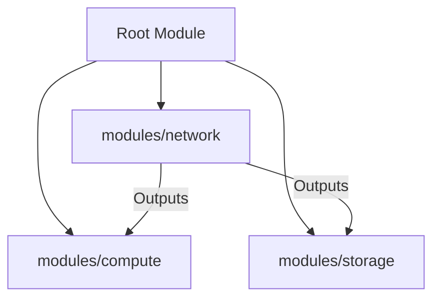
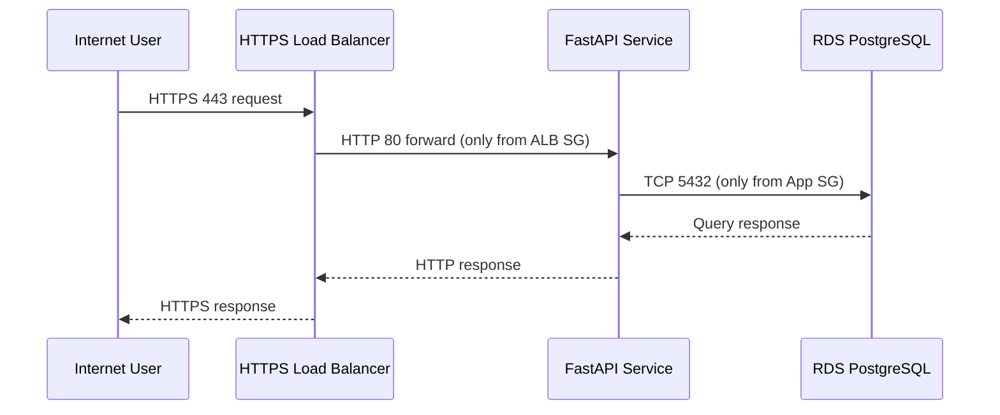
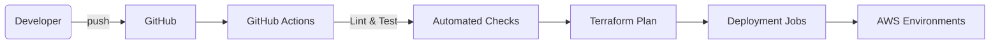
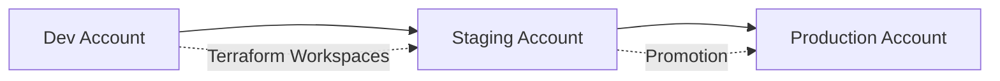

# Portfolio Project Refactoring and Documentation

This document summarises the refactoring of the portfolio project into a modular, production-ready stack with backend, frontend, infrastructure, testing, and operations improvements. It complements the code in this repository and provides architectural diagrams using Mermaid syntax.

## System Architecture

The application uses a secure three-tier architecture deployed on AWS. The React frontend is delivered from CloudFront + S3, the FastAPI backend runs on EC2 instances in an Auto Scaling Group, and PostgreSQL is hosted on Amazon RDS. All resources are provisioned via Terraform modules. Networking follows least-privilege design with public and private subnets and strict security groups.

```mermaid
flowchart LR
    subgraph AWS VPC (Project Network)
        direction LR
        subgraph PublicSubnet["Public Subnets (AZ1 & AZ2)"]
            ALB[Application Load Balancer]
            NAT[NAT Gateway]
        end
        subgraph PrivateSubnetApp["Private Subnets - App Tier"]
            EC2[Auto Scaling Group\nFastAPI Containers]
        end
        subgraph PrivateSubnetDB["Private Subnets - DB Tier"]
            RDS[(Amazon RDS PostgreSQL)]
        end
    end
    User((User Browser)) -->|HTTPS 443| ALB -->|HTTP 80| EC2 -->|TCP 5432| RDS
    EC2 -->|Outbound updates| NAT --> Internet[(Internet)]
    ALB -.Health checks.-> EC2
```

## Backend (FastAPI)

* FastAPI app structured into modular routers (`app/api/`) with authentication, user, and item endpoints.
* SQLAlchemy ORM models encapsulate persistence with dependency-injected sessions.
* Authentication uses JWT tokens via OAuth2 password flow, secure password hashing with bcrypt, and dependency-based access control.
* Extensive inline documentation and typing ensure readability.

## Frontend (React + Vite)

* Modern Vite + React TypeScript setup with a documented component structure.
* API access centralised in `src/services/api.ts`, automatically attaching the correct base URL.
* React Testing Library + Vitest validate behaviour, using MSW to mock backend responses.
* Styling organised with a minimal design system in `styles.css`.

## Infrastructure as Code (Terraform)

* Root module composes dedicated `network`, `compute`, and `storage` modules.
* Network module builds a VPC with segmented subnets, NAT gateway, and least-privilege security groups.
* Compute module provisions an HTTPS ALB, target group, launch template, and Auto Scaling Group.
* Storage module creates an RDS instance with Secrets Manager integration for credentials.



## Testing Strategy

* **Backend** – pytest suite uses FastAPI `TestClient` with dependency overrides for isolated SQLite sessions.
* **Frontend** – Vitest runs component tests with MSW to simulate API calls; ensures UI state transitions.
* **Infrastructure** – Terraform configuration designed for `terraform fmt`, `validate`, and `plan` steps in CI, with outputs documented for smoke tests.

## Security and Observability

* Strict security groups enforce tier-to-tier access only.
* JWT authentication ensures endpoints require valid tokens; hashed passwords never leave the backend.
* Infrastructure enables encryption at rest for RDS and Secrets Manager for credential storage.
* Application logs are structured for CloudWatch ingestion (see `app/main.py` for health endpoints used by ALB).



## CI/CD Pipeline Overview

GitHub Actions pipeline (see `.github/workflows/ci.yml`) performs linting, tests, Terraform validation, image builds, and deploy steps into environment-specific AWS accounts. Promotions require human approval for production.



## Deployment Environments

Dedicated AWS accounts/workspaces for development, staging, and production keep blast radius low while maintaining parity.



## Appendix – AI Assistants

| Tool | Role in Project | Advantages | Considerations |
| --- | --- | --- | --- |
| GitHub Copilot | Inline code completions in VS Code | Speeds up boilerplate, context-aware | Requires review for security/style |
| Amazon CodeWhisperer | AWS-focused completions & security scans | Free for individuals, highlights risky patterns | More AWS-specific suggestions |
| OpenAI ChatGPT | Conversational planning, doc drafting, troubleshooting | Excellent for explanations and brainstorming | Verify outputs; GPT-4 access via paid tier |

Each assistant accelerated development but all outputs were reviewed for correctness, security, and adherence to project standards.
