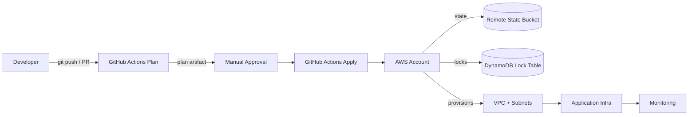
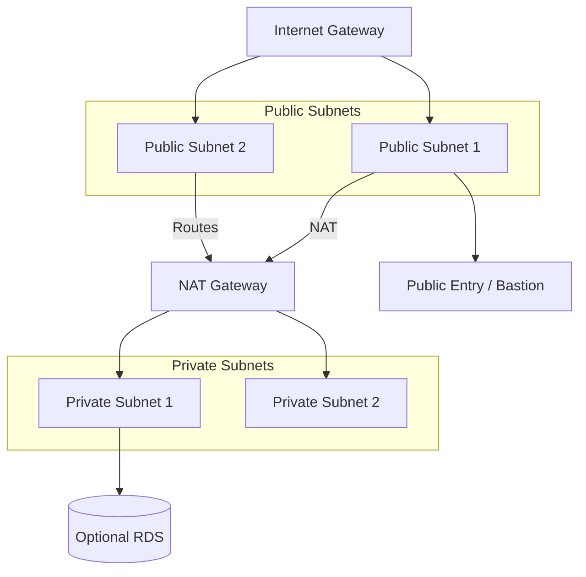
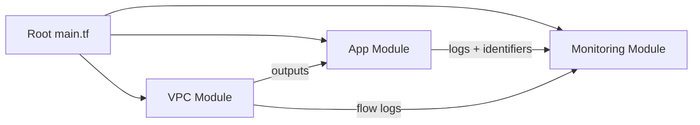

# Terraform Architecture Diagrams

## End-to-End Architecture

```mermaid
flowchart LR
  Dev[Developer] -->|git push / PR| CI[GitHub Actions Plan]
  CI -->|plan artifact| Approval[Manual Approval]
  Approval --> Apply[GitHub Actions Apply]
  Apply --> AWS[AWS Account]
  AWS -->|state| S3[(Remote State Bucket)]
  AWS -->|locks| DDB[(DynamoDB Lock Table)]
  AWS -->|provisions| VPC[VPC + Subnets]
  VPC --> App[Application Infra]
  App --> Mon[Monitoring]
```

## VPC Layout

```mermaid
flowchart TB
  IGW[Internet Gateway]
  subgraph Public Subnets
    PS1[Public Subnet 1]
    PS2[Public Subnet 2]
  end
  subgraph Private Subnets
    PR1[Private Subnet 1]
    PR2[Private Subnet 2]
  end
  PS1 -- NAT --> NAT[NAT Gateway]
  PS2 -- Routes --> NAT
  IGW --> PS1
  IGW --> PS2
  NAT --> PR1
  NAT --> PR2
  PR1 --> RDS[(Optional RDS)]
  PS1 --> ALB[Public Entry / Bastion]
```

## Module Component View

```mermaid
flowchart LR
  Root[Root main.tf]
  Root --> VPCModule[VPC Module]
  Root --> AppModule[App Module]
  Root --> MonModule[Monitoring Module]

  VPCModule -->|outputs| AppModule
  AppModule -->|logs + identifiers| MonModule
  VPCModule -->|flow logs| MonModule
```
