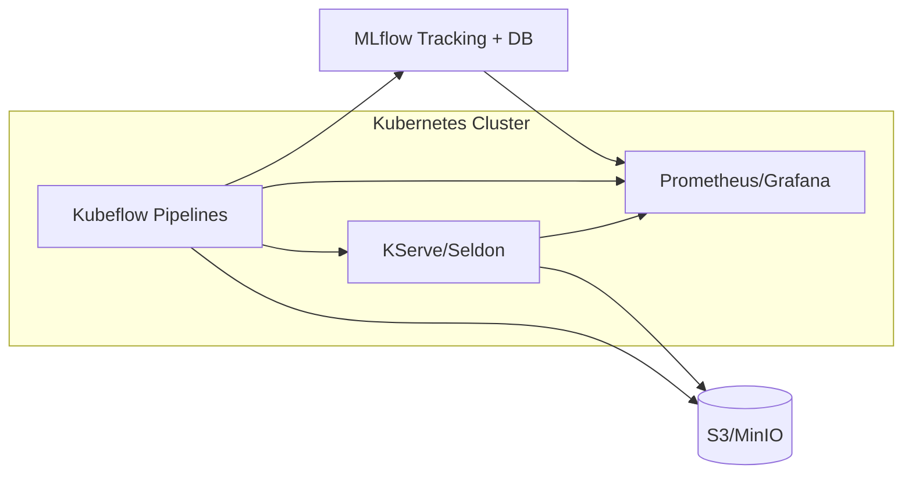
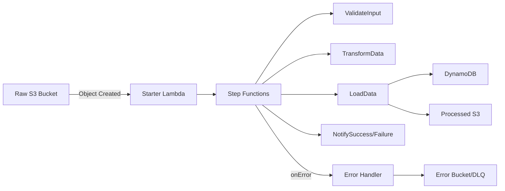
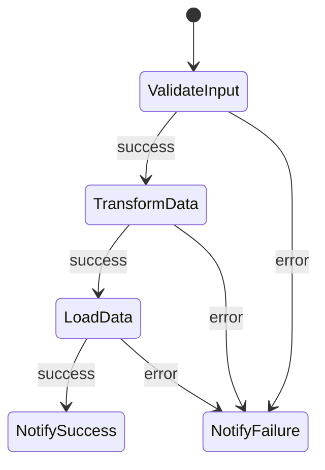
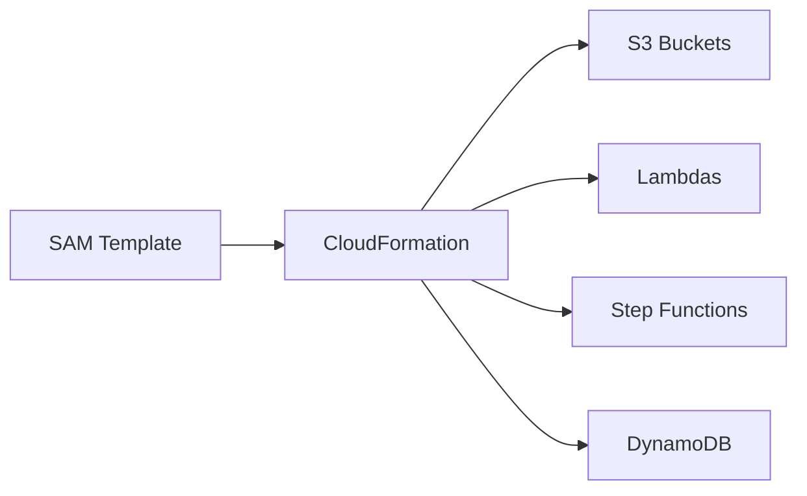
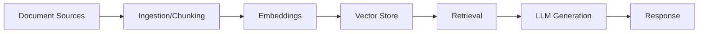
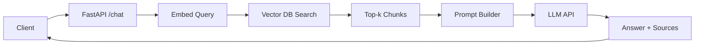
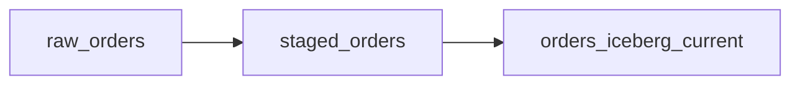
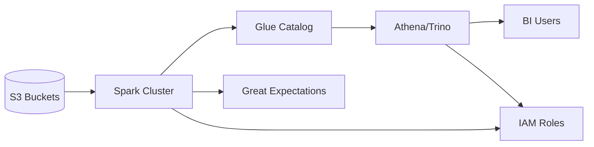

# P07–P10 Deliverables

This document contains the complete prompt responses for P07 through P10, matching the depth and style delivered for P06.

---

## ⭐ P07 — Machine Learning Pipeline (Kubeflow + MLflow MLOps)

### P07-README — README.md

# P07 — Production-Grade MLOps Pipeline (Kubeflow + MLflow)

**Tagline:** End-to-end, production-oriented ML lifecycle using Kubeflow Pipelines, MLflow registry, and KServe/Seldon for serving.

## 1. Executive Summary
This project demonstrates a full ML lifecycle on Kubernetes: ingesting and validating tabular data, engineering features, training an XGBoost model, evaluating and registering the best candidate in MLflow, deploying it to an online endpoint via KServe/Seldon, and monitoring performance/drift with Prometheus/Grafana. It highlights reproducibility, component reuse, and production-minded MLOps.

## 2. Architecture Overview
**Flow:** Raw data → Validation → Feature engineering → Training → Evaluation → MLflow registry → Deployment → Monitoring & feedback loop. High-level diagrams are provided in the **Architecture Diagram Pack** section below.

## 3. Tech Stack
- **Orchestration:** Kubeflow Pipelines v2
- **Tracking/Registry:** MLflow 2.x with PostgreSQL backend store + S3/MinIO artifact store
- **Modeling:** Python 3.10+, scikit-learn/XGBoost 1.7+
- **Serving:** KServe or Seldon Core on Kubernetes (kind/minikube/managed)
- **Storage:** S3/MinIO for datasets and artifacts
- **Monitoring:** Prometheus + Grafana

## 4. Repository Structure
```
/pipelines/           # Kubeflow pipeline DSL definitions
/components/          # Containerized pipeline steps (ingest, validate, train, etc.)
/mlflow/              # Tracking/registry configs (backend store, artifact store)
/serving/             # KServe/Seldon manifests
/monitoring/          # Prometheus rules, Grafana dashboards
/notebooks/           # Exploration & debugging
/docs/                # Design docs, runbooks
```

## 5. Data & Features
- **Dataset:** Tabular classification (e.g., customer churn) or regression (house prices) — synthetic or anonymized real data stored as CSV/Parquet in S3/MinIO.
- **Features:** Demographics, usage stats, contract metadata; target = churn flag (classification) or price (regression).
- **Validation:** Great Expectations or custom checks for schema, null ratios, value ranges; failures route to quarantine bucket.

## 6. Pipeline Description
- `ingest_data`: Pulls raw data from S3/MinIO.
- `validate_data`: Runs schema/quality checks, rejects bad batches.
- `engineer_features`: Cleans, encodes categoricals, scales numerics; writes feature set.
- `train_model`: Trains XGBoost/Sklearn; logs parameters to MLflow.
- `evaluate_model`: Computes metrics (AUC/F1/RMSE); logs to MLflow.
- `register_model`: Compares to registry best; registers/promo best model.
- `deploy_model`: Deploys via KServe/Seldon; configures autoscaling.
- `post_deploy_tests`: Smoke/integration checks against the endpoint.

## 7. MLflow Usage
- **Runs:** Each component logs params/metrics/artifacts to MLflow Tracking (URI from env).
- **Registry:** Models registered with stage tags (Staging/Production). Best model chosen by primary metric (e.g., AUC) and promoted automatically.
- **Versioning:** Each run linked to Git commit + data hash via tags for reproducibility.

## 8. Serving & Monitoring
- **Deployment:** KServe/Seldon inference service with REST/gRPC endpoint.
- **Invocation:** REST `POST /v1/models/<name>:predict` with JSON payload.
- **Metrics:** Latency, error rate, request volume, drift indicators (PSI, feature stats) exported to Prometheus and visualized in Grafana.

## 9. Setup Instructions
1. **Prerequisites:** Kubernetes cluster with Kubeflow Pipelines installed; MLflow server (tracking + registry) with PostgreSQL backend and S3/MinIO artifact store; KServe/Seldon installed; Prometheus/Grafana available.
2. **Environment:**
   - `MLFLOW_TRACKING_URI` (e.g., `http://mlflow:5000`)
   - `MLFLOW_S3_ENDPOINT_URL`, `AWS_ACCESS_KEY_ID`, `AWS_SECRET_ACCESS_KEY`
   - `ARTIFACT_BUCKET`, `PIPELINE_BUCKET`
3. **Install dependencies:**
```bash
pip install -r requirements.txt
```
4. **Compile & upload pipeline:**
```bash
python pipelines/p07_pipeline.py --compile
kfp pipelines upload -p p07-mlops -f pipelines/p07_pipeline.yaml
```
5. **Run pipeline:** Trigger via Kubeflow UI or CLI with parameters for data path, hyperparameters, and registry name.

## 10. Demo Flow
1. Run pipeline in Kubeflow.
2. Open MLflow UI to inspect runs, metrics, and artifacts.
3. Invoke deployed model via REST; verify predictions and metadata.
4. Open Grafana dashboard for latency/error/drift panels.

## 11. What This Shows About Me
- Reproducible pipelines with clear separation of concerns.
- Component reuse via containerized steps.
- Automated model promotion and deployment with observability hooks.

---

### P07-ARCH — Architecture Diagrams

#### 1) High-Level MLOps Pipeline
```mermaid
graph LR
  A[Raw Data Source] --> B[Data Validation]
  B --> C[Feature Engineering]
  C --> D[Training]
  D --> E[Evaluation]
  E --> F[MLflow Registration]
  F --> G[Deployment (KServe/Seldon)]
  G --> H[Monitoring & Feedback]
  H --> C
```
*Depicts the left-to-right lifecycle from raw data through monitoring and iterative feedback.*

#### 2) Component/Service Architecture

*Shows how Kubeflow coordinates with MLflow and object storage, while serving and monitoring are integrated inside the cluster.*

#### 3) Deployment Architecture
```mermaid
graph LR
  C[Client] --> G[Inference Gateway (KServe/Seldon)]
  G --> P[Model Pod]
  P --> ME[Metrics Exporter]
  ME --> MON[Prometheus/Grafana]
```
*Illustrates client-to-gateway traffic, model pods, and metrics export to monitoring.*

---

### P07-TEST — Testing Plan

#### 1. Test Strategy Overview
- **Unit Tests:** Feature engineering utilities, validation helpers.
- **Component Tests:** Each pipeline step container (ingest, validate, train, evaluate, register, deploy).
- **Integration Tests:** Full Kubeflow pipeline execution on sample data.
- **Validation Tests:** MLflow tracking/registry correctness.
- **Serving Tests:** API load, latency, error handling on deployed endpoint.
- **Data Quality Tests:** Schema, nulls, ranges, drift checks.

#### 2. Detailed Test Plan (sample cases)
| ID | Name | Purpose | Steps | Expected Result | Tools |
| -- | ---- | ------- | ----- | --------------- | ----- |
| UT-01 | Feature scaling | Verify scaler produces expected stats | Call transform on known vector | Mean≈0, std≈1 | pytest, numpy |
| UT-02 | Categorical encoding | Ensure consistent encoding map | Fit encoder on sample categories | Stable index mapping | pytest, sklearn |
| CT-01 | Ingest component | Validate S3 read path | Run container with sample URI | Files downloaded to /data | pytest, kfp test |
| CT-02 | Validate component | Ensure Great Expectations rules enforced | Run with bad schema | Step fails with clear error | great_expectations |
| CT-03 | Train component | Confirm metrics logged | Run training on small data | Metrics/params logged to MLflow | mlflow, pytest |
| IT-01 | Pipeline E2E | Run full pipeline | Execute Kubeflow run | All steps succeed; outputs stored | kfp SDK |
| VT-01 | MLflow registry | Verify best model registration | Create two runs with metrics | Higher metric promoted to Staging/Prod | mlflow client |
| ST-01 | Serving smoke | REST predict | POST sample payload | 200 OK + prediction | pytest, requests |
| ST-02 | Load/latency | Measure p95 latency | Run k6/locust | p95 < target; no 5xx | k6/locust |
| DQ-01 | Schema check | Validate expected columns | Run GE suite | Pass for valid data | Great Expectations |
| DQ-02 | Drift detection | Detect PSI > threshold | Feed drifted batch | Alert raised | Custom drift job + Prometheus |

#### 3. MLOps-Specific Tests
- **Reproducibility:** Same code/data yields metrics within tolerance; assert run tags match data hash.
- **Best model registration:** Verify MLflow stage promotion occurs only when metric improves.
- **Canary/shadow:** Deploy candidate alongside prod; compare responses/metrics; rollback if degraded.
- **Rollback:** Confirm previous model can be promoted and serving routed back within SLA.

#### 4. Data & Model Validation
- Schema validation, null checks, range checks, categorical allowed sets.
- Drift detection (PSI, mean/std deltas) compared to training baseline.
- Performance thresholds (AUC/F1/RMSE) enforced before promotion.
- Optional bias checks on sensitive attributes.

#### 5. Non-Functional
- Performance: p95 latency under SLA.
- Scalability: load tests with autoscaling enabled.
- Resilience: simulate MLflow/storage outage; ensure retries/fail-closed.
- Security: RBAC enforced for MLflow/Kubeflow/serving endpoints.

---

### P07-CODE — Key Code Artifacts

#### 1) Kubeflow Pipeline DSL (v2-style)
```python
import kfp
from kfp import dsl
from kfp.dsl import Output, Dataset, Model

@dsl.component
def ingest_data_op(source_uri: str, output_data: Output[Dataset]):
    import pandas as pd
    import mlflow
    df = pd.read_csv(source_uri)
    df.to_csv(output_data.path, index=False)
    mlflow.log_param("source_uri", source_uri)

@dsl.component
def validate_data_op(input_data: Dataset, output_data: Output[Dataset]):
    import pandas as pd
    df = pd.read_csv(input_data.path)
    assert not df.isnull().any().any(), "Nulls detected"
    df.to_csv(output_data.path, index=False)

@dsl.component
def feature_engineering_op(input_data: Dataset, output_data: Output[Dataset]):
    import pandas as pd
    from sklearn.model_selection import train_test_split
    df = pd.read_csv(input_data.path)
    # simple example: drop id, one-hot encode categoricals
    df = pd.get_dummies(df)
    df.to_csv(output_data.path, index=False)

@dsl.component
def train_model_op(feature_data: Dataset, model: Output[Model]):
    import pandas as pd
    from sklearn.model_selection import train_test_split
    from xgboost import XGBClassifier
    import mlflow

    df = pd.read_csv(feature_data.path)
    X = df.drop("target", axis=1)
    y = df["target"]
    X_train, X_val, y_train, y_val = train_test_split(X, y, test_size=0.2, random_state=42)

    model_clf = XGBClassifier(n_estimators=200, max_depth=6, learning_rate=0.1)
    with mlflow.start_run() as run:
        mlflow.log_params({"n_estimators": 200, "max_depth": 6, "learning_rate": 0.1})
        model_clf.fit(X_train, y_train)
        val_pred = model_clf.predict_proba(X_val)[:, 1]
        from sklearn.metrics import roc_auc_score
        auc = roc_auc_score(y_val, val_pred)
        mlflow.log_metric("val_auc", auc)
        mlflow.xgboost.log_model(model_clf, artifact_path="model")
        mlflow.log_artifact(feature_data.path, artifact_path="features")
    import joblib
    joblib.dump(model_clf, model.path)

@dsl.component
def evaluate_model_op(model: Model, feature_data: Dataset) -> float:
    import joblib
    import pandas as pd
    from sklearn.metrics import roc_auc_score
    mdl = joblib.load(model.path)
    df = pd.read_csv(feature_data.path)
    X = df.drop("target", axis=1)
    y = df["target"]
    pred = mdl.predict_proba(X)[:, 1]
    auc = roc_auc_score(y, pred)
    import mlflow
    mlflow.log_metric("full_auc", auc)
    return auc

@dsl.component
def register_model_op(metric: float, run_id: str, model_name: str = "p07-model"):
    import mlflow
    client = mlflow.tracking.MlflowClient()
    mv = client.create_model_version(name=model_name, source=f"runs:/{run_id}/model", run_id=run_id)
    best = max([v for v in client.search_model_versions(f"name='{model_name}'")], key=lambda v: float(v.run_id != run_id))
    client.transition_model_version_stage(name=model_name, version=mv.version, stage="Staging")

@dsl.component
def deploy_model_op(model_name: str = "p07-model"):
    # Stub for KServe/Seldon deployment
    print(f"Deploying {model_name} via KServe")

@dsl.pipeline(name="p07-mlops")
def p07_pipeline(source_uri: str, model_name: str = "p07-model"):
    ingest = ingest_data_op(source_uri=source_uri)
    valid = validate_data_op(input_data=ingest.outputs["output_data"])
    feats = feature_engineering_op(input_data=valid.outputs["output_data"])
    train = train_model_op(feature_data=feats.outputs["output_data"])
    auc = evaluate_model_op(model=train.outputs["model"], feature_data=feats.outputs["output_data"])
    register_model_op(metric=auc.output, run_id=train.outputs["mlpipeline-ui-metadata"], model_name=model_name)
    deploy_model_op(model_name=model_name)

if __name__ == "__main__":
    kfp.compiler.Compiler().compile(p07_pipeline, package_path="pipelines/p07_pipeline.yaml")
```

#### 2) Component Scripts (examples)
`components/train.py`
```python
import os
import pandas as pd
from sklearn.model_selection import train_test_split
from sklearn.metrics import accuracy_score, f1_score
from xgboost import XGBClassifier
import mlflow

MLFLOW_TRACKING_URI = os.getenv("MLFLOW_TRACKING_URI", "http://mlflow:5000")
mlflow.set_tracking_uri(MLFLOW_TRACKING_URI)


def main(data_path: str, target: str = "target"):
    df = pd.read_csv(data_path)
    X = df.drop(columns=[target])
    y = df[target]
    X_train, X_val, y_train, y_val = train_test_split(X, y, test_size=0.2, random_state=42)

    params = {"n_estimators": 150, "max_depth": 6, "learning_rate": 0.1}
    model = XGBClassifier(**params)

    with mlflow.start_run(tags={"stage": "training", "model_type": "xgboost"}) as run:
        mlflow.log_params(params)
        model.fit(X_train, y_train)
        val_pred = model.predict(X_val)
        acc = accuracy_score(y_val, val_pred)
        f1 = f1_score(y_val, val_pred)
        mlflow.log_metrics({"val_accuracy": acc, "val_f1": f1})
        mlflow.xgboost.log_model(model, artifact_path="model")
        print(f"Logged run {run.info.run_id} with acc={acc}")

    return run.info.run_id


if __name__ == "__main__":
    import argparse

    parser = argparse.ArgumentParser()
    parser.add_argument("--data-path", required=True)
    parser.add_argument("--target", default="target")
    args = parser.parse_args()
    main(args.data_path, args.target)
```

`components/register.py`
```python
import os
import mlflow

mlflow.set_tracking_uri(os.getenv("MLFLOW_TRACKING_URI", "http://mlflow:5000"))


def promote_best(model_name: str, run_id: str, metric: str = "val_f1"):
    client = mlflow.tracking.MlflowClient()
    new_metrics = client.get_run(run_id).data.metrics
    new_score = new_metrics.get(metric, 0)

    versions = client.search_model_versions(f"name='{model_name}'")
    best_score = -1
    best_version = None
    for v in versions:
        m = client.get_run(v.run_id).data.metrics.get(metric, -1)
        if m > best_score:
            best_score = m
            best_version = v

    mv = client.create_model_version(model_name, f"runs:/{run_id}/model", run_id)
    if new_score >= best_score:
        client.transition_model_version_stage(model_name, mv.version, stage="Production", archive_existing_versions=True)
    else:
        client.transition_model_version_stage(model_name, mv.version, stage="Staging")
    return mv.version
```

#### 3) Serving Example (FastAPI)
```python
from fastapi import FastAPI
import mlflow.pyfunc
import os

MODEL_URI = os.getenv("MODEL_URI", "models:/p07-model/Production")
model = mlflow.pyfunc.load_model(MODEL_URI)
app = FastAPI()


@app.get("/health")
def health():
    return {"status": "ok"}


@app.post("/predict")
def predict(payload: dict):
    import pandas as pd

    df = pd.DataFrame(payload["instances"])
    preds = model.predict(df)
    return {"predictions": preds.tolist()}
```

#### 4) Config Example
`.env.example`
```
MLFLOW_TRACKING_URI=http://mlflow:5000
MLFLOW_S3_ENDPOINT_URL=http://minio:9000
AWS_ACCESS_KEY_ID=minio
AWS_SECRET_ACCESS_KEY=minio123
ARTIFACT_BUCKET=mlops-artifacts
PIPELINE_BUCKET=mlops-pipeline
```

---

### P07-REPORT — Reporting Templates

#### Model Training & Evaluation Report
```
# Model Training & Evaluation Report
- Model: ____
- Version: ____
- Run ID: ____
- Data snapshot: date=____, rows=____
- Features: ____
- Importance summary: ____
- Metrics: accuracy=__, precision=__, recall=__, F1=__, ROC-AUC=__
- Baseline comparison: new vs prior deltas
- Risks & caveats: ____
```

#### Model Deployment Report
```
# Model Deployment Report
- Model version: ____
- Environment: staging/prod
- Deployment method: blue/green | canary | shadow
- Smoke tests: pass/fail summary
- Performance tests: latency/error highlights
- Rollback plan: trigger, steps, owner
```

#### Monthly MLOps Health Report
```
# Monthly MLOps Health Report
- Experiments this month: ____
- New models deployed: ____
- Performance trends: ____
- Incidents/anomalies: ____
- Upcoming experiments/features: ____
```

---

### P07-PLAYBOOK — Promote New Model to Production

```
Purpose: Safely promote a candidate MLflow model to production.
Preconditions: Candidate registered; metrics above thresholds; staging tests passed.

1) Identify candidate in MLflow (model name, version, run link).
2) Transition model to **Staging**; deploy to staging endpoint via KServe/Seldon.
3) Run integration + synthetic traffic tests; capture metrics.
4) Run shadow/canary with real traffic; compare against baseline latency/error/quality.
5) Monitor Prometheus/Grafana for regressions for agreed bake period.
6) If criteria met, transition model to **Production** and update serving config.
7) Announce change, record links (runs, dashboards, tickets).

Verification:
- Responses align with baseline; no error spikes; drift metrics stable.
- Logs/metrics flowing to monitoring stack.
- Sanity checks on production traffic sampled.

Rollback:
- Promote previous Production version; update KServe/Seldon route.
- Clear caches; confirm new traffic uses reverted model.
- Document incident and remediation.
```

---

### P07-RUNBOOK — Incident Runbooks

#### 1) Model performance regression
- **Symptoms:** Drop in AUC/F1; alerts firing; user complaints.
- **Triage:** Check Grafana latency/error; compare predictions vs baseline on canary set; check drift metrics.
- **Actions:** If regression confirmed, promote previous model; disable canary; open incident ticket.
- **Follow-up:** Root-cause analysis (data shift, feature bug), add tests/alerts.

#### 2) Pipeline failure (Kubeflow)
- **Symptoms:** Failed pods, Kubeflow UI errors.
- **Triage:** Inspect step logs; check resource quotas; review recent code changes.
- **Actions:** Re-run failed step; if persistent, roll back image; escalate to data eng/infra.
- **Follow-up:** Add retry/backoff, improve validation, capture failure reason in incident log.

#### 3) MLflow outage
- **Symptoms:** Tracking UI/API unreachable; logging errors in steps.
- **Triage:** Check MLflow pod/logs, DB health, S3 connectivity.
- **Actions:** Route to local logging fallback; queue metrics; restart MLflow pod; validate DB.
- **Follow-up:** Improve HA (replicas, backups), add uptime alerts.

---

### P07-SOP — Routine Operations

#### SOP: Daily Model & Pipeline Check
- **Purpose:** Ensure latest runs and serving endpoints are healthy.
- **Scope/Roles:** On-call MLOps.
- **Procedure:**
  1. Review last pipeline run in Kubeflow.
  2. Check MLflow for failed runs.
  3. Inspect Prometheus/Grafana for latency/error/drift.
  4. Log findings and anomalies.
- **Proof:** Daily checklist with links/screenshots.

#### SOP: Adding a New Feature
- Update schema + validation rules.
- Extend feature engineering component and tests.
- Retrain model; run regression tests.
- Evaluate impact; decide on deployment.
- Record changes in MLflow and docs.

#### SOP: Expiring & Archiving Old Models
- Define criteria (unused >90 days or superseded).
- Export artifacts; tag as archived; remove from prod/staging.
- Update documentation and registry notes.
- Proof: Archive ticket with links.

---

### P07-METRICS — Grafana Dashboards

1. **Training & Experimentation:** runs/day, metric distributions (accuracy/loss), hyperparameter sweep heatmaps; alert if success rate <95%.
2. **Model Serving:** RPS, latency p50/p95/p99, error rate (4xx/5xx), pod CPU/mem; alert on p95>200ms for 15m or error rate>2%.
3. **Model Quality & Drift:** Prediction vs ground truth where available, feature distribution vs baseline, PSI per feature; alert on PSI>0.2 for 30m.

---

### P07-ADR — Architecture Decisions

1. **Kubeflow Pipelines over Airflow/Luigi**
   - Context: Need container-native ML orchestration on Kubernetes.
   - Decision: Use Kubeflow for tight K8s integration and ML-specific UI.
   - Alternatives: Airflow, Luigi.
   - Pros: Native K8s, artifacts, UI; Cons: More infra overhead than SaaS.
   - Consequences: Requires K8s ops skills; benefits from component reuse.

2. **MLflow for Tracking/Registry**
   - Context: Unified experiment tracking + model registry.
   - Decision: MLflow with PostgreSQL backend + S3 artifacts.
   - Alternatives: Weights & Biases, SageMaker.
   - Pros: Open, flexible; Cons: self-managed HA.
   - Consequences: Need backups and RBAC.

3. **Serving via KServe vs custom FastAPI**
   - Decision: KServe for autoscaling, GPU support, canary.
   - Alternatives: Custom Flask/FastAPI.
   - Pros: Traffic management, model mesh; Cons: learning curve.

4. **Object Storage for Artifacts**
   - Decision: S3/MinIO for durability and scalability.
   - Alternatives: Local PVC.
   - Pros: Durable, shareable; Cons: eventual consistency.

5. **Promotion Strategy: Automated thresholds**
   - Decision: Promote when primary metric improves and tests pass.
   - Alternatives: Manual-only.
   - Pros: Faster iteration; Cons: need guardrails to avoid bad promotes.

---

### P07-THREAT — Threat Model

- **Assets:** Training data, models, feature store, MLflow DB, object storage.
- **Attacker Goals:** Model/data theft, poisoning, misconfig abuse.
- **Entry Points:** MLflow UI/API, Kubeflow UI/API, serving endpoints, storage buckets.
- **STRIDE:**
  - Spoofing: Stolen tokens → enforce OIDC/RBAC.
  - Tampering: Malicious model uploads → signed artifacts, hash checks.
  - Repudiation: Audit logs on MLflow/Kubeflow.
  - Information Disclosure: Encrypt in transit/at rest; limit bucket access.
  - DoS: Rate-limit serving; autoscale; WAF.
  - EoP: Least-privilege IAM; namespace isolation.
- **Monitoring:** Auth logs, model download events, drift spikes, unusual traffic; alerts on failed logins, sudden artifact downloads.

---

### P07-RISK — Risk Register

| Risk ID | Category | Description | Likelihood | Impact | Score | Mitigation | Owner | Status | Review Date |
| --- | --- | --- | --- | --- | --- | --- | --- | --- | --- |
| R1 | Performance | Model degradation in prod | M | H | H | Canary + auto-rollback | MLOps Lead | Open | Monthly |
| R2 | Data | Data drift/concept drift | M | H | H | Drift monitoring, alerts | Data Eng | Open | Monthly |
| R3 | Security | Model/data theft | L | H | M | IAM/RBAC, encryption | Security | Open | Quarterly |
| R4 | Quality | Label leakage/privacy | L | H | M | DLP checks, masking | Data Gov | Open | Quarterly |
| R5 | Reliability | Pipeline failures | M | M | M | Retries, on-call runbooks | MLOps | Open | Monthly |
| R6 | Compliance | Regulatory exposure | L | H | M | Access controls, audits | Compliance | Open | Quarterly |
| R7 | Integrity | MLflow data loss | L | H | M | DB backups, versioned artifacts | Platform | Open | Monthly |
| R8 | Ops | Serving downtime | M | H | H | HPA, multi-replica | SRE | Open | Monthly |
| R9 | Governance | Unreviewed promotion | M | M | M | Approval gates, thresholds | MLOps | Open | Monthly |
| R10 | Cost | Unbounded resource use | M | M | M | Quotas, cost alerts | FinOps | Open | Monthly |

---

## ⭐ P08 — Serverless Data Processing (AWS Lambda + SAM + Step Functions)

### P08-README — README.md

# P08 — Serverless Event-Driven Data Processing on AWS

Short description: Event-driven pipeline for ingesting S3 uploads, validating and transforming data with Lambdas orchestrated by Step Functions, storing outputs in DynamoDB/S3 curated zone, and observing via CloudWatch/X-Ray.

## Architectural Summary
S3 (incoming) → Event triggers Lambda/Step Functions → Validate → Transform → Load → Notify → DynamoDB/S3 processed. Errors route to DLQ/error bucket. Diagram placeholder: `assets/p08-architecture.png`.

## Tech Stack
- AWS SAM, Lambda (Python 3.9+), S3, DynamoDB, EventBridge, Step Functions, CloudWatch/X-Ray.

## Repository Layout
- `/template.yaml`
- `/src/functions/` (validator, transformer, loader, error-handler)
- `/events/` (sample events)
- `/tests/`
- `/docs/`

## Flow Description
- S3 upload triggers starter Lambda/Step Functions.
- States: validate input → transform data → load to DynamoDB/S3 processed → notify success/failure.
- Errors captured via retries and DLQ/error bucket.

## Setup
- Prerequisites: AWS account, AWS CLI, SAM CLI; configure IAM roles with least privilege.
- Deployment:
```bash
sam build
sam deploy --guided
```

## Usage
- Upload test file to incoming bucket.
- Monitor CloudWatch logs and X-Ray traces.
- Query results in DynamoDB or processed S3 prefix.

## Cost & Scale
- Manage Lambda concurrency, S3 request costs, DynamoDB capacity; enable auto-scaling where applicable.

## What This Demonstrates
Event-driven design, serverless best practices, observability, and robust error handling.

---

### P08-ARCH — Mermaid Diagrams

1) High-Level Event Flow

*Shows event-driven flow from S3 through Step Functions to sinks and notifications.*

2) State Machine Diagram

*Represents the validation → transform → load workflow with success/failure paths.*

3) Deployment View

*Illustrates SAM generating CloudFormation to provision resources.*

---

### P08-TEST — Testing Plan

| ID | Name | Category | Purpose | Steps | Expected | Tools |
| -- | ---- | -------- | ------- | ----- | -------- | ----- |
| UT-01 | Validate schema | Unit | Ensure validator rejects bad schema | Invoke handler with malformed JSON | Error raised | pytest |
| UT-02 | Transform logic | Unit | Confirm transformations applied | Call transformer with sample | Transformed payload | pytest |
| UT-03 | Error handling | Unit | Structured logging | Trigger exception | Log contains context | pytest |
| IT-01 | S3 event | Integration | S3 event triggers Lambda | Simulate S3 event | Handler processes object | sam local, moto |
| IT-02 | Lambda→DDB | Integration | Writes to DynamoDB | Invoke loader | Item stored | moto |
| IT-03 | End-to-end | Integration | Full state machine | Start execution | Success path completed | sam local stepfunctions |
| CT-01 | Contract valid input | Contract | Validate CSV header schema | Provide correct sample | Passes validation | pytest |
| CT-02 | Contract missing field | Contract | Ensure rejection | Remove required column | Validation error | pytest |
| NT-01 | Malformed file | Negative | Bad CSV | Upload malformed file | Sent to error handler | sam local |
| NT-02 | Oversized file | Negative | Large payload | Upload oversized | Throttled/failed gracefully | sam local |
| PT-01 | Burst uploads | Performance | Many files quickly | Upload N files | System scales; no throttling | k6/aws CLI |
| PT-02 | Concurrency | Performance | Concurrency behavior | Concurrent invokes | No errors; within SLA | k6 |
| RS-01 | Lambda failure retry | Resilience | Ensure retries | Force exception | Retries then DLQ | Step Functions |
| RS-02 | DLQ behavior | Resilience | Error bucket path | Trigger failure | Object moved to error bucket | AWS/SAM |

---

### P08-CODE — Key Artifacts

#### 1) template.yaml (SAM)
```yaml
AWSTemplateFormatVersion: '2010-09-09'
Transform: AWS::Serverless-2016-10-31
Description: P08 Serverless Data Pipeline
Globals:
  Function:
    Runtime: python3.9
    Timeout: 60
    MemorySize: 256
    Tracing: Active
    Environment:
      Variables:
        PROCESSED_BUCKET: !Ref ProcessedBucket
        INCOMING_BUCKET: !Ref IncomingBucket
        TABLE_NAME: !Ref RecordsTable
Resources:
  IncomingBucket:
    Type: AWS::S3::Bucket
  ProcessedBucket:
    Type: AWS::S3::Bucket
  RecordsTable:
    Type: AWS::DynamoDB::Table
    Properties:
      BillingMode: PAYPERREQUEST
      AttributeDefinitions:
        - AttributeName: id
          AttributeType: S
      KeySchema:
        - AttributeName: id
          KeyType: HASH
  DataValidator:
    Type: AWS::Serverless::Function
    Properties:
      Handler: functions/data_validator.handler
      Policies:
        - S3ReadPolicy:
            BucketName: !Ref IncomingBucket
  DataTransformer:
    Type: AWS::Serverless::Function
    Properties:
      Handler: functions/data_transformer.handler
  DataLoader:
    Type: AWS::Serverless::Function
    Properties:
      Handler: functions/data_loader.handler
      Policies:
        - DynamoDBWritePolicy:
            TableName: !Ref RecordsTable
        - S3WritePolicy:
            BucketName: !Ref ProcessedBucket
  ErrorHandler:
    Type: AWS::Serverless::Function
    Properties:
      Handler: functions/error_handler.handler
  StateMachine:
    Type: AWS::Serverless::StateMachine
    Properties:
      DefinitionUri: statemachine/definition.asl.json
      DefinitionSubstitutions:
        ValidatorArn: !GetAtt DataValidator.Arn
        TransformerArn: !GetAtt DataTransformer.Arn
        LoaderArn: !GetAtt DataLoader.Arn
        ErrorHandlerArn: !GetAtt ErrorHandler.Arn
      Policies:
        - LambdaInvokePolicy:
            FunctionName: !Ref DataValidator
        - LambdaInvokePolicy:
            FunctionName: !Ref DataTransformer
        - LambdaInvokePolicy:
            FunctionName: !Ref DataLoader
        - LambdaInvokePolicy:
            FunctionName: !Ref ErrorHandler
  S3Notification:
    Type: AWS::S3::Bucket
    Properties:
      BucketName: !Ref IncomingBucket
      NotificationConfiguration:
        LambdaConfigurations:
          - Event: s3:ObjectCreated:*
            Function: !GetAtt DataValidator.Arn
Outputs:
  IncomingBucketName:
    Value: !Ref IncomingBucket
  ProcessedBucketName:
    Value: !Ref ProcessedBucket
  RecordsTableName:
    Value: !Ref RecordsTable
```

#### 2) Lambda Skeletons (Python)
`src/functions/data_validator.py`
```python
import json
import logging
import boto3

logger = logging.getLogger()
logger.setLevel(logging.INFO)
s3 = boto3.client("s3")

REQUIRED_FIELDS = ["id", "value"]


def handler(event, context):
    logger.info("Received event: %s", json.dumps(event))
    record = event["Records"][0]
    bucket = record["s3"]["bucket"]["name"]
    key = record["s3"]["object"]["key"]
    obj = s3.get_object(Bucket=bucket, Key=key)
    data = obj["Body"].read().decode("utf-8").splitlines()
    header = data[0].split(",")
    missing = [f for f in REQUIRED_FIELDS if f not in header]
    if missing:
        raise ValueError(f"Missing fields: {missing}")
    return {"bucket": bucket, "key": key}
```

`src/functions/data_transformer.py`
```python
import csv
import io
import logging
import boto3

logger = logging.getLogger()
logger.setLevel(logging.INFO)
s3 = boto3.client("s3")


def handler(event, context):
    logger.info("Transform event: %s", event)
    bucket = event["bucket"]
    key = event["key"]
    obj = s3.get_object(Bucket=bucket, Key=key)
    data = obj["Body"].read().decode("utf-8").splitlines()
    reader = csv.DictReader(data)
    output = []
    for row in reader:
        row["value"] = float(row["value"]) * 1.1
        output.append(row)
    csv_buf = io.StringIO()
    writer = csv.DictWriter(csv_buf, fieldnames=reader.fieldnames)
    writer.writeheader(); writer.writerows(output)
    return {"transformed": csv_buf.getvalue(), "key": key}
```

`src/functions/data_loader.py`
```python
import csv
import io
import logging
import os
import uuid
import boto3

logger = logging.getLogger()
logger.setLevel(logging.INFO)
ddb = boto3.resource("dynamodb")
s3 = boto3.client("s3")
TABLE_NAME = os.getenv("TABLE_NAME")
PROCESSED_BUCKET = os.getenv("PROCESSED_BUCKET")

def handler(event, context):
    table = ddb.Table(TABLE_NAME)
    data = event["transformed"]
    reader = csv.DictReader(io.StringIO(data))
    for row in reader:
        row["id"] = row.get("id") or str(uuid.uuid4())
        table.put_item(Item=row)
    key = f"processed/{event['key']}"
    s3.put_object(Bucket=PROCESSED_BUCKET, Key=key, Body=data)
    return {"status": "ok", "processed_key": key}
```

`src/functions/error_handler.py`
```python
import logging
logger = logging.getLogger()
logger.setLevel(logging.INFO)

def handler(event, context):
    logger.error("Error path reached: %s", event)
    return {"status": "error", "detail": event}
```

#### 3) Sample Events
`events/s3-event.json`
```json
{
  "Records": [
    {
      "s3": {
        "bucket": {"name": "incoming-bucket"},
        "object": {"key": "sample.csv"}
      }
    }
  ]
}
```

`events/state-machine-input.json`
```json
{
  "bucket": "incoming-bucket",
  "key": "sample.csv"
}
```

#### 4) Basic Tests (pytest)
`tests/test_transformer.py`
```python
import io
from src.functions import data_transformer

def test_transformer_scales_value(monkeypatch):
    event = {"bucket": "test", "key": "file.csv"}
    class FakeS3:
        def get_object(self, Bucket, Key):
            return {"Body": io.BytesIO(b"id,value\n1,10\n")}
    monkeypatch.setattr(data_transformer, "s3", FakeS3())
    result = data_transformer.handler(event, None)
    assert "11.0" in result["transformed"]
```

---

### P08-REPORT — Reporting Templates

**Deployment & Change Report**
```
- Template version: __
- Lambda versions: __
- Risks: __
- Testing summary: __
- Rollback plan: __
```

**Weekly Pipeline Operations Report**
```
- Files processed: __
- Success vs failure: __
- Avg processing time: __
- Incidents: __
```

**Incident Retrospective**
```
- Incident summary: __
- Impact: __
- Root cause: __
- Action items: __
```

---

### P08-PLAYBOOK — Rolling Out New Serverless Release

Checklist:
1. Validate SAM template locally (`sam validate`, `sam build`).
2. Deploy to dev (`sam deploy --config-env dev`).
3. Run automated tests.
4. Promote to staging; run canary uploads.
5. Promote to production.
6. Verification: check CloudWatch logs/metrics, Step Functions executions.
7. Rollback: use CloudFormation stack rollback or redeploy previous template.

---

### P08-RUNBOOK — Incident Runbooks

1) **Lambda throttling/timeouts**
- Symptoms: Elevated duration/throttles metrics.
- Triage: Check CloudWatch metrics/logs; review concurrency limits.
- Mitigation: Increase reserved concurrency, optimize code, add batching.
- Permanent: Right-size memory/timeouts; implement SQS buffer.

2) **S3 event not triggering**
- Symptoms: No executions on upload.
- Triage: Check bucket notifications, IAM permissions, EventBridge rules.
- Fix: Reconfigure event notification; test with sample upload.

3) **Records not in DynamoDB/processed bucket**
- Symptoms: Empty table/prefix.
- Triage: Check Step Functions execution history; inspect loader logs.
- Mitigation: Replay failed messages; validate IAM policies.

4) **State machine failures**
- Symptoms: Executions in Failed state.
- Triage: Inspect error in Step Functions console; identify failing task.
- Mitigation: Fix code/config; rerun; add retries/backoff.

---

### P08-SOP — Routine Operations

1) **Daily Health Check**
- Purpose: Ensure pipeline healthy.
- Steps: Review CloudWatch metrics (errors, throttles), recent logs; escalation if errors >2%.

2) **Onboarding New Data Source**
- Steps: Create new S3 prefix; update validation/transformation; run tests; deploy via SAM.

3) **Rotating Secrets/Credentials**
- Steps: Update env vars/Secrets Manager; redeploy; run smoke tests; record rotation.

---

### P08-METRICS — Dashboards

- **Lambda Performance:** Invocations, duration p50/p95, errors, throttles; alarms on error rate >2% for 10m.
- **Step Functions:** Executions by status, avg duration, error reasons; alarm on failure rate >5% for 15m.
- **Throughput & SLA:** Files/hour, end-to-end latency, error rate; alarm on latency SLA breach.

---

### P08-ADR — Decisions

1. Serverless over EC2/ECS for elasticity and lower ops; alt: ECS/Fargate.
2. SAM vs raw CloudFormation/CDK; chose SAM for simplicity and local tooling.
3. S3→Lambda→Step Functions pattern vs EventBridge-only; chose Lambda starter for schema validation.
4. DynamoDB vs RDS; chose DynamoDB for serverless scaling.
5. Error handling via DLQ/error bucket plus retries; alt: only retries.

---

### P08-THREAT — Threat Model

- **Assets:** S3 data, Lambda code, Step Functions definitions, DynamoDB tables.
- **Entry points:** S3 bucket, Lambda invoke permissions, IAM roles.
- **Threats (STRIDE):**
  - Spoofing: Compromised IAM keys → enforce MFA/least privilege.
  - Tampering: Malicious file injection → bucket policies + AV scanning.
  - Repudiation: CloudTrail logs.
  - Info Disclosure: Public S3 risk → block public access, encryption.
  - DoS: Flood uploads → S3 event filters, throttling.
  - EoP: Over-permissive roles → scoped IAM.
- **Mitigations:** Bucket policies, encryption, VPC endpoints, input validation; residual risk: vendor lock-in.

---

### P08-RISK — Risk Register

| ID | Category | Description | Likelihood | Impact | Score | Mitigation | Owner | Status | Review |
| -- | --- | --- | --- | --- | --- | --- | --- | --- | --- |
| R1 | Security | Misconfigured S3 bucket | M | H | H | Block public, bucket policy | Security | Open | Monthly |
| R2 | Cost | Lambda concurrency spike | M | M | M | Concurrency limits, alerts | FinOps | Open | Monthly |
| R3 | Reliability | Data loss on error | L | H | M | DLQ/error bucket | Ops | Open | Quarterly |
| R4 | Vendor | Lock-in | M | M | M | IaC portability | Arch | Open | Annual |
| R5 | Performance | Latency under load | M | M | M | Tuning, reserved concurrency | Eng | Open | Monthly |
| R6 | Quality | Bad schema passes | L | H | M | Strong validation, tests | QA | Open | Quarterly |
| R7 | Availability | Step Functions outage | L | H | M | Retry/backoff, alerts | Ops | Open | Quarterly |
| R8 | Security | Over-permissive IAM | M | H | H | Least privilege audits | Security | Open | Monthly |
| R9 | Ops | Monitoring gaps | M | M | M | Dashboards/alarms | Ops | Open | Monthly |
| R10 | Compliance | Data retention mis-set | L | M | L | Lifecycle policies | Compliance | Open | Annual |

---

## ⭐ P09 — Advanced AI Chatbot (RAG)

### P09-README — README.md

# P09 — RAG-Based AI Chatbot (FastAPI + Vector Search)

**Tagline:** Retrieval-augmented chatbot with document ingestion, vector search, and FastAPI/Streamlit experience.

## What is RAG & Why It Matters
RAG combines retrieval of relevant document chunks with generative models to provide grounded answers, reducing hallucinations and enabling rapid knowledge updates without full fine-tuning.

## Architecture Overview
- **Ingestion:** Upload docs → chunk → embed → store vectors.
- **Retrieval:** Embed query → search vector DB → rerank.
- **Generation:** Build prompt with top-k chunks → call LLM → return answer + citations.

## Tech Stack & Requirements
- FastAPI backend, Streamlit frontend
- Embeddings: sentence-transformers or OpenAI
- Vector DB: Chroma/Weaviate
- LLM: OpenAI GPT-4 or local Llama
- Docker for deployment; Python 3.10+

## Repo Layout
```
/app/          # FastAPI
/frontend/     # Streamlit UI
/vectorstore/  # Config/setup
/scripts/      # Ingestion tools
/docs/
```

## Setup
- Set env vars: `OPENAI_API_KEY`, `EMBEDDING_MODEL`, `VECTOR_DB_URL`, `TOP_K`.
- Install deps: `pip install -r requirements.txt`.
- Run vector DB (e.g., `docker compose up chroma`).
- Start backend: `uvicorn app.main:app --reload`.
- Start UI: `streamlit run frontend/App.py`.

## Usage
- **Ingest:** `POST /ingest` with files/text.
- **Chat:** `POST /chat` with question; response includes answer + sources.
- UI shows retrieved chunks and citations.

## Limitations & Future Work
- Context length constraints; possible hallucinations if sources thin.
- Improve with reranking, hybrid search, feedback loops, guardrails.

## What It Demonstrates
Clear separation of ingestion/retrieval/generation, API-first design, and deployable RAG pattern.

---

### P09-ARCH — Diagrams

1) Logical Architecture

*Shows ingestion to response pipeline with vector store in the loop.*

2) Request Flow

*Depicts query path through embedding, retrieval, prompt building, and LLM.*

3) Deployment Topology
```mermaid
graph LR
  UI[Streamlit Frontend] --> API[FastAPI Backend]
  API --> VDB[Vector DB Service]
  API --> LLM[External LLM API]
  API --> OBJ[Object Storage (docs)]
```
*Shows frontend-backend-vector DB relationship with external LLM.*

---

### P09-TEST — Testing & Evaluation Plan

| ID | Type | Purpose | Steps | Expected |
| -- | ---- | ------- | ----- | -------- |
| UT-01 | Unit | Chunking size/overlap | Call splitter with sample text | Correct chunk count/overlap |
| UT-02 | Unit | Embedding wrapper | Mock embedding call | Vector length matches model dim |
| UT-03 | Unit | Vector CRUD | Add/get/delete doc | Store behaves as expected |
| IT-01 | Integration | Ingest doc end-to-end | POST /ingest sample | Chunks stored, ids returned |
| IT-02 | Integration | Query retrieval | POST /chat | Relevant chunks returned |
| FT-01 | Functional | Answer contains fact | Ask known Q | Response includes key fact |
| FT-02 | Functional | Sources returned | Ask Q | Response lists citations |
| NF-01 | Non-Functional | Latency under load | Run concurrent queries | p95 within SLA |
| NF-02 | Non-Functional | Vector DB outage | Stop DB, query | Graceful error/fallback |
| EV-01 | Evaluation | Recall@k | Run golden set | Recall meets target |
| EV-02 | Evaluation | Answer quality | Human review | >= target score |

Evaluation: maintain golden Q/A set; compute recall@k, MRR; sample answers for human rating; track hallucination indicators.

---

### P09-CODE — Key Modules

`app/main.py`
```python
from fastapi import FastAPI, UploadFile, File
from pydantic import BaseModel
import uvicorn
from app import ingest, rag

app = FastAPI()

class ChatRequest(BaseModel):
    question: str
    top_k: int = 4

@app.get("/health")
def health():
    return {"status": "ok"}

@app.post("/ingest")
async def ingest_docs(files: list[UploadFile] = File(...)):
    contents = [await f.read() for f in files]
    ids = ingest.handle_ingest(contents, [f.filename for f in files])
    return {"ids": ids}

@app.post("/chat")
async def chat(req: ChatRequest):
    answer = rag.answer_question(req.question, top_k=req.top_k)
    return answer

if __name__ == "__main__":
    uvicorn.run(app, host="0.0.0.0", port=8000)
```

`app/ingest.py`
```python
from app import vectorstore, utils

def handle_ingest(contents: list[bytes], names: list[str]):
    docs = []
    for content, name in zip(contents, names):
        text = content.decode("utf-8", errors="ignore")
        chunks = utils.split_into_chunks(text, chunk_size=512, overlap=64)
        embeddings = utils.embed_chunks(chunks)
        meta = [{"source": name, "chunk": i} for i in range(len(chunks))]
        vectorstore.store_vectors(chunks, embeddings, meta)
        docs.append({"name": name, "chunks": len(chunks)})
    return docs
```

`app/rag.py`
```python
from app import utils, vectorstore
from app.llm import generate

def answer_question(question: str, top_k: int = 4):
    q_emb = utils.embed_query(question)
    results = vectorstore.search(q_emb, top_k=top_k)
    context = "\n\n".join([f"[Source: {r.metadata['source']}#{r.metadata['chunk']}] {r.text}" for r in results])
    prompt = f"Answer the question using the context. Cite sources.\nContext:\n{context}\nQuestion: {question}\nAnswer:"
    answer = generate(prompt)
    sources = list({r.metadata['source'] for r in results})
    return {"answer": answer, "sources": sources, "context": context}
```

`app/vectorstore.py`
```python
import chromadb

client = chromadb.Client()
collection = client.get_or_create_collection("docs")


def store_vectors(chunks, embeddings, metadata):
    ids = [f"doc-{i}" for i in range(len(chunks))]
    collection.add(documents=chunks, embeddings=embeddings, metadatas=metadata, ids=ids)
    return ids


def search(query_embedding, top_k=4):
    res = collection.query(query_embeddings=[query_embedding], n_results=top_k)
    return [type("Hit", (), {"text": d, "metadata": m}) for d, m in zip(res["documents"][0], res["metadatas"][0])]
```

`app/utils.py`
```python
import os
from sentence_transformers import SentenceTransformer

_model = None

def get_model():
    global _model
    if _model is None:
        _model = SentenceTransformer(os.getenv("EMBEDDING_MODEL", "all-MiniLM-L6-v2"))
    return _model

def split_into_chunks(text: str, chunk_size: int, overlap: int):
    chunks = []
    start = 0
    while start < len(text):
        end = start + chunk_size
        chunks.append(text[start:end])
        start += chunk_size - overlap
    return chunks

def embed_chunks(chunks):
    model = get_model()
    return model.encode(chunks).tolist()

def embed_query(question: str):
    model = get_model()
    return model.encode([question])[0].tolist()
```

`app/llm.py`
```python
import os
import openai

openai.api_key = os.getenv("OPENAI_API_KEY")
MODEL = os.getenv("LLM_MODEL", "gpt-4o")

def generate(prompt: str):
    resp = openai.ChatCompletion.create(model=MODEL, messages=[{"role": "user", "content": prompt}], temperature=0.2)
    return resp["choices"][0]["message"]["content"]
```

`client/example_client.py`
```python
import requests

resp = requests.post("http://localhost:8000/chat", json={"question": "What is RAG?", "top_k": 3})
print(resp.json())
```

---

### P09-REPORT — Templates

**Weekly Usage Report**
```
- Total conversations: __
- Unique users: __
- Avg session length: __
- Top topics: __
- FAQ coverage: __
```

**Quality & Feedback Report**
```
- User ratings summary: __
- Excellent answers: __
- Problematic answers: __
- Follow-up actions: __
```

**Model & Data Change Log**
```
- Prompt changes: __
- Embedding model changes: __
- New docs ingested: __
- Impact on quality: __
```

---

### P09-PLAYBOOK — Updating Knowledge Base & Prompt

- Preconditions: Vector DB backups; prompt/config versioning.
- Add documents: validate format → ingest to staging → run evaluation → promote to prod index if quality acceptable.
- Change retrieval/prompt params: modify staging config → run evaluation → review results → roll out.
- Rollback: restore prior index snapshot or prompt version.

---

### P09-RUNBOOK — Incidents

1) **Chatbot down (500)**
- Mitigation: Return fallback message; check FastAPI logs; restart service; verify vector DB/LLM connectivity.

2) **Garbage answers**
- Check retrieval quality; ensure embeddings updated; verify prompt not corrupted; consider clearing cache and reingesting.

3) **Vector DB unavailable**
- Switch to fallback answers; restore from snapshot; rebuild index; monitor health.

4) **LLM API rate-limited**
- Apply backoff; switch to lower-tier model or queue requests; raise limits with provider.

---

### P09-SOP — Day-to-Day Operations

1) **Daily Health Check:** Monitor latency/error rate, LLM API usage, and spot-check conversations.
2) **Content Governance:** Process to remove/adjust docs; update disclaimers/guardrails; reindex affected docs.
3) **Privacy & Data Handling:** Handle logs with user data; apply retention/anonymization; restrict access to PII.

---

### P09-METRICS — Dashboards

- **API Health:** Request count, p50/p95 latency, 4xx/5xx rate, LLM failure rate; alerts on error rate >2% or p95 >2s.
- **RAG Quality:** % answers with citations, % with "I don't know", cases with no sources retrieved; alert on citation rate <90%.
- **Resource Utilization:** CPU/mem for FastAPI & vector DB, storage growth; alerts on storage >80%.

---

### P09-ADR — Decisions

1. RAG over fine-tuning for rapid updates; alt: supervised fine-tune.
2. FastAPI chosen for async, ecosystem; alt: Flask.
3. Vector DB (Chroma/Weaviate) vs in-memory; chose managed vector DB for persistence and similarity search.
4. Chunking strategy: 512 chars with 64 overlap; alt: sentence-based; decision balances recall/context size.
5. Source citation strategy: include source id/filename per chunk; alt: none → rejected.

---

### P09-THREAT — Threat Model

- **Threats:** Prompt injection via docs; data exfiltration; API key abuse; DoS via flooding.
- **Impacts:** Leaking sensitive content, degraded answers, downtime.
- **Mitigations:** Content filtering, access control on ingestion/query, rate limiting, isolated keys for embed/LLM, output sanitization, monitoring for anomaly traffic.

---

### P09-RISK — Risk Register

| ID | Category | Description | Likelihood | Impact | Score | Mitigation | Owner | Status | Review |
| -- | --- | --- | --- | --- | --- | --- | --- | --- | --- |
| R1 | Quality | Hallucination | M | H | H | Citations, guardrails | AI Lead | Open | Monthly |
| R2 | Safety | Harmful answers | L | H | M | Moderation filters | Safety | Open | Monthly |
| R3 | Security | Doc store breach | L | H | M | Access controls, encryption | Security | Open | Quarterly |
| R4 | Privacy | PII leakage | M | H | H | Redaction, retention policies | Privacy | Open | Monthly |
| R5 | Availability | LLM outage | M | M | M | Fallback models, caching | Ops | Open | Monthly |
| R6 | Dependency | Vector DB failure | L | H | M | Backups, HA | Ops | Open | Quarterly |
| R7 | Cost | High API spend | M | M | M | Rate limits, budget alerts | FinOps | Open | Monthly |
| R8 | Governance | Unreviewed content | M | M | M | Content governance SOP | PM | Open | Monthly |
| R9 | Performance | Latency spikes | M | M | M | Autoscale, caching | Ops | Open | Monthly |
| R10 | Compliance | Audit gaps | L | M | L | Logging, audits | Compliance | Open | Annual |

---

## ⭐ P10 — Data Lake & Analytics (Iceberg + Spark + Glue + Athena)

### P10-README — README.md

# P10 — Lakehouse Data Platform with Apache Iceberg

## High-Level Overview
Modern lakehouse on AWS: S3 data lake backed by Iceberg tables, PySpark ETL, Glue Data Catalog, queried via Athena/Trino, with Great Expectations for data quality and governance-aware design. Iceberg provides ACID tables, schema evolution, and time travel.

## Tech Stack
- Storage: S3
- Table format: Apache Iceberg
- Catalog: AWS Glue
- Compute: Spark (EMR or Kubernetes)
- Query: Athena/Trino
- Data quality: Great Expectations

## Data Model
Example domain: e-commerce orders/customers across raw → cleaned → curated layers. Iceberg tables store cleaned/curated data with partitioning (e.g., `order_date`).

## Repository Layout
```
/infra/         # Terraform for S3, Glue, IAM
/jobs/          # PySpark ETL jobs
/dq/            # Great Expectations suites
/sql/           # Athena queries
/docs/
```

## End-to-End Flow
1. Ingest raw files to S3 raw zone.
2. Run PySpark ETL to clean/transform and write Iceberg tables in Glue catalog.
3. Run data quality checks via Great Expectations.
4. Query curated tables via Athena/Trino.

## Setup & Usage
- Deploy infra: `cd infra && terraform init && terraform apply`.
- Submit Spark job: `spark-submit jobs/orders_etl.py --input s3://raw/orders/ --output db.orders`.
- Run DQ: `great_expectations checkpoint run orders_checkpoint`.
- Query: `athena start-query-execution --query-string "SELECT * FROM orders LIMIT 10;"`.

## Governance & Observability
- Track schema versions via Iceberg metadata; lineage via Spark logs and catalog entries.
- Monitor DQ runs, ETL job metrics, and Athena costs.

## What This Demonstrates
Proficiency with modern lakehouse design, Iceberg advantages, Spark ETL, and governance.

---

### P10-ARCH — Diagrams

1) Logical Data Flow
```mermaid
graph LR
  RZ[Raw S3 Zone] --> ETL[Spark ETL]
  ETL --> CL[Cleaned Iceberg Tables]
  CL --> CU[Curated Iceberg Tables]
  CU --> QL[Query Layer (Athena/Trino)]
  QL --> BI[BI/Analytics]
```
*Shows progression from raw to analytics via Iceberg tables.*

2) Table Layering

*Example orders domain from raw to curated Iceberg table.*

3) Component Diagram

*Components across storage, compute, catalog, DQ, and security.*

---

### P10-TEST — Test Plan

- **Data Quality (GE):** Schema conformance, not-null checks, value ranges, allowed sets, referential integrity (orders.customer_id in customers).
- **ETL:** Row count reconciliation raw→processed, dedup correctness, incremental load validation.
- **Performance:** Athena/Trino query timing, partition pruning effectiveness.
- **Regression:** After schema changes, ensure core queries still work or are updated.
- **Time Travel (Iceberg):** Query historical snapshots; validate rollback semantics.

---

### P10-CODE — Key Artifacts

#### 1) Terraform Skeleton (`infra/main.tf`)
```hcl
provider "aws" {
  region = var.region
}

resource "aws_s3_bucket" "raw" { bucket = "p10-raw" }
resource "aws_s3_bucket" "processed" { bucket = "p10-processed" }
resource "aws_s3_bucket" "curated" { bucket = "p10-curated" }

resource "aws_glue_catalog_database" "lake" {
  name = "p10_lake"
}

resource "aws_iam_role" "spark_role" {
  name = "p10-spark-role"
  assume_role_policy = data.aws_iam_policy_document.spark_assume.json
}
```

#### 2) PySpark ETL (`jobs/orders_etl.py`)
```python
import sys
from pyspark.sql import SparkSession
from pyspark.sql.functions import col, to_date, current_timestamp

input_path = sys.argv[1]
output_table = sys.argv[2]

spark = (SparkSession.builder.appName("p10-orders-etl")
         .config("spark.sql.catalog.glue", "org.apache.iceberg.spark.SparkCatalog")
         .config("spark.sql.catalog.glue.warehouse", "s3://p10-curated/")
         .config("spark.sql.catalog.glue.catalog-impl", "org.apache.iceberg.aws.glue.GlueCatalog")
         .getOrCreate())

df = spark.read.option("header", "true").csv(input_path)
df_clean = (df.dropDuplicates(["order_id"])
              .withColumn("order_date", to_date(col("order_date")))
              .withColumn("ingested_at", current_timestamp()))

df_clean.writeTo(f"glue.p10_lake.{output_table}").tableProperty("format-version", "2").createOrReplace()
```

#### 3) Great Expectations Suite (`dq/orders_expectations.yml`)
```yaml
expectation_suite_name: orders_suite
expectations:
  - expect_table_columns_to_match_set:
      column_set: [order_id, customer_id, order_date, amount]
  - expect_column_values_to_not_be_null:
      column: order_id
  - expect_column_values_to_be_between:
      column: amount
      min_value: 0
  - expect_column_values_to_match_regex:
      column: order_id
      regex: "^ORD-"
```

#### 4) Athena Queries (`sql/queries.sql`)
```sql
-- Create external reference (if needed)
CREATE TABLE IF NOT EXISTS orders
USING iceberg
LOCATION 's3://p10-curated/orders/'
TBLPROPERTIES ('format-version'='2');

-- KPI example
SELECT date_trunc('day', order_date) AS day, sum(amount) AS revenue
FROM orders
GROUP BY 1
ORDER BY 1 DESC;
```

---

### P10-REPORT — Templates

**Data Quality Report**
```
- Overview
- Expectations run: __
- Pass/fail summary: __
- Top failing checks: __
- Remediation plan: __
```

**ETL Job Run Report**
```
- Job name/time: __
- Input volume: __
- Output volume: __
- Errors/warnings: __
- Schema/partition changes: __
```

**Business Analytics Snapshot**
```
- KPIs (revenue, orders/day): __
- Charts/links: __
- Observations/anomalies: __
```

---

### P10-PLAYBOOK — Deploying New ETL Version

1. Scope & Preconditions: code ready, tests pass.
2. Steps: update ETL code → run unit tests → run DQ on dev data → deploy to staging → run backfill/test load → validate counts/metrics → deploy to prod.
3. Verification: check Iceberg snapshots, row counts, sums.
4. Rollback: revert ETL code; use Iceberg time travel to restore prior snapshot if needed.

---

### P10-RUNBOOK — Incidents

1) **ETL job fails repeatedly**
- Symptoms: Airflow/cron alerts; Spark job failures.
- Triage: Inspect logs; check input data presence; resource limits.
- Mitigation: Rerun with smaller batch; fix code; backfill missing partitions.

2) **Data quality checks failing**
- Symptoms: GE checkpoint failures.
- Triage: Identify failing expectation; inspect offending rows.
- Mitigation: Pause downstream loads; fix data/logic; re-run DQ.

3) **Queries slow**
- Symptoms: Athena/Trino latency spike.
- Triage: Review query plans; check partitioning/statistics.
- Mitigation: Ensure partition pruning; optimize files (compaction); add filters; review Iceberg metadata.

4) **Wrong/incomplete curated data**
- Symptoms: KPI anomalies; missing partitions.
- Triage: Compare row counts raw vs curated; inspect transformation logic; check recent schema changes.
- Mitigation: Pause consumption; backfill from raw; revert to previous snapshot; patch ETL.

---

### P10-SOP — Data Lake Governance

1) **Schema Change Management**
- Purpose: Safe evolution of schemas.
- Steps: Propose change → assess backward compatibility → update GE expectations → test in staging → announce to consumers → deploy.

2) **Data Retention & Purging**
- Define retention per domain; use Iceberg snapshot/partition expiration; ensure compliance approvals; document deletions.

3) **Access Control**
- Grant/revoke via IAM/Lake Formation; least privilege; review quarterly; log access.

---

### P10-METRICS — Dashboards

- **ETL Operations:** Job runs, success/failure counts, runtime distributions; alert on failure rate >5%.
- **Data Quality:** Expectations run, pass rate over time, top failing expectations; alert when pass rate <95%.
- **Query Performance:** Avg query duration, top slow queries, Athena scan bytes; alert on cost/scan spikes.

---

### P10-ADR — Decisions

1. **Iceberg vs Hive/Delta**
   - Decision: Iceberg for ACID, schema evolution, time travel.
   - Alternatives: Hive, Delta Lake.
2. **S3 vs HDFS**
   - Decision: S3 for durability and managed ops.
3. **Glue Catalog vs self-hosted**
   - Decision: Glue for managed metadata; alternative: Hive metastore.
4. **Partitioning strategy**
   - Decision: Date-based partitions for queries; alternative: hash partition.
5. **Great Expectations vs custom scripts**
   - Decision: GE for reusable DQ; alternative: bespoke checks.

---

### P10-THREAT — Threat Model

- **Assets:** S3 data, Glue metadata, ETL scripts, query logs.
- **Threats:** Unauthorized access, misconfigured buckets, exfil via Athena, data tampering in ETL.
- **Mitigations:** IAM least privilege, encryption at rest/in transit, access logging/CloudTrail, row/column security strategies, bucket policies, audit queries.

---

### P10-RISK — Risk Register

| ID | Category | Description | Likelihood | Impact | Score | Mitigation | Owner | Status | Review |
| -- | --- | --- | --- | --- | --- | --- | --- | --- | --- |
| R1 | Data Quality | Expectation failures | M | H | H | GE checks, alerts | Data QA | Open | Monthly |
| R2 | Security | Unauthorized access | L | H | M | IAM, encryption | Security | Open | Quarterly |
| R3 | Cost | Athena scan blowouts | M | M | M | Partitioning, cost alerts | FinOps | Open | Monthly |
| R4 | Reliability | ETL failure | M | H | H | Retries, on-call | Ops | Open | Monthly |
| R5 | Schema | Breaking change | M | M | M | Change management SOP | Data Gov | Open | Quarterly |
| R6 | Compliance | Retention violation | L | H | M | Lifecycle policies | Compliance | Open | Annual |
| R7 | Performance | Slow queries | M | M | M | Optimize files, statistics | Eng | Open | Monthly |
| R8 | Integrity | Data tampering | L | H | M | Checksums, signatures | Security | Open | Quarterly |
| R9 | Availability | Catalog outage | L | H | M | Backups/DR | Platform | Open | Quarterly |
| R10 | Governance | Lineage gaps | M | M | M | Lineage tooling, docs | Data Gov | Open | Quarterly |

