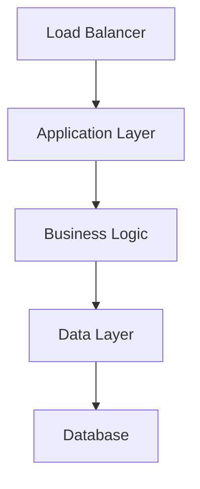

# Cost Optimization Tooling - Engineering Handbook

**Version:** 1.0.0 | **Last Updated:** 2025-11-10

## Overview

This handbook defines the engineering standards, code quality requirements, and best practices specific to Cost Optimization Tooling. It extends the [Enterprise Engineer's Handbook](../../../docs/PRJ-MASTER-HANDBOOK/README.md) with project-specific guidance.

## Table of Contents

1. [Architecture Overview](#architecture-overview)
2. [Code Standards](#code-standards)
3. [Testing Requirements](#testing-requirements)
4. [Security Guidelines](#security-guidelines)
5. [Deployment Standards](#deployment-standards)
6. [Monitoring & Observability](#monitoring--observability)

---

## Architecture Overview

### System Components



### Technology Stack

- **Runtime:** Python 3.9+
- **Framework:** FastAPI / Flask
- **Database:** PostgreSQL 14+
- **Cache:** Redis 7+
- **Infrastructure:** AWS / Terraform
- **Orchestration:** Kubernetes 1.27+

### Design Principles

- **Scalability:** Horizontal scaling via containerization
- **Reliability:** ≥99.9% uptime target
- **Security:** Zero-trust architecture
- **Observability:** Full instrumentation with OpenTelemetry

---

## Code Standards

### Python Style Guide

- **PEP 8 compliance** with max line length 100
- **Type hints** required for all functions
- **Docstrings** in Google style format

**Example:**

```python
def process_data(
    input_data: Dict[str, Any],
    validate: bool = True
) -> Tuple[bool, Optional[str]]:
    """
    Process input data with optional validation.

    Args:
        input_data: Dictionary containing data to process
        validate: Whether to validate input before processing

    Returns:
        Tuple of (success: bool, error_message: Optional[str])

    Raises:
        ValueError: If input_data is empty and validate=True
    """
    if validate and not input_data:
        raise ValueError("input_data cannot be empty")

    # Process data
    return True, None
```

### Code Review Checklist

- [ ] All functions have type hints and docstrings
- [ ] No hardcoded credentials or secrets
- [ ] Error handling for all external calls
- [ ] Logging added for debugging
- [ ] Unit tests cover new code (≥80%)
- [ ] Integration tests for API changes
- [ ] Security review completed

---

## Testing Requirements

### Coverage Targets

- **Unit Tests:** ≥80% code coverage
- **Integration Tests:** All API endpoints
- **E2E Tests:** Critical user flows
- **Performance Tests:** Load testing for >100 req/sec

### Test Organization

```
tests/
├── unit/                 # Fast, isolated tests
│   ├── test_services.py
│   └── test_utils.py
├── integration/          # Tests with external dependencies
│   ├── test_api.py
│   └── test_database.py
├── e2e/                  # Full workflow tests
│   └── test_user_flow.py
└── performance/          # Load and stress tests
    └── load_test.py
```

### Running Tests

```bash
# All tests
make test

# Specific test types
pytest tests/unit -v
pytest tests/integration -v --cov=src

# With coverage report
make test-coverage
```

---

## Security Guidelines

### Authentication & Authorization

- **API Keys:** Rotate every 90 days
- **IAM Roles:** Use instance profiles, not hardcoded credentials
- **Least Privilege:** Grant minimum required permissions

### Input Validation

```python
from pydantic import BaseModel, Field, validator

class InputRequest(BaseModel):
    user_id: int = Field(..., gt=0, description="User ID must be positive")
    email: str = Field(..., regex=r"^[\w._%+-]+@[\w.-]+\.[A-Z]{2,}$")

    @validator('email')
    def email_must_be_lowercase(cls, v):
        return v.lower()
```

### Secrets Management

```python
import boto3

def get_secret(secret_name: str) -> str:
    """Fetch secret from AWS Secrets Manager"""
    client = boto3.client('secretsmanager')
    response = client.get_secret_value(SecretId=secret_name)
    return response['SecretString']

# Usage
DB_PASSWORD = get_secret('prod/database/password')
```

---

## Deployment Standards

### Environment Configuration

| Environment | Branch | Approval | Auto-Deploy |
|------------|--------|----------|-------------|
| Development | develop | None | Yes |
| Staging | main | 1 reviewer | Yes |
| Production | release/* | 2 reviewers | Manual |

### Deployment Checklist

- [ ] All tests passing
- [ ] Security scan completed (no critical issues)
- [ ] Performance tests passed
- [ ] Rollback plan documented
- [ ] Change ticket created
- [ ] Deployment window scheduled
- [ ] Stakeholders notified

### Blue/Green Deployment

```bash
# Deploy to green environment
terraform apply -target=aws_instance.green

# Run smoke tests
./scripts/smoke_test.sh green

# Switch traffic to green
terraform apply -var="active_env=green"

# Monitor for 10 minutes
# If issues, rollback:
terraform apply -var="active_env=blue"
```

---

## Monitoring & Observability

### Required Metrics

All services must expose:

- **Request Rate:** Requests per second
- **Error Rate:** 5xx errors per minute (target: <0.1%)
- **Latency:** P50, P95, P99 response times
- **Saturation:** CPU, memory, disk usage

### Structured Logging

```python
import structlog

logger = structlog.get_logger()

logger.info(
    "user_login",
    user_id=user.id,
    ip_address=request.ip,
    duration_ms=45,
    status="success"
)
```

### Alerting Rules

```yaml
# Prometheus alerts
groups:
  - name: cost-optimization
    rules:
      - alert: HighErrorRate
        expr: rate(http_requests_total{status=~"5.."}[5m]) > 0.05
        annotations:
          summary: "Error rate above 5%"
          runbook: "docs/RUNBOOK.md#high-error-rate"
```

---

## References

- [Enterprise Engineer's Handbook](../../../docs/PRJ-MASTER-HANDBOOK/README.md)
- [IT Playbook](../../../docs/PRJ-MASTER-PLAYBOOK/README.md)
- [Configuration Guide](../../../CONFIGURATION_GUIDE.md)

---

**Maintained by:** Cost Optimization Tooling Team
**Last Review:** 2025-11-10
