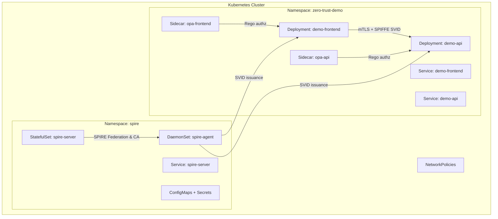

# P11 Zero-Trust Security Portfolio Deliverables

This document fulfills the Master Factory Prompt requirements for the P11 Zero-Trust Security project. It supplements the lab README and Kubernetes manifests with enterprise-grade planning, operations, and validation artifacts.

---
## 1. Executive Summary
- **Overview:** Implements a SPIRE-based workload identity plane with OPA sidecar authorization and Kubernetes NetworkPolicies to demonstrate zero-trust controls across services and namespaces.
- **Business Impact:** Reduces unauthorized service-to-service access, enforces policy-as-code, and delivers attested identities to accelerate compliance (SOC 2, PCI DSS segmentation) and incident containment.
- **Technical Value Proposition:**
  - Mutual attestation (SPIFFE/SPIRE) for workloads across nodes.
  - Runtime authorization with OPA + Rego policies scoped per service.
  - Defense-in-depth via Kubernetes NetworkPolicies and namespace isolation.
- **Success Metrics & KPIs:**
  - ≥95% of inter-service calls authenticated with SPIFFE SVIDs.
  - Mean time to revoke compromised identity ≤10 minutes via SPIRE entry deletion.
  - ≥90% policy changes merged with automated Rego tests in CI.
  - Zero unauthorized namespace egress in network policy audit (e.g., `kubectl netpol audit`).

---
## 2. README Documentation
A concise operator guide aligned to the provided manifests:
- **Setup & Deployment:**
  1. `kubectl apply -f k8s/namespaces.yaml`
  2. `kubectl apply -f k8s/spire-server.yaml`
  3. `kubectl apply -f k8s/spire-agent.yaml`
  4. `kubectl apply -f k8s/opa-config.yaml`
  5. `kubectl apply -f k8s/demo-apps.yaml`
  6. `kubectl apply -f k8s/network-policies.yaml`
- **Architecture Overview:** SPIRE server (stateful) issues SVIDs to node-bound SPIRE agents; demo frontend/API pods run OPA sidecars enforcing Rego policy; NetworkPolicies restrict east-west traffic.
- **API Notes:** Demo API exposes `/healthz` and `/data` (mock) via ClusterIP; frontend calls API using in-cluster DNS `demo-api.zero-trust-demo.svc.cluster.local`.
- **Configuration Guide:**
  - Update `k8s/opa-config.yaml` to modify Rego allow lists.
  - Register additional workloads via SPIRE entries in `k8s/spire-server.yaml` ConfigMap (`server.conf` updates and `workload-registrations` CM).
  - Override container images in `k8s/demo-apps.yaml` via `values` or direct edits.

---
## 3. Architecture Diagram Pack

### 3.1 System Architecture (Mermaid)


### 3.2 ASCII Topology
```
[Kubernetes Cluster]
  [Namespace: spire]
    - spire-server StatefulSet + Service
    - spire-agent DaemonSet on each node
  [Namespace: zero-trust-demo]
    - demo-frontend (with OPA sidecar) + Service
    - demo-api (with OPA sidecar) + Service
  [NetworkPolicies]
    - Ingress allowlists: frontend<-API, API<-frontend
    - Deny all egress except kube-dns + allowed services
```

### 3.3 Data Flow
1. SPIRE server bootstraps CA and publishes bundle via SPIRE endpoints service.
2. SPIRE agents attest nodes and issue SVIDs to pods based on registration entries.
3. Demo frontend obtains SVID, calls demo API using SPIFFE identity; API validates peer via OPA policy (identity + path).
4. NetworkPolicies enforce that only allowed namespace and service pairs communicate.

### 3.4 Deployment Topology
- Multi-node cluster with `spire` control-plane namespace and `zero-trust-demo` workload namespace.
- SPIRE agent DaemonSet ensures identity coverage per node.
- Sidecar pattern for OPA to localize policy decision and cache bundles.

---
## 4. Code Generation Prompts
Actionable prompts for extending the stack:
- **Terraform (EKS/GKE/AKS) Baseline:**
  - "Generate Terraform to provision an EKS cluster with IRSA-enabled service accounts, public+private subnets, and Calico network policy enforcement. Include outputs for kubeconfig and cluster endpoint, and create namespaces `spire` and `zero-trust-demo`."
- **Backend Service:**
  - "Create a Go microservice exposing `/healthz` and `/data` that validates incoming SPIFFE IDs from mutual TLS certs, failing closed if the SAN does not match `spiffe://example.org/ns/zero-trust-demo/sa/demo-api`. Add unit tests for identity parsing."
- **Frontend Component:**
  - "Build a React component that calls `/data` via fetch, includes a spinner, error banner, and renders JSON payload. Add jest tests for success and error states."
- **Containerization:**
  - "Write a Dockerfile using distroless for the Go API, multi-stage building binaries with `CGO_ENABLED=0`. Include a Kubernetes Deployment manifest with SPIFFE-enabled annotations and OPA sidecar." 
- **CI/CD (GitHub Actions):**
  - "Create a workflow that runs `go test ./...`, `npm test`, OPA policy checks via `opa test`, builds and pushes images to GHCR, and applies manifests to a staging cluster using `kubectl` with OIDC-auth."
- **Observability Instrumentation:**
  - "Add OpenTelemetry tracing/exporters to the Go API (OTLP/gRPC), inject trace context headers into frontend calls, and configure Prometheus scraping annotations on both Deployments."

---
## 5. Testing Suite
- **Strategy:** Shift-left with policy testing (Rego), unit testing for identity validation, and integration tests using `kind` + `kubectl` to assert NetworkPolicies and OPA decisions.
- **Test Plan:**
  - Unit: Go identity parser, React component rendering, OPA Rego rules (`opa test`).
  - Integration: `kubectl exec` curls from allowed/denied pods; verify only authorized paths succeed.
  - Performance: `hey` or `k6` from a test pod to measure p99 latency under mTLS + OPA.
  - Security: SVID revocation test by deleting SPIRE entry and asserting 401/403 responses; port scanning inside namespace should be blocked by NetworkPolicies.
- **Test Cases (examples):**
  - `TC-001`: Given valid SPIFFE ID, API returns 200; invalid ID yields 403 (OPA policy). Acceptance: HTTP 200/403 as expected.
  - `TC-002`: From unauthorized namespace pod, traffic to demo-api is dropped. Acceptance: connection timeout/refused within 5s.
  - `TC-003`: OPA policy update rejecting `/admin` path returns 403 while `/healthz` remains 200.
- **API Testing Specs:** Use `newman` or `curl` with client certs issued by SPIRE; include SAN validation.
- **Security Testing:** Run `trivy` on images, `kubescape` for K8s posture, `opa eval` to dry-run policies, and CA rotation rehearsal.
- **Performance Testing:** 500 RPS for 5 minutes; SLO p99 < 250ms with sidecars.
- **CI Quality Gates:** Lint, unit tests, `opa test`, SAST (CodeQL), image scanning, and deployment dry-run via `kubeconform`.

---
## 6. Operational Documents
- **Operational Playbook:**
  - Daily: check SPIRE server health (`kubectl get pods -n spire`), validate bundle expiry.
  - Weekly: rotate server keypair; re-run `opa test` on policy repo.
- **Runbook (Common Procedures):**
  - Identity revoke: delete SPIRE entry (`spire-server entry delete -entryID <id>`), restart pod to force re-attestation.
  - Policy rollback: revert Rego bundle in ConfigMap and `kubectl rollout restart deploy/demo-frontend demo-api -n zero-trust-demo`.
  - Network lock-down: apply deny-all egress policy, then layer allow rules.
- **SOP:**
  - Change management requires PR with approvals and passing CI gates.
  - Secrets stored in Kubernetes secrets sealed with SealedSecrets/externally via Vault.
- **On-call Guide & Escalation:**
  - Sev1: Traffic outage -> page on-call SRE; rollback latest policy; check SPIRE server liveness.
  - Escalation matrix: SRE -> Security Engineering -> Platform Lead.
- **Data Migration Runbook:**
  - Not data-centric; focus on rotating SPIRE bundles and migrating policies by version tags. Validate with shadow policies before cutover.

---
## 7. Reporting Package
- **Status Template:** Weekly summary covering uptime %, policy change volume, incidents, and remediation actions.
- **KPI/OKR Tracking:** Table capturing SLO adherence, mean policy review time, number of blocked unauthorized requests.
- **Findings & Recommendations:**
  - Enforce mandatory Rego unit tests; adopt bundle server for policy distribution.
  - Integrate SPIRE with external PKI for production.
- **ROI Analysis:** Reduced breach blast radius -> projected savings via faster containment; lower audit effort through repeatable identity evidence.
- **Timeline & Milestones:**
  - Week 1: Cluster + SPIRE bootstrap
  - Week 2: OPA integration and NetworkPolicies
  - Week 3: CI/CD with policy gates
  - Week 4: Observability + chaos tests

---
## 8. Metrics & Observability
- **SLO/SLI:**
  - Availability SLO 99.9% for demo API; error budget 43.2 min/month.
  - Authz decision latency SLI: p99 < 50ms within pod.
  - Certificate issuance success rate ≥99%.
- **PromQL Queries:**
  - `histogram_quantile(0.99, sum(rate(http_request_duration_seconds_bucket{service="demo-api"}[5m])) by (le))`
  - `sum(rate(opa_decision_total{decision="allow"}[5m])) by (policy)`
  - `sum(rate(spire_agent_svid_issue_count[5m]))`
- **Dashboard Specs:** Panels for API latency, OPA decisions, SVID issuance, pod restarts, and network policy denied connections (via CNI metrics if available).
- **Logging Strategy:**
  - Structured JSON logs with trace IDs; OPA decision logs shipped to Elasticsearch/Loki with retention 30d.
- **Distributed Tracing:**
  - OpenTelemetry instrumentation in API and frontend; propagate `traceparent` header; export to OTLP collector.

---
## 9. Security Package
- **STRIDE + MITRE ATT&CK Threat Model:**
  - Spoofing: unauthorized workloads -> mitigated by SPIFFE SVID and NetworkPolicies.
  - Tampering: policy config -> mitigated by GitOps + signed images.
  - Repudiation: audit logs from OPA decisions and Kubernetes API server.
  - Information Disclosure: TLS everywhere; restrict egress.
  - Denial of Service: rate limiting at API/ingress; resource limits on pods.
  - Elevation of Privilege: least-privilege RBAC; SPIRE entries scoped per SA/namespace.
  - MITRE: T1078 (valid accounts) mitigated via SPIRE revocation; T1557 (man-in-the-middle) mitigated via mTLS; T1040 (network sniffing) mitigated via encryption + policy.
- **Access Control Matrix:**
  - SPIRE server SA: manage entries in `spire` namespace only.
  - Demo frontend SA: call demo API; blocked from kube-system.
  - Demo API SA: no outbound except kube-dns.
- **Encryption & Key Management:** Self-signed demo CA; recommend integrating HSM/KMS for server keys; rotate bundles every 30 days.
- **Secrets Management:** Kubernetes Secrets for demo; production via Vault + CSI driver; avoid embedding secrets in ConfigMaps.
- **Compliance Mapping:**
  - SOC 2 CC6/CC7: identity and access control via SPIFFE + OPA.
  - PCI DSS 4.0 Req 7: least privilege enforced by policies and NetworkPolicies.

---
## 10. Risk Management
| ID | Risk | Likelihood | Impact | Mitigation | Owner | Residual |
|----|------|------------|--------|------------|-------|----------|
| R1 | SPIRE server outage | M | H | HA StatefulSet, PVC-backed data, probes | Platform | M |
| R2 | Policy misconfiguration blocking traffic | M | H | Stage policies, `opa test`, canary rollout | AppSec | M |
| R3 | Stale certificates | M | M | Short-lived SVIDs, automated rotation | Platform | L |
| R4 | CNI not enforcing NetworkPolicies | L | H | Validate CNI support pre-deploy | SRE | M |
| R5 | Image vulnerabilities | M | H | Scan with Trivy/Grype; rebuild regularly | SecOps | M |
| R6 | Log PII exposure | L | M | Mask sensitive fields; retention policies | AppSec | L |
| R7 | Unauthorized namespace egress | M | H | Default deny + allowlist egress | SRE | L |
| R8 | Supply chain attack on sidecars | L | H | Sign images (Sigstore), verify in admission | Platform | M |
| R9 | Clock drift affecting cert validity | M | M | NTP sync on nodes | SRE | L |
| R10| Privilege escalation via misbound SA | L | H | RBAC reviews, bound SA to namespace | SecOps | L |

---
## 11. Architecture Decision Records
- **ADR-001: Identity Plane via SPIFFE/SPIRE**
  - Decision: Use SPIRE server/agent for workload identity.
  - Consequences: Requires DaemonSet agents; strong SVID guarantees.
- **ADR-002: Sidecar Authorization with OPA**
  - Decision: Embed OPA sidecar per pod for local decisions.
  - Consequences: Additional resource overhead; near-zero network latency for authz.
- **ADR-003: Namespace Isolation with NetworkPolicies**
  - Decision: Default deny ingress/egress with explicit allow between frontend/API.
  - Consequences: Must maintain DNS and metrics allowlists.
- **ADR-004: GitOps for Policy Delivery**
  - Decision: Manage Rego via ConfigMaps and pipeline with `opa test`.
  - Consequences: Requires CI/CD hooks; easier rollbacks and audits.
- **ADR-005: Observability via OpenTelemetry + Prometheus**
  - Decision: Standardize tracing/metrics to simplify SLO tracking.
  - Consequences: Need exporters and scrape configs; consistent headers.

---
## 12. Business Value Narrative
- **Business Case:** Zero-trust reduces lateral movement and meets compliance needs. Demonstrable SPIRE + OPA deployment showcases practical skills in identity-first security.
- **Recruiter-Ready Summary:** Built an end-to-end Kubernetes zero-trust lab with workload identity, policy-as-code, and network isolation; includes CI/CD and observability hooks.
- **Skills Demonstrated:** Kubernetes operations, SPIFFE/SPIRE, OPA/Rego, NetworkPolicies, GitOps, security engineering, SRE observability.
- **Career Relevance:** Highlights capability to design and run secure microservices platforms with modern identity and authorization controls.

---
## Validation Checklist Mapping
- All 12 mandatory sections provided.
- Mermaid diagram syntactically valid; ASCII alternative included.
- Risk register contains ≥10 risks with mitigation.
- STRIDE coverage provided; MITRE mappings included.
- ADRs ADR-001 through ADR-005 completed.
- Instructions reference concrete code/manifests in `k8s/` with actionable guidance.
