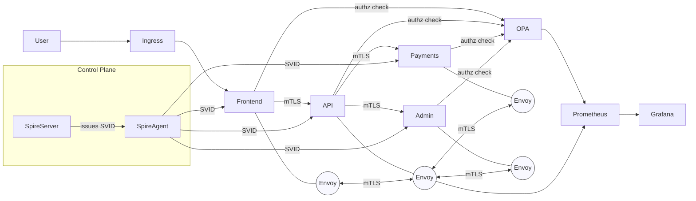
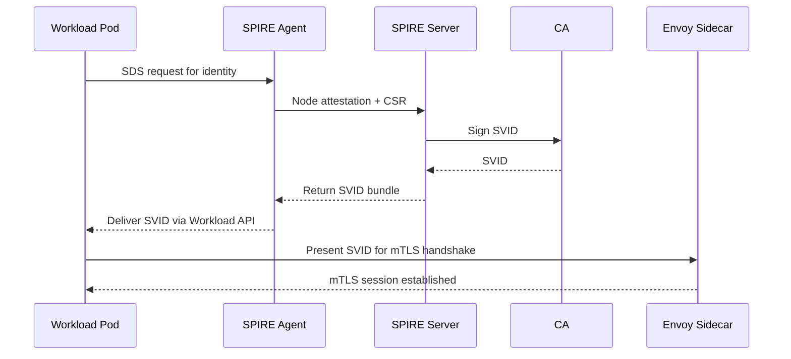
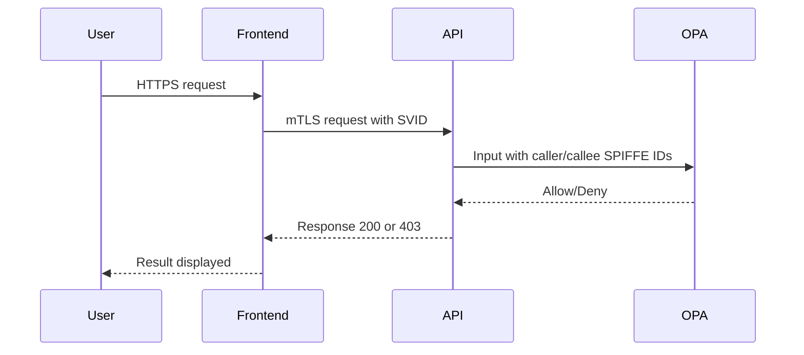

# Architecture Diagrams

## High-Level Zero-Trust Architecture

_Render this Mermaid as a 3000x2000 PNG with transparent background._

## SPIRE Identity Flow

_Render this Mermaid as a 2400x1200 PNG._

## Request Authorization Flow

_Render this Mermaid as a 2000x1200 PNG._
