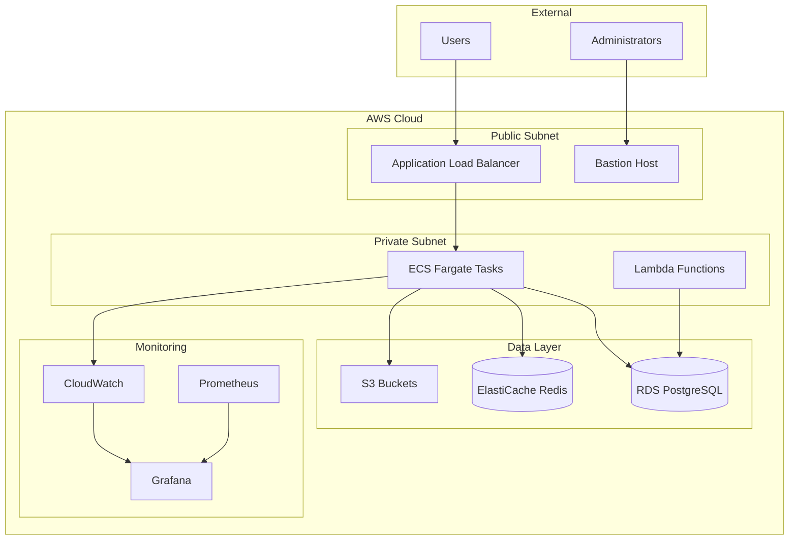
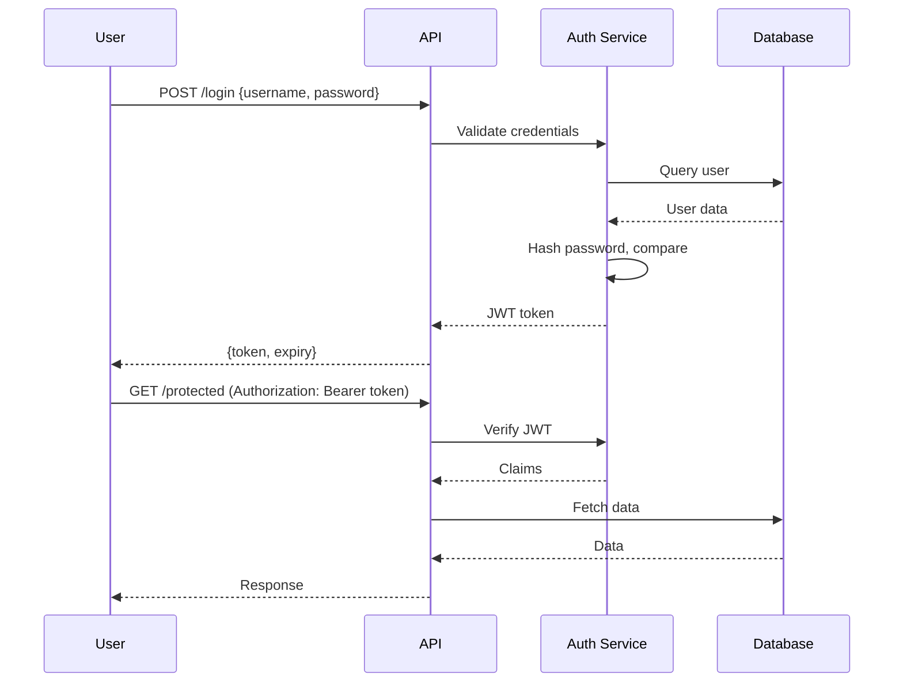

# Incident Response Automation - Architecture Documentation

**Version:** 1.0.0 | **Last Updated:** 2025-11-10

## System Overview

Incident Response Automation is built following cloud-native architecture principles with a focus on scalability, reliability, and security.

## Architecture Diagram



## Technology Stack

### Application Layer
- **Runtime:** Python 3.9+
- **Framework:** FastAPI
- **Web Server:** Uvicorn

### Data Layer
- **Database:** PostgreSQL 14 (RDS)
- **Cache:** Redis 7 (ElastiCache)
- **Storage:** S3

### Infrastructure
- **Compute:** ECS Fargate
- **Load Balancer:** Application Load Balancer
- **DNS:** Route 53
- **CDN:** CloudFront

### Observability
- **Metrics:** Prometheus + CloudWatch
- **Logs:** CloudWatch Logs
- **Traces:** AWS X-Ray
- **Dashboards:** Grafana

## Component Details

### Application Service

**Responsibilities:**
- Handle HTTP requests
- Business logic execution
- Data validation
- API rate limiting

**Scaling:**
- Horizontal: 2-10 ECS tasks based on CPU
- Vertical: 2 vCPU, 4GB RAM per task

### Database Layer

**Configuration:**
- Instance: db.t3.medium (2 vCPU, 4GB RAM)
- Storage: 100GB gp3 SSD
- Backups: Daily, 7-day retention
- Multi-AZ: Yes (production)

**Connection Pooling:**
- Pool size: 20 connections
- Timeout: 30 seconds

### Cache Layer

**Configuration:**
- Node type: cache.t3.micro
- Cluster mode: Disabled
- Eviction policy: allkeys-lru
- TTL: 1 hour default

## Security Architecture

### Network Security

```
Internet
  ↓
WAF (AWS WAF)
  ↓
CloudFront (HTTPS only)
  ↓
ALB (Public Subnet)
  ↓
ECS Tasks (Private Subnet)
  ↓
RDS/Redis (Private Subnet, isolated security groups)
```

### Authentication Flow



## Data Flow

### Write Path

1. Client sends POST request to ALB
2. ALB routes to healthy ECS task
3. Application validates input (Pydantic models)
4. Data written to PostgreSQL
5. Cache invalidated (Redis)
6. Success response returned

### Read Path

1. Client sends GET request to ALB
2. Application checks Redis cache
3. If cache hit: return data immediately
4. If cache miss: query PostgreSQL
5. Store result in Redis (TTL: 1 hour)
6. Return data to client

## Deployment Architecture

### Blue/Green Deployment

```
┌─────────────────────────────────────┐
│   Application Load Balancer         │
│   (Routes traffic to active env)    │
└──────────┬──────────────────────────┘
           │
     ┌─────┴─────┐
     │           │
┌────▼───┐  ┌───▼─────┐
│ Blue   │  │ Green   │
│ v1.2.3 │  │ v1.2.4  │
│(Active)│  │(Standby)│
└────────┘  └─────────┘
```

### CI/CD Pipeline

```
GitHub Push
  ↓
GitHub Actions
  ├─ Lint
  ├─ Test
  ├─ Security Scan
  ├─ Build Docker Image
  └─ Push to ECR
  ↓
Terraform Apply
  ├─ Update Task Definition
  └─ Update ECS Service
  ↓
Smoke Tests
  ├─ Health Check
  ├─ API Tests
  └─ Performance Tests
  ↓
Production Deploy
```

## Scalability

### Horizontal Scaling

| Component | Min | Max | Trigger |
|-----------|-----|-----|---------|
| ECS Tasks | 2 | 10 | CPU >70% |
| RDS Read Replicas | 0 | 3 | Read latency >100ms |

### Vertical Scaling

- ECS Task CPU/Memory can be increased via task definition
- RDS instance type can be changed (requires brief downtime)

### Database Sharding

For >10M records, implement sharding strategy:
- Shard by user_id hash
- 4 shards (expandable to 16)
- Consistent hashing for shard assignment

## Disaster Recovery

### Backup Strategy

- **RDS:** Automated daily snapshots (7-day retention)
- **Redis:** No persistence (cache only)
- **S3:** Versioning enabled, lifecycle policy to Glacier

### Recovery Procedures

| Scenario | RTO | RPO | Procedure |
|----------|-----|-----|-----------|
| AZ Failure | 5 min | 0 | Auto-failover to standby AZ |
| Region Failure | 1 hour | 15 min | Restore from snapshot in DR region |
| Data Corruption | 2 hours | 1 hour | Point-in-time recovery |

## Performance Characteristics

### Expected Latency

- **P50:** 50ms
- **P95:** 200ms
- **P99:** 500ms

### Throughput Capacity

- **Reads:** 1000 req/sec
- **Writes:** 200 req/sec

### Resource Utilization (Normal Load)

- **CPU:** 30-50%
- **Memory:** 40-60%
- **Database Connections:** 10-15 active

## Decision Records

### ADR-001: Why FastAPI over Flask

**Context:** Need high-performance async API framework

**Decision:** Use FastAPI

**Rationale:**
- Built-in async/await support
- Automatic API documentation (OpenAPI)
- Type validation with Pydantic
- 2-3x faster than Flask in benchmarks

### ADR-002: Why ECS Fargate over EC2

**Context:** Need container orchestration

**Decision:** Use ECS Fargate

**Rationale:**
- No server management overhead
- Pay only for compute time used
- Automatic scaling
- Integration with AWS services

---

**Maintained by:** Platform Engineering Team
**Last Review:** 2025-11-10
