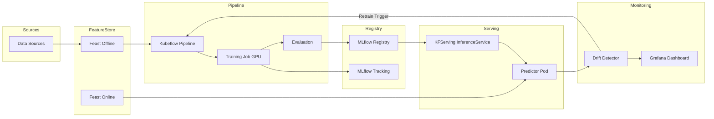
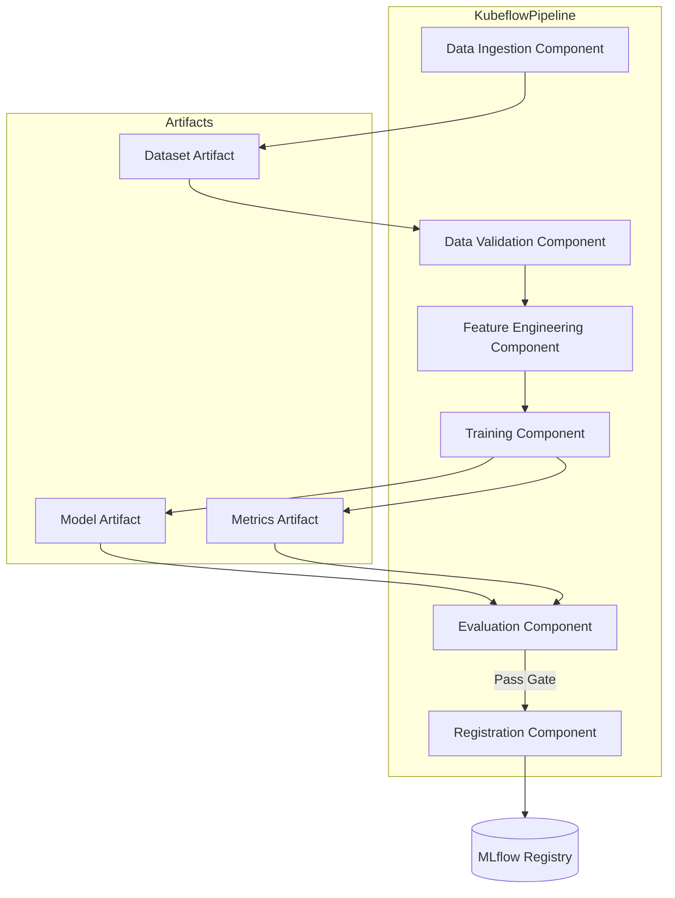
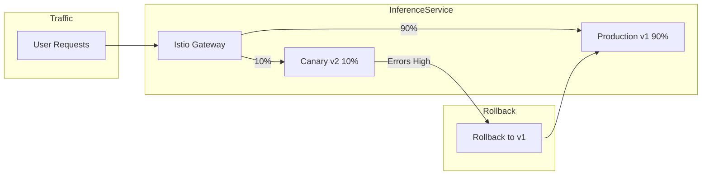
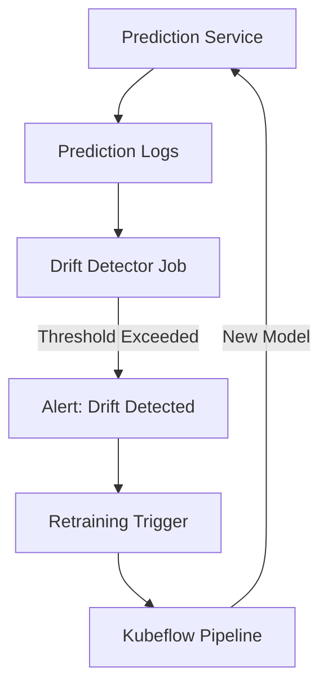

# P07 Architecture Diagrams

## End-to-End ML Lifecycle

**Explanation:** Data flows from sources into Feast offline store for training. Kubeflow pipelines orchestrate training on GPU nodes, log experiments to MLflow, and register models. Approved models deploy to KFServing inference services backed by Feast online features. Drift detectors monitor predictions and feature distributions, triggering retraining when thresholds are breached. Dashboards visualize model performance and infrastructure health.

## Pipeline Topology

**Explanation:** Each pipeline component is a containerized step with defined inputs/outputs. Data ingestion loads raw data and outputs a dataset artifact. Validation runs quality checks (Great Expectations). Feature engineering pulls from Feast or computes on-the-fly. Training component consumes features and produces a model artifact plus metrics. Evaluation compares against baseline; if passing, registration component uploads model to MLflow registry with metadata (git SHA, dataset version, approver).

## Serving Strategies

**Explanation:** KFServing leverages Istio VirtualServices for traffic splitting. New model version (v2) receives 10% canary traffic while v1 serves 90%. Monitoring compares error rates and latency; if v2 exceeds thresholds, traffic reverts to v1. Alternatively, shadow mode can mirror traffic to v2 without affecting responses, and A/B testing routes based on user cohort. Rollout completes when v2 metrics match or beat v1.

## Drift Detection & Retraining Loop

**Explanation:** Prediction service logs feature vectors and predictions to a data sink (S3/BigQuery). Drift detector runs periodically (hourly/daily), computing statistical tests (KS test, PSI, KL divergence) between current and reference distributions. When drift score exceeds threshold, an alert fires and triggers a retraining pipeline run. The new model is evaluated, registered, and deployed if it improves over the current production model. This closes the loop, ensuring models adapt to evolving data patterns.
