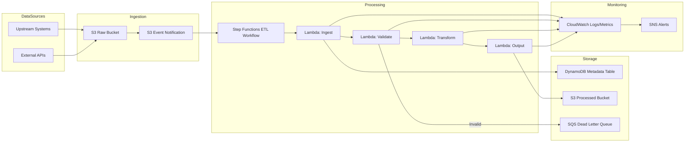
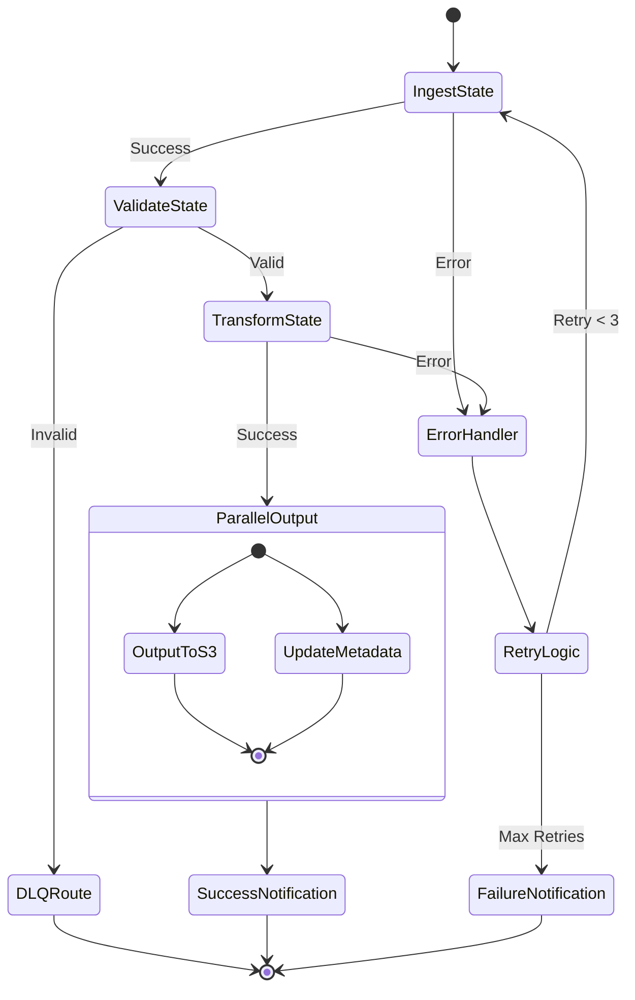
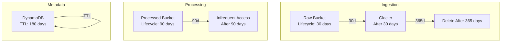
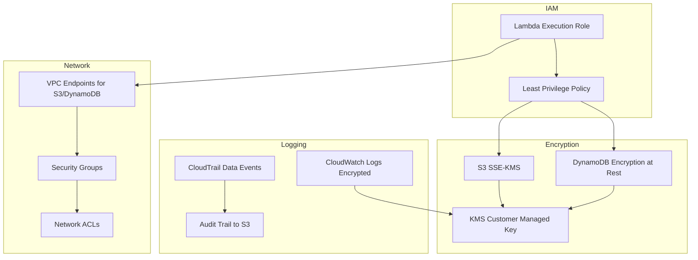
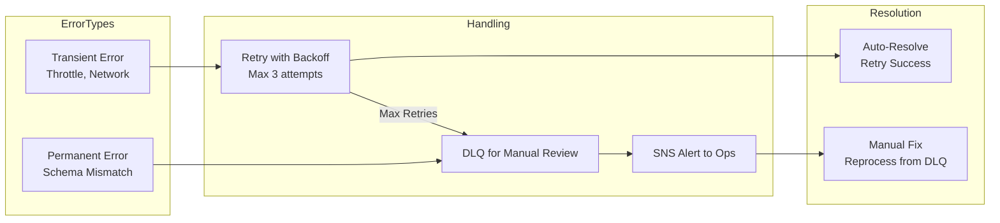
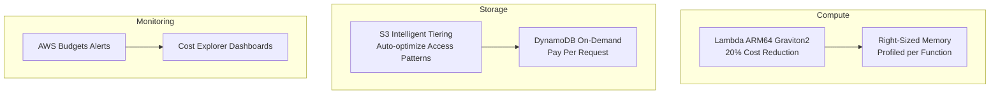

# P08 Architecture Diagrams

## Event-Driven ETL Flow

**Explanation:** Files land in raw S3 bucket, triggering EventBridge rules that start Step Functions workflows. The ingest Lambda writes metadata to DynamoDB and passes data to validate Lambda. Invalid records route to DLQ; valid records proceed to transform Lambda for business logic application, then output Lambda writes to processed bucket. CloudWatch captures logs/metrics; SNS sends alerts on failures.

## Step Functions State Machine

**Explanation:** State machine orchestrates Lambda invocations with explicit error handling. Ingest and Transform states have retry logic (3 attempts with exponential backoff). Validation failures route to DLQ without retry (data quality issue). Parallel state writes output to S3 and updates DynamoDB concurrently. Catch blocks handle Lambda errors and send SNS notifications.

## Data Lifecycle & Retention

**Explanation:** Raw files transition to Glacier after 30 days for archival, deleted after 365 days for compliance. Processed files move to Infrequent Access tier after 90 days (cost optimization). DynamoDB items have 180-day TTL to auto-expire old metadata. Lifecycle policies configured via S3 object lifecycle rules and DynamoDB TTL attribute.

## Security Architecture

**Explanation:** Lambda functions assume execution role with least privilege IAM policies (read raw bucket, write processed bucket, DynamoDB access). S3 and DynamoDB encrypted with KMS CMK for key rotation and auditability. Lambdas deployed in VPC with VPC endpoints to avoid internet routing. CloudTrail logs S3 data events; CloudWatch logs encrypted with KMS. Security groups and NACLs restrict network traffic.

## Error Handling & Retry Strategy

**Explanation:** Step Functions retry logic differentiates transient vs permanent errors. Transient errors (DynamoDB throttling, network timeouts) trigger exponential backoff retries (3 attempts, 2s/4s/8s delays). Permanent errors (schema validation failures, malformed JSON) skip retries and route directly to DLQ. SNS alerts fire on DLQ arrival and max retry exhaustion. Operators review DLQ, fix root cause, and replay messages via Step Functions re-execution.

## Cost Optimization Architecture

**Explanation:** Lambdas use ARM64 architecture for 20% cost savings. Memory allocations tuned per function (ingest 512MB, validate 256MB, transform 1024MB, output 512MB) based on profiling. S3 Intelligent Tiering auto-adjusts storage class. DynamoDB on-demand pricing eliminates over-provisioning. AWS Budgets alert at 80%/100% thresholds; Cost Explorer tracks daily spend by service/tag.
