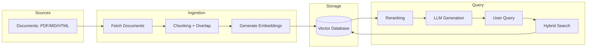
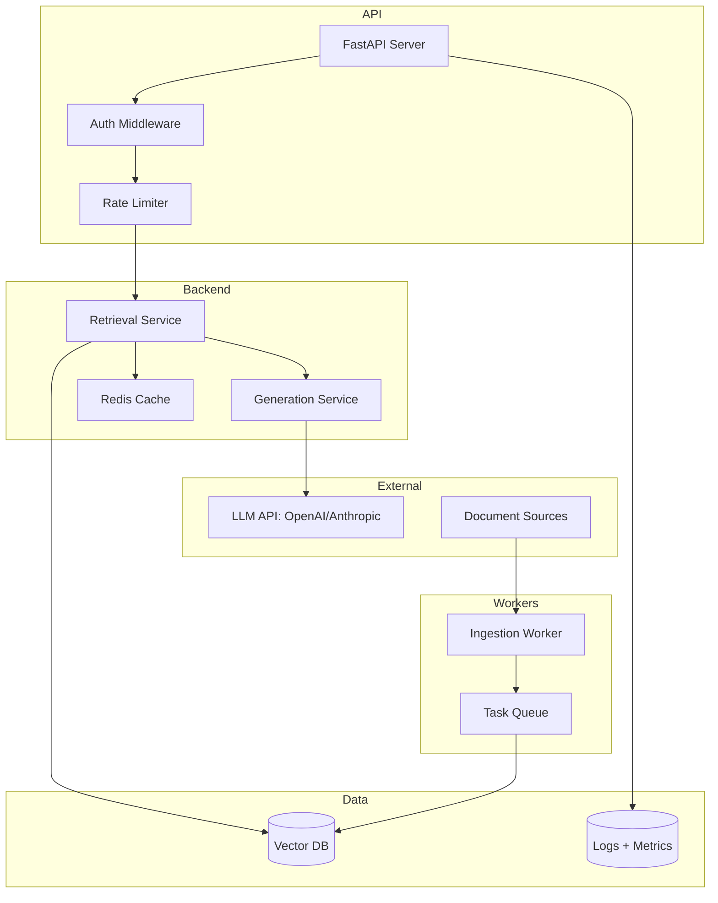
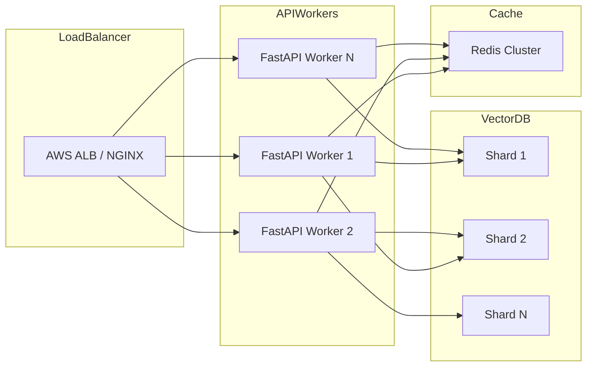
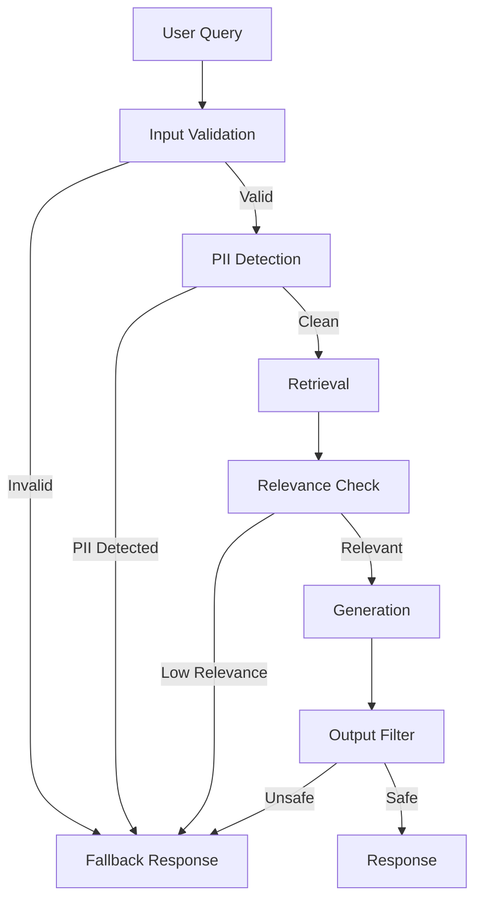

# P09 Architecture Diagrams

## End-to-End RAG Flow

**Explanation:** Documents are fetched, chunked with overlap, and embedded using sentence-transformers or OpenAI. Vectors are stored in a database (Pinecone/pgvector/Weaviate). When users query, hybrid search (semantic + keyword) retrieves candidates, cross-encoder reranks them, and the LLM generates a grounded response using the top-k contexts.

## Component View

**Explanation:** FastAPI handles incoming requests through auth and rate limiting middleware. Retrieval service queries the vector DB and cache for relevant context. Generation service calls LLM with retrieved context. Ingestion workers run asynchronously, processing documents from queue. All interactions are logged for observability.

## Scaling Path

**Explanation:** Load balancer distributes traffic across multiple FastAPI workers. Vector database is sharded for horizontal scaling. Redis cluster provides distributed caching for frequently accessed embeddings and responses. Auto-scaling groups adjust worker count based on request rate.

## Fallback & Guardrails

**Explanation:** Multiple safety checks guard against bad inputs and outputs. Input validation catches malformed queries, PII detection blocks sensitive data, relevance check ensures retrieved context is useful, and output filter scans for hallucinations or unsafe content. Fallback responses handle edge cases gracefully.
