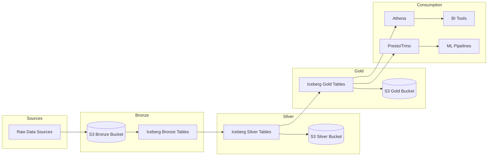
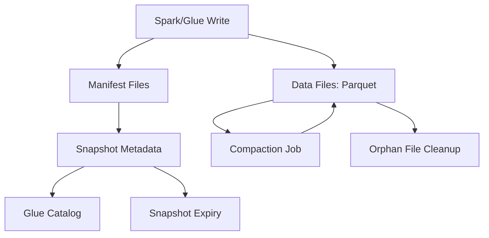
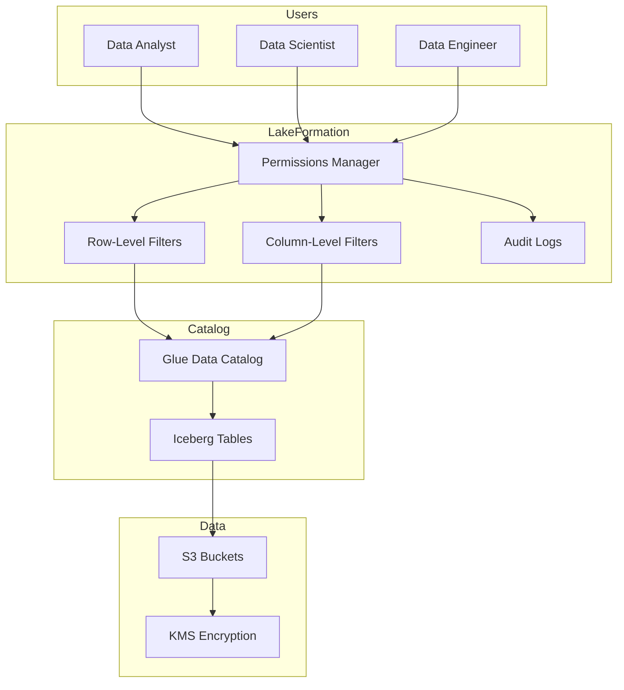
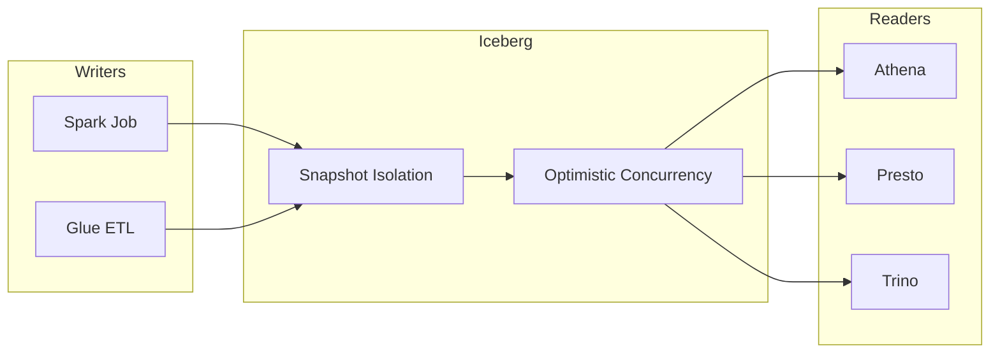

# P10 Architecture Diagrams

## End-to-End Data Flow

**Explanation:** Raw data lands in bronze S3 bucket and is written to bronze Iceberg tables by Spark/Glue jobs. Cleansing transforms bronze to silver, and aggregation creates gold tables. Multiple query engines (Athena, Presto, Trino) access gold tables for analytics and BI. Medallion architecture ensures data quality improves through each zone.

## Table Lifecycle

**Explanation:** Writes create Parquet data files and manifests tracking file locations. Snapshots provide point-in-time table versions registered in Glue Catalog. Maintenance jobs compact small files, expire old snapshots per retention policy, and remove orphan files not referenced by any snapshot.

## Governance Topology

**Explanation:** Lake Formation enforces fine-grained access control via row/column filters. Users request access through RBAC; filters apply transparently in Athena/Presto queries. All data access logged for compliance. Glue Catalog stores table metadata; S3 stores encrypted data.

## Multi-Engine Concurrency

**Explanation:** Iceberg provides snapshot isolation allowing concurrent reads and writes. Writers create new snapshots atomically; readers use consistent snapshot view. Optimistic concurrency control handles write conflicts via retry. Multiple engines (Spark, Athena, Presto, Trino) can safely access same tables simultaneously.
