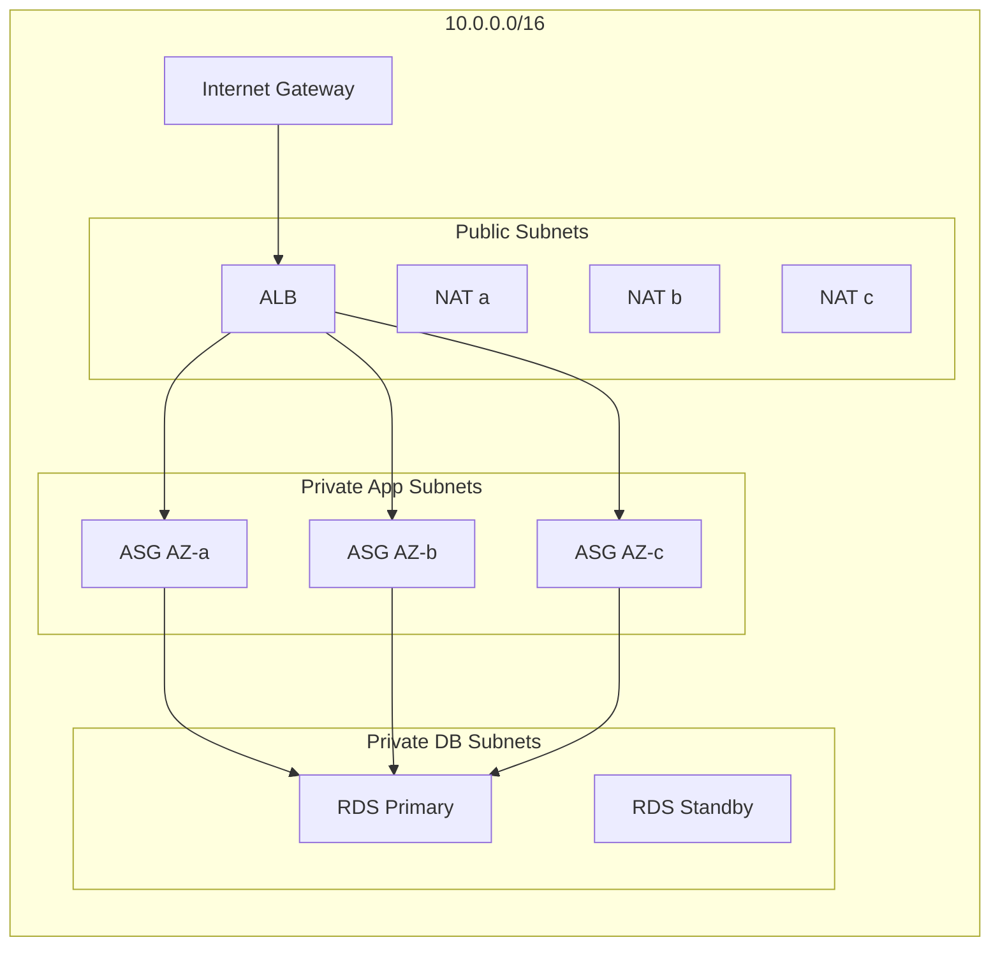

```mermaid
graph LR
  subgraph VPC[10.0.0.0/16]
    IGW[Internet Gateway]
    subgraph Public[Public Subnets]
      ALB
      NAT1[NAT a]
      NAT2[NAT b]
      NAT3[NAT c]
    end
    subgraph PrivateApp[Private App Subnets]
      ASG1[ASG AZ-a]
      ASG2[ASG AZ-b]
      ASG3[ASG AZ-c]
    end
    subgraph PrivateDB[Private DB Subnets]
      RDS1[RDS Primary]
      RDS2[RDS Standby]
    end
  end
  IGW --> ALB
  ALB --> ASG1
  ALB --> ASG2
  ALB --> ASG3
  ASG1 --> RDS1
  ASG2 --> RDS1
  ASG3 --> RDS1
```
