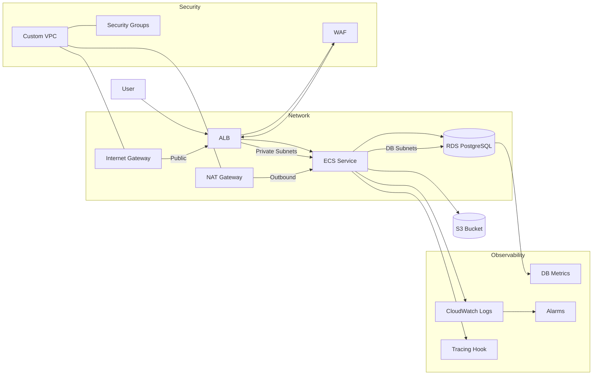

# Architecture Diagram Pack

## Mermaid: End-to-End Platform


## ASCII: Trust Boundaries & Data Flow
```
+-----------------------------------------------------------+
|                    AWS Account (Prod)                     |
|                                                           |
|  +---------------------+     +-------------------------+  |
|  |    Public Tier      |     |     Private Tier        |  |
|  |  ALB + WAF          | --> |  ECS Fargate Service    |  |
|  |  Health Checks      |     |  App Containers         |  |
|  +---------------------+     |  Sidecar: metrics/logs   |  |
|               |              +------------+------------+  |
|               |                           |               |
|               v                           v               |
|        +-------------+            +---------------+       |
|        | NAT Gateway |            | RDS PostgreSQL |       |
|        +-------------+            | (Multi-AZ, KMS) |       |
|                                     +-------+-------+       |
|                                             |               |
|                                    +--------v---------+     |
|                                    | CloudWatch/S3    |     |
|                                    | Logs, Alarms,    |     |
|                                    | Backup Storage   |     |
|                                    +------------------+     |
+-----------------------------------------------------------+
```

## Notes
- **Isolation:** Public-facing ALB only; app containers and database remain private with SG rules allowing least privilege.
- **Reliability:** Multi-AZ subnets with autoscaling ECS tasks and RDS failover support; NAT gateway redundancy optional.
- **Observability:** CloudWatch metrics/logs and tracing hooks power alerts tied to SLOs; S3 retains long-term audit logs.
- **Security:** WAF and SGs enforce ingress controls; encryption in transit and at rest across ALB, ECS, and RDS.
