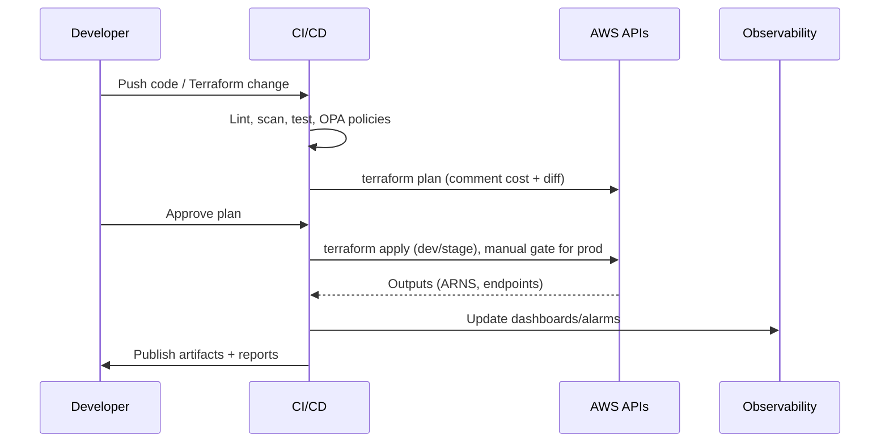

# Architecture Diagram Pack

## Mermaid: End-to-End Platform
```mermaid
graph LR
  user[User] --> cdn[CloudFront]
  cdn --> waf[WAF]
  waf --> alb[ALB]
  alb --> ecs[ECS Service]
  ecs --> rds[(RDS PostgreSQL)]
  ecs --> cache[ElastiCache (optional)]
  ecs --> s3[(S3 Bucket)]
  ecs --> cw[CloudWatch Logs]
  alb --> waf
  subgraph Network
    igw[Internet Gateway] -->|Public| alb
    alb -->|Private Subnets| ecs
    ecs -->|DB Subnets| rds
    nat[NAT Gateway] -->|Outbound| ecs
  end
  subgraph Security
    waf --> alb
    vpc[Custom VPC] --- igw
    vpc --- nat
    vpc --- sg[Security Groups]
    iam[IAM Roles] --- ecs
  end
  subgraph Observability
    ecs --> apm[OpenTelemetry Collector]
    rds --> metrics[DB Metrics]
    cw --> alerts[CloudWatch Alarms]
    alerts --> sns[SNS/Slack/PagerDuty]
  end
```

## ASCII: Trust Boundaries & Data Flow
```
+-------------------------------------------------------------------+
|                      AWS Account (Prod)                           |
|                                                                   |
|  +----------------------+      +-------------------------------+  |
|  |    Public Tier       |      |          Private Tier         |  |
|  |  CloudFront + WAF    | ---> |  ALB -> ECS Fargate Service   |  |
|  |  TLS termination     |      |  App Containers + Sidecars    |  |
|  +----------------------+      +----------------+--------------+  |
|               |                              |                  |
|               v                              v                  |
|        +-------------+              +-------------------+       |
|        | NAT Gateway |              |   RDS PostgreSQL  |       |
|        +-------------+              | Multi-AZ + KMS    |       |
|                                       +--------+--------+       |
|                                                |                |
|                                      +---------v----------+     |
|                                      | CloudWatch / S3    |     |
|                                      | Logs, Alarms, APM  |     |
|                                      +--------------------+     |
+-------------------------------------------------------------------+
```

## Sequence: Deployment Flow


## Resiliency View
- Multi-AZ subnets for ALB, ECS tasks, and RDS with automated failover.
- NAT gateway redundancy per AZ for outbound stability.
- Backups and point-in-time recovery for RDS; cross-region copy optional.
- WAF + SGs enforce ingress/egress; ALB health checks enable blue/green deploys.

## Notes
- **Isolation:** Public-facing edge only; app containers and database remain private with SG rules allowing least privilege.
- **Observability:** CloudWatch metrics/logs and tracing hooks power alerts tied to SLOs; S3 retains long-term audit logs.
- **Extensibility:** Additional services (queues, caches, analytics) plug in via existing subnets and IAM patterns without changing trust boundaries.
