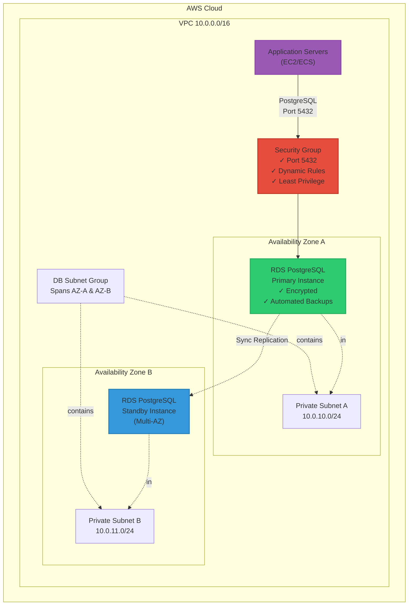
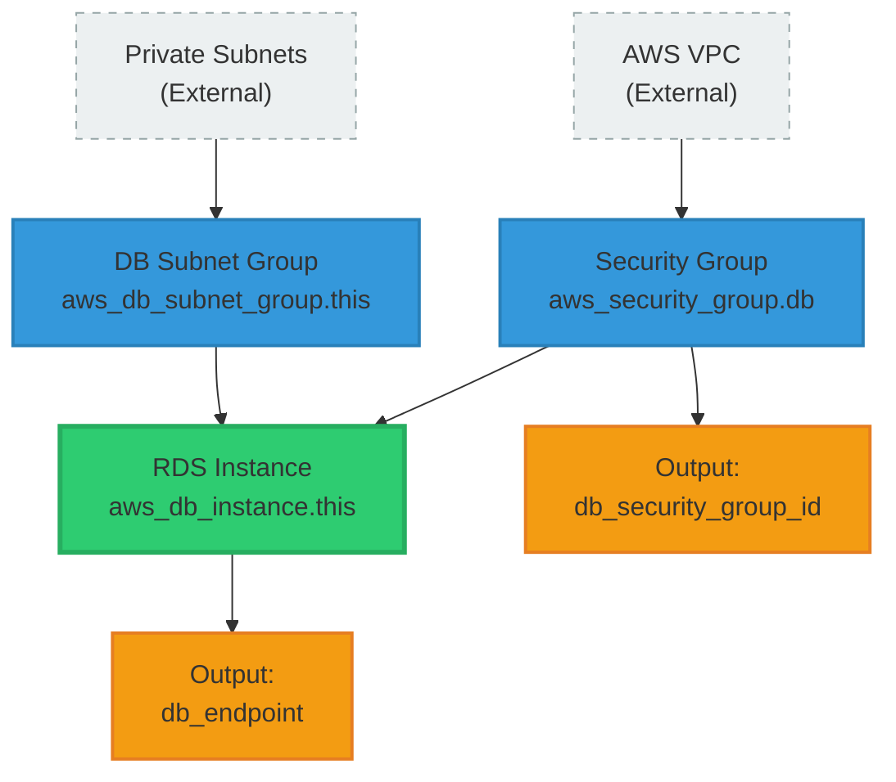
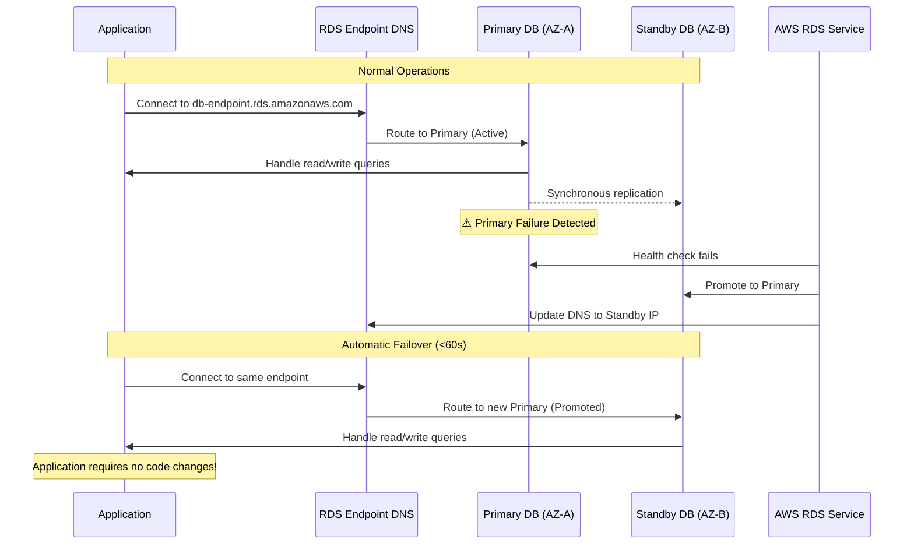
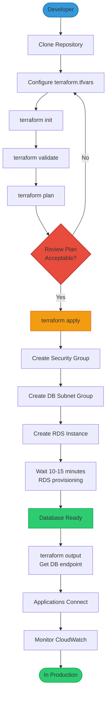
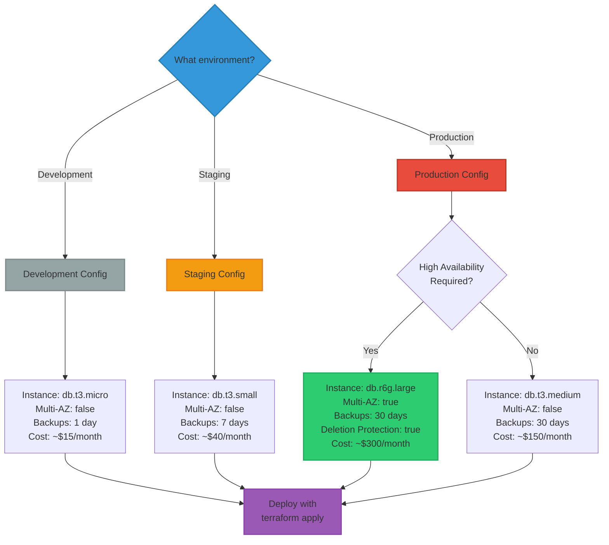
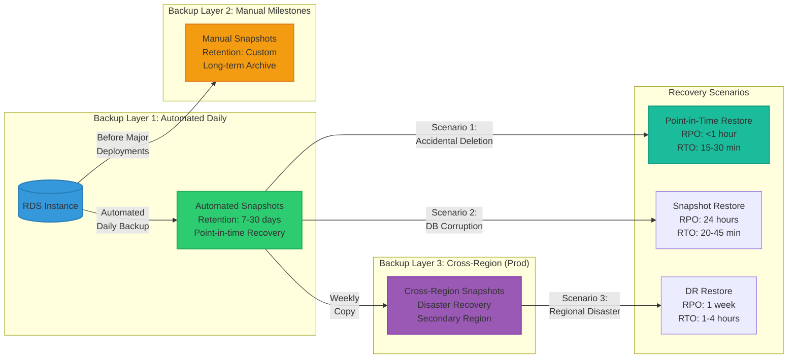
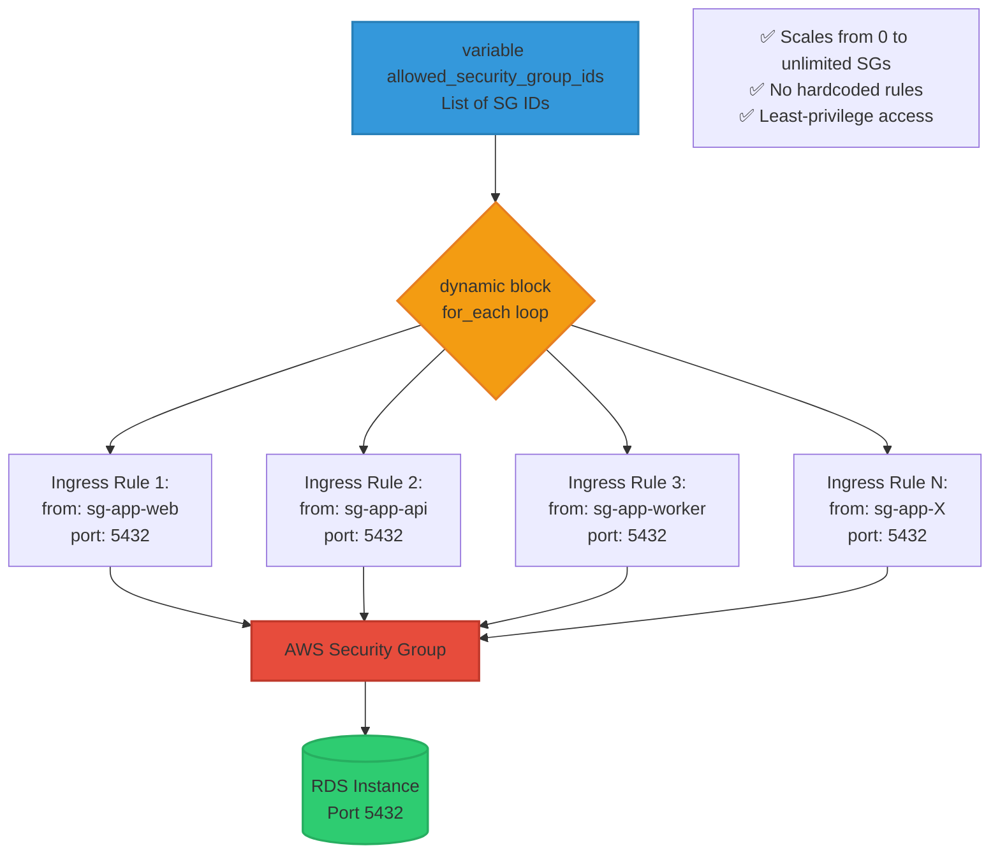

# Architecture Diagrams - AWS RDS Terraform Module

**Project:** PRJ-SDE-001 - Production Database Infrastructure
**Format:** Mermaid diagrams (render on GitHub, VS Code, or https://mermaid.live)

---

## Diagram 1: Infrastructure Overview



---

## Diagram 2: Security Layers (Defense-in-Depth)

```mermaid
graph LR
    Internet([Internet]) -.blocked.->|No Public Access| RDS

    subgraph "Security Layer 1: Network Isolation"
        PrivateSubnet["Private Subnets<br/>No IGW Route"]
    end

    subgraph "Security Layer 2: Access Control"
        SG["Security Group<br/>Port 5432<br/>Whitelisted Sources Only"]
    end

    subgraph "Security Layer 3: Encryption"
        Encryption["✓ At Rest (AES-256)<br/>✓ In Transit (TLS)<br/>✓ Backup Encryption"]
    end

    subgraph "Security Layer 4: Database"
        RDS["RDS PostgreSQL<br/>✓ IAM Auth Available<br/>✓ Audit Logs"]
    end

    App["Authorized<br/>Applications"] --> SG
    SG --> PrivateSubnet
    PrivateSubnet --> Encryption
    Encryption --> RDS

    style Internet fill:#e74c3c,stroke:#c0392b,stroke-width:2px
    style RDS fill:#2ecc71,stroke:#27ae60,stroke-width:2px
    style SG fill:#f39c12,stroke:#e67e22,stroke-width:2px
    style App fill:#3498db,stroke:#2980b9,stroke-width:2px
```

---

## Diagram 3: Terraform Resource Dependencies



---

## Diagram 4: Multi-AZ Failover Flow



---

## Diagram 5: Deployment Workflow



---

## Diagram 6: Cost Optimization Decision Tree



---

## Diagram 7: Backup & Recovery Strategy



---

## Diagram 8: Security Group Dynamic Rules



---

## How to Use These Diagrams

### Rendering Mermaid Diagrams

**GitHub/GitLab:**
- Automatically rendered in Markdown files
- No action needed

**VS Code:**
```bash
# Install Mermaid extension
ext install bierner.markdown-mermaid
```

**Online Editor:**
- Visit https://mermaid.live
- Paste diagram code
- Export as PNG/SVG

**Generate Images:**
```bash
# Install mermaid-cli
npm install -g @mermaid-js/mermaid-cli

# Generate PNG
mmdc -i ARCHITECTURE-DIAGRAMS.md -o diagrams/

# Generate SVG (better quality)
mmdc -i ARCHITECTURE-DIAGRAMS.md -o diagrams/ -t svg
```

### In Presentations

1. **For slides:** Export as PNG/SVG and insert
2. **For docs:** Embed directly (GitHub renders automatically)
3. **For interviews:** Have https://mermaid.live open with diagrams ready

---

## Diagram Purpose Reference

| Diagram | Purpose | Best For |
|---------|---------|----------|
| **1. Infrastructure Overview** | High-level architecture | Executives, interviews |
| **2. Security Layers** | Defense-in-depth approach | Security-focused audiences |
| **3. Resource Dependencies** | Terraform execution order | Technical deep-dives |
| **4. Multi-AZ Failover** | HA mechanism explanation | Architects, SREs |
| **5. Deployment Workflow** | Step-by-step process | New team members, docs |
| **6. Cost Optimization** | Environment sizing decisions | Managers, FinOps |
| **7. Backup & Recovery** | DR strategy and RPO/RTO | Compliance, audits |
| **8. Dynamic Security Groups** | Code pattern explanation | Engineers, code reviews |

---

*Architecture Diagrams v1.0 - Last Updated: November 2025*
