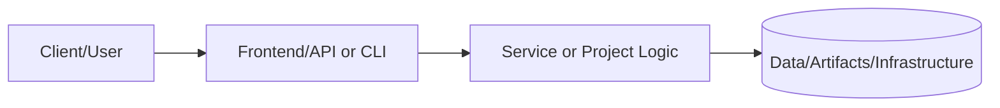
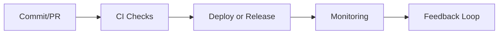

# PRJ-SDE-001: Full-Stack Database Infrastructure

## Documentation
For cross-project documentation, standards, and runbooks, see the [Portfolio Documentation Hub](../../../DOCUMENTATION_INDEX.md).


**Status:** 🟢 **COMPLETE**
**Category:** System Development Engineering / DevOps / Cloud Architecture
**Technologies:** Terraform, AWS (VPC, RDS, ECS, ALB), PostgreSQL, Docker, Infrastructure as Code

---

## Overview

Complete production-ready infrastructure-as-code solution deploying a full application stack on AWS with:

- **Custom VPC** with public/private/database subnet tiers across multiple AZs
- **PostgreSQL RDS** with encryption, automated backups, and HA support
- **ECS Fargate Application** with auto-scaling and load balancing
- **CloudWatch Monitoring** with alarms and centralized logging
- **VPC Flow Logs** for network security monitoring

This project demonstrates enterprise-grade infrastructure automation, security best practices, and modular Terraform design.

## Architecture

### Full-Stack Deployment

```
┌──────────────────────────────────────────────────────────────────────────┐
│                              AWS Cloud (VPC)                               │
│                                                                            │
│  ┌─────────────────────────────────────────────────────────────────────┐ │
│  │                        Internet Gateway                              │ │
│  └──────────────────────────────┬───────────────────────────────────────┘ │
│                                 │                                          │
│  ┌──────────────────────────────┴───────────────────────────────────────┐ │
│  │                       Public Subnets (Multi-AZ)                       │ │
│  │  ┌──────────────────┐      ┌──────────────────┐                      │ │
│  │  │  NAT Gateway     │      │  ALB (Port 80)   │◄──── Internet        │ │
│  │  │  (AZ-A)          │      │  + Health Checks │      Traffic         │ │
│  │  └──────────────────┘      └────────┬─────────┘                      │ │
│  └─────────────────────────────────────┼──────────────────────────────┘ │
│                                         │                                  │
│  ┌─────────────────────────────────────┼──────────────────────────────┐ │
│  │                    Private Subnets (Multi-AZ)                        │ │
│  │  ┌──────────────────────────────────┴─────────────────────────────┐ │ │
│  │  │              ECS Fargate Service                                │ │ │
│  │  │  ┌────────────┐  ┌────────────┐  ┌────────────┐                │ │ │
│  │  │  │ Task (AZ-A)│  │ Task (AZ-B)│  │ Auto-Scale │                │ │ │
│  │  │  │ - App      │  │ - App      │  │ (1-10)     │                │ │ │
│  │  │  │ - ENV: DB  │  │ - ENV: DB  │  │            │                │ │ │
│  │  │  └─────┬──────┘  └─────┬──────┘  └────────────┘                │ │ │
│  │  └────────┼───────────────┼─────────────────────────────────────┘ │ │
│  │           │               │                                         │ │
│  │           └───────┬───────┘                                         │ │
│  │                   │ Port 5432                                       │ │
│  └───────────────────┼─────────────────────────────────────────────────┘ │
│                      │                                                    │
│  ┌───────────────────┼─────────────────────────────────────────────────┐ │
│  │             Database Subnets (Isolated, Multi-AZ)                    │ │
│  │  ┌────────────────┴────────────────┐                                │ │
│  │  │  RDS PostgreSQL (Primary/Standby)                                │ │
│  │  │  - Encrypted at Rest (KMS)                                       │ │
│  │  │  - Automated Backups (7-35 days)                                 │ │
│  │  │  - Auto-scaling Storage                                          │ │
│  │  │  - Multi-AZ (optional)                                           │ │
│  │  └───────────────────────────────────┘                              │ │
│  └─────────────────────────────────────────────────────────────────────┘ │
│                                                                            │
│  ┌─────────────────────────────────────────────────────────────────────┐ │
│  │                CloudWatch Monitoring & Logging                       │ │
│  │  - VPC Flow Logs  - ECS Logs  - RDS Metrics  - ALB Logs             │ │
│  │  - CPU/Memory Alarms  - Auto-scaling Triggers                       │ │
│  └─────────────────────────────────────────────────────────────────────┘ │
└──────────────────────────────────────────────────────────────────────────┘
```

## What's Implemented

### ✅ VPC Module (`infrastructure/terraform/modules/vpc/`)

Production-ready networking infrastructure with three-tier architecture:

**Network Design:**
- **Public Subnets**: Internet-facing resources (ALB, NAT Gateway)
- **Private Subnets**: Application tier (ECS tasks)
- **Database Subnets**: Isolated data tier (RDS instances)

**Features:**
- Multi-AZ deployment (configurable 1-3 AZs)
- Internet Gateway for public subnet routing
- NAT Gateway for private subnet internet access (single or per-AZ)
- VPC Flow Logs to CloudWatch for security monitoring
- S3 VPC Endpoint for private S3 access
- Configurable CIDR blocks with automatic subnet calculation
- Complete IAM roles for flow logs

**Security:**
- Network segmentation by subnet tier
- Security groups control all inter-tier communication
- No direct internet access from database subnets
- Flow logs capture all network traffic for analysis

### ✅ RDS Database Module (`infrastructure/terraform/modules/database/`)

Enterprise PostgreSQL database with production-ready configuration:

**Database Features:**
- PostgreSQL 15.4 (configurable version)
- Storage encryption at rest (AWS KMS)
- Automated backups with 7-35 day retention
- Auto-scaling storage (20 GB - 100 GB default)
- Multi-AZ deployment support for HA
- Deletion protection (configurable)
- Final snapshot on destroy (safety control)

**Security:**
- No public accessibility (`publicly_accessible = false`)
- Encrypted at rest and in transit
- Security groups restrict access to application tier only
- Passwords marked sensitive in Terraform state
- Database subnet group in isolated subnets

**Monitoring:**
- CloudWatch alarms for CPU, storage, connections
- Enhanced monitoring (optional)
- Performance Insights support

### ✅ ECS Application Module (`infrastructure/terraform/modules/ecs-application/`)

Containerized application platform with auto-scaling and high availability:

**Compute:**
- ECS Fargate cluster (serverless containers)
- Configurable task CPU/memory (256-4096 CPU units)
- Support for FARGATE and FARGATE_SPOT capacity providers
- ECS Exec enabled for debugging (optional)

**Load Balancing:**
- Application Load Balancer (internet-facing or internal)
- Health checks with configurable thresholds
- HTTP/HTTPS listeners (HTTPS requires ACM certificate)
- Cross-zone load balancing enabled

**Auto-scaling:**
- Target tracking policies for CPU and memory
- Configurable min/max capacity (1-10 tasks default)
- 70% CPU / 80% memory targets
- Scale-out in 60s, scale-in in 300s

**Networking:**
- Tasks run in private subnets (no direct internet access)
- Security groups allow traffic from ALB only
- Outbound internet via NAT Gateway
- Database connection via environment variables

**Monitoring:**
- Container Insights for enhanced metrics
- CloudWatch Logs with configurable retention
- Task-level metrics (CPU, memory, network)
- Log aggregation by service

### ✅ Root Configuration (`infrastructure/main.tf`)

Orchestrates all modules into a complete stack:

**Integration:**
- VPC module creates network foundation
- Database module uses VPC database subnets
- Application module uses VPC public/private subnets
- Security groups configured for proper access control

**Flexible Deployment:**
- Database-only mode: Set `deploy_application = false`
- Full-stack mode: Set `deploy_application = true`
- Environment-specific configs (dev/staging/prod)
- Cost vs. HA trade-offs (single NAT, AZ count, instance sizes)

**CloudWatch Alarms:**
- Database CPU > 80%
- Database storage < 2 GB
- Database connections > 80
- Application auto-scaling triggers

## Usage

### Prerequisites

- AWS Account with appropriate permissions
- Terraform >= 1.6.0 installed
- AWS CLI configured with credentials
- Docker image (if deploying application)

### Deployment Options

**Option A: Database-Only Deployment** (Cost-effective for dev/test)
- Deploys VPC + RDS PostgreSQL
- No application tier
- Minimal cost (~$15-30/month)

**Option B: Full-Stack Deployment** (Complete demonstration)
- Deploys VPC + RDS + ECS Fargate + ALB
- Auto-scaling application tier
- Higher cost (~$50-100/month)

### Quick Start

#### 1. Configure Variables

```bash
cd infrastructure
cp terraform.tfvars.example terraform.tfvars
```

Edit `terraform.tfvars` with your configuration:

```hcl
# Basic Configuration
project_name = "my-project"
environment  = "dev"
aws_region   = "us-east-1"

# VPC Configuration
vpc_cidr           = "10.0.0.0/16"
az_count           = 2
enable_nat_gateway = true
single_nat_gateway = true  # Cost savings

# Database Configuration
db_username  = "dbadmin"
db_password  = "CHANGE-ME-STRONG-PASSWORD"  # CRITICAL: Use strong password
db_instance_class = "db.t3.small"

# Application (Optional)
deploy_application = false  # Set to true for full stack
```

**IMPORTANT:** Never commit `terraform.tfvars` - it's in `.gitignore`

#### 2. Initialize Terraform

```bash
terraform init
```

Expected output:
```
Initializing modules...
Initializing the backend...
Initializing provider plugins...
Terraform has been successfully initialized!
```

#### 3. Plan Deployment

```bash
terraform plan -out=tfplan
```

Review the plan carefully - it will show:
- VPC, subnets, NAT Gateway, Internet Gateway
- RDS instance, security groups, alarms
- (If `deploy_application = true`) ECS cluster, ALB, tasks

#### 4. Deploy Infrastructure

```bash
terraform apply tfplan
```

Deployment takes approximately:
- Database-only: 10-15 minutes
- Full-stack: 15-20 minutes

#### 5. Retrieve Outputs

```bash
# All outputs
terraform output

# Specific outputs
terraform output database_endpoint
terraform output application_url  # If application deployed
terraform output vpc_id
```

### Accessing the Infrastructure

**Database Connection:**
```bash
# From within VPC (e.g., ECS task, EC2 instance)
psql "postgresql://dbadmin:PASSWORD@<db_endpoint>:5432/postgres"

# Create application database
psql> CREATE DATABASE myapp;
psql> GRANT ALL PRIVILEGES ON DATABASE myapp TO dbadmin;
```

**Application Access:** (if `deploy_application = true`)
```bash
# Get application URL
terraform output application_url
# Output: http://my-project-dev-alb-123456789.us-east-1.elb.amazonaws.com

# Test application
curl $(terraform output -raw application_url)
```

**CloudWatch Logs:**
```bash
# VPC Flow Logs
aws logs tail /aws/vpc/my-project-dev-flow-logs --follow

# Application Logs (if deployed)
aws logs tail /ecs/my-project-dev --follow
```

### Deployment Scenarios

#### Development Environment

Minimal cost configuration:

```hcl
environment = "dev"
az_count = 1
enable_nat_gateway = true
single_nat_gateway = true
db_instance_class = "db.t3.micro"
db_multi_az = false
db_backup_retention_days = 1
deploy_application = false
```

**Monthly Cost:** ~$15-20

#### Production Environment

High availability configuration:

```hcl
environment = "prod"
az_count = 3
single_nat_gateway = false  # NAT in each AZ
db_instance_class = "db.r6g.large"
db_multi_az = true
db_deletion_protection = true
db_backup_retention_days = 30
deploy_application = true
app_desired_count = 3
app_min_capacity = 2
app_max_capacity = 20
enable_deletion_protection = true
```

**Monthly Cost:** ~$300-500 (varies with traffic)

## Monitoring & Operations

### CloudWatch Alarms

The deployment creates the following alarms:

| Alarm | Threshold | Action |
|-------|-----------|--------|
| Database CPU | > 80% for 10 min | Review query performance |
| Database Storage | < 2 GB free | Consider storage increase |
| Database Connections | > 80 connections | Review connection pooling |
| Application Auto-scale | CPU/Memory targets | Automatic scaling |

### VPC Flow Logs

Network traffic monitoring:

```bash
# View flow logs
aws logs tail /aws/vpc/my-project-dev-flow-logs --follow

# Query for specific IP
aws logs filter-pattern /aws/vpc/my-project-dev-flow-logs \
  --filter-pattern '192.168.1.1' \
  --start-time $(date -d '1 hour ago' +%s)000
```

### Backup Management

**Automated Backups:**
- RDS automatically backs up daily during maintenance window
- Retention: 7-35 days (configurable)
- Point-in-time recovery supported

**Manual Snapshot:**
```bash
aws rds create-db-snapshot \
  --db-instance-identifier my-project-dev-db \
  --db-snapshot-identifier manual-snapshot-$(date +%Y%m%d)
```

**Restore from Backup:**
```bash
# List available snapshots
aws rds describe-db-snapshots \
  --db-instance-identifier my-project-dev-db

# Restore (creates new instance)
aws rds restore-db-instance-from-db-snapshot \
  --db-instance-identifier my-project-dev-db-restored \
  --db-snapshot-identifier <snapshot-id>
```

## Security Best Practices

### Implemented

✅ **Network Segmentation**: Three-tier VPC with isolated database subnet
✅ **Encryption at Rest**: RDS storage encrypted with KMS
✅ **Encryption in Transit**: SSL/TLS for database connections
✅ **No Public Access**: Database not accessible from internet
✅ **Security Groups**: Least-privilege access control
✅ **VPC Flow Logs**: Network traffic monitoring
✅ **CloudWatch Alarms**: Resource monitoring
✅ **Automated Backups**: Daily backups with retention
✅ **Final Snapshots**: Protection against accidental deletion

### Recommended Enhancements

🔒 **Secrets Management**:
```bash
# Store password in AWS Secrets Manager
aws secretsmanager create-secret \
  --name my-project/db/password \
  --secret-string '<your-password>'

# Update Terraform to retrieve password
data "aws_secretsmanager_secret_version" "db_password" {
  secret_id = "my-project/db/password"
}
```

🔒 **IAM Database Authentication**:
```hcl
# In database module
iam_database_authentication_enabled = true
```

🔒 **AWS WAF** (if application deployed):
```bash
# Create WAF web ACL for ALB
aws wafv2 create-web-acl \
  --name my-project-waf \
  --scope REGIONAL \
  --default-action Allow={}
```

🔒 **GuardDuty**:
```bash
# Enable GuardDuty for threat detection
aws guardduty create-detector --enable
```

🔒 **SSL/TLS for ALB**:
```hcl
# Request ACM certificate
# Add HTTPS listener to ALB module
```

## Testing

### Local Validation

```bash
# Format check
terraform fmt -check -recursive

# Validation
terraform init -backend=false
terraform validate

# Security scanning
tflint
tfsec .
```

### Cost Estimation

```bash
# Using Infracost (if installed)
infracost breakdown --path .
```

## Best Practices Demonstrated

**Infrastructure as Code:**
1. **Modular Design** - Three reusable modules (VPC, Database, ECS Application)
2. **Composition** - Modules integrate via outputs, not hard-coded values
3. **Configuration Over Hardcoding** - All settings exposed as variables with defaults
4. **DRY Principle** - Modules reusable across projects and environments

**Security:**
5. **Defense in Depth** - Multiple security layers (network, security groups, encryption)
6. **Least Privilege** - Security groups restrict to minimum required access
7. **Encryption** - At rest (KMS) and in transit (SSL/TLS)
8. **Sensitive Data** - Passwords and secrets marked sensitive in state
9. **Network Segmentation** - Public/private/database subnet tiers
10. **Audit Logging** - VPC Flow Logs and CloudWatch monitoring

**Reliability:**
11. **High Availability** - Multi-AZ support for all components
12. **Auto-scaling** - Application scales based on CPU/memory
13. **Automated Backups** - RDS daily backups with retention
14. **Safe Destruction** - Final snapshots prevent accidental data loss
15. **Health Checks** - ALB and ECS task health monitoring

**Operations:**
16. **Comprehensive Monitoring** - CloudWatch alarms for key metrics
17. **Centralized Logging** - CloudWatch Logs aggregation
18. **Tagging Strategy** - Consistent tags for cost allocation and management
19. **Documentation** - Inline comments, README, architecture diagrams
20. **Cost Optimization** - Configurable HA vs. cost trade-offs

## Related Documentation

- [VPC Module](../../../infrastructure/terraform/modules/vpc/)
- [Database Module](../../../infrastructure/terraform/modules/database/)
- [ECS Application Module](../../../infrastructure/terraform/modules/ecs-application/)
- [Main Portfolio README](../../../README.md)

## Technical Achievements

### Infrastructure Scope

| Component | Resources Created | Configuration Options |
|-----------|-------------------|----------------------|
| **VPC Module** | 15+ resources | 12 variables |
| **Database Module** | 5+ resources | 18 variables |
| **ECS Application Module** | 20+ resources | 30+ variables |
| **Root Configuration** | 3 CloudWatch alarms | 40+ total variables |

**Total Lines of Code:** ~1,500 lines of Terraform

### Deployment Flexibility

- **3 Deployment Modes**: Database-only, full-stack, custom
- **3 Environment Tiers**: Dev, staging, production
- **Cost Range**: $15/month (dev) to $500/month (prod HA)
- **Deployment Time**: 10-20 minutes
- **Supported Regions**: All AWS regions

### Skills Demonstrated

- ✅ AWS VPC networking (subnets, routing, NAT, IGW)
- ✅ RDS database management (PostgreSQL, backups, encryption)
- ✅ ECS Fargate containerization (serverless compute)
- ✅ Application Load Balancing (ALB, health checks, auto-scaling)
- ✅ Security best practices (encryption, network segmentation, IAM)
- ✅ CloudWatch monitoring (alarms, logs, metrics)
- ✅ Terraform module development (composition, reusability)
- ✅ Infrastructure as Code (IaC) principles
- ✅ Cost optimization strategies
- ✅ Technical documentation

## Future Enhancements

**Short-term** (1-2 weeks):
1. **CI/CD Pipeline** - GitHub Actions for terraform plan/apply
2. **Terratest Integration** - Automated testing of modules
3. **Remote State Backend** - S3 + DynamoDB for state management

**Medium-term** (1-2 months):
4. **Read Replicas** - For read-heavy workloads
5. **Parameter Groups** - Custom PostgreSQL tuning
6. **IAM Database Auth** - Enhanced security
7. **ACM + HTTPS** - SSL/TLS for ALB
8. **AWS WAF Integration** - Web application firewall

**Long-term** (3+ months):
9. **Multi-region Deployment** - Disaster recovery
10. **Blue/Green Deployments** - Zero-downtime upgrades
11. **Performance Insights** - Advanced database monitoring
12. **Service Mesh** - App Mesh for microservices

---

**Project Lead:** Sam Jackson
**Status:** ✅ Complete
**Last Updated:** November 6, 2025
**Terraform Version:** >= 1.6.x
**AWS Provider:** >= 5.0

**GitHub:** [samueljackson-collab/Portfolio-Project](https://github.com/samueljackson-collab/Portfolio-Project)
**LinkedIn:** [sams-jackson](https://www.linkedin.com/in/sams-jackson)

---

# 📘 Project README Template (Portfolio Standard)

> **Status key:** 🟢 Done · 🟠 In Progress · 🔵 Planned · 🔄 Recovery/Rebuild · 📝 Documentation Pending

## 🎯 Overview
This README has been expanded to align with the portfolio documentation standard for **PRJ SDE 001**. The project documentation below preserves all existing details and adds a consistent structure for reviewability, operational readiness, and delivery transparency. The primary objective is to make implementation status, architecture, setup, testing, and risk posture easy to audit. Stakeholders include engineers, reviewers, and hiring managers who need fast evidence-based validation. Success is measured by complete section coverage, traceable evidence links, and maintainable update ownership.

### Outcomes
- Consistent documentation quality across the portfolio.
- Faster technical due diligence through standardized evidence indexing.
- Clear status tracking with explicit in-scope and deferred work.

## 📌 Scope & Status

| Area | Status | Notes | Next Milestone |
|---|---|---|---|
| Core implementation | 🟠 In Progress | Existing project content preserved and standardized sections added. | Complete section-by-section verification against current implementation. |
| Ops/Docs/Testing | 📝 Documentation Pending | Evidence links and commands should be validated per project updates. | Refresh command outputs and evidence after next major change. |

> **Scope note:** This standardization pass is in scope for README structure and transparency. Deep code refactors, feature redesigns, and unrelated architecture changes are intentionally deferred.

## 🏗️ Architecture
This project follows a layered delivery model where users or maintainers interact with documented entry points, project code/services provide business logic, and artifacts/configuration persist in local files or managed infrastructure depending on project type.



| Component | Responsibility | Key Interfaces |
|---|---|---|
| Documentation (`README.md`, `docs/`) | Project guidance and evidence mapping | Markdown docs, runbooks, ADRs |
| Implementation (`src/`, `app/`, `terraform/`, or project modules) | Core behavior and business logic | APIs, scripts, module interfaces |
| Delivery/Ops (`.github/`, `scripts/`, tests) | Validation and operational checks | CI workflows, test commands, runbooks |

## 🚀 Setup & Runbook

### Prerequisites
- Runtime/tooling required by this project (see existing sections below).
- Access to environment variables/secrets used by this project.
- Local dependencies (CLI tools, package managers, or cloud credentials).

### Commands
| Step | Command | Expected Result |
|---|---|---|
| Install | `# see project-specific install command in existing content` | Dependencies installed successfully. |
| Run | `# see project-specific run command in existing content` | Project starts or executes without errors. |
| Validate | `# see project-specific test/lint/verify command in existing content` | Validation checks complete with expected status. |

### Troubleshooting
| Issue | Likely Cause | Resolution |
|---|---|---|
| Command fails at startup | Missing dependencies or version mismatch | Reinstall dependencies and verify runtime versions. |
| Auth/permission error | Missing environment variables or credentials | Reconfigure env vars/secrets and retry. |
| Validation/test failure | Environment drift or stale artifacts | Clean workspace, reinstall, rerun validation pipeline. |

## ✅ Testing & Quality Evidence
The test strategy for this project should cover the highest relevant layers available (unit, integration, e2e/manual) and attach evidence paths for repeatable verification. Existing test notes and artifacts remain preserved below.

| Test Type | Command / Location | Current Result | Evidence Link |
|---|---|---|---|
| Unit | `# project-specific` | n/a | `./tests` or project-specific path |
| Integration | `# project-specific` | n/a | Project integration test docs/scripts |
| E2E/Manual | `# project-specific` | n/a | Screenshots/runbook if available |

### Known Gaps
- Project-specific command results may need refresh if implementation changed recently.
- Some evidence links may remain planned until next verification cycle.

## 🔐 Security, Risk & Reliability

| Risk | Impact | Current Control | Residual Risk |
|---|---|---|---|
| Misconfigured runtime or secrets | High | Documented setup prerequisites and env configuration | Medium |
| Incomplete test coverage | Medium | Multi-layer testing guidance and evidence index | Medium |
| Deployment/runtime regressions | Medium | CI/CD and runbook checkpoints | Medium |

### Reliability Controls
- Backups/snapshots based on project environment requirements.
- Monitoring and alerting where supported by project stack.
- Rollback path documented in project runbooks or deployment docs.
- Runbook ownership maintained via documentation freshness policy.

## 🔄 Delivery & Observability



| Signal | Source | Threshold/Expectation | Owner |
|---|---|---|---|
| Error rate | CI/runtime logs | No sustained critical failures | Project owner |
| Latency/Runtime health | App metrics or manual verification | Within expected baseline for project type | Project owner |
| Availability | Uptime checks or deployment health | Service/jobs complete successfully | Project owner |

## 🗺️ Roadmap

| Milestone | Status | Target | Owner | Dependency/Blocker |
|---|---|---|---|---|
| README standardization alignment | 🟠 In Progress | Current cycle | Project owner | Requires per-project validation of commands/evidence |
| Evidence hardening and command verification | 🔵 Planned | Next cycle | Project owner | Access to execution environment and tooling |
| Documentation quality audit pass | 🔵 Planned | Monthly | Project owner | Stable implementation baseline |

## 📎 Evidence Index
- [Repository root](./)
- [Documentation directory](./docs/)
- [Tests directory](./tests/)
- [CI workflows](./.github/workflows/)
- [Project implementation files](./)

## 🧾 Documentation Freshness

| Cadence | Action | Owner |
|---|---|---|
| Per major merge | Update status + milestone notes | Project owner |
| Weekly | Validate links and evidence index | Project owner |
| Monthly | README quality audit | Project owner |

## 11) Final Quality Checklist (Before Merge)

- [ ] Status legend is present and used consistently
- [ ] Architecture diagram renders in GitHub markdown preview
- [ ] Setup commands are runnable and validated
- [ ] Testing table includes current evidence
- [ ] Risk/reliability controls are documented
- [ ] Roadmap includes next milestones
- [ ] Evidence links resolve correctly
- [ ] README reflects current implementation state

