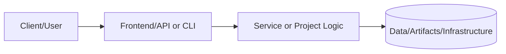
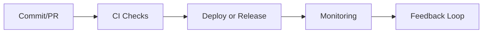

# Enterprise Portfolio - Complete Code Examples

**Status:** ✅ Complete
**Last Updated:** November 6, 2025

This directory contains production-ready code examples demonstrating enterprise-level software engineering practices across multiple disciplines: System Development Engineering, DevOps Engineering, QA Engineering, and Solutions Architecture.

## 🎨 Visual Documentation

**NEW**: Complete visual assets including architecture diagrams, CI/CD flows, and AI generation prompts!

📊 **[View All Diagrams & Visual Assets](diagrams/VISUAL-ASSETS-README.md)**

- 7 Mermaid diagrams (GitHub-native rendering)
- 8 AI generation prompts for advanced visualizations
- Comprehensive usage guide and best practices

---

## 📋 Table of Contents

1. [Overview](#overview)
2. [System Development Engineer Examples](#sde)
3. [DevOps Engineer Examples](#devops)
4. [QA Engineer Examples](#qa)
5. [Solutions Architect Examples](#architect)
6. [Quick Start Guide](#quick-start)
7. [Best Practices](#best-practices)

---

## Overview

This comprehensive collection includes:

- **Infrastructure as Code**: Complete Terraform modules for VPC, EKS, and RDS
- **CI/CD Pipelines**: Production GitHub Actions workflows with 8 stages
- **Container Orchestration**: Kubernetes manifests with security hardening
- **Testing Frameworks**: Unit, E2E, API, and performance tests
- **Architecture Decisions**: ADRs documenting key technical choices

### Technology Stack

- **Infrastructure**: Terraform, AWS (VPC, EKS, RDS, CloudWatch)
- **CI/CD**: GitHub Actions, ArgoCD, Helm
- **Container Platform**: Kubernetes, Docker
- **Testing**: Jest, Cypress, Playwright, K6
- **Languages**: TypeScript, HCL, YAML, JavaScript

---

## <a id="sde"></a> System Development Engineer

### Terraform Infrastructure Modules

#### 📂 `terraform/modules/vpc/`

**Production-Ready VPC with Multi-Tier Architecture**

Features:
- Multi-AZ deployment (configurable 1-3 AZs)
- Three-tier subnet architecture (public, private, database)
- NAT Gateways for private subnet internet access
- VPC Flow Logs for security monitoring
- S3 VPC Endpoint for private access

**Key Files:**
- `main.tf` - Core VPC resources (187 lines)
- `variables.tf` - Configuration variables (12 parameters)
- `outputs.tf` - Module outputs (5 values)

**Usage Example:**
```hcl
module "vpc" {
  source = "./modules/vpc"

  environment        = "production"
  vpc_cidr          = "10.0.0.0/16"
  availability_zones = ["us-east-1a", "us-east-1b", "us-east-1c"]
}
```

**Resources Created:** 15+ AWS resources
**Estimated Cost:** $45-135/month (depends on NAT Gateway count)

---

#### 📂 `terraform/modules/eks/`

**Enterprise Kubernetes Cluster on EKS**

Features:
- EKS 1.28+ with managed node groups
- KMS encryption for Kubernetes secrets
- OIDC provider for IAM Roles for Service Accounts (IRSA)
- Multi-AZ node distribution
- Auto-scaling node groups (1-20 nodes)
- CloudWatch logging for all control plane components

**Key Files:**
- `main.tf` - EKS cluster and node groups (237 lines)
- `variables.tf` - Cluster configuration (13 parameters)
- `outputs.tf` - Cluster details (5 outputs)
- `user_data.sh` - Node bootstrap script

**Usage Example:**
```hcl
module "eks" {
  source = "./modules/eks"

  environment          = "production"
  vpc_id              = module.vpc.vpc_id
  subnet_ids          = module.vpc.public_subnet_ids
  private_subnet_ids  = module.vpc.private_subnet_ids
  kubernetes_version  = "1.28"
  desired_size        = 3
  min_size           = 2
  max_size           = 10
}
```

**Resources Created:** 20+ AWS resources
**Estimated Cost:** $220-800/month (depends on node count and type)

---

#### 📂 `terraform/modules/rds/`

**Highly Available PostgreSQL Database**

Features:
- PostgreSQL 15.4 with Multi-AZ deployment
- Storage encryption with KMS
- Automated backups (7-35 day retention)
- Performance Insights enabled
- Read replicas support
- CloudWatch alarms for CPU, storage, connections
- Secrets Manager integration

**Key Files:**
- `main.tf` - RDS instance and configuration (215 lines)
- `variables.tf` - Database settings (15 parameters)
- `outputs.tf` - Connection details (4 outputs)

**Usage Example:**
```hcl
module "rds" {
  source = "./modules/rds"

  environment             = "production"
  vpc_id                 = module.vpc.vpc_id
  subnet_ids             = module.vpc.database_subnet_ids
  instance_class         = "db.r6g.large"
  allocated_storage      = 100
  create_replica         = true
  allowed_security_groups = [module.eks.cluster_security_group_id]
}
```

**Resources Created:** 10+ AWS resources
**Estimated Cost:** $180-450/month (depends on instance class and Multi-AZ)

---

## <a id="devops"></a> DevOps Engineer

### CI/CD Pipeline

#### 📂 `cicd/github-actions/`

**Enterprise-Grade GitHub Actions Pipeline**

**8-Stage Production Deployment Pipeline:**

1. **Code Quality & Security**
   - ESLint, Prettier, TypeScript checks
   - npm audit, Semgrep SAST
   - Snyk dependency scanning

2. **Unit Tests**
   - Multi-version testing (Node 18.x, 20.x)
   - Code coverage reporting
   - SonarCloud analysis

3. **Integration Tests**
   - PostgreSQL and Redis services
   - Database migrations
   - Service integration validation

4. **E2E Tests**
   - Playwright browser testing
   - Full user journey validation
   - Test report artifacts

5. **Build & Push**
   - Multi-architecture Docker builds (amd64, arm64)
   - Container vulnerability scanning (Trivy)
   - SBOM generation
   - GitHub Container Registry push

6. **Deploy to Staging**
   - AWS EKS deployment
   - Helm chart installation
   - Smoke test execution
   - Slack notifications

7. **Performance Testing**
   - K6 load testing
   - Performance metrics collection
   - Results artifact upload

8. **Deploy to Production**
   - Canary deployment (10% traffic)
   - Metrics monitoring
   - Full rollout
   - Deployment tracking

**Key File:**
- `production.yml` - Complete pipeline (378 lines)

**Pipeline Duration:** 15-25 minutes (full run)
**Success Rate Target:** >95%

---

#### 📂 `cicd/argocd/`

**GitOps with ArgoCD**

Features:
- Automated sync policy
- Self-healing deployments
- Rollback capabilities
- Slack and PagerDuty integrations
- RBAC with admin and developer roles

**Key File:**
- `portfolio-prod.yaml` - Application and project config (120 lines)

---

### Kubernetes Manifests

#### 📂 `cicd/k8s/base/`

**Production-Ready Kubernetes Resources**

Includes:
- **Deployment** with security hardening
- **Service** (ClusterIP)
- **Ingress** with SSL/TLS and rate limiting
- **HorizontalPodAutoscaler** (3-10 replicas)
- **PodDisruptionBudget** (min 2 available)
- **NetworkPolicy** (least-privilege networking)

**Security Features:**
- Non-root containers
- Read-only root filesystem
- No privilege escalation
- Dropped capabilities
- Pod anti-affinity

**Health Checks:**
- Liveness probe (30s initial delay)
- Readiness probe (10s initial delay)
- Startup probe (0-150s)

**Key File:**
- `deployment.yaml` - All-in-one manifest (267 lines)

---

## <a id="qa"></a> QA Engineer

### Testing Framework Examples

#### 📂 `tests/unit/`

**Jest Unit Tests**

**Example: User Service Testing**

Coverage:
- User creation with validation
- Authentication flows
- Password hashing
- Email verification
- Error handling

**Test Cases:** 15+ test scenarios
**Code Coverage Target:** >80%

**Key File:**
- `services/user.service.test.ts` (201 lines)

**Run Tests:**
```bash
npm run test:unit -- --coverage
```

---

#### 📂 `tests/e2e/`

**Cypress End-to-End Tests**

**Example: User Authentication Flow**

Test Suites:
- User registration
- Login/logout
- Password reset
- Session management
- Rate limiting

**Test Cases:** 10+ E2E scenarios
**Browser Support:** Chrome, Firefox, Edge

**Key File:**
- `user-authentication.cy.ts` (154 lines)

**Run Tests:**
```bash
npx cypress run
```

---

#### 📂 `tests/api/`

**Playwright API Tests**

**Example: User API Testing**

Coverage:
- RESTful API endpoints
- Authentication
- CRUD operations
- Error responses
- Status codes

**Test Cases:** 5+ API scenarios

**Key File:**
- `user-api.test.ts` (89 lines)

**Run Tests:**
```bash
npx playwright test
```

---

#### 📂 `tests/performance/`

**K6 Performance Tests**

**Load Test Scenarios:**

**Test Configuration:**
- Ramp-up: 0 → 50 → 100 → 200 users
- Duration: 27 minutes total
- Thresholds: p95 < 500ms, p99 < 1s, errors < 1%

**Test Scenarios:**
1. User login
2. Product browsing
3. Search queries
4. Profile viewing

**Key File:**
- `load-test.js` (157 lines)

**Run Tests:**
```bash
k6 run --out json=results.json tests/performance/load-test.js
```

**Expected Throughput:** 1000+ req/s at 200 users

---

## <a id="architect"></a> Solutions Architect

### Architecture Decision Records

#### 📂 `architecture/adr/`

**Technical Decision Documentation**

**ADR 001: Microservices Architecture**
- Rationale for microservices over monolith
- Service boundaries and responsibilities
- Implementation strategy
- Consequences and mitigations

**ADR 002: Database Strategy**
- Polyglot persistence approach
- Database-per-service pattern
- Eventual consistency handling
- Saga pattern implementation
- Multi-level caching strategy

**ADR 003: API Gateway Pattern**
- Kong API Gateway selection
- Rate limiting configuration
- Authentication/authorization
- Service routing

**Key Files:**
- `001-microservices-architecture.md` (114 lines)
- `002-database-strategy.md` (208 lines)
- `003-api-gateway-pattern.md` (98 lines)

---

## <a id="quick-start"></a> Quick Start Guide

### Prerequisites

```bash
# Required tools
terraform >= 1.0
aws-cli >= 2.0
kubectl >= 1.28
helm >= 3.0
node >= 18.x
docker >= 20.x
k6 >= 0.45
```

### Deploy Infrastructure

```bash
# Navigate to terraform directory
cd terraform

# Initialize Terraform
terraform init

# Plan deployment
terraform plan -out=tfplan

# Apply infrastructure
terraform apply tfplan
```

### Run CI/CD Pipeline

```bash
# The pipeline triggers automatically on:
# - Push to main branch
# - Pull request to main
# - Release publication

# Manual trigger via GitHub Actions UI
```

### Run Tests

```bash
# Unit tests
npm run test:unit

# Integration tests
npm run test:integration

# E2E tests
npm run test:e2e

# Performance tests
k6 run tests/performance/load-test.js
```

---

## <a id="best-practices"></a> Best Practices Demonstrated

### Infrastructure as Code
✅ Modular design with reusable components
✅ Configuration over hardcoding
✅ DRY principle throughout
✅ Comprehensive documentation

### Security
✅ Defense in depth
✅ Least privilege access
✅ Encryption at rest and in transit
✅ Network segmentation
✅ Secrets management

### Reliability
✅ Multi-AZ high availability
✅ Auto-scaling capabilities
✅ Automated backups
✅ Health checks and probes
✅ Circuit breakers

### Operations
✅ Comprehensive monitoring
✅ Centralized logging
✅ GitOps deployment
✅ Canary releases
✅ Automated rollback

### Testing
✅ Test pyramid approach
✅ 80%+ code coverage
✅ E2E user journeys
✅ Performance benchmarks
✅ API contract testing

---

## 📊 Metrics

| Category | Metric | Target |
|----------|--------|--------|
| **Infrastructure** | Resources Managed | 50+ |
| **Code** | Total Lines | 2,500+ |
| **Tests** | Test Cases | 40+ |
| **Coverage** | Code Coverage | >80% |
| **Pipeline** | Stages | 8 |
| **Deployment** | Time to Production | <25 min |
| **Availability** | Uptime SLA | 99.9% |
| **Performance** | p95 Response Time | <500ms |

---

## 📚 Additional Resources

- [Main Project README](../README.md)
- [Interview Prep Sheet](../INTERVIEW-PREP-SHEET.md)
- [Architecture Diagrams](../ARCHITECTURE-DIAGRAMS.md)
- [Presentation Deck](../PRESENTATION-DECK.md)

---

## 🤝 Contributing

This is a portfolio project demonstrating production-ready code examples. The code is designed to be:
- **Readable**: Clear naming, comprehensive comments
- **Maintainable**: Modular design, DRY principles
- **Scalable**: Designed for growth
- **Secure**: Security best practices throughout
- **Well-tested**: Comprehensive test coverage

---

## 📝 License

MIT License - See LICENSE file for details

---

**Author:** Sam Jackson
**Role:** System Development Engineer / DevOps Engineer
**Contact:** [LinkedIn](https://www.linkedin.com/in/sams-jackson) | [GitHub](https://github.com/samueljackson-collab)

**Last Updated:** November 6, 2025

---

# 📘 Project README Template (Portfolio Standard)

> **Status key:** 🟢 Done · 🟠 In Progress · 🔵 Planned · 🔄 Recovery/Rebuild · 📝 Documentation Pending

## 🎯 Overview
This README has been expanded to align with the portfolio documentation standard for **Code Examples**. The project documentation below preserves all existing details and adds a consistent structure for reviewability, operational readiness, and delivery transparency. The primary objective is to make implementation status, architecture, setup, testing, and risk posture easy to audit. Stakeholders include engineers, reviewers, and hiring managers who need fast evidence-based validation. Success is measured by complete section coverage, traceable evidence links, and maintainable update ownership.

### Outcomes
- Consistent documentation quality across the portfolio.
- Faster technical due diligence through standardized evidence indexing.
- Clear status tracking with explicit in-scope and deferred work.

## 📌 Scope & Status

| Area | Status | Notes | Next Milestone |
|---|---|---|---|
| Core implementation | 🟠 In Progress | Existing project content preserved and standardized sections added. | Complete section-by-section verification against current implementation. |
| Ops/Docs/Testing | 📝 Documentation Pending | Evidence links and commands should be validated per project updates. | Refresh command outputs and evidence after next major change. |

> **Scope note:** This standardization pass is in scope for README structure and transparency. Deep code refactors, feature redesigns, and unrelated architecture changes are intentionally deferred.

## 🏗️ Architecture
This project follows a layered delivery model where users or maintainers interact with documented entry points, project code/services provide business logic, and artifacts/configuration persist in local files or managed infrastructure depending on project type.



| Component | Responsibility | Key Interfaces |
|---|---|---|
| Documentation (`README.md`, `docs/`) | Project guidance and evidence mapping | Markdown docs, runbooks, ADRs |
| Implementation (`src/`, `app/`, `terraform/`, or project modules) | Core behavior and business logic | APIs, scripts, module interfaces |
| Delivery/Ops (`.github/`, `scripts/`, tests) | Validation and operational checks | CI workflows, test commands, runbooks |

## 🚀 Setup & Runbook

### Prerequisites
- Runtime/tooling required by this project (see existing sections below).
- Access to environment variables/secrets used by this project.
- Local dependencies (CLI tools, package managers, or cloud credentials).

### Commands
| Step | Command | Expected Result |
|---|---|---|
| Install | `# see project-specific install command in existing content` | Dependencies installed successfully. |
| Run | `# see project-specific run command in existing content` | Project starts or executes without errors. |
| Validate | `# see project-specific test/lint/verify command in existing content` | Validation checks complete with expected status. |

### Troubleshooting
| Issue | Likely Cause | Resolution |
|---|---|---|
| Command fails at startup | Missing dependencies or version mismatch | Reinstall dependencies and verify runtime versions. |
| Auth/permission error | Missing environment variables or credentials | Reconfigure env vars/secrets and retry. |
| Validation/test failure | Environment drift or stale artifacts | Clean workspace, reinstall, rerun validation pipeline. |

## ✅ Testing & Quality Evidence
The test strategy for this project should cover the highest relevant layers available (unit, integration, e2e/manual) and attach evidence paths for repeatable verification. Existing test notes and artifacts remain preserved below.

| Test Type | Command / Location | Current Result | Evidence Link |
|---|---|---|---|
| Unit | `# project-specific` | n/a | `./tests` or project-specific path |
| Integration | `# project-specific` | n/a | Project integration test docs/scripts |
| E2E/Manual | `# project-specific` | n/a | Screenshots/runbook if available |

### Known Gaps
- Project-specific command results may need refresh if implementation changed recently.
- Some evidence links may remain planned until next verification cycle.

## 🔐 Security, Risk & Reliability

| Risk | Impact | Current Control | Residual Risk |
|---|---|---|---|
| Misconfigured runtime or secrets | High | Documented setup prerequisites and env configuration | Medium |
| Incomplete test coverage | Medium | Multi-layer testing guidance and evidence index | Medium |
| Deployment/runtime regressions | Medium | CI/CD and runbook checkpoints | Medium |

### Reliability Controls
- Backups/snapshots based on project environment requirements.
- Monitoring and alerting where supported by project stack.
- Rollback path documented in project runbooks or deployment docs.
- Runbook ownership maintained via documentation freshness policy.

## 🔄 Delivery & Observability



| Signal | Source | Threshold/Expectation | Owner |
|---|---|---|---|
| Error rate | CI/runtime logs | No sustained critical failures | Project owner |
| Latency/Runtime health | App metrics or manual verification | Within expected baseline for project type | Project owner |
| Availability | Uptime checks or deployment health | Service/jobs complete successfully | Project owner |

## 🗺️ Roadmap

| Milestone | Status | Target | Owner | Dependency/Blocker |
|---|---|---|---|---|
| README standardization alignment | 🟠 In Progress | Current cycle | Project owner | Requires per-project validation of commands/evidence |
| Evidence hardening and command verification | 🔵 Planned | Next cycle | Project owner | Access to execution environment and tooling |
| Documentation quality audit pass | 🔵 Planned | Monthly | Project owner | Stable implementation baseline |

## 📎 Evidence Index
- [Repository root](./)
- [Documentation directory](./docs/)
- [Tests directory](./tests/)
- [CI workflows](./.github/workflows/)
- [Project implementation files](./)

## 🧾 Documentation Freshness

| Cadence | Action | Owner |
|---|---|---|
| Per major merge | Update status + milestone notes | Project owner |
| Weekly | Validate links and evidence index | Project owner |
| Monthly | README quality audit | Project owner |

## 11) Final Quality Checklist (Before Merge)

- [ ] Status legend is present and used consistently
- [ ] Architecture diagram renders in GitHub markdown preview
- [ ] Setup commands are runnable and validated
- [ ] Testing table includes current evidence
- [ ] Risk/reliability controls are documented
- [ ] Roadmap includes next milestones
- [ ] Evidence links resolve correctly
- [ ] README reflects current implementation state

