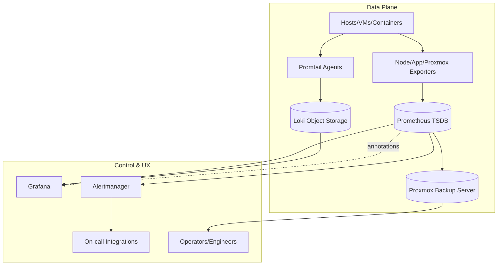
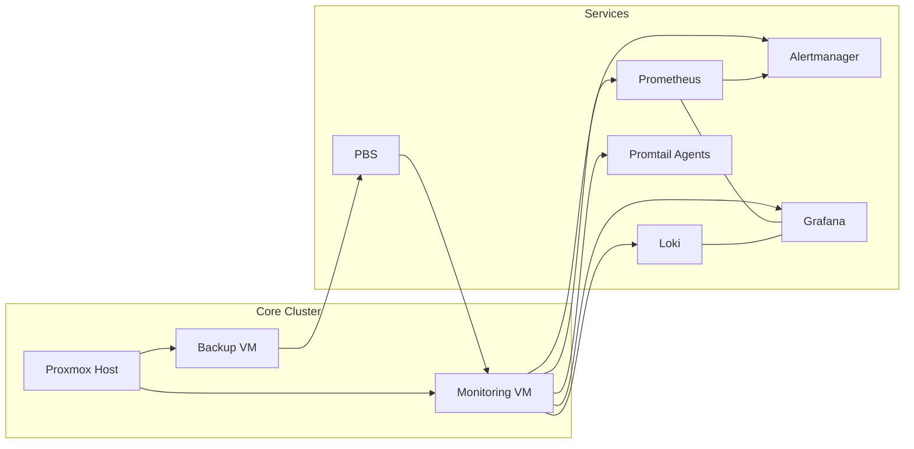

# Architecture Diagram Pack — PRJ-SDE-002

## High-Level Platform (Mermaid)


## Deployment Topology (Mermaid)


## Data & Alert Flow (ASCII)
```
[Targets] --metrics--> [Exporters] --scrape--> [Prometheus] --rules--> [Alertmanager] --routes--> [Slack/Email/PagerDuty]
[Targets] --logs--> [Promtail] --push--> [Loki] --queries--> [Grafana]
[Prometheus/Loki] --dashboards--> [Grafana] --links--> [Operators]
[VM Snapshots] --schedule--> [PBS] --store--> [NFS/SMB] --restore--> [VMs]
```

## Component Responsibilities
- **Prometheus:** Metrics ingestion, rule evaluation, recording rules, alert generation.
- **Grafana:** Dashboard UX, alert annotations, SSO integration, dashboard versioning via git.
- **Loki:** Log aggregation with object storage backend; index and chunk retention split by service tier.
- **Promtail:** Target discovery, relabeling, multi-tenant labels, TLS/mTLS to Loki.
- **Alertmanager:** Routing, grouping, inhibition, silencing, webhooks for runbook automation.
- **PBS:** Incremental, deduplicated backups of Proxmox VMs/CTs; retention and pruning; encryption at rest.

## Deployment Notes
- Run Prometheus + Alertmanager on SSD-backed volumes; Loki data on object storage or RAID-backed disks.
- Secure with mTLS between Promtail→Loki and Prometheus→Alertmanager; SSO (OIDC) for Grafana.
- Pin exporters via service discovery (Consul/SDN) to avoid static target drift.
- Use Infrastructure as Code (Terraform/Ansible) to provision services and apply config via GitOps.
