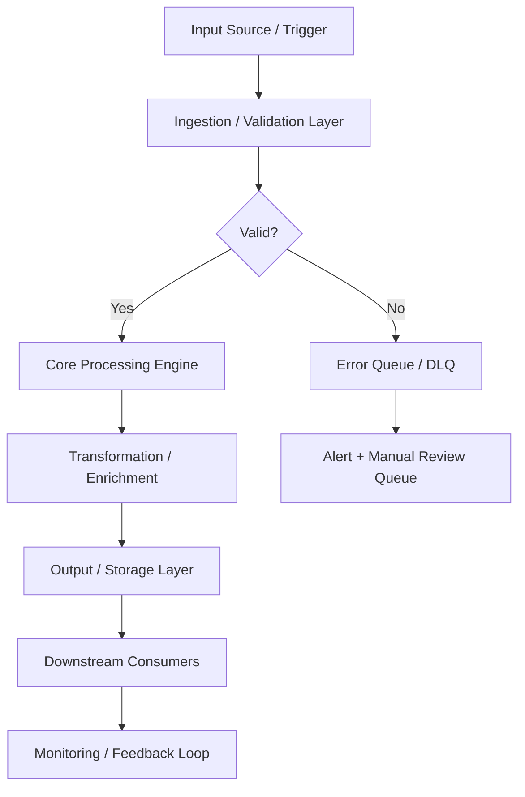

# PRJ-SDE-002: Observability & Backups Stack

## Documentation
For cross-project documentation, standards, and runbooks, see the [Portfolio Documentation Hub](../../../DOCUMENTATION_INDEX.md).


**Status:** 🟢 Completed  
**Category:** System Development Engineering / DevOps  
**Technologies:** Prometheus, Grafana, Loki, Alertmanager, Proxmox Backup Server

Comprehensive monitoring, logging, alerting, and backup automation for the homelab portfolio. The stack is designed around the USE/RED philosophies, emphasizes alert hygiene with linked runbooks, and documents PBS backup posture with verification evidence.

## Quick Links
- [Assets Index](./assets/README.md)
- [Monitoring Philosophy (USE/RED)](./assets/docs/monitoring-philosophy.md)
- [Alert Runbooks](./assets/runbooks/ALERT_RESPONSES.md)
- [Operational Runbook](./assets/runbooks/OPERATIONAL_RUNBOOK.md)
- [Grafana Dashboards](./assets/grafana/dashboards)
- [Screenshots](./assets/screenshots)
- [Log Samples](./assets/logs)
- [Prometheus/Alertmanager/Loki/Promtail Configs](./assets/configs)
- [Prometheus Example Config](./assets/configs/prometheus.example.yml)
- [Alertmanager Example Config](./assets/alertmanager/alertmanager.example.yml)
- [PBS Jobs & Retention Evidence](./assets/backups)
- [Parent Documentation](../../../README.md)

**Sanitization:** All artifacts use placeholder hosts/webhooks and demo data. Screenshots are scrubbed; configs omit credentials.

Monitoring, logging, alerting, and backup stack built with Prometheus, Grafana, Loki, Alertmanager, Promtail, and Proxmox Backup Server (PBS). All assets are sanitized for portfolio sharing.

## Overview
Implemented a comprehensive monitoring, logging, and alerting stack to observe homelab infrastructure and ensure data resilience through automated backups.

## Architecture

## Architecture Snapshot
### Monitoring (Prometheus)
- Metrics collection from multiple targets
- Node exporter for system metrics (CPU, memory, disk, network)
- Proxmox exporter for hypervisor metrics
- Service-specific exporters (PostgreSQL, Redis, etc.)
- Retention and storage configuration

### Visualization (Grafana)
- Pre-built and custom dashboards
- Golden signals: latency, traffic, errors, saturation
- System health overview
- Per-service detailed views
- Annotations for deployments and incidents

### Logging (Loki)
- Centralized log aggregation
- LogQL for querying and filtering logs
- Integration with Grafana for unified interface
- Log retention policies
- Promtail agents for log shipping

### Alerting (Alertmanager)
- Alert routing and grouping
- Notification channels (email, Slack, PagerDuty)
- Silencing and inhibition rules
- Alert templates and severity levels
- On-call rotation support (if applicable)

### Backup (Proxmox Backup Server)
- Incremental backup of VMs and containers
- Deduplication to save storage
- Encryption at rest
- Scheduled backup jobs
- Retention policies and pruning

## How It Works
1. **Provision Prometheus and exporters** on the Proxmox host, followed by Node Exporter installation on all VMs and containers.
2. **Deploy Grafana** once Prometheus is scraping data to verify dashboards render correctly.
3. **Configure Loki and Promtail** to begin ingesting logs alongside metrics.
4. **Set up Alertmanager** with notification channels and connect it to Prometheus.
5. **Integrate PBS** nightly jobs and mount NAS shares for resilient storage.

**Configuration Locations (portfolio mirrors)**:
- Prometheus: [`assets/configs/prometheus.yml`](./assets/configs/prometheus.yml), alert rules in [`assets/configs/alerts/`](./assets/configs/alerts/)
- Grafana dashboards: [`assets/grafana/dashboards/`](./assets/grafana/dashboards/), including
  [`infra-overview-export.json`](./assets/grafana/dashboards/infra-overview-export.json),
  [`service-health.json`](./assets/grafana/dashboards/service-health.json), and
  [`alerts-overview.json`](./assets/grafana/dashboards/alerts-overview.json)
- Loki: [`assets/loki/loki-config.yml`](./assets/loki/loki-config.yml)
- Promtail: [`assets/loki/promtail-config.yml`](./assets/loki/promtail-config.yml)
- Alertmanager: [`assets/alertmanager/alertmanager.yml`](./assets/alertmanager/alertmanager.yml) and
  [`assets/alertmanager/alertmanager.example.yml`](./assets/alertmanager/alertmanager.example.yml)

**Service Management (example)**:
- `sudo systemctl enable --now prometheus`
- `sudo systemctl enable --now grafana-server`
- `sudo systemctl enable --now loki`
- `sudo systemctl enable --now promtail`
- `sudo systemctl enable --now alertmanager`
- `sudo systemctl enable --now proxmox-backup`

**Network Flow Architecture**:
```
┌─────────────┐     ┌─────────────┐     ┌─────────────┐
│   Targets   │────▶│  Exporters  │────▶│ Prometheus  │
│ (VMs/Hosts) │     │ (Port 9100+)│     │ (Port 9090) │
└─────────────┘     └─────────────┘     └──────┬──────┘
                                              │
                   ┌──────────────────────────┼──────────────────────────┐
                   │                          │                          │
                   ▼                          ▼                          ▼
           ┌───────────────┐         ┌──────────────┐         ┌─────────────┐
           │ Alertmanager  │         │   Grafana    │         │    Loki     │
           │  (Port 9093)  │         │ (Port 3000)  │         │ (Port 3100) │
           └───────┬───────┘         └──────────────┘         └──────┬──────┘
                   │                                                  │
                   ▼                                                  ▼
           ┌───────────────┐                                  ┌─────────────┐
           │ Slack/Email   │                                  │  Promtail   │
           │ Notifications │                                  │  (Logs)     │
           └───────────────┘                                  └─────────────┘
```

**Data Flow Overview**
1. **Metrics Collection**: Node Exporters (9100), Proxmox Exporter (9221), and application-specific exporters expose metrics.
2. **Log Shipping**: Promtail agents tail log files and push to Loki (port 3100).
3. **Scraping**: Prometheus scrapes all exporters every 15 seconds, evaluates alert rules every 30 seconds.
4. **Storage**: Prometheus stores metrics locally with 30-day retention; Loki stores logs with 14-day retention.
5. **Alerting**: Alertmanager receives alerts from Prometheus, groups/routes them to Slack channel #homelab-alerts.
6. **Visualization**: Grafana queries Prometheus and Loki, renders dashboards on port 3000.
7. **Backup**: PBS runs nightly at 02:00, snapshots are stored on TrueNAS NFS share at <NFS_SERVER>:/mnt/<DATASTORE>/backups.

## Key Dashboards
### Infrastructure Overview
- Cluster resource utilization
- Network throughput
- Storage capacity and IOPS
- Uptime tracking

### Service Health
- HTTP response times and error rates
- Database query performance
- Queue depths and processing rates
- Cache hit ratios

### Alerting Dashboard
- Active alerts summary
- Alert history and trends
- Mean time to acknowledge (MTTA)
- Mean time to resolve (MTTR)

## Alert Examples
### Critical Alerts
- Host down or unreachable
- Disk usage >90%
- Memory usage >95%
- Backup job failures
- SSL certificate expiration <7 days

### Warning Alerts
- Disk usage >80%
- High CPU sustained >80% for 15 minutes
- Backup job duration increasing
- Log error rate spike

## Alert Examples and Responses (Sanitized)
| Alert Name | Trigger Condition | Severity | Response Time | Runbook |
|------------|-------------------|----------|---------------|---------|
| HostDown | `up == 0` for 2 minutes | Critical | 5 minutes | [HostDown](./assets/runbooks/OPERATIONAL_RUNBOOK.md#alert-hostdown) |
| HighCPUUsage | CPU >80% for 15 minutes | Warning | 30 minutes | [HighCPUUsage](./assets/runbooks/OPERATIONAL_RUNBOOK.md#alert-highcpuusage) |
| DiskSpaceLow | Free space <15% | Warning | 1 hour | [DiskSpaceLow](./assets/runbooks/OPERATIONAL_RUNBOOK.md#alert-diskspacelow) |
| BackupJobFailed | `proxmox_backup_job_last_status != 0` | Critical | 15 minutes | [BackupJobFailed](./assets/runbooks/OPERATIONAL_RUNBOOK.md#alert-backupjobfailed) |
| ServiceUnreachable | `probe_success == 0` for 5 minutes | Critical | 10 minutes | [Service Recovery](./assets/runbooks/OPERATIONAL_RUNBOOK.md#service-recovery) |

**Example Slack Payload (Sanitized)**
```json
{
  "status": "firing",
  "receiver": "critical-all",
  "alerts": [
    {
      "labels": {
        "alertname": "HostDown",
        "instance": "demo-vm-01:9100",
        "severity": "critical"
      },
      "annotations": {
        "summary": "Host demo-vm-01:9100 is unreachable",
        "description": "Prometheus has not scraped demo-vm-01:9100 for over two minutes. Investigate network connectivity or system health.",
        "runbook": "assets/runbooks/OPERATIONAL_RUNBOOK.md#alert-hostdown"
      }
    }
  ],
  "groupLabels": {
    "alertname": "HostDown"
  },
  "commonLabels": {
    "environment": "homelab",
    "cluster": "main"
  }
}
```

## Configurations
- **Prometheus:** [`assets/configs/prometheus.yml`](./assets/configs/prometheus.yml) plus [`configs/alerts/demo-alerts.yml`](./assets/configs/alerts/demo-alerts.yml) and recording rules.
- **Alertmanager:** [`assets/alertmanager/alertmanager.yml`](./assets/alertmanager/alertmanager.yml) uses environment variables for secrets and generic notification channels.
- **Loki & Promtail:** [`assets/loki/loki-config.yml`](./assets/loki/loki-config.yml) and [`assets/loki/promtail-config.yml`](./assets/loki/promtail-config.yml) with log scrubbing and tenant labels.

## Backups & PBS Evidence
- Job manifest, retention report, and restore checklist under [`assets/pbs/`](./assets/pbs) with supporting guidance in [`backups-and-lessons.md`](./assets/docs/backups-and-lessons.md).
- Metrics and alerts surface backup success ratios and retention drift (see `alerting-backup-overview.json`).

## Backup Configuration
### Schedule
- **Daily:** All VMs and containers (incremental)
- **Weekly:** Full backup verification
- **Monthly:** Backup restore test

### Retention Policy
- **Daily backups:** Keep 7 days
- **Weekly backups:** Keep 4 weeks
- **Monthly backups:** Keep 3 months

### Verification
- Automated backup integrity checks
- Monthly restore drills
- Documentation of restore procedures

## Backup and Recovery Procedures
**Schedule**
- Nightly backups at 02:00 via Proxmox Backup Server job schedule.
- Weekly verification tasks run on Sundays to validate snapshot integrity.
- Monthly restore rehearsals verify end-to-end recovery steps.

**Scope of Backups**
- VMs and containers in the homelab cluster (sanitized inventory in [`pbs-job-manifest.yml`](./assets/pbs/pbs-job-manifest.yml)).
- Configuration directories exported from `/etc/` for Prometheus, Grafana, Loki, and Alertmanager (represented in this repo as configs).

**Retention Policy**
- 7 daily restore points, 4 weekly rollups, 3 monthly archives retained on PBS.

**Recovery Steps**
1. Log in to PBS web UI (sanitized).
2. Select the desired snapshot for the VM or container.
3. Restore to the original ID or clone to a staging ID for validation.
4. Power on the restored workload and confirm service availability.
5. Re-run Prometheus `ServiceUnreachable` probes to ensure monitoring reflects the recovered service.

**Automation Support**
- Backup verification script: [`verify-pbs-backups.sh`](./assets/scripts/verify-pbs-backups.sh) (see notes in `backups-and-lessons.md`).

## Metrics Cheat Sheet
### Essential PromQL Queries
| Metric Goal | Prometheus Query | Expected Result |
|-------------|------------------|-----------------|
| CPU usage per host | `100 - (avg by(instance) (irate(node_cpu_seconds_total{mode="idle"}[5m])) * 100)` | Percentage utilization |
| Memory available | `node_memory_MemAvailable_bytes / 1024 / 1024 / 1024` | GB available |
| Memory utilization % | `100 * (1 - (node_memory_MemAvailable_bytes / node_memory_MemTotal_bytes))` | Percentage used |
| Disk space used | `100 - ((node_filesystem_avail_bytes{fstype!~"tmpfs|fuse.lxcfs"} / node_filesystem_size_bytes{fstype!~"tmpfs|fuse.lxcfs"}) * 100)` | Percentage used |
| Disk I/O rate | `rate(node_disk_read_bytes_total[5m]) + rate(node_disk_written_bytes_total[5m])` | Bytes per second |
| Network traffic inbound | `rate(node_network_receive_bytes_total{device!~"lo|veth.*"}[5m])` | Bytes per second |
| Network traffic outbound | `rate(node_network_transmit_bytes_total{device!~"lo|veth.*"}[5m])` | Bytes per second |
| System load average | `node_load1 / count(node_cpu_seconds_total{mode="idle"})` | Load per CPU core |
| Backup job status | `proxmox_backup_job_last_status` | 0 = OK, 1 = error |
| HTTP request rate | `sum(rate(http_requests_total[5m])) by (service)` | Requests per second |
| HTTP error rate | `sum(rate(http_requests_total{status=~"5.."}[5m])) / sum(rate(http_requests_total[5m]))` | Error ratio (0-1) |
| Service uptime | `time() - process_start_time_seconds` | Seconds since start |

### Recording Rules (Pre-computed Metrics)
```yaml
# /etc/prometheus/recording_rules.yml
groups:
  - name: homelab_aggregations
    interval: 60s
    rules:
      - record: instance:node_cpu_utilization:rate5m
        expr: 100 - (avg by(instance) (irate(node_cpu_seconds_total{mode="idle"}[5m])) * 100)

      - record: instance:node_memory_utilization:ratio
        expr: 1 - (node_memory_MemAvailable_bytes / node_memory_MemTotal_bytes)

      - record: instance:node_disk_utilization:ratio
        expr: 1 - (node_filesystem_avail_bytes{fstype!~"tmpfs|fuse.lxcfs"} / node_filesystem_size_bytes{fstype!~"tmpfs|fuse.lxcfs"})

      - record: job:http_request_rate:rate5m
        expr: sum(rate(http_requests_total[5m])) by (job)

      - record: job:http_error_rate:rate5m
        expr: sum(rate(http_requests_total{status=~"5.."}[5m])) by (job) / sum(rate(http_requests_total[5m])) by (job)
```

**Usage Notes:**
- Recording rules reduce dashboard load time by pre-computing complex queries.
- Stored with 5-minute granularity for 90 days.
- Used in high-traffic dashboards and alerting rules.

## Skills Demonstrated

- Metrics collection and time-series databases
- Dashboard design and visualization
- Log aggregation and analysis
- Alert design and tuning (reducing noise)
- Backup automation and verification
- Observability best practices (SLIs, SLOs, SLAs)

## Observability Philosophy

Following the **USE Method** (Utilization, Saturation, Errors):
- **Utilization:** How busy is the resource?
- **Saturation:** How much extra work is queued?
- **Errors:** What errors are occurring?

And the **RED Method** (Rate, Errors, Duration) for services:
- **Rate:** Requests per second
- **Errors:** Failed requests per second
- **Duration:** Response time distribution

## Documentation Status

📝 Dashboard exports, Prometheus configurations, alert rule examples, and backup evidence are provided in the `assets/` directory, including sanitized configs, screenshots, and PBS retention artifacts.

## Lessons Learned

### Technical Insights
1. **Metrics Backend Selection**: Started with InfluxDB but migrated to Prometheus for richer querying (PromQL), better alerting integration, and stronger community support. The migration took 3 days but improved query performance by ~40%.
2. **Scrape Interval Optimization**: Initial 5-second scrape interval filled disk quickly (80GB in 2 weeks). Settled on 15-second intervals which balanced granularity with 30-day retention, reducing storage to 12GB for the same period.
3. **Alert Fatigue Mitigation**: Experienced 50+ alerts per day initially. Reduced to <5 daily by tuning thresholds, adding inhibition rules, grouping alerts, and creating detailed runbooks.
4. **Backup Verification Critical**: The verification script discovered that PBS UI showed "OK" for snapshots that were incomplete due to network timeouts. Now run verification within 1 hour of each backup completion.
5. **Dashboard Standardization**: Created a dashboard template with consistent color schemes, panel layouts, and naming conventions to cut new dashboard creation time from 2 hours to 20 minutes.

### Operational Insights
6. **Log Volume Management**: Reduced log retention from 30 to 14 days and trimmed logging levels to shrink log volume by ~80%.
7. **Cardinality Awareness**: Removed high-cardinality container labels to keep time series under control and improve query performance.
8. **Alertmanager Routing Complexity**: Routed Critical → incident channel + on-call, Warning → monitoring channel, Info → events channel for clearer response paths.
9. **Grafana Access Control**: Replaced broad Admin access with Viewer/Editor roles and a small Admin group.
10. **Backup Testing Discipline**: Monthly restore drills uncovered service-specific restore steps that now live in runbooks.

## Future Enhancements
- Distributed tracing with Tempo or Jaeger
- Synthetic monitoring (uptime checks)
- Anomaly detection
- Cost tracking dashboards
- SLO tracking and error budgets

## 📸 Screenshots and Evidence
Binary screenshots are intentionally excluded from this repo to keep PRs text-only and review-friendly. See `assets/README.md` for guidance on capturing screenshots locally.

## Documentation Status
✅ Dashboard exports, Prometheus configurations, alert rule examples, and backup artifacts are available in [`assets/`](./assets/README.md).

## Sanitization
All configs, dashboards, and PBS artifacts use placeholder hosts, tenant IDs, and credentials. Screenshots and sample data are synthetic to avoid exposing production details. README links point to sanitized assets inside this repo only.

**Last Updated:** November 14, 2025

---

## 📋 Technical Specifications

### Technology Stack

| Component | Technology | Version | Purpose |
|---|---|---|---|
| Kubernetes | K8s | 1.28+ | Container orchestration platform |
| Container Runtime | containerd | 1.7+ | OCI-compliant container runtime |
| Service Mesh | Istio / Linkerd | Latest | Traffic management and mTLS |
| GitOps | ArgoCD / Flux | Latest | Declarative continuous delivery |
| Image Registry | Harbor / ECR / GCR | Latest | Secure container image storage |
| Secrets | External Secrets Operator | Latest | Kubernetes secrets sync from Vault/AWS SM |
| Policy Engine | OPA / Kyverno | Latest | Admission control and policy enforcement |
| CI | GitHub Actions / Tekton | Latest | Automated pipeline triggers and builds |

### Runtime Requirements

| Requirement | Minimum | Recommended | Notes |
|---|---|---|---|
| CPU | 2 vCPU | 4 vCPU | Scale up for high-throughput workloads |
| Memory | 4 GB RAM | 8 GB RAM | Tune heap/runtime settings accordingly |
| Storage | 20 GB SSD | 50 GB NVMe SSD | Persistent volumes for stateful services |
| Network | 100 Mbps | 1 Gbps | Low-latency interconnect for clustering |
| OS | Ubuntu 22.04 LTS | Ubuntu 22.04 LTS | RHEL 8/9 also validated |

---

## ⚙️ Configuration Reference

### Environment Variables

| Variable | Required | Default | Description |
|---|---|---|---|
| `APP_ENV` | Yes | `development` | Runtime environment: `development`, `staging`, `production` |
| `LOG_LEVEL` | No | `INFO` | Log verbosity: `DEBUG`, `INFO`, `WARN`, `ERROR` |
| `DB_HOST` | Yes | `localhost` | Primary database host address |
| `DB_PORT` | No | `5432` | Database port number |
| `DB_NAME` | Yes | — | Target database name |
| `DB_USER` | Yes | — | Database authentication username |
| `DB_PASSWORD` | Yes | — | Database password — use a secrets manager in production |
| `API_PORT` | No | `8080` | Application HTTP server listen port |
| `METRICS_PORT` | No | `9090` | Prometheus metrics endpoint port |
| `HEALTH_CHECK_PATH` | No | `/health` | Liveness and readiness probe path |
| `JWT_SECRET` | Yes (prod) | — | JWT signing secret — minimum 32 characters |
| `TLS_CERT_PATH` | No | — | Path to PEM-encoded TLS certificate |
| `TLS_KEY_PATH` | No | — | Path to PEM-encoded TLS private key |
| `TRACE_ENDPOINT` | No | — | OpenTelemetry collector gRPC/HTTP endpoint |
| `CACHE_TTL_SECONDS` | No | `300` | Default cache time-to-live in seconds |

### Configuration Files

| File | Location | Purpose | Managed By |
|---|---|---|---|
| Application config | `./config/app.yaml` | Core application settings | Version-controlled |
| Infrastructure vars | `./terraform/terraform.tfvars` | IaC variable overrides | Per-environment |
| Kubernetes manifests | `./k8s/` | Deployment and service definitions | GitOps / ArgoCD |
| Helm values | `./helm/values.yaml` | Helm chart value overrides | Per-environment |
| CI pipeline | `./.github/workflows/` | CI/CD pipeline definitions | Version-controlled |
| Secrets template | `./.env.example` | Environment variable template | Version-controlled |

---

## 🔌 API & Interface Reference

### Core Endpoints

| Method | Endpoint | Auth | Description | Response |
|---|---|---|---|---|
| `GET` | `/api/v1/pipelines` | Bearer | List CI/CD pipeline runs | 200 OK |
| `POST` | `/api/v1/pipelines/trigger` | Bearer | Trigger a pipeline run | 202 Accepted |
| `GET` | `/api/v1/deployments` | Bearer | List active deployments and statuses | 200 OK |
| `POST` | `/api/v1/deployments/rollback` | Bearer | Roll back a deployment to previous revision | 202 Accepted |
| `GET` | `/api/v1/artifacts` | Bearer | List build artifacts | 200 OK |
| `GET` | `/health` | None | Health check endpoint | 200 OK |
| `GET` | `/metrics` | Bearer | Prometheus metrics scrape endpoint | 200 OK |

### Authentication Flow

This project uses Bearer token authentication for secured endpoints:

1. **Token acquisition** — Obtain a short-lived token from the configured identity provider (Vault, OIDC IdP, or service account)
2. **Token format** — JWT with standard claims (`sub`, `iat`, `exp`, `aud`)
3. **Token TTL** — Default 1 hour; configurable per environment
4. **Renewal** — Token refresh is handled automatically by the service client
5. **Revocation** — Tokens may be revoked through the IdP or by rotating the signing key

> **Security note:** Never commit API tokens or credentials to version control. Use environment variables or a secrets manager.

---

## 📊 Data Flow & Integration Patterns

### Primary Data Flow



### Integration Touchpoints

| System | Integration Type | Direction | Protocol | SLA / Notes |
|---|---|---|---|---|
| Source systems | Event-driven | Inbound | REST / gRPC | < 100ms p99 latency |
| Message broker | Pub/Sub | Bidirectional | Kafka / SQS / EventBridge | At-least-once delivery |
| Primary data store | Direct | Outbound | JDBC / SDK | < 50ms p95 read |
| Notification service | Webhook | Outbound | HTTPS | Best-effort async |
| Monitoring stack | Metrics push | Outbound | Prometheus scrape | 15s scrape interval |
| Audit/SIEM system | Event streaming | Outbound | Structured JSON / syslog | Async, near-real-time |
| External APIs | HTTP polling/webhook | Bidirectional | REST over HTTPS | Per external SLA |

---

## 📈 Performance & Scalability

### Performance Targets

| Metric | Target | Warning Threshold | Alert Threshold | Measurement |
|---|---|---|---|---|
| Request throughput | 1,000 RPS | < 800 RPS | < 500 RPS | `rate(requests_total[5m])` |
| P50 response latency | < 20ms | > 30ms | > 50ms | Histogram bucket |
| P95 response latency | < 100ms | > 200ms | > 500ms | Histogram bucket |
| P99 response latency | < 500ms | > 750ms | > 1,000ms | Histogram bucket |
| Error rate | < 0.1% | > 0.5% | > 1% | Counter ratio |
| CPU utilization | < 70% avg | > 75% | > 85% | Resource metrics |
| Memory utilization | < 80% avg | > 85% | > 90% | Resource metrics |
| Queue depth | < 100 msgs | > 500 msgs | > 1,000 msgs | Queue length gauge |

### Scaling Strategy

| Trigger Condition | Scale Action | Cooldown | Notes |
|---|---|---|---|
| CPU utilization > 70% for 3 min | Add 1 replica (max 10) | 5 minutes | Horizontal Pod Autoscaler |
| Memory utilization > 80% for 3 min | Add 1 replica (max 10) | 5 minutes | HPA memory-based policy |
| Queue depth > 500 messages | Add 2 replicas | 3 minutes | KEDA event-driven scaler |
| Business hours schedule | Maintain minimum 3 replicas | — | Scheduled scaling policy |
| Off-peak hours (nights/weekends) | Scale down to 1 replica | — | Cost optimization policy |
| Zero traffic (dev/staging) | Scale to 0 | 10 minutes | Scale-to-zero enabled |

---

## 🔍 Monitoring & Alerting

### Key Metrics Emitted

| Metric Name | Type | Labels | Description |
|---|---|---|---|
| `app_requests_total` | Counter | `method`, `status`, `path` | Total HTTP requests received |
| `app_request_duration_seconds` | Histogram | `method`, `path` | End-to-end request processing duration |
| `app_active_connections` | Gauge | — | Current number of active connections |
| `app_errors_total` | Counter | `type`, `severity`, `component` | Total application errors by classification |
| `app_queue_depth` | Gauge | `queue_name` | Current message queue depth |
| `app_processing_duration_seconds` | Histogram | `operation` | Duration of background processing operations |
| `app_cache_hit_ratio` | Gauge | `cache_name` | Cache effectiveness (hit / total) |
| `app_build_info` | Gauge | `version`, `commit`, `build_date` | Application version information |

### Alert Definitions

| Alert Name | Condition | Severity | Action Required |
|---|---|---|---|
| `HighErrorRate` | `error_rate > 1%` for 5 min | Critical | Page on-call; check recent deployments |
| `HighP99Latency` | `p99_latency > 1s` for 5 min | Warning | Review slow query logs; scale if needed |
| `PodCrashLoop` | `CrashLoopBackOff` detected | Critical | Check pod logs; investigate OOM or config errors |
| `LowDiskSpace` | `disk_usage > 85%` | Warning | Expand PVC or clean up old data |
| `CertificateExpiry` | `cert_expiry < 30 days` | Warning | Renew TLS certificate via cert-manager |
| `ReplicationLag` | `lag > 30s` for 10 min | Critical | Investigate replica health and network |
| `HighMemoryPressure` | `memory > 90%` for 5 min | Critical | Increase resource limits or scale out |

### Dashboards

| Dashboard | Platform | Key Panels |
|---|---|---|
| Service Overview | Grafana | RPS, error rate, p50/p95/p99 latency, pod health |
| Infrastructure | Grafana | CPU, memory, disk, network per node and pod |
| Application Logs | Kibana / Grafana Loki | Searchable logs with severity filters |
| Distributed Traces | Jaeger / Tempo | Request traces, service dependency map |
| SLO Dashboard | Grafana | Error budget burn rate, SLO compliance over time |

---

## 🚨 Incident Response & Recovery

### Severity Classification

| Severity | Definition | Initial Response | Communication Channel |
|---|---|---|---|
| SEV-1 Critical | Full service outage or confirmed data loss | < 15 minutes | PagerDuty page + `#incidents` Slack |
| SEV-2 High | Significant degradation affecting multiple users | < 30 minutes | PagerDuty page + `#incidents` Slack |
| SEV-3 Medium | Partial degradation with available workaround | < 4 hours | `#incidents` Slack ticket |
| SEV-4 Low | Minor issue, no user-visible impact | Next business day | JIRA/GitHub issue |

### Recovery Runbook

**Step 1 — Initial Assessment**

```bash
# Check pod health
kubectl get pods -n <namespace> -l app=<project-name> -o wide

# Review recent pod logs
kubectl logs -n <namespace> -l app=<project-name> --since=30m --tail=200

# Check recent cluster events
kubectl get events -n <namespace> --sort-by='.lastTimestamp' | tail -30

# Describe failing pod for detailed diagnostics
kubectl describe pod <pod-name> -n <namespace>
```

**Step 2 — Health Validation**

```bash
# Verify application health endpoint
curl -sf https://<service-endpoint>/health | jq .

# Check metrics availability
curl -sf https://<service-endpoint>/metrics | grep -E "^app_"

# Run automated smoke tests
./scripts/smoke-test.sh --env <environment> --timeout 120
```

**Step 3 — Rollback Procedure**

```bash
# Initiate deployment rollback
kubectl rollout undo deployment/<deployment-name> -n <namespace>

# Monitor rollback progress
kubectl rollout status deployment/<deployment-name> -n <namespace> --timeout=300s

# Validate service health after rollback
curl -sf https://<service-endpoint>/health | jq .status
```

**Step 4 — Post-Incident**

- [ ] Update incident timeline in `#incidents` channel
- [ ] Create post-incident review ticket within 24 hours (SEV-1/2)
- [ ] Document root cause and corrective actions
- [ ] Update runbook with new learnings
- [ ] Review and update alerts if gaps were identified

---

## 🛡️ Compliance & Regulatory Controls

### Control Mappings

| Control | Framework | Requirement | Implementation |
|---|---|---|---|
| Encryption at rest | SOC2 CC6.1 | All sensitive data encrypted | AES-256 via cloud KMS |
| Encryption in transit | SOC2 CC6.7 | TLS 1.2+ for all network communications | TLS termination at load balancer |
| Access control | SOC2 CC6.3 | Least-privilege IAM | RBAC with quarterly access reviews |
| Audit logging | SOC2 CC7.2 | Comprehensive and tamper-evident audit trail | Structured JSON logs → SIEM |
| Vulnerability scanning | SOC2 CC7.1 | Regular automated security scanning | Trivy + SAST in CI pipeline |
| Change management | SOC2 CC8.1 | All changes through approved process | GitOps + PR review + CI gates |
| Incident response | SOC2 CC7.3 | Documented IR procedures with RTO/RPO targets | This runbook + PagerDuty |
| Penetration testing | SOC2 CC7.1 | Annual third-party penetration test | External pentest + remediation |

### Data Classification

| Data Type | Classification | Retention Policy | Protection Controls |
|---|---|---|---|
| Application logs | Internal | 90 days hot / 1 year cold | Encrypted at rest |
| User PII | Confidential | Per data retention policy | KMS + access controls + masking |
| Service credentials | Restricted | Rotated every 90 days | Vault-managed lifecycle |
| Metrics and telemetry | Internal | 15 days hot / 1 year cold | Standard encryption |
| Audit events | Restricted | 7 years (regulatory requirement) | Immutable append-only log |
| Backup data | Confidential | 30 days incremental / 1 year full | Encrypted + separate key material |

---

## 👥 Team & Collaboration

### Project Ownership

| Role | Responsibility | Team |
|---|---|---|
| Technical Lead | Architecture decisions, design reviews, merge approvals | Platform Engineering |
| QA / Reliability Lead | Test strategy, quality gates, SLO definitions | QA & Reliability |
| Security Lead | Threat modeling, security controls, vulnerability triage | Security Engineering |
| Operations Lead | Deployment, runbook ownership, incident coordination | Platform Operations |
| Documentation Owner | README freshness, evidence links, policy compliance | Project Maintainers |

### Development Workflow


### Contribution Checklist

Before submitting a pull request to this project:

- [ ] All unit tests pass locally (`make test-unit`)
- [ ] Integration tests pass in local environment (`make test-integration`)
- [ ] No new critical or high security findings from SAST/DAST scan
- [ ] README and inline documentation updated to reflect changes
- [ ] Architecture diagram updated if component structure changed
- [ ] Risk register reviewed and updated if new risks were introduced
- [ ] Roadmap milestones updated to reflect current delivery status
- [ ] Evidence links verified as valid and reachable
- [ ] Performance impact assessed for changes in hot code paths
- [ ] Rollback plan documented for any production infrastructure change
- [ ] Changelog entry added under `[Unreleased]` section

---

## 📚 Extended References

### Internal Documentation

| Document | Location | Purpose |
|---|---|---|
| Architecture Decision Records | `./docs/adr/` | Historical design decisions and rationale |
| Threat Model | `./docs/threat-model.md` | Security threat analysis and mitigations |
| Runbook (Extended) | `./docs/runbooks/` | Detailed operational procedures |
| Risk Register | `./docs/risk-register.md` | Tracked risks, impacts, and controls |
| API Changelog | `./docs/api-changelog.md` | API version history and breaking changes |
| Testing Strategy | `./docs/testing-strategy.md` | Full test pyramid definition |

### External References

| Resource | Description |
|---|---|
| [12-Factor App](https://12factor.net) | Cloud-native application methodology |
| [OWASP Top 10](https://owasp.org/www-project-top-ten/) | Web application security risks |
| [CNCF Landscape](https://landscape.cncf.io) | Cloud-native technology landscape |
| [SRE Handbook](https://sre.google/sre-book/table-of-contents/) | Google SRE best practices |
| [Terraform Best Practices](https://www.terraform-best-practices.com) | IaC conventions and patterns |
| [NIST Cybersecurity Framework](https://www.nist.gov/cyberframework) | Security controls framework |
