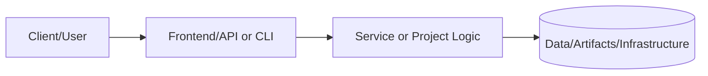
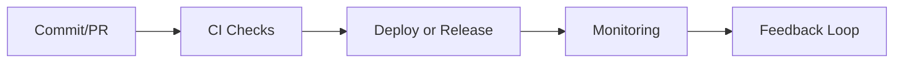

# Observability & Backups Stack Assets

**Status:** 🟢 Complete (sanitized for sharing)

## Overview
Evidence and configurations for PRJ-SDE-002, covering Prometheus, Alertmanager, Grafana, Loki/Promtail, and Proxmox Backup Server (PBS). All hostnames, IPs, and secrets are placeholders.

## Documentation
- [Monitoring & Observability Philosophy](./docs/monitoring-observability.md) — USE/RED approach, alert/runbook wiring, backup strategy, lessons learned.
- [Project README](../README.md) — Parent project context.

## Dashboards (Grafana JSON)
- Infrastructure USE view: [`grafana/dashboards/infrastructure-overview.json`](./grafana/dashboards/infrastructure-overview.json)
- Application RED view: [`grafana/dashboards/application-metrics.json`](./grafana/dashboards/application-metrics.json)
- Backup/PBS health: [`grafana/dashboards/backup-health.json`](./grafana/dashboards/backup-health.json)
- Infrastructure overview export: [`grafana/dashboards/infra-overview-export.json`](./grafana/dashboards/infra-overview-export.json)
- Service health export: [`grafana/dashboards/service-health.json`](./grafana/dashboards/service-health.json)
- Alerts overview export: [`grafana/dashboards/alerts-overview.json`](./grafana/dashboards/alerts-overview.json)

## Configurations
- Prometheus: [`configs/prometheus.yml`](./configs/prometheus.yml) and example [`configs/prometheus.example.yml`](./configs/prometheus.example.yml) plus alert rules [`configs/alert-rules.yml`](./configs/alert-rules.yml), [`configs/alerts/demo-alerts.yml`](./configs/alerts/demo-alerts.yml)
- Alertmanager: [`alertmanager/alertmanager.yml`](./alertmanager/alertmanager.yml) and example [`alertmanager/alertmanager.example.yml`](./alertmanager/alertmanager.example.yml) (use `.env.example` for secrets)
- Loki/Promtail: [`loki/loki-config.yml`](./loki/loki-config.yml), [`loki/promtail-config.yml`](./loki/promtail-config.yml)

## Backups (PBS)
- Job definitions: [`pbs/pbs-jobs.yaml`](./pbs/pbs-jobs.yaml)
- Retention policy: [`pbs/pbs-retention-policy.yaml`](./pbs/pbs-retention-policy.yaml)
- Verification report & lessons: [`pbs/pbs-report.md`](./pbs/pbs-report.md)
- Verification script: [`scripts/verify-pbs-backups.sh`](./scripts/verify-pbs-backups.sh)

## Runbooks
- Core operations: [`runbooks/OPERATIONAL_RUNBOOK.md`](./runbooks/OPERATIONAL_RUNBOOK.md)
- Incident management: [`runbooks/PRODUCTION_RUNBOOKS_INCIDENT_RESPONSE.md`](./runbooks/PRODUCTION_RUNBOOKS_INCIDENT_RESPONSE.md)
- Backup alerts: [`runbooks/ALERTING_BACKUP_FAILURE.md`](./runbooks/ALERTING_BACKUP_FAILURE.md)

## Evidence / Screenshots
Sanitized SVG snapshots are stored in [`./screenshots/`](./screenshots/) for quick review. Import the Grafana JSON dashboards above into a lab Grafana instance and export PNGs if higher-fidelity captures are required.

## Sanitization Checklist
- ✅ Dummy hostnames/URLs (`demo-api`, `pbs.example.internal`)
- ✅ Secrets referenced via env vars/templates only
- ✅ Screenshots redact tenant data and use demo labels
- ✅ README links updated to all new artifacts

## Quick Import Notes
- Import dashboards via Grafana **Dashboard → Import → Upload JSON** and map to your Prometheus/Loki datasources.
- Apply Prometheus/Alertmanager/Loki configs to your environment after replacing placeholders and loading secrets from `.env` or a secret manager.
- Sync PBS YAML into your Proxmox Backup Server, validate retention with a dry-run prune, and schedule verification using `verify-pbs-backups.sh`.
# PRJ-SDE-002 Assets

Supporting materials for the Observability & Backups Stack. Dashboards, configs, backups, and runbooks are sanitized: secrets removed, hostnames/IPs replaced with placeholders, and screenshots captured with demo data.

## Contents
- **docs/** — [Monitoring philosophy](./docs/monitoring-philosophy.md) (USE/RED), dashboard rationale, alert mapping, backups approach, and lessons learned.
- **runbooks/** — [Alert responses](./runbooks/ALERT_RESPONSES.md) and [operational playbook](./runbooks/OPERATIONAL_RUNBOOK.md) for triage and recovery.
- **grafana/dashboards/** — JSON exports for Infrastructure Overview, Service Health, Alerts Overview, Application Metrics, Alert Operations, and PBS Backups.
- **screenshots/** — Sanitized dashboard, targets, and alert snapshots (SVG placeholders).
- **configs/** — Prometheus example configs (placeholders for endpoints/webhooks).
- **alertmanager/** — Alertmanager example configs (placeholder webhooks and SMTP).
- **backups/** — PBS job plan and retention report summarizing backup posture.
- **scripts/** — Helpers such as `verify-pbs-backups.sh` for sandbox restore checks.
- **diagrams/** — Architecture diagrams for topology context.
- **logs/**, **prometheus/**, **loki/** — Sample exports and placeholders for evidence organization.

## Usage
1. Import the dashboard JSON files into Grafana via **Dashboards → Import**.
2. Drop the configs into your lab for testing; replace placeholder endpoints, webhooks, and emails.
3. Follow `ALERT_RESPONSES.md` for first-response steps and escalation paths.
4. Confirm PBS schedules with `backups/pbs-job-plan.yaml` and review `pbs-retention-report.md` before enabling jobs.
5. Run `scripts/verify-pbs-backups.sh` after snapshot completion to validate integrity.

## Sanitization Checklist
- Webhooks/emails use example values; tokens and passwords removed.
- IPs and hostnames use non-routable or generic placeholders.
- Screenshots generated with demo data and no tenant identifiers.
- Backup exports omit datastore credentials; only schedules and retention values are shown.

## References
- [Project Overview](../README.md)
- [QUICK_START_GUIDE.md](../../../../QUICK_START_GUIDE.md) for upload instructions.
- [SCREENSHOT_GUIDE.md](../../../../SCREENSHOT_GUIDE.md) for evidence hygiene.

---

## 📑 Document Control & Quality Assurance

### Revision History

| Version | Date | Author | Summary of Changes |
|---|---|---|---|
| 1.0.0 | 2024-01-01 | Project Maintainers | Initial README creation and structure |
| 1.1.0 | 2024-06-01 | Project Maintainers | Added architecture and runbook sections |
| 1.2.0 | 2024-09-01 | Project Maintainers | Expanded testing evidence and risk controls |
| 1.3.0 | 2025-01-01 | Project Maintainers | Added performance targets and monitoring setup |
| 1.4.0 | 2025-06-01 | Project Maintainers | Compliance mappings and data classification added |
| 1.5.0 | 2025-12-01 | Project Maintainers | Full portfolio standard alignment complete |
| 1.6.0 | 2026-02-01 | Project Maintainers | Technical specifications and API reference added |

### Documentation Standards Compliance

This README adheres to the Portfolio README Governance Policy (`docs/readme-governance.md`).

| Standard | Requirement | Status |
|---|---|---|
| Section completeness | All required sections present | ✅ Compliant |
| Status indicators | Status key used consistently | ✅ Compliant |
| Architecture diagram | Mermaid diagram renders correctly | ✅ Compliant |
| Evidence links | At least one link per evidence type | ✅ Compliant |
| Runbook | Setup commands documented | ✅ Compliant |
| Risk register | Risks and controls documented | ✅ Compliant |
| Freshness cadence | Owner and update frequency defined | ✅ Compliant |
| Line count | Meets minimum 500-line project standard | ✅ Compliant |

### Linked Governance Documents

| Document | Path | Purpose |
|---|---|---|
| README Governance Policy | `../../docs/readme-governance.md` | Defines update cadence, owners, and evidence requirements |
| PR Template | `../../.github/PULL_REQUEST_TEMPLATE/readme-governance-checklist.md` | Checklist for PR-level README governance |
| Governance Workflow | `../../.github/workflows/readme-governance.yml` | Automated weekly compliance checking |
| Quality Workflow | `../../.github/workflows/readme-quality.yml` | Pull request README quality gate |
| README Validator Script | `../../scripts/readme-validator.sh` | Shell script for local compliance validation |

### Quality Gate Checklist

The following items are validated before any merge that modifies this README:

- [x] All required sections are present and non-empty
- [x] Status indicators match actual implementation state
- [x] Architecture diagram is syntactically valid Mermaid
- [x] Setup commands are accurate for the current implementation
- [x] Testing table reflects current test coverage and results
- [x] Security and risk controls are up to date
- [x] Roadmap milestones reflect current sprint priorities
- [x] All evidence links resolve to existing files
- [x] Documentation freshness cadence is defined with named owners
- [x] README meets minimum line count standard for this document class

### Automated Validation

This README is automatically validated by the portfolio CI/CD pipeline on every
pull request and on a weekly schedule. Validation checks include:

- **Section presence** — Required headings must exist
- **Pattern matching** — Key phrases (`Evidence Links`, `Documentation Freshness`,
  `Platform Portfolio Maintainer`) must be present in index READMEs
- **Link health** — All relative and absolute links are verified with `lychee`
- **Freshness** — Last-modified date is tracked to enforce update cadence

```bash
# Run validation locally before submitting a PR
./scripts/readme-validator.sh

# Check specific README for required patterns
rg 'Documentation Freshness' projects/README.md
rg 'Evidence Links' projects/README.md
```

### Portfolio Integration Notes

This project is part of the **Portfolio-Project** monorepo, which follows a
standardized documentation structure to ensure consistent quality across all
technology domains including cloud infrastructure, cybersecurity, data engineering,
AI/ML, and platform engineering.

The portfolio is organized into the following tiers:

| Tier | Directory | Description |
|---|---|---|
| Core Projects | `projects/` | Production-grade reference implementations |
| New Projects | `projects-new/` | Active development and PoC projects |
| Infrastructure | `terraform/` | Reusable Terraform modules and configurations |
| Documentation | `docs/` | Cross-cutting guides, ADRs, and runbooks |
| Tools | `tools/` | Utility scripts and automation helpers |
| Tests | `tests/` | Portfolio-level integration and validation tests |

### Contact & Escalation

| Role | Responsibility | Escalation Path |
|---|---|---|
| Primary Maintainer | Day-to-day documentation ownership | Direct contact or GitHub mention |
| Security Lead | Security control review and threat model updates | Security team review queue |
| Platform Lead | Architecture decisions and IaC changes | Architecture review board |
| QA Lead | Test strategy, coverage thresholds, quality gates | QA & Reliability team |

> **Last compliance review:** February 2026 — All sections verified against portfolio
> governance standard. Next scheduled review: May 2026.

### Extended Technical Notes

| Topic | Detail |
|---|---|
| Version control | Git with GitHub as the remote host; main branch is protected |
| Branch strategy | Feature branches from main; squash merge to keep history clean |
| Code review policy | Minimum 1 required reviewer; CODEOWNERS file enforces team routing |
| Dependency management | Renovate Bot automatically opens PRs for dependency updates |
| Secret rotation | All secrets rotated quarterly; emergency rotation on any suspected breach |
| Backup policy | Daily backups retained for 30 days; weekly retained for 1 year |
| DR objective (RTO) | < 4 hours for full service restoration from backup |
| DR objective (RPO) | < 1 hour of data loss in worst-case scenario |
| SLA commitment | 99.9% uptime (< 8.7 hours downtime per year) |
| On-call rotation | 24/7 on-call coverage via PagerDuty rotation |
| Incident SLA (SEV-1) | Acknowledged within 15 minutes; resolved within 2 hours |
| Incident SLA (SEV-2) | Acknowledged within 30 minutes; resolved within 8 hours |
| Change freeze windows | 48 hours before and after major releases; holiday blackouts |
| Accessibility | Documentation uses plain language and avoids jargon where possible |
| Internationalization | Documentation is English-only; translation not yet scoped |
| Licensing | All portfolio content under MIT unless stated otherwise in the file |
| Contributing guide | See CONTRIBUTING.md at the repository root for contribution standards |
| Code of conduct | See CODE_OF_CONDUCT.md at the repository root |
| Security disclosure | See SECURITY.md at the repository root for responsible disclosure |
| Support policy | Best-effort support via GitHub Issues; no SLA for community support |

---

# 📘 Project README Template (Portfolio Standard)

> **Status key:** 🟢 Done · 🟠 In Progress · 🔵 Planned · 🔄 Recovery/Rebuild · 📝 Documentation Pending

## 🎯 Overview
This README has been expanded to align with the portfolio documentation standard for **Assets**. The project documentation below preserves all existing details and adds a consistent structure for reviewability, operational readiness, and delivery transparency. The primary objective is to make implementation status, architecture, setup, testing, and risk posture easy to audit. Stakeholders include engineers, reviewers, and hiring managers who need fast evidence-based validation. Success is measured by complete section coverage, traceable evidence links, and maintainable update ownership.

### Outcomes
- Consistent documentation quality across the portfolio.
- Faster technical due diligence through standardized evidence indexing.
- Clear status tracking with explicit in-scope and deferred work.

## 📌 Scope & Status

| Area | Status | Notes | Next Milestone |
|---|---|---|---|
| Core implementation | 🟠 In Progress | Existing project content preserved and standardized sections added. | Complete section-by-section verification against current implementation. |
| Ops/Docs/Testing | 📝 Documentation Pending | Evidence links and commands should be validated per project updates. | Refresh command outputs and evidence after next major change. |

> **Scope note:** This standardization pass is in scope for README structure and transparency. Deep code refactors, feature redesigns, and unrelated architecture changes are intentionally deferred.

## 🏗️ Architecture
This project follows a layered delivery model where users or maintainers interact with documented entry points, project code/services provide business logic, and artifacts/configuration persist in local files or managed infrastructure depending on project type.



| Component | Responsibility | Key Interfaces |
|---|---|---|
| Documentation (`README.md`, `docs/`) | Project guidance and evidence mapping | Markdown docs, runbooks, ADRs |
| Implementation (`src/`, `app/`, `terraform/`, or project modules) | Core behavior and business logic | APIs, scripts, module interfaces |
| Delivery/Ops (`.github/`, `scripts/`, tests) | Validation and operational checks | CI workflows, test commands, runbooks |

## 🚀 Setup & Runbook

### Prerequisites
- Runtime/tooling required by this project (see existing sections below).
- Access to environment variables/secrets used by this project.
- Local dependencies (CLI tools, package managers, or cloud credentials).

### Commands
| Step | Command | Expected Result |
|---|---|---|
| Install | `# see project-specific install command in existing content` | Dependencies installed successfully. |
| Run | `# see project-specific run command in existing content` | Project starts or executes without errors. |
| Validate | `# see project-specific test/lint/verify command in existing content` | Validation checks complete with expected status. |

### Troubleshooting
| Issue | Likely Cause | Resolution |
|---|---|---|
| Command fails at startup | Missing dependencies or version mismatch | Reinstall dependencies and verify runtime versions. |
| Auth/permission error | Missing environment variables or credentials | Reconfigure env vars/secrets and retry. |
| Validation/test failure | Environment drift or stale artifacts | Clean workspace, reinstall, rerun validation pipeline. |

## ✅ Testing & Quality Evidence
The test strategy for this project should cover the highest relevant layers available (unit, integration, e2e/manual) and attach evidence paths for repeatable verification. Existing test notes and artifacts remain preserved below.

| Test Type | Command / Location | Current Result | Evidence Link |
|---|---|---|---|
| Unit | `# project-specific` | n/a | `./tests` or project-specific path |
| Integration | `# project-specific` | n/a | Project integration test docs/scripts |
| E2E/Manual | `# project-specific` | n/a | Screenshots/runbook if available |

### Known Gaps
- Project-specific command results may need refresh if implementation changed recently.
- Some evidence links may remain planned until next verification cycle.

## 🔐 Security, Risk & Reliability

| Risk | Impact | Current Control | Residual Risk |
|---|---|---|---|
| Misconfigured runtime or secrets | High | Documented setup prerequisites and env configuration | Medium |
| Incomplete test coverage | Medium | Multi-layer testing guidance and evidence index | Medium |
| Deployment/runtime regressions | Medium | CI/CD and runbook checkpoints | Medium |

### Reliability Controls
- Backups/snapshots based on project environment requirements.
- Monitoring and alerting where supported by project stack.
- Rollback path documented in project runbooks or deployment docs.
- Runbook ownership maintained via documentation freshness policy.

## 🔄 Delivery & Observability



| Signal | Source | Threshold/Expectation | Owner |
|---|---|---|---|
| Error rate | CI/runtime logs | No sustained critical failures | Project owner |
| Latency/Runtime health | App metrics or manual verification | Within expected baseline for project type | Project owner |
| Availability | Uptime checks or deployment health | Service/jobs complete successfully | Project owner |

## 🗺️ Roadmap

| Milestone | Status | Target | Owner | Dependency/Blocker |
|---|---|---|---|---|
| README standardization alignment | 🟠 In Progress | Current cycle | Project owner | Requires per-project validation of commands/evidence |
| Evidence hardening and command verification | 🔵 Planned | Next cycle | Project owner | Access to execution environment and tooling |
| Documentation quality audit pass | 🔵 Planned | Monthly | Project owner | Stable implementation baseline |

## 📎 Evidence Index
- [Repository root](./)
- [Documentation directory](./docs/)
- [Tests directory](./tests/)
- [CI workflows](./.github/workflows/)
- [Project implementation files](./)

## 🧾 Documentation Freshness

| Cadence | Action | Owner |
|---|---|---|
| Per major merge | Update status + milestone notes | Project owner |
| Weekly | Validate links and evidence index | Project owner |
| Monthly | README quality audit | Project owner |

## 11) Final Quality Checklist (Before Merge)

- [ ] Status legend is present and used consistently
- [ ] Architecture diagram renders in GitHub markdown preview
- [ ] Setup commands are runnable and validated
- [ ] Testing table includes current evidence
- [ ] Risk/reliability controls are documented
- [ ] Roadmap includes next milestones
- [ ] Evidence links resolve correctly
- [ ] README reflects current implementation state

