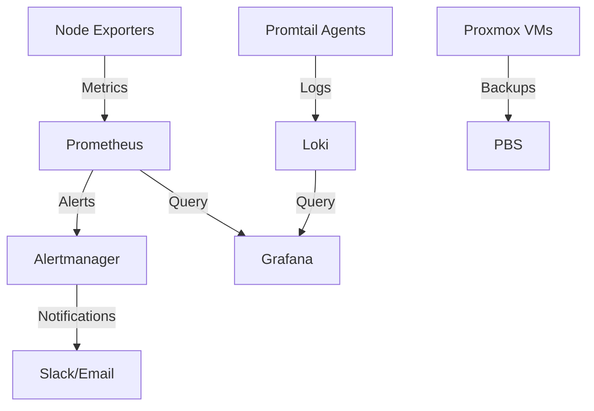

# Observability & Backups Stack - Operational Runbook

**Version:** 1.0
**Last Updated:** November 6, 2025
**Maintainer:** Samuel Jackson
**On-Call Contact:** #homelab-alerts (Slack)

---

## Table of Contents

1. [Overview](#overview)
2. [Service Architecture](#service-architecture)
3. [Alert Response Procedures](#alert-response-procedures)
4. [Troubleshooting Guide](#troubleshooting-guide)
5. [Maintenance Procedures](#maintenance-procedures)
6. [Backup Operations](#backup-operations)
7. [Service Recovery](#service-recovery)
8. [Emergency Contacts](#emergency-contacts)

---

## Overview

### Purpose
This runbook provides step-by-step operational procedures for maintaining and troubleshooting the homelab observability and backup infrastructure.

### Scope
- **Monitoring:** Prometheus, Grafana, Node Exporters
- **Logging:** Loki, Promtail agents
- **Alerting:** Alertmanager
- **Backup:** Proxmox Backup Server (PBS)

> All hostnames/IPs in this document use placeholder demo values for sanitization.

### Service Criticality
- **Criticality Level:** P1 (Core Infrastructure)
- **RTO (Recovery Time Objective):** 1 hour
- **RPO (Recovery Point Objective):** 24 hours

### Key Metrics
- **Uptime Target:** 99.5% (43.8 hours downtime/year)
- **Alert Response Time:** <15 minutes (Critical), <1 hour (Warning)
- **Backup Success Rate:** 99%+ (daily backups)

---

## Service Architecture

### Component Overview

| Component | Host | Port | Purpose | Status Check |
|-----------|------|------|---------|--------------|
| Prometheus | 10.0.0.11 | 9090 | Metrics collection & storage | `curl http://10.0.0.11:9090/-/healthy` |
| Grafana | 10.0.0.11 | 3000 | Visualization & dashboards | `curl http://10.0.0.11:3000/api/health` |
| Loki | 10.0.0.11 | 3100 | Log aggregation | `curl http://10.0.0.11:3100/ready` |
| Alertmanager | 10.0.0.11 | 9093 | Alert routing | `curl http://10.0.0.11:9093/-/healthy` |
| PBS | 10.0.0.15 | 8007 | Backup server | `pvesh get /cluster/resources` |

### Service Dependencies



**Critical Dependencies:**
- Prometheus depends on: Network connectivity to exporters, local storage
- Grafana depends on: Prometheus API, Loki API
- Alertmanager depends on: Prometheus alerts, Slack webhook
- PBS depends on: Proxmox API, TrueNAS NFS mount

---

## Alert Response Procedures

### Alert: HostDown

**Trigger Condition:** `up == 0` for 2 minutes
**Severity:** Critical
**Response Time:** 5 minutes

#### Symptoms
- Prometheus cannot scrape metrics from target
- Target shows as "DOWN" in Prometheus UI
- Grafana dashboards show "No Data"

#### Immediate Actions

1. **Verify Alert Legitimacy**
   ```bash
   # Check if host is pingable
   ping -c 4 10.0.0.21

   # If no response, check from pfSense
   ssh admin@10.0.0.1
   ping 10.0.0.21
   ```

2. **Check Service Status on Target**
   ```bash
   # SSH to target (if accessible)
   ssh admin@10.0.0.21

   # Check node_exporter service
   sudo systemctl status node_exporter

   # Expected output:
   # ● node_exporter.service - Prometheus Node Exporter
   #    Loaded: loaded (/etc/systemd/system/node_exporter.service)
   #    Active: active (running)
   ```

3. **Verify Network Connectivity**
   ```bash
   # Test connectivity from Prometheus host
   ssh admin@10.0.0.11

   # Test port 9100 connectivity
   nc -zv 10.0.0.21 9100

   # Expected: "Connection succeeded"
   ```

#### Diagnosis Decision Tree

```
Host unreachable?
├─ YES → Check physical/VM status
│   ├─ VM powered off → Power on via Proxmox UI
│   ├─ Network issue → Check VLAN/firewall rules
│   └─ Host crashed → Check Proxmox console, reboot if necessary
│
└─ NO → Host reachable but exporter down
    ├─ Service stopped → Restart node_exporter
    ├─ Port blocked → Check firewall rules (UFW/iptables)
    └─ Exporter crashed → Check logs: `journalctl -u node_exporter -n 50`
```

#### Resolution Steps

**Scenario A: VM Powered Off**
```bash
# Power on VM via Proxmox CLI
ssh root@10.0.0.10
qm start <VMID>

# Wait 2 minutes for boot and verify
watch -n 5 'qm status <VMID>'

# Verify services auto-start
ssh admin@10.0.0.21 "systemctl is-active node_exporter"
```

**Scenario B: Node Exporter Service Stopped**
```bash
# Restart service
sudo systemctl restart node_exporter

# Verify it's running
sudo systemctl status node_exporter

# Check metrics endpoint
curl http://localhost:9100/metrics | head -20

# Enable auto-start if disabled
sudo systemctl enable node_exporter
```

**Scenario C: Firewall Blocking Port 9100**
```bash
# Check UFW rules
sudo ufw status numbered

# Allow Prometheus scraper (10.0.0.11)
sudo ufw allow from 10.0.0.11 to any port 9100 proto tcp

# Verify connection
curl http://10.0.0.21:9100/metrics
```

#### Verification
- [ ] Target shows "UP" in Prometheus UI (http://10.0.0.11:9090/targets)
- [ ] Metrics visible in Grafana dashboard
- [ ] Alert resolves in Alertmanager (auto-resolves after 2 successful scrapes)
- [ ] Document incident in #incidents channel

#### Escalation
If host remains down after 30 minutes:
1. Check Proxmox host health (`pvesh get /nodes`)
2. Review Proxmox logs (`journalctl -u pve-cluster`)
3. Consider hardware failure (check IPMI/iLO if available)

---

### Alert: HighCPUUsage

**Trigger Condition:** CPU >80% for 15 minutes
**Severity:** Warning
**Response Time:** 30 minutes

#### Symptoms
- Grafana CPU dashboard shows sustained high utilization
- System may be sluggish or unresponsive
- Other services on same host may be affected

#### Immediate Actions

1. **Identify Process Consuming CPU**
   ```bash
   ssh admin@<TARGET_HOST>

   # View top CPU processes
   top -bn 2 -d 1 | grep "Cpu(s)" | tail -1

   # Identify culprit process
   ps aux --sort=-%cpu | head -10
   ```

2. **Gather Context**
   ```bash
   # Check system load
   uptime
   # Expected: Load average should match # of CPU cores

   # Check for runaway processes
   ps -eo pid,ppid,cmd,%cpu,%mem --sort=-%cpu | head -20

   # Check recent changes
   last | head -20  # Recent logins
   sudo journalctl -n 50  # Recent system events
   ```

3. **Analyze with Prometheus**
   ```promql
   # View CPU by core
   100 - (avg by(instance,cpu) (irate(node_cpu_seconds_total{mode="idle",instance="<TARGET>:9100"}[5m])) * 100)

   # Identify mode breakdown
   sum by(mode) (irate(node_cpu_seconds_total{instance="<TARGET>:9100"}[5m]))
   ```

#### Common Causes

| Cause | Symptom | Resolution |
|-------|---------|------------|
| Backup running | High `iowait` (>30%) | Normal during backup window (02:00-04:00), wait for completion |
| Log rotation | High `system` CPU, process = `gzip` | Normal, completes in 5-10 minutes |
| Prometheus scraping | High CPU on exporter host | Increase scrape interval from 15s to 30s in prometheus.yml |
| Application spike | High `user` CPU, specific PID | Investigate application logs, consider scaling |
| Bitcoin miner (compromised) | High `user` CPU, unknown process | SECURITY INCIDENT - isolate host immediately |

#### Resolution Steps

**Scenario A: Normal Workload (Backup/Batch Job)**
```bash
# Verify it's a scheduled job
crontab -l | grep -E "0[0-4].*"  # Jobs between midnight-4am

# Check if backup is running
ps aux | grep -E "(vzdump|proxmox-backup-client)"

# Expected: Job completes within 2 hours, CPU returns to <40%

# Action: Silence alert for maintenance window
amtool silence add alertname="HighCPUUsage" instance="<TARGET>:9100" --duration=2h --comment="Nightly backup in progress"
```

**Scenario B: Runaway Process**
```bash
# Identify process PID from top/ps output
PID=<PROCESS_ID>

# Get process details
ps -p $PID -o pid,ppid,cmd,%cpu,%mem,start

# Check process tree
pstree -p $PID

# Option 1: Graceful termination
sudo kill -15 $PID
sleep 5
ps -p $PID  # Verify terminated

# Option 2: Force kill (if process doesn't respond)
sudo kill -9 $PID

# Option 3: Restart systemd service (if applicable)
sudo systemctl restart <SERVICE_NAME>
```

**Scenario C: Resource Constraint (Underpowered VM)**
```bash
# Check VM resource allocation
ssh root@10.0.0.10
qm config <VMID> | grep -E "(cores|memory)"

# Current allocation:
# cores: 2
# memory: 4096

# Increase CPU cores (requires VM shutdown or hotplug)
qm set <VMID> --cores 4

# Or add memory
qm set <VMID> --memory 8192

# Hot-add CPU (if guest supports it)
qm set <VMID> --cores 4 --hotplug cpu
```

#### Verification
- [ ] CPU utilization <60% for 10 minutes
- [ ] System load average <(# of CPU cores)
- [ ] No zombie processes (`ps aux | grep defunct`)
- [ ] Services responsive (test with curl/SSH)
- [ ] Alert auto-resolves

---

### Alert: DiskSpaceLow

**Trigger Condition:** Free space <15%
**Severity:** Warning
**Response Time:** 1 hour

#### Immediate Actions

1. **Identify Large Consumers**
   ```bash
   ssh admin@<TARGET_HOST>

   # Check filesystem usage
   df -h

   # Find largest directories
   sudo du -h --max-depth=2 / | sort -hr | head -20

   # Common culprits:
   # /var/log - Log files
   # /var/lib/docker - Docker images/containers
   # /var/lib/prometheus - Prometheus metrics
   # /tmp - Temporary files
   ```

2. **Quick Wins - Clear Safe Files**
   ```bash
   # Clear package cache
   sudo apt-get clean  # Debian/Ubuntu
   sudo yum clean all  # CentOS/RHEL

   # Clear old journals (keep 7 days)
   sudo journalctl --vacuum-time=7d

   # Clear old log files (older than 30 days)
   sudo find /var/log -type f -name "*.gz" -mtime +30 -delete
   sudo find /var/log -type f -name "*.log.*" -mtime +30 -delete

   # Clear APT cache
   sudo apt-get autoclean
   sudo apt-get autoremove
   ```

3. **Check for Large Log Files**
   ```bash
   # Find largest files
   sudo find /var/log -type f -exec du -h {} + | sort -rh | head -20

   # Check for log rotation
   sudo cat /etc/logrotate.conf
   sudo ls -lh /etc/logrotate.d/

   # Manually rotate if needed
   sudo logrotate -f /etc/logrotate.conf
   ```

#### Resolution by Filesystem

**Scenario A: `/var/lib/prometheus` Full**
```bash
# Check Prometheus retention
sudo cat /etc/systemd/system/prometheus.service | grep retention

# Current retention: --storage.tsdb.retention.time=30d

# Reduce retention to 15 days
sudo systemctl stop prometheus
sudo sed -i 's/retention.time=30d/retention.time=15d/' /etc/systemd/system/prometheus.service
sudo systemctl daemon-reload
sudo systemctl start prometheus

# Manually delete old data (if urgent)
sudo find /var/lib/prometheus/data -type d -mtime +15 -exec rm -rf {} +
```

**Scenario B: `/var/log` Full**
```bash
# Identify culprit log
sudo du -sh /var/log/* | sort -hr | head -10

# Common issues:
# - syslog.1 (10GB) → Application logging too verbosely
# - auth.log (5GB) → SSH brute-force attempts
# - apache2/error.log (3GB) → Application errors

# Truncate actively written log (emergency only)
sudo truncate -s 0 /var/log/syslog

# Configure log rotation
sudo nano /etc/logrotate.d/rsyslog
# Add:
# /var/log/syslog {
#     daily
#     rotate 7
#     compress
#     delaycompress
#     notifempty
#     create 0640 syslog adm
# }
```

**Scenario C: Docker Images/Containers**
```bash
# View disk usage
docker system df

# Remove unused containers
docker container prune -f

# Remove unused images
docker image prune -a -f

# Remove unused volumes
docker volume prune -f

# Nuclear option (removes all stopped containers + images)
docker system prune -a -f --volumes
```

#### Verification
- [ ] Disk usage <80%
- [ ] At least 5GB free space available
- [ ] Log rotation configured
- [ ] Monitoring confirms space increasing (over 24 hours)
- [ ] Alert auto-resolves

---

### Alert: BackupJobFailed

**Trigger Condition:** `proxmox_backup_job_last_status != 0`
**Severity:** Critical
**Response Time:** 15 minutes

#### Immediate Actions

1. **Check Backup Status in PBS**
   ```bash
   # SSH to Proxmox host
   ssh root@10.0.0.10

   # List recent backup tasks
   pvesh get /cluster/tasks --limit 50 --source cluster | grep vzdump

   # Check specific backup job
   cat /var/log/vzdump/<VMID>.log | tail -50
   ```

2. **Identify Failure Cause**
   ```bash
   # Common error patterns:
   grep -i "error\|fail" /var/log/vzdump/*.log

   # Check PBS connectivity
   ping -c 4 10.0.0.15

   # Test PBS API
   pvesh get /cluster/backup --target 10.0.0.15
   ```

3. **Verify Storage Availability**
   ```bash
   # Check TrueNAS NFS mount
   df -h | grep truenas

   # Mount should show:
   # 10.0.0.5:/mnt/tank/backups  5.0T  1.2T  3.8T  24% /mnt/pbs-storage

   # Test write access
   touch /mnt/pbs-storage/test-$(date +%s).txt
   ```

#### Common Failure Scenarios

| Error Message | Cause | Resolution |
|---------------|-------|------------|
| `permission denied` | PBS storage mount read-only | Remount NFS: `mount -o remount,rw /mnt/pbs-storage` |
| `no space left on device` | Backup storage full | Free space or expand TrueNAS volume |
| `timeout` | Network connectivity issue | Check network, restart PBS service |
| `VM is locked` | VM already being backed up | Wait 30min or clear lock: `qm unlock <VMID>` |
| `snapshot failed` | LVM thin pool full | Expand LVM or free space |

#### Resolution Steps

**Scenario A: Storage Full**
```bash
# Check PBS storage usage
ssh root@10.0.0.15
proxmox-backup-manager datastore list

# Prune old backups
proxmox-backup-manager prune \
  --datastore homelab-backups \
  --keep-daily 7 \
  --keep-weekly 4 \
  --keep-monthly 3

# Verify space freed
df -h /mnt/datastore
```

**Scenario B: Network Issue**
```bash
# Test connectivity from Proxmox to PBS
ssh root@10.0.0.10
ping -c 10 10.0.0.15

# If packet loss >5%, investigate network
traceroute 10.0.0.15

# Restart PBS service
ssh root@10.0.0.15
systemctl restart proxmox-backup-proxy
systemctl restart proxmox-backup

# Wait 2 minutes, then retry backup
ssh root@10.0.0.10
vzdump <VMID> --storage homelab-pbs --mode snapshot
```

**Scenario C: VM Locked (Stale Lock)**
```bash
# Check VM lock status
qm status <VMID>
# If shows "backup" lock from 2+ hours ago, it's stale

# Force unlock (caution: only if no backup is actually running)
qm unlock <VMID>

# Retry backup
vzdump <VMID> --storage homelab-pbs --mode snapshot --remove 0

# Monitor backup progress
tail -f /var/log/vzdump/<VMID>.log
```

#### Verification
- [ ] Backup completes successfully (check PBS UI)
- [ ] Backup file size is reasonable (compare to previous backups)
- [ ] Run verification script: `./verify-pbs-backups.sh`
- [ ] PBS shows snapshot integrity: 100%
- [ ] Alert auto-resolves

#### Post-Incident
```bash
# Run full backup verification
ssh root@10.0.0.10
./assets/scripts/verify-pbs-backups.sh

# Document incident
# - What failed?
# - Root cause?
# - How long was RPO gap?
# - Preventive measures?

# Update runbook if new failure mode discovered
```

---

## Troubleshooting Guide

### Prometheus Not Scraping Targets

**Symptoms:**
- Targets show "DOWN" status
- Grafana shows "No Data"
- Alerts for specific hosts

**Diagnosis:**
```bash
ssh admin@10.0.0.11

# Check Prometheus service
sudo systemctl status prometheus

# Check Prometheus logs
sudo journalctl -u prometheus -n 100 -f

# Common errors:
# - "context deadline exceeded" → Target timeout (scrape_timeout too short)
# - "connection refused" → Port closed or exporter not running
# - "no route to host" → Network/firewall issue
```

**Resolution:**
```bash
# Test connectivity manually
curl http://<TARGET_IP>:<EXPORTER_PORT>/metrics

# If successful but Prometheus can't scrape:
# 1. Check Prometheus config
sudo nano /etc/prometheus/prometheus.yml

# Verify target is listed:
scrape_configs:
  - job_name: 'node'
    static_configs:
      - targets: ['10.0.0.20:9100', '10.0.0.21:9100']

# 2. Reload Prometheus config (without restart)
curl -X POST http://localhost:9090/-/reload

# 3. Verify target appears in UI
# http://10.0.0.11:9090/targets
```

---

### Grafana Dashboard Shows "No Data"

**Symptoms:**
- Dashboard panels empty or show "No data"
- Query returns empty result

**Diagnosis:**
```bash
# Check Grafana service
sudo systemctl status grafana-server

# Check Grafana logs
sudo tail -f /var/log/grafana/grafana.log

# Test Prometheus datasource
curl http://10.0.0.11:9090/api/v1/query?query=up

# Expected: {"status":"success","data":{...}}
```

**Resolution:**
```bash
# Verify datasource in Grafana UI
# 1. Go to Configuration → Data Sources
# 2. Test Prometheus connection (should show "Success")

# If test fails:
# - Check URL: http://10.0.0.11:9090 (not https)
# - Check Prometheus is running
# - Check firewall allows port 9090

# Verify query in Grafana Explore
# 1. Go to Explore
# 2. Select Prometheus datasource
# 3. Run simple query: `up`
# 4. Should see list of targets

# If data exists in Explore but not dashboard:
# - Check time range (may be too narrow)
# - Check variable values (may filter out all data)
# - Check panel query syntax
```

---

### Alertmanager Not Sending Notifications

**Symptoms:**
- Alerts fire in Prometheus but no Slack/Email received
- Alertmanager UI shows alerts but "Silenced" or "Inhibited"

**Diagnosis:**
```bash
ssh admin@10.0.0.11

# Check Alertmanager status
sudo systemctl status alertmanager

# Check Alertmanager logs
sudo journalctl -u alertmanager -n 50 -f

# Test Slack webhook manually
curl -X POST https://hooks.slack.com/services/YOUR/WEBHOOK/URL \
  -H 'Content-Type: application/json' \
  -d '{"text":"Test alert from Alertmanager"}'
```

**Resolution:**
```bash
# Verify Alertmanager config
sudo cat /etc/alertmanager/alertmanager.yml

# Check for common issues:
# 1. Incorrect Slack webhook URL
# 2. Missing receiver name in route
# 3. Silences configured

# Test configuration
amtool config show --alertmanager.url=http://10.0.0.11:9093

# Check active silences
amtool silence query --alertmanager.url=http://10.0.0.11:9093

# Remove all silences (if accidentally configured)
amtool silence expire $(amtool silence query -q) \
  --alertmanager.url=http://10.0.0.11:9093

# Reload Alertmanager
curl -X POST http://10.0.0.11:9093/-/reload
```

---

## Maintenance Procedures

### Updating Prometheus

**Frequency:** Quarterly or when security updates available
**Downtime:** ~5 minutes
**Risk Level:** Medium

#### Prerequisites
- [ ] Review Prometheus changelog for breaking changes
- [ ] Backup Prometheus data directory (`/var/lib/prometheus`)
- [ ] Notify team of planned maintenance window
- [ ] Schedule during low-traffic period (Sunday 02:00-04:00)

#### Steps
```bash
ssh admin@10.0.0.11

# 1. Backup current version and data
sudo systemctl stop prometheus
sudo cp -r /var/lib/prometheus /var/lib/prometheus.backup-$(date +%F)
prometheus --version > /tmp/prometheus-version-before.txt

# 2. Download new version
cd /tmp
wget https://github.com/prometheus/prometheus/releases/download/v2.48.0/prometheus-2.48.0.linux-amd64.tar.gz
tar xvfz prometheus-2.48.0.linux-amd64.tar.gz

# 3. Stop Prometheus
sudo systemctl stop prometheus

# 4. Replace binaries
sudo cp /tmp/prometheus-2.48.0.linux-amd64/prometheus /usr/local/bin/
sudo cp /tmp/prometheus-2.48.0.linux-amd64/promtool /usr/local/bin/
sudo chown prometheus:prometheus /usr/local/bin/prometheus
sudo chown prometheus:prometheus /usr/local/bin/promtool

# 5. Verify configuration is valid
promtool check config /etc/prometheus/prometheus.yml

# 6. Start Prometheus
sudo systemctl start prometheus

# 7. Verify startup
sudo journalctl -u prometheus -n 50
curl http://localhost:9090/-/healthy
# Expected: Prometheus is Healthy.

# 8. Check Grafana dashboards render correctly
# Open: http://10.0.0.11:3000

# 9. Document upgrade
prometheus --version > /tmp/prometheus-version-after.txt
```

#### Rollback (if issues occur)
```bash
# Stop new version
sudo systemctl stop prometheus

# Restore old version
sudo cp /usr/local/bin/prometheus /usr/local/bin/prometheus.new
sudo apt-cache policy prometheus  # Find old version
sudo apt-get install prometheus=<OLD_VERSION>

# Or restore from backup
sudo cp /var/lib/prometheus.backup-$(date +%F)/* /var/lib/prometheus/

# Start old version
sudo systemctl start prometheus
```

---

### Rotating Prometheus Data (Manual Data Cleanup)

**Frequency:** As needed (if disk space critical)
**Downtime:** 0 minutes
**Risk Level:** Low

```bash
ssh admin@10.0.0.11

# Check current data size
sudo du -sh /var/lib/prometheus/data/

# Check configured retention
grep retention /etc/systemd/system/prometheus.service
# --storage.tsdb.retention.time=30d

# Manually delete old blocks (older than 15 days)
sudo find /var/lib/prometheus/data -type d -name "0*" -mtime +15 -exec rm -rf {} +

# No restart needed, Prometheus handles this gracefully

# Verify data still loads in Grafana
```

---

### Adding a New Scrape Target

**Steps:**
```bash
ssh admin@10.0.0.11

# 1. Edit Prometheus config
sudo nano /etc/prometheus/prometheus.yml

# 2. Add new target to appropriate job
scrape_configs:
  - job_name: 'node'
    static_configs:
      - targets:
        - '10.0.0.20:9100'
        - '10.0.0.21:9100'
        - '10.0.0.25:9100'  # ← NEW TARGET

# 3. Validate configuration
promtool check config /etc/prometheus/prometheus.yml

# 4. Reload Prometheus (no restart needed)
curl -X POST http://localhost:9090/-/reload

# 5. Verify target appears and is "UP"
curl http://localhost:9090/api/v1/targets | jq '.data.activeTargets[] | select(.labels.instance=="10.0.0.25:9100")'

# 6. Add to Grafana dashboard variable if needed
```

---

## Backup Operations

### Manual Backup Trigger

**When to Use:** Before major changes, after critical VM creation

```bash
ssh root@10.0.0.10

# Backup single VM
vzdump <VMID> --storage homelab-pbs --mode snapshot --compress zstd

# Backup multiple VMs
vzdump 100 101 102 --storage homelab-pbs --mode snapshot

# Backup all VMs on node
vzdump --all --storage homelab-pbs --mode snapshot

# Monitor backup progress
tail -f /var/log/vzdump/<VMID>.log
```

### Backup Verification

**Frequency:** Daily (automated via cron)

```bash
ssh root@10.0.0.10

# Run verification script
./assets/scripts/verify-pbs-backups.sh

# Expected output:
# ✓ Checking PBS connectivity... OK
# ✓ Checking last backup for VMID 100... OK (2 hours ago)
# ✓ Checking last backup for VMID 101... OK (2 hours ago)
# ✓ Checking snapshot integrity... OK (100%)
# ✓ Checking storage capacity... OK (76% free)
#
# Summary: All backups verified successfully

# If failures detected, investigate immediately
```

---

## Service Recovery

### Recovering Prometheus from Corruption

**Scenario:** Prometheus fails to start due to data corruption

```bash
ssh admin@10.0.0.11

# Check error logs
sudo journalctl -u prometheus -n 100

# Common errors:
# - "corruption in block" → Data corruption
# - "unexpected end of file" → Incomplete write

# Option 1: Repair corrupted blocks
sudo systemctl stop prometheus
sudo -u prometheus promtool tsdb analyze /var/lib/prometheus/data/

# Remove corrupted blocks
sudo rm -rf /var/lib/prometheus/data/<CORRUPTED_BLOCK_ID>

sudo systemctl start prometheus

# Option 2: Restore from backup (if repair fails)
sudo systemctl stop prometheus
sudo rm -rf /var/lib/prometheus/data/*
sudo cp -r /var/lib/prometheus.backup-<DATE>/data/* /var/lib/prometheus/data/
sudo chown -R prometheus:prometheus /var/lib/prometheus/data/
sudo systemctl start prometheus
```

### Recovering VM from Backup

**Scenario:** VM is corrupted or lost, need to restore from PBS

```bash
ssh root@10.0.0.10

# 1. List available backups
pvesh get /nodes/proxmox-01/storage/homelab-pbs/content --vmid <VMID>

# 2. Restore to original VMID (overwrites existing VM)
pct restore <VMID> /mnt/pbs-storage/dump/vzdump-lxc-<VMID>-<TIMESTAMP>.tar.zst \
  --storage local-lvm

# Or for VMs:
qmrestore /mnt/pbs-storage/dump/vzdump-qemu-<VMID>-<TIMESTAMP>.vma.zst <VMID>

# 3. Restore to NEW VMID (clone, safer approach)
qmrestore /mnt/pbs-storage/dump/vzdump-qemu-<VMID>-<TIMESTAMP>.vma.zst <NEW_VMID> \
  --storage local-lvm

# 4. Start restored VM
qm start <VMID>

# 5. Verify services
qm status <VMID>
ssh admin@<RESTORED_VM_IP> "systemctl is-active node_exporter"
```

---

## Emergency Contacts

### On-Call Rotation
- **Primary:** Samuel Jackson
- **Backup:** TBD
- **Escalation:** N/A (homelab)

### External Support
- **Proxmox Community:** https://forum.proxmox.com/
- **Prometheus Slack:** https://slack.cncf.io/ → #prometheus
- **Grafana Community:** https://community.grafana.com/

### Critical Service URLs
- Prometheus: http://10.0.0.11:9090
- Grafana: http://10.0.0.11:3000
- Alertmanager: http://10.0.0.11:9093
- PBS: https://10.0.0.15:8007

---

**End of Runbook**

*Last Reviewed: November 6, 2025*
*Next Review: February 6, 2026 (Quarterly)*
