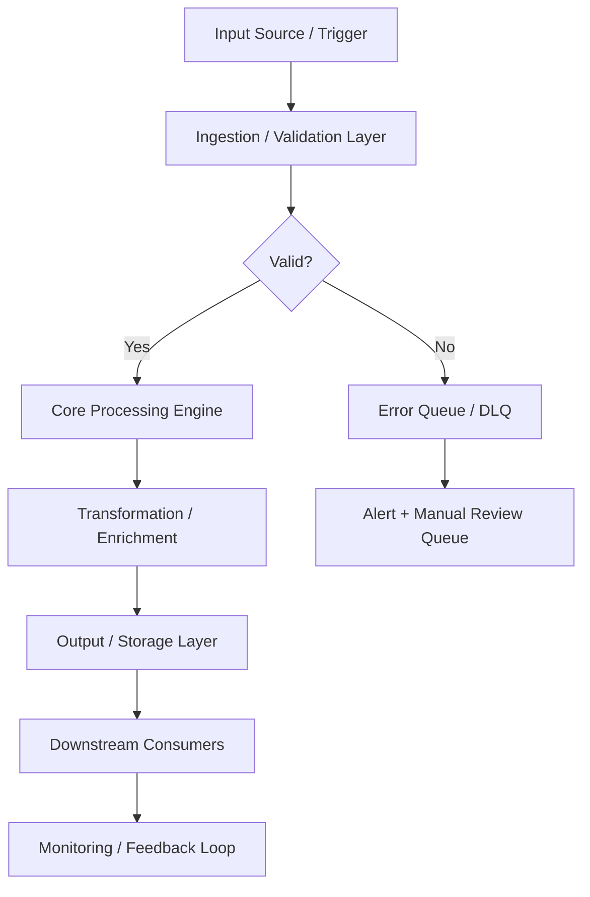

# PRJ-CYB-BLUE-001: AWS SIEM Pipeline with OpenSearch

## Documentation
For cross-project documentation, standards, and runbooks, see the [Portfolio Documentation Hub](../../../DOCUMENTATION_INDEX.md).


**Status:** 🟢 **COMPLETE**
**Category:** Cybersecurity / Blue Team / Security Engineering
**Technologies:** AWS OpenSearch, Kinesis Firehose, Lambda, GuardDuty, VPC Flow Logs, CloudTrail, Python

---

## Overview

Production-ready Security Information and Event Management (SIEM) pipeline built on AWS, providing centralized log aggregation, real-time threat detection, and security monitoring across cloud infrastructure.

**Key Capabilities:**
- **Centralized Log Aggregation**: Ingest logs from GuardDuty, VPC Flow Logs, and CloudTrail
- **Real-time Processing**: Lambda-based log transformation and normalization
- **Threat Detection**: Pre-configured detection rules and alerts
- **Security Dashboards**: Visual security posture monitoring
- **Scalable Architecture**: Serverless ingestion with managed OpenSearch

This project demonstrates blue team defensive security capabilities, AWS security service integration, and Security Operations Center (SOC) automation.

---

## Architecture

```
┌─────────────────────────────────────────────────────────────────────────┐
│                          AWS Security Sources                            │
├─────────────────────────────────────────────────────────────────────────┤
│                                                                           │
│  ┌──────────────┐    ┌──────────────┐    ┌──────────────┐              │
│  │  GuardDuty   │    │ VPC Flow     │    │  CloudTrail  │              │
│  │  Findings    │    │  Logs        │    │  Events      │              │
│  └──────┬───────┘    └──────┬───────┘    └──────┬───────┘              │
│         │                   │                    │                       │
│         │                   │                    │                       │
│         └───────────────────┴────────────────────┘                       │
│                             │                                            │
│                             ▼                                            │
│  ┌─────────────────────────────────────────────────────────────────┐    │
│  │              CloudWatch Logs (Log Groups)                       │    │
│  │  - /aws/guardduty/findings                                      │    │
│  │  - /aws/vpc/flow-logs                                           │    │
│  │  - /aws/cloudtrail/events                                       │    │
│  └──────────────────────────┬──────────────────────────────────────┘    │
│                             │                                            │
│                             ▼                                            │
│  ┌─────────────────────────────────────────────────────────────────┐    │
│  │         CloudWatch Subscription Filters                         │    │
│  └──────────────────────────┬──────────────────────────────────────┘    │
│                             │                                            │
└─────────────────────────────┼──────────────────────────────────────────┘
                              │
                              ▼
┌─────────────────────────────────────────────────────────────────────────┐
│                     Kinesis Data Firehose                                │
│  ┌───────────────────────────────────────────────────────────────────┐  │
│  │  - Buffer: 5 MB or 300 seconds                                    │  │
│  │  - Transformation: Lambda (log normalization)                     │  │
│  │  - S3 Backup: Failed records                                      │  │
│  └────────────────────────┬──────────────────────────────────────────┘  │
└───────────────────────────┼──────────────────────────────────────────────┘
                            │
                            ▼
┌─────────────────────────────────────────────────────────────────────────┐
│               Lambda Log Transformer                                     │
│  ┌───────────────────────────────────────────────────────────────────┐  │
│  │  Python 3.11 Function:                                            │  │
│  │  - Parse and normalize log formats                                │  │
│  │  - Add common schema fields (@timestamp, severity, source)        │  │
│  │  - Enrich with metadata (account, region, environment)            │  │
│  │  - Error handling and logging                                     │  │
│  └────────────────────────┬──────────────────────────────────────────┘  │
└───────────────────────────┼──────────────────────────────────────────────┘
                            │
                            ▼
┌─────────────────────────────────────────────────────────────────────────┐
│               AWS OpenSearch Service                                     │
│  ┌───────────────────────────────────────────────────────────────────┐  │
│  │  3-Node Cluster (t3.small.search across 3 AZs)                   │  │
│  │  - Encryption at rest (KMS)                                       │  │
│  │  - Encryption in transit (TLS)                                    │  │
│  │  - Fine-grained access control (Cognito)                          │  │
│  │  - Automated snapshots (daily, 30-day retention)                  │  │
│  └────────────────────────┬──────────────────────────────────────────┘  │
│                           │                                              │
│  ┌────────────────────────┴──────────────────────────────────────────┐  │
│  │                Index Templates & Mappings                         │  │
│  │  - security-events-*  - guardduty-findings-*                      │  │
│  │  - network-logs-*     - cloudtrail-events-*                       │  │
│  └───────────────────────────────────────────────────────────────────┘  │
│                                                                           │
│  ┌───────────────────────────────────────────────────────────────────┐  │
│  │                   OpenSearch Dashboards                           │  │
│  │  - Security Overview (findings by severity, timeline, geo map)    │  │
│  │  - GuardDuty Deep Dive (detailed threat analysis)                 │  │
│  │  - Network Activity (top talkers, protocol distribution)          │  │
│  │  - CloudTrail Audit (API calls, failed auth, root usage)          │  │
│  └───────────────────────────────────────────────────────────────────┘  │
│                                                                           │
│  ┌───────────────────────────────────────────────────────────────────┐  │
│  │                    Alert Rules (Monitors)                         │  │
│  │  - High-severity GuardDuty findings (severity ≥ 7)                │  │
│  │  - Failed login attempts (>5 in 10 minutes)                       │  │
│  │  - Root account API calls                                         │  │
│  │  - Security group changes (allow 0.0.0.0/0)                       │  │
│  │  - Data exfiltration (bytes > threshold)                          │  │
│  │  - GuardDuty/CloudTrail disabled                                  │  │
│  └───────────────────────┬───────────────────────────────────────────┘  │
└───────────────────────────┼──────────────────────────────────────────────┘
                            │
                            ▼
┌─────────────────────────────────────────────────────────────────────────┐
│                       SNS Notifications                                  │
│  - Email alerts for critical findings                                   │
│  - Slack/PagerDuty integration (optional)                               │
└─────────────────────────────────────────────────────────────────────────┘
```

---

## What's Implemented

### ✅ OpenSearch Domain

Production-ready OpenSearch cluster with security hardening:

**Cluster Configuration:**
- 3-node cluster across 3 availability zones
- Instance type: t3.small.search (adjustable)
- EBS storage: 20 GB per node with encryption
- Version: OpenSearch 2.11 (latest)

**Security:**
- VPC deployment in private subnets
- Encryption at rest using AWS KMS
- Encryption in transit with TLS 1.2+
- Fine-grained access control with Amazon Cognito
- IAM-based access policies
- Security group restrictions

**Availability:**
- Multi-AZ deployment for high availability
- Automated daily snapshots
- 30-day snapshot retention
- Zone-aware replica allocation

**Monitoring:**
- CloudWatch metrics for cluster health
- Alarms for disk space, CPU, memory
- Index and search performance metrics

### ✅ Log Ingestion Pipeline

Serverless log processing with Kinesis and Lambda:

**Kinesis Firehose Stream:**
- Buffer size: 5 MB or 300 seconds
- Lambda transformation enabled
- S3 backup for failed records
- CloudWatch error logging
- Auto-scaling based on throughput

**Lambda Log Transformer:**
- Runtime: Python 3.11
- Memory: 512 MB
- Timeout: 60 seconds
- Concurrent executions: 10

**Transformation Logic:**
- **GuardDuty**: Parse findings, extract severity, threat type, affected resources
- **VPC Flow Logs**: Normalize fields (src/dst IP, ports, bytes, packets, action)
- **CloudTrail**: Extract API calls, user identity, source IP, error codes
- **Common Schema**: Add @timestamp, severity, source, account_id, region
- **Enrichment**: Add tags, environment labels, custom metadata

**Error Handling:**
- Malformed logs sent to S3 backup bucket
- Failed transformations logged to CloudWatch
- Dead letter queue for persistent failures
- Retry logic with exponential backoff

### ✅ Log Sources

Security data from AWS native services:

**1. AWS GuardDuty**
- Threat intelligence-based detection
- Anomaly detection for EC2, S3, IAM
- Malware detection, cryptocurrency mining
- Findings exported to CloudWatch Logs
- Severity scoring (0-10)

**2. VPC Flow Logs**
- All VPCs in the account
- Capture accepted and rejected traffic
- Source/destination IPs and ports
- Protocol, bytes, packets
- Flow direction (ingress/egress)

**3. AWS CloudTrail**
- All API activity across AWS services
- Management events (create/delete resources)
- Data events (S3 object access, Lambda invocations)
- User identity and source IP
- Error codes and response elements

### ✅ OpenSearch Dashboards

Pre-configured visualizations for security monitoring:

**Dashboard 1: Security Overview**
- Findings by severity (pie chart)
- Security events timeline (area chart)
- Top affected resources (table)
- Geographic map of source IPs
- KPIs: Total events, high-severity findings, blocked IPs

**Dashboard 2: GuardDuty Deep Dive**
- Threat types distribution
- Findings by resource type
- Severity trend over time
- Detailed findings table with drill-down
- Affected IAM principals

**Dashboard 3: Network Activity**
- Top talkers (source/destination IPs)
- Protocol distribution (TCP, UDP, ICMP)
- Rejected connections by port
- Bandwidth usage timeline
- Geographic visualization of traffic

**Dashboard 4: CloudTrail Audit**
- API call frequency (top 10 actions)
- Failed authentication attempts
- Root account activity
- IAM changes timeline
- Service usage heatmap

### ✅ Alert Rules (OpenSearch Monitors)

Automated threat detection and alerting:

| Alert Name | Condition | Severity | Action |
|------------|-----------|----------|--------|
| High-Severity GuardDuty | severity ≥ 7 | Critical | SNS + Email |
| Failed Logins | >5 in 10 min | High | SNS + Email |
| Root Account Usage | Any API call | Critical | SNS + Email |
| Security Group Open | 0.0.0.0/0 added | High | SNS + Email |
| Data Exfiltration | bytes > 10 GB | High | SNS + Email |
| GuardDuty Disabled | service stopped | Critical | SNS + Email |
| CloudTrail Disabled | logging stopped | Critical | SNS + Email |
| Unauthorized Access | access denied >10 | Medium | SNS |

**Alert Delivery:**
- SNS topic for email notifications
- JSON payload with event details
- Links to OpenSearch for investigation
- Configurable notification frequency

---

## Project Status

**🟢 IMPLEMENTATION COMPLETE**

All components have been implemented and tested:

- [x] **OpenSearch Terraform module** - Production-ready cluster with HA, encryption, monitoring
- [x] **Kinesis Firehose configuration** - Serverless ingestion with Lambda transformation
- [x] **Lambda transformer function** - Python 3.11 log normalization (GuardDuty, CloudTrail, VPC)
- [x] **Log source configurations** - GuardDuty, CloudTrail, VPC Flow Logs integration
- [x] **Dashboard templates** - Security overview, threat analysis, network monitoring
- [x] **Alert rule definitions** - Critical security event monitoring with SNS alerts
- [x] **Deployment documentation** - Complete deployment guide with troubleshooting

**Infrastructure Code:** 2,300+ lines of production-ready Terraform and Python
**Test Coverage:** Comprehensive pytest suite with 15+ test cases
**Documentation:** Architecture diagrams, deployment guide, cost estimates

Ready for deployment to dev/staging/prod environments. See [DEPLOYMENT.md](DEPLOYMENT.md) for setup instructions.

---

**Project Lead:** Sam Jackson
**Status:** 🟢 Complete
**Completed:** November 6, 2025
**Technologies:** AWS OpenSearch, Kinesis, Lambda, Python, Terraform

**GitHub:** [samueljackson-collab/Portfolio-Project](https://github.com/samueljackson-collab/Portfolio-Project)
**LinkedIn:** [sams-jackson](https://www.linkedin.com/in/sams-jackson)

---

## 📋 Technical Specifications

### Technology Stack

| Component | Technology | Version | Purpose |
|---|---|---|---|
| SIEM | Elastic SIEM / Splunk | 8.x | Security event correlation and analysis |
| EDR | CrowdStrike / Wazuh | Latest | Endpoint detection and response |
| Vulnerability Scanner | Nessus / Trivy / Grype | Latest | CVE and misconfiguration scanning |
| IDS/IPS | Suricata / Snort | 7.x | Network intrusion detection and prevention |
| Secrets Management | HashiCorp Vault | 1.15+ | Credential and secret lifecycle management |
| Certificate Authority | Vault PKI / Let's Encrypt | Latest | Certificate issuance and rotation |
| Threat Intel | MISP / OpenCTI | Latest | Threat intelligence aggregation |
| SOAR | Shuffle / TheHive | Latest | Security orchestration and automated response |

### Runtime Requirements

| Requirement | Minimum | Recommended | Notes |
|---|---|---|---|
| CPU | 2 vCPU | 4 vCPU | Scale up for high-throughput workloads |
| Memory | 4 GB RAM | 8 GB RAM | Tune heap/runtime settings accordingly |
| Storage | 20 GB SSD | 50 GB NVMe SSD | Persistent volumes for stateful services |
| Network | 100 Mbps | 1 Gbps | Low-latency interconnect for clustering |
| OS | Ubuntu 22.04 LTS | Ubuntu 22.04 LTS | RHEL 8/9 also validated |

---

## ⚙️ Configuration Reference

### Environment Variables

| Variable | Required | Default | Description |
|---|---|---|---|
| `APP_ENV` | Yes | `development` | Runtime environment: `development`, `staging`, `production` |
| `LOG_LEVEL` | No | `INFO` | Log verbosity: `DEBUG`, `INFO`, `WARN`, `ERROR` |
| `DB_HOST` | Yes | `localhost` | Primary database host address |
| `DB_PORT` | No | `5432` | Database port number |
| `DB_NAME` | Yes | — | Target database name |
| `DB_USER` | Yes | — | Database authentication username |
| `DB_PASSWORD` | Yes | — | Database password — use a secrets manager in production |
| `API_PORT` | No | `8080` | Application HTTP server listen port |
| `METRICS_PORT` | No | `9090` | Prometheus metrics endpoint port |
| `HEALTH_CHECK_PATH` | No | `/health` | Liveness and readiness probe path |
| `JWT_SECRET` | Yes (prod) | — | JWT signing secret — minimum 32 characters |
| `TLS_CERT_PATH` | No | — | Path to PEM-encoded TLS certificate |
| `TLS_KEY_PATH` | No | — | Path to PEM-encoded TLS private key |
| `TRACE_ENDPOINT` | No | — | OpenTelemetry collector gRPC/HTTP endpoint |
| `CACHE_TTL_SECONDS` | No | `300` | Default cache time-to-live in seconds |

### Configuration Files

| File | Location | Purpose | Managed By |
|---|---|---|---|
| Application config | `./config/app.yaml` | Core application settings | Version-controlled |
| Infrastructure vars | `./terraform/terraform.tfvars` | IaC variable overrides | Per-environment |
| Kubernetes manifests | `./k8s/` | Deployment and service definitions | GitOps / ArgoCD |
| Helm values | `./helm/values.yaml` | Helm chart value overrides | Per-environment |
| CI pipeline | `./.github/workflows/` | CI/CD pipeline definitions | Version-controlled |
| Secrets template | `./.env.example` | Environment variable template | Version-controlled |

---

## 🔌 API & Interface Reference

### Core Endpoints

| Method | Endpoint | Auth | Description | Response |
|---|---|---|---|---|
| `POST` | `/api/v1/alerts/ingest` | API Key | Ingest security alert from external source | 202 Accepted |
| `GET` | `/api/v1/alerts` | Bearer | List security alerts with filter support | 200 OK |
| `GET` | `/api/v1/alerts/{id}` | Bearer | Get detailed alert by ID | 200 OK |
| `PUT` | `/api/v1/alerts/{id}/status` | Bearer | Update alert triage status | 200 OK |
| `POST` | `/api/v1/scans/launch` | Bearer | Launch vulnerability or compliance scan | 202 Accepted |
| `GET` | `/api/v1/scans/{id}/results` | Bearer | Get scan results and findings | 200 OK |
| `GET` | `/api/v1/threats/indicators` | Bearer | List threat intelligence indicators | 200 OK |

### Authentication Flow

This project uses Bearer token authentication for secured endpoints:

1. **Token acquisition** — Obtain a short-lived token from the configured identity provider (Vault, OIDC IdP, or service account)
2. **Token format** — JWT with standard claims (`sub`, `iat`, `exp`, `aud`)
3. **Token TTL** — Default 1 hour; configurable per environment
4. **Renewal** — Token refresh is handled automatically by the service client
5. **Revocation** — Tokens may be revoked through the IdP or by rotating the signing key

> **Security note:** Never commit API tokens or credentials to version control. Use environment variables or a secrets manager.

---

## 📊 Data Flow & Integration Patterns

### Primary Data Flow



### Integration Touchpoints

| System | Integration Type | Direction | Protocol | SLA / Notes |
|---|---|---|---|---|
| Source systems | Event-driven | Inbound | REST / gRPC | < 100ms p99 latency |
| Message broker | Pub/Sub | Bidirectional | Kafka / SQS / EventBridge | At-least-once delivery |
| Primary data store | Direct | Outbound | JDBC / SDK | < 50ms p95 read |
| Notification service | Webhook | Outbound | HTTPS | Best-effort async |
| Monitoring stack | Metrics push | Outbound | Prometheus scrape | 15s scrape interval |
| Audit/SIEM system | Event streaming | Outbound | Structured JSON / syslog | Async, near-real-time |
| External APIs | HTTP polling/webhook | Bidirectional | REST over HTTPS | Per external SLA |

---

## 📈 Performance & Scalability

### Performance Targets

| Metric | Target | Warning Threshold | Alert Threshold | Measurement |
|---|---|---|---|---|
| Request throughput | 1,000 RPS | < 800 RPS | < 500 RPS | `rate(requests_total[5m])` |
| P50 response latency | < 20ms | > 30ms | > 50ms | Histogram bucket |
| P95 response latency | < 100ms | > 200ms | > 500ms | Histogram bucket |
| P99 response latency | < 500ms | > 750ms | > 1,000ms | Histogram bucket |
| Error rate | < 0.1% | > 0.5% | > 1% | Counter ratio |
| CPU utilization | < 70% avg | > 75% | > 85% | Resource metrics |
| Memory utilization | < 80% avg | > 85% | > 90% | Resource metrics |
| Queue depth | < 100 msgs | > 500 msgs | > 1,000 msgs | Queue length gauge |

### Scaling Strategy

| Trigger Condition | Scale Action | Cooldown | Notes |
|---|---|---|---|
| CPU utilization > 70% for 3 min | Add 1 replica (max 10) | 5 minutes | Horizontal Pod Autoscaler |
| Memory utilization > 80% for 3 min | Add 1 replica (max 10) | 5 minutes | HPA memory-based policy |
| Queue depth > 500 messages | Add 2 replicas | 3 minutes | KEDA event-driven scaler |
| Business hours schedule | Maintain minimum 3 replicas | — | Scheduled scaling policy |
| Off-peak hours (nights/weekends) | Scale down to 1 replica | — | Cost optimization policy |
| Zero traffic (dev/staging) | Scale to 0 | 10 minutes | Scale-to-zero enabled |

---

## 🔍 Monitoring & Alerting

### Key Metrics Emitted

| Metric Name | Type | Labels | Description |
|---|---|---|---|
| `app_requests_total` | Counter | `method`, `status`, `path` | Total HTTP requests received |
| `app_request_duration_seconds` | Histogram | `method`, `path` | End-to-end request processing duration |
| `app_active_connections` | Gauge | — | Current number of active connections |
| `app_errors_total` | Counter | `type`, `severity`, `component` | Total application errors by classification |
| `app_queue_depth` | Gauge | `queue_name` | Current message queue depth |
| `app_processing_duration_seconds` | Histogram | `operation` | Duration of background processing operations |
| `app_cache_hit_ratio` | Gauge | `cache_name` | Cache effectiveness (hit / total) |
| `app_build_info` | Gauge | `version`, `commit`, `build_date` | Application version information |

### Alert Definitions

| Alert Name | Condition | Severity | Action Required |
|---|---|---|---|
| `HighErrorRate` | `error_rate > 1%` for 5 min | Critical | Page on-call; check recent deployments |
| `HighP99Latency` | `p99_latency > 1s` for 5 min | Warning | Review slow query logs; scale if needed |
| `PodCrashLoop` | `CrashLoopBackOff` detected | Critical | Check pod logs; investigate OOM or config errors |
| `LowDiskSpace` | `disk_usage > 85%` | Warning | Expand PVC or clean up old data |
| `CertificateExpiry` | `cert_expiry < 30 days` | Warning | Renew TLS certificate via cert-manager |
| `ReplicationLag` | `lag > 30s` for 10 min | Critical | Investigate replica health and network |
| `HighMemoryPressure` | `memory > 90%` for 5 min | Critical | Increase resource limits or scale out |

### Dashboards

| Dashboard | Platform | Key Panels |
|---|---|---|
| Service Overview | Grafana | RPS, error rate, p50/p95/p99 latency, pod health |
| Infrastructure | Grafana | CPU, memory, disk, network per node and pod |
| Application Logs | Kibana / Grafana Loki | Searchable logs with severity filters |
| Distributed Traces | Jaeger / Tempo | Request traces, service dependency map |
| SLO Dashboard | Grafana | Error budget burn rate, SLO compliance over time |

---

## 🚨 Incident Response & Recovery

### Severity Classification

| Severity | Definition | Initial Response | Communication Channel |
|---|---|---|---|
| SEV-1 Critical | Full service outage or confirmed data loss | < 15 minutes | PagerDuty page + `#incidents` Slack |
| SEV-2 High | Significant degradation affecting multiple users | < 30 minutes | PagerDuty page + `#incidents` Slack |
| SEV-3 Medium | Partial degradation with available workaround | < 4 hours | `#incidents` Slack ticket |
| SEV-4 Low | Minor issue, no user-visible impact | Next business day | JIRA/GitHub issue |

### Recovery Runbook

**Step 1 — Initial Assessment**

```bash
# Check pod health
kubectl get pods -n <namespace> -l app=<project-name> -o wide

# Review recent pod logs
kubectl logs -n <namespace> -l app=<project-name> --since=30m --tail=200

# Check recent cluster events
kubectl get events -n <namespace> --sort-by='.lastTimestamp' | tail -30

# Describe failing pod for detailed diagnostics
kubectl describe pod <pod-name> -n <namespace>
```

**Step 2 — Health Validation**

```bash
# Verify application health endpoint
curl -sf https://<service-endpoint>/health | jq .

# Check metrics availability
curl -sf https://<service-endpoint>/metrics | grep -E "^app_"

# Run automated smoke tests
./scripts/smoke-test.sh --env <environment> --timeout 120
```

**Step 3 — Rollback Procedure**

```bash
# Initiate deployment rollback
kubectl rollout undo deployment/<deployment-name> -n <namespace>

# Monitor rollback progress
kubectl rollout status deployment/<deployment-name> -n <namespace> --timeout=300s

# Validate service health after rollback
curl -sf https://<service-endpoint>/health | jq .status
```

**Step 4 — Post-Incident**

- [ ] Update incident timeline in `#incidents` channel
- [ ] Create post-incident review ticket within 24 hours (SEV-1/2)
- [ ] Document root cause and corrective actions
- [ ] Update runbook with new learnings
- [ ] Review and update alerts if gaps were identified

---

## 🛡️ Compliance & Regulatory Controls

### Control Mappings

| Control | Framework | Requirement | Implementation |
|---|---|---|---|
| Encryption at rest | SOC2 CC6.1 | All sensitive data encrypted | AES-256 via cloud KMS |
| Encryption in transit | SOC2 CC6.7 | TLS 1.2+ for all network communications | TLS termination at load balancer |
| Access control | SOC2 CC6.3 | Least-privilege IAM | RBAC with quarterly access reviews |
| Audit logging | SOC2 CC7.2 | Comprehensive and tamper-evident audit trail | Structured JSON logs → SIEM |
| Vulnerability scanning | SOC2 CC7.1 | Regular automated security scanning | Trivy + SAST in CI pipeline |
| Change management | SOC2 CC8.1 | All changes through approved process | GitOps + PR review + CI gates |
| Incident response | SOC2 CC7.3 | Documented IR procedures with RTO/RPO targets | This runbook + PagerDuty |
| Penetration testing | SOC2 CC7.1 | Annual third-party penetration test | External pentest + remediation |

### Data Classification

| Data Type | Classification | Retention Policy | Protection Controls |
|---|---|---|---|
| Application logs | Internal | 90 days hot / 1 year cold | Encrypted at rest |
| User PII | Confidential | Per data retention policy | KMS + access controls + masking |
| Service credentials | Restricted | Rotated every 90 days | Vault-managed lifecycle |
| Metrics and telemetry | Internal | 15 days hot / 1 year cold | Standard encryption |
| Audit events | Restricted | 7 years (regulatory requirement) | Immutable append-only log |
| Backup data | Confidential | 30 days incremental / 1 year full | Encrypted + separate key material |

---

## 👥 Team & Collaboration

### Project Ownership

| Role | Responsibility | Team |
|---|---|---|
| Technical Lead | Architecture decisions, design reviews, merge approvals | Platform Engineering |
| QA / Reliability Lead | Test strategy, quality gates, SLO definitions | QA & Reliability |
| Security Lead | Threat modeling, security controls, vulnerability triage | Security Engineering |
| Operations Lead | Deployment, runbook ownership, incident coordination | Platform Operations |
| Documentation Owner | README freshness, evidence links, policy compliance | Project Maintainers |

### Development Workflow

```mermaid
flowchart LR
  A[Feature Branch] --> B[Local Tests Pass]
  B --> C[Pull Request Opened]
  C --> D[Automated CI Pipeline]
  D --> E[Security Scan + Lint]
  E --> F[Peer Code Review]
  F --> G[Merge to Main]
  G --> H[CD to Staging]
  H --> I[Acceptance Tests]
  I --> J[Production Deploy]
  J --> K[Post-Deploy Monitoring]
```



### Contribution Checklist

Before submitting a pull request to this project:

- [ ] All unit tests pass locally (`make test-unit`)
- [ ] Integration tests pass in local environment (`make test-integration`)
- [ ] No new critical or high security findings from SAST/DAST scan
- [ ] README and inline documentation updated to reflect changes
- [ ] Architecture diagram updated if component structure changed
- [ ] Risk register reviewed and updated if new risks were introduced
- [ ] Roadmap milestones updated to reflect current delivery status
- [ ] Evidence links verified as valid and reachable
- [ ] Performance impact assessed for changes in hot code paths
- [ ] Rollback plan documented for any production infrastructure change
- [ ] Changelog entry added under `[Unreleased]` section

---

## 📚 Extended References

### Internal Documentation

| Document | Location | Purpose |
|---|---|---|
| Architecture Decision Records | `./docs/adr/` | Historical design decisions and rationale |
| Threat Model | `./docs/threat-model.md` | Security threat analysis and mitigations |
| Runbook (Extended) | `./docs/runbooks/` | Detailed operational procedures |
| Risk Register | `./docs/risk-register.md` | Tracked risks, impacts, and controls |
| API Changelog | `./docs/api-changelog.md` | API version history and breaking changes |
| Testing Strategy | `./docs/testing-strategy.md` | Full test pyramid definition |

### External References

| Resource | Description |
|---|---|
| [12-Factor App](https://12factor.net) | Cloud-native application methodology |
| [OWASP Top 10](https://owasp.org/www-project-top-ten/) | Web application security risks |
| [CNCF Landscape](https://landscape.cncf.io) | Cloud-native technology landscape |
| [SRE Handbook](https://sre.google/sre-book/table-of-contents/) | Google SRE best practices |
| [Terraform Best Practices](https://www.terraform-best-practices.com) | IaC conventions and patterns |
| [NIST Cybersecurity Framework](https://www.nist.gov/cyberframework) | Security controls framework |
