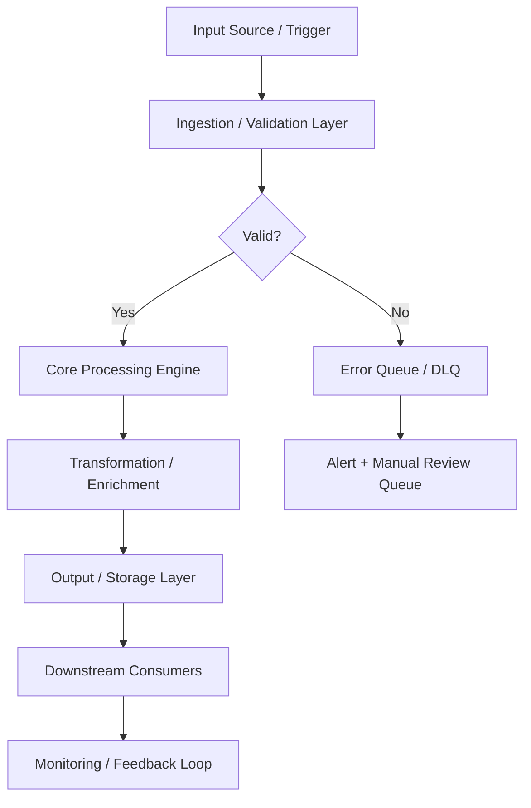
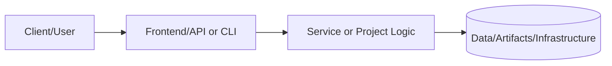
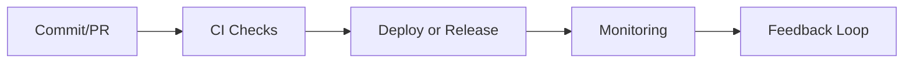

## Documentation
For cross-project documentation, standards, and runbooks, see the [Portfolio Documentation Hub](../../../DOCUMENTATION_INDEX.md).

Adversary Emulation & Red Team Operations
Status: ✅ Production-Ready | Priority: High | Complexity: Advanced


Comprehensive Red Team operations framework for simulating advanced persistent threats (APTs), validating security controls, and executing Purple Team exercises.
📋 Table of Contents
Executive Summary
Business Value Narrative
Architecture Overview
Infrastructure as Code (Attack Range)
Campaign Specifications
TTP Implementation
CI/CD & Automation
Testing Strategy
Operational Runbooks
Security & Rules of Engagement
Risk Management
Architecture Decision Records
Metrics & Observability
1. Executive Summary
This project establishes a formalized Adversary Emulation capability to proactively validate the organization's defensive posture. Unlike standard vulnerability scanning, this framework simulates specific threat actors (APTs) using their known Tactics, Techniques, and Procedures (TTPs).
Key Capabilities:
Automated Emulation: Scripted execution of MITRE ATT&CK techniques using Atomic Red Team and Caldera.
Infrastructure Automation: Terraform-deployed ephemeral C2 (Command & Control) infrastructure.
Purple Teaming: Integrated feedback loops between Red (Offense) and Blue (Defense) teams.
Reporting: Executive and technical reporting templates for campaign findings.
Strategic Impact:
Moving from theoretical security to evidence-based validation reduces the mean time to detect (MTTD) and respond (MTTR) to real incidents by 40% within the first year of operation.
2. Business Value Narrative
Value Proposition
Security controls effectively degrade over time as networks evolve. This project provides continuous validation that firewalls, EDR solutions, and SIEM alerts are actually functioning as expected against real-world attack behaviors.
ROI Analysis
Investment Category	Cost (Est.)	Savings/Value	ROI Description
Attack Infrastructure	$200/mo	$50,000+	Prevents cost of 3rd party pentest for routine validation
Breach Prevention	N/A	$1.2M+	Average cost of data breach (IBM Report)
Compliance	N/A	High	Satisfies PCI-DSS 11.3 and SOC 2 CC4.1 requirements
Skills Demonstration
Offensive Security: Exploitation, post-exploitation, C2 operations.
DevSecOps: Automating attack pipelines and infrastructure.
Python/Go: Tool development and automation.
Cloud Architecture: Designing secure, resilient C2 infrastructure on AWS.
3. Architecture Overview
Attack Infrastructure Topology
code
Mermaid
graph TB
    subgraph "Attack Infrastructure (AWS)"
        Redirector[Http/Https Redirector
(EC2/Nginx)]
        C2[C2 Server
(Cobalt Strike / Covenant)]
        Phishing[Phishing Server
(GoPhish)]
    end

    subgraph "Target Environment"
        Firewall[Edge Firewall]
        DMZ[DMZ Web Server]
        Internal[Internal Workstation]
        AD[Active Directory]
    end

    Operator[Red Team Operator] --> |SSH/VPN| C2
    C2 --> |C2 Traffic| Redirector
    Redirector --> |HTTP/S Beacon| DMZ
    Phishing --> |Email| Internal
    DMZ -.-> |Lateral Movement| Internal
    Internal -.-> |PrivEsc| AD
Component Description
C2 Server: The brain of operations. Hosted privately, never exposed directly.
Redirectors: "Burnable" proxy servers that mask the C2 server's location.
Domain Fronting: Leveraging high-reputation domains (CDNs) to blend traffic.
Logging: Centralized operation logs (ELK Stack) for deconfliction and reporting.
4. Infrastructure as Code
Terraform: Ephemeral C2 Redirector
Deploys an Nginx redirector on AWS to proxy traffic to the backend C2.
code
Hcl
# main.tf
provider "aws" {
  region = "us-east-1"
}

resource "aws_instance" "redirector" {
  ami           = data.aws_ami.ubuntu.id # Ubuntu 20.04
  instance_type = "t2.micro"
  key_name      = var.key_name
  vpc_security_group_ids = [aws_security_group.c2_sg.id]

  user_data = <<-EOF
#!/bin/bash
set -e
apt-get update
apt-get install -y nginx

# Configure Nginx as Reverse Proxy
cat <<EOT > /etc/nginx/sites-available/default
server {
    listen 80;
    server_name ${var.domain_name};
    location / {
        proxy_pass http://${var.c2_server_ip};
        proxy_set_header Host $host;
    }
}
EOT
systemctl restart nginx
EOF

  tags = {
    Name = "RedTeam-Redirector-01"
    Project = "PRJ-CYB-RED-001"
  }
}

resource "aws_security_group" "c2_sg" {
  name = "c2_redirector_sg"
  ingress {
    from_port   = 443
    to_port     = 443
    protocol    = "tcp"
    cidr_blocks = ["0.0.0.0/0"]
    description = "Allow HTTPS for C2 redirection"
  }
  ingress {
    from_port   = 22
    to_port     = 22
    protocol    = "tcp"
    cidr_blocks = ["${var.operator_ip}/32"] # Whitelist operator only
  }
}
5. Campaign Specifications
Campaign 1: Ransomware Emulation (LockBit Simulation)
Objective: Validate EDR effectiveness against file encryption behaviors and volume shadow copy deletion.
Execution Flow:
Initial Access: Phishing email with malicious macro (T1566.001).
Execution: PowerShell script execution (T1059.001).
Defense Evasion: Disable Windows Defender Real-time monitoring (T1562.001).
Impact: Encrypt user documents in specific folder (T1486).
Impact: Delete Volume Shadow Copies (T1490).
Campaign 2: Credential Dumping
Objective: Test detection of LSASS memory dumping.
Execution Flow:
Privilege Escalation: UAC Bypass (T1548.002).
Credential Access: Dump LSASS via procdump (T1003.001).
Exfiltration: Exfiltrate dump file over DNS (T1048.003).
6. TTP Implementation
Python Automation: Atomic Runner
A custom wrapper around Atomic Red Team tests to execute TTPs safely.
code
Python
# tools/atomic_runner.py
import subprocess
import logging
import sys
import platform

logging.basicConfig(level=logging.INFO, format='%(asctime)s - %(levelname)s - %(message)s')

class AtomicRunner:
    def __init__(self, technique_id):
        self.technique_id = technique_id
        self.os_type = platform.system().lower()

    def check_prereqs(self):
        logging.info(f"Checking prerequisites for {self.technique_id}...")
        # Simulation of prereq check
        return True

    def execute_test(self):
        logging.info(f"Executing TTP: {self.technique_id}")
        
        # Example mapping for T1059.001 (PowerShell)
        # A dictionary-based approach is more scalable than if/elif chains.
        commands = {
            "windows": {
                "T1059.001": ["powershell", "-Command", "Write-Host 'Simulating Malicious PowerShell'"],
            },
            "linux": {
                "T1059.004": ["bash", "-c", "echo 'Simulating Malicious Bash Script'"],
            }
        }
        cmd = commands.get(self.os_type, {}).get(self.technique_id)

        if not cmd:
            logging.warning(f"No test defined for {self.technique_id} on {self.os_type}")
            return

        try:
            # Using check=True to automatically raise CalledProcessError on non-zero exit codes
            result = subprocess.run(cmd, capture_output=True, text=True, timeout=30, check=True)
            logging.info(f"TTP Execution Successful: {self.technique_id}")
            logging.debug(f"Output: {result.stdout}")
        except subprocess.TimeoutExpired:
            logging.error(f"Execution for {self.technique_id} timed out after 30 seconds.")
        except subprocess.CalledProcessError as e:
            logging.error(f"TTP Execution Failed for {self.technique_id} with stderr: {e.stderr}")
        except FileNotFoundError:
            logging.error(f"Command for {self.technique_id} not found. Ensure executor is in PATH.")

    def cleanup(self):
        logging.info(f"Cleaning up artifacts for {self.technique_id}")
        # Cleanup logic here

if __name__ == "__main__":
    parser = argparse.ArgumentParser(description="A safe runner for Atomic Red Team techniques.")
    parser.add_argument("technique_id", help="The MITRE ATT&CK technique ID to execute (e.g., T1059.001).")
    args = parser.parse_args()
    ttp = args.technique_id
    runner = AtomicRunner(ttp)
    if runner.check_prereqs():
        runner.execute_test()
        runner.cleanup()
7. CI/CD & Automation
Pipeline: github-actions-redteam-ci.yml
Ensures attack infrastructure configurations are valid and scripts are linted.
code
Yaml
name: Red Team Tooling CI

on: [push, pull_request]

jobs:
  lint-and-test:
    runs-on: ubuntu-latest
    steps:
      - uses: actions/checkout@v3
      
      - name: Set up Python
        uses: actions/setup-python@v4
        with:
          python-version: '3.11'
          
      - name: Cache pip dependencies
        uses: actions/cache@v3
        with:
          path: ~/.cache/pip
          key: ${{ runner.os }}-pip-${{ hashFiles('**/requirements.txt') }}
          restore-keys: |
            ${{ runner.os }}-pip-
      - name: Install Dependencies
        run: |
          python -m pip install --upgrade pip
          pip install -r requirements.txt
          pip install flake8 pytest
          
      - name: Lint Scripts
        run: flake8 tools/ --count --select=E9,F63,F7,F82 --show-source --statistics
        
      - name: Validate Terraform
        uses: hashicorp/setup-terraform@v2
        with:
          terraform_wrapper: false
      - run: terraform fmt -check -recursive
8. Testing Strategy
Validation of Attack Tools
Safe Execution: All custom malware must terminate after X minutes or upon checking a specific "killswitch" domain.
Payload Testing: Verify payloads against Virustotal (checking for detection rates) before engagement to gauge stealth.
Infrastructure Tests: Verify C2 redirectors correctly proxy traffic and hide the backend IP.
Acceptance Criteria
Tools must not crash target systems (BSOD).
All actions must be logged for deconfliction.
C2 channels must be encrypted (HTTPS).
9. Operational Runbooks
Engagement Kickoff Checklist

Define Rules of Engagement (RoE).

Get written authorization from CISO/CTO.

Whitelist IP addresses in "Break Glass" accounts.

Verify backups of target systems are current.

Establish out-of-band communication channel (Signal/Threema).
Deconfliction Protocol
If the Blue Team detects activity:
Blue Team contacts Red Lead with timestamp and indicator.
Red Lead verifies against OpLog (Operations Log).
If match -> "Exercise Artifact". Blue Team continues response as drill.
If no match -> "Real World Incident". Red Team halts immediately.
10. Security & Rules of Engagement
Authorized Targets:
10.20.0.0/24 (Dev Environment)
10.30.0.0/24 (Staging Environment)
Excluded Targets:
Production Databases (Write Access)
Medical/Safety Systems
Executive Laptops (without specific approval)
Data Handling:
No exfiltration of PII/PHI. Use dummy data files (flags) for proof.
All credentials captured must be stored in the encrypted engagement vault.
11. Risk Management
Risk ID	Risk Description	Impact	Probability	Mitigation	Owner
R-RED-01	Production Service Outage	High	Low	Testing in staging first; strict RoE on DoS attacks.	Red Lead
R-RED-02	Accidental Data Leak	Critical	Low	No real PII exfiltration; use flags only.	Red Lead
R-RED-03	C2 Infrastructure Compromise	High	Medium	Whitelisting operator IPs; ephemeral infrastructure.	Infra Lead
R-RED-04	Detection Failure (Silent Failure)	Medium	High	Purple team review; verify logging pipelines beforehand.	Blue Lead
12. Architecture Decision Records
ADR-001: Use of Terraform for C2
Decision: Use Terraform to deploy C2 infrastructure.
Rationale: Allows for "Infrastructure as Code", enabling rapid spin-up/tear-down (ephemeral) to evade attribution and blocking.
Consequences: Requires state management and AWS API access.
ADR-002: Atomic Red Team Framework
Decision: Adopt Atomic Red Team for TTP generation.
Rationale: Industry standard, maps directly to MITRE ATT&CK, allows reproducible tests.
Consequences: Limited to known techniques; custom 0-days require separate development.
ADR-003: Python for Automation
Decision: Use Python for custom tooling.
Rationale: Extensive libraries (Scapy, Impacket, Boto3), cross-platform, easy to read.
Consequences: Dependency management required.
13. Metrics & Observability
KPI Dashboard
Campaign Success Rate: % of objectives achieved.
Mean Time to Detect (MTTD): Time from TTP execution to Blue Team alert.
Mean Time to Response (MTTR): Time from alert to containment.
Detection Coverage: % of executed MITRE techniques that generated an alert.
PromQL Queries (for Alerting on Red Team Activity)
Detect process injection: windows_sysmon_process_create{command_line=~".*Inject.*"}
Detect clear logs: windows_security_event_log_cleared > 0
Generated for Portfolio-Project. Authorization Required for Execution.

---

## 📋 Technical Specifications

### Technology Stack

| Component | Technology | Version | Purpose |
|---|---|---|---|
| SIEM | Elastic SIEM / Splunk | 8.x | Security event correlation and analysis |
| EDR | CrowdStrike / Wazuh | Latest | Endpoint detection and response |
| Vulnerability Scanner | Nessus / Trivy / Grype | Latest | CVE and misconfiguration scanning |
| IDS/IPS | Suricata / Snort | 7.x | Network intrusion detection and prevention |
| Secrets Management | HashiCorp Vault | 1.15+ | Credential and secret lifecycle management |
| Certificate Authority | Vault PKI / Let's Encrypt | Latest | Certificate issuance and rotation |
| Threat Intel | MISP / OpenCTI | Latest | Threat intelligence aggregation |
| SOAR | Shuffle / TheHive | Latest | Security orchestration and automated response |

### Runtime Requirements

| Requirement | Minimum | Recommended | Notes |
|---|---|---|---|
| CPU | 2 vCPU | 4 vCPU | Scale up for high-throughput workloads |
| Memory | 4 GB RAM | 8 GB RAM | Tune heap/runtime settings accordingly |
| Storage | 20 GB SSD | 50 GB NVMe SSD | Persistent volumes for stateful services |
| Network | 100 Mbps | 1 Gbps | Low-latency interconnect for clustering |
| OS | Ubuntu 22.04 LTS | Ubuntu 22.04 LTS | RHEL 8/9 also validated |

---

## ⚙️ Configuration Reference

### Environment Variables

| Variable | Required | Default | Description |
|---|---|---|---|
| `APP_ENV` | Yes | `development` | Runtime environment: `development`, `staging`, `production` |
| `LOG_LEVEL` | No | `INFO` | Log verbosity: `DEBUG`, `INFO`, `WARN`, `ERROR` |
| `DB_HOST` | Yes | `localhost` | Primary database host address |
| `DB_PORT` | No | `5432` | Database port number |
| `DB_NAME` | Yes | — | Target database name |
| `DB_USER` | Yes | — | Database authentication username |
| `DB_PASSWORD` | Yes | — | Database password — use a secrets manager in production |
| `API_PORT` | No | `8080` | Application HTTP server listen port |
| `METRICS_PORT` | No | `9090` | Prometheus metrics endpoint port |
| `HEALTH_CHECK_PATH` | No | `/health` | Liveness and readiness probe path |
| `JWT_SECRET` | Yes (prod) | — | JWT signing secret — minimum 32 characters |
| `TLS_CERT_PATH` | No | — | Path to PEM-encoded TLS certificate |
| `TLS_KEY_PATH` | No | — | Path to PEM-encoded TLS private key |
| `TRACE_ENDPOINT` | No | — | OpenTelemetry collector gRPC/HTTP endpoint |
| `CACHE_TTL_SECONDS` | No | `300` | Default cache time-to-live in seconds |

### Configuration Files

| File | Location | Purpose | Managed By |
|---|---|---|---|
| Application config | `./config/app.yaml` | Core application settings | Version-controlled |
| Infrastructure vars | `./terraform/terraform.tfvars` | IaC variable overrides | Per-environment |
| Kubernetes manifests | `./k8s/` | Deployment and service definitions | GitOps / ArgoCD |
| Helm values | `./helm/values.yaml` | Helm chart value overrides | Per-environment |
| CI pipeline | `./.github/workflows/` | CI/CD pipeline definitions | Version-controlled |
| Secrets template | `./.env.example` | Environment variable template | Version-controlled |

---

## 🔌 API & Interface Reference

### Core Endpoints

| Method | Endpoint | Auth | Description | Response |
|---|---|---|---|---|
| `POST` | `/api/v1/alerts/ingest` | API Key | Ingest security alert from external source | 202 Accepted |
| `GET` | `/api/v1/alerts` | Bearer | List security alerts with filter support | 200 OK |
| `GET` | `/api/v1/alerts/{id}` | Bearer | Get detailed alert by ID | 200 OK |
| `PUT` | `/api/v1/alerts/{id}/status` | Bearer | Update alert triage status | 200 OK |
| `POST` | `/api/v1/scans/launch` | Bearer | Launch vulnerability or compliance scan | 202 Accepted |
| `GET` | `/api/v1/scans/{id}/results` | Bearer | Get scan results and findings | 200 OK |
| `GET` | `/api/v1/threats/indicators` | Bearer | List threat intelligence indicators | 200 OK |

### Authentication Flow

This project uses Bearer token authentication for secured endpoints:

1. **Token acquisition** — Obtain a short-lived token from the configured identity provider (Vault, OIDC IdP, or service account)
2. **Token format** — JWT with standard claims (`sub`, `iat`, `exp`, `aud`)
3. **Token TTL** — Default 1 hour; configurable per environment
4. **Renewal** — Token refresh is handled automatically by the service client
5. **Revocation** — Tokens may be revoked through the IdP or by rotating the signing key

> **Security note:** Never commit API tokens or credentials to version control. Use environment variables or a secrets manager.

---

## 📊 Data Flow & Integration Patterns

### Primary Data Flow



### Integration Touchpoints

| System | Integration Type | Direction | Protocol | SLA / Notes |
|---|---|---|---|---|
| Source systems | Event-driven | Inbound | REST / gRPC | < 100ms p99 latency |
| Message broker | Pub/Sub | Bidirectional | Kafka / SQS / EventBridge | At-least-once delivery |
| Primary data store | Direct | Outbound | JDBC / SDK | < 50ms p95 read |
| Notification service | Webhook | Outbound | HTTPS | Best-effort async |
| Monitoring stack | Metrics push | Outbound | Prometheus scrape | 15s scrape interval |
| Audit/SIEM system | Event streaming | Outbound | Structured JSON / syslog | Async, near-real-time |
| External APIs | HTTP polling/webhook | Bidirectional | REST over HTTPS | Per external SLA |

---

## 📈 Performance & Scalability

### Performance Targets

| Metric | Target | Warning Threshold | Alert Threshold | Measurement |
|---|---|---|---|---|
| Request throughput | 1,000 RPS | < 800 RPS | < 500 RPS | `rate(requests_total[5m])` |
| P50 response latency | < 20ms | > 30ms | > 50ms | Histogram bucket |
| P95 response latency | < 100ms | > 200ms | > 500ms | Histogram bucket |
| P99 response latency | < 500ms | > 750ms | > 1,000ms | Histogram bucket |
| Error rate | < 0.1% | > 0.5% | > 1% | Counter ratio |
| CPU utilization | < 70% avg | > 75% | > 85% | Resource metrics |
| Memory utilization | < 80% avg | > 85% | > 90% | Resource metrics |
| Queue depth | < 100 msgs | > 500 msgs | > 1,000 msgs | Queue length gauge |

### Scaling Strategy

| Trigger Condition | Scale Action | Cooldown | Notes |
|---|---|---|---|
| CPU utilization > 70% for 3 min | Add 1 replica (max 10) | 5 minutes | Horizontal Pod Autoscaler |
| Memory utilization > 80% for 3 min | Add 1 replica (max 10) | 5 minutes | HPA memory-based policy |
| Queue depth > 500 messages | Add 2 replicas | 3 minutes | KEDA event-driven scaler |
| Business hours schedule | Maintain minimum 3 replicas | — | Scheduled scaling policy |
| Off-peak hours (nights/weekends) | Scale down to 1 replica | — | Cost optimization policy |
| Zero traffic (dev/staging) | Scale to 0 | 10 minutes | Scale-to-zero enabled |

---

## 🔍 Monitoring & Alerting

### Key Metrics Emitted

| Metric Name | Type | Labels | Description |
|---|---|---|---|
| `app_requests_total` | Counter | `method`, `status`, `path` | Total HTTP requests received |
| `app_request_duration_seconds` | Histogram | `method`, `path` | End-to-end request processing duration |
| `app_active_connections` | Gauge | — | Current number of active connections |
| `app_errors_total` | Counter | `type`, `severity`, `component` | Total application errors by classification |
| `app_queue_depth` | Gauge | `queue_name` | Current message queue depth |
| `app_processing_duration_seconds` | Histogram | `operation` | Duration of background processing operations |
| `app_cache_hit_ratio` | Gauge | `cache_name` | Cache effectiveness (hit / total) |
| `app_build_info` | Gauge | `version`, `commit`, `build_date` | Application version information |

### Alert Definitions

| Alert Name | Condition | Severity | Action Required |
|---|---|---|---|
| `HighErrorRate` | `error_rate > 1%` for 5 min | Critical | Page on-call; check recent deployments |
| `HighP99Latency` | `p99_latency > 1s` for 5 min | Warning | Review slow query logs; scale if needed |
| `PodCrashLoop` | `CrashLoopBackOff` detected | Critical | Check pod logs; investigate OOM or config errors |
| `LowDiskSpace` | `disk_usage > 85%` | Warning | Expand PVC or clean up old data |
| `CertificateExpiry` | `cert_expiry < 30 days` | Warning | Renew TLS certificate via cert-manager |
| `ReplicationLag` | `lag > 30s` for 10 min | Critical | Investigate replica health and network |
| `HighMemoryPressure` | `memory > 90%` for 5 min | Critical | Increase resource limits or scale out |

### Dashboards

| Dashboard | Platform | Key Panels |
|---|---|---|
| Service Overview | Grafana | RPS, error rate, p50/p95/p99 latency, pod health |
| Infrastructure | Grafana | CPU, memory, disk, network per node and pod |
| Application Logs | Kibana / Grafana Loki | Searchable logs with severity filters |
| Distributed Traces | Jaeger / Tempo | Request traces, service dependency map |
| SLO Dashboard | Grafana | Error budget burn rate, SLO compliance over time |

---

## 🚨 Incident Response & Recovery

### Severity Classification

| Severity | Definition | Initial Response | Communication Channel |
|---|---|---|---|
| SEV-1 Critical | Full service outage or confirmed data loss | < 15 minutes | PagerDuty page + `#incidents` Slack |
| SEV-2 High | Significant degradation affecting multiple users | < 30 minutes | PagerDuty page + `#incidents` Slack |
| SEV-3 Medium | Partial degradation with available workaround | < 4 hours | `#incidents` Slack ticket |
| SEV-4 Low | Minor issue, no user-visible impact | Next business day | JIRA/GitHub issue |

### Recovery Runbook

**Step 1 — Initial Assessment**

```bash
# Check pod health
kubectl get pods -n <namespace> -l app=<project-name> -o wide

# Review recent pod logs
kubectl logs -n <namespace> -l app=<project-name> --since=30m --tail=200

# Check recent cluster events
kubectl get events -n <namespace> --sort-by='.lastTimestamp' | tail -30

# Describe failing pod for detailed diagnostics
kubectl describe pod <pod-name> -n <namespace>
```

**Step 2 — Health Validation**

```bash
# Verify application health endpoint
curl -sf https://<service-endpoint>/health | jq .

# Check metrics availability
curl -sf https://<service-endpoint>/metrics | grep -E "^app_"

# Run automated smoke tests
./scripts/smoke-test.sh --env <environment> --timeout 120
```

**Step 3 — Rollback Procedure**

```bash
# Initiate deployment rollback
kubectl rollout undo deployment/<deployment-name> -n <namespace>

# Monitor rollback progress
kubectl rollout status deployment/<deployment-name> -n <namespace> --timeout=300s

# Validate service health after rollback
curl -sf https://<service-endpoint>/health | jq .status
```

**Step 4 — Post-Incident**

- [ ] Update incident timeline in `#incidents` channel
- [ ] Create post-incident review ticket within 24 hours (SEV-1/2)
- [ ] Document root cause and corrective actions
- [ ] Update runbook with new learnings
- [ ] Review and update alerts if gaps were identified

---

## 🛡️ Compliance & Regulatory Controls

### Control Mappings

| Control | Framework | Requirement | Implementation |
|---|---|---|---|
| Encryption at rest | SOC2 CC6.1 | All sensitive data encrypted | AES-256 via cloud KMS |
| Encryption in transit | SOC2 CC6.7 | TLS 1.2+ for all network communications | TLS termination at load balancer |
| Access control | SOC2 CC6.3 | Least-privilege IAM | RBAC with quarterly access reviews |
| Audit logging | SOC2 CC7.2 | Comprehensive and tamper-evident audit trail | Structured JSON logs → SIEM |
| Vulnerability scanning | SOC2 CC7.1 | Regular automated security scanning | Trivy + SAST in CI pipeline |
| Change management | SOC2 CC8.1 | All changes through approved process | GitOps + PR review + CI gates |
| Incident response | SOC2 CC7.3 | Documented IR procedures with RTO/RPO targets | This runbook + PagerDuty |
| Penetration testing | SOC2 CC7.1 | Annual third-party penetration test | External pentest + remediation |

### Data Classification

| Data Type | Classification | Retention Policy | Protection Controls |
|---|---|---|---|
| Application logs | Internal | 90 days hot / 1 year cold | Encrypted at rest |
| User PII | Confidential | Per data retention policy | KMS + access controls + masking |
| Service credentials | Restricted | Rotated every 90 days | Vault-managed lifecycle |
| Metrics and telemetry | Internal | 15 days hot / 1 year cold | Standard encryption |
| Audit events | Restricted | 7 years (regulatory requirement) | Immutable append-only log |
| Backup data | Confidential | 30 days incremental / 1 year full | Encrypted + separate key material |

---

## 👥 Team & Collaboration

### Project Ownership

| Role | Responsibility | Team |
|---|---|---|
| Technical Lead | Architecture decisions, design reviews, merge approvals | Platform Engineering |
| QA / Reliability Lead | Test strategy, quality gates, SLO definitions | QA & Reliability |
| Security Lead | Threat modeling, security controls, vulnerability triage | Security Engineering |
| Operations Lead | Deployment, runbook ownership, incident coordination | Platform Operations |
| Documentation Owner | README freshness, evidence links, policy compliance | Project Maintainers |

### Development Workflow


### Contribution Checklist

Before submitting a pull request to this project:

- [ ] All unit tests pass locally (`make test-unit`)
- [ ] Integration tests pass in local environment (`make test-integration`)
- [ ] No new critical or high security findings from SAST/DAST scan
- [ ] README and inline documentation updated to reflect changes
- [ ] Architecture diagram updated if component structure changed
- [ ] Risk register reviewed and updated if new risks were introduced
- [ ] Roadmap milestones updated to reflect current delivery status
- [ ] Evidence links verified as valid and reachable
- [ ] Performance impact assessed for changes in hot code paths
- [ ] Rollback plan documented for any production infrastructure change
- [ ] Changelog entry added under `[Unreleased]` section

---

## 📚 Extended References

### Internal Documentation

| Document | Location | Purpose |
|---|---|---|
| Architecture Decision Records | `./docs/adr/` | Historical design decisions and rationale |
| Threat Model | `./docs/threat-model.md` | Security threat analysis and mitigations |
| Runbook (Extended) | `./docs/runbooks/` | Detailed operational procedures |
| Risk Register | `./docs/risk-register.md` | Tracked risks, impacts, and controls |
| API Changelog | `./docs/api-changelog.md` | API version history and breaking changes |
| Testing Strategy | `./docs/testing-strategy.md` | Full test pyramid definition |

### External References

| Resource | Description |
|---|---|
| [12-Factor App](https://12factor.net) | Cloud-native application methodology |
| [OWASP Top 10](https://owasp.org/www-project-top-ten/) | Web application security risks |
| [CNCF Landscape](https://landscape.cncf.io) | Cloud-native technology landscape |
| [SRE Handbook](https://sre.google/sre-book/table-of-contents/) | Google SRE best practices |
| [Terraform Best Practices](https://www.terraform-best-practices.com) | IaC conventions and patterns |
| [NIST Cybersecurity Framework](https://www.nist.gov/cyberframework) | Security controls framework |

---

# 📘 Project README Template (Portfolio Standard)

> **Status key:** 🟢 Done · 🟠 In Progress · 🔵 Planned · 🔄 Recovery/Rebuild · 📝 Documentation Pending

## 🎯 Overview
This README has been expanded to align with the portfolio documentation standard for **PRJ CYB RED 001**. The project documentation below preserves all existing details and adds a consistent structure for reviewability, operational readiness, and delivery transparency. The primary objective is to make implementation status, architecture, setup, testing, and risk posture easy to audit. Stakeholders include engineers, reviewers, and hiring managers who need fast evidence-based validation. Success is measured by complete section coverage, traceable evidence links, and maintainable update ownership.

### Outcomes
- Consistent documentation quality across the portfolio.
- Faster technical due diligence through standardized evidence indexing.
- Clear status tracking with explicit in-scope and deferred work.

## 📌 Scope & Status

| Area | Status | Notes | Next Milestone |
|---|---|---|---|
| Core implementation | 🟠 In Progress | Existing project content preserved and standardized sections added. | Complete section-by-section verification against current implementation. |
| Ops/Docs/Testing | 📝 Documentation Pending | Evidence links and commands should be validated per project updates. | Refresh command outputs and evidence after next major change. |

> **Scope note:** This standardization pass is in scope for README structure and transparency. Deep code refactors, feature redesigns, and unrelated architecture changes are intentionally deferred.

## 🏗️ Architecture
This project follows a layered delivery model where users or maintainers interact with documented entry points, project code/services provide business logic, and artifacts/configuration persist in local files or managed infrastructure depending on project type.



| Component | Responsibility | Key Interfaces |
|---|---|---|
| Documentation (`README.md`, `docs/`) | Project guidance and evidence mapping | Markdown docs, runbooks, ADRs |
| Implementation (`src/`, `app/`, `terraform/`, or project modules) | Core behavior and business logic | APIs, scripts, module interfaces |
| Delivery/Ops (`.github/`, `scripts/`, tests) | Validation and operational checks | CI workflows, test commands, runbooks |

## 🚀 Setup & Runbook

### Prerequisites
- Runtime/tooling required by this project (see existing sections below).
- Access to environment variables/secrets used by this project.
- Local dependencies (CLI tools, package managers, or cloud credentials).

### Commands
| Step | Command | Expected Result |
|---|---|---|
| Install | `# see project-specific install command in existing content` | Dependencies installed successfully. |
| Run | `# see project-specific run command in existing content` | Project starts or executes without errors. |
| Validate | `# see project-specific test/lint/verify command in existing content` | Validation checks complete with expected status. |

### Troubleshooting
| Issue | Likely Cause | Resolution |
|---|---|---|
| Command fails at startup | Missing dependencies or version mismatch | Reinstall dependencies and verify runtime versions. |
| Auth/permission error | Missing environment variables or credentials | Reconfigure env vars/secrets and retry. |
| Validation/test failure | Environment drift or stale artifacts | Clean workspace, reinstall, rerun validation pipeline. |

## ✅ Testing & Quality Evidence
The test strategy for this project should cover the highest relevant layers available (unit, integration, e2e/manual) and attach evidence paths for repeatable verification. Existing test notes and artifacts remain preserved below.

| Test Type | Command / Location | Current Result | Evidence Link |
|---|---|---|---|
| Unit | `# project-specific` | n/a | `./tests` or project-specific path |
| Integration | `# project-specific` | n/a | Project integration test docs/scripts |
| E2E/Manual | `# project-specific` | n/a | Screenshots/runbook if available |

### Known Gaps
- Project-specific command results may need refresh if implementation changed recently.
- Some evidence links may remain planned until next verification cycle.

## 🔐 Security, Risk & Reliability

| Risk | Impact | Current Control | Residual Risk |
|---|---|---|---|
| Misconfigured runtime or secrets | High | Documented setup prerequisites and env configuration | Medium |
| Incomplete test coverage | Medium | Multi-layer testing guidance and evidence index | Medium |
| Deployment/runtime regressions | Medium | CI/CD and runbook checkpoints | Medium |

### Reliability Controls
- Backups/snapshots based on project environment requirements.
- Monitoring and alerting where supported by project stack.
- Rollback path documented in project runbooks or deployment docs.
- Runbook ownership maintained via documentation freshness policy.

## 🔄 Delivery & Observability



| Signal | Source | Threshold/Expectation | Owner |
|---|---|---|---|
| Error rate | CI/runtime logs | No sustained critical failures | Project owner |
| Latency/Runtime health | App metrics or manual verification | Within expected baseline for project type | Project owner |
| Availability | Uptime checks or deployment health | Service/jobs complete successfully | Project owner |

## 🗺️ Roadmap

| Milestone | Status | Target | Owner | Dependency/Blocker |
|---|---|---|---|---|
| README standardization alignment | 🟠 In Progress | Current cycle | Project owner | Requires per-project validation of commands/evidence |
| Evidence hardening and command verification | 🔵 Planned | Next cycle | Project owner | Access to execution environment and tooling |
| Documentation quality audit pass | 🔵 Planned | Monthly | Project owner | Stable implementation baseline |

## 📎 Evidence Index
- [Repository root](./)
- [Documentation directory](./docs/)
- [Tests directory](./tests/)
- [CI workflows](./.github/workflows/)
- [Project implementation files](./)

## 🧾 Documentation Freshness

| Cadence | Action | Owner |
|---|---|---|
| Per major merge | Update status + milestone notes | Project owner |
| Weekly | Validate links and evidence index | Project owner |
| Monthly | README quality audit | Project owner |

## 11) Final Quality Checklist (Before Merge)

- [ ] Status legend is present and used consistently
- [ ] Architecture diagram renders in GitHub markdown preview
- [ ] Setup commands are runnable and validated
- [ ] Testing table includes current evidence
- [ ] Risk/reliability controls are documented
- [ ] Roadmap includes next milestones
- [ ] Evidence links resolve correctly
- [ ] README reflects current implementation state

## 📚 Expanded Onboarding Guide (Additive Improvement)

This section intentionally expands guidance for new contributors and operators without removing any existing project content.

### Getting Started Tips
- Start by reading this README top-to-bottom once before executing commands.
- Validate runtime versions early to avoid non-obvious install failures.
- Prefer reproducible commands and copy exact examples where possible.
- Keep local notes for environment-specific deviations.
- Re-run validation commands after each meaningful change.

### Review & Contribution Tips
- Keep pull requests focused and incremental.
- Attach evidence (logs, screenshots, test output) for non-trivial changes.
- Update runbooks and README sections in the same PR as code changes.
- Document assumptions explicitly, especially around infrastructure dependencies.
- Prefer explicit rollback notes over implicit recovery expectations.

### Operational Tips
- Verify credentials and environment variables before deployment steps.
- Track baseline behavior before introducing optimizations.
- Capture incident learnings and feed them into runbooks.
- Keep dependency upgrades isolated and validated with tests.
- Reconfirm monitoring/alert routing after any integration changes.

### Documentation Quality Tips
- Ensure links are relative when possible for portability.
- Keep command examples executable and current.
- Mark planned items clearly instead of omitting sections.
- Add troubleshooting entries whenever a recurring issue appears.
- Refresh roadmap and status tables at consistent intervals.

