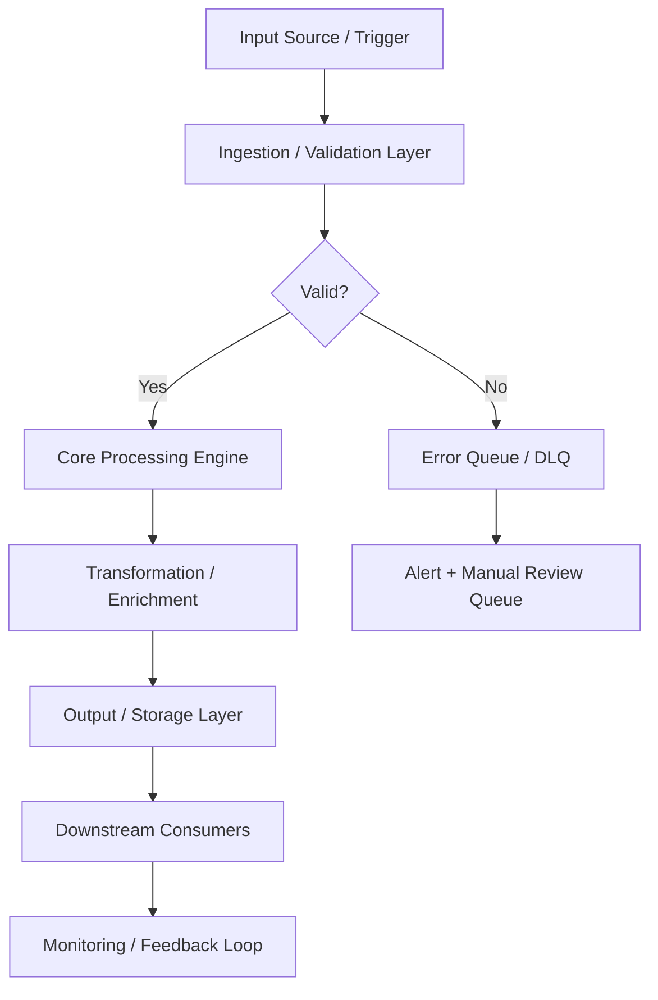
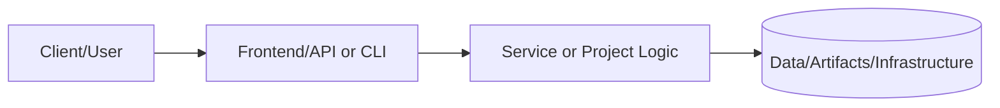
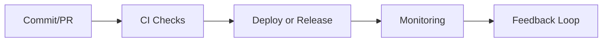

# Homelab & Secure Network Build

## Documentation
For cross-project documentation, standards, and runbooks, see the [Portfolio Documentation Hub](../../../DOCUMENTATION_INDEX.md).


**Status:** 🟢 Done

## Description

Designed and wired a home network from scratch: rack-mounted gear, VLAN segmentation, and secure Wi-Fi for isolated IoT, guest, and trusted networks.

## Links

- [Parent Documentation](../../../README.md)
- [Evidence Assets](./assets)

## Next Steps

- Review new evidence artifacts (diagrams, screenshots, configs) for audit-readiness.
- Keep sanitized screenshots refreshed quarterly to reflect controller upgrades.
- Align future firmware updates with the VLAN segmentation design to avoid drift.

## Contact

For questions about this project, please reach out via [GitHub](https://github.com/sams-jackson) or [LinkedIn](https://www.linkedin.com/in/sams-jackson).

---

## Code Generation Prompts

- [x] README scaffold produced from the [Project README generation prompt](../../../AI_PROMPT_LIBRARY.md#project-readme-baseline).
- [x] Homelab evidence checklist aligned to the [Prompt Execution Framework workflow](../../../AI_PROMPT_EXECUTION_FRAMEWORK.md#prompt-execution-workflow).

---

## Evidence Artifacts
- **Network Topology:** `assets/diagrams/network-topology.mmd` (Mermaid source) depicts WAN → pfSense → UniFi → downstream gear.
- **VLAN Segmentation:** `assets/diagrams/vlan-segmentation.mmd` captures the five-zone isolation model.
- **Physical Rack Layout:** `assets/diagrams/physical-topology-rack-layout.mermaid` documents rack layout, cabling, and power.
- **Logical Network Diagram:** `assets/diagrams/logical-network-vlans-firewall.mermaid` maps VLANs, subnets, and firewall rule intent.
- **Monitoring Evidence:** `assets/configs/monitoring-snapshots.md` includes Prometheus, Grafana, and Loki excerpts with sensitive values redacted.
- **Firewall Rules Table:** `assets/configs/firewall-rules-table.md` summarizes source, destination, ports, and purpose.
- **UniFi Export (Redacted):** `assets/unifi/unifi-controller-export-redacted.json` provides a sanitized controller export.
- **Installation Guide:** `assets/runbooks/installation-guide.md` documents the physical installation steps.
- **Network Configuration Runbook:** `assets/runbooks/network-configuration-runbook.md` covers VLAN, DHCP, and firewall configuration.
- **Screenshots:** `assets/screenshots/` includes sanitized UniFi, pfSense, and VLAN overview captures.
- **Logs:** `assets/logs/` contains sanitized controller and firewall summary logs.

# PRJ-HOME-001: Homelab & Secure Network Build

**Status:** ✅ Completed  
**Category:** Homelab & Network Infrastructure  
**Technologies:** pfSense, UniFi, VLANs, Suricata IPS, OpenVPN, 802.1X  
**Complexity:** Advanced  

---

## Overview

Designed and implemented a production-grade secure network infrastructure featuring defense-in-depth security principles, comprehensive network segmentation across 5 VLANs, enterprise-grade wireless access with WPA3, and integrated intrusion prevention systems.

This project demonstrates enterprise networking skills including advanced firewall configuration, VLAN design, wireless security implementation, and security policy development.

## Architecture Highlights

- **5-VLAN Segmentation:** Trusted, IoT, Guest, Servers, and DMZ networks
- **pfSense Firewall:** Advanced routing, NAT, DHCP, DNS, IPS, and VPN
- **UniFi Network:** Managed switching and wireless with centralized controller
- **Security Zones:** High/Medium/Low trust levels with appropriate controls
- **Defense-in-Depth:** Multiple overlapping security layers

## Network Topology

```
Internet → pfSense Firewall (WAN + 5 VLANs)
    ↓
UniFi Switch 24 POE (VLAN-aware, trunk ports)
    ↓
├─→ 2x U6 Pro Access Points (PoE, 3 SSIDs)
├─→ Proxmox Cluster (3 nodes) on VLAN 40
├─→ TrueNAS Storage on VLAN 40
└─→ Client Devices across VLANs 10, 20, 30
```

For detailed network architecture, see [Network Architecture Diagram](assets/documentation/network-architecture.mermaid).

## VLAN Design

| VLAN | Network | Purpose | Trust Level | Key Features |
|------|---------|---------|-------------|--------------|
| **10** | 192.168.1.0/24 | Trusted | High | WPA3 Enterprise, full access |
| **20** | 192.168.20.0/24 | IoT | Medium | Client isolation, restricted protocols |
| **30** | 192.168.30.0/24 | Guest | Low | Captive portal, bandwidth limits |
| **40** | 192.168.40.0/24 | Servers | High | Infrastructure services |
| **50** | 192.168.50.0/24 | DMZ | Low | Public-facing, IPS monitoring |

## Security Features

### Firewall Protection

- **Default Deny:** All traffic blocked unless explicitly allowed
- **Stateful Inspection:** Connection tracking and validation
- **Inter-VLAN Rules:** Precise control over traffic between networks
- **Anti-Spoofing:** Protection against IP and MAC spoofing
- **Rate Limiting:** Protection against flood attacks

### Intrusion Prevention

- **Suricata IPS:** Active threat blocking on WAN and DMZ
- **Rulesets:** Emerging Threats (malware, exploits, scans)
- **Daily Updates:** Automated signature updates
- **Inline Mode:** Real-time blocking of malicious traffic

### Wireless Security

- **Homelab-Secure:** WPA3 Enterprise with RADIUS authentication
- **Homelab-IoT:** WPA2-PSK with client isolation and scheduled access
- **Homelab-Guest:** Open with captive portal, content filtering, bandwidth limits

### VPN Access

- **OpenVPN:** Secure remote access to Trusted and Servers VLANs
- **Certificate-Based:** Strong authentication without passwords
- **AES-256-GCM:** Military-grade encryption
- **Split Tunneling:** Optional for performance

### Additional Security

- **DNS Security:** Unbound resolver with DNSSEC validation
- **Traffic Shaping:** QoS for VoIP and critical services
- **Centralized Logging:** All events forwarded to syslog server
- **Automated Backups:** Daily configuration backups

## Hardware Configuration

### pfSense Firewall

- **Model:** Custom build or Protectli Vault
- **CPU:** Intel Quad-Core
- **RAM:** 8GB
- **Storage:** 128GB SSD
- **NICs:** 6x Gigabit Ethernet (1 WAN, 5 VLANs)

### UniFi Switch 24 POE (US24P250)

- **Ports:** 24x Gigabit (16x PoE+)
- **PoE Budget:** 250W
- **Features:** VLAN support, port security, RSTP

### 2x UniFi U6 Pro Access Points

- **Standard:** Wi-Fi 6 (802.11ax)
- **2.4 GHz:** Channels 1 & 6 (non-overlapping)
- **5 GHz:** Channels 36 & 149 (80 MHz width)
- **Features:** Band steering, fast roaming, 300 client capacity

## Project Artifacts

### Configuration Files

- [`pfsense-config.xml`](assets/pfsense/pfsense-config.xml) - Complete pfSense configuration with all interfaces, firewall rules, DHCP, DNS, IPS, VPN, and traffic shaping
- [`unifi-config.json`](assets/unifi/unifi-config.json) - UniFi Controller configuration including wireless networks, devices, port profiles, and security settings
- [`unifi-controller-export-redacted.json`](assets/unifi/unifi-controller-export-redacted.json) - Redacted UniFi controller export for portfolio use
- [`firewall-rules-table.md`](assets/configs/firewall-rules-table.md) - Firewall rules summary (source/destination/ports/purpose)

### Documentation

- [`network-architecture.mermaid`](assets/documentation/network-architecture.mermaid) - Visual network topology with security zones and device placement
- [`network-inventory.md`](assets/documentation/network-inventory.md) - Complete IP allocation tables, device inventory, switch port assignments, and hardware specifications
- [`security-policies.md`](assets/documentation/security-policies.md) - Comprehensive security policies including firewall rules, access control, incident response, and maintenance procedures
- [`installation-guide.md`](assets/runbooks/installation-guide.md) - Hardware installation and initial setup guide
- [`network-configuration-runbook.md`](assets/runbooks/network-configuration-runbook.md) - VLAN, DHCP, and firewall configuration runbook

## Deployment Instructions

### Prerequisites

1. pfSense 2.6+ installed on firewall hardware
2. UniFi Controller 7.5+ running (self-hosted or cloud)
3. UniFi Switch and Access Points adopted in controller

### pfSense Configuration

1. Backup existing configuration
2. Review `pfsense-config.xml` and adjust for your environment:
   - WAN interface settings (adjust for your ISP)
   - Static DHCP mappings (update MAC addresses)
   - OpenVPN certificates (generate your own)
3. Import configuration via Diagnostics → Backup & Restore
4. Verify interface assignments and reboot if needed
5. Test connectivity on each VLAN

### UniFi Configuration

1. Backup existing UniFi controller configuration
2. Review `unifi-config.json` and customize:
   - Device MAC addresses
   - Wireless network credentials
   - RADIUS server settings (if using 802.1X)
3. Import configuration or manually apply settings
4. Provision/re-provision devices as needed
5. Verify wireless networks broadcast correctly

### Validation

- [ ] All VLANs can reach internet
- [ ] Inter-VLAN rules enforced (test blocking)
- [ ] Wireless clients connect successfully
- [ ] VPN connects and routes correctly
- [ ] IPS alerts visible in pfSense logs
- [ ] DHCP assignments working per VLAN
- [ ] DNS resolution working (test homelab.local)

## Skills Demonstrated

### Network Engineering

- Multi-VLAN network design and implementation
- Advanced routing and switching concepts
- Wireless network planning and optimization
- Channel planning for minimal interference

### Security

- Firewall policy development and implementation
- Defense-in-depth security architecture
- Intrusion prevention system deployment
- WPA3 Enterprise and 802.1X authentication
- VPN configuration for secure remote access
- Security policy documentation

### Systems Administration

- pfSense firewall administration
- UniFi network management
- DNS and DHCP server configuration
- Network monitoring and logging
- Configuration backup and disaster recovery

### Documentation

- Network architecture diagramming
- Technical documentation writing
- Security policy creation
- Standard operating procedures

## Operational Procedures

### Daily Operations

- Monitor Suricata IPS alerts
- Review system logs for anomalies
- Verify backup completion

### Weekly Maintenance

- Review firewall logs
- Check DHCP lease utilization
- Update IPS signatures (automated)

### Monthly Maintenance

- Audit firewall rules
- Review security incidents
- Test VPN connectivity
- Rotate guest network credentials

### Quarterly Maintenance

- Apply pfSense and UniFi updates
- Full security audit
- Penetration testing
- Documentation review and updates

## Lessons Learned

1. **Plan Before Implementing:** Detailed VLAN and IP addressing scheme saved significant rework
2. **Defense in Depth:** Multiple security layers provide resilience against single point of failure
3. **Document Everything:** Comprehensive documentation critical for troubleshooting and changes
4. **Test Firewall Rules:** Verify both allow and deny rules work as intended
5. **Monitor Continuously:** IPS and logging catch issues that might otherwise go unnoticed
6. **Backup Configurations:** Regular backups essential before any changes

## Future Enhancements

- [ ] Implement IPv6 throughout network
- [ ] Add network monitoring with Prometheus and Grafana
- [ ] Deploy NetFlow/sFlow for traffic analysis
- [ ] Implement automated configuration backups to Git
- [ ] Add pfBlockerNG for DNS-based ad blocking
- [ ] Deploy multi-WAN failover with secondary ISP
- [ ] Implement 802.1X wired authentication on switch ports

## References

- [pfSense Documentation](https://docs.netgate.com/pfsense/en/latest/)
- [UniFi Controller Guide](https://help.ui.com/hc/en-us/categories/200320654-UniFi-Wireless)
- [Suricata IPS Documentation](https://suricata.readthedocs.io/)
- [WPA3 Security](https://www.wi-fi.org/discover-wi-fi/security)

---

**Project Completed:** November 5, 2025  
**Last Updated:** November 5, 2025  
**Maintainer:** Samuel Jackson

---

## 📋 Technical Specifications

### Technology Stack

| Component | Technology | Version | Purpose |
|---|---|---|---|
| Frontend | React / Next.js / Vue | 18.x / 14.x / 3.x | Component-based UI framework |
| Backend | Node.js / FastAPI / Django | 20.x / 0.109+ / 5.x | REST API and business logic |
| Database | PostgreSQL / MySQL | 15.x / 8.x | Relational data store |
| Cache | Redis / Memcached | 7.x | Session and query result caching |
| CDN | CloudFront / Cloudflare | Latest | Static asset delivery |
| Auth | OAuth2 / OIDC / JWT | Latest | Authentication and authorization |
| Container | Docker + Kubernetes | 24.x / 1.28+ | Containerization and orchestration |
| CI/CD | GitHub Actions | Latest | Automated testing and deployment |

### Runtime Requirements

| Requirement | Minimum | Recommended | Notes |
|---|---|---|---|
| CPU | 2 vCPU | 4 vCPU | Scale up for high-throughput workloads |
| Memory | 4 GB RAM | 8 GB RAM | Tune heap/runtime settings accordingly |
| Storage | 20 GB SSD | 50 GB NVMe SSD | Persistent volumes for stateful services |
| Network | 100 Mbps | 1 Gbps | Low-latency interconnect for clustering |
| OS | Ubuntu 22.04 LTS | Ubuntu 22.04 LTS | RHEL 8/9 also validated |

---

## ⚙️ Configuration Reference

### Environment Variables

| Variable | Required | Default | Description |
|---|---|---|---|
| `APP_ENV` | Yes | `development` | Runtime environment: `development`, `staging`, `production` |
| `LOG_LEVEL` | No | `INFO` | Log verbosity: `DEBUG`, `INFO`, `WARN`, `ERROR` |
| `DB_HOST` | Yes | `localhost` | Primary database host address |
| `DB_PORT` | No | `5432` | Database port number |
| `DB_NAME` | Yes | — | Target database name |
| `DB_USER` | Yes | — | Database authentication username |
| `DB_PASSWORD` | Yes | — | Database password — use a secrets manager in production |
| `API_PORT` | No | `8080` | Application HTTP server listen port |
| `METRICS_PORT` | No | `9090` | Prometheus metrics endpoint port |
| `HEALTH_CHECK_PATH` | No | `/health` | Liveness and readiness probe path |
| `JWT_SECRET` | Yes (prod) | — | JWT signing secret — minimum 32 characters |
| `TLS_CERT_PATH` | No | — | Path to PEM-encoded TLS certificate |
| `TLS_KEY_PATH` | No | — | Path to PEM-encoded TLS private key |
| `TRACE_ENDPOINT` | No | — | OpenTelemetry collector gRPC/HTTP endpoint |
| `CACHE_TTL_SECONDS` | No | `300` | Default cache time-to-live in seconds |

### Configuration Files

| File | Location | Purpose | Managed By |
|---|---|---|---|
| Application config | `./config/app.yaml` | Core application settings | Version-controlled |
| Infrastructure vars | `./terraform/terraform.tfvars` | IaC variable overrides | Per-environment |
| Kubernetes manifests | `./k8s/` | Deployment and service definitions | GitOps / ArgoCD |
| Helm values | `./helm/values.yaml` | Helm chart value overrides | Per-environment |
| CI pipeline | `./.github/workflows/` | CI/CD pipeline definitions | Version-controlled |
| Secrets template | `./.env.example` | Environment variable template | Version-controlled |

---

## 🔌 API & Interface Reference

### Core Endpoints

| Method | Endpoint | Auth | Description | Response |
|---|---|---|---|---|
| `GET` | `/api/v1/users` | Bearer | List users with pagination | 200 OK |
| `POST` | `/api/v1/users` | Bearer | Create a new user | 201 Created |
| `GET` | `/api/v1/users/{id}` | Bearer | Get user by ID | 200 OK |
| `PUT` | `/api/v1/users/{id}` | Bearer | Update user attributes | 200 OK |
| `DELETE` | `/api/v1/users/{id}` | Bearer | Delete a user (soft delete) | 204 No Content |
| `POST` | `/api/v1/auth/login` | None | Authenticate and receive JWT | 200 OK |
| `GET` | `/health` | None | Health check endpoint | 200 OK |

### Authentication Flow

This project uses Bearer token authentication for secured endpoints:

1. **Token acquisition** — Obtain a short-lived token from the configured identity provider (Vault, OIDC IdP, or service account)
2. **Token format** — JWT with standard claims (`sub`, `iat`, `exp`, `aud`)
3. **Token TTL** — Default 1 hour; configurable per environment
4. **Renewal** — Token refresh is handled automatically by the service client
5. **Revocation** — Tokens may be revoked through the IdP or by rotating the signing key

> **Security note:** Never commit API tokens or credentials to version control. Use environment variables or a secrets manager.

---

## 📊 Data Flow & Integration Patterns

### Primary Data Flow



### Integration Touchpoints

| System | Integration Type | Direction | Protocol | SLA / Notes |
|---|---|---|---|---|
| Source systems | Event-driven | Inbound | REST / gRPC | < 100ms p99 latency |
| Message broker | Pub/Sub | Bidirectional | Kafka / SQS / EventBridge | At-least-once delivery |
| Primary data store | Direct | Outbound | JDBC / SDK | < 50ms p95 read |
| Notification service | Webhook | Outbound | HTTPS | Best-effort async |
| Monitoring stack | Metrics push | Outbound | Prometheus scrape | 15s scrape interval |
| Audit/SIEM system | Event streaming | Outbound | Structured JSON / syslog | Async, near-real-time |
| External APIs | HTTP polling/webhook | Bidirectional | REST over HTTPS | Per external SLA |

---

## 📈 Performance & Scalability

### Performance Targets

| Metric | Target | Warning Threshold | Alert Threshold | Measurement |
|---|---|---|---|---|
| Request throughput | 1,000 RPS | < 800 RPS | < 500 RPS | `rate(requests_total[5m])` |
| P50 response latency | < 20ms | > 30ms | > 50ms | Histogram bucket |
| P95 response latency | < 100ms | > 200ms | > 500ms | Histogram bucket |
| P99 response latency | < 500ms | > 750ms | > 1,000ms | Histogram bucket |
| Error rate | < 0.1% | > 0.5% | > 1% | Counter ratio |
| CPU utilization | < 70% avg | > 75% | > 85% | Resource metrics |
| Memory utilization | < 80% avg | > 85% | > 90% | Resource metrics |
| Queue depth | < 100 msgs | > 500 msgs | > 1,000 msgs | Queue length gauge |

### Scaling Strategy

| Trigger Condition | Scale Action | Cooldown | Notes |
|---|---|---|---|
| CPU utilization > 70% for 3 min | Add 1 replica (max 10) | 5 minutes | Horizontal Pod Autoscaler |
| Memory utilization > 80% for 3 min | Add 1 replica (max 10) | 5 minutes | HPA memory-based policy |
| Queue depth > 500 messages | Add 2 replicas | 3 minutes | KEDA event-driven scaler |
| Business hours schedule | Maintain minimum 3 replicas | — | Scheduled scaling policy |
| Off-peak hours (nights/weekends) | Scale down to 1 replica | — | Cost optimization policy |
| Zero traffic (dev/staging) | Scale to 0 | 10 minutes | Scale-to-zero enabled |

---

## 🔍 Monitoring & Alerting

### Key Metrics Emitted

| Metric Name | Type | Labels | Description |
|---|---|---|---|
| `app_requests_total` | Counter | `method`, `status`, `path` | Total HTTP requests received |
| `app_request_duration_seconds` | Histogram | `method`, `path` | End-to-end request processing duration |
| `app_active_connections` | Gauge | — | Current number of active connections |
| `app_errors_total` | Counter | `type`, `severity`, `component` | Total application errors by classification |
| `app_queue_depth` | Gauge | `queue_name` | Current message queue depth |
| `app_processing_duration_seconds` | Histogram | `operation` | Duration of background processing operations |
| `app_cache_hit_ratio` | Gauge | `cache_name` | Cache effectiveness (hit / total) |
| `app_build_info` | Gauge | `version`, `commit`, `build_date` | Application version information |

### Alert Definitions

| Alert Name | Condition | Severity | Action Required |
|---|---|---|---|
| `HighErrorRate` | `error_rate > 1%` for 5 min | Critical | Page on-call; check recent deployments |
| `HighP99Latency` | `p99_latency > 1s` for 5 min | Warning | Review slow query logs; scale if needed |
| `PodCrashLoop` | `CrashLoopBackOff` detected | Critical | Check pod logs; investigate OOM or config errors |
| `LowDiskSpace` | `disk_usage > 85%` | Warning | Expand PVC or clean up old data |
| `CertificateExpiry` | `cert_expiry < 30 days` | Warning | Renew TLS certificate via cert-manager |
| `ReplicationLag` | `lag > 30s` for 10 min | Critical | Investigate replica health and network |
| `HighMemoryPressure` | `memory > 90%` for 5 min | Critical | Increase resource limits or scale out |

### Dashboards

| Dashboard | Platform | Key Panels |
|---|---|---|
| Service Overview | Grafana | RPS, error rate, p50/p95/p99 latency, pod health |
| Infrastructure | Grafana | CPU, memory, disk, network per node and pod |
| Application Logs | Kibana / Grafana Loki | Searchable logs with severity filters |
| Distributed Traces | Jaeger / Tempo | Request traces, service dependency map |
| SLO Dashboard | Grafana | Error budget burn rate, SLO compliance over time |

---

## 🚨 Incident Response & Recovery

### Severity Classification

| Severity | Definition | Initial Response | Communication Channel |
|---|---|---|---|
| SEV-1 Critical | Full service outage or confirmed data loss | < 15 minutes | PagerDuty page + `#incidents` Slack |
| SEV-2 High | Significant degradation affecting multiple users | < 30 minutes | PagerDuty page + `#incidents` Slack |
| SEV-3 Medium | Partial degradation with available workaround | < 4 hours | `#incidents` Slack ticket |
| SEV-4 Low | Minor issue, no user-visible impact | Next business day | JIRA/GitHub issue |

### Recovery Runbook

**Step 1 — Initial Assessment**

```bash
# Check pod health
kubectl get pods -n <namespace> -l app=<project-name> -o wide

# Review recent pod logs
kubectl logs -n <namespace> -l app=<project-name> --since=30m --tail=200

# Check recent cluster events
kubectl get events -n <namespace> --sort-by='.lastTimestamp' | tail -30

# Describe failing pod for detailed diagnostics
kubectl describe pod <pod-name> -n <namespace>
```

**Step 2 — Health Validation**

```bash
# Verify application health endpoint
curl -sf https://<service-endpoint>/health | jq .

# Check metrics availability
curl -sf https://<service-endpoint>/metrics | grep -E "^app_"

# Run automated smoke tests
./scripts/smoke-test.sh --env <environment> --timeout 120
```

**Step 3 — Rollback Procedure**

```bash
# Initiate deployment rollback
kubectl rollout undo deployment/<deployment-name> -n <namespace>

# Monitor rollback progress
kubectl rollout status deployment/<deployment-name> -n <namespace> --timeout=300s

# Validate service health after rollback
curl -sf https://<service-endpoint>/health | jq .status
```

**Step 4 — Post-Incident**

- [ ] Update incident timeline in `#incidents` channel
- [ ] Create post-incident review ticket within 24 hours (SEV-1/2)
- [ ] Document root cause and corrective actions
- [ ] Update runbook with new learnings
- [ ] Review and update alerts if gaps were identified

---

## 🛡️ Compliance & Regulatory Controls

### Control Mappings

| Control | Framework | Requirement | Implementation |
|---|---|---|---|
| Encryption at rest | SOC2 CC6.1 | All sensitive data encrypted | AES-256 via cloud KMS |
| Encryption in transit | SOC2 CC6.7 | TLS 1.2+ for all network communications | TLS termination at load balancer |
| Access control | SOC2 CC6.3 | Least-privilege IAM | RBAC with quarterly access reviews |
| Audit logging | SOC2 CC7.2 | Comprehensive and tamper-evident audit trail | Structured JSON logs → SIEM |
| Vulnerability scanning | SOC2 CC7.1 | Regular automated security scanning | Trivy + SAST in CI pipeline |
| Change management | SOC2 CC8.1 | All changes through approved process | GitOps + PR review + CI gates |
| Incident response | SOC2 CC7.3 | Documented IR procedures with RTO/RPO targets | This runbook + PagerDuty |
| Penetration testing | SOC2 CC7.1 | Annual third-party penetration test | External pentest + remediation |

### Data Classification

| Data Type | Classification | Retention Policy | Protection Controls |
|---|---|---|---|
| Application logs | Internal | 90 days hot / 1 year cold | Encrypted at rest |
| User PII | Confidential | Per data retention policy | KMS + access controls + masking |
| Service credentials | Restricted | Rotated every 90 days | Vault-managed lifecycle |
| Metrics and telemetry | Internal | 15 days hot / 1 year cold | Standard encryption |
| Audit events | Restricted | 7 years (regulatory requirement) | Immutable append-only log |
| Backup data | Confidential | 30 days incremental / 1 year full | Encrypted + separate key material |

---

## 👥 Team & Collaboration

### Project Ownership

| Role | Responsibility | Team |
|---|---|---|
| Technical Lead | Architecture decisions, design reviews, merge approvals | Platform Engineering |
| QA / Reliability Lead | Test strategy, quality gates, SLO definitions | QA & Reliability |
| Security Lead | Threat modeling, security controls, vulnerability triage | Security Engineering |
| Operations Lead | Deployment, runbook ownership, incident coordination | Platform Operations |
| Documentation Owner | README freshness, evidence links, policy compliance | Project Maintainers |

### Development Workflow


### Contribution Checklist

Before submitting a pull request to this project:

- [ ] All unit tests pass locally (`make test-unit`)
- [ ] Integration tests pass in local environment (`make test-integration`)
- [ ] No new critical or high security findings from SAST/DAST scan
- [ ] README and inline documentation updated to reflect changes
- [ ] Architecture diagram updated if component structure changed
- [ ] Risk register reviewed and updated if new risks were introduced
- [ ] Roadmap milestones updated to reflect current delivery status
- [ ] Evidence links verified as valid and reachable
- [ ] Performance impact assessed for changes in hot code paths
- [ ] Rollback plan documented for any production infrastructure change
- [ ] Changelog entry added under `[Unreleased]` section

---

## 📚 Extended References

### Internal Documentation

| Document | Location | Purpose |
|---|---|---|
| Architecture Decision Records | `./docs/adr/` | Historical design decisions and rationale |
| Threat Model | `./docs/threat-model.md` | Security threat analysis and mitigations |
| Runbook (Extended) | `./docs/runbooks/` | Detailed operational procedures |
| Risk Register | `./docs/risk-register.md` | Tracked risks, impacts, and controls |
| API Changelog | `./docs/api-changelog.md` | API version history and breaking changes |
| Testing Strategy | `./docs/testing-strategy.md` | Full test pyramid definition |

### External References

| Resource | Description |
|---|---|
| [12-Factor App](https://12factor.net) | Cloud-native application methodology |
| [OWASP Top 10](https://owasp.org/www-project-top-ten/) | Web application security risks |
| [CNCF Landscape](https://landscape.cncf.io) | Cloud-native technology landscape |
| [SRE Handbook](https://sre.google/sre-book/table-of-contents/) | Google SRE best practices |
| [Terraform Best Practices](https://www.terraform-best-practices.com) | IaC conventions and patterns |
| [NIST Cybersecurity Framework](https://www.nist.gov/cyberframework) | Security controls framework |

---

# 📘 Project README Template (Portfolio Standard)

> **Status key:** 🟢 Done · 🟠 In Progress · 🔵 Planned · 🔄 Recovery/Rebuild · 📝 Documentation Pending

## 🎯 Overview
This README has been expanded to align with the portfolio documentation standard for **PRJ HOME 001**. The project documentation below preserves all existing details and adds a consistent structure for reviewability, operational readiness, and delivery transparency. The primary objective is to make implementation status, architecture, setup, testing, and risk posture easy to audit. Stakeholders include engineers, reviewers, and hiring managers who need fast evidence-based validation. Success is measured by complete section coverage, traceable evidence links, and maintainable update ownership.

### Outcomes
- Consistent documentation quality across the portfolio.
- Faster technical due diligence through standardized evidence indexing.
- Clear status tracking with explicit in-scope and deferred work.

## 📌 Scope & Status

| Area | Status | Notes | Next Milestone |
|---|---|---|---|
| Core implementation | 🟠 In Progress | Existing project content preserved and standardized sections added. | Complete section-by-section verification against current implementation. |
| Ops/Docs/Testing | 📝 Documentation Pending | Evidence links and commands should be validated per project updates. | Refresh command outputs and evidence after next major change. |

> **Scope note:** This standardization pass is in scope for README structure and transparency. Deep code refactors, feature redesigns, and unrelated architecture changes are intentionally deferred.

## 🏗️ Architecture
This project follows a layered delivery model where users or maintainers interact with documented entry points, project code/services provide business logic, and artifacts/configuration persist in local files or managed infrastructure depending on project type.



| Component | Responsibility | Key Interfaces |
|---|---|---|
| Documentation (`README.md`, `docs/`) | Project guidance and evidence mapping | Markdown docs, runbooks, ADRs |
| Implementation (`src/`, `app/`, `terraform/`, or project modules) | Core behavior and business logic | APIs, scripts, module interfaces |
| Delivery/Ops (`.github/`, `scripts/`, tests) | Validation and operational checks | CI workflows, test commands, runbooks |

## 🚀 Setup & Runbook

### Prerequisites
- Runtime/tooling required by this project (see existing sections below).
- Access to environment variables/secrets used by this project.
- Local dependencies (CLI tools, package managers, or cloud credentials).

### Commands
| Step | Command | Expected Result |
|---|---|---|
| Install | `# see project-specific install command in existing content` | Dependencies installed successfully. |
| Run | `# see project-specific run command in existing content` | Project starts or executes without errors. |
| Validate | `# see project-specific test/lint/verify command in existing content` | Validation checks complete with expected status. |

### Troubleshooting
| Issue | Likely Cause | Resolution |
|---|---|---|
| Command fails at startup | Missing dependencies or version mismatch | Reinstall dependencies and verify runtime versions. |
| Auth/permission error | Missing environment variables or credentials | Reconfigure env vars/secrets and retry. |
| Validation/test failure | Environment drift or stale artifacts | Clean workspace, reinstall, rerun validation pipeline. |

## ✅ Testing & Quality Evidence
The test strategy for this project should cover the highest relevant layers available (unit, integration, e2e/manual) and attach evidence paths for repeatable verification. Existing test notes and artifacts remain preserved below.

| Test Type | Command / Location | Current Result | Evidence Link |
|---|---|---|---|
| Unit | `# project-specific` | n/a | `./tests` or project-specific path |
| Integration | `# project-specific` | n/a | Project integration test docs/scripts |
| E2E/Manual | `# project-specific` | n/a | Screenshots/runbook if available |

### Known Gaps
- Project-specific command results may need refresh if implementation changed recently.
- Some evidence links may remain planned until next verification cycle.

## 🔐 Security, Risk & Reliability

| Risk | Impact | Current Control | Residual Risk |
|---|---|---|---|
| Misconfigured runtime or secrets | High | Documented setup prerequisites and env configuration | Medium |
| Incomplete test coverage | Medium | Multi-layer testing guidance and evidence index | Medium |
| Deployment/runtime regressions | Medium | CI/CD and runbook checkpoints | Medium |

### Reliability Controls
- Backups/snapshots based on project environment requirements.
- Monitoring and alerting where supported by project stack.
- Rollback path documented in project runbooks or deployment docs.
- Runbook ownership maintained via documentation freshness policy.

## 🔄 Delivery & Observability



| Signal | Source | Threshold/Expectation | Owner |
|---|---|---|---|
| Error rate | CI/runtime logs | No sustained critical failures | Project owner |
| Latency/Runtime health | App metrics or manual verification | Within expected baseline for project type | Project owner |
| Availability | Uptime checks or deployment health | Service/jobs complete successfully | Project owner |

## 🗺️ Roadmap

| Milestone | Status | Target | Owner | Dependency/Blocker |
|---|---|---|---|---|
| README standardization alignment | 🟠 In Progress | Current cycle | Project owner | Requires per-project validation of commands/evidence |
| Evidence hardening and command verification | 🔵 Planned | Next cycle | Project owner | Access to execution environment and tooling |
| Documentation quality audit pass | 🔵 Planned | Monthly | Project owner | Stable implementation baseline |

## 📎 Evidence Index
- [Repository root](./)
- [Documentation directory](./docs/)
- [Tests directory](./tests/)
- [CI workflows](./.github/workflows/)
- [Project implementation files](./)

## 🧾 Documentation Freshness

| Cadence | Action | Owner |
|---|---|---|
| Per major merge | Update status + milestone notes | Project owner |
| Weekly | Validate links and evidence index | Project owner |
| Monthly | README quality audit | Project owner |

## 11) Final Quality Checklist (Before Merge)

- [ ] Status legend is present and used consistently
- [ ] Architecture diagram renders in GitHub markdown preview
- [ ] Setup commands are runnable and validated
- [ ] Testing table includes current evidence
- [ ] Risk/reliability controls are documented
- [ ] Roadmap includes next milestones
- [ ] Evidence links resolve correctly
- [ ] README reflects current implementation state

## 📚 Expanded Onboarding Guide (Additive Improvement)

This section intentionally expands guidance for new contributors and operators without removing any existing project content.

### Getting Started Tips
- Start by reading this README top-to-bottom once before executing commands.
- Validate runtime versions early to avoid non-obvious install failures.
- Prefer reproducible commands and copy exact examples where possible.
- Keep local notes for environment-specific deviations.
- Re-run validation commands after each meaningful change.

### Review & Contribution Tips
- Keep pull requests focused and incremental.
- Attach evidence (logs, screenshots, test output) for non-trivial changes.
- Update runbooks and README sections in the same PR as code changes.
- Document assumptions explicitly, especially around infrastructure dependencies.
- Prefer explicit rollback notes over implicit recovery expectations.

### Operational Tips
- Verify credentials and environment variables before deployment steps.
- Track baseline behavior before introducing optimizations.
- Capture incident learnings and feed them into runbooks.
- Keep dependency upgrades isolated and validated with tests.
- Reconfirm monitoring/alert routing after any integration changes.

### Documentation Quality Tips
- Ensure links are relative when possible for portability.
- Keep command examples executable and current.
- Mark planned items clearly instead of omitting sections.
- Add troubleshooting entries whenever a recurring issue appears.
- Refresh roadmap and status tables at consistent intervals.

